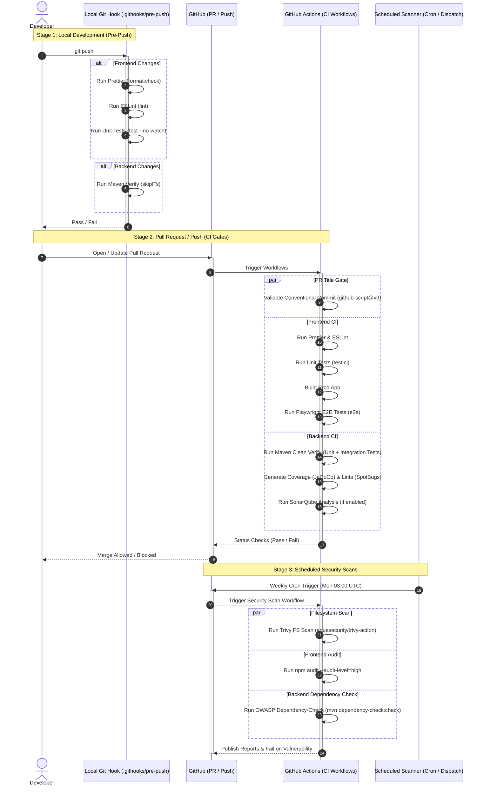

# Project Quality & Security Gates

This document outlines the **Quality and Security Gates** established in this project. We follow a **"Shift-Left"** engineering philosophy: detecting issues as early as possible in the development lifecycle to ensure high code quality, robust security, and reliable deployments.

---

## 🔄 Lifecycle & Gates Sequence

The following diagram illustrates the sequence of checks that code must pass, starting from local development, through Pull Requests, and up to scheduled security scans in production-like environments.



---

## 🛠️ Detailed Gate Breakdown

### 1. Local Pre-Push Gate
* **File**: [.githooks/pre-push](file:///C:/entomo/AI/nexus/.githooks/pre-push)
* **Trigger**: Automatic on `git push`.
* **Behavior**: To optimize speed, this hook scans for changed files and only runs the relevant suite:
  * **Frontend Changes**:
    * `npm run format:check` — Checks code formatting via Prettier.
    * `npm run lint` — Analyzes code quality and style via ESLint.
    * `npm test -- --no-watch` — Runs frontend unit tests.
  * **Backend Changes**:
    * `./mvnw verify -DskipITs` — Compiles the code, runs unit tests, and triggers SpotBugs/JaCoCo (skips slow integration tests).

> [!TIP]
> **To enable this hook locally**, run:
> ```bash
> git config core.hooksPath .githooks
> ```
> If you ever need to bypass the hook in a genuine emergency, use `git push --no-verify`.

---

### 2. Pull Request & Push Gates (CI)
Managed via GitHub Actions on every pull request or push to `main` or `feature/**` branches.

#### A. PR Title Validator
* **Workflow**: [commit-lint.yml](file:///C:/entomo/AI/nexus/.github/workflows/commit-lint.yml)
* **Tool**: `actions/github-script@v9`
* **Checks**: Validates that the pull request title conforms to the **Conventional Commits** specification.
* **Allowed Types**: `feat`, `fix`, `migration`, `docs`, `test`, `refactor`, `chore`, `perf`, `security`, `build`, `ci`.

#### B. Frontend CI
* **Workflow**: [node.yml](file:///C:/entomo/AI/nexus/.github/workflows/node.yml)
* **Environment**: Node.js 24 on Ubuntu Runner.
* **Checks**:
  1. `npm run format:check` — Ensures formatting consistency.
  2. `npm run lint` — Verifies linting rules.
  3. `npm run test:ci` — Runs unit tests and exports code coverage.
  4. `npm run build` — Validates production compilation.
  5. `npm run e2e` — Runs end-to-end user flows in headless Chromium via **Playwright**.

#### C. Backend CI
* **Workflow**: [maven.yml](file:///C:/entomo/AI/nexus/.github/workflows/maven.yml)
* **Environment**: JDK 25 (Temurin) on Ubuntu Runner.
* **Checks**:
  1. `mvn clean verify` — Runs compilation, unit tests, and integration tests.
  2. **SpotBugs** — Runs static analysis to find potential bugs.
  3. **JaCoCo** — Calculates code coverage.
  4. **SonarQube** (Optional) — Performs deep code quality analysis (runs if `SONAR_ENABLED` is set to `true`).

---

### 3. Scheduled Security Gates
Managed via GitHub Actions. Triggered automatically every **Monday at 03:00 UTC** or manually via `workflow_dispatch`.

* **Workflow**: [security.yml](file:///C:/entomo/AI/nexus/.github/workflows/security.yml)
* **Checks**:
  * **Trivy Filesystem Scan** (`aquasecurity/trivy-action`): Scans the repository for static vulnerabilities, secrets leak, and configuration issues. Fails on `CRITICAL` or `HIGH` severity findings.
  * **npm audit (Frontend)**: Runs dependency vulnerability checks with `--audit-level=high`.
  * **OWASP Dependency-Check (Backend)**: Uses the OWASP Dependency-Check Maven plugin to identify publicly disclosed vulnerabilities in backend third-party libraries.

---

## 📋 Quick Reference Table

| Stage | Gate | Tool / Command | Trigger | Action on Failure |
| :--- | :--- | :--- | :--- | :--- |
| **Local** | Formatting | `Prettier` / `npm run format:check` | `git push` | Blocks push |
| **Local** | Linting | `ESLint` / `npm run lint` | `git push` | Blocks push |
| **Local** | Unit Tests (FE) | `Karma/Jest` / `npm test` | `git push` | Blocks push |
| **Local** | Unit Tests (BE) | `Maven` / `./mvnw verify -DskipITs` | `git push` | Blocks push |
| **CI (PR)** | Commit Lint | `github-script` (Conventional Commits) | PR Open/Sync | Blocks PR Merge |
| **CI (PR)** | Frontend Quality | `npm run format:check` + `lint` + `test:ci` | Push / PR | Blocks PR Merge |
| **CI (PR)** | Frontend E2E | `Playwright` / `npm run e2e` | Push / PR | Blocks PR Merge |
| **CI (PR)** | Backend Verify | `Maven` / `mvn clean verify` | Push / PR | Blocks PR Merge |
| **CI (PR)** | Backend Quality | `SpotBugs` + `JaCoCo` + `SonarQube` | Push / PR | Blocks PR Merge |
| **Security** | Dependency Scan (FE)| `npm audit --audit-level=high` | Weekly / Manual | Alerts / Fails Job |
| **Security** | Dependency Scan (BE)| `OWASP Dependency-Check` | Weekly / Manual | Alerts / Fails Job |
| **Security** | Container / FS Scan | `Trivy` (FS scan, severity `HIGH,CRITICAL`) | Weekly / Manual | Fails Job |
