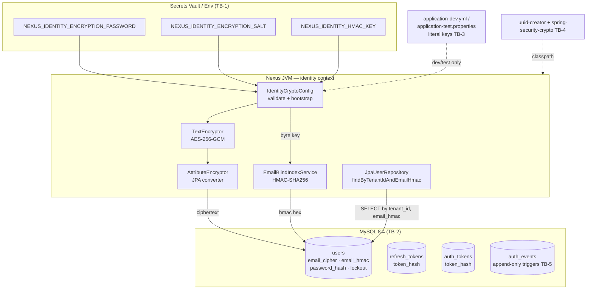

# Threat Model — US-001

**Feature:** US-001 — Establish tenant-aware identity data model and migrations  
**Phase:** 3b — Design-phase STRIDE, Gate 2 input  
**Date:** 2026-06-14  
**Reviewer:** Application Security Engineer  
**Inputs reviewed:** `docs/features/US-001/03-design.md`, `docs/features/US-001/01-requirements.md`,
`SECURITY.md`  
**Dependency scan:** `spring-security-crypto:7.0.5` present transitively; `com.github.f4b6a3:uuid-creator`  
**not yet in pom**; **no Bouncy Castle** on classpath.

> **Explicit review attestation:** This story is almost entirely crypto and PII-handling code
> (AES-256-GCM at-rest encryption, HMAC-SHA256 blind index, SHA-256 token hashing, key bootstrap).
> The encryption design, HMAC oracle/comparison surfaces, key-handling lifecycle, and
> weak-key-leakage paths have been specifically scrutinised.

---

## 1. Scope and Trust Boundaries

US-001 is a backend schema + crypto foundation with **no API, no controller, no frontend, no auth
filter, no runtime entry point**. STRIDE is applied to the boundaries that DO exist:

| # | Trust boundary | Crossing |
|---|----------------|----------|
| TB-1 | Secrets vault / environment → Spring context | 3 key env vars enter the JVM at startup |
| TB-2 | Application process → MySQL (at rest) | `email_cipher`, `email_hmac`, `token_hash` persisted; DBA/root on the far side |
| TB-3 | Source repo / CI → runtime | `application-dev.yml` / `application-test.properties` carry literal keys committed to git |
| TB-4 | Supply chain → build artifact | `uuid-creator` (new, MIT) + transitive `spring-security-crypto` |
| TB-5 | Application code → `auth_events` (audit integrity) | Append-only trigger boundary; everything above (service bug, direct SQL) is "untrusted" |

**In scope:** at-rest confidentiality, blind-index correctness, key bootstrap/validation,
audit-trail tamper-resistance, supply chain.
**Out of scope (deferred):** spoofing/EoP via auth tokens (US-003+), rate limiting (no endpoint),
session handling.

---

## 2. Data Flow Diagram

---

## 3. STRIDE Analysis

Rating scale: **CRITICAL / HIGH / MEDIUM / LOW**.

### 3.1 `users` table

| Threat | STRIDE | Existing mitigation | Required mitigation | Residual |
|--------|--------|---------------------|---------------------|----------|
| Plaintext email recoverable from stolen DB dump / backup | I | `email_cipher` AES-256-GCM; no plaintext email column | Confirm DB backups inherit no decrypted view; document keys are NOT co-located with backups | LOW |
| `email_hmac` lets attacker with DB read confirm whether a known email exists (offline equality check) | I | HMAC is keyed — attacker without HMAC key cannot precompute; per-tenant scoping | Treat `email_hmac` as a secret-adjacent column; document this equality-leak as accepted residual in ADR-0006 | **MEDIUM** |
| Downstream dev inserts a weak/plain value into `password_hash` (no Argon2 logic in US-001) | T | Schema-only; sized for Argon2id; SECURITY.md §2 mandates Argon2id | Column comment in migration noting only Argon2id values must be written; flagged in US-002 review | LOW |
| `email_hmac` writeable after insert → repointed to another user's index | T | `@Column(updatable=false)`, no setter (§2.4) | Verify entity has no Lombok `@Data`/`@Setter` leaking a mutator; assert in unit test (SEC-T9) | LOW |
| `failed_attempt_count` / `locked_until` tampered to bypass lockout | T / EoP | `@Version` optimistic lock; columns inert until US-006 | Flag for US-006 threat model | LOW (deferred) |
| Sequential ID → volume enumeration | I | UUIDv7 PK (non-auto-increment) | Note: UUIDv7 is time-ordered; accepted for internal PK not exposed in US-001 | LOW |

### 3.2 `refresh_tokens` / `auth_tokens` (token_hash)

| Threat | STRIDE | Existing mitigation | Required mitigation | Residual |
|--------|--------|---------------------|---------------------|----------|
| Stolen DB lets attacker replay raw tokens | S / I | Only SHA-256 digest stored (NFR-004) | Token generation (US-002+) must use `SecureRandom.nextBytes(32)` ≥128-bit entropy — record as cross-story contract in ADR-0006 | LOW (in-story) |
| Unsalted SHA-256 rainbow risk | C | Tokens are high-entropy random, not user-chosen → unsalted SHA-256 acceptable (SECURITY.md §6) | Document 128-bit entropy precondition in ADR/`AuthConstants` | LOW |
| Token reuse/rotation events cannot be tied to an audit row | R | `family_id` reuse-detection designed; `TOKEN_REFRESH_REUSE` vocabulary reserved in `auth_events` | Audit-write deferred to US-002 | LOW (deferred) |

### 3.3 `auth_events` table + append-only triggers (TB-5)

| Threat | STRIDE | Existing mitigation | Required mitigation | Residual |
|--------|--------|---------------------|---------------------|----------|
| Buggy service or direct SQL modifies/deletes audit rows | T / R | BEFORE UPDATE + BEFORE DELETE triggers SIGNAL SQLSTATE '45000'; `AuthEventsAppendOnlyIT` | IT must assert the rejected UPDATE leaves the row **byte-identical** | LOW |
| **TRUNCATE auth_events** (bypasses row triggers), `DROP TRIGGER`, `ALTER TABLE` by DBA/root | T | Risk acknowledged as accepted for MVP | **(a)** Document `TRUNCATE` bypass explicitly in ADR-0006; **(b)** specify least-privilege DB grant: app user DML-only, no DDL/TRUNCATE; Flyway runs under a separate DB user (SEC-T4) | **MEDIUM** |
| App DB user holds DDL privileges → removes triggers then tampers | EoP | None | Specify runtime grant (SELECT/INSERT/UPDATE/DELETE only for app user) — SEC-T4 | **MEDIUM** |
| PII written into `metadata` JSON unmasked once US-002 writes rows | I | Design note defers to US-002 | Hard requirement into US-002 threat model; no write path in US-001 | LOW (deferred) |
| CRLF injection via `event_type`/`user_agent`/`ip_address` | T | Inert in US-001 | Input sanitisation at audit-write boundary in US-002 | LOW (deferred) |

### 3.4 `AttributeEncryptor` (AES-256-GCM JPA converter) — HIGH SCRUTINY

| Threat | STRIDE | Existing mitigation | Required mitigation | Residual |
|--------|--------|---------------------|---------------------|----------|
| **`Encryptors.stronger()` silently degrades — no Bouncy Castle on classpath** | C | Design names AES-256-GCM per SECURITY.md §6 | **VERIFY** which GCM provider `spring-security-crypto:7.0.5` uses. If BC is required, add pinned `bcprov-jdk18on`; if JDK-native, document + add IT asserting GCM ciphertext. Must not ship an encryptor that falls back to a weaker mode. (SEC-T1) | **HIGH until verified** |
| Encrypted email not authenticated against bit-flip | T | GCM is AEAD → integrity tag built in; decrypt fails on tamper | Confirm decryption-failure path throws (not returns null/plaintext); cover with negative IT (SEC-T8) | LOW |
| Converter logs plaintext email in exception messages | I | Design: log "fact + key-length only, never the value" | Extend to `AttributeEncryptor`: on encrypt/decrypt failure, never put `EmailCipher.value()` or ciphertext in the exception/log (SEC-T3) | **MEDIUM** |
| `EmailCipher` record `toString()` prints the field → leaks PII in logs/stack traces | I | `record EmailCipher(String value)` auto-generates `toString()` with the value | Override `toString()` to return `"EmailCipher[REDACTED]"` (SEC-T3) | **MEDIUM** |
| Same email encrypts identically (equality leak) | I | `Encryptors.stronger()` uses random IV per call → non-deterministic ciphertext | Add IT asserting two encryptions of the same email produce different ciphertext (SEC-T8) | LOW |

### 3.5 `EmailBlindIndexService` (HMAC-SHA256) — HIGH SCRUTINY

| Threat | STRIDE | Existing mitigation | Required mitigation | Residual |
|--------|--------|---------------------|---------------------|----------|
| **HMAC oracle:** future endpoint timing/error differences confirm email existence | I | No endpoint in US-001 | Document constant-response contract for US-002 lookups (same response + timing for "no such email" vs "wrong password") as a cross-story constraint in ADR-0006 (SEC-T10) | LOW (in-story) |
| Normalisation mismatch → same email yields different `email_hmac` (duplicate accounts) | Insecure design | Design fixes: `trim → NFC → toLowerCase(Locale.ROOT)` | Pin contract in ADR-0006; assert NFC + `Locale.ROOT` (avoid Turkish-İ) in `EmailBlindIndexServiceTest` (SEC-T9) | LOW |
| Non-constant-time HMAC comparison elsewhere leaks timing | C | Comparison delegated to DB SQL equality, not Java `String.equals` on secrets | If Java-side HMAC comparison ever added, require `MessageDigest.isEqual`; none in US-001 | LOW |
| Shared mutable `Mac` instance → cross-thread key/data bleed | I | Design mandates fresh `Mac` per call (§2.2) | Assert no shared `Mac` field in code review (SEC-T9) | LOW |
| HMAC key rotation → mass lockout (all `email_hmac` values invalidated) | DoS | Expand/contract re-index runbook in ADR-0006 | Runbook must be merged with ADR (condition of done) | LOW |

### 3.6 `IdentityCryptoConfig` (key bootstrap + validation) — HIGH SCRUTINY

| Threat | STRIDE | Existing mitigation | Required mitigation | Residual |
|--------|--------|---------------------|---------------------|----------|
| Missing key → app boots with null/empty key, silently no-ops encryption | C | Fail-fast: missing/short key → bean creation fails (§2.6) | Add startup IT asserting context **fails to start** for each absent/short key | LOW |
| **`encryption.password` and `salt` strength not validated** (only HMAC ≥32B validated) | C / Insecure design | HMAC key length check exists | Fail-fast on empty/short `encryption.password`; validate `salt` is valid hex ≥16 bytes; reject weak values (SEC-T2) | **MEDIUM** |
| Startup log leaks key value or salt | I | Design: "log fact + key-length category only, never value" (§10) | Confirm in review: no `log.info(key)` / `log.info(salt)` for sensitive values | LOW |
| Keys held as `String` (immutable, lingers in heap, cannot be zeroed) | I | HMAC key passed as `byte[]` to service (§2.2) | Prefer `byte[]`/`char[]` where API allows; accept residual where `Encryptors` API forces `String` | LOW |

### 3.7 Key bootstrap flow (TB-1: vault → env → context)

| Threat | STRIDE | Existing mitigation | Required mitigation | Residual |
|--------|--------|---------------------|---------------------|----------|
| Keys exposed via `/actuator/env`, `/actuator/configprops`, heap dump | I | Only `/actuator/health`+`/info` public; `anyRequest().authenticated()` | **Verify `nexus.identity.*` is masked by actuator sanitisation**; add `hmac-key` + `salt` to `management.endpoint.env.keys-to-sanitize` (Spring defaults mask `password`/`secret`/`key` but not custom names) (SEC-T6) | **MEDIUM** |
| Same key reused across environments → enlarged blast radius | C | Per-environment vault sourcing; no prod default | Document key separation per environment; HMAC key and encryption password must be distinct values | LOW |
| Env vars visible to other processes (`/proc/<pid>/environ` on shared hosts) | I | Vault → env is industry-standard | Prefer vault-injected file mounts; accept env as residual for MVP | LOW |

### 3.8 Flyway migration `V2__identity_schema.sql`

| Threat | STRIDE | Existing mitigation | Required mitigation | Residual |
|--------|--------|---------------------|---------------------|----------|
| Migration tampered post-merge / checksum drift | T / I | Append-only (ADR-0003); `IdentitySchemaMigrationIT` asserts Flyway checksum stable | Keep checksum assertion; CI runs clean-forward on Testcontainers MySQL 8.4 | LOW |
| Secret accidentally embedded in migration SQL | I | NFR-006: no keys in SQL; `secret-scan` hook on Write/Edit | Confirm `secret-scan` hook covers `.sql` files; review V2 for any literal | LOW |
| `CREATE TRIGGER` parse failure → triggers silently absent → audit not append-only | Insecure design | Single-statement `SIGNAL` form, no `DELIMITER`; `AuthEventsAppendOnlyIT` proves triggers **fired** | Keep "trigger fires" IT (proves presence, not just migration success) | LOW |

### 3.9 Test/dev key material (TB-3)

| Threat | STRIDE | Existing mitigation | Required mitigation | Residual |
|--------|--------|---------------------|---------------------|----------|
| **Weak committed dev/test keys leak to staging/prod** | C / Misconfiguration | Base `application.yml` has no prod default; dev keys profile-scoped; comments warn | **(a)** Verify dev keys are profile-scoped and base profile fails fast when env vars unset; **(b)** verify dev HMAC placeholder is ≥32 bytes; **(c)** add boot guard refusing to start under non-dev/test profile if a known committed dev key value is detected (SEC-T5) | **MEDIUM** |
| Dev salt shorter than prod validation minimum | C | Dev/test only — non-secret | Ensure dev/test salt satisfies the validated bounds if length validation is added (SEC-T2) | LOW |

### 3.10 Supply chain (TB-4)

| Threat | STRIDE | Existing mitigation | Required mitigation | Residual |
|--------|--------|---------------------|---------------------|----------|
| Malicious/compromised `uuid-creator` (new dep, not yet in pom) | A08 | ADR-0005 requires pinned MIT version; OWASP Dependency-Check in CI (fail CVSS≥7) | **Pin exact version** (no range); record license + checksum in ADR-0005; run `dependency-check` once added (SEC-T7) | **MEDIUM until pinned & scanned** |
| `uuid-creator` PK generation weakness (predictable IDs) | I | UUIDv7 `getTimeOrderedEpoch()` uses random tail per spec | Confirm library seeds from `SecureRandom`; UUIDv7 leaks time by design (internal PK — accepted) | LOW |
| **`Encryptors.stronger()` provider gap — no BC on classpath** | C | `spring-security-crypto:7.0.5` present | See SEC-T1 above — unresolved until architect answers | **HIGH until resolved** |

---

## 4. Top Threats Requiring Design Changes (Gate-2 flags)

No CRITICAL ship-stoppers. The following require an answer from the architect before Gate 2 closes:

**1. (BLOCKER — architect) HIGH — GCM provider gap.**
`dependency:tree` shows **no Bouncy Castle** on the classpath. Confirm whether `Encryptors.stronger()`
in `spring-security-crypto:7.0.5` provides genuine AES-256-GCM via JDK providers, or requires BC.
If BC is required, the design must add a **pinned** `bcprov-jdk18on` (and dependency-check-scan it).
Shipping an encryptor that falls back to a non-AEAD mode voids NFR-002. → SEC-T1

**2. (BLOCKER — architect) MEDIUM→HIGH — Salt/password strength not validated.**
`IdentityCryptoConfig` validates only the HMAC key length. An empty or weak `encryption.password` or
malformed `salt` must also fail-fast or a weak encryption key can reach prod undetected. → SEC-T2

**3. MEDIUM — `TRUNCATE auth_events` bypasses row triggers.**
Row triggers do not block `TRUNCATE` (MySQL design). The design and ADR-0006 must (a) state this
limitation and (b) specify the runtime **least-privilege DB grant** (app user: DML-only, no DDL or
TRUNCATE; Flyway under a separate DB user). → SEC-T4

**4. MEDIUM — Dev/test key leak-to-prod guard missing.**
Add a startup check that refuses to boot under a non-dev/test profile if a known committed dev key
value is present, complementing the existing "no prod default" guard. → SEC-T5

**5. MEDIUM — Actuator key exposure.**
`nexus.identity.hmac-key` and `nexus.identity.encryption.salt` may not be matched by the default
sanitisation patterns (`password|secret|key`). Explicit registration required. → SEC-T6

**6. MEDIUM — `uuid-creator` not yet pinned/scanned.**
Cannot assess supply-chain risk until the dependency is in the pom and scanned. → SEC-T7

**7. MEDIUM — `EmailCipher.toString()` / converter error messages may leak PII.**
Override `toString()` to redact; ensure encrypt/decrypt failures never emit the plaintext value. → SEC-T3

---

## 5. Required Mitigation Tasks (→ `04-tasks.md`)

| ID | Task | Severity | Owner |
|----|------|----------|-------|
| SEC-T1 | Verify GCM provider for `Encryptors.stronger()`; add pinned `bcprov-jdk18on` if required; add IT asserting GCM (AEAD), not CBC; re-run dependency-check | HIGH | backend + security |
| SEC-T2 | Extend `IdentityCryptoConfig` to fail-fast on weak/empty `encryption.password` and malformed/short `salt`; unit test each missing/weak key → context fails to start | HIGH | backend |
| SEC-T3 | Override `EmailCipher.toString()` to return `"EmailCipher[REDACTED]"`; ensure `AttributeEncryptor` encrypt/decrypt failures throw typed errors with no plaintext/ciphertext in message or logs | MEDIUM | backend |
| SEC-T4 | Document `auth_events` TRUNCATE/DROP bypass in ADR-0006; specify least-privilege runtime DB grant (DML-only app user, separate Flyway user) | MEDIUM | architect + ops |
| SEC-T5 | Add boot guard rejecting known dev/test key values under non-dev/test profiles | MEDIUM | backend |
| SEC-T6 | Add `nexus.identity.hmac-key` + `nexus.identity.encryption.salt` to actuator key sanitisation; add test asserting they are masked in `/actuator/env` | MEDIUM | backend |
| SEC-T7 | Pin exact `uuid-creator` version (no range), record MIT license + version in ADR-0005, run `-Psecurity dependency-check:check` clean | MEDIUM | backend |
| SEC-T8 | Add IT asserting two encryptions of the same email produce different ciphertext; assert tampered `email_cipher` fails decryption | LOW | backend |
| SEC-T9 | Assert no Lombok `@Setter`/`@Data` mutator on `email_hmac`; pin NFC + `Locale.ROOT` normalisation in `EmailBlindIndexServiceTest` and ADR-0006 | LOW | backend |
| SEC-T10 | Record in ADR-0006: US-002 lookups must give constant 404/timing (no HMAC oracle); token columns require ≥128-bit `SecureRandom` entropy — cross-story constraint | LOW | architect |

---

## 6. Residual Risks Accepted

| Risk | Reason accepted | Re-evaluate at |
|------|-----------------|----------------|
| DBA/root can bypass append-only (`TRUNCATE`/`DROP TRIGGER`) | MySQL 8.4 Community has no RLS; least-privilege grant + future SIEM/WORM store is the real control | EPIC-007 (Audit UI) |
| `email_hmac` equality leak to an attacker holding both the DB and the HMAC key | Inherent to any deterministic blind index; ADR-0006 trades this for indexable lookup; key kept off the DB host | On key-rotation design |
| UUIDv7 leaks creation time | Internal PK, never exposed in a URL in US-001; sequential inserts justify the trade-off | When IDs appear in any API (US-003) |
| Keys live in process env / heap as `String` | Vault→env is industry-standard; `Encryptors` API constrains type; no zeroisation possible | If secret-mount platform becomes available |
| No rate limiting / auth checks | No endpoint, controller, or runtime entry point exists in US-001 | US-002/US-003 (first endpoints) |

---

## 7. OWASP Top 10 Checklist (US-001 scope)

| # | Category | Status | Notes |
|---|----------|--------|-------|
| A01 | Broken Access Control | N/A — deferred | No endpoint/object fetch. Object-level authz, tenant-from-JWT land US-002+. Baseline `anyRequest().authenticated()` unchanged. |
| A02 | Cryptographic Failures | **ACTION REQUIRED** | AES-256-GCM, HMAC-SHA256, SHA-256 chosen correctly. **Open blockers: SEC-T1 (GCM provider), SEC-T2 (salt/password validation).** These gate A02 sign-off. |
| A03 | Injection | PASS | No dynamic SQL; `JpaUserRepository` uses parameter-bound derived query. |
| A04 | Insecure Design | PASS (with notes) | Blind-index + at-rest encryption is sound. Notes: append-only limitation (SEC-T4), dev-key-to-prod guard (SEC-T5). |
| A05 | Security Misconfiguration | **ACTION REQUIRED** | No prod default keys (good). Open: actuator masking (SEC-T6), least-privilege DB grant (SEC-T4). |
| A06 | Vulnerable Components | **ACTION REQUIRED** | `spring-security-crypto:7.0.5` present; no BC (see SEC-T1). `uuid-creator` not yet in pom → cannot scan; must pin + scan (SEC-T7). |
| A07 | Auth Failures | N/A — deferred | No login/session/MFA logic. `token_version`/lockout columns are inert schema. Argon2id `password_hash` is schema-only. |
| A08 | Software & Data Integrity | **ACTION REQUIRED** | Flyway append-only + checksum-stable IT is strong. Open: pin `uuid-creator` exactly (SEC-T7). No untrusted deserialisation. |
| A09 | Logging & Monitoring | PASS (with notes) | `auth_events` schema + triggers is the audit foundation. Crypto config logs key-length category only. `EmailCipher.toString()` redaction required (SEC-T3). |
| A10 | SSRF | N/A | No outbound HTTP / URL construction in US-001. |

---

**Gate-2 recommendation: Conditional pass.**

No CRITICAL/immediately-exploitable issues in the schema/crypto design. **SEC-T1 (GCM provider)
and SEC-T2 (salt/password validation) must be answered by the architect before Gate 2 closes** —
both directly gate the A02 cryptographic-failures sign-off and the NFR-002 at-rest encryption
guarantee. The remaining MEDIUM items (SEC-T3–T7) are scheduled into `04-tasks.md` as
implementation tasks.
