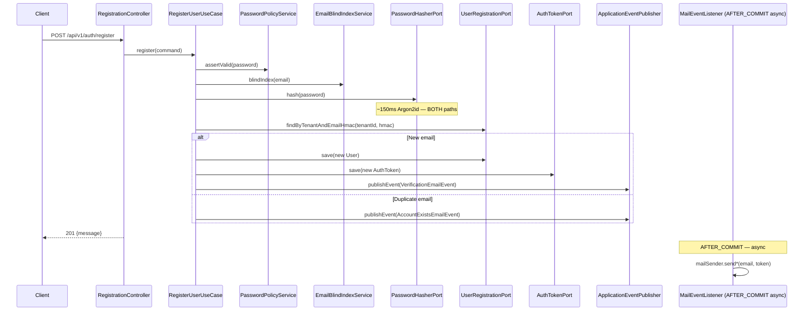
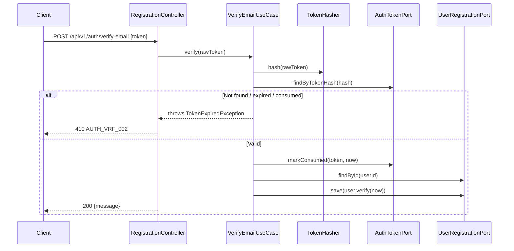

# Technical Design — US-002
## Enable Self-Service Registration with Email Verification

**Status:** DRAFT — awaiting Gate 2 approval  
**Date:** 2026-06-16  
**Author:** Principal Architect  
**Inputs:** `docs/features/US-002/01-requirements.md` (approved, Q1–Q6 resolved),
`docs/features/US-002/02-impact.md` (approved), `docs/features/US-001/03-design.md`,
`ARCHITECTURE.md`, `SECURITY.md`, `docs/coding-standards.md`, ADRs 0001–0006,
`HexagonalArchitectureTest.java`, `pom.xml`

---

## 1. Overview & Scope

US-002 delivers the first user-facing API and Angular flows on the Nexus platform: self-service B2C
registration with email verification. It is the first story to introduce the
`identity.interfaces.rest` package, three application use-cases, outbound ports, a
`MailSenderPort` abstraction, Argon2id password hashing, and the `RegistrationFormComponent` +
`VerificationLandingComponent` Angular components.

**In scope:**
- `POST /api/v1/auth/register` — create PENDING user, dispatch verification email
- `POST /api/v1/auth/verify-email` — consume token, transition user PENDING→ACTIVE
- `POST /api/v1/auth/resend-verification` — issue a new token, throttled
- Angular registration form (WCAG 2.1 AA) and verification landing page
- V3 Flyway migration (one column, one index)
- Feature flag `feature.nexus-us002-auth-registration.enabled`

**Explicitly out of scope:** login (US-003), password reset (US-007), account lockout (US-006),
B2B invite flow (Epic 3), social login, admin-created users, JWT issuance.

---

## 2. Architecture Decisions (binding for implementation)

### 2.1 Anti-enumeration timing strategy

**Problem.** AC-4 requires that registering an existing email returns the same 201 response
with timing uniform to ±50 ms vs a genuine new registration. The hot path includes an Argon2id
hash (~150 ms). If the duplicate path skips the hash, it completes in ~5 ms, leaking the
difference.

**Decision: always compute the Argon2id hash on every registration request, regardless of
whether the email already exists.** The hash is the dominant operation; both paths are
equalized at ~150 ms. The hash result is discarded in the duplicate path.

This is superior to artificial `Thread.sleep()` delays because the cost tracks any future
parameter change automatically.

### 2.2 Async email dispatch — AFTER_COMMIT semantics

**Problem.** If `RegisterUserUseCase` calls the mail port inside a `@Transactional` method,
and email dispatch is `@Async`, there is a subtle race: the async task might start before the
transaction commits, and the token lookup in the email-delivery thread might not find the row.

**Decision: use Spring's `@TransactionalEventListener(phase = AFTER_COMMIT)` pattern.**

`RegisterUserUseCase` publishes a `VerificationEmailEvent` (or `AccountExistsEmailEvent`) via
`ApplicationEventPublisher`. A `@Component` listener in `identity.infrastructure.mail` handles
it with `@Async @TransactionalEventListener(phase = TransactionPhase.AFTER_COMMIT)`. This
guarantees:
1. Email is sent only after the transaction successfully commits.
2. Email failure does not roll back the registration.
3. The use-case has no compile-time dependency on the mail adapter.

**Domain events** live in `identity.application` (not `identity.domain` — they carry
application-layer identifiers and Spring types). The listener lives in `infrastructure.mail`.

### 2.3 Password hash — plain String field, no value-type wrapper

The `email_cipher` field uses `EmailCipher` to give the `AttributeEncryptor` a typed hook
and redact it in `toString()`. `password_hash` does not need encryption (Argon2id is a
one-way function, not a secret). Wrapping it in a value type would require an additional
JPA converter with no security benefit.

**Decision: `String passwordHash` in `User`; no `@Converter`; no value type.** The field
is not logged anywhere. Coding convention (not compiler-enforced) documented in the field
Javadoc.

### 2.4 Verification token generation and storage

- **Raw token:** 32 bytes from `SecureRandom` → `HexFormat.of().formatHex(bytes)` → 64-char
  lowercase hex string. Sent in the verification email link.
- **Stored hash:** `SHA-256(rawBytes)` → 64-char hex. Stored in `auth_tokens.token_hash`.
  The existing `UNIQUE` constraint and `VARCHAR(64)` fit perfectly.
- **Lookup:** receiver presents the 64-char raw token → backend re-derives the SHA-256 hash →
  looks up `auth_tokens.token_hash`. This matches the existing pattern for `email_hmac` and
  is consistent with SECURITY.md §6 ("token stored hashed").

### 2.5 `User` constructor — extended, no existing constructor removed

The existing 4-arg constructor:
```java
public User(UUID id, UUID tenantId, EmailCipher emailCipher, String emailHmac)
```
is used by existing tests. It will be **replaced** with a 6-arg constructor:
```java
public User(UUID id, UUID tenantId, EmailCipher emailCipher, String emailHmac,
            String passwordHash, Instant consentAcceptedAt)
```
All existing tests that call the 4-arg constructor must be updated to supply the two new
required fields. This is an intentional breaking-of-tests-as-refactoring, not a silent API
change — it ensures tests accurately model the domain.

### 2.6 Resend throttle — DB-based, application-layer enforcement

**Decision: `ResendVerificationUseCase` queries `auth_tokens` directly via `AuthTokenPort`
to count tokens issued in the 60-second and 24-hour windows.** Two queries per resend
request. The new `idx_auth_tokens_user_id_type_created_at` index (V3) serves both at O(log n).

No Redis, no in-memory state. Correct under restart and horizontal scale.

### 2.7 `PasswordPolicyService` placement — `identity.application`

The policy rules (length ≥ 12, denylist check) are application-layer business rules. The
denylist is a `Set<String>` injected as a `@Bean` from `PasswordPolicyConfig` (infrastructure).
The `PasswordPolicyService` constructor takes the `Set<String>` — no import of infrastructure
required. ArchUnit is satisfied.

### 2.8 `RegistrationController` feature flag — `@ConditionalOnProperty`

```java
@ConditionalOnProperty(
    name = "feature.nexus-us002-auth-registration.enabled",
    havingValue = "true")
@RestController
@RequestMapping("/api/v1/auth")
public class RegistrationController { ... }
```

When the flag is `false`, the entire bean is absent → Spring MVC returns 404 for all three
endpoints. This is the desired behaviour — 404 does not reveal the endpoint exists.

---

## 3. Package Structure

```
com.example.nexus.identity
├── domain
│   └── User.java                      MODIFIED: passwordHash field, verify() method, 6-arg ctor
│   (all other domain classes unchanged)
│
├── application
│   ├── port
│   │   └── out
│   │       ├── UserRegistrationPort.java     new outbound port
│   │       ├── AuthTokenPort.java            new outbound port
│   │       ├── MailSenderPort.java           new outbound port  (email abstraction)
│   │       └── AuthEventPort.java            new outbound port  (audit)
│   ├── event
│   │   ├── VerificationEmailEvent.java       application event (record)
│   │   └── AccountExistsEmailEvent.java      application event (record)
│   ├── RegisterUserUseCase.java              new @Service @Transactional
│   ├── VerifyEmailUseCase.java               new @Service @Transactional
│   ├── ResendVerificationUseCase.java        new @Service @Transactional
│   ├── PasswordPolicyService.java            new @Service
│   ├── TokenGenerator.java                   new @Service
│   ├── TokenHasher.java                      new @Service
│   └── EmailBlindIndexService.java           UNCHANGED
│
└── infrastructure
    ├── persistence
    │   ├── JpaAuthTokenRepository.java       new Spring Data interface
    │   ├── JpaAuthEventRepository.java       new Spring Data interface
    │   ├── JpaUserRegistrationAdapter.java   new @Component implements UserRegistrationPort
    │   ├── JpaAuthTokenAdapter.java          new @Component implements AuthTokenPort
    │   ├── JpaAuthEventAdapter.java          new @Component implements AuthEventPort
    │   └── (existing persistence classes unchanged)
    ├── mail
    │   ├── SmtpMailSenderAdapter.java        new @Component implements MailSenderPort (dev/prod)
    │   ├── LoggingMailSenderAdapter.java     new @Component @Profile("test") implements MailSenderPort
    │   └── MailEventListener.java            new @Component @Async @TransactionalEventListener
    ├── security
    │   ├── PasswordEncoderConfig.java        new @Configuration — Argon2PasswordEncoder @Bean
    │   └── PasswordPolicyConfig.java         new @Configuration — loads common-passwords.txt
    └── crypto
        └── (existing crypto classes unchanged)

com.example.nexus.identity.interfaces
└── rest
    ├── RegistrationController.java           new @RestController (first interfaces class)
    └── dto
        ├── RegisterRequest.java
        ├── RegisterResponse.java
        ├── VerifyEmailRequest.java
        ├── VerifyEmailResponse.java
        ├── ResendVerificationRequest.java
        └── ResendVerificationResponse.java

com.example.nexus.common
└── domain
    ├── FieldValidationException.java         new — maps to 400
    ├── TokenExpiredException.java            new — maps to 410
    └── RateLimitException.java              new — maps to 429 + Retry-After
```

---

## 4. Domain Model Changes

### 4.1 `User` entity — additions

```java
@Column(name = "password_hash", length = 255, nullable = false)
private String passwordHash;

// 6-arg constructor (replaces 4-arg):
public User(UUID id, UUID tenantId, EmailCipher emailCipher, String emailHmac,
            String passwordHash, Instant consentAcceptedAt) {
    this.id = id;
    this.tenantId = tenantId;
    this.emailCipher = emailCipher;
    this.emailHmac = emailHmac;
    this.passwordHash = passwordHash;
    this.consentAcceptedAt = consentAcceptedAt;
    this.status = UserStatus.PENDING;
    this.tokenVersion = 0;
    this.failedAttemptCount = 0;
}

// State-transition method — enforces PENDING→ACTIVE invariant:
public void verify(Instant emailVerifiedAt) {
    if (this.status != UserStatus.PENDING) {
        throw new IllegalStateException(
            "Cannot verify user in status " + this.status + "; expected PENDING");
    }
    this.status = UserStatus.ACTIVE;
    this.emailVerifiedAt = emailVerifiedAt;
}
```

`passwordHash` has no public setter (immutable after creation except via `@Transactional`
mutation if password reset is added in US-007).

### 4.2 `AuthToken` entity — no changes

`consumed_at`, `expires_at`, `token_hash`, `type=VERIFICATION` all exist. The entity gains
a new convenience factory method (static) used by `TokenGenerator` + use-case:

```java
public static AuthToken forVerification(UUID id, UUID userId, String tokenHash, Instant expiresAt) {
    return new AuthToken(id, userId, AuthTokenType.VERIFICATION, tokenHash, expiresAt);
}
```

---

## 5. Application Layer

### 5.1 Outbound Ports

```java
// identity.application.port.out.UserRegistrationPort
public interface UserRegistrationPort {
    Optional<User> findByTenantAndEmailHmac(UUID tenantId, String emailHmac);
    Optional<User> findById(UUID userId);
    User save(User user);
}

// identity.application.port.out.AuthTokenPort
public interface AuthTokenPort {
    AuthToken save(AuthToken token);
    Optional<AuthToken> findByTokenHash(String tokenHash);
    int countByUserIdAndTypeAndCreatedAtAfter(UUID userId, AuthTokenType type, Instant since);
    AuthToken markConsumed(AuthToken token, Instant consumedAt);
}

// identity.application.port.out.MailSenderPort
public interface MailSenderPort {
    // (not called directly by use-cases — they publish events)
    // Implemented by SmtpMailSenderAdapter and LoggingMailSenderAdapter
}

// identity.application.port.out.AuthEventPort
public interface AuthEventPort {
    void record(AuthEvent event);
}
```

Note: `MailSenderPort` is retained as a marker interface for the infrastructure adapters;
the use-cases interact with mail via `ApplicationEventPublisher`, not this port directly.
This keeps the use-case free of any mail dependency.

### 5.2 Application Events

```java
// identity.application.event.VerificationEmailEvent
public record VerificationEmailEvent(String toEmail, String rawToken, UUID userId) {}

// identity.application.event.AccountExistsEmailEvent
public record AccountExistsEmailEvent(String toEmail) {}
```

### 5.3 `RegisterUserUseCase`

```java
@Service
@Transactional
public class RegisterUserUseCase {

    // Injected: UuidGenerator, EmailBlindIndexService, EmailCipher-producing TextEncryptor,
    //           PasswordPolicyService, Argon2PasswordHasher (via PasswordHasherPort),
    //           UserRegistrationPort, AuthTokenPort, TokenGenerator, TokenHasher,
    //           ApplicationEventPublisher, AuthEventPort, @Value("${nexus.identity.default-tenant-id}")

    public void register(RegisterUserCommand command) {
        // 1. Bean Validation already done by controller layer
        // 2. Password policy (length + denylist) — throws FieldValidationException(AUTH_PWD_001)
        passwordPolicyService.assertValid(command.password());
        // 3. Blind-index
        String emailHmac = emailBlindIndexService.blindIndex(command.email());
        // 4. Argon2id hash — ALWAYS (anti-enumeration: both paths pay this cost)
        String passwordHash = passwordHasher.hash(command.password());
        // 5. Duplicate check
        Optional<User> existing = userPort.findByTenantAndEmailHmac(defaultTenantId, emailHmac);
        if (existing.isPresent()) {
            // Duplicate path: same timing as new path (hash already done above)
            eventPublisher.publishEvent(
                new AccountExistsEmailEvent(existing.get().getEmailCipher().value()));
            auditPort.record(registrationDuplicateEvent(existing.get().getId(), command));
            return; // 201 returned by controller — no exception
        }
        // 6. Create user
        EmailCipher emailCipher = new EmailCipher(textEncryptor.encrypt(command.email()));
        User user = new User(uuidGenerator.newId(), defaultTenantId, emailCipher, emailHmac,
                             passwordHash, Instant.now());
        user = userPort.save(user);
        // 7. Create verification token
        String rawToken = tokenGenerator.generate();
        String tokenHash = tokenHasher.hash(rawToken);
        AuthToken token = AuthToken.forVerification(
            uuidGenerator.newId(), user.getId(), tokenHash,
            Instant.now().plus(AuthConstants.AUTH_VERIFICATION_TOKEN_TTL));
        authTokenPort.save(token);
        // 8. Publish event (mail sent AFTER_COMMIT)
        eventPublisher.publishEvent(
            new VerificationEmailEvent(command.email(), rawToken, user.getId()));
        // 9. Audit
        auditPort.record(registrationInitiatedEvent(user.getId(), command));
    }
}
```

### 5.4 `VerifyEmailUseCase`

```java
@Service
@Transactional
public class VerifyEmailUseCase {

    public void verify(String rawToken) {
        String tokenHash = tokenHasher.hash(rawToken);
        AuthToken token = authTokenPort.findByTokenHash(tokenHash)
            .orElseThrow(() -> new TokenExpiredException("AUTH_VRF_002",
                "Verification token is invalid, expired, or already used."));

        Instant now = Instant.now();
        if (token.getExpiresAt().isBefore(now)) {
            auditPort.record(verificationFailedEvent(token.getUserId(), "EXPIRED"));
            throw new TokenExpiredException("AUTH_VRF_002",
                "Verification token is invalid, expired, or already used.");
        }
        if (token.getConsumedAt() != null) {
            auditPort.record(verificationFailedEvent(token.getUserId(), "ALREADY_CONSUMED"));
            throw new TokenExpiredException("AUTH_VRF_002",
                "Verification token is invalid, expired, or already used.");
        }

        // Atomic: consume token + verify user (optimistic lock on both)
        authTokenPort.markConsumed(token, now);
        User user = userPort.findById(token.getUserId())
            .orElseThrow(() -> new TokenExpiredException("AUTH_VRF_002",
                "Verification token is invalid, expired, or already used."));
        user.verify(now);
        userPort.save(user);
        auditPort.record(verificationSuccessEvent(user.getId()));
    }
}
```

**Note on error message uniformity:** All failure paths for `verify-email` return the same
error message (`"Verification token is invalid, expired, or already used."`) regardless of
the specific failure reason. This avoids leaking whether a token once existed.

### 5.5 `ResendVerificationUseCase`

```java
@Service
@Transactional
public class ResendVerificationUseCase {

    public void resend(String email) {
        String emailHmac = emailBlindIndexService.blindIndex(email);
        Optional<User> userOpt = userPort.findByTenantAndEmailHmac(defaultTenantId, emailHmac);

        // Anti-enumeration: not found or not PENDING → silent success (no email sent)
        if (userOpt.isEmpty() || userOpt.get().getStatus() != UserStatus.PENDING) {
            return;
        }
        User user = userOpt.get();

        // Throttle check: max 1 per 60s
        Instant now = Instant.now();
        int recentCount = authTokenPort.countByUserIdAndTypeAndCreatedAtAfter(
            user.getId(), AuthTokenType.VERIFICATION, now.minusSeconds(60));
        if (recentCount >= 1) {
            // Compute retry-after: seconds until oldest recent token is 60s old
            throw new RateLimitException("AUTH_RES_001",
                "Too many resend requests. Please try again later.", 60);
        }

        // Throttle check: max 5 per 24h
        int dailyCount = authTokenPort.countByUserIdAndTypeAndCreatedAtAfter(
            user.getId(), AuthTokenType.VERIFICATION, now.minus(Duration.ofHours(24)));
        if (dailyCount >= 5) {
            throw new RateLimitException("AUTH_RES_001",
                "Too many resend requests. Please try again later.", 3600);
        }

        // Issue new token
        String rawToken = tokenGenerator.generate();
        String tokenHash = tokenHasher.hash(rawToken);
        AuthToken token = AuthToken.forVerification(
            uuidGenerator.newId(), user.getId(), tokenHash,
            now.plus(AuthConstants.AUTH_VERIFICATION_TOKEN_TTL));
        authTokenPort.save(token);
        eventPublisher.publishEvent(new VerificationEmailEvent(email, rawToken, user.getId()));
        auditPort.record(resendRequestedEvent(user.getId()));
    }
}
```

### 5.6 `PasswordPolicyService`

```java
@Service
public class PasswordPolicyService {

    private final Set<String> commonPasswords;

    public PasswordPolicyService(Set<String> commonPasswordSet) {
        this.commonPasswords = commonPasswordSet;
    }

    public void assertValid(String rawPassword) {
        if (rawPassword == null || rawPassword.length() < 12) {
            throw new FieldValidationException("AUTH_PWD_001", "password",
                "Password must be at least 12 characters.");
        }
        if (commonPasswords.contains(rawPassword)) {
            throw new FieldValidationException("AUTH_PWD_001", "password",
                "Password appears in a list of common or compromised passwords.");
        }
    }
}
```

---

## 6. Infrastructure Layer

### 6.1 Argon2 password hashing

```java
// identity.infrastructure.security.PasswordEncoderConfig
@Configuration
public class PasswordEncoderConfig {

    @Bean
    Argon2PasswordEncoder argon2PasswordEncoder(
            @Value("${nexus.identity.argon2.memory-kb:19456}") int memoryKb,
            @Value("${nexus.identity.argon2.iterations:2}")    int iterations,
            @Value("${nexus.identity.argon2.parallelism:1}")   int parallelism) {
        return new Argon2PasswordEncoder(
            16,          // saltLength (bytes)
            32,          // hashLength (bytes)
            parallelism,
            memoryKb,
            iterations);
    }

    // PasswordHasherPort wrapper used by RegisterUserUseCase
    @Bean
    PasswordHasherPort passwordHasher(Argon2PasswordEncoder encoder) {
        return encoder::encode;
    }
}
```

`PasswordHasherPort` is a `@FunctionalInterface` in `identity.application.port.out`:
```java
@FunctionalInterface
public interface PasswordHasherPort {
    String hash(String rawPassword);
}
```

### 6.2 Mail event listener

```java
// identity.infrastructure.mail.MailEventListener
@Component
public class MailEventListener {

    private final MailSenderPort mailSender;      // SmtpMailSenderAdapter or LoggingMailSenderAdapter

    @Async
    @TransactionalEventListener(phase = TransactionPhase.AFTER_COMMIT)
    public void onVerificationEmail(VerificationEmailEvent event) {
        // rawToken is sent in link — never logged
        mailSender.sendVerificationEmail(event.toEmail(), event.rawToken());
    }

    @Async
    @TransactionalEventListener(phase = TransactionPhase.AFTER_COMMIT)
    public void onAccountExists(AccountExistsEmailEvent event) {
        mailSender.sendAccountExistsEmail(event.toEmail());
    }
}
```

`@Async` requires `@EnableAsync` on a `@Configuration` class (add to `PasswordEncoderConfig`
or a new `AsyncConfig`). Thread pool: Spring's default task executor (configurable via
`spring.task.execution.pool.*`).

### 6.3 SMTP adapter

```java
// identity.infrastructure.mail.SmtpMailSenderAdapter
@Component
@ConditionalOnMissingBean(name = "loggingMailSenderAdapter")
public class SmtpMailSenderAdapter implements MailSenderPort {

    private final JavaMailSender mailSender;
    private final String fromAddress;

    public void sendVerificationEmail(String toEmail, String rawToken) {
        SimpleMailMessage msg = new SimpleMailMessage();
        msg.setFrom(fromAddress);
        msg.setTo(toEmail);
        msg.setSubject("Verify your Nexus account");
        // rawToken is NOT logged; URL is safe to include in email body
        msg.setText("Click to verify: " + verificationUrl(rawToken));
        mailSender.send(msg);
    }

    public void sendAccountExistsEmail(String toEmail) {
        SimpleMailMessage msg = new SimpleMailMessage();
        msg.setFrom(fromAddress);
        msg.setTo(toEmail);
        msg.setSubject("Nexus account registration attempt");
        msg.setText("An account with this email already exists. "
            + "If you forgot your password, use the password reset flow.");
        mailSender.send(msg);
    }

    private String verificationUrl(String rawToken) {
        return frontendBaseUrl + "/auth/verify-email?token=" + rawToken;
    }
}
```

`fromAddress` and `frontendBaseUrl` injected from config (`nexus.mail.from-address`,
`nexus.frontend.base-url`). Add both to `application.yml`.

### 6.4 Password policy config

```java
// identity.infrastructure.security.PasswordPolicyConfig
@Configuration
public class PasswordPolicyConfig {

    @Bean
    Set<String> commonPasswordSet() {
        try (InputStream is = getClass().getResourceAsStream("/security/common-passwords.txt")) {
            if (is == null) {
                throw new IllegalStateException(
                    "common-passwords.txt not found in classpath:/security/");
            }
            return new BufferedReader(new InputStreamReader(is, StandardCharsets.UTF_8))
                .lines()
                .map(String::trim)
                .filter(line -> !line.isEmpty())
                .collect(Collectors.toUnmodifiableSet());
        } catch (IOException e) {
            throw new IllegalStateException("Failed to load common-passwords.txt", e);
        }
    }
}
```

### 6.5 Common exception additions

```java
// common.domain.FieldValidationException
public class FieldValidationException extends DomainException {
    private final String field;
    public FieldValidationException(String code, String field, String message) {
        super(code, message);
        this.field = field;
    }
    public String getField() { return field; }
}

// common.domain.TokenExpiredException
public class TokenExpiredException extends DomainException {
    public TokenExpiredException(String code, String message) { super(code, message); }
}

// common.domain.RateLimitException
public class RateLimitException extends DomainException {
    private final long retryAfterSeconds;
    public RateLimitException(String code, String message, long retryAfterSeconds) {
        super(code, message);
        this.retryAfterSeconds = retryAfterSeconds;
    }
    public long getRetryAfterSeconds() { return retryAfterSeconds; }
}
```

`GlobalExceptionHandler` additions:
```java
@ExceptionHandler(FieldValidationException.class)
ProblemDetail handleFieldValidation(FieldValidationException e) {
    ProblemDetail problem = problem(HttpStatus.BAD_REQUEST, e.code(), e.getMessage());
    problem.setProperty("details",
        List.of(Map.of("field", e.getField(), "message", e.getMessage())));
    return problem;
}

@ExceptionHandler(TokenExpiredException.class)
ProblemDetail handleTokenExpired(TokenExpiredException e) {
    return problem(HttpStatus.GONE, e.code(), e.getMessage());
}

@ExceptionHandler(RateLimitException.class)
ResponseEntity<ProblemDetail> handleRateLimit(RateLimitException e) {
    ProblemDetail problem = problem(HttpStatus.TOO_MANY_REQUESTS, e.code(), e.getMessage());
    return ResponseEntity.status(HttpStatus.TOO_MANY_REQUESTS)
        .header("Retry-After", String.valueOf(e.getRetryAfterSeconds()))
        .body(problem);
}
```

---

## 7. API Contract

### 7.1 `POST /api/v1/auth/register`

**Request:**
```json
{
  "email": "user@example.com",
  "password": "Str0ng!Password99",
  "consentAccepted": true
}
```

**Validation (Bean Validation on `RegisterRequest`):**
- `email`: `@NotBlank @Email(regexp = "...", flags = CASE_INSENSITIVE)` max 254 chars
- `password`: `@NotBlank @Size(max = 1024)` (max prevents DoS on long inputs; policy check is in service)
- `consentAccepted`: `@AssertTrue(message = "Consent is required to register.")`

**Response 201 — new email OR duplicate email (identical):**
```json
{
  "message": "Registration successful. Please check your email to verify your account."
}
```

**Response 400 — password policy:**
```json
{
  "status": 400,
  "code": "AUTH_PWD_001",
  "detail": "Password must be at least 12 characters.",
  "traceId": "uuid-here",
  "details": [{ "field": "password", "message": "Password must be at least 12 characters." }]
}
```

**Response 400 — missing consent:**
```json
{
  "status": 400,
  "code": "VALIDATION_FAILED",
  "detail": "Request validation failed.",
  "traceId": "uuid-here",
  "details": [{ "field": "consentAccepted", "message": "Consent is required to register." }]
}
```

**Response 400 — general validation:**
```json
{
  "status": 400,
  "code": "VALIDATION_FAILED",
  "detail": "Request validation failed.",
  "traceId": "uuid-here",
  "details": [{ "field": "email", "message": "must be a well-formed email address" }]
}
```

---

### 7.2 `POST /api/v1/auth/verify-email`

**Request:**
```json
{ "token": "64-lowercase-hex-chars" }
```

Validation: `@NotBlank @Pattern(regexp = "[0-9a-f]{64}")`.

**Response 200 — success:**
```json
{
  "message": "Email verified successfully. You can now log in."
}
```

**Response 410 — expired / consumed / invalid:**
```json
{
  "status": 410,
  "code": "AUTH_VRF_002",
  "detail": "Verification token is invalid, expired, or already used.",
  "traceId": "uuid-here"
}
```

---

### 7.3 `POST /api/v1/auth/resend-verification`

**Request:**
```json
{ "email": "user@example.com" }
```

**Response 200 — always (account found or not, anti-enumeration):**
```json
{
  "message": "If your account is pending verification, a new link has been sent."
}
```

**Response 429 — throttle exceeded:**
```json
{
  "status": 429,
  "code": "AUTH_RES_001",
  "detail": "Too many resend requests. Please try again later.",
  "traceId": "uuid-here"
}
```
Header: `Retry-After: 60` (seconds).

---

## 8. Sequence Diagrams

### Registration flow



### Verification flow



---

## 9. Database Design

### V3 migration — `V3__add_password_hash_to_users.sql`

```sql
-- V3__add_password_hash_to_users.sql
-- Adds password_hash required by US-002 registration.
-- Argon2id output (salt + hash + params) encoded as Spring Security prefix string fits in 255.
-- DEFAULT '' is a migration convenience: the users table is empty when V3 runs.
-- Rows with password_hash = '' cannot pass Argon2id.matches() verification (US-003).
-- Append-only (ADR-0003) — never edit after first apply.

ALTER TABLE users
    ADD COLUMN password_hash VARCHAR(255) NOT NULL DEFAULT '';

-- Throttle index: serves ResendVerificationUseCase COUNT queries efficiently.
-- Predicate: user_id = ? AND type = ? AND created_at > ?
-- The existing idx_auth_tokens_user_id_type_consumed_at covers (user_id, type) only;
-- this index adds created_at range for optimal throttle-window scans.
CREATE INDEX idx_auth_tokens_user_id_type_created_at
    ON auth_tokens (user_id, type, created_at);
```

### Index strategy

| Index | Table | Serves | Status |
|-------|-------|--------|--------|
| `uq_users_tenant_id_email_hmac` UNIQUE | `users` | Duplicate-email check + anti-enumeration | Existing (V2) |
| `idx_auth_tokens_user_id_type_consumed_at` | `auth_tokens` | Active unconsumed token lookup | Existing (V2) |
| `uq_auth_tokens_token_hash` UNIQUE | `auth_tokens` | Token hash lookup | Existing (V2) |
| `idx_auth_tokens_user_id_type_created_at` | `auth_tokens` | Resend throttle COUNT | **NEW (V3)** |

---

## 10. Frontend Design

### Route structure

```typescript
// app.routes.ts addition
{
  path: 'auth',
  loadChildren: () =>
    import('./features/auth/auth.routes').then(m => m.AUTH_ROUTES)
}

// features/auth/auth.routes.ts
export const AUTH_ROUTES: Routes = [
  {
    path: 'register',
    loadComponent: () =>
      import('./registration/registration-form.component')
        .then(m => m.RegistrationFormComponent)
  },
  {
    path: 'verify-email',
    loadComponent: () =>
      import('./verification/verification-landing.component')
        .then(m => m.VerificationLandingComponent)
  }
];
```

### `AuthService`

```typescript
@Injectable({ providedIn: 'root' })
export class AuthService {
  private readonly http = inject(HttpClient);
  private readonly config = inject(APP_CONFIG);

  register(req: RegistrationRequest): Observable<void> {
    return this.http.post<void>(`${this.config.apiBaseUrl}/api/v1/auth/register`, req)
      .pipe(map(() => undefined));
  }

  verifyEmail(token: string): Observable<void> {
    return this.http.post<void>(`${this.config.apiBaseUrl}/api/v1/auth/verify-email`,
      { token }).pipe(map(() => undefined));
  }

  resendVerification(email: string): Observable<void> {
    return this.http.post<void>(`${this.config.apiBaseUrl}/api/v1/auth/resend-verification`,
      { email }).pipe(map(() => undefined));
  }
}
```

### `RegistrationFormComponent` (smart)

Signals-based state:

```typescript
type RegState = 'idle' | 'submitting' | 'success' | 'error';

export class RegistrationFormComponent {
  private readonly authService = inject(AuthService);
  protected readonly state = signal<RegState>('idle');
  protected readonly error = signal<AppError | null>(null);
  protected readonly form = new FormGroup({
    email:           new FormControl('', [Validators.required, Validators.email]),
    password:        new FormControl('', [Validators.required, Validators.minLength(12)]),
    consentAccepted: new FormControl(false, [Validators.requiredTrue])
  });

  protected submit(): void {
    if (this.form.invalid) return;
    this.state.set('submitting');
    this.authService.register(this.form.value as RegistrationRequest).subscribe({
      next:  () => this.state.set('success'),
      error: (e: AppError) => { this.error.set(e); this.state.set('error'); }
    });
  }
}
```

Template uses `@if`/`@switch` control flow, `nx-input`, `nx-button`, `nx-card`.
Consent checkbox: `<mat-checkbox formControlName="consentAccepted">` with
`aria-describedby` wired to error message span.

### `PasswordStrengthMeterComponent` (dumb)

```typescript
@Component({
  selector: 'nx-password-strength-meter',
  standalone: true,
  imports: [MatIconModule],
  template: `
    <div class="strength-meter" role="status" [attr.aria-label]="'Password strength: ' + label()">
      <mat-icon>{{ icon() }}</mat-icon>
      <span class="strength-label">{{ label() }}</span>
      <div class="strength-bars">
        @for (i of [1,2,3,4]; track i) {
          <div class="bar" [class.filled]="score() >= i"></div>
        }
      </div>
    </div>
  `
})
export class PasswordStrengthMeterComponent {
  readonly password = input.required<string>();
  protected readonly score = computed(() => this.calculateScore(this.password()));
  protected readonly label = computed(() =>
    ['', 'Weak', 'Fair', 'Good', 'Strong'][this.score()]);
  protected readonly icon = computed(() =>
    ['', 'lock_open', 'lock_open', 'lock', 'lock'][this.score()]);
  // ...
}
```

Score is based on: length ≥ 12 (+1), uppercase (+1), digit (+1), special char (+1).
Text + icon conveys level — color bars are supplementary only (WCAG AC-7).

### `VerificationLandingComponent` (smart)

Reads `?token=` from `ActivatedRoute` signal, calls `authService.verifyEmail()` on init.
Renders three states: `verifying` (spinner), `success` (check icon + login link), `error`
(icon + error message with resend option).

---

## 11. Observability

### Audit events (written to `auth_events`)

| `event_type` | `outcome` | Trigger |
|-------------|-----------|---------|
| `REGISTRATION_INITIATED` | `SUCCESS` | New user created |
| `REGISTRATION_DUPLICATE_EMAIL` | `BLOCKED` | Duplicate email detected |
| `VERIFICATION_SUCCESS` | `SUCCESS` | Token consumed, user ACTIVE |
| `VERIFICATION_FAILED` | `FAILURE` | Invalid/expired/consumed token |
| `RESEND_REQUESTED` | `SUCCESS` | New token issued |
| `RESEND_THROTTLED` | `BLOCKED` | Rate limit exceeded |

`metadata` JSON: `{ "traceId": "...", "ip": "...", "userAgent": "..." }`

### Micrometer metrics

| Metric | Type | Labels |
|--------|------|--------|
| `nexus_auth_register_requests_total` | Counter | `outcome` (success, duplicate, policy_failure, validation_failure) |
| `nexus_auth_register_duration_seconds` | Histogram | — |
| `nexus_auth_verify_requests_total` | Counter | `outcome` (success, expired, consumed) |
| `nexus_auth_resend_requests_total` | Counter | `outcome` (success, throttled, not_pending) |

### Log discipline

- `INFO`: User registered (`userId=xxx email=u***@example.com tenantId=xxx`)
- `INFO`: Email verified (`userId=xxx`)
- `WARN`: Verification token expired or consumed (`tokenId=xxx`)
- `WARN`: Resend throttled (`userId=xxx`)
- **NEVER log**: raw token, raw email (always mask), password hash

---

## 12. Configuration

### New `application.yml` properties

```yaml
nexus:
  identity:
    default-tenant-id: ${NEXUS_IDENTITY_DEFAULT_TENANT_ID}
    argon2:
      memory-kb: ${NEXUS_ARGON2_MEMORY_KB:19456}
      iterations: ${NEXUS_ARGON2_ITERATIONS:2}
      parallelism: ${NEXUS_ARGON2_PARALLELISM:1}
  mail:
    from-address: ${NEXUS_MAIL_FROM_ADDRESS:noreply@nexus.example.com}
  frontend:
    base-url: ${NEXUS_FRONTEND_BASE_URL:http://localhost:2000}

spring:
  mail:
    host: ${MAIL_HOST}
    port: ${MAIL_PORT:587}
    username: ${MAIL_USERNAME:}
    password: ${MAIL_PASSWORD:}

feature:
  nexus-us002-auth-registration:
    enabled: ${FEATURE_AUTH_REGISTRATION_ENABLED:false}
```

### `TestcontainersConfiguration` additions

```java
registry.add("nexus.identity.default-tenant-id",
    () -> "00000000-0000-7000-8000-000000000001");
registry.add("nexus.identity.argon2.memory-kb",   () -> "4096");
registry.add("nexus.identity.argon2.iterations",  () -> "1");
registry.add("nexus.identity.argon2.parallelism", () -> "1");
registry.add("spring.mail.host",  () -> "localhost");
registry.add("spring.mail.port",  () -> "1025");
registry.add("nexus.mail.from-address", () -> "test@nexus.test");
registry.add("nexus.frontend.base-url", () -> "http://localhost:2000");
registry.add("feature.nexus-us002-auth-registration.enabled", () -> "true");
```

---

## 13. Feature Flag & Rollout

| Property | Default | Dev | Staging | Prod |
|----------|---------|-----|---------|------|
| `feature.nexus-us002-auth-registration.enabled` | `false` | `true` | `true` | `false` → ramp |

**Production rollout:**
- Day 1: flag on for 1% of traffic (canary via API gateway header injection)
- Day 2: 10% — monitor error rate + registration p95
- Day 3: 50% — check email deliverability metrics
- Day 4: 100% → schedule flag removal in US-003 sprint

**Kill switch:** set `FEATURE_AUTH_REGISTRATION_ENABLED=false` in all envs → restart → 404
on all auth endpoints within 1 minute.

---

## 14. Test Design

### Unit tests (no Spring context)

| Class | Key assertions |
|-------|---------------|
| `RegisterUserUseCaseTest` | Happy path; duplicate email (same return, different event); password policy failure (AUTH_PWD_001); missing consent → event not published; always hashes password on both paths |
| `VerifyEmailUseCaseTest` | Success; expired token → 410; already consumed → 410; optimistic lock conflict handled |
| `ResendVerificationUseCaseTest` | Success; throttle 60s exceeded → 429; throttle 24h exceeded → 429; non-PENDING account → silent 200; not found → silent 200 |
| `PasswordPolicyServiceTest` | Min-length failure; denylist hit; valid password passes |
| `TokenGeneratorTest` | 64 chars; lowercase hex; distinctness (100 calls, no duplicates) |
| `TokenHasherTest` | Deterministic; 64 chars; distinct inputs → distinct hashes |

### Integration tests (`*IT`, Testcontainers MySQL)

| Class | Key scenarios |
|-------|--------------|
| `RegistrationIT` | Full register→verify→ACTIVE; duplicate email returns 201 and sends account-exists event; V3 schema valid under `ddl-auto=validate` |
| `ResendVerificationIT` | Throttle: 2nd resend within 60s → 429; 6th within 24h → 429; resend after expiry works |
| `VerificationTokenIT` | Token consumed once → 200; second use → 410; expired token → 410 |
| `IdentitySchemaMigrationIT` (update) | Assert V3 `password_hash` column present; new index present |

### Controller tests (`@SpringBootTest` web layer)

| Class | Key scenarios |
|-------|--------------|
| `RegistrationControllerIT` | HTTP contract for all 3 endpoints; error codes; feature flag off → 404; anti-enumeration timing (assert both paths within ±50 ms) |

### Frontend tests (Vitest)

| File | Key assertions |
|------|---------------|
| `auth.service.spec.ts` | HTTP calls wired correctly; `AppError` propagated |
| `registration-form.component.spec.ts` | Consent required; submit disabled while invalid; success state shown; error state shown with field errors |
| `password-strength-meter.component.spec.ts` | Score 0–4; text label + icon match score; aria-label present |
| `verification-landing.component.spec.ts` | Reads token from query param; success / 410 / generic error states |

---

## 15. Files to Create / Modify

| Action | Path |
|--------|------|
| MODIFY | `nexus-backend/src/main/java/com/example/nexus/identity/domain/User.java` |
| MODIFY | `nexus-backend/src/main/java/com/example/nexus/config/SecurityConfig.java` |
| MODIFY | `nexus-backend/src/main/java/com/example/nexus/common/web/GlobalExceptionHandler.java` |
| MODIFY | `nexus-backend/src/main/resources/application.yml` |
| MODIFY | `nexus-backend/src/main/resources/application-dev.yml` |
| MODIFY | `nexus-backend/src/main/resources/application-smoke.yml` (test) |
| MODIFY | `nexus-backend/src/test/java/com/example/nexus/TestcontainersConfiguration.java` |
| MODIFY | `nexus-backend/pom.xml` |
| MODIFY | `docker-compose.yml` |
| MODIFY | `nexus-frontend/src/app/app.routes.ts` |
| MODIFY | `nexus-frontend/src/app/app.ts` |
| CREATE | `nexus-backend/src/main/resources/db/migration/V3__add_password_hash_to_users.sql` |
| CREATE | `nexus-backend/src/main/resources/security/common-passwords.txt` |
| CREATE | `nexus-backend/src/main/java/com/example/nexus/common/domain/FieldValidationException.java` |
| CREATE | `nexus-backend/src/main/java/com/example/nexus/common/domain/TokenExpiredException.java` |
| CREATE | `nexus-backend/src/main/java/com/example/nexus/common/domain/RateLimitException.java` |
| CREATE | `nexus-backend/src/main/java/com/example/nexus/identity/application/port/out/UserRegistrationPort.java` |
| CREATE | `nexus-backend/src/main/java/com/example/nexus/identity/application/port/out/AuthTokenPort.java` |
| CREATE | `nexus-backend/src/main/java/com/example/nexus/identity/application/port/out/PasswordHasherPort.java` |
| CREATE | `nexus-backend/src/main/java/com/example/nexus/identity/application/port/out/AuthEventPort.java` |
| CREATE | `nexus-backend/src/main/java/com/example/nexus/identity/application/event/VerificationEmailEvent.java` |
| CREATE | `nexus-backend/src/main/java/com/example/nexus/identity/application/event/AccountExistsEmailEvent.java` |
| CREATE | `nexus-backend/src/main/java/com/example/nexus/identity/application/RegisterUserUseCase.java` |
| CREATE | `nexus-backend/src/main/java/com/example/nexus/identity/application/VerifyEmailUseCase.java` |
| CREATE | `nexus-backend/src/main/java/com/example/nexus/identity/application/ResendVerificationUseCase.java` |
| CREATE | `nexus-backend/src/main/java/com/example/nexus/identity/application/PasswordPolicyService.java` |
| CREATE | `nexus-backend/src/main/java/com/example/nexus/identity/application/TokenGenerator.java` |
| CREATE | `nexus-backend/src/main/java/com/example/nexus/identity/application/TokenHasher.java` |
| CREATE | `nexus-backend/src/main/java/com/example/nexus/identity/infrastructure/persistence/JpaAuthTokenRepository.java` |
| CREATE | `nexus-backend/src/main/java/com/example/nexus/identity/infrastructure/persistence/JpaAuthEventRepository.java` |
| CREATE | `nexus-backend/src/main/java/com/example/nexus/identity/infrastructure/persistence/JpaUserRegistrationAdapter.java` |
| CREATE | `nexus-backend/src/main/java/com/example/nexus/identity/infrastructure/persistence/JpaAuthTokenAdapter.java` |
| CREATE | `nexus-backend/src/main/java/com/example/nexus/identity/infrastructure/persistence/JpaAuthEventAdapter.java` |
| CREATE | `nexus-backend/src/main/java/com/example/nexus/identity/infrastructure/mail/SmtpMailSenderAdapter.java` |
| CREATE | `nexus-backend/src/main/java/com/example/nexus/identity/infrastructure/mail/LoggingMailSenderAdapter.java` |
| CREATE | `nexus-backend/src/main/java/com/example/nexus/identity/infrastructure/mail/MailEventListener.java` |
| CREATE | `nexus-backend/src/main/java/com/example/nexus/identity/infrastructure/security/PasswordEncoderConfig.java` |
| CREATE | `nexus-backend/src/main/java/com/example/nexus/identity/infrastructure/security/PasswordPolicyConfig.java` |
| CREATE | `nexus-backend/src/main/java/com/example/nexus/identity/interfaces/rest/RegistrationController.java` |
| CREATE | `nexus-backend/src/main/java/com/example/nexus/identity/interfaces/rest/dto/*.java` (6 DTOs) |
| CREATE | `nexus-frontend/src/app/features/auth/**` (12 files per §10) |
