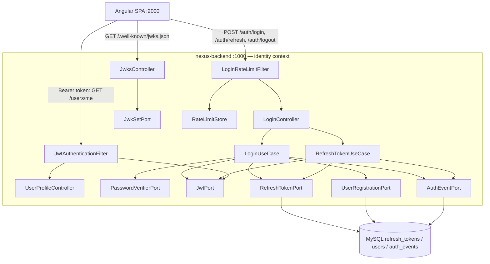

# US-003 Technical Design — Authenticate users via login issuing JWT access and refresh tokens

Status: DRAFT — awaiting Gate 2 approval
Author: Architect Agent
Date: 2026-06-21

## 1. Overview

US-003 adds the login flow to the existing `com.example.nexus.identity` bounded context. A registered, email-verified user submits `email + password`; `LoginUseCase` looks the user up by blind-indexed email, verifies the password against the stored Argon2id hash with a constant-time anti-enumeration path, gates on `status == ACTIVE`, then issues an **RS256 access JWT** (15-min TTL, 8-claim frozen contract) and a rotating **refresh token** (14-day TTL, delivered as an `HttpOnly; Secure; SameSite=Strict` cookie). A `JwtAuthenticationFilter` populates `SecurityContextHolder` for every protected route, a `JwksController` publishes the active public key, and a `UserProfileController` echoes the caller's claims. This is the first authentication capability in the platform; its claims contract and `SecurityConfig` overhaul are the highest-blast-radius elements and gate every downstream story (US-004/005/006/008). No new bounded context, no required schema change — `refresh_tokens` was fully defined in V2.

## 2. Architecture Decision: JWT Library (ADR-worthy)

| Criterion | JJWT 0.12.x (`jjwt-api`/`impl`/`jackson`) | Spring Security OAuth2 Resource Server (Nimbus) |
|-----------|-------------------------------------------|-------------------------------------------------|
| Surface area | Small, focused builder/parser API; exactly what issuance + verification needs | Full resource-server stack (`JwtDecoder`, `JwtEncoder`, `BearerTokenAuthenticationFilter`, introspection, autoconfig) |
| Autoconfig interaction | None — pure library, no Spring beans contributed | `spring-boot-starter-oauth2-resource-server` autoconfigures a `JwtDecoder` and wires its own bearer filter; collides with the **custom `SecurityConfig`** (HTTP Basic placeholder being replaced by a hand-rolled `JwtAuthenticationFilter` for full control over the 401 RFC 7807 shape) |
| Issuance | First-class `Jwts.builder()` — we need to **issue** tokens, not just validate them; resource-server starters are validation-oriented | `JwtEncoder` exists but is secondary; the starter's center of gravity is validation |
| Algorithm allowlisting | Explicit per-parse algorithm pinning (RS256 only); trivial to reject `alg=none`/HS256 | Configurable but indirected through `JwtDecoder` builders |
| JWKS building | Built from the `KeyPair` we already hold; no extra abstraction | Nimbus `JWKSet` is richer but heavier |
| Dependency weight | 3 small artifacts, Apache-2.0 | Larger transitive footprint, more CVE surface |

**Decision: JJWT 0.12.x.** The decisive factor is the **autoconfig conflict**: the platform deliberately runs a single hand-built `SecurityFilterChain` with a custom RFC 7807 `AuthenticationEntryPoint`/`AccessDeniedHandler`. Pulling in the resource-server starter introduces an opinionated `BearerTokenAuthenticationFilter` and `JwtDecoder` autoconfiguration we would have to actively disable, fighting the framework. US-003 needs token **issuance** plus narrow, allowlisted verification — JJWT gives exactly that with a smaller surface and no bean collisions. Spring's resource-server path is the right tool when Nexus becomes a pure resource server behind an external IdP; it is not the right tool while Nexus is itself the issuer.

**This is an ADR candidate → ADR-0007 "JWT issuance via JJWT, not OAuth2 Resource Server".** Recommend confirming at Gate 2 (see §15).

## 3. System Context Diagram (Mermaid)



## 4. Component Design

Hexagonal layering (ADR-0002) is honoured throughout: `domain` and `application` never import `infrastructure`/`interfaces`; ports are interfaces in `application/port/out`; adapters live in `infrastructure`; `@Transactional` is on application use-cases only; controllers map to DTOs and never return entities.

### 4.1 Domain Layer

**New exceptions** (in `common/domain`, mirroring the existing `DomainException` hierarchy):

- `AuthenticationException extends DomainException` — code `AUTH_001`, maps to **401**. Thrown for bad credentials, unknown email, invalid/expired refresh token, and theft detection. The handler must NOT differentiate cause in the response body (anti-enumeration).
- `AccountNotVerifiedException extends DomainException` — code `AUTH_002`, maps to **403**. Thrown when `status == PENDING`.

Note: `GlobalExceptionHandler` today has no 401 handler (only `AccessDeniedException` → 403, and the `DomainException` catch-all → 422). A new `@ExceptionHandler(AuthenticationException.class)` returning 401 is required (see §6) — without it, `AuthenticationException` would fall through to the 422 catch-all. This is a flagged risk.

**`RefreshToken.revoke(Instant revokedAt)`** — a domain method, not a setter. It sets `this.revokedAt = revokedAt`. It must be a domain method because:
1. Revocation is a state transition with an invariant (idempotency — re-revoking an already-revoked token is a theft signal handled by the use-case, but the entity itself simply records the timestamp).
2. The entity uses `@NoArgsConstructor(PROTECTED)` + `@Getter` only; exposing a public setter would violate encapsulation and let any caller mutate `revokedAt` arbitrarily. Following the existing `User.verify(Instant)` precedent keeps mutation behind intention-revealing methods.

**`AccessTokenResult`** (domain value object): `record AccessTokenResult(String token, long expiresInSeconds, String jti)`.

**`AuthConstants` change:** `AUTH_REFRESH_TOKEN_TTL_DAYS` 7 → 14 (Gate-1 Q1). Load-bearing for both the cookie `Max-Age` and the DB `expires_at`.

### 4.2 Application Layer — Ports (outbound)

Signatures only — no implementation. Each is an interface in `identity/application/port/out` (or `common` where cross-context).

```
// RefreshTokenPort
void save(RefreshToken token);
Optional<RefreshToken> findByTokenHash(String tokenHash);
void revokeFamily(UUID familyId, Instant revokedAt);
void revokeByUserId(UUID userId, Instant revokedAt);   // for US-005 reuse

// PasswordVerifierPort
boolean matches(String rawPassword, String encodedHash);

// JwtPort
AccessTokenResult issue(User user);
JwtClaims verify(String rawJwt);                       // throws AuthenticationException on any failure

// JwkSetPort
JwkSet getPublicKeySet();                              // RFC 7517 shape

// RateLimitStore
RateLimitResult tryConsume(String key, int windowSeconds, int maxAttempts);
```

**`RateLimitStore` config-switch design.** The port is an inner-layer abstraction. Two adapters:
- `InMemoryRateLimitStore` — `@ConditionalOnProperty(name="nexus.security.rate-limit.store-type", havingValue="memory", matchIfMissing=true)`. **Default for Sprint 2.** No new dependency.
- `RedisRateLimitStore` — `@ConditionalOnProperty(... havingValue="redis")`. **Not built this sprint** (requires `spring-boot-starter-data-redis` on the classpath; explicitly NOT added per impact §2.3). The seam exists so migration is config-only: set `nexus.security.rate-limit.store-type=redis` and add the dependency, zero application-code change. Flag if you propose adding Redis — Nexus does not currently run Redis, and this sprint must not.

### 4.3 Application Layer — Use Cases

#### `LoginUseCase.execute(String email, String rawPassword, String clientIp)`

`@Transactional`. Injects `Clock`, `UuidGenerator`, `EmailBlindIndexService`, `TokenGenerator`, `TokenHasher`, and the ports above plus `UserRegistrationPort`, `AuthEventPort`.

1. **Rate limit (IP + username).** Call `rateLimitStore.tryConsume("IP:" + clientIp, ...)` and `tryConsume("USER:" + emailHmac, ...)`. If either is exceeded → throw `RateLimitException(code="RATE_001", retryAfterSeconds)`. (Primary enforcement is in `LoginRateLimitFilter` §4.4; the use-case is defence-in-depth and the test seam.)
2. **Look up user** by `(tenantId, emailHmac)` via `EmailBlindIndexService.blindIndex(email)` → `UserRegistrationPort.findByTenantAndEmailHmac(...)`. Assign to a `found` flag. **Do not branch on it yet.**
3. **Run Argon2 verify OR dummy hash.** If `found`, call `passwordVerifier.matches(rawPassword, user.passwordHash())`. If `!found`, call `passwordVerifier.matches(rawPassword, DUMMY_ARGON2_HASH)` against a precomputed constant-shape hash. **This step runs regardless of `found`** — same CPU cost, < 50 ms timing delta (AC-3).
4. **If `!found` OR password mismatch** → record `LOGIN_FAILURE`, throw `AuthenticationException("AUTH_001", "Invalid email or password")`. Same code path, identical body for both cases.
5. **If `user.status() != ACTIVE`** → allowlist gate: only `ACTIVE` users may proceed. If `status == PENDING` → record `LOGIN_PENDING_ACCOUNT`, throw `AccountNotVerifiedException("AUTH_002", ...)`. Any other future status (`LOCKED`, `DISABLED`) must also throw `AuthenticationException("AUTH_001", ...)` — never fall through to token issuance. (The distinct `AUTH_002` code for PENDING is safe because it is gated behind a successful credential check — a caller who reaches this branch already proved the password; see T-2.3 in the threat model.)
6. **Issue access JWT** via `jwtPort.issue(user)` — RS256, claims `sub`, `tenant_id`, `email_verified`, `roles[]`=`["USER"]`, `iat`, `exp`=iat+900s, `jti`=UUIDv7, `token_version`.
7. **Generate refresh token** — `TokenGenerator.generate()` (32-byte random hex), SHA-256 via `TokenHasher.hash()`, `familyId`=UUIDv7, `id`=UUIDv7.
8. **Persist `RefreshToken`** — `new RefreshToken(id, user.id(), tokenHash, familyId, expiresAt=now+14d)` via `RefreshTokenPort.save(...)`.
9. **Record `LOGIN_SUCCESS`** and **return** `LoginResult(accessToken, expiresIn=900, userId, rawRefreshToken)`. The raw refresh token leaves the use-case only so the controller can set the cookie; it is never logged and never in the JSON body.

#### `RefreshTokenUseCase.execute(String tokenCookieValue, String clientIp)`

`@Transactional`. Leverages the entity's `@Version` optimistic lock for concurrent-rotation safety (impact risk 6).

1. **SHA-256 hash** the incoming cookie value via `TokenHasher.hash(...)`.
2. **Look up** by hash via `RefreshTokenPort.findByTokenHash(...)`. If absent → record `TOKEN_REFRESH_FAILURE`, throw `AuthenticationException("AUTH_004", ...)` → 401 (unknown token = theft signal).
3. **If found but `revokedAt != null`** → **theft detected**: call `RefreshTokenPort.revokeFamily(token.familyId(), now)`, record `REFRESH_FAMILY_REVOKED`, throw `AuthenticationException("AUTH_004", ...)`.
4. **If `expiresAt` is before now** → throw `AuthenticationException("AUTH_004", ...)`.
5. **Revoke old token** — `token.revoke(now)` then persist (one-time use).
6. **Issue new refresh token** — new random value, new `id`, **same `familyId`**, new `expiresAt`=now+14d.
7. **Issue new access JWT** via `jwtPort.issue(user)` (re-lookup user by `token.userId()`; re-checks `status == ACTIVE`).
8. **Persist** the new `RefreshToken`.
9. **Record `TOKEN_REFRESH_SUCCESS`** and **return** the new pair (controller sets the new cookie).

### 4.4 Infrastructure Layer

#### `JwtRs256Service implements JwtPort`
- **Key loading** via injected `RsaKeyConfig` `KeyPair`. RSA private signs, public verifies.
- **Fail-fast:** if the prod profile is active and no private key is configured, startup fails (delegated to `RsaKeyConfig`).
- **Algorithm allowlist:** parser pinned to **RS256 only**. `alg=none` and HS256 are rejected at parse time (JJWT `verifyWith(publicKey)` + explicit algorithm check) — never trust the token header's `alg`. Any verification failure (signature, expiry, algorithm, malformed) throws `AuthenticationException("AUTH_003", ...)`.
- **JWKS building** delegated to `JwkSetAdapter`: produces `{"keys":[{"kty":"RSA","n":...,"e":...,"alg":"RS256","use":"sig","kid":...}]}`. `kid` = first 8 hex chars of the SHA-256 fingerprint of the public-key modulus.

#### `RsaKeyConfig`
- `@ConfigurationProperties(prefix="nexus.jwt")`. Fields: `privateKeyPem` (String), `publicKeyPem` (String), `keyId` (String, optional — defaults to the computed fingerprint).
- `@PostConstruct`: parse PEM → cache `KeyPair`. **Prod fail-fast:** if active profile is `prod` and `privateKeyPem` is blank → throw `IllegalStateException` at startup (mirrors `IdentityCryptoConfig`'s existing fast-fail). In `dev`/`test`, if PEM absent → generate an ephemeral RSA-2048 `KeyPair` at startup (Gate-1 Q2) so local runs need no secret.

#### `InMemoryRateLimitStore implements RateLimitStore`
- `ConcurrentHashMap<String, Deque<Instant>>`.
- Key formats: `"IP:{ip}"` and `"USER:{emailHmac}"`.
- Sliding window: prune timestamps older than `windowSeconds` (300s) in the `compute(...)` critical section, count remaining, reject if `>= maxAttempts` (5), else append `now`. If the Deque is empty after pruning, remove the key entirely (opportunistic eviction — prevents unbounded map growth under distinct-key flooding; see T-6.2 in the threat model). Thread-safe via `compute(...)` atomic remap (one critical section per key; no `synchronized` block — satisfies coding-standards concurrency rule).
- Injects `Clock` (no `Instant.now()` directly — testability rule).
- **Known limitations (T-6.1/T-6.3):** counters are per-JVM (not shared across replicas); reset on restart. **Deployment constraint: the service MUST run as a single replica until the Redis store (`store-type=redis`) is enabled.** In a multi-node deployment the effective limit becomes 5 × N nodes, which makes rate-limiting meaningless. This is an accepted limitation for Sprint 2 single-instance. See §10 for the Redis migration path.

#### `LoginRateLimitFilter extends OncePerRequestFilter`
- Runs **before** `LoginController`, matched to `POST /api/v1/auth/login` only (primary enforcement path).
- Also applies a **per-IP throttle on `POST /api/v1/auth/refresh`**: 30 attempts/5-min per IP (DB-lookup cost, not Argon2; lighter limit than login but non-zero — satisfies T-1.8 and SECURITY.md §8). Implemented as a second `LoginRateLimitFilter` bean with a different matcher, or a shared `UnauthRateLimitFilter` covering both paths.
- Checks both IP-based and username-based limits via `RateLimitStore`.
- **Client IP strategy (T-1.3):** extract IP from `HttpServletRequest.getRemoteAddr()` only (consistent with the existing `RegistrationController` pattern, which never trusts `X-Forwarded-For`). If a reverse proxy is added in future, enable `ForwardedHeaderFilter` with an explicit trusted-proxy allowlist configured via `server.forward-headers-strategy=native` — never blindly trust the leftmost `X-Forwarded-For` value.
- On exceeded: writes a **429** RFC 7807 body `{type, title, status:429, detail, code:"RATE_001", traceId}` plus a `Retry-After` header. Reuses the existing `RateLimitException` → `GlobalExceptionHandler` path where possible; if thrown inside the filter chain (before `@ControllerAdvice` is reached for some matcher orderings), the filter writes the problem document directly to keep behaviour identical.

#### `JwtAuthenticationFilter extends OncePerRequestFilter`
- Extracts the Bearer token from `Authorization`. **No header → no-op** (chain continues; default-deny handles authorization). This makes the filter safe to register unconditionally regardless of the feature flag.
- Verifies via `JwtPort.verify(...)`: RS256 signature, expiry, algorithm allowlist (rejects `alg=none`/HS256).
- On success: sets `SecurityContextHolder` with `UsernamePasswordAuthenticationToken(claims.sub, null, authoritiesFrom(claims.roles))`; stashes `tenant_id`/`token_version` as authentication details for downstream use and MDC enrichment.
- On failure: clears context and delegates to the `AuthenticationEntryPoint` → **401** RFC 7807 `AUTH_003`.

#### `JpaRefreshTokenRepository` + `JpaRefreshTokenAdapter implements RefreshTokenPort`
- Spring Data JPA over `refresh_tokens`. `findByTokenHash` uses the existing `uq_refresh_tokens_token_hash` UNIQUE index. `revokeFamily`/`revokeByUserId` are bulk `@Modifying` updates setting `revoked_at` on non-revoked rows.

#### `PasswordVerifierAdapter implements PasswordVerifierPort`
- Delegates to the existing `Argon2PasswordEncoder.matches(...)` bean (`PasswordEncoderConfig`). No new crypto.

### 4.5 Interfaces Layer

#### `LoginController`
- `POST /api/v1/auth/login` — `@Valid LoginRequest{email, password}`; calls `LoginUseCase`; sets refresh cookie via `ResponseCookie` (`HttpOnly; Secure; SameSite=Strict; Path=/api/v1/auth; Max-Age=1209600`); returns `LoginResponse`.
- `POST /api/v1/auth/refresh` — reads refresh cookie (`@CookieValue`); calls `RefreshTokenUseCase`; sets new refresh cookie; returns new `LoginResponse`.
- `POST /api/v1/auth/logout` — clears refresh cookie (`Set-Cookie` with `Max-Age=0`, same path/attributes); returns **204**. Server-side cookie clear only this sprint (no blocklist; full revocation is US-005).
- `@ConditionalOnProperty("feature.nexus-us003-auth-login.enabled")`. Controllers contain no business logic (cookie assembly is presentation concern, acceptable here).

#### `JwksController`
- `GET /.well-known/jwks.json` — calls `JwkSetPort`; returns raw JSON; `Cache-Control: max-age=3600`. Public (no auth). `@ConditionalOnProperty("feature.nexus-us003-auth-login.enabled")`.

#### `UserProfileController`
- `GET /api/v1/users/me` — reads `SecurityContext` principal (`sub`); returns `MeResponse{userId, emailVerified, tenantId, roles, tokenVersion}` echoed from claims (Gate-1 Q6 — no DB decrypt this sprint). `@ConditionalOnProperty(...)`.

## 5. API Contract

Error bodies are RFC 7807 with Nexus extensions `code` + `traceId` (and `details` only on validation). Status/error shapes below.

### 5.1 `POST /api/v1/auth/login`
- **Request headers:** `Content-Type: application/json`, optional `X-Correlation-Id`.
- **Request body:** `{ "email": "string (email, required)", "password": "string (required)" }`
- **200:** `{ "accessToken": "<jwt>", "tokenType": "Bearer", "expiresIn": 900, "userId": "<uuid>" }`
  Plus `Set-Cookie: refresh_token=<raw>; HttpOnly; Secure; SameSite=Strict; Path=/api/v1/auth; Max-Age=1209600`.
- **Errors:**
  - 400 `VALIDATION_FAILED` — missing/blank fields (with `details[]`).
  - 401 `AUTH_001` `{ "status":401, "detail":"Invalid email or password", "code":"AUTH_001", "traceId":"..." }` — bad credentials OR unknown email (identical body).
  - 403 `AUTH_002` — PENDING account.
  - 429 `RATE_001` — rate limit; `Retry-After` header.

### 5.2 `POST /api/v1/auth/refresh`
- **Request headers:** `Cookie: refresh_token=...`. Empty JSON body.
- **200:** same body shape as login; rotated `Set-Cookie` refresh token.
- **Errors:** 401 `AUTH_004` (missing/unknown/expired/revoked/reused token — identical body); 429 not applied to refresh this sprint.

### 5.3 `POST /api/v1/auth/logout`
- **Request headers:** `Cookie: refresh_token=...` (optional).
- **204:** no body; `Set-Cookie: refresh_token=; Max-Age=0; Path=/api/v1/auth; HttpOnly; Secure; SameSite=Strict`.

### 5.4 `GET /.well-known/jwks.json`
- **Request headers:** none.
- **200:** `{ "keys": [ { "kty":"RSA", "use":"sig", "alg":"RS256", "kid":"<8-hex>", "n":"<base64url>", "e":"AQAB" } ] }`; `Cache-Control: max-age=3600`.

### 5.5 `GET /api/v1/users/me`
- **Request headers:** `Authorization: Bearer <jwt>`.
- **200:** `{ "userId":"<uuid>", "emailVerified":true, "tenantId":"<uuid>", "roles":["USER"], "tokenVersion":0 }`
- **Errors:** 401 `AUTH_003` — missing/invalid/expired/tampered token (identical body).

## 6. SecurityConfig Overhaul

`SecurityConfig` lives in the shared `config` package (JaCoCo-excluded) — largest blast radius in the story; behaviour must be covered by `*IT` security tests, not unit coverage.

Current state: single `apiSecurity` chain, stateless, default-deny, HSTS, CORS, `.httpBasic()` placeholder.

Target state:
- **Remove** `.httpBasic(Customizer.withDefaults())`.
- **Add** `.addFilterBefore(jwtAuthenticationFilter, UsernamePasswordAuthenticationFilter.class)` — registered **unconditionally** (independent of the feature flag; harmless no-op when no token is issued).
- **Permit-all (public):** `POST /api/v1/auth/login`, `POST /api/v1/auth/refresh`, `POST /api/v1/auth/logout`, `GET /.well-known/jwks.json`, plus the **existing** `POST /api/v1/auth/register`, `GET/POST /api/v1/auth/verify-email`, `POST /api/v1/auth/resend-verification`, and the existing actuator/swagger rules.
- **Authenticated (default-deny preserved):** `/api/v1/users/me` and `anyRequest().authenticated()`.
- **`AuthenticationEntryPoint`** → 401 RFC 7807 `AUTH_003` (no redirect; writes a problem document via the same `problem(...)` shape the `GlobalExceptionHandler` uses).
- **`AccessDeniedHandler`** → 403 RFC 7807 `ACCESS_DENIED` (reuses existing semantics).
- **CSRF:** disabled (Bearer token + `SameSite=Strict` cookie — no ambient-credential CSRF vector). Unchanged.
- **Sessions:** STATELESS. Unchanged.
- **CORS:** extend the `UrlBasedCorsConfigurationSource` to also register `/.well-known/**`; add `Set-Cookie` to exposed headers and ensure `allowCredentials(true)` so the browser stores/sends the httpOnly refresh cookie.
- **`GlobalExceptionHandler`:** add `@ExceptionHandler(AuthenticationException.class)` → **401** (and `AccountNotVerifiedException` → 403). This is a required, easily-overlooked change — there is no 401 handler today, and the `DomainException` catch-all would otherwise return 422.

## 7. JWT Claims Contract (Frozen)

Header: `{ "alg":"RS256", "typ":"JWT", "kid":"<8-hex fingerprint>" }` — `kid` present from day 1 (Gate-1 Q7) even though rotation is deferred, so the header shape is stable.

| # | Claim | Type | Example | Description |
|---|-------|------|---------|-------------|
| 1 | `sub` | string (UUID) | `0190a1b2-...` | `User.id` — the principal |
| 2 | `tenant_id` | string (UUID) | `0190ffff-...` | `User.tenantId` — **never** from request body/path (SECURITY.md §3) |
| 3 | `email_verified` | boolean | `true` | Derived from `status == ACTIVE` / `emailVerifiedAt != null` |
| 4 | `roles` | string[] | `["USER"]` | Hardcoded `["USER"]` for all ACTIVE users (Gate-1 Q4); `user_roles` table deferred |
| 5 | `iat` | number (epoch s) | `1750464000` | Issued-at, from injected `Clock` |
| 6 | `exp` | number (epoch s) | `1750464900` | `iat + 900` (15 min) |
| 7 | `jti` | string (UUIDv7) | `0190a1b3-...` | Unique token id (UUIDv7); access `jti` not persisted (short TTL) |
| 8 | `token_version` | number | `0` | `User.tokenVersion` — enables future forced-logout (US-005) |

**Frozen at end of Sprint 2.** Enforced by a JSON-schema **contract test in CI** (test scenario 9). Adding/renaming a claim post-freeze requires a major version bump and stakeholder sign-off.

## 8. Database Design

**No schema change required for US-003.** `refresh_tokens` was fully defined in V2; `RefreshToken.revoke()` writes only the existing `revoked_at` column; `ddl-auto=validate` remains satisfied (ADR-0003).

Existing `refresh_tokens` schema (for reference, from the entity + V2):

| Column | Type | Notes |
|--------|------|-------|
| `id` | BINARY(16) | PK, UUIDv7 (also the refresh `jti`) |
| `user_id` | BINARY(16) | raw UUID, no FK association in entity (lazy-load-trap avoidance) |
| `token_hash` | VARCHAR(64) | SHA-256 hex; covered by `uq_refresh_tokens_token_hash` UNIQUE |
| `family_id` | BINARY(16) | rotation grouping; `idx_refresh_tokens_family_id` |
| `expires_at` | DATETIME/TIMESTAMP | absolute expiry (+14d) |
| `revoked_at` | DATETIME/TIMESTAMP NULL | set by `revoke()`; `idx_refresh_tokens_user_id_revoked_at` |
| `version` | BIGINT | `@Version` optimistic lock — guards concurrent rotation |
| `created_at` / `updated_at` | TIMESTAMP | DB-managed |

Indexes already present cover every US-003 query: `findByTokenHash` (UNIQUE), `revokeFamily` (`idx_..._family_id`), `revokeByUserId` (`idx_..._user_id_revoked_at`).

**V4 migration — reserved, not created.** `idx_refresh_tokens_expires_at` would only be justified by an expiry-sweep cleanup job, which is **not in scope this sprint** (Gate-1 Q8). The V4 slot is reserved for the next schema story.

**Known limitation — table growth (T-4.6 in threat model):** The `refresh_tokens` table grows monotonically this sprint — every login inserts a row, rotation revokes (sets `revoked_at`) but never deletes. Over months on a high-traffic instance this becomes a storage and query-performance concern. **Gate-2 decision: accepted for Sprint 2.** Mitigating controls: (a) the `uq_refresh_tokens_token_hash` UNIQUE index keeps lookups O(1); (b) `revoked_at`/`expires_at` columns allow a future batch-delete to reclaim rows safely; (c) add a table-size metric or DBA alert before the Sprint 2 cutoff. V4 (`idx_refresh_tokens_expires_at`) enables the eventual sweep job.

## 9. Frontend Design

### 9.1 State: `AuthStore` (signal-based)
`core/auth/auth.store.ts`. Fields: `accessToken: WritableSignal<string | null>`, `userId: WritableSignal<string | null>`, `expiresAt: WritableSignal<number | null>`; `isAuthenticated = computed(() => token present && expiresAt > now)`. **In-memory only** — never `localStorage`/`sessionStorage` (forbidden pattern; XSS/SSR risk). Cleared on logout/expiry.

### 9.2 `AuthInterceptor`
`core/http/auth.interceptor.ts`. Reads `accessToken` from `AuthStore`; attaches `Authorization: Bearer <token>` to every `/api/v1/**` request; sets `withCredentials: true` for `/auth/login`, `/auth/refresh`, `/auth/logout` (httpOnly cookie). On a 401 `AppError`: triggers `AuthService.refresh()` once, retries the original request a single time; on the second 401 → `AuthService.logout()` + redirect to `/auth/login`. A single in-flight refresh is shared (no thundering herd). Ordering in `app.config.ts`: after `correlationIdInterceptor`, paired with `apiErrorInterceptor` so the interceptor sees normalised `AppError`, never `HttpErrorResponse`.

### 9.3 `AuthGuard`
`core/auth/auth.guard.ts`. Functional `CanActivateFn`; if `!AuthStore.isAuthenticated()` → `router.navigate(['/auth/login'])`, returns `false`.

### 9.4 `LoginFormComponent`
`features/auth/login-form/login-form.component.ts`. Standalone, signals, built on `shared/ui` (NxInput/NxButton/NxCard/NxToast), `OnPush`. Reactive form: `email` (`Validators.required`, `Validators.email`), `password` (`Validators.required`). On submit → `AuthService.login()`; success → store tokens, navigate to dashboard; on error → reads `AppError.code` (`AUTH_001` → "Invalid email or password"; `AUTH_002` → resend-verification prompt; `RATE_001` → "Too many attempts, try again later"). Loading state via signal; never inspects `HttpErrorResponse`.

### 9.5 Component tree & routes
```
AppShell
└── auth (lazy: AUTH_ROUTES)
    ├── register   (existing)
    ├── verify-email (existing)
    └── login → LoginFormComponent (NEW, lazy loadComponent)
```
`AUTH_ROUTES` gains a `{ path: 'login', loadComponent: ... }` entry; existing routes preserved. `AuthService` gains `login()`, `refresh()`, `logout()` (all under the existing `${apiBaseUrl}/v1/auth` base; `login`/`refresh`/`logout` use `withCredentials`).

## 10. Configuration

```yaml
# application.yml additions
nexus:
  jwt:
    private-key-pem: ${NEXUS_JWT_PRIVATE_KEY_PEM:}   # empty -> fail-fast in prod, auto-gen in dev/test
    public-key-pem: ${NEXUS_JWT_PUBLIC_KEY_PEM:}
    access-token-ttl-seconds: 900
    refresh-token-ttl-seconds: 1209600               # 14 days (Gate-1 Q1)
  security:
    rate-limit:
      store-type: memory                             # memory | redis (redis needs Spring Data Redis on classpath)
      max-attempts: 5
      window-seconds: 300

feature:
  nexus-us003-auth-login:
    enabled: false                                   # default off; enabled per-env
```

- **`application-dev.yml`:** `feature.nexus-us003-auth-login.enabled: true`; PEM env vars absent → `RsaKeyConfig` auto-generates ephemeral RSA-2048 at startup (no secret needed locally).
- **`application-test.yml`:** `feature.nexus-us003-auth-login.enabled: true`; ephemeral key for `*IT` suites; `max-attempts`/`window-seconds` may be tuned for deterministic rate-limit tests; Argon2 params already lowered for test speed.
- **prod:** `NEXUS_JWT_PRIVATE_KEY_PEM`/`NEXUS_JWT_PUBLIC_KEY_PEM` required from Vault/env; **startup fails fast** if absent (mirrors `IdentityCryptoConfig`).

## 11. Dependencies (pom.xml additions)

Pinned versions (no ranges — coding-standards). Apache-2.0 licensed, actively maintained.

```xml
<dependency>
  <groupId>io.jsonwebtoken</groupId>
  <artifactId>jjwt-api</artifactId>
  <version>${jjwt.version}</version>
</dependency>
<dependency>
  <groupId>io.jsonwebtoken</groupId>
  <artifactId>jjwt-impl</artifactId>
  <version>${jjwt.version}</version>
  <scope>runtime</scope>
</dependency>
<dependency>
  <groupId>io.jsonwebtoken</groupId>
  <artifactId>jjwt-jackson</artifactId>
  <version>${jjwt.version}</version>
  <scope>runtime</scope>
</dependency>
```

Add `<jjwt.version>0.12.6</jjwt.version>` as a property. **No Redis dependency this sprint** — do NOT add `spring-boot-starter-data-redis`. Run `./mvnw verify -Psecurity` (OWASP dependency-check, fail on CVSS ≥ 7) before merge (part of `/pre-pr-check`). RSA key parsing uses JDK-native `KeyFactory`/PEM decoding — no Bouncy Castle JOSE needed (BC is already present for Argon2 only).

## 12. Observability

Per `docs/observability-standards.md`. SLF4J key=value; ECS JSON in prod; MDC `traceId`/`userId`/`tenantId`.

**Structured log events:**
- `login_success` — `userId`, `tenantId`, `durationMs` (INFO).
- `login_failure` — `reason=BAD_CREDENTIALS|ACCOUNT_PENDING|RATE_LIMITED`, masked `email` (`u***@example.com` via `LogMaskingUtil`), `ip`, `durationMs` (WARN). **No raw email, no password, no token.**
- `token_refresh` — `userId`, `familyId` (INFO).
- `refresh_theft_detected` — `familyId`, `ip` (WARN).

**Metrics (Micrometer → `/actuator/prometheus`):**
- `auth.login.attempts` counter, tags `result=success|failure`.
- `auth.login.duration` timer (covers Argon2 verify) — alert if p95 > 300 ms (AC-1).
- `auth.refresh.attempts` counter, tags `result=success|failure`.
- `auth.rate_limit.rejections` counter, tags `limit_type=ip|username`.

**Audit events (`auth_events` table via `AuthEventPort`):** `LOGIN_SUCCESS`, `LOGIN_FAILURE`, `LOGIN_PENDING_ACCOUNT`, `TOKEN_REFRESH_SUCCESS`, `TOKEN_REFRESH_FAILURE`, `REFRESH_FAMILY_REVOKED`, `LOGOUT` (required by SECURITY.md §10 — emitted by `LoginController.logout()` after clearing the cookie; recorded with `userId` from the SecurityContext principal if authenticated, `anonymous` otherwise).

**Dashboard sketch:** login success/failure rate over time; p95 login duration with 300 ms threshold line; rate-limit rejections by type; refresh theft-detection count (any non-zero = alert).

## 13. Error Codes Reference

| HTTP | Code | Message | When |
|------|------|---------|------|
| 401 | AUTH_001 | Invalid email or password | Bad credentials or unknown email (identical body — anti-enumeration) |
| 403 | AUTH_002 | Account not verified | PENDING account; frontend shows resend action |
| 429 | RATE_001 | Too many login attempts | Rate limit exceeded (IP or username); `Retry-After` header |
| 401 | AUTH_003 | Token invalid or expired | `JwtAuthenticationFilter`/`JwtPort.verify` rejects access token (sig/expiry/alg) |
| 401 | AUTH_004 | Refresh token invalid | Refresh lookup fails / revoked / expired / reused |
| 400 | VALIDATION_FAILED | Request validation failed | Missing/blank login fields (`details[]`) — existing handler |

## 14. Rollout Plan

Gradual, flag-gated, instant rollback (no migration to reverse).

1. **Deploy with `feature.nexus-us003-auth-login.enabled=false`.** `JwtAuthenticationFilter` and `SecurityConfig` are active; the three flagged controllers are not registered.
2. **Smoke test:** `/.well-known/jwks.json` returns 404 (controller off) — expected; `JwtAuthenticationFilter` rejects all `/api/v1/**` authenticated routes (401). Confirms default-deny holds with the new chain.
3. **Enable flag** (per-env) → smoke test login happy path → validate the issued access token against the JSON-schema contract.
4. **Monitor** `auth.login.attempts` + `auth.login.duration` (p95 < 300 ms) for 30 min.
5. **If anomaly** (auth errors spike, p95 breach, theft-detection non-zero from legitimate traffic) → set flag `false` (instant rollback; no schema/migration involved). `SecurityConfig` remains correct with the flag off.

## 15. Open Issues for Gate 2 Approval

1. **JJWT vs OAuth2 Resource Server (§2)** — recommend confirming JJWT and that this decision triggers **ADR-0007**. Rationale: autoconfig conflict with the custom `SecurityConfig`; Nexus is the issuer, not a pure resource server.
2. **V4 migration (§8)** — recommend **deferring**; no expiry-sweep job in Sprint 2 (Gate-1 Q8). V4 slot reserved. Table growth accepted; see §8 known-limitation note.
3. **Logout endpoint scope (§4.5)** — recommend **server-side cookie clear only**; no refresh-token blocklist or `token_version` bump this sprint (full server-side revocation is US-005).
4. **New 401 handler in `GlobalExceptionHandler` (§4.1, §6)** — confirm the addition of `@ExceptionHandler(AuthenticationException.class)` → 401 and `AccountNotVerifiedException` → 403. Without it, both fall through to the 422 catch-all. Low-effort but load-bearing; called out so it is not missed.
5. **CORS `allowCredentials(true)` (§6)** — required for the httpOnly refresh cookie; confirm acceptable given the single fixed `frontendBaseUrl` origin (wildcard origins are incompatible with credentials, which is fine here).
6. **Single-replica deployment constraint (§4.4, T-6.1)** — in-memory rate limiter is correct ONLY for a single-node deployment. Multi-node requires `store-type=redis` before horizontal scaling. Confirm this constraint is acceptable for Sprint 2 and that the ops team is aware.
7. **`/auth/refresh` per-IP throttle (T-1.8)** — added to `LoginRateLimitFilter` spec (§4.4): 30 attempts/5-min per IP. Confirm rate is appropriate.
8. **Status-gate allowlist (§4.3 step 5, T-2.5)** — changed from PENDING-denylist to ACTIVE-allowlist; any other status throws `AUTH_001`. Confirm future statuses (LOCKED/DISABLED) should return 401, not a distinct code.
9. **Security threat model accepted risks** — the following Medium-residual threats are accepted for Sprint 2 with no further design change: T-1.2 (distributed credential stuffing, no WAF this sprint), T-3.9 (access tokens irrevocable within 15-min TTL until US-005), T-6.3 (rate-limit counters lost on restart). Confirm acceptance.
