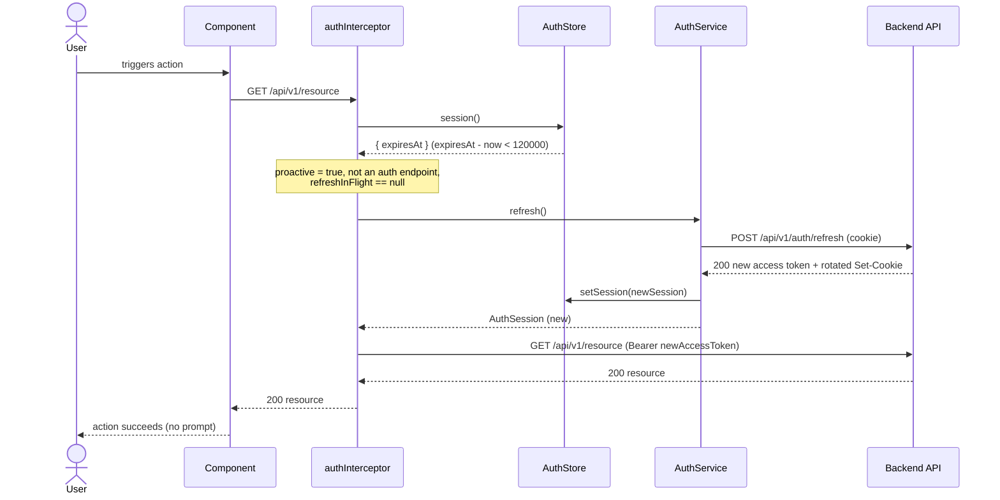
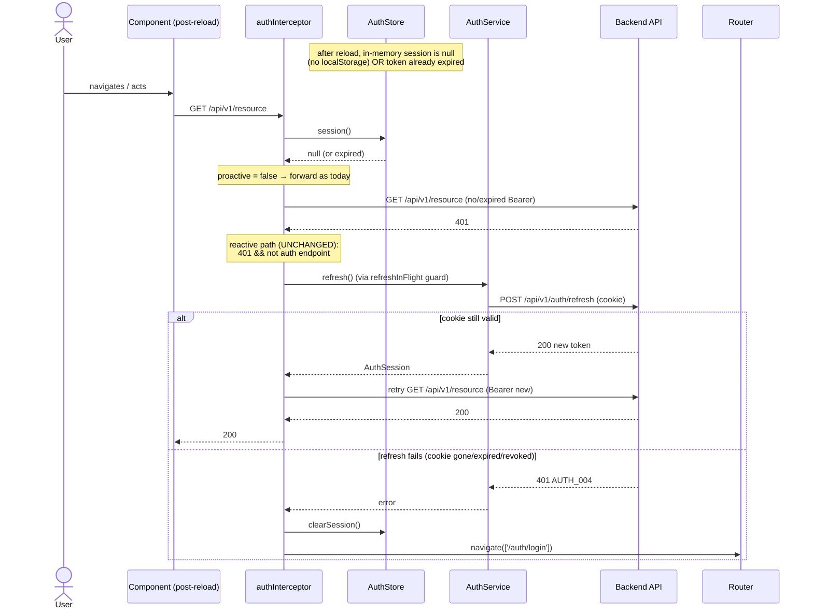

# US-004 Technical Design — Refresh sessions silently with rotating refresh tokens

Status: DRAFT — awaiting Gate 2 approval  
Author: Architect Agent  
Date: 2026-06-24

---

## 1. Overview

US-003 shipped the full rotating-refresh-token backend (rotation, theft detection, optimistic-lock
concurrency safety, family revocation, audit events) and a **reactive** frontend refresh:
`auth.interceptor.ts` waits for a `401`, calls `AuthService.refresh()` once behind a shared
`refreshInFlight` guard, then retries the original request. AC-1/AC-2/AC-3 are therefore already
met.

The single open acceptance criterion is **AC-4 — silent renewal**: the SPA must refresh *before*
the access token expires (< 2 min TTL), so an active user never sees a 401-induced stall or a
login prompt mid-session. The reactive path alone cannot satisfy this: it fires only *after* a
request has already failed, and it produces a visible failure if the retry races a clock edge.

This story adds a **proactive, pre-request TTL check** to the existing interceptor. Before
forwarding any non-auth API request, the interceptor reads the in-memory session and if
`expiresAt - Date.now() < 120_000` it refreshes *first*, then forwards the original request with
the freshly-rotated token. The reactive 401 path is **retained unchanged** as the fallback for
page-reload, clock-skew, and missed-window cases. Both paths share the **same** module-level
`refreshInFlight` observable via `shareReplay(1)`, so a burst of requests crossing the boundary
produces exactly one `POST /api/v1/auth/refresh`.

**Scope:** one file changes — `nexus-frontend/src/app/core/http/auth.interceptor.ts` — plus its
spec. No backend code, no schema, no new dependency, no new feature flag.

### 1.1 Acceptance-criteria status

| AC | Status | Where met |
|----|--------|-----------|
| AC-1 rotation | Done | `RefreshTokenUseCase` (US-003) |
| AC-2 reuse → family revoke | Done | `RefreshTokenUseCase` theft path (US-003) |
| AC-3 concurrent race, grace ≤ 10s | Done (backend) + documented (§8) | `@Version` optimistic lock (US-003) |
| AC-4 silent renewal | **This story** | proactive interceptor check |

---

## 2. Component Design

The change is entirely in the **frontend interfaces/HTTP layer** — an Angular functional HTTP
interceptor. No domain, application, or infrastructure change on either tier.

| Concern | Owner | Changed? |
|---------|-------|----------|
| TTL decision (`< 120s` → refresh) | `authInterceptor` | **New** |
| Single-flight guard | `refreshInFlight` (module-level, `auth.interceptor.ts`) | Reused — now shared by both paths |
| Performing the refresh | `AuthService.refresh()` | Unchanged |
| Session state / `expiresAt` / `accessToken` | `AuthStore` | Unchanged |
| Session shape | `AuthSession` (`shared/types/auth.ts`) | Unchanged |
| Error normalisation to `AppError` | `apiErrorInterceptor` | Unchanged |
| Rotation / theft detection / audit | `RefreshTokenUseCase` (backend) | Unchanged |

**Interceptor chain order is load-bearing.** `app.config.ts` registers
`withInterceptors([correlationIdInterceptor, apiErrorInterceptor, authInterceptor])`. Angular
composes these so `authInterceptor` is the **innermost** wrapper. Its `catchError` therefore
observes the raw `HttpErrorResponse` (which is why the existing reactive code matches
`error instanceof HttpErrorResponse`); `apiErrorInterceptor` normalises to `AppError` only
*after* `authInterceptor` re-throws. The proactive branch sits in the *request* direction of
`authInterceptor` (before `next()`), so correlation IDs and error normalisation still apply to the
refreshed request. **This story must not reorder the chain.**

---

## 3. Sequence Diagrams

### 3.1 Happy path — proactive refresh fires (TTL < 2 min)



### 3.2 Thundering herd — two concurrent requests, one refresh

```mermaid
sequenceDiagram
    participant R1 as Request A
    participant R2 as Request B
    participant AI as authInterceptor
    participant Guard as refreshInFlight (shareReplay 1)
    participant ASvc as AuthService
    participant API as Backend API

    R1->>AI: GET /api/v1/a  (TTL < 120s)
    R2->>AI: GET /api/v1/b  (TTL < 120s)
    Note over AI: both compute proactive = true
    AI->>Guard: A: refreshInFlight == null → create
    Guard->>ASvc: refresh()
    ASvc->>API: POST /api/v1/auth/refresh  (single call)
    AI->>Guard: B: refreshInFlight != null → reuse
    Note over Guard: shareReplay(1) replays the same result;<br/>NO second POST /refresh
    API-->>ASvc: 200 rotated token
    ASvc-->>Guard: AuthSession (new)
    Guard-->>AI: A: session; B: session (same emission)
    AI->>API: A: GET /api/v1/a (Bearer new)
    AI->>API: B: GET /api/v1/b (Bearer new)
    Note over Guard: finalize() resets refreshInFlight = null
```

### 3.3 Fallback — page reload, token already expired, reactive 401



---

## 4. Interceptor Logic (target `authInterceptor`)

Pseudocode for the updated function. The reactive `catchError` block at the bottom is
**byte-for-byte the existing code**; only the proactive pre-check is new.

```
const PROACTIVE_REFRESH_THRESHOLD_MS = 120_000   // 2 min

authInterceptor(req, next):
  authStore   = inject(AuthStore)
  authService = inject(AuthService)
  router      = inject(Router)

  # shared helpers
  path           = new URL(req.url, window.location.origin).pathname
  isAuthEndpoint = AUTH_PATHS.includes(path)       # exact pathname match

  # NEW: proactive pre-request check
  session   = authStore.session()
  proactive = session !== null
              && (session.expiresAt - Date.now()) < PROACTIVE_REFRESH_THRESHOLD_MS

  if proactive && !isAuthEndpoint:
      if refreshInFlight == null:
          refreshInFlight = authService.refresh().pipe(
              shareReplay(1),
              finalize(() => refreshInFlight = null)
          )
      return refreshInFlight.pipe(
          switchMap(_newSession =>
              next(req.clone({ setHeaders: { Authorization: `Bearer ${authStore.accessToken()}` } }))
          ),
          catchError(err =>                                       # refresh itself failed
              authStore.clearSession()
              router.navigate(['/auth/login'])
              throwError(() => err)
          )
      )

  # EXISTING path (unchanged) — attach current token if present
  token   = authStore.accessToken()
  authReq = (token && !req.headers.has('Authorization'))
              ? req.clone({ setHeaders: { Authorization: `Bearer ${token}` } })
              : req
  return next(authReq).pipe(
      catchError(error =>
          # reactive 401 handler — identical to today:
          #   if HttpErrorResponse 401 && !isAuthEndpoint → refreshInFlight → retry once
          #   on second failure → clearSession + navigate(/auth/login) + rethrow
          ...
      )
  )
```

**Implementation notes:**

- **Token read order in the proactive `switchMap`.** Read `authStore.accessToken()` *after*
  `refreshInFlight` resolves, because `AuthService.refresh()` already calls `authStore.setSession()`
  in its `tap`. Reading from the store post-refresh is the single source of truth and mirrors
  how the reactive path uses the emitted session's token.

- **`AUTH_PATHS` exclusion is load-bearing** (see §7). The `proactive && !isAuthEndpoint` guard
  prevents `POST /refresh` (and `/login`) from themselves triggering a proactive refresh —
  the infinite-loop guard.

- **Single guard, two entry points.** Both the proactive branch and the reactive `catchError`
  create/reuse the *same* `refreshInFlight`. A request that triggers proactive refresh while
  another is already in the reactive path (or vice versa) reuses the in-flight observable —
  no double refresh across paths.

- **`finalize` resets the guard** on completion *or* error, so a failed refresh does not wedge
  `refreshInFlight` in a non-null state.

---

## 5. Decision Log — Option B (pre-request TTL check) over Option A (timer)

| Criterion | Option A — `setTimeout` in `AuthService` | Option B — pre-request TTL check (CHOSEN) |
|-----------|------------------------------------------|-------------------------------------------|
| Page reload | Timer lost on reload; needs the reactive path anyway | The check runs on the **first request after reload**; if the cookie is valid it self-heals |
| Lifecycle management | Must `setTimeout` on every login/refresh and `clearTimeout` on `clearSession`/logout; risk of leaked/duplicate timers | None — no timer to create, cancel, or leak |
| Background tabs | Browsers throttle/sleep `setTimeout`; fire can be delayed past `expiresAt` | No timer; check fires precisely when the user next acts — exactly when a fresh token is needed |
| `visibilitychange` handling | Often needed to re-arm timers on focus | Not needed |
| Single-flight guard | Would need separate coordination with `refreshInFlight` | Reuses the **existing** `refreshInFlight` naturally |
| Testability | Requires `vi.useFakeTimers()` | `HttpTestingController` + a controlled `expiresAt`; fits the existing spec pattern |
| Per-request cost | None | One signal read + one arithmetic comparison — negligible against a network round-trip |

**Decision: Option B.** The reload-survival and zero-lifecycle properties are decisive. Option A's
only advantage (fires once at the exact moment) is outweighed by two structural weaknesses (lost
on reload, throttled in background tabs), each of which forces the reactive path to remain the
real safety net anyway. Option B makes both paths a single coherent mechanism sharing one guard.
**No ADR required** — this is an implementation choice within the established interceptor pattern.

---

## 6. Backend — No Changes

Explicitly confirmed unchanged (see `02-impact.md` §4):

- `RefreshToken` entity, `RefreshTokenPort`, `JpaRefreshTokenAdapter`/`Repository`
- `RefreshTokenUseCase` — rotation, theft detection, optimistic lock, family revocation,
  user-status re-check
- `POST /api/v1/auth/refresh` in `LoginController`; cookie attributes unchanged
- `SecureEventService.revokeFamily()` and `TOKEN_REFRESH_SUCCESS` / `REFRESH_FAMILY_REVOKED` audit events
- `SecurityConfig`, `JwtAuthenticationFilter`, JWT claims contract, RSA key handling

### 6.1 Database — no migration (Q1 resolved)

No new migration. V2 `refresh_tokens` carries every column and index this story touches. The
rotation path uses the `uq_refresh_tokens_token_hash` UNIQUE index (O(1) lookup); it meets the
p95 < 150 ms NFR without the reserved **V4 `idx_refresh_tokens_expires_at`**. That index only
benefits a future server-side cleanup sweep (out of scope). **Recommendation: keep V4 reserved,
do not create it in US-004.**

---

## 7. Auth Endpoint Exclusion (infinite-loop guard)

`AUTH_PATHS = ['/api/v1/auth/login', '/api/v1/auth/refresh']` already exists in the reactive
path. The proactive branch reuses the **same constant and the same `isAuthEndpoint` check**:

- Including `/api/v1/auth/refresh` is **load-bearing**: without it, the `POST /refresh` request
  issued by `AuthService.refresh()` would itself enter the interceptor, see TTL < 2 min (the
  session is still the near-expiry one until the response lands), and recursively trigger
  another refresh — an infinite loop.
- Exact `pathname` comparison (not `includes`) is retained to avoid false matches like
  `/admin/auth/login-audit`.

---

## 8. Grace Window Documentation (AC-3, Q2 resolved)

AC-3 ("≤ 10s concurrent grace") is satisfied at three layers, none new to US-004:

1. **Backend (the real guarantee).** Concurrent rotations are serialised by the `@Version`
   optimistic lock. The loser fails its version check and receives `AUTH_004` — not a false
   family revocation, because it presented the *original* (not a revoked) token. Covered by
   `concurrent_rotation_single_winner` IT.

2. **Within one tab.** The `refreshInFlight` (`shareReplay(1)`) guarantees **exactly one**
   `POST /refresh` per concurrent burst, whether the burst originates from the proactive path,
   the reactive path, or both.

3. **Across tabs.** Coordination is *implicit* via the shared `HttpOnly; SameSite=Strict` cookie.
   Tab A rotates → the browser stores the new cookie. Tab B's next refresh presents that **same
   rotated cookie** (cookies are shared across tabs of the same origin) → no stale-token replay,
   no false theft detection. If two tabs fire within the same lock window, the optimistic lock
   resolves it as in (1): one winner, one benign `AUTH_004`, no family revocation.

**Resolution for Q2:** documented here in §8 plus a short code comment on the proactive branch
referencing `refreshInFlight` and the cookie-sharing rationale. An ADR addendum is unnecessary —
no new architectural decision is being made.

---

## 9. No New Dependencies

No new npm package. The implementation uses RxJS operators already imported in `auth.interceptor.ts`
(`switchMap`, `shareReplay`, `finalize`, `catchError`, `throwError`, `Observable`) and Angular
`inject`. `npm audit --omit=dev --audit-level=high` is clean by construction.

---

## 10. Error Handling Strategy

| Situation | Behaviour |
|-----------|-----------|
| Proactive refresh succeeds | Original request forwarded with rotated token |
| Proactive refresh fails (cookie expired/revoked/network) | `catchError` → `clearSession()` → `navigate(['/auth/login'])` → rethrow |
| Token already expired at request time (page reload, `session == null`) | `proactive = false`; reactive 401 path handles it |
| Request 401 with a valid session (clock skew, server-side revoke) | Reactive path refreshes once, retries; second 401 → clear + login |
| Refresh returns non-401 (500/429) | Proactive/reactive `catchError` clears session + routes to login → next request has `session() == null` → `proactive = false` → no re-entry |

---

## 11. Observability Plan

Server-side observability is unchanged (US-003 §12): `TOKEN_REFRESH_SUCCESS` /
`REFRESH_FAMILY_REVOKED` audit events, structured logs, refresh p95 metric.

Recommended client-side additions via `LoggerService` at `debug` level (PII-free):

| Event | Level | Fields |
|-------|-------|--------|
| `auth.refresh.proactive` | debug | `msRemaining` (the computed `expiresAt - now`) |
| `auth.refresh.failed` | warn | `reason` (`'cookie'` \| `'network'`) — never the error body |

**Q4 resolved:** The backend cannot distinguish a proactive refresh from a reactive one — both
are identical `POST /api/v1/auth/refresh` calls. Emitting a distinct `TOKEN_REFRESH_PROACTIVE`
server event would require a client-asserted hint header (attack surface) for no compliance value.
**Keep the single `TOKEN_REFRESH_SUCCESS` event.**

---

## 12. Feature Flag Strategy

US-004 rides the existing **`feature.nexus-us003-auth-login.enabled`** flag. No new flag. The
proactive check is inert when `session() == null` (auth disabled, or no user logged in).

---

## 13. Rollout Plan

1. **Deploy frontend** with the auth flag in its current per-env state.
2. **Smoke (TS-1):** authenticate, let access token approach expiry, then act — action succeeds
   with no login prompt; exactly one `POST /refresh` observed in the network log.
3. **Canary:** verify via `auth.refresh.proactive` debug log (or server `auth.refresh.attempts`)
   that refreshes cluster near expiry, not continuously.
4. **Monitor** server refresh p95 (< 150 ms, TS-5) and `refresh_theft_detected` (must be zero
   for legitimate multi-tab traffic) for 30 min.
5. **Rollback:** frontend redeploy of the prior bundle (or toggling the auth flag off).
   No schema or backend state to unwind.

---

## 14. Open Issues for Gate 2

| # | Question | Recommendation |
|---|----------|----------------|
| Q1 | V4 `idx_refresh_tokens_expires_at` | **Defer** — rotation path served by UNIQUE token-hash index; V4 only benefits a future cleanup sweep |
| Q2 | Grace-window documentation form | **Design §8 + code comment** — no ADR addendum |
| Q3 | Proactive approach | **Option B confirmed** — pre-request TTL check |
| Q4 | Proactive vs reactive audit event | **Keep single `TOKEN_REFRESH_SUCCESS`** — no client-asserted classification |
| Q5 | Threat-model residuals | Confirm acceptance of Low residuals in `03b-threat-model.md` (notably T-2 cross-tab race → benign AUTH_004) |
