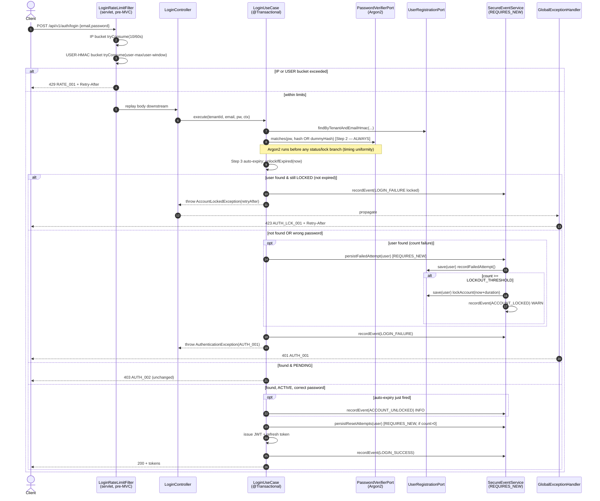

# US-006 Technical Design

## 1. Overview

US-006 hardens the **Identity** bounded context (`com.example.nexus.identity`) login path with two independent brute-force defenses plus a P1 password-policy error-code split. (1) A DB-backed **per-user account lockout**: five consecutive credential failures within a 15-minute window transition the user to `status=LOCKED` for 15 minutes, returning HTTP 423 + `AUTH_LCK_001`; a successful login after the window auto-expires the lock. (2) The existing servlet-layer **IP rate limit** is reshaped to 10 attempts/minute/IP (split from the shared email-HMAC bucket). All required schema (`failed_attempt_count`, `locked_until`, and the `LOCKED` enum value) already exists in `V2__identity_schema.sql`, so **no Flyway migration is required**. The single load-bearing constraint is transaction semantics: `LoginUseCase` is `@Transactional` and throws on failed login, so the counter increment and lock write must commit through a `REQUIRES_NEW` boundary (the proven `SecureEventService` pattern) or they will be rolled back with the failed-login transaction.

---

## 2. Architecture Diagram



---

## 3. Domain Design

Hexagonal note (ADR-0002): all four methods live on the `User` aggregate in `identity.domain`. They mutate state only; persistence is the application layer's job via `UserRegistrationPort.save`. The domain imports nothing from infrastructure.

### 3a. User domain changes

File: `nexus-backend/src/main/java/com/example/nexus/identity/domain/User.java`

```java
/** Increments the consecutive-failure counter and returns the new value. */
public int recordFailedAttempt();

/** Transitions to LOCKED and sets the auto-expiry instant. */
public void lockAccount(Instant lockedUntil);

/** Zeroes the failure counter and clears lockedUntil (called on successful login). */
public void resetFailedAttempts();

/**
 * If status is LOCKED and lockedUntil is strictly before {@code now}, transitions to ACTIVE,
 * clears lockedUntil, and returns true; otherwise returns false (no state change).
 */
public boolean unlockIfExpired(Instant now);
```

Semantics:
- `recordFailedAttempt()` — `this.failedAttemptCount += 1; return this.failedAttemptCount;`. Does not lock; the application layer decides at threshold.
- `lockAccount(Instant)` — `this.status = UserStatus.LOCKED; this.lockedUntil = lockedUntil;`. Idempotent if already locked (overwrites `lockedUntil`).
- `resetFailedAttempts()` — `this.failedAttemptCount = 0; this.lockedUntil = null;`. Does not touch `status` (caller knows it is ACTIVE).
- `unlockIfExpired(now)` — boundary is **strictly before** (`lockedUntil.isBefore(now)`): at exactly `lockedUntil` the account stays locked, matching the `Retry-After` contract. On unlock it sets `status=ACTIVE`, `failedAttemptCount=0`, `lockedUntil=null` and returns `true` so the caller can emit `ACCOUNT_UNLOCKED`.

### 3b. AuthConstants additions

File: `nexus-backend/src/main/java/com/example/nexus/identity/domain/AuthConstants.java`

```java
public static final int LOCKOUT_THRESHOLD = 5;
public static final int LOCKOUT_WINDOW_SECONDS = 900;    // 15 min — consecutive-failure window
public static final int LOCKOUT_DURATION_SECONDS = 900;  // 15 min — lock duration (== window per req. assumption #3)
```

Window and duration are deliberately separate constants even though equal today, so a future tuning change to one does not silently change the other.

### 3c. AccountLockedException

File (net-new): `nexus-backend/src/main/java/com/example/nexus/common/domain/AccountLockedException.java`. Mirrors `RateLimitException` (carries `retryAfterSeconds`), extends `DomainException`.

```java
public class AccountLockedException extends DomainException {
  private final long retryAfterSeconds;
  public AccountLockedException(String code, String message, long retryAfterSeconds);
  public long retryAfterSeconds();
}
```

Thrown as `new AccountLockedException("AUTH_LCK_001", "Account locked. Try again later or reset your password.", retryAfterSeconds)`. `retryAfterSeconds` is computed as `max(0, secondsBetween(now, lockedUntil))`.

---

## 4. Application Layer Design

### LoginUseCase — revised step order

File: `nexus-backend/src/main/java/com/example/nexus/identity/application/service/LoginUseCase.java`

**Invariant:** Argon2 (Step 2) runs for every request before any account-status or lock branch, preserving timing uniformity between active-wrong-password, unknown-account, and locked-account paths (Gate 1 Q1=a). The lockout pre-check fires only **after** Argon2.

```
Step 1  Look up user by tenant + emailHmac. Set `found`. DO NOT branch. (unchanged)

Step 2  Argon2 verify — ALWAYS runs (found ? real hash : dummyHash). (unchanged)

Step 3  Auto-expiry (found only): boolean justUnlocked = user.unlockIfExpired(now)
        If justUnlocked -> mark a flag; persistence deferred to success path (Step 8b)
        so the unlock only commits when the user actually authenticates.

Step 4  Lockout pre-check (found only, AFTER Argon2):
        if user.getStatus() == LOCKED  (i.e. still locked / not expired)
            secureEventService.recordEvent(LOGIN_FAILURE locked)
            throw AccountLockedException("AUTH_LCK_001", ..., retryAfterSeconds(now, lockedUntil))

Step 5  Credential failure path — unknown user OR wrong password (identical code path):
            if found:                         // only real users get a counter
                secureEventService.persistFailedAttempt(user.getId(), now)   // REQUIRES_NEW
            secureEventService.recordEvent(LOGIN_FAILURE)
            throw AuthenticationException("AUTH_001", "Invalid email or password")

Step 6  Status gate — ACTIVE allowlist (unchanged):
            PENDING  -> AccountNotVerifiedException("AUTH_002")
            any non-ACTIVE other than handled LOCKED -> AuthenticationException("AUTH_001")
            (LOCKED is already handled in Step 4; DISABLED etc. still blocked here)

Step 7  Issue access JWT. (unchanged)

Step 8  Generate + persist refresh token. (unchanged)

Step 8b On success, if failedAttemptCount > 0 OR justUnlocked:
            secureEventService.persistResetAttempts(user.getId())   // REQUIRES_NEW
            if justUnlocked: secureEventService.recordEvent(ACCOUNT_UNLOCKED) // INFO

Step 9  Record LOGIN_SUCCESS, return tokens. (unchanged)
```

Where each behavior lives, explicitly:
- **Lockout pre-check** — Step 4 (after Argon2 Step 2; before credential branch). Throws 423.
- **Auto-expiry (`unlockIfExpired`)** — evaluated in Step 3, but only **committed** on the success path (Step 8b) so a failed attempt against an expired-but-correct-window account does not silently unlock without authentication.
- **Counter increment** — Step 5, only for `found` users, via `SecureEventService.persistFailedAttempt(...)` (REQUIRES_NEW).
- **Lock at threshold** — decided **inside** `persistFailedAttempt` so the read-increment-maybe-lock-save sequence is atomic within one REQUIRES_NEW transaction.
- **Counter reset on success** — Step 8b via `persistResetAttempts(...)` (REQUIRES_NEW), only when `failedAttemptCount > 0` to avoid a needless `UPDATE` on every clean login.
- **New auth events** — `ACCOUNT_LOCKED` emitted inside `persistFailedAttempt` when threshold crossed; `ACCOUNT_UNLOCKED` emitted in Step 8b when `justUnlocked`.

**Why persistence moves into SecureEventService (load-bearing):** `LoginUseCase` is `@Transactional` and throws on the failed path, rolling back the surrounding transaction. If the counter `UPDATE` ran in that outer transaction it would be rolled back and the counter would never advance. Routing the write through a `REQUIRES_NEW` method commits it independently, exactly as `recordEvent` already does.

**Optimistic-lock handling:** `User` carries `@Version`. Two racing failed logins can collide on the counter `UPDATE`, raising `OptimisticLockingFailureException` from the REQUIRES_NEW transaction. `persistFailedAttempt` catches it and treats the increment as lost (benign — worst case one extra attempt); it MUST NOT surface as 500.

### SecureEventService extension

File: `nexus-backend/src/main/java/com/example/nexus/identity/application/service/SecureEventService.java`. Add `UserRegistrationPort` to the constructor and two methods. Each owns its own `REQUIRES_NEW` transaction; the read+mutate+save happens inside the boundary so the version check is atomic.

```java
/**
 * Re-reads the user in a new transaction, increments the failure counter, and — if the new
 * count reaches LOCKOUT_THRESHOLD — locks the account until now + LOCKOUT_DURATION_SECONDS
 * and records an ACCOUNT_LOCKED event. Swallows OptimisticLockingFailureException (lost
 * increment is benign). Commits independently of the caller's rolled-back login transaction.
 */
@Transactional(propagation = Propagation.REQUIRES_NEW)
public void persistFailedAttempt(UUID userId, Instant now);

/** Re-reads the user and resets failedAttemptCount/lockedUntil in a new transaction. */
@Transactional(propagation = Propagation.REQUIRES_NEW)
public void persistResetAttempts(UUID userId);
```

Rationale for taking `UUID userId` (not the detached `User`): the entity loaded in `LoginUseCase` belongs to the outer (about-to-roll-back) persistence context. Re-reading by id inside the REQUIRES_NEW transaction gives a managed instance with a fresh `@Version`, which is also what makes optimistic-lock semantics correct under concurrent failures.

---

## 5. Infrastructure Design

### 5a. Rate-limit config split

File: `nexus-backend/src/main/resources/application.yml`.

**BEFORE**
```yaml
nexus:
  security:
    rate-limit:
      store-type: memory
      max-attempts: 5
      window-seconds: 300
```

**AFTER**
```yaml
nexus:
  security:
    rate-limit:
      store-type: memory
      ip-max-attempts: 10        # AC-3: >10/min/IP rejected
      ip-window-seconds: 60
      user-max-attempts: 5       # email-HMAC bucket retained (Gate 1 Q2=a, defense-in-depth)
      user-window-seconds: 900
      refresh-max-attempts: 30   # promoted from the hardcoded literal in the filter
```

`application-test.yml` MUST be updated in the same change (Impact Risk #2):
```yaml
nexus:
  security:
    rate-limit:
      ip-max-attempts: 3
      ip-window-seconds: 10
      user-max-attempts: 3
      user-window-seconds: 10
```

`InMemoryRateLimitStore` reads `${nexus.security.rate-limit.window-seconds}` for its eviction-thread interval; repoint that `@Value` to `${nexus.security.rate-limit.ip-window-seconds}` (behavior unchanged, just the key).

**Updated `LoginRateLimitFilter` constructor:**
```java
public LoginRateLimitFilter(
    RateLimitStore rateLimitStore,
    EmailBlindIndexService emailBlindIndexService,
    @Value("${nexus.security.rate-limit.ip-max-attempts}") int ipMaxAttempts,
    @Value("${nexus.security.rate-limit.ip-window-seconds}") int ipWindowSeconds,
    @Value("${nexus.security.rate-limit.user-max-attempts}") int userMaxAttempts,
    @Value("${nexus.security.rate-limit.user-window-seconds}") int userWindowSeconds,
    @Value("${nexus.security.rate-limit.refresh-max-attempts}") int refreshMaxAttempts)
```

`handleLogin` calls `tryConsume("IP:"+clientIp, ipWindowSeconds, ipMaxAttempts)` and `tryConsume("USER:"+emailHmac, userWindowSeconds, userMaxAttempts)`. `LoginRateLimitFilterTest` constructor calls must be updated for the new arity in the same commit.

### 5b. GlobalExceptionHandler addition

File: `nexus-backend/src/main/java/com/example/nexus/common/web/GlobalExceptionHandler.java`. Mirrors the existing `handleRateLimit` shape.

```java
@ExceptionHandler(AccountLockedException.class)
ResponseEntity<ProblemDetail> handleAccountLocked(AccountLockedException e) {
  ProblemDetail problem = problem(HttpStatus.LOCKED, e.code(), e.getMessage());
  problem.setProperty("retryAfterSeconds", e.retryAfterSeconds());
  HttpHeaders headers = new HttpHeaders();
  headers.set(HttpHeaders.RETRY_AFTER, String.valueOf(e.retryAfterSeconds()));
  return ResponseEntity.status(HttpStatus.LOCKED).headers(headers).body(problem);
}
```

---

## 6. API Contract

### POST /api/v1/auth/login — updated response table

| Status | Code | Condition | Retry-After |
|--------|------|-----------|-------------|
| 200 | — | Success; access token + refresh token issued | — |
| 401 | AUTH_001 | Bad credentials (unknown user or wrong password) | — |
| 403 | AUTH_002 | Account not verified (PENDING) | — |
| 423 | AUTH_LCK_001 | Account locked (threshold reached, not yet expired) | seconds until `lockedUntil` |
| 429 | RATE_001 | IP bucket (10/60s) or user-HMAC bucket exceeded | window-based (filter) |

423 response body (RFC 7807, `application/problem+json`):
```json
{
  "type": "about:blank",
  "title": "Locked",
  "status": 423,
  "detail": "Account locked. Try again later or reset your password.",
  "code": "AUTH_LCK_001",
  "retryAfterSeconds": 873,
  "traceId": "b3c1f0a2e4d5..."
}
```
Header: `Retry-After: 873`. Additive change — existing clients route unknown codes through their `default` branch.

### POST /api/v1/auth/register — updated response

| Status | Code | Condition |
|--------|------|-----------|
| 400 | AUTH_PWD_001 | Password too short (`null` or < 12 chars) |
| 400 | AUTH_PWD_002 | Password present on the common-password denylist |

---

## 7. Frontend Design

File: `nexus-frontend/src/app/features/auth/login-form/login-form.component.ts`. Add one case to the existing `switch (err.code)` in `submit()` (after the `RATE_001` case):

```typescript
case 'AUTH_LCK_001':
  this.errorMessage.set('Too many attempts. Try again later or reset your password.');
  break;
```

Message deliberately omits attempt count and `Retry-After` value (AC-2). A spec case in `login-form.component.spec.ts` mirrors the existing `RATE_001` test.

---

## 8. PasswordPolicyService change (P1)

File: `nexus-backend/src/main/java/com/example/nexus/identity/application/PasswordPolicyService.java`. Split the single code into length vs denylist (Gate 1 Q4=a).

**BEFORE**
```java
private static final String CODE = "AUTH_PWD_001";
private static final String MESSAGE = "Password must be at least 12 characters and must not be a commonly used password.";

public void validate(String rawPassword) {
  if (rawPassword == null || rawPassword.length() < MIN_LENGTH) {
    throw new FieldValidationException(CODE, "password", MESSAGE);
  }
  if (commonPasswordSet.contains(rawPassword)) {
    throw new FieldValidationException(CODE, "password", MESSAGE);
  }
}
```

**AFTER**
```java
private static final String CODE_LENGTH   = "AUTH_PWD_001";
private static final String CODE_DENYLIST = "AUTH_PWD_002";
private static final String MSG_LENGTH    = "Password must be at least 12 characters.";
private static final String MSG_DENYLIST  = "Password is too common. Choose a less predictable password.";

public void validate(String rawPassword) {
  if (rawPassword == null || rawPassword.length() < MIN_LENGTH) {
    throw new FieldValidationException(CODE_LENGTH, "password", MSG_LENGTH);
  }
  if (commonPasswordSet.contains(rawPassword)) {
    throw new FieldValidationException(CODE_DENYLIST, "password", MSG_DENYLIST);
  }
}
```

`PasswordPolicyServiceTest` denylist case asserts `AUTH_PWD_002`; length/null cases keep `AUTH_PWD_001`.

---

## 9. Observability

Follows the existing `SecureEventService.recordEvent` audit-event mechanism. `auth_events.event_type` is `VARCHAR(64)` — both new values fit; no schema change.

New auth event types:

| Event type | Outcome | When | Fields |
|------------|---------|------|--------|
| `ACCOUNT_LOCKED` | `FAILURE` | Inside `persistFailedAttempt` when new count ≥ `LOCKOUT_THRESHOLD` | `userId`, `ipAddress` (MDC), metadata JSON (tenantId, traceId) |
| `ACCOUNT_UNLOCKED` | `SUCCESS` | Step 8b when `unlockIfExpired` returned true on successful login | `userId`, `ipAddress`, metadata JSON |

Existing events (`LOGIN_FAILURE`, `LOGIN_PENDING_ACCOUNT`, `LOGIN_SUCCESS`) keep firing unchanged. The locked-rejection path (Step 4) records a `LOGIN_FAILURE` event before throwing 423, so the lock-active rejection is auditable.

Log levels:
- `WARN` on `ACCOUNT_LOCKED` — `log.warn("ACCOUNT_LOCKED userId={} tenantId={}", ...)`. Never log email/IP in clear; IP stays masked in MDC.
- `INFO` on `ACCOUNT_UNLOCKED`.
- `DEBUG` on `LOGIN_SUCCESS` (existing, unchanged).

---

## 10. Error Handling

| Exception | HTTP status | Error code | Retry-After | Handler |
|-----------|-------------|------------|-------------|---------|
| `AccountLockedException` (new) | 423 Locked | `AUTH_LCK_001` | seconds until `lockedUntil` | `GlobalExceptionHandler.handleAccountLocked` (new) |
| `AuthenticationException` | 401 | `AUTH_001` | — | `handleAuthentication` (existing) |
| `AccountNotVerifiedException` | 403 | `AUTH_002` | — | `handleAccountNotVerified` (existing) |
| `RateLimitException` / filter | 429 | `RATE_001` | window-based | `handleRateLimit` / filter (existing) |
| `FieldValidationException` (denylist) | 400 | `AUTH_PWD_002` | — | `handleFieldValidation` (existing) |
| `FieldValidationException` (length) | 400 | `AUTH_PWD_001` | — | `handleFieldValidation` (existing) |
| `OptimisticLockingFailureException` | (swallowed) | — | — | caught in `persistFailedAttempt`; never reaches handler |

---

## 11. Rollout

- **Feature flag:** None (story: "Feature flag required: No").
- **Zero-downtime:** Schema columns already exist; additive API change. Config-key rename applied atomically across `application.yml` + `application-test.yml` + both `@Value` references.
- **Strategy:** Instant deploy (modular monolith). No canary required.
- **Rollback:** Revert the code. The columns and any written rows remain — harmless to the prior code, which does not read or advance them. No data cleanup needed.

---

## Implementation Notes (added during US-006 implementation)

### OptimisticLock bug fixed (M-OL-1)
`SecureEventService.persistResetAttempts` originally used `findById + save` inside
`REQUIRES_NEW`. When `LoginUseCase` had already called `unlockIfExpired()` on the User
in the outer session, the REQUIRES_NEW save advanced `@Version` to V+1. The outer
session then flushed at V, colliding with V+1 → `ObjectOptimisticLockingFailureException`
on the success path → HTTP 500.

**Fix:** replaced `findById + save` with a JPQL bulk `UPDATE users SET
failed_attempt_count = 0, locked_until = NULL WHERE id = :userId`. Bulk updates bypass
`@Version` checking, leaving the version unchanged so the outer session flushes cleanly.
New port method: `UserRegistrationPort.resetFailedAttemptsDirect(UUID)`.

### LOCKOUT_WINDOW_SECONDS is not a rolling window (M-2)
The failure counter accumulates all consecutive failures since last success; no sliding-window check is applied (`LOCKOUT_WINDOW_SECONDS` is defined but not yet enforced — rolling-window enforcement is a future enhancement).

### REQUIRES_NEW + @Version interaction rule
When a `REQUIRES_NEW` method writes to an entity that the caller's outer transaction has
already loaded and mutated in-memory, use a bulk `UPDATE` (not `findById + save`) to avoid
the version collision. This pattern now applies to `persistResetAttempts`; keep in mind for
future REQUIRES_NEW writers in this context.

---

## 12. Open Design Decisions (for threat model)

1. **Argon2-always before 423 (Q1=a).** Locked-account latency matches the normal failed path, removing the timing oracle.
2. **`AUTH_LCK_001` confirms account existence.** Returning 423 reveals an account exists for the email. Accepted per OWASP account-lockout guidance; US-007 password-reset is the compensating control.
3. **Lockout-as-DoS.** An attacker can lock a victim's account with five wrong passwords. Mitigated by dual-layer IP throttle, US-007 reset path, and a support runbook.
4. **Optimistic-lock swallow on concurrent failures.** `persistFailedAttempt` swallows `OptimisticLockingFailureException`; a lost increment is benign but must never surface as 500.
5. **Auto-expiry committed only on successful login.** A wrong-password attempt after the window elapsed does not unlock the account — unlock requires correct credentials.
6. **Out of scope:** No CAPTCHA, no device fingerprinting, no Redis-backed distributed bucket. Per-instance IP bucket is a known limitation on multi-instance deployments; DB lockout remains globally authoritative.
