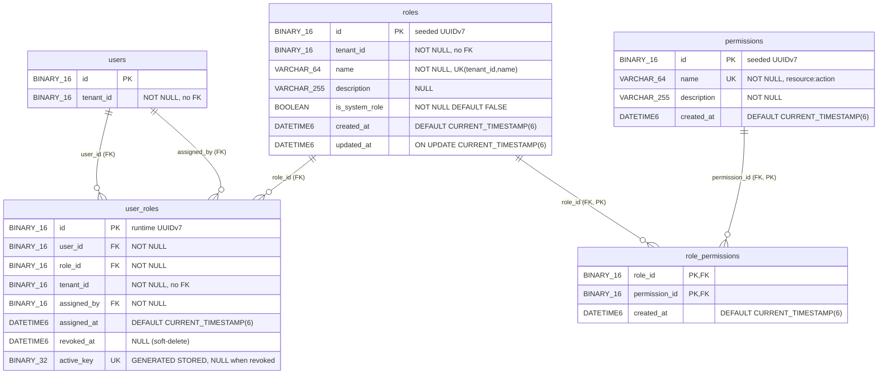

# US-009 — Solution Design: Establish RBAC Data Model and Seed System Roles and Permissions

_Output of `/design` (architect). Gate 2 deliverable. Feeds the task breakdown (`04-tasks.md`)._

**Binding inputs (not reopened):** `01-requirements.md` §17 (Gate 1 decisions OQ-1..OQ-6), `02-impact.md` §1 (WS-1..WS-4) and §10 (the 7 Gate-2 open unknowns), ADR-0013 (D1/D2), ADR-0014 (D5/D6). This document resolves all 7 unknowns in `02-impact.md` §10 with concrete decisions, SQL, and entity sketches. It does not revisit Gate-1 scope.

**Verification basis (re-read at design time, not trusted from the impact doc):**
- `identity/domain/User.java` — entity template: `@Id UUID id` with `@Column(columnDefinition="BINARY(16)")` and **no `@GeneratedValue`** (L22-24); `@Version long version` (L64-66); `created_at`/`updated_at` as `Instant` with `insertable=false, updatable=false` (L68-72); `@Getter` + `@NoArgsConstructor(access=PROTECTED)` (L18-19); `tenant_id` is a **bare `UUID`, no relationship** (L26-27); enums via `@Enumerated(EnumType.STRING)` (L45-47).
- `identity/infrastructure/persistence/JpaUserRepository.java` — plain `extends JpaRepository<User, UUID>` (L12), custom queries added as needed.
- `identity/infrastructure/persistence/UuidV7Converter.java` — `@Converter(autoApply=true)`, `AttributeConverter<UUID, byte[]>`, big-endian MSB-then-LSB (L12-24, **independently re-verified**: `putLong(getMostSignificantBits())` then `putLong(getLeastSignificantBits())` into a `ByteBuffer` — default big-endian order). **Applies only to `UUID`-typed fields; a `byte[]` field is left untouched** — the load-bearing fact for the `active_key` mapping.
- `V2__identity_schema.sql` — all temporal columns are `DATETIME(6)` (L19-25); `users.updated_at` carries `ON UPDATE CURRENT_TIMESTAMP(6)` (L25); DELETE trigger shape at L105-110 with the mandatory `BEGIN/END` wrapper (comment L94-96). `users.tenant_id` is `NOT NULL BINARY(16)` with **no FK** (L14).
- Migration head is **`V4`** (`Glob` on `db/migration/*.sql` returns exactly V1–V4). **`V5__rbac_schema.sql` is the correct next slot.**
- `nexus-database/mysql/init/02-grants-post-schema.sql` (L22-30) and `TestcontainersConfiguration.nexusAppGrantsCallback` (L119-129) both list only `auth_events`, `users`, `refresh_tokens`, `auth_tokens`.
- `application.yml:105` — `default-tenant-id: ${NEXUS_IDENTITY_DEFAULT_TENANT_ID}`, **no fallback** today.

**Post-threat-model amendment (ADR-0015, Accepted):** the STRIDE pass (`03b-threat-model.md`) found two design changes needed before Gate 2 closes — both applied below, not deferred: **D7** tightens the `user_roles` grant in §6 to column-scoped `UPDATE (revoked_at)` (was table-wide `UPDATE`); **D8** removes the `application.yml` base-profile fallback in §5 entirely (was: add it), keeping prod's fail-fast behavior on an unset tenant ID. A third finding (T-T2, `active_key` semantics under a hypothetical future scheduled-revocation feature) is closed with a `CHECK` constraint added to §2.2's SQL. All three are reflected directly in the sections below, not tracked separately.

---

## 0. Resolution of the 7 Gate-2 Open Unknowns (summary table)

| # | Unknown (impact §10) | Decision | Where |
|---|----------------------|----------|-------|
| 1 | `RolePermission` composite key: `@EmbeddedId` vs `@IdClass` | **`@IdClass(RolePermissionId.class)`** with two flat `@Id UUID` fields (`roleId`, `permissionId`). Matches the schema's flat bare-UUID column style; avoids nesting a value object into the domain for a pure join row; `RolePermissionId` is a plain class (records can't be an IdClass — JPA requires a public no-arg ctor). | §4.3 |
| 2 | Include `RolePermissionRepository`? | **Yes — keep it.** Satisfies AC8's "four entities + repositories" wording; gives US-015 a clean composite-key detach surface (`DELETE role_permissions`); marginal cost is one interface. | §4.5 |
| 3 | `active_key` JPA mapping under `ddl-auto=validate` | **`byte[] activeKey`** mapped `@Column(name="active_key", columnDefinition="BINARY(32)", insertable=false, updatable=false)`, plus (recommended) `@org.hibernate.annotations.Generated(event={INSERT,UPDATE})` so the in-memory value reflects the DB-computed one after write. `byte[]` (not `UUID`) is mandatory: it is 32 bytes and `UuidV7Converter` (UUID-only) correctly ignores it. | §4.4 |
| 4 | `@Version` on `Role`/`UserRole`? | **Omit on both.** Decisive reason: the story's explicit column lists define **no `version` column** on any RBAC table, so under `ddl-auto=validate` a `@Version` field would fail schema validation at boot. It is also unnecessary — no in-scope path does read-modify-write on these rows; the one concurrency invariant that matters (double active assignment) is enforced by the DB unique index, not optimistic locking. | §4.2, §4.6 |
| 5 | Is `roles.updated_at ON UPDATE` intentional? | **Yes — intentional forward-looking capacity, kept for convention parity with `V2`.** No Epic-2 story UPDATEs `roles` (ADR-0014 D6 grants `roles` no UPDATE), so the `ON UPDATE CURRENT_TIMESTAMP(6)` clause is never exercised in this epic; it mirrors `users.updated_at` (`V2:25`) so the schema is internally consistent and US-015+ get correct behavior for free. | §3.2 |
| 6 | Cross/within-context refs: bare UUID vs `@ManyToOne` | **Bare `UUID` everywhere.** `UserRole.userId`/`assignedBy` stay `UUID` (never `@ManyToOne` to `identity.domain.User` — no cross-context entity coupling); `RolePermission.roleId`/`permissionId` and `UserRole.roleId` also stay bare `UUID`, matching `User.tenantId`. DB-level referential integrity lives in `V5`'s FK constraints; the JPA layer knows only IDs. | §4.1 |
| 7 | Concurrency test mechanics (Scenario 10) | **Mirror `SecureEventServiceConcurrencyTest`:** `ExecutorService` + `CyclicBarrier` so N threads fire the same active-`(user_id, role_id)` INSERT simultaneously; assert exactly one commit, the rest fail on `uq_user_role_active` (`DataIntegrityViolationException`). | §8.3 |

---

## 1. Architecture Overview

This story has **no runtime flow** — it is schema + seed data + persistence mappings + provisioning config. There are no controllers, use-cases, ports, or adapters. The natural diagram is therefore an **ER diagram**, not a component/sequence graph.

### 1.1 Entity-Relationship diagram (4 new tables + the existing `users` they reference)



Note: `roles.tenant_id` and `user_roles.tenant_id` are `NOT NULL BINARY(16)` with **no FK** — there is no `tenants` table yet, exactly as `users.tenant_id` (`V2:14`) already does.

### 1.2 Layering / package placement (hexagonal, ArchUnit-enforced)

New bounded context `com.example.nexus.rbac`, mirroring `identity`:

```
rbac/domain/              → Permission, Role, RolePermission, RolePermissionId, UserRole   (JPA @Entity in domain, same as identity)
rbac/infrastructure/persistence/  → JpaPermissionRepository, JpaRoleRepository,
                                     JpaRolePermissionRepository, JpaUserRoleRepository
```

No `application/` (no use-cases), no `application/port/out/` (no ports — nothing to insulate yet), no `interfaces/` (no REST). `HexagonalArchitectureTest` (`:18-29`, `allowEmptyShould(true)`) covers `rbac.*` with zero config the moment these classes exist. `UuidGenerator`/`UuidV7Generator`/`UuidV7Converter` are reused as-is via cross-context reference (all already context-agnostic).

---

## 2. WS-1 — `V5__rbac_schema.sql` (schema + seed + trigger)

### 2.1 The 9 seed UUIDv7 literals (OQ-2 resolved — format-valid, work shown)

RFC 9562 UUIDv7 layout: `48 bits unix_ts_ms | version=0111 (7) | 12 bits rand_a | variant=10 | 62 bits rand_b`, rendered `TTTTTTTT-TTTT-7RRR-VRRR-RRRRRRRRRRRR` where the **13th hex digit is `7`** (version nibble) and the **17th hex digit's top two bits are `10`** (variant → one of `8,9,a,b`).

**Worked example — the timestamp prefix (`019f6839-18xx`):** target instant 2026-07-16 00:00:00 UTC.
- epoch seconds: 2026-01-01 = 1 767 225 600; + 196 days (Jan 31 + Feb 28 + Mar 31 + Apr 30 + May 31 + Jun 30 + 15) × 86 400 = 16 934 400 → 1 784 160 000 s → **1 784 160 000 000 ms**.
- 1 784 160 000 000 in hex = `0x019F68391800` (independently re-verified digit-by-digit: sums to exactly 1,784,160,000,000).
- That fills the 48-bit timestamp: groups `019f6839` (first 8 hex) + `1800` (next 4). Increment the low 4 hex digits per row to keep the seed rows plausibly time-ordered (`1800`, `1801`, …). Version nibble `7`, variant nibble `8` (`1000₂` → top bits `10` ✓), remaining nibbles low and human-distinguishable.

| # | Row | UUIDv7 (canonical) | Version/variant check |
|---|-----|--------------------|-----------------------|
| 1 | `permissions` `tenant:read` | `019f6839-1800-7000-8000-000000000001` | 13th=`7` ✓, 17th=`8`(`10xx`) ✓ |
| 2 | `permissions` `tenant:write` | `019f6839-1801-7000-8000-000000000002` | ✓ |
| 3 | `permissions` `user:read` | `019f6839-1802-7000-8000-000000000003` | ✓ |
| 4 | `permissions` `user:write` | `019f6839-1803-7000-8000-000000000004` | ✓ |
| 5 | `permissions` `role:read` | `019f6839-1804-7000-8000-000000000005` | ✓ |
| 6 | `permissions` `role:write` | `019f6839-1805-7000-8000-000000000006` | ✓ |
| 7 | `permissions` `audit:read` | `019f6839-1806-7000-8000-000000000007` | ✓ |
| 8 | `roles` `TENANT_ADMIN` | `019f6839-1810-7000-8000-00000000000a` | ✓ |
| 9 | `roles` `MEMBER` | `019f6839-1811-7000-8000-00000000000b` | ✓ |

Bootstrap tenant sentinel (ADR-0014 D5, **not** counted among the 9 seeded PKs): `00000000-0000-7000-8000-000000000001` — itself a valid UUIDv7 shape (version `7`, variant `8`, timestamp 0), consistent with the "all PKs are UUIDv7-shaped" invariant.

`UUID_TO_BIN('…')` is used for the literals: its default `swap_flag=0` preserves string byte order = big-endian, which **matches `UuidV7Converter`'s MSB-then-LSB layout exactly** (independently re-verified against the converter source — `putLong(MSB); putLong(LSB)` into a big-endian `ByteBuffer`) — so a row seeded by SQL and a row written by the JPA layer are byte-identical for the same UUID.

### 2.2 The migration (full)

```sql
-- V5__rbac_schema.sql
-- RBAC bounded context (EPIC-002 / US-009): permissions, roles, role_permissions, user_roles.
-- UUIDv7 primary keys stored as BINARY(16) (ADR-0005). Temporal columns DATETIME(6), matching V2-V4.
-- Append-only migration (ADR 0003) -- never edit after first apply.
--
-- Seeded PK literals are format-valid UUIDv7 (version nibble 7, variant 10xx) -- Gate-1 OQ-2 / ADR-0013:
--   tenant:read  019f6839-1800-7000-8000-000000000001   role:read   019f6839-1804-7000-8000-000000000005
--   tenant:write 019f6839-1801-7000-8000-000000000002   role:write  019f6839-1805-7000-8000-000000000006
--   user:read    019f6839-1802-7000-8000-000000000003   audit:read  019f6839-1806-7000-8000-000000000007
--   user:write   019f6839-1803-7000-8000-000000000004
--   TENANT_ADMIN 019f6839-1810-7000-8000-00000000000a   MEMBER      019f6839-1811-7000-8000-00000000000b
-- Bootstrap tenant (ADR-0014 D5): 00000000-0000-7000-8000-000000000001  == application.yml default-tenant-id fallback.
-- UUID_TO_BIN default swap_flag=0 => big-endian, byte-identical to UuidV7Converter (ADR-0005).

-- ---------------------------------------------------------------------------
-- permissions (code-/migration-defined only; read-only at runtime -- ADR-0013 D1)
-- ---------------------------------------------------------------------------
CREATE TABLE permissions (
    id          BINARY(16)   NOT NULL,
    name        VARCHAR(64)  NOT NULL,
    description VARCHAR(255) NOT NULL,
    created_at  DATETIME(6)  NOT NULL DEFAULT CURRENT_TIMESTAMP(6),
    CONSTRAINT pk_permissions       PRIMARY KEY (id),
    CONSTRAINT uq_permissions_name  UNIQUE (name)
) ENGINE=InnoDB DEFAULT CHARSET=utf8mb4 COLLATE=utf8mb4_0900_ai_ci;

-- ---------------------------------------------------------------------------
-- roles (tenant-scoped; no FK on tenant_id -- no tenants table exists yet, cf. users.tenant_id)
-- ---------------------------------------------------------------------------
CREATE TABLE roles (
    id             BINARY(16)   NOT NULL,
    tenant_id      BINARY(16)   NOT NULL,
    name           VARCHAR(64)  NOT NULL,
    description    VARCHAR(255) NULL,
    is_system_role BOOLEAN      NOT NULL DEFAULT FALSE,
    created_at     DATETIME(6)  NOT NULL DEFAULT CURRENT_TIMESTAMP(6),
    updated_at     DATETIME(6)  NOT NULL DEFAULT CURRENT_TIMESTAMP(6) ON UPDATE CURRENT_TIMESTAMP(6),
    CONSTRAINT pk_roles             PRIMARY KEY (id),
    CONSTRAINT uq_roles_tenant_name UNIQUE (tenant_id, name)
) ENGINE=InnoDB DEFAULT CHARSET=utf8mb4 COLLATE=utf8mb4_0900_ai_ci;

-- ---------------------------------------------------------------------------
-- role_permissions (join table WITH created_at -> first-class entity, not @ManyToMany)
-- ---------------------------------------------------------------------------
CREATE TABLE role_permissions (
    role_id       BINARY(16)  NOT NULL,
    permission_id BINARY(16)  NOT NULL,
    created_at    DATETIME(6) NOT NULL DEFAULT CURRENT_TIMESTAMP(6),
    CONSTRAINT pk_role_permissions             PRIMARY KEY (role_id, permission_id),
    CONSTRAINT fk_role_permissions_role        FOREIGN KEY (role_id)       REFERENCES roles (id),
    CONSTRAINT fk_role_permissions_permission  FOREIGN KEY (permission_id) REFERENCES permissions (id)
) ENGINE=InnoDB DEFAULT CHARSET=utf8mb4 COLLATE=utf8mb4_0900_ai_ci;
-- NOTE: InnoDB auto-creates an index on permission_id for fk_role_permissions_permission
-- (the composite PK's leftmost column is role_id, so permission_id alone is not covered by it,
-- and InnoDB requires an index on every FK column to support fast constraint checking).
-- This means the "which roles grant permission X" reverse lookup IS in fact indexed -- correcting
-- the impact doc's performance note (02-impact.md §7) that assumed a table scan. No manual index needed.

-- ---------------------------------------------------------------------------
-- user_roles (soft-delete via revoked_at; hard delete blocked by trigger below)
-- active_key: STORED generated column giving DB-level "one active assignment per (user,role)" (ADR-0013 D2)
-- ---------------------------------------------------------------------------
CREATE TABLE user_roles (
    id          BINARY(16)  NOT NULL,
    user_id     BINARY(16)  NOT NULL,
    role_id     BINARY(16)  NOT NULL,
    tenant_id   BINARY(16)  NOT NULL,
    assigned_by BINARY(16)  NOT NULL,
    assigned_at DATETIME(6) NOT NULL DEFAULT CURRENT_TIMESTAMP(6),
    revoked_at  DATETIME(6) NULL,
    active_key  BINARY(32)  GENERATED ALWAYS AS (
                    CASE WHEN revoked_at IS NULL THEN CONCAT(user_id, role_id) ELSE NULL END
                ) STORED,
    CONSTRAINT pk_user_roles          PRIMARY KEY (id),
    CONSTRAINT fk_user_roles_user     FOREIGN KEY (user_id)     REFERENCES users (id),
    CONSTRAINT fk_user_roles_role     FOREIGN KEY (role_id)     REFERENCES roles (id),
    CONSTRAINT fk_user_roles_assigner FOREIGN KEY (assigned_by) REFERENCES users (id),
    -- Invariant (threat model T-T2): revocation is always immediate/past-dated, never scheduled.
    -- active_key's "active = revoked_at IS NULL" definition depends on this; a future feature
    -- wanting scheduled/future-dated revocation MUST revisit active_key's definition, not just
    -- relax this constraint.
    CONSTRAINT chk_user_roles_revoked_not_before_assigned
        CHECK (revoked_at IS NULL OR revoked_at >= assigned_at)
) ENGINE=InnoDB DEFAULT CHARSET=utf8mb4 COLLATE=utf8mb4_0900_ai_ci;

-- MySQL never treats two NULLs as duplicate in a unique index -> any number of revoked rows
-- (active_key NULL) coexist; two ACTIVE rows for the same (user_id, role_id) compute the same
-- non-null value and collide on insert (ADR-0013 D2). InnoDB auto-indexes the three FK columns.
CREATE UNIQUE INDEX uq_user_role_active ON user_roles (active_key);

-- ---------------------------------------------------------------------------
-- Append-only enforcement: DELETE ONLY (deliberate divergence from auth_events, which also blocks
-- UPDATE). revoked_at is set via UPDATE and MUST remain permitted. BEGIN/END wrapper is mandatory
-- on MySQL 8.4 via JDBC (see V2:94-96). Do NOT add a BEFORE UPDATE trigger here.
-- ---------------------------------------------------------------------------
CREATE TRIGGER trg_user_roles_no_delete
    BEFORE DELETE ON user_roles
    FOR EACH ROW
BEGIN
    SIGNAL SQLSTATE '45000'
        SET MESSAGE_TEXT = 'user_roles is append-only; use revoked_at to soft-delete';
END;

-- ---------------------------------------------------------------------------
-- Seed: 7 permissions
-- ---------------------------------------------------------------------------
INSERT INTO permissions (id, name, description) VALUES
    (UUID_TO_BIN('019f6839-1800-7000-8000-000000000001'), 'tenant:read',  'Read tenant configuration and metadata'),
    (UUID_TO_BIN('019f6839-1801-7000-8000-000000000002'), 'tenant:write', 'Create and modify tenant configuration'),
    (UUID_TO_BIN('019f6839-1802-7000-8000-000000000003'), 'user:read',    'Read user accounts and profiles'),
    (UUID_TO_BIN('019f6839-1803-7000-8000-000000000004'), 'user:write',   'Create and modify user accounts'),
    (UUID_TO_BIN('019f6839-1804-7000-8000-000000000005'), 'role:read',    'Read roles and their permission assignments'),
    (UUID_TO_BIN('019f6839-1805-7000-8000-000000000006'), 'role:write',   'Create roles and manage role-permission assignments'),
    (UUID_TO_BIN('019f6839-1806-7000-8000-000000000007'), 'audit:read',   'Read the authentication and audit event trail');

-- ---------------------------------------------------------------------------
-- Seed: 2 system roles, scoped to the bootstrap default tenant (ADR-0014 D5)
-- ---------------------------------------------------------------------------
INSERT INTO roles (id, tenant_id, name, description, is_system_role) VALUES
    (UUID_TO_BIN('019f6839-1810-7000-8000-00000000000a'),
     UUID_TO_BIN('00000000-0000-7000-8000-000000000001'),
     'TENANT_ADMIN', 'Full administrative control within the tenant', TRUE),
    (UUID_TO_BIN('019f6839-1811-7000-8000-00000000000b'),
     UUID_TO_BIN('00000000-0000-7000-8000-000000000001'),
     'MEMBER', 'Standard member with read access to users', TRUE);

-- ---------------------------------------------------------------------------
-- Seed: role_permissions -- TENANT_ADMIN gets all 7; MEMBER gets user:read only
-- ---------------------------------------------------------------------------
INSERT INTO role_permissions (role_id, permission_id)
SELECT UUID_TO_BIN('019f6839-1810-7000-8000-00000000000a'), id
FROM permissions;   -- TENANT_ADMIN x all 7 (self-documenting: whatever permissions exist above)

INSERT INTO role_permissions (role_id, permission_id) VALUES
    (UUID_TO_BIN('019f6839-1811-7000-8000-00000000000b'),
     UUID_TO_BIN('019f6839-1802-7000-8000-000000000003'));   -- MEMBER x user:read
```

Design notes on the SQL:
- The `TENANT_ADMIN` grant uses `INSERT … SELECT id FROM permissions` rather than 7 explicit rows: it is self-consistent by construction (grants *exactly* the permissions the migration just seeded) and cannot drift from the permission list above it. `MEMBER` is a single explicit row (`user:read`), matching FR4/AC3.
- FK authoring order is `permissions`, `roles` → `role_permissions`, `user_roles` (FR8 / impact §2).
- No index on `role_permissions.created_at` or `user_roles` beyond `uq_user_role_active` + the InnoDB-auto FK indexes — no in-scope query filters on those (NFR §7).

---

## 3. WS-2 — JPA Entities + Repositories (§4 covers the full sketches)

Detailed in §4. Summary: 4 `@Entity` classes + 1 `@IdClass` helper in `rbac/domain`, 4 Spring Data repositories in `rbac/infrastructure/persistence`, all mirroring `User.java`/`JpaUserRepository.java` conventions exactly. Because `ddl-auto=validate`, these **must land in the same PR as `V5`** or boot-time schema validation fails.

### 3.1 Why all 4 tables are first-class entities (not `@ManyToMany`)

`role_permissions` carries `created_at` and `user_roles` carries the generated `active_key` — a plain `@ManyToMany` mapping cannot express either column, and `ddl-auto=validate` requires the mapping to account for every column. Both are therefore explicit `@Entity` classes.

### 3.2 `roles.updated_at ON UPDATE` (OQ #5 resolved)

Kept intentionally. It is never triggered in Epic 2 (ADR-0014 D6 grants `roles` no UPDATE; no story renames a role), but it mirrors `users.updated_at` (`V2:25`) so the schema stays internally consistent and any later mutator (US-015+) gets correct `updated_at` maintenance for free. The `Role` entity maps `updatedAt` read-only (`insertable=false, updatable=false`), so Hibernate never fights the DB over it.

---

## 4. Entity & Repository Sketches (annotations + signatures only)

### 4.1 Cross/within-context reference policy (OQ #6 resolved)

All references are **bare `UUID`**, never `@ManyToOne`:
- `UserRole.userId`, `UserRole.assignedBy` → `UUID` (not `@ManyToOne` to `identity.domain.User`) — avoids cross-bounded-context entity coupling, matching `User.tenantId`.
- `UserRole.roleId`, `RolePermission.roleId`, `RolePermission.permissionId` → `UUID` (bare, even though same-context `@ManyToOne` would be architecturally permissible) — keeps the whole schema on one consistent ID-only style and minimizes scope. Referential integrity is enforced by the DB FK constraints in `V5`; the JPA layer knows only IDs.

`UUID` fields are auto-converted to `BINARY(16)` by `UuidV7Converter` (`autoApply=true`) with zero per-field annotation, in any package.

### 4.2 `Permission` and `Role`

```java
// rbac/domain/Permission.java
@Entity
@Table(name = "permissions")
@Getter
@NoArgsConstructor(access = AccessLevel.PROTECTED)
public class Permission {
  @Id
  @Column(name = "id", columnDefinition = "BINARY(16)", nullable = false)
  private UUID id;

  @Column(name = "name", length = 64, nullable = false)
  private String name;

  @Column(name = "description", length = 255, nullable = false)
  private String description;

  @Column(name = "created_at", insertable = false, updatable = false)
  private Instant createdAt;

  public Permission(UUID id, String name, String description) { /* assign; created_at is DB-set */ }
}
```

```java
// rbac/domain/Role.java  -- NO @Version (OQ #4): no version column in the schema; validate would fail.
@Entity
@Table(name = "roles")
@Getter
@NoArgsConstructor(access = AccessLevel.PROTECTED)
public class Role {
  @Id
  @Column(name = "id", columnDefinition = "BINARY(16)", nullable = false)
  private UUID id;

  @Column(name = "tenant_id", columnDefinition = "BINARY(16)", nullable = false)
  private UUID tenantId;

  @Column(name = "name", length = 64, nullable = false)
  private String name;

  @Column(name = "description", length = 255)     // nullable per schema
  private String description;

  @Column(name = "is_system_role", nullable = false)
  private boolean systemRole;

  @Column(name = "created_at", insertable = false, updatable = false)
  private Instant createdAt;

  @Column(name = "updated_at", insertable = false, updatable = false)   // DB-managed (ON UPDATE)
  private Instant updatedAt;

  public Role(UUID id, UUID tenantId, String name, String description, boolean systemRole) { /* ... */ }
}
```

### 4.3 `RolePermission` + `RolePermissionId` (OQ #1 → `@IdClass`)

```java
// rbac/domain/RolePermissionId.java  -- plain class (records cannot be an @IdClass: JPA needs a no-arg ctor)
@Getter
@NoArgsConstructor
@AllArgsConstructor
@EqualsAndHashCode
public class RolePermissionId implements Serializable {
  private UUID roleId;
  private UUID permissionId;
}
```

```java
// rbac/domain/RolePermission.java
@Entity
@Table(name = "role_permissions")
@IdClass(RolePermissionId.class)
@Getter
@NoArgsConstructor(access = AccessLevel.PROTECTED)
public class RolePermission {
  @Id
  @Column(name = "role_id", columnDefinition = "BINARY(16)", nullable = false)
  private UUID roleId;

  @Id
  @Column(name = "permission_id", columnDefinition = "BINARY(16)", nullable = false)
  private UUID permissionId;

  @Column(name = "created_at", insertable = false, updatable = false)
  private Instant createdAt;

  public RolePermission(UUID roleId, UUID permissionId) { /* assign; created_at is DB-set */ }
}
```

`@IdClass` chosen over `@EmbeddedId`: it keeps `roleId`/`permissionId` as flat first-class `UUID` fields (consistent with the bare-UUID policy in §4.1 and with how `User` exposes `tenantId` directly), rather than nesting them in an `@Embeddable` value object for what is a pure join row. The repository key type is `RolePermissionId` either way.

### 4.4 `UserRole` — the `active_key` mapping (OQ #3 resolved)

```java
// rbac/domain/UserRole.java  -- NO @Version (OQ #4)
@Entity
@Table(name = "user_roles")
@Getter
@NoArgsConstructor(access = AccessLevel.PROTECTED)
public class UserRole {
  @Id
  @Column(name = "id", columnDefinition = "BINARY(16)", nullable = false)
  private UUID id;

  @Column(name = "user_id", columnDefinition = "BINARY(16)", nullable = false)
  private UUID userId;

  @Column(name = "role_id", columnDefinition = "BINARY(16)", nullable = false)
  private UUID roleId;

  @Column(name = "tenant_id", columnDefinition = "BINARY(16)", nullable = false)
  private UUID tenantId;

  @Column(name = "assigned_by", columnDefinition = "BINARY(16)", nullable = false)
  private UUID assignedBy;

  @Column(name = "assigned_at", insertable = false, updatable = false)   // DB DEFAULT CURRENT_TIMESTAMP(6)
  private Instant assignedAt;

  @Column(name = "revoked_at")                                            // the one permitted mutation path
  private Instant revokedAt;

  // AC8: read-only generated column. byte[] (NOT UUID): 32 bytes, and UuidV7Converter (UUID-only)
  // correctly leaves byte[] untouched. @Generated makes Hibernate re-SELECT the DB-computed value
  // after INSERT/UPDATE so the in-memory field is populated (recommended; not required for validate).
  @org.hibernate.annotations.Generated(event = { EventType.INSERT, EventType.UPDATE })
  @Column(name = "active_key", columnDefinition = "BINARY(32)", insertable = false, updatable = false)
  private byte[] activeKey;

  public UserRole(UUID id, UUID userId, UUID roleId, UUID tenantId, UUID assignedBy) { /* ... */ }
}
```

Validation reasoning (the "highest-value thing to prototype early", impact §10.3): under `ddl-auto=validate` Hibernate checks the mapped column exists with a compatible type — `BINARY(32)` ↔ `byte[]` passes; it does **not** attempt to write the column because `insertable=false, updatable=false`. `@Generated` is orthogonal to validation (it governs post-write re-selection only) and is safe to include; if it ever proved troublesome, dropping it leaves AC8's mandated `insertable=false, updatable=false` mapping intact (the field simply stays `null` in memory until re-fetch). Mapping it as `UUID` would be wrong twice over: wrong length (16 vs 32) **and** `UuidV7Converter` would try to convert it.

### 4.5 Repositories (OQ #2 → keep all four)

```java
// rbac/infrastructure/persistence/
public interface JpaPermissionRepository     extends JpaRepository<Permission, UUID> { }
public interface JpaRoleRepository           extends JpaRepository<Role, UUID> { }
public interface JpaUserRoleRepository       extends JpaRepository<UserRole, UUID> { }
public interface JpaRolePermissionRepository extends JpaRepository<RolePermission, RolePermissionId> { }
```

Four repositories, mirroring `JpaUserRepository extends JpaRepository<User, UUID>` (`:12`). No custom query methods this story — consumers (US-010/012/015) add finders when they have a read/write pattern to serve. No ports/adapters (`application/port/out`, `Jpa*Adapter`) this story: those exist to insulate application services from persistence, and there are no application services yet. Introducing them now would be unused abstraction.

### 4.6 `@Version` omission — recorded rationale (OQ #4)

Omitted on both `Role` and `UserRole`. The **binding** reason is schema-driven: the story's explicit column lists define no `version` column on any RBAC table, so a `@Version long version` field would fail `ddl-auto=validate` at boot (no column to map). It is also functionally unnecessary: (a) no in-scope path performs read-modify-write on a `roles` or `user_roles` row that two callers could race on; (b) US-012's revoke will be a targeted single-column `UPDATE … SET revoked_at = ?`, not a load-mutate-save; and (c) the one genuine concurrency invariant — "at most one active assignment per `(user_id, role_id)`" — is enforced by the `uq_user_role_active` unique index at the DB (ADR-0013 D2), which is strictly stronger than optimistic locking for that case. This diverges from `users`/`refresh_tokens`/`auth_tokens` (which carry `version`), but those have genuine load-mutate-save flows (lockout counters, token rotation) that these tables lack. No ADR needed (impact §8).

---

## 5. WS-3 — `application.yml` default-tenant-id (ADR-0014 D5, amended by ADR-0015 D8)

**Revised at Gate 2 following the threat model (T-E2): no change to base `application.yml`.** The original plan (ADR-0014 D5) was a one-line fallback added to base `application.yml`, making "the migration's seed literal" and "the runtime default tenant" the same value by construction. The threat model found this had an unintended consequence: base `application.yml` applies to **every** profile including prod, and `default-tenant-id` is not inert — `RegistrationController` uses it as the tenant for every self-registered user (verified, L54/82/130). Adding a fallback there would convert prod's current fail-fast-on-unset behavior into a silent default into the tenant holding the seeded, all-permissions `TENANT_ADMIN` role.

**Resolution (ADR-0015 D8): leave `application.yml:105` exactly as-is** (`${NEXUS_IDENTITY_DEFAULT_TENANT_ID}`, no default — fails to boot if unset). No file change in this work stream at all. ADR-0014 D5's actual goal is still achieved without it: `application-dev.yml:40` and `application-smoke.yml:40` already hardcode the identical literal (`00000000-0000-7000-8000-000000000001`) independently, and `TestcontainersConfiguration` (`:167-168`) registers it dynamically — every environment currently in use already has the value; only a hypothetical unconfigured prod would have differed, and for that case fail-fast is the correct behavior for a config value this security-sensitive.

### Residual (accepted, ADR-0014 D5 as amended)
The migration literal (§2.2) and each non-prod environment's own hardcoded literal can still drift if one is changed without the other — same class of risk as any other environment-specific config value, not worse than before this story. Mitigation remains documentation-only (ADR-0014, ADR-0015, the story, and §2.2's header comment); flag on the PR checklist.

---

## 6. WS-4 — `nexus_app` grants × 3 artifacts + smoke check (ADR-0014 D6, amended by ADR-0015 D7, AC9)

The grant shape is fixed by ADR-0014 D6, **with the `user_roles` grant tightened to column-scoped `UPDATE` per ADR-0015 D7** (threat model T-T1: a table-wide `UPDATE` grant left every column except `revoked_at` protected only by the JPA mapping, not the database — a raw connection or leaked credential could rewrite `assigned_by`/`user_id`/`role_id`/`assigned_at`). Restated verbatim in context, not re-derived. Applied **after `V5` runs** (`GRANT … ON db.table` fails `ERROR 1146` if the table doesn't exist), added identically to all three provisioning artifacts.

```sql
GRANT SELECT                 ON nexus.permissions      TO 'nexus_app'@'%';  -- read-only: code-seeded, never written at runtime
GRANT SELECT, INSERT         ON nexus.roles            TO 'nexus_app'@'%';  -- read + create (US-015 POST /roles); no UPDATE/DELETE
GRANT SELECT, INSERT, DELETE ON nexus.role_permissions TO 'nexus_app'@'%';  -- read + attach + detach (US-015); no UPDATE (whole-row ops)
GRANT SELECT, INSERT         ON nexus.user_roles       TO 'nexus_app'@'%';  -- read + assign; NO table-wide UPDATE, NO DELETE
GRANT UPDATE (revoked_at)    ON nexus.user_roles       TO 'nexus_app'@'%';  -- revoke path ONLY — column-scoped (ADR-0015 D7); every other column is grant-level immutable, matching auth_events
```

### 6.1 The three artifacts (verified locations)

| File | Where | Applied by |
|------|-------|-----------|
| `nexus-database/mysql/init/02-grants-post-schema.sql` | add 4 lines before `FLUSH PRIVILEGES` (`:30`) | `flyway-migrate` compose service via `afterMigrate.sql` callback (root) |
| `nexus-backend/src/test/java/com/example/nexus/TestcontainersConfiguration.java` | add 4 `statement.execute("GRANT …")` in `nexusAppGrantsCallback` before `FLUSH PRIVILEGES` (`:129`) | Flyway callback (root), verified L119-129 |
| `docs/runbooks/nexus-app-provisioning.md` | add 4 grants to Step 2 (`:67-73`); update the `SHOW GRANTS` expected-output block (`:87-95`) from four lines to eight | ops, out-of-band |

### 6.2 The AC9 smoke check (why it exists, operationally)

Testcontainers ITs run the general app connection as the container's **default `test` user**, not `nexus_app` — so a green IT suite **cannot** detect a missing RBAC grant. AC9's compensating control: a `docker compose --profile full up` run, where `backend` connects as `nexus_app` (`docker-compose.yml:74`) and the `flyway-migrate` one-shot applies `02-grants-post-schema.sql`. The gate is: after `V5` + grants apply, an authenticated RBAC read/write path (or a scripted `SELECT`/`INSERT`/`UPDATE` as `nexus_app`) succeeds with no `Access denied for user 'nexus_app'`. This is a **process/checklist artifact**, not a code file — flag it prominently at Gate 3 so it isn't silently skipped; it is the only detection for the story's own Critical-severity risk.

### 6.3 Not affected (verified)

`AuthEventDbPrivilegeHealthIndicator` counts only `UPDATE`/`DELETE`/`ALL PRIVILEGES` on `auth_events` (table-scoped) plus any global grant; the new RBAC grants are table-scoped to the four RBAC tables with no global grant, so the indicator's drift signal is unchanged (the `user_roles` UPDATE grant does not trip it). No existing grant test needs editing.

---

## 7. API / Frontend / Caching / Observability — explicit N/A

- **API: N/A.** No controllers, DTOs, endpoints, status codes, or versioning. RBAC endpoints arrive with US-012 (assignment) and US-015 (role management). Nothing in `interfaces/` this story.
- **Frontend: N/A.** Zero `nexus-frontend/` files. No routes, standalone components, services, signals/state, or route guards. Role-management UI is Epic 3.
- **Caching: N/A.** No cache touched or added. Nexus uses no Redis (ADR-0009 defers it); ADR-0013 D4's cache discussion concerns US-015, not this story. **No proposal to add Redis here.**
- **Observability (runtime): N/A.** No runtime code executes → no new logs, metrics, or traces. This is a legitimate absence, not a skipped plan. The first observability surface lands with US-010/US-011 (enforcement). The **only** operational signal in scope is the AC9 smoke check (§6.2) — a pre-ship verification step, not a continuous metric.

---

## 8. Error Handling, Idempotency, Feature Flag, and Test Mechanics

### 8.1 Error handling & idempotency

No application-layer error handling in scope (no use-cases, no `GlobalExceptionHandler` entries — RBAC exceptions `RBAC_001/002/003` belong to US-011/012/015). The DB-level error contracts this story establishes, which downstream stories will surface as RFC-7807:
- Hard-delete on `user_roles` → `SQLSTATE '45000'`, message `user_roles is append-only…` (trigger).
- Duplicate active `(user_id, role_id)` → unique violation on `uq_user_role_active` (surfaces as `DataIntegrityViolationException`).
- Duplicate `(tenant_id, name)` on `roles` → `uq_roles_tenant_name` violation.
- FK violation on `role_permissions`/`user_roles` inserts with a non-existent parent.

**Idempotency:** seed inserts run exactly once (Flyway versioned migration, checksum-guarded). No idempotency keys needed — there is no request path. Runtime-created `user_roles` rows carry a pre-generated UUIDv7 `id` (via `UuidGenerator`), consistent with the identity context's pattern, but that is a US-012 concern.

### 8.2 Feature flag — **No** (per story)

No flag. Rationale, explicitly: this is a **schema-only** change with **no runtime behavior to gate**. A flag guards a behavioral switch; there is no behavior here — a seeded row and a migrated table are either present or absent, and `ddl-auto=validate` couples the entities to the schema so they ship together atomically. A flag would be dead config. (Contrast US-008's `retry-buffer.enabled` flag, which gated genuine runtime behavior.)

### 8.3 Concurrency test mechanics (OQ #7 → Test Scenario 10)

Mirror `SecureEventServiceConcurrencyTest` (`identity/application/service/`): an `ExecutorService` of N threads (N≈8), each holding a pre-built active-`(user_id, role_id)` `UserRole` insert, released simultaneously via a `CyclicBarrier`/`CountDownLatch` to maximize contention; each thread runs in its own transaction. Assert **exactly one** commit succeeds and the remaining N−1 fail with `DataIntegrityViolationException` on `uq_user_role_active` (count successes == 1). Seed the parent `user`/`role` rows in `@BeforeEach`. This is an `*IT` (Testcontainers MySQL 8.4, never H2 — per TESTING.md).

### 8.4 Test suite (new `*IT`, mirroring `IdentitySchemaMigrationIT` / `AuthEventsAppendOnlyIT`)

| New test | Covers | AC / Scenario |
|----------|--------|---------------|
| `RbacSchemaMigrationIT` | clean V1→V5; all 4 tables/columns/indexes present via `information_schema`; seed counts (7/2/8); join queries: `TENANT_ADMIN`=7 perms, `MEMBER`=`user:read` only | AC1-3,7; Scen. 1,5,6 |
| `UserRolesAppendOnlyIT` | single-row DELETE → `45000`; **multi-row DELETE → whole-statement abort, 0 rows** (OQ-5/Scen. 9); `UPDATE revoked_at` **succeeds** (asymmetry proof) | AC4; Scen. 4,9 |
| `RoleUniquenessIT` | dup role name same tenant fails; same name diff tenants both persist | AC5; Scen. 2,3 |
| `ActiveAssignmentIT` | second active `(user,role)` collides on `active_key`; revoke-then-reassign succeeds, original untouched; **two concurrent inserts → exactly one wins** (§8.3) | AC6; Scen. 7,8,10 |
| RBAC repository round-trip `*IT` | save/find for all 4 entities under `ddl-auto=validate` (proves mappings incl. `active_key` byte[] and the `@IdClass`) | AC8 |

`HexagonalArchitectureTest` needs no change — it auto-covers `rbac.*` (`:18-29`).

---

## 9. ADRs Required

**None new beyond ADR-0015 (already authored during this Gate-2 pass).** Confirming the impact analysis (§8), with one addition from the threat model:
- RBAC data model, `active_key` technique, permission naming → **ADR-0013 (Accepted)** governs (WS-1 implements D1/D2).
- Bootstrap tenant sourcing + `nexus_app` grants → **ADR-0014 (Accepted)** governs (WS-3 = D5, WS-4 = D6), **as amended by ADR-0015 (Accepted)**: D7 tightens the `user_roles` grant to column-scoped `UPDATE (revoked_at)`; D8 removes the base-`application.yml` fallback entirely, keeping prod fail-fast. Both amendments came from the Gate-2 STRIDE threat model (`03b-threat-model.md`, T-T1/T-E2) and are reflected directly in §5/§6 above.
- `DATETIME(6)` / UUIDv7-literal / DELETE-only-trigger / entities-in-scope → resolved at **Gate 1 §17**; captured here, not a new ADR.
- The 7 Gate-2 design details resolved above (`@IdClass`, keep 4th repo, `byte[]` active_key, omit `@Version`, `updated_at` intentional, bare-UUID refs, concurrency harness) are **design-detail decisions** recorded in this document — none is architecturally significant enough to warrant its own ADR (the `@Version` omission's rationale is documented in §4.6, which is the system of record). One minor correction to a prior artifact, worth flagging but not ADR-worthy: the `role_permissions.permission_id` reverse lookup **is** indexed (InnoDB auto-creates the FK index), correcting the impact doc's §7 "table scan" note.

ADRs 0001–0014 are in use; no next free number is needed for this story.

---

## 10. Rollout / Sequencing Plan

All changes are **additive / expand-only** (ADR-0003, greenfield tables + one config fallback + additive grants). No expand/contract, no data backfill, no downtime.

### 10.1 Atomic unit (must ship in one PR)

`V5__rbac_schema.sql` **+** the 4 entities + `RolePermissionId` + 4 repositories **+** the `application.yml` fallback. Reason: `ddl-auto=validate` fails boot if the entities and the migration disagree, and AC3's seeded `tenant_id` must equal the runtime default — coupling them in one PR is what makes the "by construction" guarantee real.

### 10.2 Recommended sequencing within the PR

1. **WS-3** (`application.yml` one-line fallback) — cheapest, unblocks AC3 correctness; can be first commit.
2. **WS-1** (`V5` migration) — the 4 tables, `active_key` generated column, DELETE-only trigger, seed DML; write `RbacSchemaMigrationIT` + `UserRolesAppendOnlyIT` alongside.
3. **WS-2** (entities + repositories) — write against the just-created schema; prototype the `active_key` `byte[]` mapping first (highest validation risk) with the repository round-trip `*IT` to confirm boot-time `validate` passes.
4. **WS-4** (grants) — add to all 3 artifacts; add the Testcontainers callback grants (harmless there since the app runs as `test`, but keeps the three artifacts byte-consistent).

### 10.3 Independently deployable?

- **WS-3** is technically independent and backward-compatible, but has no value until `V5` seeds the roles — ship together.
- **WS-4 grants** are additive and idempotent; they *could* be applied ahead of `V5` in the runbook only if the tables already exist (they don't), so in practice they apply immediately after `V5` in every environment. In the docker-compose `full` path this ordering is automatic (`afterMigrate.sql`).

### 10.4 The AC9 smoke-check gate (operational go/no-go)

Before the story is "done": run `docker compose --profile full up`, let `flyway-migrate` apply `V5` + `02-grants-post-schema.sql`, then exercise an RBAC `SELECT`/`INSERT`/`UPDATE` as `nexus_app` (scripted or manual). **Pass** = no `Access denied for user 'nexus_app'` and the seeded rows are readable. **Fail** = a grant is missing in an artifact → block merge. This is the only non-Testcontainers detection for the Critical-severity grant gap and must be a Gate-3 checklist item.

### 10.5 Epic-level gate this unblocks

Once merged and smoke-verified: `TENANT_ADMIN` exists, correctly scoped to the bootstrap tenant, with all 7 permissions joined — the hard go/no-go for **Epic 3 (Tenant Management)** kickoff. US-010 (first runtime reader) is the natural deadline for the WS-4 grants to be smoke-verified.

---

## 11. Task Seeds (for `/breakdown` — one line per implementable unit; NOT the task breakdown)

1. ~~Add `application.yml` default-tenant-id fallback~~ **No task — WS-3 is a no-op per ADR-0015 D8; do not modify `application.yml`.**
2. Author `V5__rbac_schema.sql`: 4 `CREATE TABLE`s (`DATETIME(6)`, FK ordering), `active_key` STORED generated column + `uq_user_role_active`, the `chk_user_roles_revoked_not_before_assigned` CHECK constraint (ADR-0015 / T-T2), `trg_user_roles_no_delete` (DELETE-only), and seed DML (7 perms + 2 roles + 8 role_permissions) with the 9 UUIDv7 literals from §2.1.
3. `Permission` entity (domain) + `JpaPermissionRepository` (infra).
4. `Role` entity (domain, no `@Version`, `updated_at` read-only) + `JpaRoleRepository` (infra).
5. `RolePermissionId` (`@IdClass` helper) + `RolePermission` entity + `JpaRolePermissionRepository<…, RolePermissionId>`.
6. `UserRole` entity with `active_key` `byte[]` `insertable=false, updatable=false` (+ `@Generated`) + `JpaUserRoleRepository`.
7. `RbacSchemaMigrationIT` — clean V1→V5, table/column/index presence, seed counts, `TENANT_ADMIN`/`MEMBER` join queries (AC1-3,7; Scen. 1,5,6).
8. `UserRolesAppendOnlyIT` — single- and multi-row DELETE → `45000`/0 rows; `UPDATE revoked_at` succeeds (AC4; Scen. 4,9).
9. `RoleUniquenessIT` — dup name same tenant fails, diff tenants both persist (AC5; Scen. 2,3).
10. `ActiveAssignmentIT` — active-key collision, revoke-then-reassign, and the concurrent-insert harness per §8.3 (AC6; Scen. 7,8,10).
11. RBAC repository round-trip `*IT` — save/find all 4 entities under `ddl-auto=validate` (AC8).
12. Add the 5 RBAC grant statements (§6 — note `user_roles` is now 2 statements: table-level `SELECT, INSERT` + column-scoped `UPDATE (revoked_at)`) to `02-grants-post-schema.sql`, `TestcontainersConfiguration.nexusAppGrantsCallback`, and the runbook (incl. updated `SHOW GRANTS` expected output) (WS-4 / ADR-0014 D6 + ADR-0015 D7, AC9).
13. Execute + document the docker-compose `full`-profile grant smoke check as a Gate-3 DoD gate (AC9), including a negative assertion that `nexus_app` cannot `UPDATE` any `user_roles` column other than `revoked_at`.
14. Add a `RbacSchemaMigrationIT` assertion that `TENANT_ADMIN` holds every row currently in `permissions` (threat model T-E6), plus a negative test that an explicit `INSERT ... (active_key) VALUES (...)` is rejected (T-T3).

---

### File paths referenced (all absolute)
- This design: `C:\entomo\AI\nexus\docs\features\US-009\03-design.md`
- Inputs: `C:\entomo\AI\nexus\docs\features\US-009\01-requirements.md`, `...\US-009\02-impact.md`, `C:\entomo\AI\nexus\docs\story\2-rbac\US-009.md`
- ADRs: `C:\entomo\AI\nexus\docs\adr\0013-rbac-data-model-and-enforcement-contract.md`, `...\0014-rbac-bootstrap-tenant-and-db-grants.md`, `...\0015-us-009-threat-model-hardening.md`, `...\0012-least-privilege-runtime-db-user-for-auth-events.md`, `...\0003-flyway-schema-migrations.md`, `...\0005-*` (UUIDv7)
- Threat model: `C:\entomo\AI\nexus\docs\features\US-009\03b-threat-model.md`
- Format precedent: `C:\entomo\AI\nexus\docs\features\US-008\03-design.md`
- Entity template: `C:\entomo\AI\nexus\nexus-backend\src\main\java\com\example\nexus\identity\domain\User.java` (L18-24,45-47,64-72)
- Repository template: `...\identity\infrastructure\persistence\JpaUserRepository.java` (L12)
- Converter reused: `...\identity\infrastructure\persistence\UuidV7Converter.java` (L12-24)
- Migration precedent: `C:\entomo\AI\nexus\nexus-backend\src\main\resources\db\migration\V2__identity_schema.sql` (L19-25 DATETIME(6); L94-96,105-110 DELETE trigger)
- Migration head confirmed V4: `...\db\migration\V4__auth_events_add_user_agent.sql`
- Config: `...\resources\application.yml` (L105); `application-dev.yml` (L40)
- Grants: `C:\entomo\AI\nexus\nexus-database\mysql\init\02-grants-post-schema.sql` (L22-30); `...\test\java\com\example\nexus\TestcontainersConfiguration.java` (L119-129,167-168); `C:\entomo\AI\nexus\docs\runbooks\nexus-app-provisioning.md`
- ArchUnit: `...\test\java\com\example\nexus\architecture\HexagonalArchitectureTest.java` (L18-29)
- Concurrency precedent: `...\identity\application\service\SecureEventServiceConcurrencyTest.java`
- docker-compose: `C:\entomo\AI\nexus\docker-compose.yml` (`full` profile, `:74`)
