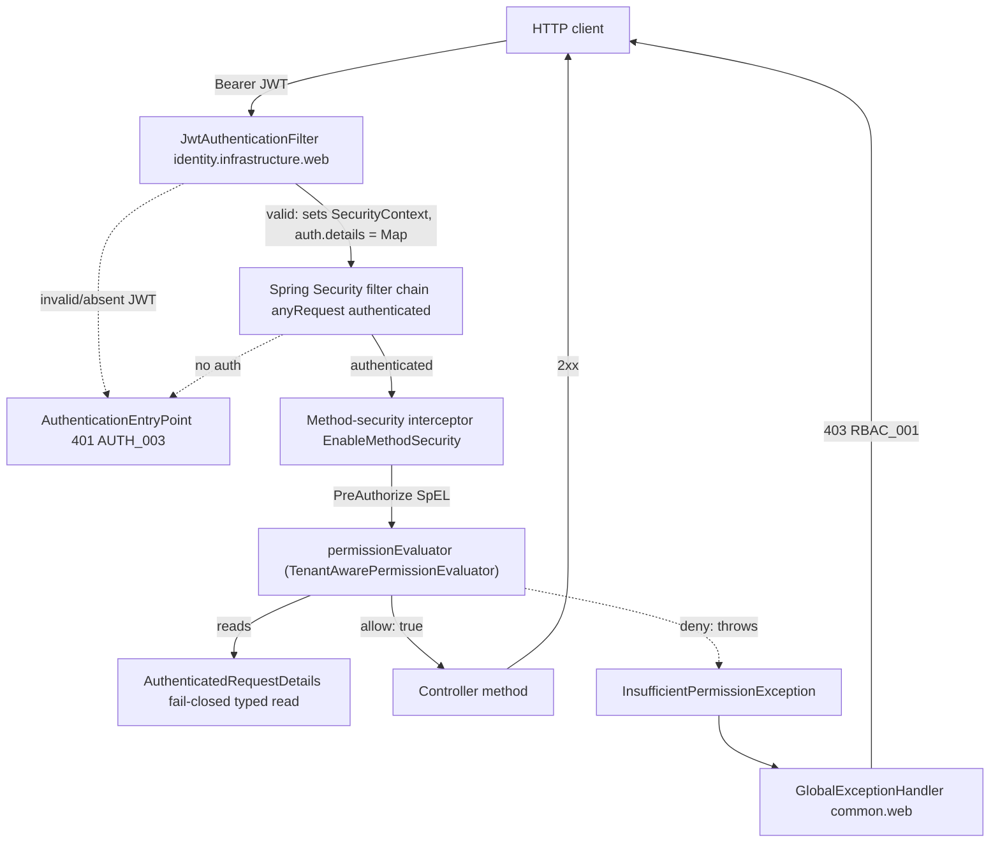

# US-011 — Solution Design: Enforce permission checks on API endpoints via Spring Security

_Output of Step 3 (`/design`, architect). Gate 2 deliverable. Feeds the STRIDE threat model (Step 3b) and task breakdown (Step 4)._

**Binding inputs (not reopened):** `01-requirements.md` (Gate-1-approved FR1–FR10), `02-impact.md` (§10 lists the 9 decisions resolved below), `docs/story/2-rbac/US-011.md`, ADR-0013 D3, ADR-0007.

**Gate-1 lock carried in (do NOT re-open):** `@RequiresPermission("resource:action")` takes **only** the permission string. The tenant boundary is enforced *structurally at mint time* (US-010 resolves `permissions[]` for the caller's own `tenant_id`); this story's evaluator only reads that already-tenant-scoped claim and validates the caller's own `tenant_id` claim is present. There is **no** resource-tenant argument and **no** tenant-to-tenant comparison in this story. Resource-vs-caller tenant matching stays each consuming story's service-layer job.

**Verification basis (re-read this session, not trusted from the impact doc):**
- `config/SecurityConfig.java` — `@EnableWebSecurity` only (L41); filter chain `JwtAuthenticationFilter` before `UsernamePasswordAuthenticationFilter` (L74); `permitAll` list (L77–84); filter-chain-level `AccessDeniedHandler` returns `code=ACCESS_DENIED` (L115–125); `AuthenticationEntryPoint` returns `AUTH_003` 401 (L98–108).
- `identity/infrastructure/web/JwtAuthenticationFilter.java` — on a valid token builds `UsernamePasswordAuthenticationToken(sub, null, ROLE_* authorities)` and stashes `Map.of("tenantId", "emailVerified", "tokenVersion", "permissions")` as **untyped `Map<String,Object>`** in `setDetails(...)` (L79–83). On invalid token clears context and calls the entry point (401), chain short-circuited (L87–92).
- `common/web/GlobalExceptionHandler.java` — `@RestControllerAdvice`; generic `@ExceptionHandler(AccessDeniedException.class)` at L134–139 (`ACCESS_DENIED`, WARN); `problem()` builds Spring `ProblemDetail` with extension members `code` + `traceId` (L185–190); already imports `org.springframework.security.access.AccessDeniedException` (L22).
- `identity/domain/JwtClaims.java` — `tenantId` is `String` (L17); `permissions` is `List<String>`, defensively copied (L21, L34).
- `HexagonalArchitectureTest.java` — layer rules keyed on `..domain..`/`..application..`/`..infrastructure..`/`..interfaces..`; explicit bans on `org.springframework.web..`, `jakarta.servlet..`, Redis clients — **no Spring Security ban today**.
- `rbac/` tree — `domain/`, `application/`, `infrastructure/{persistence,cache,health}` only; **no `interfaces`/controller**.
- **Confirmed by grep:** no `domain`/`application` class anywhere imports `org.springframework.security` today (so the proposed ArchUnit ban rule §B8 will not break existing code).
- `common/domain/` holds `DomainException` + subtypes; none extend a Spring Security type. `CorrelationIdFilter.MDC_KEY = "traceId"`, `MDC_CORRELATION_ID_KEY = "correlationId"`.
- `config/SecurityConfigTest.java` — the reusable slice harness: `@SpringBootTest(webEnvironment=MOCK)` + H2 + `MockMvc` + `springSecurity()`, service beans `@MockitoBean` (no Docker).

---

## 0. Decision summary (the 9 items from `02-impact.md` §10)

| # | Decision | Resolution | Section |
|---|----------|-----------|---------|
| 1 | Package homes | Annotation, evaluator, exception, typed reader → new `common.security`; method-security config → `config.MethodSecurityConfig`. Keeps `common` free of `rbac`; evaluator lands outside any `..domain../..application..` package. | B1 |
| 2 | Typed vs untyped `Authentication` details | **Keep** the untyped `Map` as transport (no filter change); centralise the one unsafe read in a single tested reader `AuthenticatedRequestDetails.fromAuthentication(...)`. | B2 |
| 3 | SpEL / interface shape | Do **not** implement Spring's `PermissionEvaluator` interface. Named bean `@Component("permissionEvaluator")` with `boolean hasPermission(Authentication, String)`; `@RequiresPermission` is a `@PreAuthorize` meta-annotation with `{value}` template substitution. | B3 |
| 4 | Fail-closed contract | Evaluator **throws `InsufficientPermissionException` (403)** on any missing/malformed detail — never returns false silently, never 500, never allow. | B4 |
| 5 | Tenant comparison semantics | **No comparison.** Presence + non-blank guard on the caller's own `tenant_id` String, treated opaquely (no UUID re-parse, no case-folding). | B5 |
| 6 | AC5/AC7 proof mechanism | **Test-fixture controller** in `src/test/java` (`support.web.GuardedTestController`), not a real endpoint. Named endpoint for the cross-tenant `*IT`: `GET /internal-test/guarded` annotated `@RequiresPermission("tenant:write")`. | B6 |
| 7 | Denial observability | Structured **WARN log** (fields enumerated) via the new handler + a **Micrometer counter** `nexus.rbac.permission_denied{permission}`. **No** audit-stream event. | B7 |
| 8 | ArchUnit guardrails | **Add** the Spring-Security-ban-in-`domain`/`application` rule (yes). **Defer** the controller-must-be-annotated rule (no, with reasoning) to an Epic-3 entry criterion. | B8 |
| 9 | Single-permission scope | Confirmed: exactly one permission string; **no** AND/OR composition. | B9 |

---

## A. Solution overview

US-011 adds one developer-facing annotation and its enforcement backing. Nothing about the token-production path (EPIC-001's frozen `JwtAuthenticationFilter` → `SecurityContext`) changes. The mechanism is:

- **`@RequiresPermission("resource:action")`** — a method-level meta-annotation carrying `@PreAuthorize`. Applied on any controller method, present or future, in any bounded context.
- **`TenantAwarePermissionEvaluator`** — a Spring bean named `permissionEvaluator`, referenced from the `@PreAuthorize` SpEL. Reads `permissions[]` + `tenant_id` from the request `Authentication`, performs a flat set-membership check, and throws on denial.
- **`InsufficientPermissionException extends AccessDeniedException`** — carries `requiredPermission`; thrown by the evaluator (ADR-0013 D3).
- **`MethodSecurityConfig`** — `@EnableMethodSecurity` (global, FR10) + an `AnnotationTemplateExpressionDefaults` bean that lets the meta-annotation's `{value}` be substituted per usage.
- **`GlobalExceptionHandler`** — a new `@ExceptionHandler(InsufficientPermissionException.class)` returning the `RBAC_001` 403 contract; the existing generic `AccessDeniedException` handler is untouched and remains the fallback.

### A.1 Component graph



`RequiresPermission`, `TenantAwarePermissionEvaluator`, `AuthenticatedRequestDetails`, and `InsufficientPermissionException` all live in `common.security`. `MethodSecurityConfig` lives in `config`.

### A.2 Why method security is caught by `@RestControllerAdvice` (not the filter-chain handler)

This is the load-bearing runtime fact behind ADR-0013 D3. Two distinct access-denied paths coexist:

- **Filter-chain denial** (`authorizeHttpRequests`) → reaches `ExceptionTranslationFilter` → `SecurityConfig.accessDeniedHandler()` → `ACCESS_DENIED`.
- **Method-security denial** (`@PreAuthorize` on a controller method) is thrown *during* `DispatcherServlet` handler invocation, so it is resolved by `HandlerExceptionResolver` → `@RestControllerAdvice`, i.e. `GlobalExceptionHandler`.

Because the evaluator throws `InsufficientPermissionException` (a subtype), Spring's most-specific `@ExceptionHandler` dispatch selects the new handler → `RBAC_001`. Non-RBAC 403s are unaffected. No change to `SecurityConfig`'s `accessDeniedHandler` is needed.

---

## B. The nine decisions

### B1 — Package homes

New package **`com.example.nexus.common.security`** hosts the annotation, evaluator, typed reader, and exception. The method-security config goes in the existing root config package **`com.example.nexus.config`**.

| Class | Package | Justification |
|-------|---------|---------------|
| `RequiresPermission` (annotation) | `common.security` | A truly shared contract consumed by *every* context. Placing it under `rbac` would force `identity.interfaces` and all Epic-3 controllers to import an `rbac`-owned type — context coupling with no ownership rationale. `common` is the correct home for cross-cutting contracts. |
| `TenantAwarePermissionEvaluator` | `common.security` | Inbound security adapter. It must **not** live in `..domain..`/`..application..` (imports Spring Security + reads the servlet-produced `Authentication`). `common.security` matches **no** ArchUnit layer pattern, so no layer rule is violated, and it sits beside the annotation it backs. |
| `AuthenticatedRequestDetails` (typed reader) | `common.security` | Same rationale; the single choke point for reading `Authentication.getDetails()`. |
| `InsufficientPermissionException` | `common.security` | **Cannot** live in `common.domain` beside `DomainException` — it extends Spring's `AccessDeniedException`, not `DomainException` (ADR-0013 D3). It must live where `GlobalExceptionHandler` (`common.web`) can import it *without* `common` depending on `rbac`. Placing it under `rbac` would invert `common.web → rbac`. `common.security` avoids the inversion. |
| `MethodSecurityConfig` | `config` | Platform-wide global switch (FR10), sibling to `SecurityConfig`. A dedicated class (rather than adding `@EnableMethodSecurity` to `SecurityConfig`) keeps web-security and method-security concerns separable and gives a clean home for the template-defaults bean. |

**Divergence flag (for future contributors, per ADR-0013 trade-off note):** `InsufficientPermissionException` is the first cross-context exception in the codebase that does **not** extend `common.domain.DomainException`. This is intentional (D3) and localised to `common.security`. Do not assume all shared exceptions share one base.

### B2 — Typed vs untyped `Authentication` details

**Keep the untyped `Map<String,Object>` as the transport; do not change `JwtAuthenticationFilter`.** Wrap the single unsafe read in one tested value object:

```java
// common.security — annotation/signature sketch only
public record AuthenticatedRequestDetails(String tenantId, Set<String> permissions) {
    public static AuthenticatedRequestDetails fromAuthentication(Authentication authentication); // fail-closed
    public boolean hasPermission(String permission);
}
```

Rationale: changing the filter's `setDetails(...)` to a typed object is a broader, riskier edit to EPIC-001's frozen token→`SecurityContext` producer, which has its own contract tests. US-011 is enforcement plumbing and should not refactor the producer. Centralising the cast in one unit-tested factory captures the bulk of R4's benefit (no scattered `(Map) ... .get("permissions")` casts, defined fail-closed semantics) at a fraction of the blast radius. `permissions` is normalised to a `Set` once for O(1) membership.

**Note (post-implementation):** the shipped signature is `fromAuthentication(Authentication authentication, String requiredPermission)` — the sketch above omits the second argument. It exists solely so the fail-closed branches can construct `InsufficientPermissionException` with the correct `requiredPermission`; it plays no role in reading or validating the `Authentication.getDetails()` map itself. See the class Javadoc on `AuthenticatedRequestDetails` for the same explanation.

### B3 — SpEL / interface shape

**Do not implement `org.springframework.security.access.PermissionEvaluator`.** Use a named-bean SpEL method.

```java
// common.security — signature sketch only
@Component("permissionEvaluator")
public class TenantAwarePermissionEvaluator {
    public boolean hasPermission(Authentication authentication, String permission);
}
```

```java
// common.security — annotation sketch only
@Target(ElementType.METHOD)
@Retention(RetentionPolicy.RUNTIME)
@PreAuthorize("@permissionEvaluator.hasPermission(authentication, '{value}')")
public @interface RequiresPermission {
    String value();
}
```

Rationale: Spring's `PermissionEvaluator` interface exists for **domain-object ACL** checks — its signatures are `hasPermission(auth, targetDomainObject, permission)` and `hasPermission(auth, targetId, targetType, permission)`. After Gate 1 removed the tenant/target argument, we have neither a target object nor a `targetType+id`. Forcing our flat claim check through that interface means passing a misleading `null` target (`hasPermission(auth, null, '<perm>')`) and wiring `DefaultMethodSecurityExpressionHandler.setPermissionEvaluator(...)`. A named-bean SpEL call is an idiomatic, documented Spring Security pattern, keeps the signature honest (exactly the two values we use), and needs no expression-handler customisation. The bean name `permissionEvaluator` preserves the story's SpEL reference and ADR-0013's naming; the class name `TenantAwarePermissionEvaluator` is kept per D3.

**Meta-annotation templating (the AC5/AC7 enabler):** the per-usage permission string reaches the SpEL via `{value}` substitution. This requires registering an `AnnotationTemplateExpressionDefaults` bean (Spring Security 6.4, ships with Spring Boot 4.1) in `MethodSecurityConfig`. Without it, `{value}` is treated literally. Confirm the exact class name against the pinned Spring Security version at implementation time — the capability (meta-annotation attribute templating) is stable; the class was renamed across 6.3→6.4.

> **ADR Required.** This deviates from the story's literal Technical Note (`@permissionEvaluator.hasPermission(authentication, #tenantId, '{permission}')` implementing Spring's `PermissionEvaluator`). The deviation follows directly from the Gate-1 lock (no `#tenantId`). Recommend a short amendment note to ADR-0013 recording that the enforcement uses a named-bean SpEL method rather than the `PermissionEvaluator` interface, and a `{value}`-templated meta-annotation.

### B4 — Fail-closed contract

`AuthenticatedRequestDetails.fromAuthentication(...)` and the evaluator **fail closed by throwing `InsufficientPermissionException` (403)**, never returning `false` silently, never surfacing a 500, never allowing. Deny conditions:

- `Authentication` is `null` or not authenticated (should be impossible — the filter chain requires auth first — but denied defensively).
- `getDetails()` is absent or not a `Map`.
- `tenantId` entry absent, not a `String`, or blank.
- `permissions` entry absent or not a `List<String>`.
- Permission present and well-formed, but `permissions` does not contain the required string (includes the empty-array case, Edge 1).

Rationale: a malformed/foreign `Authentication` (e.g. a future non-`JwtAuthenticationFilter` code path, Edge 5) means we **cannot prove** authorization — the only safe answer is deny. Returning 403 (not 500) keeps the safe default, avoids leaking that something internal is inconsistent, and gives a uniform response shape. Throwing (rather than returning `false`) is what routes the denial through `InsufficientPermissionException` → `RBAC_001` rather than the generic `false → AccessDeniedException → ACCESS_DENIED` path.

### B5 — Tenant comparison semantics

**There is no tenant-to-tenant comparison in this story.** Per the Gate-1 lock, `permissions[]` on the JWT are already resolved *for the caller's own tenant* at mint time (US-010). The evaluator's only tenant responsibility is a **presence + non-blank guard** on the caller's own `tenant_id` claim (part of B4's fail-closed check), ensuring we never evaluate a token that lacks tenant context. The value is treated as an **opaque `String`** — no UUID re-parse, no case-folding, no canonicalisation.

Rationale: `JwtClaims.tenantId()` is a `String` minted from the tenant UUID's canonical `toString()`; it is already canonical. Re-parsing to `UUID` adds cost and a new failure mode (parse exception) for a value we never compare to anything in this story. This resolves Open Question 11 / Edge 11: neither raw-equality nor canonicalisation — **no equality operation occurs**.

**How AC2/FR3 (cross-tenant 403) is actually satisfied under this shape:** the boundary is enforced *upstream* and honoured *by construction*. A user who holds `tenant:write` only via a role in Tenant B, when presenting a token minted in the Tenant-A context, carries `permissions[]` resolved for Tenant A — which does **not** contain `tenant:write`. The evaluator reads only that token's own `permissions[]` (never a DB, never another tenant's grants), so the set-membership check fails → 403. The cross-tenant guarantee is therefore: *the evaluator never consults anything but the caller's own tenant-scoped token.* The `*IT` in E/§B6 proves exactly this.

### B6 — AC5/AC7 proof mechanism and the cross-tenant `*IT` target

**Use a dedicated test-fixture controller in `src/test/java`, not a real endpoint.**

- **Fixture:** `com.example.nexus.support.web.GuardedTestController` (test sources only), registered into the test context via an `@Import`ed `@TestConfiguration` — never component-scanned in production, so it cannot ship.
- **Named endpoint:** `GET /internal-test/guarded` annotated `@RequiresPermission("tenant:write")`, returning a trivial 200 body. A second method `GET /internal-test/guarded-user-read` annotated `@RequiresPermission("user:read")` supports the "has one permission but not another" case.

Rationale: annotating a *real* existing endpoint (the only production controllers today are `identity`'s auth endpoints, which are `permitAll` and legitimately unguarded) would change that endpoint's behaviour, break its existing tests and the frontend, and couple US-011's proof to unrelated semantics. AC5/AC7 is explicitly a *developer-contract* proof ("compiles and enforces without additional configuration") — a fixture controller demonstrates precisely that: the annotation, applied to an arbitrary method with zero bespoke wiring, enforces. This also cleanly satisfies Open Question 3/10 (the `rbac` context has no controller of its own).

**Cross-tenant `*IT` (Test Scenario 3, R1 Critical):** `CrossTenantPermissionIT` on Testcontainers MySQL. Seed (reusing the second-tenant seeding pattern added in `RoleResolutionServiceIT`): user U with a role granting `user:read` in Tenant A, and `tenant:write` only via a role in Tenant B. Mint U's real token in the Tenant-A context (`JwtRs256Service` + `RoleResolutionService`), yielding `permissions=[user:read]`, `tenant_id=A`. Call `GET /internal-test/guarded` (requires `tenant:write`). Assert **403 + `RBAC_001`**, proving the Tenant-B grant does not leak into a Tenant-A token.

### B7 — Denial observability

**Structured WARN log + Micrometer counter; no audit-stream event.**

The new `@ExceptionHandler(InsufficientPermissionException.class)` logs at WARN (matching the existing `ACCESS_DENIED` convention) with these fields (`userId`/`tenantId` are still in MDC because the denial is thrown *inside* `JwtAuthenticationFilter.doFilter`, before its `finally` clears MDC):

| Field | Source |
|-------|--------|
| `event` | `permission_denied` |
| `outcome` | `FAILURE` |
| `errorCode` | `RBAC_001` |
| `requiredPermission` | `ex.getRequiredPermission()` |
| `userId` | MDC (set by filter) |
| `tenantId` | MDC (set by filter) |
| `correlationId` / `traceId` | MDC |
| `errorType` | `InsufficientPermissionException` |

Plus a Micrometer counter **`nexus.rbac.permission_denied`** tagged `permission=<required>` (low cardinality — the permission set is a closed code-defined list of 7). **Do not** tag with `userId`/`tenantId` (unbounded cardinality). Increment in the handler (single choke point).

**No dedicated audit event.** Rationale: the epic explicitly requires auditing *role assignment/revocation* but is silent on permission-*check* denials (requirements Gap 1, Open Q7). Coupling this enforcement path to the audit subsystem (`SecureEventService`) is scope the source material does not ask for and would add a `REQUIRES_NEW` write to a hot, read-only path. The WARN log + counter give Security the signal (alertable spike in `nexus.rbac.permission_denied`) without that coupling. If Security later wants denials audited, that is a separate, additive decision. This keeps the design's observability plan explicit and complete (per the operability rule) while respecting the stated scope.

### B8 — ArchUnit guardrails

**Add** one rule; **defer** the other.

- **ADD — Spring Security banned from `domain`/`application`** (mirrors the existing Redis ban, L51–57): `noClasses().that().resideInAnyPackage("..domain..", "..application..").should().dependOnClassesThat().resideInAnyPackage("org.springframework.security..").allowEmptyShould(true)`. Verified safe: **zero** current `domain`/`application` classes import Spring Security. This is a first-of-its-kind mechanism; the rule prevents `@PreAuthorize`/`Authentication` types leaking inward as the pattern spreads across contexts. Cheap, high-value, no false positives today.
- **DEFER — "every controller method must carry `@RequiresPermission`"** (R3, Open Q6). Recommendation: **not in this story.** The only controllers today are `identity`'s auth endpoints, which are deliberately `permitAll` and unauthenticated (`register`, `login`, `refresh`, …); a blanket rule would false-positive on all of them and force an awkward opt-out marker before any real protected endpoint exists. This is a PM/Security policy decision, not an architecture fact, and it belongs where it has teeth: as an **Epic-3 entry criterion** (the epic's "zero unguarded endpoints from Epic 3 onward" goal), introduced alongside the first genuinely protected controller with an explicit `@PublicEndpoint`/opt-out convention. Flag it forward; do not build it speculatively here.

### B9 — Single-permission scope

**Confirmed: `@RequiresPermission` takes exactly one permission string. No AND/OR composition.** No endpoint in the epic's API table needs multiple permissions on one method (US-012 `POST /users/{userId}/roles` needs `role:write`; US-015 role CRUD needs `role:read`/`role:write` — each a single permission per method). Keeping `value()` a single `String` (not `String[]`) makes the contract unambiguous and the SpEL trivial. If a future story needs composition, that is a new, additive decision (add an array attribute + a documented AND/OR policy) — not retrofitted now.

**Related (Edge 6 / Open Q9 — typo permission string):** a permission string that is not one of the seven seeded names is not validated at startup. It manifests as a permanent 403 for that endpoint (fail-closed — the string can never be in any real `permissions[]`). This is the safe failure mode; startup validation would require the config to know the closed permission set (a coupling to `rbac` seed data that `common` must not have). Document in developer guidance (Step 9): the annotation value must exactly match a seeded permission; a mismatch always denies.

---

## C. API contract

**No new REST endpoint of this story's own.** The `rbac` context still has no `interfaces`/controller package; US-011 ships no path, method, or DTO. The only production API surface change is a new *failure* response now reachable on any endpoint once it is annotated — additive, non-breaking, no versioning needed.

### C.1 The `RBAC_001` 403 response

Produced by the new handler via the existing `GlobalExceptionHandler.problem(...)` builder (Spring `ProblemDetail`, `application/problem+json`), with one added extension member:

```yaml
# Response: 403 Forbidden  (application/problem+json)
components:
  schemas:
    InsufficientPermissionProblem:
      type: object
      properties:
        type:               { type: string, example: "about:blank" }
        title:              { type: string, example: "Forbidden" }
        status:             { type: integer, example: 403 }
        detail:             { type: string, example: "You do not have permission to perform this action" }
        code:               { type: string, example: "RBAC_001" }
        traceId:            { type: string, example: "b1f2c3d4-..." }
        requiredPermission: { type: string, example: "tenant:write" }
```

**Two naming reconciliations against the codebase envelope (decisive calls):**

1. **`message` → `detail`.** AC3 says the body contains `message`. The platform's `ProblemDetail` envelope carries the human-readable string in the RFC-7807-standard **`detail`** member (every existing handler does this via `forStatusAndDetail`). The `RBAC_001` response uses `detail = "You do not have permission to perform this action"` — the exact AC3 sentence, in the house field. No new `message` member is introduced; that would diverge from every other error in the system.
2. **`required_permission` → `requiredPermission`.** AC3 literally shows snake_case. Every existing extension member in the Nexus problem envelope is camelCase (`code`, `traceId`), and the `api-design` skill forbids snake_case field names. The design uses **`requiredPermission`** for envelope consistency.

> **ADR Required / needs PM + US-013 sign-off.** Both reconciliations technically deviate from AC3's literal text. They are the correct architectural calls (consistency with the frozen problem envelope; no consumer is frozen yet — the frontend guard US-013 is not built). Recommend AC3 be amended to `detail` + `requiredPermission`. If a stakeholder insists on the literal `required_permission`/`message`, it is a one-line change, but it would make this the only endpoint in the platform with a bespoke snake_case member and a duplicate of `detail` — not recommended.

### C.2 Other outcomes (unchanged, restated for the review checklist)

- **401** (`AUTH_003`) — no/invalid/tampered JWT. Emitted by `JwtAuthenticationFilter` → `AuthenticationEntryPoint` **before** the method-security proxy runs (FR5, Test Scenario 5). The evaluator is never reached.
- **Generic 403** (`ACCESS_DENIED`) — filter-chain denials, unchanged fallback.

---

## D. DB / migration

**None. No Flyway migration, no schema touch.** Explicitly, for the review checklist:

- Enforcement reads **only** the JWT `permissions[]`/`tenant_id` claims already on the request `Authentication` (FR7). No per-request query.
- The RBAC schema (`V5__rbac_schema.sql`) already exists from US-009; US-011 adds no table, column, index, or constraint.
- `RoleResolutionService` (mint-time only) is **not** invoked per request.
- `ddl-auto=validate` (ADR-0003) is unaffected — no entity change, so nothing to validate against.

---

## E. Test plan outline

Three tiers (impact §6). Fixture from B6: `GuardedTestController` at `GET /internal-test/guarded` (`@RequiresPermission("tenant:write")`).

### E.1 Unit (JUnit 5 + Mockito, no Spring context)

`TenantAwarePermissionEvaluatorTest` and `AuthenticatedRequestDetailsTest`:

| Scenario | Assert | Covers |
|----------|--------|--------|
| `permissions` contains required | returns `true` | FR1 |
| `permissions` present, missing required | throws `InsufficientPermissionException(requiredPermission)` | FR2 |
| `permissions` empty array | throws | Edge 1 |
| `getDetails()` null / not a `Map` | throws (fail-closed, not 500) | B4, Edge 5 |
| `tenantId` absent / blank / non-String | throws | B4, B5 |
| `permissions` entry absent / wrong type | throws | B4, R4 |
| `Authentication` null / unauthenticated | throws | B4 |

### E.2 Slice / MockMvc (`@SpringBootTest(MOCK)` + `springSecurity()`, reusing the `SecurityConfigTest` harness, H2, no Docker)

`RequiresPermissionMockMvcTest`, targeting the fixture controller:

| Scenario | Assert | Covers |
|----------|--------|--------|
| Authenticated caller **with** `tenant:write` | 200 | FR1, AC1, Test Scenario 1 |
| Authenticated caller **without** `tenant:write` | 403 + `RBAC_001` + `requiredPermission=tenant:write` + `detail` sentence | FR2/FR4, AC1/AC3, Test Scenario 2 |
| **No** JWT | 401 (`AUTH_003`), evaluator never invoked | FR5, AC4, Test Scenario 4 |
| Tampered JWT (bad signature, injected `permissions`) | 401 (filter rejects before evaluator) | FR5, Test Scenario 5 |
| `permitAll` endpoint (e.g. `/actuator/health`) with method security enabled | still reachable (no annotation) | Edge 9, Gap 7 |
| Annotation applied to a fresh fixture method compiles and enforces with no extra wiring | 403/200 as expected | FR6, AC5/AC7, Test Scenario 7 |

### E.3 Integration / security (`*IT`, Testcontainers MySQL 8.4, real seeded RBAC + real minted tokens)

`CrossTenantPermissionIT` (the R1-Critical suite; per the epic, must be green and gate CI before Epic 3):

| Scenario | Assert | Covers |
|----------|--------|--------|
| Caller holds `tenant:write` only in Tenant B; token minted for Tenant A; calls `GET /internal-test/guarded` | **403 + `RBAC_001`** (Tenant-B grant absent from Tenant-A token) | FR3, AC2, Test Scenario 3 |
| Same user, token minted for the tenant where they *do* hold `tenant:write` | 200 | FR1 (positive control for the boundary) |

**Performance (FR8/AC6):** the evaluator does an in-memory `Set.contains` + presence guard on data already on the request — no DB, no Redis, no I/O. The `< 5ms` budget is met by construction (impact §7). No dedicated perf test is warranted for the component; the epic's 200-RPS/p95<300ms Scenario 6 is a system-level endpoint target for a future real endpoint, not this component's gate. State this rather than build a synthetic micro-benchmark.

**ArchUnit:** add the assertion (§B8) to `HexagonalArchitectureTest` and confirm green.

---

## F. Package / class list

### Production — `nexus-backend/src/main/java/com/example/nexus/`

| Path | New/Mod | Purpose |
|------|---------|---------|
| `common/security/RequiresPermission.java` | **New** | `@PreAuthorize` meta-annotation, single `String value()`, `{value}` template. |
| `common/security/TenantAwarePermissionEvaluator.java` | **New** | `@Component("permissionEvaluator")`; `boolean hasPermission(Authentication, String)`; throws on deny. |
| `common/security/AuthenticatedRequestDetails.java` | **New** | Typed, fail-closed reader of `Authentication.getDetails()` (record + `fromAuthentication`). |
| `common/security/InsufficientPermissionException.java` | **New** | `extends AccessDeniedException`; carries `requiredPermission`. |
| `config/MethodSecurityConfig.java` | **New** | `@EnableMethodSecurity` + `AnnotationTemplateExpressionDefaults` bean. |
| `common/web/GlobalExceptionHandler.java` | **Mod** | Add `@ExceptionHandler(InsufficientPermissionException.class)` → 403 `RBAC_001` (`detail` + `requiredPermission`), WARN log, counter increment. |

*(`SecurityConfig.java` is intentionally NOT modified — method security lives in its own config; the filter chain, `permitAll` list, and access-denied handler are untouched.)*

### Test — `nexus-backend/src/test/java/com/example/nexus/`

| Path | New/Mod | Purpose |
|------|---------|---------|
| `support/web/GuardedTestController.java` | **New** | Test-only fixture controller; `GET /internal-test/guarded` (`@RequiresPermission("tenant:write")`) + a `user:read` variant. |
| `support/web/GuardedTestControllerConfig.java` | **New** | `@TestConfiguration` importing the fixture; keeps it out of the production component scan. |
| `common/security/TenantAwarePermissionEvaluatorTest.java` | **New** | Unit — evaluator logic + throw-on-deny. |
| `common/security/AuthenticatedRequestDetailsTest.java` | **New** | Unit — fail-closed extraction (E.1). |
| `common/security/RequiresPermissionMockMvcTest.java` | **New** | Slice — wiring, 401-vs-403, `RBAC_001` shape (E.2). |
| `rbac/security/CrossTenantPermissionIT.java` | **New** | `*IT` — cross-tenant boundary (E.3), Testcontainers. |
| `architecture/HexagonalArchitectureTest.java` | **Mod** | Add Spring-Security-ban-in-`domain`/`application` rule (§B8). |
| `common/web/GlobalExceptionHandlerTest.java` (if present) | **Mod** | Add `RBAC_001` mapping case. |

---

## G. Explicitly out of scope (restated)

- **Field-level / row-level permission filtering** (story Out of Scope).
- **ABAC / resource-attribute conditions** (story Out of Scope).
- **Any request-path caching** — enforcement reads JWT claims only; introducing Redis/any cache on the hot path is expressly rejected (impact §7). AC6's "cache hit path" wording is stale (inherited from US-010's mint-time cache) and describes no mechanism this story builds. Nexus's Redis stays confined to rate-limiting + mint-time permission cache; adding request-path caching would need its own ADR — none is warranted.
- **Fixing the pre-existing `JwtRs256Service → rbac.application` coupling** (tracked MEDIUM from US-010; not touched here).
- **Multi-permission AND/OR composition** (B9 — single permission only).
- **Resource-vs-caller tenant matching** ("is this target user in my tenant") — each consuming story's service-layer job, per the Gate-1 lock; not the evaluator's.
- **Controller-must-be-annotated enforcement** (B8 — deferred to an Epic-3 entry criterion).
- **Auditing permission denials to the security event stream** (B7 — WARN log + counter only).
- **Same-class self-invocation** limitation of Spring AOP method security — a known constraint to document in developer guidance (Step 9), not a code deliverable of this story (Edge 7 / R8 / Gap 6).
- **Any change to the frozen `JwtClaims` contract or `JwtAuthenticationFilter` details `Map`** (B2 — read-side wrapper only).

---

### Cross-references
- Story: `docs/story/2-rbac/US-011.md`
- Requirements: `docs/features/US-011/01-requirements.md`
- Impact: `docs/features/US-011/02-impact.md`
- ADR-0013 D3 (exception contract), ADR-0007 (hand-rolled JJWT filter)
- `config/SecurityConfig.java`, `identity/infrastructure/web/JwtAuthenticationFilter.java`, `common/web/GlobalExceptionHandler.java`, `identity/domain/JwtClaims.java`, `architecture/HexagonalArchitectureTest.java`, `config/SecurityConfigTest.java`

---

## Notes carried forward to threat model / task breakdown

Three decisions carry an **ADR Required** or sign-off flag and should be explicitly re-examined by the STRIDE threat model and/or called out in the task breakdown:

1. **B3 — named-bean SpEL, not the `PermissionEvaluator` interface.** A justified deviation from the story's literal Technical Note, forced by the Gate-1 removal of `#tenantId`. Recommend a short ADR-0013 amendment.
2. **C.1 — two envelope reconciliations** (`message` → RFC-7807 `detail`; `required_permission` → camelCase `requiredPermission`). These technically diverge from AC3's literal text but conform to the platform's existing problem envelope and the `api-design` house rule. Needs PM + US-013 (frontend guard) sign-off; one-line reversal if a stakeholder insists on the literal snake_case.
3. **B7 — no audit event for denials** (WARN log + Micrometer counter only), and **B8 — the "controller-must-be-annotated" ArchUnit rule is deferred** to an Epic-3 entry criterion rather than built here. Both are policy calls (Security/PM own them) that are recommended rather than silently assumed.
