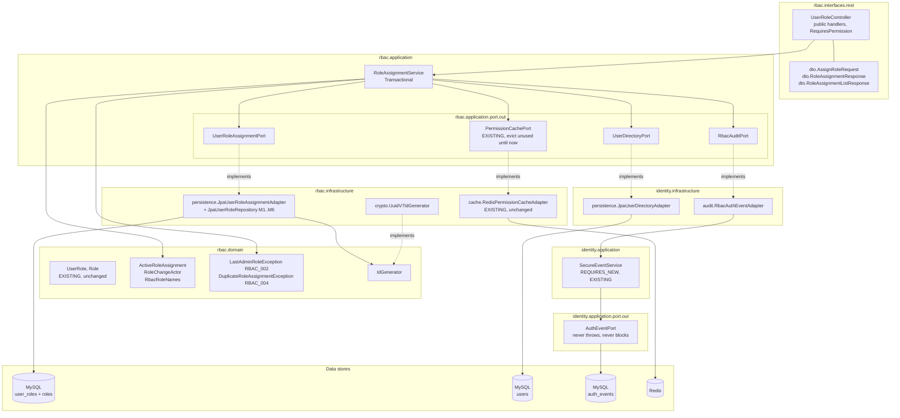
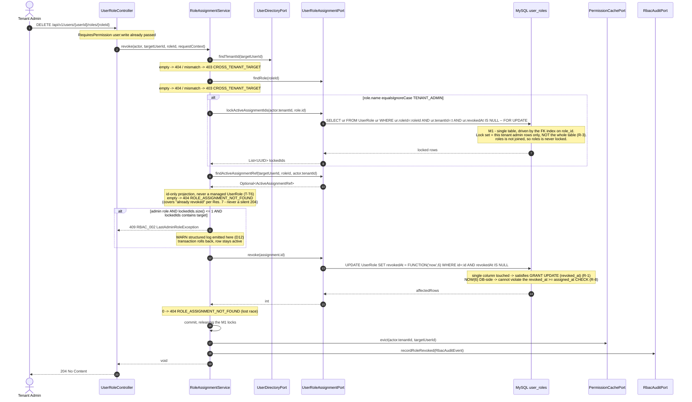
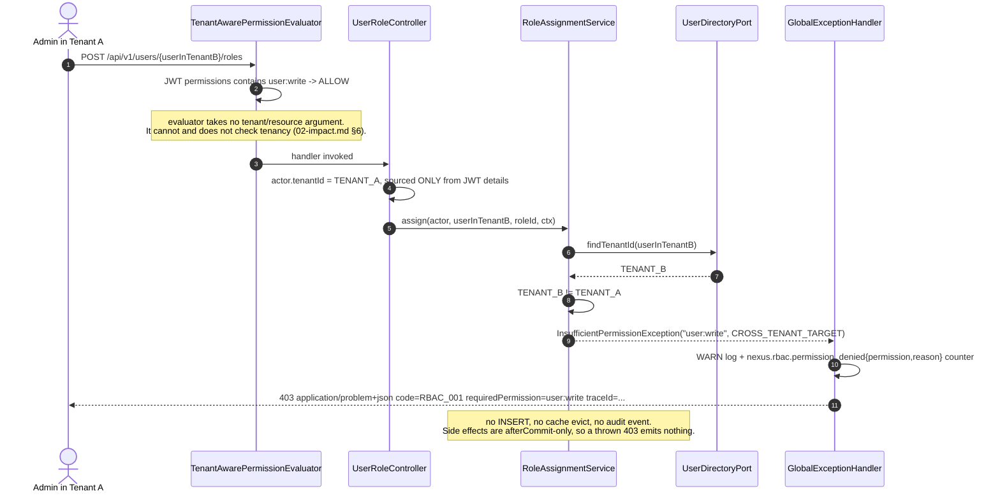

# US-012 — Solution Design: Enable role assignment and revocation API

**Feature:** Enable role assignment and revocation API
**Epic:** EPIC-002 (RBAC Foundation)
**Phase:** 3 (Solution Design) — Gate 2
**Author:** Principal Architect
**Status:** Revised post-threat-model — `docs/features/US-012/03b-threat-model.md` (APPROVE WITH CONDITIONS) reviewed; all 8 required design changes (T-E8, T-R3, T-T6, T-R4, T-E7, T-S4, T-E13, R-4/O-1) applied inline below, marked with their threat ID. Ready for `/breakdown`.

**Inputs (both treated as settled; not re-litigated):**
- `docs/features/US-012/01-requirements.md` — Gate 1 approved. §11 Resolutions 1–11 are binding.
- `docs/features/US-012/02-impact.md` — Gate 1.5. §13 risks R-1…R-12 and §14 open items 1–12 are this document's mandate.

This document's job is to **close §14's twelve open items** plus the four §13 items flagged as needing a design answer (R-4, R-5, R-8, R-9, R-7), and to emit the concrete artifacts (`/breakdown` needs signatures, JPQL, contracts, and a test list).

---

## 0. Decision summary

| # | Open item (`02-impact.md` §14) | Decision | Deviates from impact-analysis recommendation? |
|---|---|---|---|
| D1 | M1 locking query shape | Two-step: non-locking role load, then a **single-table** JPQL `@Lock(PESSIMISTIC_WRITE)` read over `user_roles` keyed on `role_id`. No join ⇒ no `FOR UPDATE OF` needed, `roles` is never locked. §5.2 | No — implements shape (A), goes further by eliminating the join entirely |
| D2 | Revocation write mechanism | JPQL bulk `UPDATE UserRole SET revokedAt = FUNCTION('now', 6) WHERE id = :id AND revokedAt IS NULL`, `@Modifying(clearAutomatically = true)`, returns affected-row count. §5.2 M6 | No (adopts bulk UPDATE); adds the R-8 fix inside it |
| D3 | New port shape | Separate `rbac.application.port.out.UserRoleAssignmentPort`. `UserRoleQueryPort` untouched. §4.3 | No |
| D4 | `RBAC_004` carrier | Dedicated `rbac.domain.DuplicateRoleAssignmentException extends ConflictException` | No |
| D5 | AC4 / AC8 403 exception type | Reuse `common.security.InsufficientPermissionException` + **two new `DenialReason` constants** (`CROSS_TENANT_TARGET`, `NOT_TENANT_ADMIN`) | No, but adds a 2-constant change to `common.security` (§7.2) |
| D6 | Audit metadata JSON site + escaping | Built in `identity.infrastructure.audit.RbacAuthEventAdapter` using **Jackson `ObjectMapper`**, not a hand-copied `jsonEscape`. §6.3 | **Partially** — same site, stronger escaping mechanism. Justified in §6.3 |
| D7 | `GET` DTO fields + pagination | `{ "data": [ {userId, roleId, roleName, assignedAt, assignedBy} ] }`. Envelope now, **no `page`/`links`** — bounded result set, forward-compatible. §8.3 | No, but honours the `api-design` skill envelope, so a 3rd DTO appears |
| D8 | 403 vs 404 for cross-tenant `userId` | **403** `RBAC_001` / `CROSS_TENANT_TARGET`. Oracle accepted as residual risk with stated justification. §8.5 | No (keeps Res. 6 as written) |
| D9 | ArchUnit `rbac ↛ identity` rule | **Yes**, add it. Forces D13 (rbac-local id generator). §7.4 | No |
| D10 | `ROLE_ASSIGNED`/`ROLE_REVOKED` in `AuthEventType.PRIORITY` | **REVERSED post-threat-model (T-R4): Yes, add them.** §6.2 | Yes — original decision reversed after review found the STANDARD lane's drop-newest behaviour under correlated `LOGIN_FAILURE` load could silently drop role-change audit events |
| D11 | Feature flag | **Add one**: `feature.nexus-us012-rbac-role-assignment.enabled`, default `false`. §10 | **Yes — overrides the story's "Feature flag required: No"**. Justified in §10.1 |
| D12 | Observability | `http.server.requests` for rate/latency (free); new generic `nexus.domain.conflict{code}` counter in `GlobalExceptionHandler`; new `nexus.rbac.audit_write_failed{operation}` counter + page alert (T-R3); WARN structured log at the `RBAC_002` throw site; free `nexus.rbac.permission_denied{reason}` for AC4/AC8. §9 | Partially — adds a handful of lines of non-dispatch code to `common.web`/`identity.infrastructure.audit` |
| D13 | *(consequence of D9)* UUID generation for new `user_roles.id` | New `rbac.domain.IdGenerator` + `rbac.infrastructure.crypto.UuidV7IdGenerator`. §4.7 | New — not in §14; forced by D9 |
| D14 | *(consequence of Res. 8/9)* post-commit side effects | `TransactionSynchronizationManager` `afterCommit` inside the transactional method, with an inline fallback when no transaction is active. §6.4 | New — not in §14 |
| D15 | *(R-12)* malformed UUIDs | Path variables and body `roleId` are **`String` + Bean Validation**, parsed after validation. Yields 400, not 500, with **zero** new handler code. §8.6 | Resolves R-12; more than the "accept and document" minimum |

**No new Flyway migration.** Confirmed per `02-impact.md` §2.1 — `V5__rbac_schema.sql` already carries every column, index, constraint, and trigger this story needs. §5.1 states why the optional `V6` index is also declined. **No `UserRole.java` change** either (§5.4 explains how the 201 body gets the DB-generated `assigned_at` without one).

**ADR required? No.** Every decision encodes an already-accepted position (ADR-0003 append-only Flyway, ADR-0005 UUIDv7, ADR-0013 D1/D2/D3, ADR-0014 D5/D6, ADR-0016 D3/D4/D6, plus Gate 1 Resolutions 1–11). **R-4/O-1 is resolved — the conditional ADR trigger does not fire.** Threat-model review (§0.2 of `03b-threat-model.md`) empirically verified against a live MySQL 8.4.10 instance reproducing `V5`'s schema and the exact `nexus_app` grant set that `SELECT … FOR UPDATE` **succeeds** under the column-scoped `UPDATE (revoked_at)` grant. D1 ships exactly as designed; `nexus_app`'s grant is not widened; §5.3's lock-free fallback is unnecessary and demoted to an appendix below.

---

## 1. Overview and goals

US-012 adds the **first controller in the `rbac` bounded context** and the platform's first genuinely privileged surface: three endpoints letting a tenant administrator assign, list, and revoke roles for users **within their own tenant**.

Goals, in priority order:

1. **Be the actual control for T-E1.** AC8 (only an active `TENANT_ADMIN` may grant `TENANT_ADMIN`) and AC4 (tenant isolation) are the only things between a self-registered bootstrap-tenant member and all seven permissions (`01-requirements.md` §1, `02-impact.md` §6). Both are **service-layer logic** — `TenantAwarePermissionEvaluator` compares nothing but JWT `permissions[]` membership.
2. **Never leave a tenant with zero admins** (AC5), including under concurrency (R-3 / Res. 8).
3. **Fail visibly, not in production only.** Two of the three top risks (R-1 column-scoped `UPDATE`; R-4 locking-read privilege) are invisible to the entire existing IT suite because every `*IT` connects as the Testcontainers `test` superuser. This design mandates the mechanism that avoids R-1 and a `nexus_app`-connected IT that proves both.
4. **Add nothing to the platform.** Zero new dependencies, zero migrations, zero frontend files, zero breaking changes (`02-impact.md` §10, §1.6, §12).

Non-goals, restated: bulk assignment, role-assignment UI, time-limited assignments (story Out of Scope); rate limiting (Res. 10); `ROLE_ASSIGNMENT_DENIED` events and audit-query tooling (US-014).

---

## 2. Architecture



**The dependency direction, made explicit.** Every dotted `implements` edge that crosses the context boundary points **from `identity.infrastructure` into `rbac.application.port.out`** — never the reverse. `rbac` declares `RbacAuditPort` and `UserDirectoryPort`; `identity` implements them. This preserves the single pre-existing edge direction (`identity → rbac`, via `JwtRs256Service → RoleResolutionService`, verified in `02-impact.md` §5.1) and introduces no cycle. D9's ArchUnit rule makes it mechanical rather than aspirational.

**Why `RbacAuditPort` rather than calling `SecureEventService` directly** (Res. 1): the retry-buffer, `REQUIRES_NEW` demarcation, `AuditLane` routing, and the append-only `auth_events` privilege/trigger protections are all reused **unchanged**. `rbac` gets audit durability for free without duplicating audit infrastructure and without importing `identity`.

**Where the row lock sits relative to the second connection.** `SecureEventService.recordEvent` borrows a second pooled connection (`REQUIRES_NEW`) while the first is held. Because D14 fires it *after commit*, the row lock from D1 is already released by then — so US-012 does **not** hold a `FOR UPDATE` lock while waiting on a second connection. This closes the concern raised in `02-impact.md` §7 ("connection-pool note") by construction rather than by monitoring.

---

## 3. Sequence diagrams

### 3.1 `POST /api/v1/users/{userId}/roles` — success, including the AC8 live-admin branch

```mermaid
sequenceDiagram
    autonumber
    actor Admin as Tenant Admin
    participant F as JwtAuthenticationFilter
    participant AOP as PreAuthorize / TenantAwarePermissionEvaluator
    participant C as UserRoleController
    participant S as RoleAssignmentService
    participant UD as UserDirectoryPort
    participant AP as UserRoleAssignmentPort
    participant TX as Transaction
    participant Cache as PermissionCachePort
    participant Aud as RbacAuditPort

    Admin->>F: POST /api/v1/users/{userId}/roles + Bearer JWT
    F->>F: validate JWT, set principal + details tenantId/permissions, set MDC
    F->>AOP: proceed
    AOP->>AOP: JWT permissions contains user:write ?
    Note over AOP: absent -> 403 RBAC_001 PERMISSION_ABSENT
    AOP->>C: assignRole(userId, body, authentication)
    C->>C: validate path/body UUID strings, then parse
    C->>C: AuthenticatedRequestDetails.fromAuthentication(auth, "user:write")
    C->>C: actor = RoleChangeActor(principal, UUID.fromString(details.tenantId))
    Note over C: unparseable tenant -> 403 MISSING_TENANT, fail closed
    C->>S: assign(actor, targetUserId, roleId, requestContext)

    S->>TX: begin (REQUIRED)
    S->>UD: findTenantId(targetUserId)
    UD-->>S: Optional<UUID>
    Note over S: empty -> 404 USER_NOT_FOUND
    S->>S: targetTenant equals actor.tenantId ?
    Note over S: no -> 403 CROSS_TENANT_TARGET

    S->>AP: findRole(roleId)
    AP-->>S: Optional<Role>
    Note over S: empty -> 404 ROLE_NOT_FOUND<br/>role.tenantId mismatch -> 403 CROSS_TENANT_TARGET

    alt role.name equalsIgnoreCase TENANT_ADMIN  (AC8)
        S->>AP: hasActiveAdminAssignment(actor.userId, role.id, actor.tenantId)
        Note right of AP: M5 - LIVE, LOCKING DB read (PESSIMISTIC_READ), never the JWT roles[] claim (R-5, T-E7)
        AP-->>S: false
        S-->>C: 403 RBAC_001 NOT_TENANT_ADMIN
    end

    S->>AP: hasActiveAssignment(targetUserId, roleId)
    Note right of AP: M2 - mirrors uq_user_role_active exactly, no tenant predicate
    AP-->>S: false
    S->>AP: assign(targetUserId, roleId, actor.tenantId, actor.userId)
    Note right of AP: INSERT; DataIntegrityViolation -> RBAC_004 (TOCTOU backstop)
    AP-->>S: newUserRoleId
    S->>AP: findActiveAssignmentView(targetUserId, roleId, actor.tenantId)
    Note right of AP: M4a projection - reads DB-generated assigned_at
    AP-->>S: ActiveRoleAssignment
    S->>S: register afterCommit synchronization
    S->>TX: commit
    TX-->>S: committed
    S->>Cache: evict(actor.tenantId, targetUserId)
    S->>Aud: recordRoleAssigned(RbacAuditEvent)
    Note over Cache,Aud: best-effort, post-commit (Res. 8/9)<br/>neither may throw or block
    S-->>C: ActiveRoleAssignment
    C-->>Admin: 201 Created + Location + RoleAssignmentResponse
```

### 3.2 `DELETE /api/v1/users/{userId}/roles/{roleId}` — AC5 lockout guard



**Why this closes the R-3 TOCTOU race.** `SELECT … FOR UPDATE` is a *current* read, so it observes the latest committed state and **blocks** on rows another uncommitted transaction holds. Two concurrent revocations of two different admins in the same tenant: T1 acquires the locks over the `role_id = adminRoleId` index range and sees `size() == 2`, proceeds, commits. T2's identical locking read blocks until T1 commits, then re-reads and sees `size() == 1` containing its own target ⇒ `RBAC_002`. The tenant keeps one admin. The next-key/gap locks over that index range additionally block a concurrent *insert* of a new `TENANT_ADMIN` assignment for the duration — a bonus serialization that prevents an assign/revoke interleaving from producing a false "not the last one" verdict.

### 3.3 Failure path — cross-tenant target (AC4, all three verbs)



Identical shape for `GET` (`user:read`) and `DELETE` (`user:write`) — Res. 6 applies tenant isolation uniformly to all three verbs, correcting AC4's `POST`-only DoD text.

**Threat-model correction (T-E8, Medium — required before `/breakdown`).** `GET`'s tenant check is **not optional and not redundant** with M4's `r.tenantId = :tenantId` predicate, even though M4 alone would already prevent cross-tenant *data* from leaking. `listActive` MUST call `UserDirectoryPort.findTenantId(targetUserId)` and compare against `actor.tenantId()` **before** calling M4, exactly as `assign`/`revoke` do:

```
S -> UD: findTenantId(targetUserId)
    empty       -> 404 USER_NOT_FOUND
    != actor.tenantId -> 403 RBAC_001 / CROSS_TENANT_TARGET
S -> AP: findActiveAssignmentViews(targetUserId, actor.tenantId)   [M4, only after the check above]
```

Without this explicit check, the natural implementation returns `200 {"data": []}` for both a cross-tenant target and a nonexistent user — which (a) violates §8.4 rows 5 and 8 outright, and (b) silently destroys the WARN log + `nexus.rbac.permission_denied{reason=CROSS_TENANT_TARGET}` counter that §8.5 relies on to justify accepting the 403-vs-404 existence oracle elsewhere. A cross-tenant `GET` must be as loud as a cross-tenant `POST`/`DELETE`.

---

## 4. Component / class design

Package layout follows `02-impact.md` §1.4's verified convention: controllers directly in `interfaces/rest/`, records in `interfaces/rest/dto/`.

### 4.1 `rbac.interfaces.rest.UserRoleController`

```java
@RestController
@RequestMapping("/api/v1/users")
@ConditionalOnProperty(name = "feature.nexus-us012-rbac-role-assignment.enabled", havingValue = "true")
@Tag(name = "Role Assignment", description = "Tenant-scoped role assignment and revocation")
public class UserRoleController {

  public UserRoleController(RoleAssignmentService roleAssignmentService);

  @PostMapping("/{userId}/roles")
  @RequiresPermission("user:write")
  public ResponseEntity<RoleAssignmentResponse> assignRole(
      @PathVariable String userId,
      @Valid @RequestBody AssignRoleRequest request,
      Authentication authentication,
      HttpServletRequest httpRequest);

  @GetMapping("/{userId}/roles")
  @RequiresPermission("user:read")
  public RoleAssignmentListResponse listRoles(
      @PathVariable String userId,
      Authentication authentication);

  @DeleteMapping("/{userId}/roles/{roleId}")
  @ResponseStatus(HttpStatus.NO_CONTENT)
  @RequiresPermission("user:write")
  public void revokeRole(
      @PathVariable String userId,
      @PathVariable String roleId,
      Authentication authentication,
      HttpServletRequest httpRequest);
}
```

Hard constraints, each traceable to a risk:

- **Every handler is `public` and non-`final` (R-2).** `UserProfileController#me()` — the nearest template — is package-private, which per `RequiresPermission`'s own Javadoc and `SECURITY.md` §3.1 means Spring AOP silently never enforces the annotation: no error, no log, no failing test. A negative-control 403 test **per endpoint** is the only mechanism that catches a regression here, and §11 makes all three mandatory.
- **The controller is the only place that touches `Authentication` (R-10).** It unwraps to `RoleChangeActor(UUID userId, UUID tenantId)` and passes plain values. `RoleAssignmentService` must not name any `org.springframework.security` type, or ArchUnit's `domain_and_application_must_not_depend_on_spring_security` fails.
- **Tenant provenance:** `AuthenticatedRequestDetails.fromAuthentication(authentication, requiredPermission)` for the validated tenant string; `(String) authentication.getPrincipal()` for the actor id. Never the path, never the body. `UUID.fromString` on `details.tenantId()` fails closed to `InsufficientPermissionException(perm, DenialReason.MISSING_TENANT)` — matching `AuthenticatedRequestDetails`'s own fail-closed posture and resolving the `String`↔`UUID` boundary noted in `02-impact.md` §5.4.
- **Principal provenance must fail closed too (T-S4, Low, required fix).** The tenant parse above is fail-closed; the principal parse was not specified and, as `GlobalExceptionHandler` has no handler for `IllegalArgumentException`/`ClassCastException`, an unparseable principal would fall through to `handleUnexpected` → 500 with a full stack trace — noisier and higher-severity than the equivalent tenant failure, inverting the intended signal hierarchy on the platform's most sensitive endpoints. Not attacker-reachable today (the filter always sets a UUID `sub`), but cheap to close: a null / non-`String` / non-UUID principal must throw `InsufficientPermissionException(requiredPermission, DenialReason.MALFORMED_AUTHENTICATION)` — an existing constant, no `common` change.
- **`RequestContext.of(req.getRemoteAddr(), MDC.get("traceId"), req.getHeader("User-Agent"))`**, mirroring `RegistrationController#requestContext` verbatim. `RequestContext.of` applies the 512-char user-agent cap matching the column width.

### 4.2 `rbac.application.RoleAssignmentService`

```java
@Service
public class RoleAssignmentService {

  public RoleAssignmentService(
      UserRoleAssignmentPort userRoleAssignmentPort,
      UserDirectoryPort userDirectoryPort,
      RbacAuditPort rbacAuditPort,
      PermissionCachePort permissionCachePort);

  /** AC1, AC4, AC6, AC7, AC8. Returns the created assignment including its DB-generated assignedAt. */
  @Transactional
  public ActiveRoleAssignment assign(
      RoleChangeActor actor, UUID targetUserId, UUID roleId, RequestContext requestContext);

  /** AC2, AC4, AC5, AC6, AC7. */
  @Transactional
  public void revoke(
      RoleChangeActor actor, UUID targetUserId, UUID roleId, RequestContext requestContext);

  /**
   * AC3, AC4. Ordered by roleName for a stable contract.
   *
   * <p>MUST call {@code UserDirectoryPort.findTenantId(targetUserId)} and enforce tenant
   * equality against {@code actor.tenantId()} <b>before</b> querying M4 — this check is not
   * redundant with M4's own {@code r.tenantId}/{@code ur.tenantId} predicates. Skipping it
   * turns a cross-tenant or nonexistent-user request into a silent {@code 200 {"data":[]}}
   * instead of the {@code 403 CROSS_TENANT_TARGET} / {@code 404 USER_NOT_FOUND} contract
   * §8.4 requires, and destroys the WARN log + denial metric that make cross-tenant probing
   * detectable (threat model T-E8).
   */
  @Transactional(readOnly = true)
  public List<ActiveRoleAssignment> listActive(RoleChangeActor actor, UUID targetUserId);
}
```

Responsibility boundary: `RoleAssignmentService` owns **all authorization semantics `@RequiresPermission` cannot express** — tenant equality (AC4), the `TENANT_ADMIN`-grants-`TENANT_ADMIN` rule (AC8), the lockout invariant (AC5), and the duplicate rule (`RBAC_004`) — plus post-commit side-effect orchestration. It owns no SQL, no HTTP, no Spring Security, and no Redis.

### 4.3 `rbac.application.port.out.UserRoleAssignmentPort`

**D3: a separate port, not a widening of `UserRoleQueryPort`.** `UserRoleQueryPort`'s Javadoc declares itself a *read* port; `RoleResolutionService` depends on it; `RoleResolutionServiceTest` asserts against its mocks. Widening it would make a write capability visible to a read-only collaborator and force unrelated test churn. A second port costs one file.

```java
public interface UserRoleAssignmentPort {

  /** Role by id, for existence + tenant + name checks. Empty when unknown. */
  Optional<Role> findRole(UUID roleId);

  /** M2 — does this user currently hold an ACTIVE assignment of this role?
   *  Deliberately NOT tenant-scoped: it must mirror uq_user_role_active (user_id, role_id)
   *  exactly, or a row with a drifted user_roles.tenant_id would slip past the pre-check
   *  and surface as an untranslated DataIntegrityViolationException (500) instead of RBAC_004. */
  boolean hasActiveAssignment(UUID userId, UUID roleId);

  /** M5 — same question, tenant-scoped, used for the AC8 live-admin check on the CALLER.
   *  MUST be a fresh DB read, and MUST be a locking (PESSIMISTIC_READ) read, not a plain
   *  COUNT — the JWT roles[] claim can be ~15 min stale (R-5), and a non-locking read is
   *  a REPEATABLE-READ snapshot that misses a concurrent revocation (T-E7). Returns true
   *  iff the query returns at least one row. */
  boolean hasActiveAdminAssignment(UUID userId, UUID roleId, UUID tenantId);

  /** M1 — locks (PESSIMISTIC_WRITE) and returns the ids of every active assignment of
   *  roleId within tenantId. Ids only, never entities: the caller must not be able to
   *  load-mutate-save a UserRole (R-1), and D2's bulk UPDATE clears the persistence
   *  context anyway. Must be called inside an active transaction. */
  List<UUID> lockActiveAssignmentIds(UUID tenantId, UUID roleId);

  /** M3 — the active assignment to revoke; empty covers both "never assigned" and
   *  "already revoked" (Res. 7 -> 404, never a silent 204).
   *
   *  <p>CORRECTED post-threat-model (T-T6, Medium): returns a projection, NOT a managed
   *  {@code UserRole} entity. M3 sits on the revocation write path (between M1's lock and
   *  M6's bulk UPDATE); handing back a managed entity would let a future caller invoke its
   *  own documented {@code revoke(Instant)} method, causing Hibernate to flush a five-column
   *  UPDATE that {@code nexus_app}'s column-scoped grant rejects — the exact R-1 failure mode
   *  this design closes everywhere else on the write path, reopened here by omission. The
   *  service only ever needs the id (for M6) and, for the M1 invariant check, confirmation
   *  that this id is among the locked set. */
  Optional<ActiveAssignmentRef> findActiveAssignmentRef(UUID userId, UUID roleId, UUID tenantId);

  /** M4a — projection of one active assignment, joined to roles.name.
   *  Used for the 201 body: a projection reads DB values directly, whereas an entity
   *  re-read would return the just-persisted instance from the session with a null
   *  assignedAt (see §5.4). */
  Optional<ActiveRoleAssignment> findActiveAssignmentView(UUID userId, UUID roleId, UUID tenantId);

  /** M4 — all active assignments for a user in a tenant, single projection join (no N+1, R-11). */
  List<ActiveRoleAssignment> findActiveAssignmentViews(UUID userId, UUID tenantId);

  /** Inserts a new active assignment and returns its id. Implementations translate the
   *  uq_user_role_active violation into DuplicateRoleAssignmentException (RBAC_004) so a
   *  concurrent duplicate POST yields 409, not 500. */
  UUID assign(UUID userId, UUID roleId, UUID tenantId, UUID assignedBy);

  /** M6 — targeted single-column soft delete. Returns affected rows: 1 = revoked,
   *  0 = already revoked or vanished (-> 404). There is no @Version on UserRole, so this
   *  count IS the concurrency guard. */
  int revoke(UUID userRoleId);
}
```

Returning `Role` / `UserRole` (both `rbac.domain` entities) across a port is consistent with existing precedent — `identity`'s `UserRegistrationPort.findById` returns the `User` entity. Only the two hot write paths (`lockActiveAssignmentIds`, `revoke`) deliberately avoid entities, to keep the R-1 footgun off the write path.

### 4.4 `rbac.application.port.out.UserDirectoryPort`

```java
/**
 * Minimal read-only view of the identity context needed by rbac. Implemented by
 * identity.infrastructure.persistence.JpaUserDirectoryAdapter (Res. 4) — rbac never
 * imports identity.
 */
public interface UserDirectoryPort {

  /** The owning tenant of a user, or empty when no such user exists.
   *  Empty maps to 404; a non-matching value maps to 403 (§8.5). */
  Optional<UUID> findTenantId(UUID userId);
}
```

Adapter: `userRepository.findById(userId).map(User::getTenantId)`. No `JpaUserRepository` change (`findById` is inherited; `User.tenantId` is already a `UUID`) — confirmed in `02-impact.md` §1.3.

### 4.5 `rbac.application.port.out.RbacAuditPort` + `RbacAuditEvent`

```java
/**
 * Outbound audit port for RBAC authorization changes (Res. 1). Implemented by
 * identity.infrastructure.audit.RbacAuthEventAdapter, which delegates to
 * SecureEventService (REQUIRES_NEW) -> AuthEventPort -> auth_events.
 *
 * CONTRACT (restating AuthEventPort.record's guarantee, Res. 9): implementations MUST
 * NEVER throw and MUST NOT block. On failure they buffer for bounded backed-off retry
 * or log and continue. Callers invoke these after commit and do not handle exceptions.
 */
public interface RbacAuditPort {
  void recordRoleAssigned(RbacAuditEvent event);
  void recordRoleRevoked(RbacAuditEvent event);
}

/** Typed carrier for the Res. 3 payload superset. Lives beside the port: it is a port
 *  contract, not a domain concept. */
public record RbacAuditEvent(
    UUID tenantId,
    UUID targetUserId,
    UUID roleId,
    String roleName,
    UUID actorUserId,
    RequestContext requestContext) {}
```

`requestContext` (a `common.domain` record, already consumed by five identity use-cases) carries `traceId` — which satisfies Res. 3's `correlation_id` requirement — plus `ipAddress`/`userAgent` for the native `auth_events` columns.

### 4.6 New domain types

```java
// rbac/domain/ActiveRoleAssignment.java — read model returned by M4/M4a and by the service
public record ActiveRoleAssignment(
    UUID userId, UUID roleId, String roleName, Instant assignedAt, UUID assignedBy) {}

// rbac/domain/RoleChangeActor.java — the authenticated caller, Spring-Security-free
public record RoleChangeActor(UUID userId, UUID tenantId) {}

// rbac/domain/ActiveAssignmentRef.java — id-only projection for the revocation write path
// (M3, T-T6 fix) — deliberately NOT a managed UserRole; see UserRoleAssignmentPort Javadoc.
public record ActiveAssignmentRef(UUID id) {}

// rbac/domain/RbacRoleNames.java — single-sources the one role name with authorization semantics
public final class RbacRoleNames {
  public static final String TENANT_ADMIN = "TENANT_ADMIN";
  private RbacRoleNames() {}
}

// rbac/domain/LastAdminRoleException.java — Res. 11
public class LastAdminRoleException extends ConflictException { /* code RBAC_002 */ }

// rbac/domain/DuplicateRoleAssignmentException.java — D4
public class DuplicateRoleAssignmentException extends ConflictException { /* code RBAC_004 */ }
```

**D4 rationale.** A dedicated class over `new ConflictException("RBAC_004", …)`: it keeps the code literal and message in one place (the alternative scatters string literals across the service *and* the adapter's constraint-violation translation), it is symmetric with `LastAdminRoleException`, and it is directly unit-testable — which matters because `*.domain.*` carries a **0.90** JaCoCo line gate and both exceptions are otherwise trivially-uncovered classes. Neither needs promotion to `common.domain`: per Res. 11, `GlobalExceptionHandler#handleConflict` dispatches on the base type via `e.code()`/`e.getMessage()` and never names a subtype.

**`RbacRoleNames.TENANT_ADMIN` comparison must be `equalsIgnoreCase` (T-E1 hardening).** `roles.name` sits under `utf8mb4_0900_ai_ci`, so `uq_roles_tenant_name` is case-insensitive — a tenant cannot hold both `TENANT_ADMIN` and `tenant_admin`, but whichever casing was inserted first is what is stored. A case-*sensitive* Java comparison against a row stored as `Tenant_Admin` would silently skip both the AC5 lockout guard and the AC8 escalation guard for that tenant. This is the same class of bug as R-9 and must be covered by a unit test with mixed-case input.

### 4.7 D13 — `rbac.domain.IdGenerator` (consequence of D9)

Inserting a `user_roles` row needs a UUIDv7 for the PK. The only existing generator port is `identity.domain.UuidGenerator` — which D9's ArchUnit rule forbids `rbac` from importing.

```java
// rbac/domain/IdGenerator.java
@FunctionalInterface
public interface IdGenerator { UUID newId(); }

// rbac/infrastructure/crypto/UuidV7IdGenerator.java
@Component
public class UuidV7IdGenerator implements IdGenerator { /* UuidCreator.getTimeOrderedEpoch(), ADR-0005 */ }
```

Alternatives weighed:
- *Promote `UuidGenerator` to `common.domain`* — architecturally the right long-term home (it is genuinely cross-cutting and nothing about it is identity-specific), but it rewrites imports in ~14 `identity` files including `LoginUseCase`, `RefreshTokenUseCase`, and `SecureEventService`, turning an additive story into a refactor and contradicting `02-impact.md`'s verified "unchanged" list. Rejected **for this story**.
- *Call `UuidCreator` directly in the adapter* — removes the port but duplicates the ADR-0005 strategy in a second place with no seam, and makes the adapter's id unmockable.

Chosen: the two-file rbac-local port. Duplication is one line of implementation behind an interface. **Recorded follow-up:** when a third context needs id generation (US-015 creates `roles` rows and will hit this immediately), consolidate `identity.domain.UuidGenerator` + `rbac.domain.IdGenerator` into `common.domain.UuidGenerator` as a standalone mechanical refactor. `/breakdown` should file this as a US-015 prerequisite note, not a US-012 task.

### 4.8 `identity.infrastructure` adapters

```java
// identity/infrastructure/persistence/JpaUserDirectoryAdapter.java
@Component
public class JpaUserDirectoryAdapter implements UserDirectoryPort { ... }

// identity/infrastructure/audit/RbacAuthEventAdapter.java
@Component
public class RbacAuthEventAdapter implements RbacAuditPort {
  // ObjectMapper is tools.jackson.databind.ObjectMapper (Jackson 3, the Spring Boot 4.1
  // auto-configured bean) — INJECTED, never `new ObjectMapper()`. T-E13 (Low, required
  // clarification): the codebase's only other in-repo ObjectMapper usage (LoginRateLimitFilter)
  // imports com.fasterxml.jackson.databind.ObjectMapper (Jackson 2, self-instantiated,
  // deliberately not a Spring bean) — both majors are present on the classpath (verified via
  // dependency:tree), and that usage is NOT the pattern to copy here. Injecting the wrong
  // ObjectMapper either fails context startup (Jackson 2 has no Spring-managed bean to inject)
  // or, if hand-instantiated instead, puts T-T5's security-critical escaping on an unmanaged,
  // unconfigured object — the exact "two copies diverge" failure D6 exists to avoid.
  public RbacAuthEventAdapter(SecureEventService secureEventService,
                              UuidGenerator uuidGenerator,
                              tools.jackson.databind.ObjectMapper objectMapper);
  @Override public void recordRoleAssigned(RbacAuditEvent event);   // ROLE_ASSIGNED,  "assignedBy"
  @Override public void recordRoleRevoked(RbacAuditEvent event);    // ROLE_REVOKED,   "revokedBy"
}
```

`RbacAuthEventAdapterTest` must exercise the same `tools.jackson.databind.ObjectMapper` type the adapter receives in production — a test written against the wrong Jackson major proves nothing about the T-T5 adversarial-`roleName` assertions.

`RbacAuthEventAdapter` sits beside `AuthEventRetryBuffer` / `LoggingAuditAlertAdapter` / `AuthEventDbPrivilegeHealthIndicator`. Mapping:

| `AuthEvent` field | Value | Note |
|---|---|---|
| `id` | `uuidGenerator.newId()` | identity-local generator; this class *is* in `identity` |
| `eventType` | `AuthEventType.ROLE_ASSIGNED` / `ROLE_REVOKED` | via `wireName()` |
| `outcome` | `"SUCCESS"` | column is `NOT NULL`; only successes are recorded here (denials are US-014's `ROLE_ASSIGNMENT_DENIED`) |
| `userId` | `event.targetUserId()` | **the subject**, matching identity's convention (`LOCKOUT` carries the locked user, not the actor). No FK on `auth_events.user_id`, verified `V2:76-86` |
| `tenantId` | `event.tenantId()` | JWT-sourced, never request input (`AuthEvent.withTenantId` Javadoc) |
| `ipAddress` / `userAgent` | from `requestContext` | native columns |
| `metadata` | Jackson-serialised JSON, §6.3 | `traceId`, `roleId`, `roleName`, `assignedBy`/`revokedBy` |

The whole body is wrapped in `try/catch (Exception)` → WARN, honouring the port's never-throws contract even though `AuthEventPort.record` already guarantees it (the `REQUIRES_NEW` boundary and the JSON serialisation are outside that guarantee).

### 4.9 DTOs — `rbac.interfaces.rest.dto`

```java
// AssignRoleRequest — roleId is a String, not a UUID: see D15/§8.6
public record AssignRoleRequest(
    @NotBlank
    @Pattern(regexp = "^[0-9a-fA-F]{8}-[0-9a-fA-F]{4}-[0-9a-fA-F]{4}-[0-9a-fA-F]{4}-[0-9a-fA-F]{12}$",
             message = "must be a canonical UUID")
    @Schema(example = "019f6839-1811-7000-8000-00000000000b")
    String roleId) {}

// RoleAssignmentResponse — 201 body AND GET list element (identical shape, deliberately)
public record RoleAssignmentResponse(
    String userId, String roleId, String roleName, Instant assignedAt, String assignedBy) {}

// RoleAssignmentListResponse — envelope, D7
public record RoleAssignmentListResponse(List<RoleAssignmentResponse> data) {}
```

There is deliberately **no `assignedBy` or `tenantId` field on `AssignRoleRequest`** — FR2 / threat T-S2 is enforced by *not modelling the field*, which is stronger than validating it away.

---

## 5. Database interaction

### 5.1 Migration: none

`02-impact.md` §2.1 verified in full that `V5__rbac_schema.sql` already provides every column (`id, user_id, role_id, tenant_id, assigned_by, assigned_at, revoked_at, active_key`), the `uq_user_role_active` unique index backing `RBAC_004`, the `chk_user_roles_revoked_not_before_assigned` CHECK, and the `trg_user_roles_no_delete` trigger. `auth_events.event_type` is `VARCHAR(64)` (not a DB `ENUM`), so two new `AuthEventType` constants need no DDL.

**Confirmed: no new Flyway migration. `ddl-auto=validate` stays green because no mapping changes** (see §5.4 — `UserRole.java` is untouched).

The optional `V6__user_roles_tenant_role_index.sql` from `02-impact.md` §2.2 is **declined**: D1's query shape makes it unnecessary (the implicit FK index on `role_id` already gives a narrow, tenant-confined lock set), and `RbacSchemaMigrationIT#should_createExpectedColumns_…` uses `containsExactly(...)` — staying DDL-free keeps that assertion untouched.

### 5.2 The queries (M1–M6)

All JPQL. This is not stylistic: `JpaUserRoleRepository`'s existing Javadoc records that JPQL is required so Hibernate's auto-applied `UuidV7Converter` handles `UUID`↔`BINARY(16)` for both join predicates and bind parameters. Native SQL would force `UUID_TO_BIN(:id)` string binding.

**R-9 compliance, stated once and applying to every query below:** the `TENANT_ADMIN` role is *never* referenced by the seeded literal `019f6839-1810-…-00000000000a` (that is the **bootstrap tenant's** admin role only; Epic 3 will seed a distinct `roles.id` per tenant). It is always resolved as *the role the request names*, after verifying `role.tenantId == actor.tenantId` and `RbacRoleNames.TENANT_ADMIN.equalsIgnoreCase(role.getName())`. That resolved `role.getId()` is then bound as `:roleId` to M1 and M5. This is stronger than a `(tenant_id, name)` lookup: it makes it structurally impossible to resolve the wrong tenant's admin role, and it costs zero extra queries.

**M1 — lock the tenant's active `TENANT_ADMIN` assignments (AC5 / Res. 8 / R-3)**

```java
@Lock(LockModeType.PESSIMISTIC_WRITE)
@Query("""
    SELECT ur FROM UserRole ur
    WHERE ur.roleId = :roleId
      AND ur.tenantId = :tenantId
      AND ur.revokedAt IS NULL
    """)
List<UserRole> lockActiveAssignmentsByRole(@Param("tenantId") UUID tenantId,
                                          @Param("roleId") UUID roleId);
```

Emitted SQL: `select … from user_roles ur where ur.role_id=? and ur.tenant_id=? and ur.revoked_at is null for update`.

- **`FOR UPDATE` scope is controlled by having exactly one table in the `FROM` clause.** `roles` is not joined, so MySQL cannot lock a `roles` row and no `FOR UPDATE OF` clause is needed. This is a deliberate improvement over `02-impact.md` §1.2's suggested join-with-`FOR UPDATE OF`: `FOR UPDATE OF` support and Hibernate's rendering of it are dialect-dependent, whereas "one table in the FROM clause" is unambiguous. It also avoids taking an X-lock on a `roles` row that US-015's `role:write` flows will want to update.
- **Driving predicate is `ur.role_id`, hitting the implicit InnoDB FK index for `fk_user_roles_role`** — never `ur.tenant_id`, which has no index and under `FOR UPDATE` at REPEATABLE READ would take next-key locks on **every row in `user_roles`**, serialising all revocations platform-wide (R-3, a platform availability hazard). Because `roles` are tenant-scoped, `role_id = :roleId` already implies the tenant, so the locked range is exactly one tenant's admin rows.
- `ur.tenantId = :tenantId` is retained as a **residual** filter (not the access path) for the same defense-in-depth reason `findActiveRoleNames` cross-checks `r.tenantId`: `user_roles.tenant_id` is a denormalised copy with no FK tying it to the role's tenant (`V5:63-89`), so a future assignment bug writing a mismatched value must not silently widen the guard's scope.
- The port returns `List<UUID>` (ids) rather than `long` from a `COUNT`. Two reasons: (a) the service must assert both `size() <= 1` **and** `contains(targetAssignmentId)` — the second is a cheap invariant check that a `COUNT` cannot provide; (b) `@Lock` on an aggregate/scalar projection is implementation-defined under JPA, whereas an entity-root query is guaranteed to render `for update`. The adapter maps entities → ids immediately so no `UserRole` escapes to the application layer.
- **`/breakdown` must pin the plan**: an `EXPLAIN`-asserting IT confirming `key = fk_user_roles_role` (or the FK index name MySQL 8.4 reports) and `type = ref`, plus an assertion that the emitted SQL contains `for update`.

**M2 — duplicate-active pre-check (AC1 / `RBAC_004`)**

```java
@Query("SELECT COUNT(ur) FROM UserRole ur WHERE ur.userId = :userId AND ur.roleId = :roleId AND ur.revokedAt IS NULL")
long countActiveByUserAndRole(@Param("userId") UUID userId, @Param("roleId") UUID roleId);
```

**Correction to `02-impact.md` §1.2 M2.** The impact analysis specified "find the existing row **regardless of revoked state**, to distinguish assign-new from reassign-after-revocation". On inspection that distinction is not needed: `active_key` is `NULL` for every revoked row, so revoked rows are invisible to `uq_user_role_active` and **re-assignment after revocation is byte-for-byte the same code path as a first assignment** — a plain INSERT (exactly what US-009 Test Scenario 8 already proves at the DB level). Only the *active* check is required. This removes a branch and a query.

No tenant predicate, deliberately: the pre-check must mirror `uq_user_role_active (user_id, role_id)` **exactly**. Scoping it by tenant would let a row with a drifted `user_roles.tenant_id` slip past the pre-check and surface as an untranslated `DataIntegrityViolationException` → 500 instead of a clean 409.

**M3 — the active assignment to revoke (AC2 / Res. 7) — corrected to a projection (T-T6)**

```java
@Query("""
    SELECT new com.example.nexus.rbac.domain.ActiveAssignmentRef(ur.id)
    FROM UserRole ur
    WHERE ur.userId = :userId AND ur.roleId = :roleId
      AND ur.tenantId = :tenantId AND ur.revokedAt IS NULL
    """)
Optional<ActiveAssignmentRef> findActiveAssignmentRef(@Param("userId") UUID userId,
                                       @Param("roleId") UUID roleId,
                                       @Param("tenantId") UUID tenantId);
```

Served by the implicit `(user_id)` FK index; row count per user is a handful. Empty ⇒ 404 `ROLE_ASSIGNMENT_NOT_FOUND`, covering both "never assigned" and "already revoked" per Res. 7 — explicitly **not** a silently-idempotent 204.

**Returns a projection, not a managed `UserRole` entity — this is a correction, not the original design.** The threat model (T-T6) found that handing the service a managed `UserRole` here reopens R-1 on the revocation path: the entity's own documented `revoke(Instant)` method is one line away from being called, which would make Hibernate flush the same five-column `UPDATE` the M6 bulk-`UPDATE` mechanism exists to avoid — invisible in every `*IT` (all connect as the Testcontainers superuser), production-only failure. `ActiveAssignmentRef(UUID id)` gives the service exactly what M6 needs and nothing that can be mutated and saved.

**M4 / M4a — active assignments projected with `roles.name` (AC3, and the 201 body)**

```java
@Query("""
    SELECT new com.example.nexus.rbac.domain.ActiveRoleAssignment(
             ur.userId, ur.roleId, r.name, ur.assignedAt, ur.assignedBy)
    FROM UserRole ur, Role r
    WHERE ur.roleId = r.id
      AND ur.userId = :userId
      AND ur.tenantId = :tenantId
      AND r.tenantId = :tenantId
      AND ur.revokedAt IS NULL
    ORDER BY r.name
    """)
List<ActiveRoleAssignment> findActiveAssignmentViews(@Param("userId") UUID userId,
                                                    @Param("tenantId") UUID tenantId);
```

M4a is M4 with `AND ur.roleId = :roleId` and an `Optional<ActiveRoleAssignment>` return.

- **A single projection join, never a per-row `roleRepository.findById` (R-11).** Same comma-join + `r.tenantId` cross-check style as the existing `findActiveRoleNames`, whose Javadoc documents the cross-check as defense-in-depth against a mismatched `user_roles.tenant_id` leaking a role's permissions across tenants (T-S1).
- `ORDER BY r.name` gives the Epic 3 client a stable ordering without any client-side sort.
- Constructor-expression projections are `rbac.domain` references from a `rbac.infrastructure` repository — infrastructure→domain, allowed.

**M5 — AC8 live admin check on the caller (R-5) — corrected to a locking read (T-E7)**

```java
@Lock(LockModeType.PESSIMISTIC_READ)
@Query("""
    SELECT ur FROM UserRole ur
    WHERE ur.userId = :userId AND ur.roleId = :roleId
      AND ur.tenantId = :tenantId AND ur.revokedAt IS NULL
    """)
List<UserRole> lockActiveAdminAssignment(@Param("userId") UUID userId,
                                      @Param("roleId") UUID roleId,
                                      @Param("tenantId") UUID tenantId);
```

**R-5 is closed here and nowhere else.** AC8 must be evaluated against this **fresh DB read**, never `authentication.getAuthorities()` or the JWT `roles[]` claim. The JWT is minted at login/refresh and lives ~15 minutes: an admin whose `TENANT_ADMIN` assignment was revoked 30 seconds ago still carries `TENANT_ADMIN` in `roles[]` and would pass a claim-based check — a live T-E1 privilege-escalation window. `RoleResolutionService` already re-reads roles live at mint time for precisely this class of reason; US-012 does the same at **check** time. The dedicated security test (§11) must use an actor holding a still-valid token whose assignment has been revoked.

**Corrected from a plain `SELECT COUNT` to a `PESSIMISTIC_READ` locking read, per threat-model finding T-E7.** A non-locking `SELECT COUNT` is a REPEATABLE-READ **consistent** read, served from the snapshot established by the transaction's first statement (`UserDirectoryPort.findTenantId`, several statements earlier in §3.1) — so it cannot observe a revocation that commits *during* the assign transaction. That window is milliseconds, not the ~15-minute JWT staleness window R-5 closes, but it is real: an admin who knows they are about to be de-privileged could race a grant to an accomplice through it. `PESSIMISTIC_READ` (renders `FOR SHARE`) makes this a **current** read that blocks on an uncommitted concurrent revocation of the same row, closing the window by the same mechanism §3.2 uses for AC5's own lockout guard. §5.3 empirically confirms `nexus_app` can take a locking read under the column-scoped grant, so this costs nothing beyond the annotation. Returns entities rather than a scalar because `@Lock` on a `COUNT` projection is implementation-defined under JPA (same reasoning as M1); the service only inspects `size()`, never mutates the returned rows.

The tenant predicate *is* present here (unlike M2) because this asks an authorization question about the caller within a specific tenant, not a uniqueness question.

**M6 — the revocation write (R-1, R-8)**

```java
@Modifying(clearAutomatically = true)
@Query("UPDATE UserRole ur SET ur.revokedAt = FUNCTION('now', 6) WHERE ur.id = :id AND ur.revokedAt IS NULL")
int revokeById(@Param("id") UUID id);
```

**D2 — why a bulk JPQL `UPDATE` and not `findById → revoke() → save()`.** `UserRole` marks only `assignedAt` and `activeKey` as `updatable = false`; `userId`, `roleId`, `tenantId`, and `assignedBy` are plain updatable mappings. A load-mutate-save therefore makes Hibernate emit `UPDATE user_roles SET user_id=?, role_id=?, tenant_id=?, assigned_by=?, revoked_at=? WHERE id=?` — five columns, four of which `nexus_app` has **no** `UPDATE` privilege on (`GRANT UPDATE (revoked_at) ON nexus.user_roles`). MySQL rejects it with `UPDATE command denied`. Every `*IT` connects as the Testcontainers `test` superuser and `RbacDbPrivilegeHealthIndicator` checks only for *over*-grant, so this fails **only in production** (R-1, Critical). The bulk `UPDATE` touches exactly one column, matches `UserRole`'s own Javadoc ("set via a targeted UPDATE, never load-mutate-save"), matches `ActiveAssignmentIT`'s production-intent comment, and matches the established `JpaRefreshTokenRepository.revokeByFamilyId` / `JpaUserRepository.resetFailedAttemptsDirect` convention. `@DynamicUpdate` and `updatable = false` were rejected: both leave the privilege-safe path as an *emergent property* of entity configuration that a future annotation change could silently undo.

**`WHERE … AND ur.revokedAt IS NULL` + `int` return is the concurrency guard.** There is no `@Version` on `UserRole`, so the affected-row count is the only safe signal: `1` = revoked, `0` = already revoked or vanished ⇒ 404. Two concurrent `DELETE`s of the same assignment therefore produce one 204 and one 404, never two 204s.

**`FUNCTION('now', 6)` closes R-8.** `assigned_at` defaults to MySQL `CURRENT_TIMESTAMP(6)`, and `chk_user_roles_revoked_not_before_assigned` enforces `revoked_at >= assigned_at`. A violation surfaces as MySQL error 3819, which `ActiveAssignmentIT#should_rejectInsert_when_revokedAtBeforeAssignedAt` documents is **absent from Spring's `SQLErrorCodeSQLExceptionTranslator`** and therefore emerges as an untranslated `UncategorizedSQLException` → **500**. Setting `revoked_at` DB-side removes the possibility entirely: one clock, no skew, no clamping heuristic.

Two traps `/breakdown` must know about:

1. **Do not write plain HQL `current_timestamp`.** Hibernate renders it as MySQL's `CURRENT_TIMESTAMP`, which has **second** precision. With `assigned_at = 12:00:00.123456`, a revoke in the same second stores `12:00:00.000000` < `assigned_at` and **causes** the exact CHECK violation R-8 warns about. `FUNCTION('now', 6)` (standard JPA 2.1 `FUNCTION` escape, supported by Hibernate) renders `now(6)` and preserves microseconds.
2. **Verify the rendering.** `/breakdown` adds a one-assertion IT: assign, immediately revoke, then assert `revoked_at >= assigned_at` **and** `MICROSECOND(revoked_at) <> 0` on at least one run (the second assertion is what proves the precision argument, not just the ordering). If `FUNCTION('now', 6)` proves unsupported in the pinned Hibernate version, the **fallback** is an app-side clamp `revokedAt = max(clock.instant(), assignment.getAssignedAt())` bound as `:revokedAt` — provably safe because `assigned_at` is immutable (`updatable = false`, DB-set at insert) and was read by M3 inside the same transaction. Recorded as a fallback, not the primary, because it re-introduces a second clock.

**Consequence, deliberately accepted:** `UserRole#revoke(Instant)` becomes unused on the production write path. It stays (it is exercised by existing US-009 tests and the `*.domain.*` 0.90 JaCoCo gate); its Javadoc should gain a pointer to M6 as the production mechanism. The revocation timestamp is consequently not known app-side — which costs nothing, because Res. 3's audit payload does not include it and `auth_events.created_at` is DB-set anyway.

**Insert path (no repository method needed)**

`JpaUserRoleAssignmentAdapter.assign(...)` does `userRoleRepository.save(new UserRole(idGenerator.newId(), userId, roleId, tenantId, assignedBy))`, wrapped in `try/catch (DataIntegrityViolationException) → throw new DuplicateRoleAssignmentException(...)`. This is the **TOCTOU backstop** behind M2's pre-check: two concurrent identical `POST`s both pass M2, one INSERT wins, the loser's `uq_user_role_active` violation becomes a clean 409 `RBAC_004` instead of a 500. `active_key` is the true guard; M2 exists only to produce the clean error on the common path.

### 5.3 R-4 — is `SELECT … FOR UPDATE` even grantable to `nexus_app`? **RESOLVED — yes.**

**Originally the one open item this design could not close by reading code; now empirically resolved.** MySQL requires, for a locking read, the `SELECT` privilege **plus at least one of** `DELETE`, `LOCK TABLES`, or `UPDATE`. `nexus_app` holds `UPDATE` on `user_roles` only at **column** scope (`UPDATE (revoked_at)`), and holds neither `DELETE` nor `LOCK TABLES`. Threat-model review stood up a throwaway MySQL 8.4.10 container reproducing `V5`'s `user_roles` shape and the exact `nexus_app` grant set from `nexus-database/mysql/init/02-grants-post-schema.sql` and ran the locking read as `nexus_app`:

1. `UPDATE user_roles SET revoked_at = NOW(6) WHERE id = ?` **succeeded** (proves D2 defeats R-1);
2. `UPDATE user_roles SET tenant_id = ? WHERE id = ?` **failed** with `ERROR 1143 (42000)` (proves the column scope is real and a future load-mutate-save regression would be caught);
3. **`SELECT id FROM user_roles WHERE role_id = ? AND tenant_id = ? AND revoked_at IS NULL FOR UPDATE` — succeeded**, returning and locking the rows;
4. `SHOW GRANTS FOR 'nexus_app'@'%'` matched the expected set.

**Consequence: D1 ships exactly as designed. No grant change. No ADR.** `UserRolesPrivilegeIT` remains **mandatory** in `/breakdown`, but its role changes from a *blocking discovery task* to a **permanent regression assertion** — the only control that would catch a future grant tightening silently breaking the lockout guard (or M5's now-locking read, T-E7). The task must assert:

1. `UPDATE user_roles SET revoked_at = NOW(6) WHERE id = ?` succeeds;
2. `UPDATE user_roles SET tenant_id = ? WHERE id = ?` (or any other column) fails with `ERROR 1143 (42000)`;
3. `SELECT … FOR UPDATE` on `user_roles` succeeds;
4. `SHOW GRANTS FOR 'nexus_app'@'%'` matches the expected set, and **explicitly asserts the `UPDATE` grant is column-scoped to `revoked_at`** — a silent reversion to table-scoped `UPDATE` would pass assertion 1 and 3 while quietly re-opening the R-1/T-S3 immutability guarantee, and nothing else in the suite would catch it.

**Adopt unconditionally, regardless of the above:** a **zero-active-admins detection control** (health indicator or scheduled check alerting when any tenant has zero active `TENANT_ADMIN` assignments), modelled on `RbacDbPrivilegeHealthIndicator`. This was originally scoped as a compensating control for the (now-unneeded) lock-free fallback below, but it is the only thing that catches an AC5 bypass from *any* cause — a future bug, a grant change, a `roles.name` casing mismatch, a raw-SQL path — not just the one this section originally worried about.

<details>
<summary>Appendix — lock-free fallback (not needed; kept only for reference should a future grant change reopen R-4)</summary>

If a future change to `nexus_app`'s grants ever denies the locking read again, the fallback is a single statement whose guard is evaluated inside the statement, using a derived table because MySQL error 1093 forbids referencing the UPDATE target directly in a subquery:

```sql
UPDATE user_roles ur
   SET ur.revoked_at = NOW(6)
 WHERE ur.id = :userRoleId
   AND ur.revoked_at IS NULL
   AND ( :isAdminRole = FALSE
         OR (SELECT c FROM (SELECT COUNT(*) AS c FROM user_roles x
                             WHERE x.role_id   = :adminRoleId
                               AND x.tenant_id = :tenantId
                               AND x.revoked_at IS NULL) AS t) > 1 )
```

Affected rows `1` ⇒ revoked. Affected rows `0` ⇒ **ambiguous** (already revoked, or the guard fired), disambiguated by a follow-up non-locking read of M3: still active ⇒ 409 `RBAC_002`; absent ⇒ 404. Required privileges: `SELECT` + column-scoped `UPDATE` only.

**This is a weaker design than D1's locking read, not an equivalent alternative** — collapsing the check and the write into one statement narrows but does not provably close the R-3 TOCTOU window (InnoDB's locking behaviour for rows read by an UPDATE's subquery is plan-dependent and would need measurement to assert), and the ambiguous zero-rows outcome reintroduces a small TOCTOU on error classification. If ever adopted, it requires the same 8-thread `CyclicBarrier` concurrency test as the primary design, and the zero-active-admins detection control above becomes load-bearing rather than a defense-in-depth extra.

The alternative remediation — `GRANT UPDATE ON nexus.user_roles` at table scope — would require an ADR amending ADR-0014 D6 and converts R-1 from a hard production failure into an *invisible* one (Hibernate's multi-column UPDATE would then be silently permitted). Not recommended under any circumstance found so far.

</details>

### 5.4 Why `UserRole.java` needs no change

The 201 body includes `assignedAt`, which is DB-generated. `UserRole.assignedAt` is `insertable = false, updatable = false` with **no** `@Generated`, so after `save()` the in-memory value is `null`. Two ways to get the real value:

- Add `@Generated(event = EventType.INSERT)` to `UserRole.assignedAt` (mirroring `activeKey`'s existing treatment), making Hibernate re-`SELECT` it post-insert. **Rejected** — it mutates a US-009 entity, and it is unnecessary.
- Re-read via the **M4a projection**. A constructor-expression projection bypasses first-level-cache entity identity resolution and returns DB values directly; Hibernate auto-flushes the pending INSERT before running the JPQL query. **Chosen.**

Note the trap this avoids: an *entity* re-read (`findActiveAssignment`) would **not** work — Hibernate resolves it against the session and hands back the very instance just persisted, `assignedAt` still `null`. Only a projection reads through. Cost is identical to `@Generated` (one extra single-column-ish SELECT on a non-hot admin path), and `02-impact.md`'s "`UserRole` unchanged" verdict holds exactly as written.

### 5.5 Grants and data migration

**No grant change** (`02-impact.md` §2.4): every operation is covered — `SELECT` on `roles`/`user_roles`/`users`, `INSERT` on `user_roles`, `UPDATE (revoked_at)` on `user_roles`, `INSERT` on `auth_events`. The two hazards attached to those grants are R-1 (closed by D2) and R-4 (§5.3).

**No data migration.** No existing row is reshaped, backfilled, or reinterpreted; no expand/contract; all schema interaction is DML on an unchanged schema.

---

## 6. Audit, cache, and side-effect design

### 6.1 New `AuthEventType` constants

`ROLE_ASSIGNED("ROLE_ASSIGNED")`, `ROLE_REVOKED("ROLE_REVOKED")` (Res. 2 — US-012 owns emission; US-014 becomes extend/verify). `auth_events.event_type` is `VARCHAR(64)`, so no DDL and no compatibility concern for existing rows.

### 6.2 D10 (revised) — `ROLE_ASSIGNED`/`ROLE_REVOKED` ARE in `PRIORITY`

**Reversed from the original decision following threat-model finding T-R4 (Medium).** The original reasoning — "a successful role assignment is expected traffic; the forensically interesting signal is the denial" — conflates volume with forensic value. `AuthEventRetryBuffer` routes by `isPriority()` into two independent fixed-capacity `ArrayBlockingQueue`s with **drop-newest on overflow**; `LOGIN_FAILURE` is in the STANDARD lane. During a correlated `auth_events` outage + credential-stuffing flood — a plausible pairing, since both are attacker-generated — the STANDARD lane fills with `LOGIN_FAILURE` and a `ROLE_ASSIGNED` event is exactly the kind of newest-arrival that gets dropped. `PRIORITY` exists for **low-volume, high-value** events, and a role assignment is that profile — arguably more so than `PASSWORD_CHANGED`, already in `PRIORITY`. For incident reconstruction, "who obtained `TENANT_ADMIN`, when, granted by whom" is answered *only* by `ROLE_ASSIGNED`; capacity cost is near-nil (single-digit events per tenant per month).

`ROLE_ASSIGNED` and `ROLE_REVOKED` are added to `AuthEventType.PRIORITY`. Consequence: `AuthEventTypeTest#should_returnFalse_when_isPriorityCheckedOnAllNonPriorityTypes`, which uses `EnumSource(EXCLUDE)`, must have the two new constants added to its exclusion list and a companion assertion added that they *are* priority — an explicit reviewed test assertion instead of a silent auto-pass, which is the better outcome for a security-critical lane decision.

### 6.3 D6 — metadata JSON: built in `RbacAuthEventAdapter`, serialised by Jackson

`AuthEvent` has native columns only for `user_id`, `tenant_id`, `event_type`, `outcome`, `ip_address`, `user_agent`, `metadata`. Res. 3's payload superset therefore needs `role_id`, `role_name`, and `assigned_by`/`revoked_by` inside `metadata`; `correlation_id` is satisfied by the existing `traceId` key.

**Construction site: `RbacAuthEventAdapter`** — as recommended. Widening `common.domain.RequestContext#toMetadataJson()` is rejected: it is consumed by five identity use-cases and would give every one of them RBAC-shaped fields.

Emitted shape (keys omitted entirely when null, never `null`-valued):

```json
{
  "traceId": "8f1c...",
  "roleId": "019f6839-1810-7000-8000-00000000000a",
  "roleName": "TENANT_ADMIN",
  "assignedBy": "019f6839-2000-7000-8000-0000000000ff"
}
```

`recordRoleRevoked` emits `revokedBy` in place of `assignedBy` (US-014 AC2's field name; threat T-R1's revocation-actor attribution).

**Deviation, stated plainly.** `02-impact.md` F5/R-6 says the new builder "must replicate `RequestContext#jsonEscape`'s RFC 8259 control-character escaping." This design satisfies the *requirement* — correct RFC 8259 escaping of a tenant-controlled `role_name` (a JSON-injection vector into a native `JSON` column once US-015 lets tenants name roles; threat class T-T1) — but **rejects the mechanism**. Hand-copying a security-critical escaper into a second class is exactly how the two copies diverge later. Instead: `objectMapper.writeValueAsString(orderedMap)`. Justification:

- Jackson is already a first-class dependency (spring-boot-starter-web) and produces RFC 8259-correct escaping **by construction** — no hand-rolled control-character loop to audit or keep in sync.
- The reason `RequestContext` hand-rolls it does not apply here: `RequestContext` is a `common.domain` record and domain types avoid a Jackson dependency. `RbacAuthEventAdapter` is **infrastructure**, where Jackson is entirely idiomatic.
- Zero new dependency, zero new license review.

The adversarial unit tests `02-impact.md` §11.2 asks for remain **mandatory** regardless of mechanism: `role_name` values containing `"`, `\`, `\n`, a raw `U+0000`–`U+001F` control character, a lone high surrogate, and a `{"a":1}`-shaped payload; each asserted to round-trip through `JSON_VALID()`/`JSON_EXTRACT` on the persisted column.

### 6.4 D14 — post-commit, best-effort side effects

Res. 8/9 fix the ordering: **only the `user_roles` write is transactional and must-succeed.** Cache eviction and the audit write are best-effort side effects performed **after commit**.

Mechanism: inside the `@Transactional` service method, after the DB write succeeds, register a `TransactionSynchronization` whose `afterCommit` performs `permissionCachePort.evict(...)` then `rbacAuditPort.recordRoleAssigned/Revoked(...)`. `org.springframework.transaction.support` in the application layer is permitted (ArchUnit bans only Spring Security and Redis client types from `domain`/`application`; `@Transactional` is already used by `RoleResolutionService`).

Why after-commit rather than the inline `REQUIRES_NEW` call identity uses: identity *wants* the event even when the outer transaction rolls back (a failed login must still be audited). RBAC is the opposite — AC7 says "every **successful** assignment/revocation writes an event", so emitting for an operation that then rolls back (403/409/404) would be a false-positive audit record. `afterCommit` gives the correct semantic, and as a bonus releases the D1 row locks before the `REQUIRES_NEW` audit transaction borrows a second pooled connection.

**Explicit unit-test contract:** when no transaction synchronization is active (`TransactionSynchronizationManager.isSynchronizationActive() == false` — the normal case in a plain Mockito unit test), the service **runs both side effects inline** rather than dropping them. Without this, `RoleAssignmentServiceTest` could not verify eviction or audit emission at all, and the `*.application.*` 0.85 JaCoCo gate would push toward untested branches. This fallback must be documented in the service Javadoc so it is not "fixed" later.

Failure behaviour:
- `RedisPermissionCacheAdapter.evict` catches every exception and logs `RBAC_PERMISSION_CACHE_UNAVAILABLE operation=evict` at WARN — fail-open by design, already guaranteed, no new handling needed. A Redis outage costs nothing on this path.
- `AuthEventPort.record`'s contract is "must never throw or block… enqueue for bounded, backed-off retry" — but **this guarantee does not reach `RbacAuthEventAdapter`'s call** (threat model T-R3, Medium, required fix). Traced end-to-end: `RbacAuthEventAdapter` → `SecureEventService.recordEvent` (`@Transactional(REQUIRES_NEW)`) → `JpaAuthEventAdapter.record`, which wraps `save()` in `catch (DataAccessException) → retryBuffer.enqueue(event)`. But `AuthEvent` has an assigned `@Id`, so `save()` defers the `INSERT` to transaction flush/commit — meaning a DB-level rejection (a malformed-metadata `ERROR 3140`, a constraint violation, a transient connection failure) surfaces when the `REQUIRES_NEW` transaction **commits**, inside `SecureEventService`'s proxy, **after** `record` has already returned normally. `JpaAuthEventAdapter`'s catch never fires; `retryBuffer.enqueue` is never called. The exception propagates to `RbacAuthEventAdapter`'s own catch-all, which — as originally specified — reduces it to a single WARN with no retry, no counter, no alert: **a committed privilege change with a silently missing audit record.**

  **Required mitigation, mandatory:**
  1. `RbacAuthEventAdapter`'s catch-all logs at **ERROR**, not WARN, with a distinct structured event `event=RBAC_AUDIT_WRITE_LOST` carrying `tenantId`, `targetUserId`, `roleId`, `actorUserId`, `traceId` — the fields needed to reconstruct the lost record by hand.
  2. Increment a new counter `nexus.rbac.audit_write_failed{operation}` at the same catch site (see §9.2).
  3. Serialise the metadata JSON (`objectMapper.writeValueAsString(...)`) **before** calling `secureEventService.recordEvent(...)` — i.e. outside the `REQUIRES_NEW` boundary — so a `JsonProcessingException`, the one failure mode fully within this adapter's control, is caught before a transaction opens and cannot manifest as a commit-time DB rejection.
  4. **AC7 is restated, not achieved as literally written.** "100% of role assignment/revocation events audited" is unachievable with a best-effort post-commit write under any design; the achievable and now-implemented contract is: *every successful assignment/revocation attempts an audit write; any failure is logged at ERROR, counted, and paged.* Flagged to PM as an O-6 docs correction to the story text.

### 6.5 R-7 — the real cache keys

AC6, US-012's Technical Notes, and EPIC-002 all name a single key `permissions:{tenant_id}:{user_id}`. **That key does not exist.** `RedisPermissionCacheAdapter` uses **two** keys sharing a TTL:

```
{nexus.redis.key-prefix}:rbac:roleset:{tenantId}:{userId}
{nexus.redis.key-prefix}:rbac:permset:{tenantId}:{userId}
```

with `nexus.redis.key-prefix` defaulting to `nexus`. So under defaults: `nexus:rbac:roleset:<tenant>:<user>` and `nexus:rbac:permset:<tenant>:<user>`.

Implications, recorded so nobody writes the wrong test:

- **The service calls `permissionCachePort.evict(tenantId, userId)` and nothing else.** That method is already implemented (its Javadoc literally says "Unused until US-012") and deletes both keys. **Zero code change to the cache layer.**
- **`RoleAssignmentCacheIT` must assert both actual keys, including the configured prefix** — a test written against AC6's literal `permissions:{t}:{u}` would pass **vacuously**, deleting a key that never existed. This is the trap R-7 exists to flag.
- **Eviction is a latency optimisation, not the correctness mechanism.** `RoleResolutionService` already re-reads role names live on every resolution and treats a cache entry whose `roles` no longer match as stale — so an assignment or revocation is reflected on the **very next** login/refresh even with Redis down and no eviction at all. Eviction's real value is covering *permission-set* changes that occur without a role-set change (a US-015 concern). Do not over-engineer it: no retry, no outbox, no queue.
- `/breakdown` files a docs task to correct AC6's key text in `docs/story/2-rbac/US-012.md` and EPIC-002, alongside AC5's "self-revocation" title (Res. 5) and the Technical Note's non-existent `role_id = TENANT_ADMIN` constant (`02-impact.md` §1.2).

---

## 7. Layering, architecture rules, and `common` changes

### 7.1 Hexagonal conformance

| Rule | Verdict |
|---|---|
| `domain_must_not_depend_on_outer_layers` | ✅ New `rbac.domain` types depend only on `common.domain.ConflictException` and JDK types. |
| `application_must_not_depend_on_adapters` | ✅ `RoleAssignmentService` depends only on `..port.out..` interfaces. The adapters in `identity.infrastructure` are outer classes not matched by this rule. |
| `domain_must_not_use_spring_web` | ✅ |
| `domain_and_application_must_not_depend_on_redis` | ✅ Eviction goes through `PermissionCachePort`. |
| **`domain_and_application_must_not_depend_on_spring_security`** | ⚠️ **The one rule that constrains the design (R-10).** `RoleAssignmentService` must not accept an `Authentication`, and must not call `AuthenticatedRequestDetails.fromAuthentication(Authentication, String)` — the parameter type alone is a direct ArchUnit dependency. Hence `RoleChangeActor`. Throwing `common.security.InsufficientPermissionException` from the service **is** fine (ArchUnit records the direct reference, not the class's Spring Security supertype), but this is subtle enough that `/breakdown` must run `./mvnw verify -DskipITs` immediately after the first service skeleton lands rather than assume it. |
| `only_jwtAuthenticationFilter_sets_authentication_details` | ✅ US-012 never calls `setDetails`. |
| `no_field_injection` / `no_standard_streams` / `no_java_util_logging` | ✅ Constructor injection + SLF4J throughout. |

### 7.2 D5 — `InsufficientPermissionException` + two new `DenialReason` constants

AC4 (cross-tenant) and AC8 (non-admin grants `TENANT_ADMIN`) both throw `common.security.InsufficientPermissionException`, which inherits **for free**: the `403 RBAC_001` problem document with `requiredPermission`, the WARN structured log with `reason`/`requiredPermission`/`userId`/`tenantId`, and the `nexus.rbac.permission_denied{permission, reason}` counter — all in `GlobalExceptionHandler:145-162`. A new rbac-specific 403 exception would need a new handler, a new metric, and would lose the log fields.

```java
public enum DenialReason {
  PERMISSION_ABSENT,
  MALFORMED_AUTHENTICATION,
  MISSING_TENANT,
  CROSS_TENANT_TARGET,   // NEW — AC4
  NOT_TENANT_ADMIN       // NEW — AC8
}
```

This is a **deviation from `02-impact.md` §1.5's "no `common` changes required"**, and a deliberate one. Justification:

- It is purely additive to an enum whose only consumers are the exception itself and the handler's `reason` log field / metric tag. No dispatch logic changes.
- It is the entire mechanism by which AC8 self-escalation attempts become **separately alertable** from ordinary permission denials — via the existing `reason` tag, with zero new metric plumbing (`02-impact.md` §9's own strong recommendation). AC8 is the story's most security-critical control and currently has no alerting story at all.
- `CROSS_TENANT_TARGET` is added alongside for the same reason at the same cost: cross-tenant attempts and self-escalation attempts have very different severities and should not share a bucket. Cardinality stays bounded at five values.
- **`/breakdown` verification task:** check whether `InsufficientPermissionExceptionTest`, `AuthenticatedRequestDetailsTest`, `TenantAwarePermissionEvaluatorTest`, or `GlobalExceptionHandlerTest` make exhaustive assertions over `DenialReason.values()`. If any does, it is a modified test.

### 7.3 Exception placement

`LastAdminRoleException` and `DuplicateRoleAssignmentException` stay in `rbac.domain` (Res. 11). They need no `common.domain` promotion because `handleConflict` dispatches on `ConflictException` and reads only `e.code()`/`e.getMessage()` — unlike `AccountLockedException`/`InsufficientPermissionException`, which need dedicated handlers because they expose extra fields. `common.domain` promotion is reserved for exceptions `GlobalExceptionHandler` must reference **by name**.

### 7.4 D9 — the `rbac ↛ identity` ArchUnit rule

Added to `HexagonalArchitectureTest`:

```java
// Gate 1 Resolutions 1 and 4 (US-012): rbac declares its cross-context needs as outbound
// ports (RbacAuditPort, UserDirectoryPort) which identity.infrastructure implements. The
// dependency direction is identity -> rbac and must stay that way. US-010's code review
// found this discipline drifting when it was documentation-only.
@ArchTest
static final ArchRule rbac_must_not_depend_on_identity =
        noClasses()
                .that().resideInAPackage("..rbac..")
                .should().dependOnClassesThat().resideInAPackage("..identity..")
                .because("rbac declares outbound ports that identity.infrastructure implements; "
                        + "a direct rbac -> identity import inverts the agreed direction "
                        + "(US-012 Gate 1 Resolutions 1 and 4) and needs explicit re-review")
                .allowEmptyShould(true);
```

Adopted as recommended: near-zero cost, and it converts a Gate-1 decision from prose into a build failure. Verified currently green — `rbac` has zero `identity` imports in `src/main` today; `RedisPermissionCacheAdapter`'s Javadoc `{@link}` to `RedisRateLimitStore` is not a bytecode dependency and is invisible to ArchUnit. `@AnalyzeClasses(importOptions = DoNotIncludeTests.class)` already excludes tests, so test fixtures are unaffected.

The rule is **one-directional** — `identity.infrastructure` → `rbac.application.port.out` remains allowed and is in fact required by Res. 1/4. It is also what forces D13 (§4.7).

---

## 8. API contract

### 8.1 `POST /api/v1/users/{userId}/roles`

```yaml
post:
  summary: Assign a role to a user within the caller's tenant
  operationId: assignRole
  security: [ bearerAuth: [] ]          # requires permission user:write
  parameters:
    - name: userId
      in: path
      required: true
      schema: { type: string, format: uuid }
  requestBody:
    required: true
    content:
      application/json:
        schema:
          type: object
          required: [ roleId ]
          properties:
            roleId: { type: string, format: uuid }
  responses:
    "201":
      description: Assignment created
      headers:
        Location:
          schema: { type: string }
          description: /api/v1/users/{userId}/roles/{roleId}
      content:
        application/json:
          schema: { $ref: "#/components/schemas/RoleAssignmentResponse" }
```

```jsonc
// Request
{ "roleId": "019f6839-1811-7000-8000-00000000000b" }

// 201 Created
// Location: /api/v1/users/019f6839-2000-7000-8000-0000000000ab/roles/019f6839-1811-7000-8000-00000000000b
{
  "userId":     "019f6839-2000-7000-8000-0000000000ab",
  "roleId":     "019f6839-1811-7000-8000-00000000000b",
  "roleName":   "MEMBER",
  "assignedAt": "2026-07-28T09:12:00.123456Z",
  "assignedBy": "019f6839-2000-7000-8000-0000000000ff"
}
```

`Location` points at the `DELETE`-addressable sub-resource URI. It is not `GET`-able (no per-assignment read endpoint exists, and adding one is out of scope) — noted as a minor, deliberate departure from the `api-design` skill's "include `Location`" intent.

### 8.2 `DELETE /api/v1/users/{userId}/roles/{roleId}`

`204 No Content`, empty body. Not idempotent by Res. 7: a second `DELETE` returns **404**, not 204 — a 204 would mask a client bug (double-revoke) and, worse, make a *failed* revocation indistinguishable from a successful one.

### 8.3 `GET /api/v1/users/{userId}/roles` — D7

```jsonc
// 200 OK
{
  "data": [
    { "userId": "019f…ab", "roleId": "019f…0b", "roleName": "MEMBER",
      "assignedAt": "2026-07-28T09:12:00.123456Z", "assignedBy": "019f…ff" },
    { "userId": "019f…ab", "roleId": "019f…0a", "roleName": "TENANT_ADMIN",
      "assignedAt": "2026-07-20T11:03:41.000001Z", "assignedBy": "019f…ff" }
  ]
}
```

**Fields.** `roleId` + `roleName` (the Epic 3 admin surface needs a human label without a second round-trip; this is why M4 is a join, R-11), `assignedAt` + `assignedBy` (the tenant-admin audit view — this is the only place an admin can see *who* granted a role without `audit:read`), and `userId` so the element shape is identical to the 201 body (one DTO, one client mapper). Only active assignments (`revoked_at IS NULL`) per AC3.

`assignedBy` is a UUID, contains no PII, and is only ever visible to a caller holding `user:read` **in the same tenant** — consistent with the platform rule that responses carry no customer PII. No email, display name, or any other identity attribute is exposed; if Epic 3 wants a name it must resolve it through an identity endpoint under its own authorization.

**Deliberately absent:** the `user_roles.id` surrogate key (nothing addresses it — `DELETE` is keyed on `(userId, roleId)`), and `revokedAt`/`assignedByEmail`.

**Pagination: an envelope now, no `page`/`links`.** The `api-design` skill says "always paginate list endpoints (default 20, max 100)". This design deviates on the *mechanism* while honouring the *shape*, because the result set is **provably bounded**: `uq_user_role_active` permits at most one active assignment per `(user_id, role_id)`, and `roles` is tenant-scoped, so `|result| ≤ |roles in the caller's tenant|` — 2 today (`TENANT_ADMIN`, `MEMBER`), and single digits for any plausible tenant even after US-015 enables custom roles. Shipping offset pagination for a two-element list is machinery with no user.

Why the envelope rather than a bare array: `{ "data": [...] }` lets `page` and `links` be added **additively** later, whereas a bare top-level array could only gain them via a breaking change — and Epic 3's stated release bar is "at least one admin surface built on this API with no contract changes required". This also matches the codebase's existing precedent of nesting collections inside an object (`MeResponse.roles`/`permissions`).

**Revisit trigger, recorded for `/breakdown`:** if US-015 ships tenant-controlled role creation without a per-tenant role-count cap, add `?limit`/`?cursor` and populate `page`/`links`. Both are additive.

### 8.4 Full error contract

Every response is an RFC 7807 problem document with `code` and `traceId` via `GlobalExceptionHandler#problem`.

| # | Trigger | Status | `code` | Exception | Handler | New code? |
|---|---|---|---|---|---|---|
| 1 | No / invalid bearer token | 401 | — | — | Security entry point (unchanged) | no |
| 2 | JWT lacks `user:write` (POST/DELETE) or `user:read` (GET) | 403 | `RBAC_001` | `InsufficientPermissionException(perm, PERMISSION_ABSENT)` | `handleInsufficientPermission` | no |
| 3 | Malformed `Authentication` details | 403 | `RBAC_001` | `…(perm, MALFORMED_AUTHENTICATION)` | same | no |
| 4 | `details.tenantId` absent, blank, or not a parseable UUID | 403 | `RBAC_001` | `…(perm, MISSING_TENANT)` | same | no |
| 5 | **AC4** — target user's tenant ≠ caller's tenant (all 3 verbs) | 403 | `RBAC_001` | `…(perm, CROSS_TENANT_TARGET)` | same | reason constant only |
| 6 | **AC4** — target role's tenant ≠ caller's tenant | 403 | `RBAC_001` | `…(perm, CROSS_TENANT_TARGET)` | same | reason constant only |
| 7 | **AC8** — caller has no *active* `TENANT_ADMIN` assignment but is granting `TENANT_ADMIN` | 403 | `RBAC_001` | `…("user:write", NOT_TENANT_ADMIN)` | same | reason constant only |
| 8 | `{userId}` does not exist | 404 | `USER_NOT_FOUND` | `ResourceNotFoundException` | `handleNotFound` | code string only |
| 9 | `roleId` does not exist | 404 | `ROLE_NOT_FOUND` | `ResourceNotFoundException` | `handleNotFound` | code string only |
| 10 | `DELETE` where no *active* assignment exists (never assigned **or** already revoked, Res. 7) | 404 | `ROLE_ASSIGNMENT_NOT_FOUND` | `ResourceNotFoundException` | `handleNotFound` | code string only |
| 11 | **AC5** — target is the tenant's only active `TENANT_ADMIN` | 409 | `RBAC_002` | `LastAdminRoleException` | `handleConflict` | new exception |
| 12 | Target already actively holds the role (pre-check **or** `uq_user_role_active` violation) | 409 | `RBAC_004` | `DuplicateRoleAssignmentException` | `handleConflict` | new exception |
| 13 | `roleId` missing / blank / not a canonical UUID in the body | 400 | `VALIDATION_FAILED` + `details[]` | `MethodArgumentNotValidException` | `handleBodyValidation` | no |
| 14 | `{userId}` / `{roleId}` path segment not a canonical UUID | 400 | `VALIDATION_FAILED` + `details[]` | `FieldValidationException` | `handleFieldValidation` | no |
| 15 | Anything else | 500 | `INTERNAL_ERROR` | — | `handleUnexpected` | no |

**Zero new `GlobalExceptionHandler` dispatch code**, exactly as `02-impact.md` §1.5/§3.2 requires. Rows 11–12 reuse the generic `ConflictException` handler; rows 8–10 reuse `handleNotFound`; rows 2–7 reuse `handleInsufficientPermission`; rows 13–14 reuse existing validation handlers. (The only `common.web` change in this story is D12's metric — a counter, not dispatch.)

**404 code naming.** `RBAC_00x` is a scarce, epic-managed sequence that EPIC-002 allocates explicitly for authorization semantics (`RBAC_001` denial, `RBAC_002` lockout, `RBAC_003` reserved for US-015's system-role immutability, `RBAC_004` duplicate). Plain not-found is not an authorization semantic and should not consume a slot. `ResourceNotFoundException` has no existing call sites in `src/main`, so US-012 sets the precedent: **descriptive `SCREAMING_SNAKE_CASE` resource codes** (`USER_NOT_FOUND`, `ROLE_NOT_FOUND`, `ROLE_ASSIGNMENT_NOT_FOUND`), matching the `api-design` skill's own worked example.

**Example bodies:**

```jsonc
// 403 — AC8 self-escalation attempt
{ "type": "about:blank", "title": "Forbidden", "status": 403,
  "detail": "You do not have permission to perform this action",
  "code": "RBAC_001", "requiredPermission": "user:write",
  "traceId": "0f9a1c3e-77b2-4a1d-9f10-6bd2c9e4a801" }

// 409 — AC5 last-admin lockout
{ "type": "about:blank", "title": "Conflict", "status": 409,
  "detail": "Cannot revoke the last active TENANT_ADMIN assignment in this tenant",
  "code": "RBAC_002",
  "traceId": "0f9a1c3e-77b2-4a1d-9f10-6bd2c9e4a801" }
```

`RBAC_002`'s and `RBAC_004`'s messages are new English literals (no i18n framework exists; Requirements Gap 6 stays open platform-wide). Neither leaks internals — no user ids, no counts, no SQL.

### 8.5 D8 — 403 for cross-tenant, 404 for nonexistent

**Decision: keep them distinct. Cross-tenant → 403; nonexistent → 404.**

This is an existence oracle: a Tenant-A admin can distinguish "this UUID belongs to a user in another tenant" from "this UUID is unknown". Accepted, for these reasons:

1. **The oracle is not exploitable at scale for `{userId}`** — a runtime UUIDv7, 122 bits of unguessable identifier, not enumerable. An attacker cannot iterate the space; to probe at all they must already possess a valid user UUID obtained out of band, at which point "does it exist somewhere on this platform" adds close to nothing. **Correction (T-I4, documentation-only): this argument does not extend to `{roleId}` for the two seeded system roles.** The bootstrap tenant's `TENANT_ADMIN`/`MEMBER` role IDs are low-entropy, sequential, and *published* in `V5`, ADR-0014, and this epic's own docs (US-009's threat model T-I2 already accepted this). So the 403-vs-404 distinction on `roleId` is freely probeable for those two IDs — but the leak is nil, since it only confirms already-public information. US-015's tenant-created roles will get runtime UUIDv7s and inherit the `userId` reasoning above; flag this distinction forward to that story.
2. **The probing population is tiny and authenticated.** Both responses require a valid JWT *and* `user:read`/`user:write` in the caller's own tenant. This is not an internet-facing surface; it is tenant admins.
3. **Collapsing to 404 destroys the security signal AC4 exists to produce.** A cross-tenant attempt is an *authorization failure* and belongs in the WARN log and the `nexus.rbac.permission_denied{reason="CROSS_TENANT_TARGET"}` counter. `handleNotFound` logs at DEBUG and emits no metric — a masked cross-tenant probe would be invisible at production log levels, which is a materially worse security outcome than the oracle.
4. **AC4's own DoD says 403**, and Res. 6/7 already fixed this pair. Reversing it now would falsify an approved AC to buy a bit of information an attacker can almost certainly obtain elsewhere.
5. `ResourceNotFoundException`'s Javadoc ("does not exist **or the caller is not allowed to know it exists**") shows masking is available when it is warranted. It is not warranted here.

Recorded in `03b-threat-model.md` as an **accepted residual**, with the compensating control being the WARN log + metric on every **cross-tenant** attempt (the 403 branch) — i.e. the oracle's *hits* are loud. **Correction (T-I4): the not-found branch (404) is DEBUG-only with no metric by design** — a probe campaign consisting mostly of misses generates no telemetry; only a successful cross-tenant hit is visible. This is adequate (the interesting signal is the hit, not the miss) but should not be described as "loud on every attempt."

### 8.6 D15 — malformed UUIDs (R-12), and unknown JSON fields

**R-12 as written is worse than the impact analysis suggests.** A `UUID` `@PathVariable` that fails to bind raises `MethodArgumentTypeMismatchException`, and a `UUID`-typed body field that fails to deserialise raises `HttpMessageNotReadableException`. `GlobalExceptionHandler` is a plain `@RestControllerAdvice` (it does not extend `ResponseEntityExceptionHandler`), so **both** fall through to `@ExceptionHandler(Exception.class)` → **500**. A trivially malformed client request would return an internal-server error from the platform's most security-sensitive endpoints.

Fix, with **zero** new handler code:

- **Path variables are `String`**, validated against a canonical-UUID pattern and parsed by a small private helper that throws `FieldValidationException("VALIDATION_FAILED", "userId", …)` — which `handleFieldValidation` already maps to 400 with a `details[]` entry.
- **Body `roleId` is a `String`** with `@NotBlank @Pattern(UUID_REGEX)`, so malformation is caught by Bean Validation → `MethodArgumentNotValidException` → the existing `handleBodyValidation` → 400 with `details[]`. `UUID.fromString` is only called after validation passes, where it cannot fail.

This is also consistent with the `api-design` skill's "IDs are strings" rule and avoids relying on Spring Framework 6.x's built-in controller method validation, whose exception type (`HandlerMethodValidationException`) is **not** currently handled and would itself produce a 500.

**Unknown JSON fields.** The `api-design` skill requires `fail-on-unknown-properties=true`; grep shows it is configured nowhere, so Spring Boot's default (`false`, ignore) applies platform-wide. This is a **pre-existing platform gap**, not something US-012 introduces, and flipping it globally would risk every existing endpoint. `AssignRoleRequest` has exactly one field and no `assignedBy`/`tenantId` field to spoof, so the concrete risk here is nil. Recorded as a platform backlog item, explicitly **out of scope** for US-012.

**Idempotency.** The skill says all write endpoints should accept `Idempotency-Key`; no endpoint in the codebase does, and no key store exists. Building one is new cross-cutting infrastructure. US-012's writes are self-protecting instead: a replayed `POST` returns 409 `RBAC_004` (never a duplicate row, enforced by `uq_user_role_active`), and a replayed `DELETE` returns 404 (never a second mutation, enforced by `WHERE revoked_at IS NULL`). Deviation recorded; out of scope.

### 8.7 Backward compatibility and versioning

Purely additive. No existing path, method, request, or response changes. `MeResponse` and `JwtClaims` are untouched ⇒ **no `token_version` bump**, no `JwtClaimsContractTest` change. `AuthEventType` gains two constants with unchanged existing wire names against a `VARCHAR(64)` column. `AuthEventPort`, `SecureEventService`, `UserRoleQueryPort`, and `PermissionCachePort` all keep their current signatures. No frontend file changes (`02-impact.md` §1.6). No `/api/v2` needed — v1 is new surface, not a modification.

---

## 9. Observability plan (D12)

### 9.1 What comes for free

- **Rate, error rate, and latency by endpoint**: Micrometer's auto-instrumented `http.server.requests{uri, method, status, outcome}` already satisfies `observability-standards.md` §"Standard metrics for every feature" for the three new URIs. **No new instrumentation code.**
- **AC4 and AC8 denials**: `nexus.rbac.permission_denied{permission, reason}` + a WARN structured log carrying `reason`, `requiredPermission`, `userId`, `tenantId`, `correlationId` — inherited from `handleInsufficientPermission` by D5.
- **`traceId`/`correlationId`**: `CorrelationIdFilter` + MDC; also lands in `auth_events.metadata` as `traceId`, satisfying Res. 3's `correlation_id`.
- **`userId`/`tenantId` MDC**: set by `JwtAuthenticationFilter` under `AuthenticationDetailKeys.MDC_USER_ID` / `MDC_TENANT_ID`.
- **Connection pool**: HikariCP metrics via Actuator, covered by the standard "pool > 90% for 2 min → page" alert. D14 already removes the "second connection held behind a row lock" concern structurally.

### 9.2 What this story adds

| Signal | Type | Where | Why |
|---|---|---|---|
| `nexus.domain.conflict{code}` | Counter | `GlobalExceptionHandler#handleConflict` | Closes the `02-impact.md` §9 gap that `RBAC_002`/`RBAC_004` log at DEBUG with **no metric**, making a tenant-lockout attempt invisible at production log levels. Generic and code-tagged, so every future 409 in every context gets a metric for free. `code` comes from a fixed list ⇒ bounded cardinality. |
| `nexus.rbac.audit_write_failed{operation}` | Counter | `RbacAuthEventAdapter`'s catch-all (§6.4, T-R3) | The only signal that a *committed* role change has no audit record — the retry buffer's own durability does not reach this call site (§6.4). `operation` ∈ {`assign`,`revoke`}, bounded cardinality. |
| ERROR structured log `event=RBAC_AUDIT_WRITE_LOST` | Log | Same site | Carries `tenantId`/`targetUserId`/`roleId`/`actorUserId`/`traceId` so the lost record can be reconstructed by hand (§6.4). |
| WARN structured log `event=RBAC_LAST_ADMIN_REVOCATION_BLOCKED` | Log | `RoleAssignmentService`, at the `LastAdminRoleException` throw site | The handler has no semantic context. The service has `tenantId`, `targetUserId`, `actorUserId`, `roleId` — the four fields an operator needs to answer "which tenant nearly locked itself out, and who tried". |
| DEBUG log `event=RBAC_DUPLICATE_ASSIGNMENT` | Log | same, at the `RBAC_004` throw site | Deliberately **not** WARN: a duplicate assignment is a benign client bug, not a security signal. The counter above provides the trend line; WARN would be noise. |
| INFO structured log `event=ROLE_ASSIGNED` / `ROLE_REVOKED` | Log | `RoleAssignmentService`, post-commit | Operator-visible confirmation independent of the audit table's availability. |
| `DenialReason.NOT_TENANT_ADMIN` / `CROSS_TENANT_TARGET` | Metric tag | §7.2 | Makes AC8 self-escalation attempts separately alertable from ordinary denials **via the existing metric**, with zero new plumbing. |

**Log-injection discipline.** `roleName` is tenant-supplied free text after US-015 and must be emitted only via SLF4J's structured `addKeyValue("roleName", …)` — never string-concatenated into a message. See `observability-standards.md` §"Log injection prevention". No emails, tokens, or password material appear on any of these paths.

### 9.3 Alerts

| Alert | Expression (Prometheus) | Severity | Meaning / action |
|---|---|---|---|
| `nexus_rbac_self_escalation_attempt` | `increase(nexus_rbac_permission_denied_total{reason="NOT_TENANT_ADMIN"}[5m]) > 0` | **page** | A non-admin tried to grant `TENANT_ADMIN`. Direct T-E1 signal; EPIC-002's success bar is *zero* privilege-escalation findings. Identify the actor from the WARN log's `userId`/`tenantId`. |
| `nexus_rbac_cross_tenant_attempt` | `increase(nexus_rbac_permission_denied_total{reason="CROSS_TENANT_TARGET"}[15m]) > 0` | ticket | Cross-tenant probe or a broken client. Investigate the actor. |
| `nexus_rbac_tenant_lockout_blocked` | `increase(nexus_domain_conflict_total{code="RBAC_002"}[15m]) > 0` | ticket | A tenant tried to remove its last admin. Contact the tenant; likely an offboarding process gap. |
| `nexus_rbac_audit_write_lost` | `increase(nexus_rbac_audit_write_failed_total[5m]) > 0` | **page** | A committed role assignment/revocation has no audit trail (T-R3). At least as serious as a self-escalation attempt — the platform cannot answer "who granted what" for this event. Reconstruct from the `RBAC_AUDIT_WRITE_LOST` ERROR log. |
| `nexus_rbac_audit_lane_drops` | `increase(nexus_audit_buffer_dropped_total{lane="standard"}[15m]) > 0` | ticket | Only relevant if `ROLE_ASSIGNED`/`ROLE_REVOKED` are **not** added to `AuthEventType.PRIORITY` (see §6.2's revised D10 decision below); tracks role-change events being dropped by the STANDARD lane under correlated load. |
| `nexus_rbac_role_change_error_rate` | `rate(http_server_requests_seconds_count{uri=~"/api/v1/users/\\{userId\\}/roles.*",status=~"5.."}[5m]) / rate(...[5m]) > 0.01` | page | Standard >1%-for-5m bar. **The single most likely cause is R-1 or R-4 biting in production**, so the runbook's first check is the MySQL error log for `command denied`. |
| `nexus_rbac_permission_cache_unavailable` | count of `RBAC_PERMISSION_CACHE_UNAVAILABLE operation=evict` WARN logs | info | Eviction is fail-open and `RoleResolutionService`'s live-role fingerprint keeps correctness (§6.5). Informational only — do not page. |

### 9.4 Dashboard row — "RBAC / Role Assignment"

| Panel | Query source |
|---|---|
| Request rate by endpoint + method | `http_server_requests_seconds_count{uri=~".*/roles.*"}` |
| Status mix (201 / 204 / 200 / 4xx / 5xx) | same, by `status` |
| Latency p50 / p95 / p99 by endpoint | `http_server_requests_seconds_bucket` — epic bar: **p95 < 300 ms at 200 RPS** |
| Authorization denials by `reason` | `nexus_rbac_permission_denied_total` |
| Domain conflicts by `code` | `nexus_domain_conflict_total{code=~"RBAC_00.*"}` |
| Audit-event lag / retry-buffer depth | existing `AuthEventRetryBuffer` gauges |
| Feature-flag state | `feature.nexus-us012-rbac-role-assignment.enabled` (Actuator `/env`) |

`/breakdown` produces `docs/features/US-012/monitoring.md` (log queries, dashboard link, baseline capture) and `docs/features/US-012/runbook.md` (the `command denied` first-check above; the "tenant has zero active admins" recovery procedure).

---

## 10. Feature flag and rollout

### 10.1 D11 — ship **with** a flag, overriding the story

`feature.nexus-us012-rbac-role-assignment.enabled`, `@ConditionalOnProperty(havingValue = "true")` on `UserRoleController`.

| Environment | Value | File |
|---|---|---|
| default (incl. prod) | `false` | `src/main/resources/application.yml` |
| `dev` | `true` | `src/main/resources/application-dev.yml` |
| `test` | `true` | `src/main/resources/application-test.yml` |
| `smoke` | absent ⇒ `false` | `src/test/resources/application-smoke.yml` (unchanged) |

**US-012's Technical Notes say "Feature flag required: No". I am overriding that.** Reasons:

1. **This is the platform's only control for a Critical threat.** If a self-escalation bypass is found post-deploy, a config flip removes the entire surface (Spring omits the bean; Spring MVC returns 404) in seconds. The alternative is a revert-and-redeploy cycle during a live privilege-escalation incident. That asymmetry alone justifies three lines of YAML.
2. **Two production-only hazards are still unproven.** R-1 (column-scoped `UPDATE`) and R-4 (locking-read privilege) are, by the impact analysis's own verification, **invisible to the entire IT suite**. A flag lets us enable in staging-against-`nexus_app` first and disable instantly if either bites — which is exactly the class of failure §5.3's decision tree anticipates.
3. **Every other controller in the codebase is gated** (`RegistrationController`, `UserProfileController`, …). Being the first ungated one creates an inconsistent operational model and invites the next author to skip it. `observability-standards.md` §Alerts even lists "Feature toggle missing at startup → **page**", i.e. the platform's operational model assumes flags exist.
4. **Cost is negligible** and the pattern is already established in three YAML files.
5. The story's line is a PM statement about *product* gating (no staged user rollout needed), not an architectural directive about operational kill switches — and it predates the impact analysis's discovery of R-1/R-4.

**Two implementation traps `/breakdown` must carry:**

- **Every HTTP-level `*IT` must set `@ActiveProfiles("test")`**, or the controller bean is absent and every request returns 404 with a confusing "endpoint doesn't exist" failure. `CrossTenantPermissionIT` — the template for `RoleAssignmentSecurityIT` — already does. Note this also puts the HTTP ITs in a **different cached Spring context** from the no-profile persistence ITs (`ActiveAssignmentIT`, `RbacSchemaMigrationIT`, `UserRolesPrivilegeIT`), which is fine but affects run time.
- **The flag must live in the profile YAML, not a `DynamicPropertyRegistrar`.** `@ConditionalOnProperty` on a `@Component` is evaluated during component scan, which runs *before* `DynamicPropertyRegistrar` contributions are visible — a known Spring Boot 4 property-precedence gotcha in this repository. A dynamically-registered flag would silently evaluate `false`.

### 10.2 Rollout

No canary or traffic-splitting infrastructure exists (single modular monolith), so rollout is **flag-gated, environment-by-environment**, gated on evidence rather than time:

| Step | Action | Gate to proceed |
|---|---|---|
| 1 | Merge with flag `false` everywhere except `dev`/`test` | `./mvnw verify` green, incl. `UserRolesPrivilegeIT` and the concurrency test |
| 2 | Enable in staging **with the app connected as `nexus_app`** | Manual assign + revoke succeed; MySQL error log free of `command denied`; `revoked_at >= assigned_at` with non-zero microseconds; `EXPLAIN` on M1 shows the `role_id` index, not a full scan |
| 3 | Staging soak, incl. the 8-thread concurrent-revocation harness and an Epic-3-style client walkthrough | Zero 5xx; zero tenants with 0 active admins; p95 < 300 ms at 200 RPS |
| 4 | Enable in production | Steps 2–3 green; dashboard + the five alerts live; runbook merged |
| 5 | Watch 24 h | `nexus_rbac_self_escalation_attempt` interpreted (a firing alert here is a finding, not necessarily a defect); 5xx rate < 0.1% |

### 10.3 Rollback

**Trivially reversible** (`02-impact.md` §12).

- **Instant:** set the flag to `false`. The three endpoints vanish; nothing else in the system changes behaviour.
- **Code revert:** no Flyway migration to undo (§5.1), no data reshaped, no backfill. Reverting the commit fully reverts the feature.
- **Data left behind is valid:** `user_roles` rows written while live remain correct, already-honoured domain data — `RoleResolutionService` reads them at the next token mint regardless of whether US-012's code is deployed. Revoked rows likewise stay revoked. There is no half-migrated state to reconcile.
- **The only non-revertible artifacts are additive and inert:** two `AuthEventType` constants (unused if the code is reverted; existing `auth_events` rows unaffected) and two `DenialReason` constants.

---

## 11. Test plan summary

Carried forward from `02-impact.md` §11 rather than re-derived. **Additions and changes introduced by this design are marked ➕/✏️.**

### 11.1 Harnesses to reuse (verified in `02-impact.md` §11.1)

There is no shared `*IT` base class; the codebase uses a copied-configuration convention. Two shapes apply:

- **Persistence/DB IT** — `@SpringBootTest` + `@Import(TestcontainersConfiguration.class)` + `@Tag("IT")`, autowiring repositories and a raw `JdbcTemplate`. Precedents in the same package: `rbac/ActiveAssignmentIT`, `RbacSchemaMigrationIT`, `RoleUniquenessIT`, `UserRolesAppendOnlyIT`.
- **End-to-end HTTP + security IT** — `@SpringBootTest(webEnvironment = RANDOM_PORT)` + `@Import({TestcontainersConfiguration.class, GuardedTestControllerConfig.class})` + `@ActiveProfiles("test")` + `RestTemplate` with a no-op `DefaultResponseErrorHandler`, minting real tokens via `JwtPort#issue`. **`rbac/security/CrossTenantPermissionIT` is the single best template** — it already seeds a user in the bootstrap tenant with `MEMBER` plus a custom role in a second tenant, which is exactly the AC4 fixture shape.

Also reused: `TestcontainersConfiguration` (MySQL 8.4 + Redis 7.4, Flyway on, `ddl-auto=validate`, `nexus_app` grants via an `AFTER_MIGRATE` callback); the 8-thread `ExecutorService` + `CyclicBarrier` concurrency harness from `RefreshTokenRotationIT#concurrent_rotation_single_winner` / `ActiveAssignmentIT#should_allowExactlyOneWinner…`; `support/web/GuardedTestController(+Config)`; the MockMvc/H2 slice pattern from `common/security/RequiresPermissionWebTest` and `config/SecurityConfigWebTest`.

**Shared-context/shared-schema caveat (mandatory):** all `*IT` classes using the identical `@SpringBootTest + @Import(TestcontainersConfiguration.class)` combination share **one** cached Spring context and therefore **one** MySQL schema for the whole run. US-012 fixtures **must** create roles with `is_system_role = false` and use randomised names/emails, or they break `RbacSchemaMigrationIT`'s scoped seed counts.

Seeded fixture literals (V5 header): bootstrap tenant `00000000-0000-7000-8000-000000000001`; `TENANT_ADMIN` `019f6839-1810-…-00000000000a`; `MEMBER` `019f6839-1811-…-00000000000b`; `user:write` `019f6839-1803-…-000000000004`; `user:read` `019f6839-1802-…-000000000003`. **Use these only as fixtures — never in production query predicates (R-9).**

### 11.2 Unit

| Test | Coverage |
|---|---|
`RoleAssignmentServiceTest` | All 8 ACs plus every error branch (404 user, 404 role, 403 cross-tenant ×2, 403 non-admin, 409 duplicate, 409 last-admin, 404 already-revoked, 404 lost-race on 0 affected rows). `*.application.*` carries an **0.85** JaCoCo gate and this will be one of the largest application classes — budget branch-level coverage, not happy paths. ➕ Also asserts side effects **do not** fire on any throwing path, and ➕ the D14 inline-fallback when no transaction synchronization is active.
`UserRoleControllerTest` (MockMvc slice) | Principal unwrapping; `RoleChangeActor` construction; ➕ `MISSING_TENANT` fail-closed on an unparseable `details.tenantId`; ➕ D15 400-not-500 for malformed path and body UUIDs; `Location` header on 201.
`LastAdminRoleExceptionTest`, `DuplicateRoleAssignmentExceptionTest` | `code()`/`getMessage()`. Required by the `*.domain.*` **0.90** gate — note the known JaCoCo trap where trivial domain classes sink the gate.
`RbacAuthEventAdapterTest` | Field mapping table (§4.8); ➕ Jackson metadata JSON with **adversarial `roleName`** (`"`, `\`, `\n`, raw `U+0000`–`U+001F`, lone high surrogate, `{"a":1}`); never-throws behaviour when `SecureEventService` blows up.
`JpaUserDirectoryAdapterTest` | present/absent user → `Optional`.
➕ `RbacRoleNamesTest` or a case-mix branch in `RoleAssignmentServiceTest` | `equalsIgnoreCase` matching for `TENANT_ADMIN` (§4.6) — a case-sensitive comparison silently disables AC5 **and** AC8.

### 11.3 Integration (`*IT`, Testcontainers MySQL — never H2, per `docs/TESTING.md`)

| Test | Scenarios |
|---|---|
`RoleAssignmentIT` | Scenarios 1, 2 (201/204, `revoked_at` set, row **not** deleted); reassign-after-revoke succeeds; duplicate → 409 `RBAC_004`; the 404 paths. ➕ Assign-then-immediately-revoke asserting `revoked_at >= assigned_at` **and** non-zero microseconds (proves the R-8 fix and the `FUNCTION('now', 6)` rendering). ➕ 201 body carries a non-null `assignedAt` (proves the §5.4 projection re-read).
`LastAdminLockoutIT` | Scenario 4 (409 + `RBAC_002`, row still active). **Plus the concurrent two-admin TOCTOU test Res. 8 exists to satisfy** (8-thread `CyclicBarrier`): exactly one revocation wins, tenant retains ≥ 1 active admin. ➕ A second, non-bootstrap tenant with its own `TENANT_ADMIN` row (proves R-9 — a hardcoded-UUID implementation passes the bootstrap case and fails this one). ➕ An `EXPLAIN` assertion pinning M1 to the `role_id` index and `type = ref` (R-3).
`RoleAssignmentSecurityIT` | Scenarios 3 and 8, modelled on `CrossTenantPermissionIT`: cross-tenant on **all three verbs** (Res. 6); non-admin-with-`user:write` grants `TENANT_ADMIN` → 403. ➕ **The R-5 test: an actor holding a still-valid token whose `TENANT_ADMIN` assignment was revoked out of band must be denied** — this is the only test that catches a claim-based AC8 implementation. ➕ A negative-control 403 test **per endpoint** (the only mechanism that catches R-2's silent non-enforcement). ➕ Assert `reason` = `CROSS_TENANT_TARGET` / `NOT_TENANT_ADMIN` in the response/log.
`RoleAssignmentCacheIT` | Scenario 5 asserting **both actual Redis keys with the configured prefix** — `{prefix}:rbac:roleset:{t}:{u}` and `{prefix}:rbac:permset:{t}:{u}` — **not** AC6's literal `permissions:{t}:{u}`, which would pass vacuously (R-7). ➕ A Redis-down case proving the request still returns 2xx (fail-open). ➕ No eviction on a 403/409 path.
`RoleAssignmentAuditIT` | Scenario 6: `ROLE_ASSIGNED` / `ROLE_REVOKED` rows with the full Res. 3 payload; `metadata` passes `JSON_VALID()` and `JSON_EXTRACT` returns `roleId`/`roleName`/`assignedBy`(`revokedBy`)/`traceId`. ➕ **No** audit row on a rolled-back (403/409/404) request — the after-commit contract.
**`UserRolesPrivilegeIT` (mandatory)** | Connects as **`nexus_app`** via raw `DriverManager` against the shared container (pattern: `AuthEventsPrivilegeAppendOnlyIT`). The four assertions in §5.3 — single-column `UPDATE` succeeds (R-1), multi-column `UPDATE` denied `42000`, `SELECT … FOR UPDATE` outcome **recorded** (R-4), `SHOW GRANTS` unchanged. **This is the only test that can catch R-1 and R-4. Without it, both ship.**
`UserRolesAppendOnlyIT` (existing) | Scenario 7 regression — direct `DELETE` blocked by `trg_user_roles_no_delete`, `SQLSTATE '45000'`. Zero new code (Assumption 1).

### 11.4 Modified existing tests

| File | Change |
|---|---|
`identity/domain/AuthEventTypeTest.java` | `should_defineAllTwentyConstants_when_valuesCalled` asserts `hasSize(20)` + an exhaustive name list → **22** with `ROLE_ASSIGNED`/`ROLE_REVOKED`. The `isPriority` test uses `EnumSource(EXCLUDE)` and auto-covers them as non-priority (D10) with no edit.
`architecture/HexagonalArchitectureTest.java` | ➕ D9's `rbac_must_not_depend_on_identity` rule.
➕ `common/web/GlobalExceptionHandlerTest.java` | D12's `nexus.domain.conflict{code}` counter assertion.
➕ `common/security/*Test` | **Verify first**, then change if needed: whether `InsufficientPermissionExceptionTest`, `AuthenticatedRequestDetailsTest`, `TenantAwarePermissionEvaluatorTest`, or `GlobalExceptionHandlerTest` assert exhaustively over `DenialReason.values()` (§7.2).
`rbac/ActiveAssignmentIT`, `rbac/RbacSchemaMigrationIT` | **No change expected.** No DDL and no entity mapping change (§5.1, §5.4), so `containsExactly` column assertions and `ddl-auto=validate` stay green. Re-run as regression only.
➕ `application-dev.yml`, `application-test.yml` | Add the D11 flag (§10.1). Without the `test` entry, every HTTP IT 404s.

### 11.5 Gates

JaCoCo: BUNDLE line ≥ 0.80; `*.domain.*` ≥ 0.90; `*.application.*` ≥ 0.85; `*.interfaces.rest.*` ≥ 0.80. `./mvnw verify -DskipITs` must be run immediately after the first `RoleAssignmentService` skeleton lands, to catch the R-10 ArchUnit Spring-Security constraint before the design is built on top of it.

---

## 12. Open items and residual risks carried into `/breakdown`

Most of `02-impact.md` §14 is closed above. What genuinely remains:

| # | Item | Type | Owner / gate |
|---|---|---|---|
| **O-1** | ~~R-4: is `SELECT … FOR UPDATE` grantable to `nexus_app` under a column-scoped `UPDATE`?~~ **RESOLVED — yes, empirically verified (§5.3).** `UserRolesPrivilegeIT` is now a permanent regression assertion, not a blocking discovery task. No ADR fires. | Closed | `/breakdown` — include as a standard task, not a gating one. |
| **O-10** | **T-I5 (threat model): does `GET` exposing `assignedBy` to every `user:read` holder (i.e. every `MEMBER`) need narrowing?** Recommend option (b) — omit `assignedBy` from the response unless the caller holds an active `TENANT_ADMIN` assignment (reuse M5). Not a Blocker; needs an explicit PM/architect decision, not a silent default. | PM/Architect decision | `/breakdown` — resolve before implementing the `GET` DTO mapping. |
| **O-11** | **T-E10 (threat model): constrain `RoleAssignmentService`'s method signatures** to accept only `RoleChangeActor`, `UUID`, and `RequestContext` — no `java.security.Principal`, no `java.util.Map`, no `AuthenticatedRequestDetails` — since none of those types trip the existing ArchUnit Spring-Security rule but all would reintroduce raw authentication data into the application layer. Add the differing-path-vs-JWT-`sub` provenance test to `UserRoleControllerTest` (mirrors US-011 T-02's provenance contract test) and the distinct-four-UUIDs attribution test to `RoleAssignmentIT` (T-S3). | Test + signature discipline | `/breakdown` |
| **O-2** | Does `FUNCTION('now', 6)` render as `now(6)` in the pinned Hibernate version? One-assertion IT (microsecond precision). Fallback: app-side clamp to `max(now, assignedAt)`. §5.2 M6. | Cheap verification task | `/breakdown` |
| **O-3** | Do any existing tests assert exhaustively over `DenialReason.values()`? Two constants are being added. §7.2. | Grep-then-fix task | `/breakdown` |
| **O-4** | **Threat-model refresh** (`03b-threat-model.md`) for the five new items: (a) the 403/404 cross-tenant existence oracle, **accepted** with justification in §8.5; (b) `role_name` JSON injection into `auth_events.metadata`, mitigated by D6; (c) the stale-JWT AC8 bypass, mitigated by M5/R-5; (d) M1's lock-scope DoS, mitigated by D1; (e) **new observation below (O-5)**. | Gate 2 deliverable | Architect + Security |
| **O-5** | **New security observation, no AC covers it:** `user:write` alone suffices to *revoke* `TENANT_ADMIN`. AC5 prevents total lockout, but nothing stops a non-admin holding `user:write` from revoking one of two admins. Unreachable today (only `TENANT_ADMIN` has `user:write`; `MEMBER` has `user:read` only), but **US-015 lets tenants create custom roles carrying `user:write`**. Recommend a US-015-era AC symmetric to AC8: only an active `TENANT_ADMIN` may revoke `TENANT_ADMIN`. | Threat-model entry + US-015 input | Security / PM |
| **O-6** | Story/epic text corrections: AC5's "self-revocation" title (Res. 5); AC6's non-existent cache key (§6.5); the Technical Note's non-existent `role_id = TENANT_ADMIN` constant (R-9). | Docs task | `/breakdown` |
| **O-7** | `docs/features/US-012/monitoring.md` (log queries, dashboard link, baseline) and `runbook.md` (the `command denied` first-check; zero-active-admins recovery). §9.4. | Docs task, Phase 9 gate | `/breakdown` |
| **O-8** | Platform backlog, **explicitly out of scope for US-012**: `fail-on-unknown-properties=true` is required by the `api-design` skill but configured nowhere (§8.6); `Idempotency-Key` is required by the skill but implemented nowhere (§8.6); rate limiting on these endpoints (Res. 10). | Backlog | PM |
| **O-9** | Consolidate `identity.domain.UuidGenerator` + `rbac.domain.IdGenerator` into `common.domain.UuidGenerator` when a third context needs id generation — i.e. as a **US-015 prerequisite**, not a US-012 task. §4.7. | Follow-up refactor | Architect |

### Residual risks accepted by this design

| Risk | Why accepted |
|---|---|
| Cross-tenant existence oracle (403 vs 404) | §8.5 — UUIDv7 unguessability, authenticated-admin-only probing population, and the security-signal cost of masking. Loud by design (WARN + metric on every attempt). |
| Cache-invalidation failure leaves a stale entry | Res. 9. Bounded by the accepted 15-min TTL, and `RoleResolutionService`'s live-role fingerprint already guarantees the change is visible on the next login/refresh regardless (§6.5). |
| Audit write lost after a committed role change | Res. 9. Bounded by `AuthEventRetryBuffer`'s backed-off retry; identical exposure to every existing identity audit path. |
| No rate limiting | Res. 10. Only `LoginRateLimitFilter` exists (login/refresh). Revisit on observed abuse. |
| Unbounded `GET` list | D7 — bounded in practice by `uq_user_role_active` × roles-per-tenant; envelope makes pagination additive. Revisit trigger recorded. |

---

### Cross-references

- `docs/features/US-012/01-requirements.md` — Gate 1 approved; §11 Resolutions 1–11 applied throughout
- `docs/features/US-012/02-impact.md` — §13 risks R-1…R-12, §14 open items 1–12 (all addressed in §0)
- `docs/story/2-rbac/US-012.md`, `docs/story/2-rbac/EPIC-002.md` — source ACs; API table (EPIC-002:144-146); text corrections in O-6
- `docs/features/US-009/03b-threat-model.md` — T-E1, T-S2, T-R1, T-T1, T-T2, T-T3; refresh in O-4
- `docs/features/US-011/03-design.md` — §B5 tenant-comparison semantics, §B7 denial observability, §B8 ArchUnit guardrails (extended by D5/D9/D12)
- `docs/features/US-010/06-code-review.md` — the prior MEDIUM `rbac`/`identity` coupling finding, now closed by Res. 1/4 and mechanically enforced by D9
- ADR 0002 (hexagonal), 0003 (Flyway append-only), 0005 (UUIDv7), 0013 (RBAC data model, D1/D2/D3), 0014 (bootstrap tenant + `nexus_app` grants, D5/D6), 0015 (threat-model hardening D7), 0016 (Redis cache D3/D4/D6)
- `SECURITY.md` §3.1 — `RBAC_001` shape and `@RequiresPermission`'s visibility / self-invocation pitfalls (R-2)
- `docs/TESTING.md` — Testcontainers-MySQL-only policy for `*IT`
- `docs/observability-standards.md` — metric naming, cardinality discipline, alert quality bar, log-injection prevention
- `.claude/skills/api-design/SKILL.md` — collections envelope, status codes, ID-as-string; deviations recorded in §8.3, §8.6

---

## Files this design implies

**New — backend only (all absolute):**
```
C:\entomo\ai\nexus\nexus-backend\src\main\java\com\example\nexus\rbac\application\RoleAssignmentService.java
C:\entomo\ai\nexus\nexus-backend\src\main\java\com\example\nexus\rbac\application\port\out\UserRoleAssignmentPort.java
C:\entomo\ai\nexus\nexus-backend\src\main\java\com\example\nexus\rbac\application\port\out\UserDirectoryPort.java
C:\entomo\ai\nexus\nexus-backend\src\main\java\com\example\nexus\rbac\application\port\out\RbacAuditPort.java
C:\entomo\ai\nexus\nexus-backend\src\main\java\com\example\nexus\rbac\application\port\out\RbacAuditEvent.java
C:\entomo\ai\nexus\nexus-backend\src\main\java\com\example\nexus\rbac\domain\ActiveRoleAssignment.java
C:\entomo\ai\nexus\nexus-backend\src\main\java\com\example\nexus\rbac\domain\ActiveAssignmentRef.java
C:\entomo\ai\nexus\nexus-backend\src\main\java\com\example\nexus\rbac\domain\RoleChangeActor.java
C:\entomo\ai\nexus\nexus-backend\src\main\java\com\example\nexus\rbac\domain\RbacRoleNames.java
C:\entomo\ai\nexus\nexus-backend\src\main\java\com\example\nexus\rbac\domain\IdGenerator.java
C:\entomo\ai\nexus\nexus-backend\src\main\java\com\example\nexus\rbac\domain\LastAdminRoleException.java
C:\entomo\ai\nexus\nexus-backend\src\main\java\com\example\nexus\rbac\domain\DuplicateRoleAssignmentException.java
C:\entomo\ai\nexus\nexus-backend\src\main\java\com\example\nexus\rbac\infrastructure\crypto\UuidV7IdGenerator.java
C:\entomo\ai\nexus\nexus-backend\src\main\java\com\example\nexus\rbac\infrastructure\persistence\JpaUserRoleAssignmentAdapter.java
C:\entomo\ai\nexus\nexus-backend\src\main\java\com\example\nexus\rbac\interfaces\rest\UserRoleController.java
C:\entomo\ai\nexus\nexus-backend\src\main\java\com\example\nexus\rbac\interfaces\rest\dto\AssignRoleRequest.java
C:\entomo\ai\nexus\nexus-backend\src\main\java\com\example\nexus\rbac\interfaces\rest\dto\RoleAssignmentResponse.java
C:\entomo\ai\nexus\nexus-backend\src\main\java\com\example\nexus\rbac\interfaces\rest\dto\RoleAssignmentListResponse.java
C:\entomo\ai\nexus\nexus-backend\src\main\java\com\example\nexus\identity\infrastructure\persistence\JpaUserDirectoryAdapter.java
C:\entomo\ai\nexus\nexus-backend\src\main\java\com\example\nexus\identity\infrastructure\audit\RbacAuthEventAdapter.java
```

**Modified:**
```
C:\entomo\ai\nexus\nexus-backend\src\main\java\com\example\nexus\rbac\infrastructure\persistence\JpaUserRoleRepository.java   (+ M1..M6)
C:\entomo\ai\nexus\nexus-backend\src\main\java\com\example\nexus\identity\domain\AuthEventType.java                          (+2 constants, NOT in PRIORITY)
C:\entomo\ai\nexus\nexus-backend\src\main\java\com\example\nexus\common\security\DenialReason.java                           (+2 constants — D5)
C:\entomo\ai\nexus\nexus-backend\src\main\java\com\example\nexus\common\web\GlobalExceptionHandler.java                      (+ nexus.domain.conflict counter — D12)
C:\entomo\ai\nexus\nexus-backend\src\main\resources\application.yml                                                          (+ flag, false)
C:\entomo\ai\nexus\nexus-backend\src\main\resources\application-dev.yml                                                      (+ flag, true)
C:\entomo\ai\nexus\nexus-backend\src\main\resources\application-test.yml                                                     (+ flag, true)
C:\entomo\ai\nexus\nexus-backend\src\test\java\com\example\nexus\architecture\HexagonalArchitectureTest.java                 (+ rbac ↛ identity rule)
C:\entomo\ai\nexus\nexus-backend\src\test\java\com\example\nexus\identity\domain\AuthEventTypeTest.java                      (20 → 22)
```

**Explicitly unchanged (vs. `02-impact.md`'s file list):** `rbac/domain/UserRole.java` (§5.4), `db/migration/*` (§5.1), `nexus-database/mysql/init/02-grants-post-schema.sql` (§5.5, subject to O-1), and every file under `nexus-frontend/` (`02-impact.md` §1.6 — which also sidesteps the known npm-Windows `@emnapi` lockfile-prune trap entirely).
