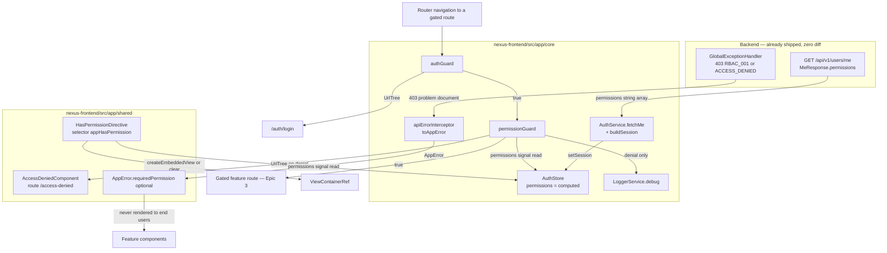
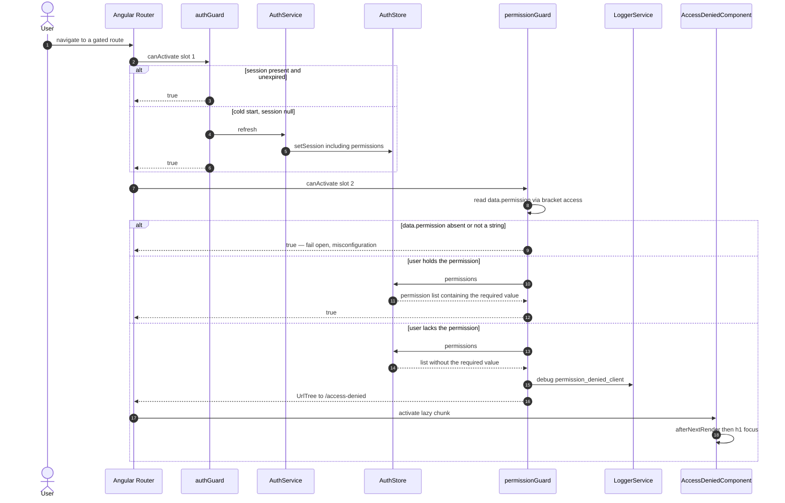
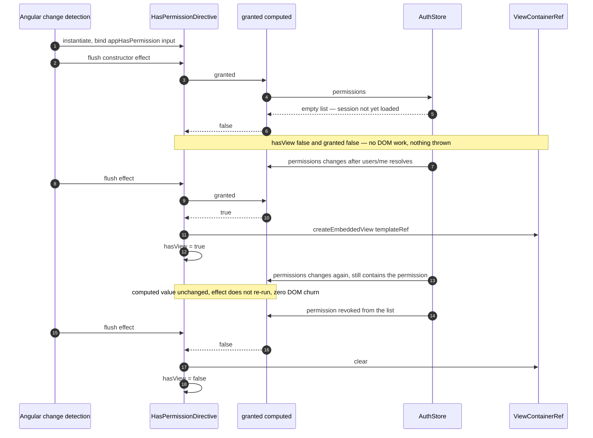
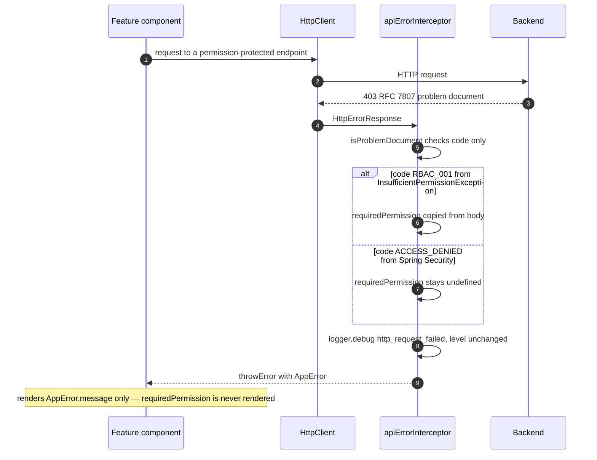

# Solution Design — US-013: Implement Angular Permission Guard and Directive

**Epic:** EPIC-002 (RBAC Foundation) | **Story points:** 3 | **Phase:** 3 (design)
**Inputs:** `docs/features/US-013/01-requirements.md` (Gate 1 approved, §7 resolved) · `docs/features/US-013/02-impact.md`
**Scope:** frontend only. Zero backend diff, zero DB diff, zero API contract change.

**Files re-read to ground every snippet below (not paraphrased from the impact analysis):**
`nexus-frontend/src/app/core/guards/auth.guard.ts`, `core/guards/auth.guard.spec.ts`, `core/auth/auth.store.ts`, `core/auth/auth.store.spec.ts`, `core/http/api-error.interceptor.ts`, `core/http/auth.interceptor.spec.ts`, `core/logging/logger.service.ts`, `features/auth/auth.service.ts`, `features/auth/auth.service.spec.ts`, `features/dashboard/dashboard.component.ts`, `shared/types/auth.ts`, `shared/types/app-error.ts`, `shared/ui/error-state/error-state.ts`, `shared/ui/error-state/error-state.spec.ts`, `shared/ui/button/button.ts`, `shared/ui/empty-state/empty-state.ts`, `shared/ui/index.ts`, `app.routes.ts`, `features/design-system/design-system-preview.component.html`, `tsconfig.json`, `tsconfig.app.json`, `tsconfig.spec.json`, `eslint.config.js`, `package.json`, `src/environments/environment.ts`, `e2e/auth/registration.spec.ts`, `docs/ARCHITECTURE.md`, `docs/DEVELOPMENT_GUIDE.md`.

---

## 0. Decision register — closing all 10 open items from `02-impact.md` §9

Every item below is a **decision**, not a recommendation. The engineer implements these as written; deviation needs a design-doc amendment.

| # | Open item | **Decision** | Rationale (short) |
|---|---|---|---|
| 1 | Guard export naming | **`permissionGuard`** (camelCase const) in `core/guards/permission.guard.ts`. The name `PermissionGuard` appears nowhere in code. | Matches the repo's only functional-guard precedent, `authGuard` (`auth.guard.ts:20`). `CanActivateFn` is a function, not a class; PascalCase would imply an injectable class guard that does not exist. §11 (AC-6 guide draft) uses `permissionGuard` exclusively. |
| 2 | Directive render mechanism | **`effect()` in the constructor, reading a `granted` `computed()`, driving `ViewContainerRef.createEmbeddedView(template)` / `.clear()`, guarded by a plain (non-signal) `hasView` boolean.** Input: `readonly appHasPermission = input.required<string>();`. Full code in §4.5. | `effect()` (not the constructor body) because reading `input.required()` before the first change-detection pass throws. `computed()` gives value-equality short-circuiting so the effect does not re-run when `permissions` changes identity but the boolean answer is unchanged. `hasView` is a plain field because writing a signal from inside an effect is a reactivity smell and this is pure imperative view bookkeeping. |
| 3 | File naming in new `shared/` folders | **`shared/directives/has-permission.directive.ts`** (type-suffix, `core/`-style) and **`shared/pages/access-denied/access-denied.component.ts`** (`.component.ts`, `features/`-style). Companion `.spec.ts` and one `access-denied.component.scss`. **No `shared/directives/index.ts` barrel.** | `shared/ui/`'s suffix-less style (`button.ts`) is a deliberate *component-library* convention documented by `shared/ui/index.ts`; these two artifacts are not part of that library. A non-visual injectable-ish primitive reads best with `.directive.ts`; a routed page reads best with `.component.ts` (matches `dashboard.component.ts`). Barrel skipped: one export does not justify a second barrel convention — revisit at 3+ directives. |
| 4 | `<h1>` ownership on Access Denied | **Option (a): the page owns the `<h1>`.** Specifically: `<main>` wrapper owned by the page, containing a **visually-hidden `<h1 tabindex="-1">Access denied</h1>`**, followed by `<nx-error-state title="Access denied" …>` which supplies the *visible* headline. `NxErrorState` is **not modified**. | Gives a real, programmatic H1 for AC-5 heading hierarchy without visually duplicating `NxErrorState`'s `<p class="nx-error-state__title">` (`error-state.ts:123`). Visible text and the H1 text are identical, so there is no WCAG 2.5.3 accessible-name/visible-label mismatch. Option (b) rejected per impact analysis: `headingLevel` ripples to `error-state.spec.ts`, `design-system-preview.component.html:407–427`, `shared/ui/index.ts` JSDoc, and touches ADR-0004 governance for a 3-point story. |
| 5 | Focus management on `/access-denied` entry | **`tabindex="-1"` on the `<h1>` + programmatic `.focus()` via `afterNextRender()` + `viewChild.required<ElementRef<HTMLHeadingElement>>('heading')`.** Not `AfterViewInit`. | `afterNextRender` is Angular's sanctioned hook for DOM reads/writes in a standalone/signals component and needs no interface implementation; `viewChild` is the signal-era query. The repo has **zero** prior art for either (grep for `effect(`/`viewChild`/`AfterViewInit` in `src/app` returns only JSDoc in `theme.service.ts`), so this is a new convention — recorded in §11. Caveat documented in §6.4: focusing a visually-hidden element yields no visible focus ring; the H1 is the first node in `<main>` so the next `Tab` lands on "Return to dashboard", which is the intended order. `NxErrorState`'s `role="alert"` provides an independent announcement path if focus handling is ever blocked. |
| 6 | Guard composition rule | **`permissionGuard` MUST NEVER be used alone.** Contract: `canActivate: [authGuard, permissionGuard]` in that order, **or** `permissionGuard` on a route whose ancestor already carries `authGuard`. Enforced by documentation + code review only. | Angular processes a `canActivate` array sequentially (`concatMap`) and short-circuits on the first non-`true` result, so `authGuard`'s silent `refresh()` (`auth.guard.ts:27–30` → `auth.service.ts:171–182` → `setSession`) completes and populates `AuthStore` **before** `permissionGuard` reads it. Used alone on a cold start (page reload, `_session === null`), `permissionGuard` sees `NO_PERMISSIONS` and misroutes an entitled user to `/access-denied` instead of `/auth/login`. This is the actionable half of requirements R-4. Verified by the router-integration test in §12. |
| 7 | `ARCHITECTURE.md` #9 clarification | **Edit `docs/ARCHITECTURE.md:120` to read:**<br>`9. No `any` in TypeScript; modern built-in control flow (`@if`/`@for`), not `*ngIf`/`*ngFor` — custom structural directives (e.g. `*appHasPermission`) remain permitted for cross-cutting concerns. *(ESLint-enforced)*`<br>**No new ADR** (see §14). Optional companion edit to the frontend tree at `:71–78` given in §13.2. | Word-level change: inserts "built-in" and one trailing clause. `*appHasPermission` is not `*ngIf`/`*ngFor`, is not matched by any rule in `eslint.config.js`, and remains fully supported in Angular 22 — but a reviewer reading #9 literally would block AC-3's mandated selector. Two-sentence cost, removes the contradiction. |
| 8 | Shared auth test fixtures | **Introduce `nexus-frontend/src/app/shared/testing/auth.fixtures.ts` now**, exporting `createAuthUser()`, `createAuthSession()`, `createAuthStoreStub()`. **Hard constraint: the file must not import from `vitest`.** Migrate `auth.store.spec.ts` and `auth.interceptor.spec.ts` to it; leave `auth.service.spec.ts`'s `ME_RESPONSE`/`EXPECTED_SESSION` pair as explicit paired literals. | The `AuthSession` literal is copy-pasted in 3 spec files (`02-impact.md` §4.2); this is its third mutation and the fan-out only grows. **New constraint the impact analysis missed:** `tsconfig.app.json:9–10` includes `src/**/*.ts` and excludes only `src/**/*.spec.ts`, with `"types": []` — a non-spec fixture file **is type-checked by the app build**, so a `vitest` import would break `npm run build`. `createAuthStoreStub` therefore returns real Angular `signal()`s rather than `vi.fn()`s — which is strictly better anyway, because it is what makes the directive's reactive-update test (§12.3) possible. Nothing in the app import graph references the file, so prod bundle delta is zero. |
| 9 | Guard-denial logging | **Adopt, exactly one call site: `permissionGuard`'s denial branch only.** Shape (§8.1): `logger.debug('Permission check denied navigation', { event: 'permission_denied_client', outcome: 'FAILURE', context: { permission: required, route: state.url } })`. **No logging in the directive.** No new metric, trace, or dashboard. | Mirrors `api-error.interceptor.ts:24–36`'s `event`/`outcome`/`context` field convention. `debug` because `environment.ts:55` sets prod `logLevel: 'warn'`, making this a dev/diagnostic-only signal (`logger.service.ts:135–137`) — zero prod noise, zero PII. Must go through `LoggerService`: `no-console` is an ESLint **error** outside `logger.service.ts`/`main.ts` (`eslint.config.js:38–43`), which is also what makes AC-4's "no console error" mechanically true. Directive excluded: it re-evaluates per change-detection pass across N instances — pure noise. The authoritative denial signal remains the backend's `nexus.rbac.permission_denied` counter. |
| 10 | `e2e/access-denied.spec.ts` axe scan | **In scope.** Mirrors `e2e/auth/registration.spec.ts:62–73` exactly (`AxeBuilder … withTags(['wcag2a','wcag2aa'])`, filter `impact === 'critical'`). Code in §12.5. | `/access-denied` is unguarded and makes no HTTP call, so the test needs no backend and no login — it is the only AC-5 evidence that runs unconditionally in CI, at ~1 test's cost. |

### 0.1 Corrections carried in from Gate 1 (do not re-litigate)

- The 403 field is **`requiredPermission`** (camelCase), verified at `GlobalExceptionHandler.java:150,161`. The story draft's `required_permission` is wrong.
- Stack is **Angular 22.0.4 / TypeScript ~6.0.3** (`package.json:31–58`), not "Angular 21 / TS 5.9".
- `tsconfig.json` declares **no `paths` aliases** — every import below is relative. `shared/ui/index.ts`'s `@shared/ui` JSDoc is aspirational.

### 0.2 Two additional constraints discovered while designing (not in `02-impact.md`)

1. **`NxButton` cannot be an anchor.** Its selector is the *element* `nx-button` (`button.ts:67`) and it renders an internal `<button>` (`:74`). The `<a nx-button …>` form shown in `error-state.ts:51,65` and `empty-state.ts:52` JSDoc **does not work** with the shipped component (attribute selector `[nx-button]` does not exist). The real usage is `<nx-button>…</nx-button>` (`dashboard.component.ts:42–50`, `design-system-preview.component.html:430`). ⇒ The Access Denied CTAs are **plain semantic `<a>` elements**, styled locally. This is also the a11y-correct choice: both CTAs are navigations, not actions, so `<a>` (Enter-activated, right-clickable, focusable) beats a `<button>` + `router.navigate()`.
2. **The `?? []` in `buildSession` is deliberate, not dead code.** `tsconfig.app.json:11–17` suppresses the `nullishCoalescingNotNullable` extended diagnostic, so the compiler will not flag it — but a reviewer might. An inline comment is mandatory (§4.3).

---

## 1. Architecture

### 1.1 Component diagram



**Reading the diagram:** the entire story is two consumers (`permissionGuard`, `HasPermissionDirective`) of one new read-only projection (`AuthStore.permissions`) fed by one already-shipped response field, plus one page and one optional-field pass-through in the interceptor. There is no new I/O, no new state owner, no new provider.

### 1.2 Layering rules (frontend analogue of the backend's hexagonal non-negotiables)

`docs/ARCHITECTURE.md:69–78` defines `core / shared / features`. This story introduces the first `shared → core` import, so the rule is stated explicitly:

| Rule | Status after US-013 |
|---|---|
| `features/` may import `core/` and `shared/` | unchanged (`dashboard.component.ts:5–7`) |
| **`shared/` may import `core/`** (state and cross-cutting services) | **new, allowed.** `HasPermissionDirective` injects `AuthStore`; `AccessDeniedComponent` imports `shared/ui`. Justification: a permission directive is inherently coupled to session state — pushing it to `core/directives/` would instead couple `core/` (app infrastructure) to feature-template concerns, which is worse. `ARCHITECTURE.md`'s "`shared/` = stateless reusables" is narrowed by §13.2's tree edit. |
| `core/` and `shared/` must **never** import `features/` | **Pre-existing violation, not extended.** `auth.guard.ts:5` imports `../../features/auth/auth.service`. `permissionGuard` deliberately needs **no** `AuthService` (its check is a synchronous signal read), so it imports only `core/auth/auth.store` and `core/logging/logger.service` — the new guard is clean. Recorded as pre-existing tech debt; out of scope to fix. |

### 1.3 Sequence — route navigation into a gated route (AC-1, AC-2)



### 1.4 Sequence — directive render and reactive update (AC-3, AC-4)



### 1.5 Sequence — 403 problem document to `AppError` (FR-10)



---

## 2. Database design

**None.** Explicitly and completely absent:

- No Flyway migration. `nexus-backend/src/main/resources/db/migration` is untouched; the append-only `V<N>__*.sql` rule (ADR 0003) is not engaged.
- No JPA entity, repository, column, index, constraint, or generated-column change. `ddl-auto=validate` cannot fail because of this story.
- No non-additive change ⇒ **no expand/contract plan**. No data migration ⇒ **N/A**.
- `MeResponse.permissions` is already derived server-side from the RBAC tables shipped under US-010/US-011 (ADR 0013). US-013 reads an already-populated response field.

---

## 3. API contracts — consumed only

**Zero new endpoints, zero changed endpoints, zero versioning event.** This story is a pure consumer. Both contracts are already live; they are documented here as *consumed* contracts so the frontend types can be reviewed against them.

### 3.1 Consumed: `GET /api/v1/users/me`

Source of truth: `nexus-backend/.../identity/interfaces/rest/dto/MeResponse.java:5–17`. Called at `auth.service.ts:191–195` with an explicit `Authorization: <tokenType> <token>` header.

```yaml
# CONSUMED CONTRACT — not defined by this story
get:
  summary: Current user identity and authorization context
  security: [bearerAuth: []]
  responses:
    '200':
      content:
        application/json:
          schema:
            type: object
            required: [userId, emailVerified, tenantId, roles, permissions, tokenVersion]
            properties:
              userId:        { type: string, format: uuid }
              emailVerified: { type: boolean }
              tenantId:      { type: string, format: uuid }
              roles:         { type: array, items: { type: string } }   # List.copyOf — never null
              permissions:   { type: array, items: { type: string } }   # List.copyOf — never null; "resource:action", lowercase
              tokenVersion:  { type: integer }
    '401': { $ref: '#/components/responses/ProblemDocument' }
```

Client-side matching of `permissions` entries is **exact, case-sensitive string equality** — consistent with EPIC-002 §BA's lowercase `resource:action` convention. No wildcard, prefix, or hierarchy semantics are implemented, and none are implied.

### 3.2 Consumed: 403 problem document

RFC 7807 body via `GlobalExceptionHandler`'s `problem()` helper (`:229–234`, always sets `code` + `traceId`).

| Trigger | `code` | `detail` | `requiredPermission` |
|---|---|---|---|
| `InsufficientPermissionException` (`@RequiresPermission`), `:146–163` | `RBAC_001` | `"You do not have permission to perform this action"` | **present** (camelCase) |
| Spring Security `AccessDeniedException`, `:165–170` | `ACCESS_DENIED` | `"You do not have access to this resource."` | **absent** |

```yaml
# CONSUMED CONTRACT
components:
  responses:
    Forbidden:
      description: Authenticated but not authorized
      content:
        application/problem+json:
          schema:
            type: object
            required: [code, traceId]
            properties:
              code:               { type: string, enum: [RBAC_001, ACCESS_DENIED] }
              detail:             { type: string }
              traceId:            { type: string }
              requiredPermission: { type: string }   # RBAC_001 ONLY — never assume presence
```

`reason`, `userId`, `tenantId` for RBAC denials are attached to the **log record only** (`extraFields`, `:148–153`) and are **not** in the response body. `ProblemDocument` must not model them.

### 3.3 Breaking-change assessment (APIs)

None. Additive-only consumption; the backend is unchanged. Older frontend bundles already ignore the `permissions` key.

---

## 4. Component design — exact code-level design per file

Layer, responsibility, and the real TypeScript. These are complete enough to be transcribed; `/breakdown` should turn each subsection into one task.

### 4.1 `shared/types/auth.ts` — MODIFY (insert after `:37`, inside `AuthUser`)

Responsibility: wire-shape type only, no behaviour.

```typescript
  /**
   * RBAC permissions granted to the user, in `resource:action` form
   * (e.g. "users:read", "roles:assign"). Lowercase and colon-separated by backend
   * convention; matched client-side by exact, case-sensitive string equality.
   *
   * Populated from `GET /v1/users/me`, never decoded from the JWT client-side.
   * Always present: an empty array means "no permissions", never `undefined`.
   *
   * @security UX only. Client-side checks against this list (`permissionGuard`,
   * `*appHasPermission`) are cosmetic. The server's `@RequiresPermission` is the only
   * enforcement boundary — never gate data access or trust decisions on this value.
   */
  readonly permissions: readonly string[];
```

Notes:
- **Required, not optional** — resolved decision 3 ("mirrors `roles`"). Cost of the break is 4 one-line fixture insertions (§4.10); the benefit is that "no permissions" is not permanently representable as `undefined` for every downstream consumer.
- The doc comment deliberately does **not** repeat the pre-existing `roles` defect (`:33` says "Comma-delimited" for a `readonly string[]`) — requirements §8.
- **Also fix while in the file (one line, zero risk):** `:4` "Extracted from the JWT access token" → "Populated from `GET /v1/users/me` after login or refresh". It is factually wrong today (`auth.service.ts:191–195`) and this story's new field would inherit the inaccuracy.

### 4.2 `core/auth/auth.store.ts` — MODIFY

Responsibility: the single read-only reactive projection of session permissions. **Owner of the "no session ⇒ no permissions" normalisation.**

Module scope, next to the existing imports:

```typescript
/**
 * Stable, frozen empty permission list returned when no session exists.
 *
 * A module-level frozen constant (rather than an inline `?? []`) keeps the computed's
 * reference identity stable across recomputations, so downstream `computed`/`effect`
 * consumers — notably HasPermissionDirective — never see spurious identity churn.
 */
const NO_PERMISSIONS: readonly string[] = Object.freeze([]);
```

Inside the class, immediately after `accessToken` (`:38`):

```typescript
  /**
   * Computed signal containing the current user's RBAC permissions.
   *
   * Returns a stable empty array when there is no session, so consumers never need a
   * null check and `.includes()` can never throw (US-013 AC-4).
   *
   * @security UX only — see {@link AuthUser.permissions}. Never an authorization decision.
   */
  readonly permissions = computed<readonly string[]>(
    () => this._session()?.user.permissions ?? NO_PERMISSIONS,
  );
```

- **Deliberate non-change:** no symmetric `roles` computed. `AuthUser.roles` exists but no store accessor does and no AC needs one. Named here so it is not smuggled in at review.
- `Object.freeze([])` types as `readonly never[]`, assignable to `readonly string[]`, and prevents an accidental mutation of the shared instance.

### 4.3 `features/auth/auth.service.ts` — MODIFY

Responsibility: wire → domain mapping. **Owner of the defensive default** (one place, not two).

`MeApiResponse` (`:21–27`) gains one field:

```typescript
interface MeApiResponse {
  userId: string;
  emailVerified: boolean;
  tenantId: string;
  roles: string[];
  permissions: string[];
  tokenVersion: number;
}
```

`buildSession()` (`:206–220`) — the `user` literal gains one line:

```typescript
      user: {
        userId: me.userId,
        tenantId: me.tenantId,
        emailVerified: me.emailVerified,
        roles: me.roles,
        // Intentional wire-defensive default, not dead code: a newly deployed frontend
        // bundle served against an older backend omits `permissions`, and US-013 AC-4
        // forbids throwing on absent permissions. Do not "simplify" this away.
        // (tsconfig.app.json suppresses `nullishCoalescingNotNullable`, so the compiler
        // will not flag it either.)
        permissions: me.permissions ?? [],
        tokenVersion: me.tokenVersion,
      },
```

**Alternative considered and rejected:** typing the local interface as `permissions?: string[]` to make the `??` type-required. Rejected for consistency — `roles: string[]` in the same interface carries the identical wire risk and is non-optional; the inline comment carries the intent at lower cost than an asymmetry.

### 4.4 `core/guards/permission.guard.ts` — NEW

Responsibility: one navigation decision. No HTTP, no RxJS, no state mutation.

```typescript
import { inject } from '@angular/core';
import { CanActivateFn, Router } from '@angular/router';
import { AuthStore } from '../auth/auth.store';
import { LoggerService } from '../logging/logger.service';

/**
 * Route guard that requires the current user to hold a specific RBAC permission.
 *
 * Reads the required permission from the activated route's `data.permission` and
 * compares it against {@link AuthStore.permissions} — a synchronous signal read, so the
 * guard never performs I/O and never returns an Observable.
 *
 * ## Usage contract (mandatory)
 * `permissionGuard` MUST be composed **after** `authGuard`, or sit under a route whose
 * ancestor already carries `authGuard`:
 *
 * ```typescript
 * { path: 'roles', canActivate: [authGuard, permissionGuard], data: { permission: 'roles:read' }, ... }
 * ```
 *
 * Angular evaluates a `canActivate` array sequentially and short-circuits on the first
 * non-`true` result, so `authGuard` completes its silent refresh (populating the session)
 * before this guard reads the store. Used **alone**, on a cold start (page reload, session
 * `null`) this guard would see an empty permission list and misroute an entitled but
 * not-yet-restored user to `/access-denied` instead of `/auth/login`.
 *
 * ## Fail-open
 * A route that reaches this guard without a string `data.permission` is a
 * *misconfiguration*, not a denial, and is allowed through. That is safe because this
 * guard is not a security boundary (below) — but it is silent, so every route that uses
 * this guard must be covered by a test asserting its `data.permission` value.
 *
 * @security **UX only — not a security boundary.** Server-side `@RequiresPermission`
 * (US-011) is the sole enforcement point. A user who edits client state or calls the API
 * directly still receives 403. Never use this guard as the only protection for anything.
 *
 * @returns `true` to allow navigation, or a `UrlTree` redirecting to `/access-denied`.
 */
export const permissionGuard: CanActivateFn = (route, state) => {
  const authStore = inject(AuthStore);
  const router = inject(Router);
  const logger = inject(LoggerService);

  // Bracket access is mandatory: `noPropertyAccessFromIndexSignature` is on
  // (tsconfig.json:8) and Router `Data` is an index-signature type. Annotating as
  // `unknown` (mirroring api-error.interceptor.ts:65) keeps `any` out of the file,
  // which `@typescript-eslint/no-explicit-any: "error"` requires.
  const required: unknown = route.data['permission'];

  if (typeof required !== 'string' || required.length === 0) return true;

  if (authStore.permissions().includes(required)) return true;

  logger.debug('Permission check denied navigation', {
    event: 'permission_denied_client',
    outcome: 'FAILURE',
    context: { permission: required, route: state.url },
  });

  // Deliberately no query params: reflecting the attempted URL or the required
  // permission into the address bar would put RBAC internals into browser history,
  // bookmarks, and the Referer header. The page needs no context to render.
  return router.createUrlTree(['/access-denied']);
};
```

Design notes:
- **Route `data` inheritance caveat** (goes into §11): Angular's default `paramsInheritanceStrategy` merges a parent route's `data` into child snapshots. A `data.permission` on a parent is therefore visible to `permissionGuard` on any descendant. Declare `data.permission` on the exact route being gated.
- `required.length === 0` is included in the fail-open condition: an empty-string permission is as much a misconfiguration as a missing one, and `[].includes('')` would otherwise deny every user with no diagnostic.
- Return type is `true | UrlTree` — strictly synchronous, unlike `authGuard`. No `rxjs` import.

### 4.5 `shared/directives/has-permission.directive.ts` — NEW *(highest-risk item — this is the complete design)*

Responsibility: conditionally instantiate its host template based on a permission, reactively, with no DOM churn when the answer has not changed.

```typescript
import {
  Directive,
  TemplateRef,
  ViewContainerRef,
  computed,
  effect,
  inject,
  input,
} from '@angular/core';
import { AuthStore } from '../../core/auth/auth.store';

/**
 * Structural directive that renders its host element only when the current user holds a
 * given RBAC permission.
 *
 * ```html
 * <button *appHasPermission="'users:delete'" (click)="delete()">Delete user</button>
 * ```
 *
 * Reactive: the element appears or disappears automatically when
 * {@link AuthStore.permissions} changes (e.g. after login, token refresh, or a
 * `/users/me` re-fetch). No subscription and no manual change detection are involved.
 *
 * Each consuming standalone component adds `HasPermissionDirective` to its own
 * `imports: [...]` array — there is no global shared-imports barrel in this codebase,
 * and it is intentionally **not** exported from `shared/ui/index.ts` (that barrel is the
 * documented UI component library).
 *
 * Degrades gracefully: when the permission list is empty — including the pre-session
 * cold-start state — the element is simply absent. Nothing is thrown and nothing is
 * logged (US-013 AC-4).
 *
 * @security **UX only — not a security boundary.** Hiding a control does not protect the
 * operation behind it. Every action this directive hides must also be enforced
 * server-side with `@RequiresPermission` (US-011). Never use this directive to hide data
 * that the user is not permitted to see: by the time it renders, that data has already
 * been delivered to the browser.
 */
@Directive({
  selector: '[appHasPermission]',
  standalone: true,
})
export class HasPermissionDirective {
  private readonly authStore = inject(AuthStore);
  private readonly viewContainer = inject(ViewContainerRef);
  // Explicit generic keeps `TemplateRef<any>` inference out of the file. If the compiler
  // rejects the parameterised token, fall back to `inject(TemplateRef)` — the value is
  // only ever handed straight to `createEmbeddedView`.
  private readonly template = inject<TemplateRef<unknown>>(TemplateRef);

  /**
   * The required permission, in `resource:action` form.
   *
   * The input name must equal the selector for structural-directive microsyntax
   * (`*appHasPermission="…"`) to bind — this is not stylistic, `strictTemplates`
   * (tsconfig.json:22) derives the input name from the selector.
   */
  readonly appHasPermission = input.required<string>();

  /**
   * Whether the user currently holds the required permission.
   *
   * A `computed` (rather than reading the store inside the effect) so Angular's
   * value-equality short-circuit suppresses the effect entirely when `permissions`
   * changes identity but the boolean answer does not — e.g. a token refresh that returns
   * the same permission set. This is the primary defence against redundant DOM work.
   */
  private readonly granted = computed(() =>
    this.authStore.permissions().includes(this.appHasPermission()),
  );

  /**
   * Tracks whether the embedded view is currently instantiated.
   *
   * Deliberately a plain field, not a signal: it is imperative view bookkeeping, not
   * application state, and writing a signal from inside an effect would make the effect
   * a producer as well as a consumer. It guards against redundant
   * `createEmbeddedView`/`clear()` calls independently of the `computed` above.
   */
  private hasView = false;

  constructor() {
    // The effect (rather than the constructor body) is what makes `input.required()`
    // safe to read: effects first run after the initial change-detection pass has set
    // inputs, whereas reading a required input in the constructor throws.
    effect(() => {
      const granted = this.granted();

      if (granted && !this.hasView) {
        this.viewContainer.createEmbeddedView(this.template);
        this.hasView = true;
      } else if (!granted && this.hasView) {
        // `clear()` (not a retained ViewRef + `destroy()`) is correct because this
        // container holds exactly one view — ours.
        this.viewContainer.clear();
        this.hasView = false;
      }
    });
  }
}
```

Grounding and rejected alternatives:
- **`standalone: true` is explicit** to match `error-state.ts:118`, `button.ts:68`, `dashboard.component.ts:36`, even though it is the Angular 22 default.
- **Selector passes lint unchanged.** `eslint.config.js:18–25` sets `@angular-eslint/directive-selector` to `type: "attribute"`, `prefix: ["nx", "app"]`, `style: "camelCase"` — `[appHasPermission]` is already legal. No ESLint change is needed, which is worth recording because it looks like it would need one.
- **First `app`-prefixed selector in the codebase** (everything shared today is `nx-`: `nx-error-state`, `nx-button`, …). Accepted: AC-3 mandates `*appHasPermission` verbatim, `app` is already a configured prefix, and the `nx` prefix reads as "design-system component" — which this is not. Noted so the next reviewer does not file it as an inconsistency.
- **Rejected: `ngOnChanges` / decorator `@Input()`** — would abandon the signal-input convention (`error-state.ts:157–190`, `empty-state.ts:122`) and would not react to store changes at all.
- **Rejected: `@if (can('x'))` with a helper signal instead of a directive.** AC-3 mandates the selector; and a directive keeps the permission string out of every consuming component's class. Recorded here rather than in an ADR (§14).
- **Rejected: an `else` template variant** (`*appHasPermission="p; else tpl"`) — resolved decision 2 defers it. Additive later, non-breaking.
- **Multiple instances per view** are safe: each gets its own `ViewContainerRef`, its own `computed`, and its own effect; the `computed` short-circuit bounds the work to one `Array.prototype.includes` over ≤ ~20 entries per changed permission set.

### 4.6 `shared/pages/access-denied/access-denied.component.ts` — NEW

Responsibility: a routed, self-contained, WCAG 2.1 AA page. No injected state, no HTTP, no permission logic — it renders identically regardless of who arrives (requirements Assumption 3: directly viewable, unguarded).

```typescript
import {
  afterNextRender,
  ChangeDetectionStrategy,
  Component,
  ElementRef,
  viewChild,
} from '@angular/core';
import { RouterLink } from '@angular/router';
import { NxErrorState } from '../../ui';

/**
 * Access Denied page (US-013 AC-2, AC-5).
 *
 * The destination of `permissionGuard`'s denial redirect, registered at `/access-denied`
 * and intentionally **unguarded** — it makes no HTTP call, reveals nothing, and must
 * render even for an unauthenticated visitor who types the URL.
 *
 * ## Accessibility (AC-5)
 * - The page owns the `<main>` landmark and the `<h1>` — the app shell provides neither
 *   (`app.html` renders only `<header>` and `<router-outlet />`), and `NxErrorState`
 *   renders its `title` as a `<p>`, not a heading.
 * - The `<h1>` is **visually hidden**: it supplies the programmatic heading hierarchy
 *   while `<nx-error-state title="Access denied">` supplies the visible headline, so the
 *   same text is not shown twice. Both strings are identical, so the accessible name and
 *   the visible label agree.
 * - The `<h1>` carries `tabindex="-1"` and receives focus on route entry, so a screen
 *   reader announces the page on SPA navigation and the next `Tab` lands on
 *   "Return to dashboard".
 * - Both calls to action are real `<a>` elements with descriptive text (never
 *   "click here"), keyboard-operable by default.
 *
 * @security Renders static copy only. It must never display `AppError.requiredPermission`
 * or any other RBAC detail (EPIC-002 §UX).
 */
@Component({
  selector: 'nx-access-denied',
  standalone: true,
  imports: [NxErrorState, RouterLink],
  changeDetection: ChangeDetectionStrategy.OnPush,
  template: `
    <main class="access-denied" data-testid="access-denied-root">
      <h1 #heading class="access-denied__heading" tabindex="-1" data-testid="access-denied-heading">
        Access denied
      </h1>

      <nx-error-state
        title="Access denied"
        message="You don't have permission to view this resource. If you believe this is a mistake, contact your administrator."
        [showRetry]="false"
      >
        <div class="access-denied__actions">
          <a
            class="access-denied__action"
            routerLink="/dashboard"
            data-testid="access-denied-dashboard-link"
          >
            Return to dashboard
          </a>
          <!-- TODO(PM): replace this RFC 2606 reserved placeholder domain with the real
               support address before release (resolved decision 1). -->
          <a
            class="access-denied__action"
            href="mailto:support@yourcompany.example"
            data-testid="access-denied-contact-link"
          >
            Contact your administrator
          </a>
        </div>
      </nx-error-state>
    </main>
  `,
  styleUrl: './access-denied.component.scss',
})
export class AccessDeniedComponent {
  private readonly heading = viewChild.required<ElementRef<HTMLHeadingElement>>('heading');

  constructor() {
    // afterNextRender (not ngAfterViewInit) is Angular's sanctioned hook for DOM writes
    // in a signals/standalone component and needs no lifecycle interface. It runs
    // browser-only, which is also correct for a focus call.
    afterNextRender(() => this.heading().nativeElement.focus());
  }
}
```

### 4.7 `shared/pages/access-denied/access-denied.component.scss` — NEW

Kept well inside `angular.json:49–50`'s 4 kB `anyComponentStyle` warning budget. No new global style entry.

```scss
.access-denied {
  display: block;
  padding: var(--nx-space-12) var(--nx-space-6);
}

/* Programmatic-only heading: satisfies AC-5's heading hierarchy and provides the
   route-entry focus target, without visually duplicating <nx-error-state>'s own title
   paragraph. No repository-wide visually-hidden utility exists yet — grep confirms zero
   occurrences of `visually-hidden` / `sr-only` in src/ — so the rule is local. */
.access-denied__heading {
  position: absolute;
  width: 1px;
  height: 1px;
  margin: -1px;
  padding: 0;
  overflow: hidden;
  clip-path: inset(50%);
  white-space: nowrap;
  border: 0;
}

.access-denied__actions {
  display: flex;
  flex-wrap: wrap;
  gap: var(--nx-space-6);
  justify-content: center;
}

.access-denied__action:focus-visible {
  outline: 2px solid var(--nx-color-primary);
  outline-offset: 2px;
}
```

Contrast (AC-5, ≥ 4.5:1) is inherited from the global anchor colour token; the axe scan in §12.5 verifies it rather than this document asserting it.

### 4.8 `app.routes.ts` — MODIFY (mandatory)

Insert after the `/dashboard` entry (`:120–125`), before the closing bracket. **Not optional**: there is no wildcard `path: '**'` route (`:127–140` is only a comment recommending one), so `router.createUrlTree(['/access-denied'])` against an unregistered path is a router failure, not a graceful fallback. Adding the wildcard route remains **out of scope** — it changes behaviour for every unmatched URL.

```typescript
  /**
   * Access Denied page.
   *
   * Path: /access-denied
   * Access: Public — intentionally unguarded
   * Component: AccessDeniedComponent
   *
   * Purpose:
   * - Destination of {@link permissionGuard}'s denial redirect (US-013 AC-2), so an
   *   authenticated user who lacks a permission is not bounced to the login page.
   *
   * Implementation:
   * - Lazy-loaded, following the /design-system precedent (top-level path, no guard).
   * - Unguarded on purpose: the page makes no HTTP call and reveals nothing, so it must
   *   render for a direct visit or a cold-start redirect.
   *
   * @see {@link permissionGuard}
   */
  {
    path: 'access-denied',
    loadComponent: () =>
      import('./shared/pages/access-denied/access-denied.component').then(
        (m) => m.AccessDeniedComponent,
      ),
  },
```

No existing route gains `data: { permission: … }` in this story (infrastructure-only decision). `data` route metadata therefore remains an unused-but-supported pattern in this file until Epic 3.

### 4.9 `shared/types/app-error.ts` + `core/http/api-error.interceptor.ts` — MODIFY (FR-10)

`app-error.ts`, inserted after `details` (`:64`):

```typescript
  /**
   * The RBAC permission the backend required but the caller did not hold.
   *
   * Present **only** on a 403 whose `code` is `RBAC_001` (from the backend's
   * `@RequiresPermission` check). A 403 with `code: 'ACCESS_DENIED'` (Spring Security)
   * carries no such field. Never key logic on "status was 403 ⇒ this field is present".
   *
   * @security Developer-facing diagnostic only. EPIC-002 §UX forbids surfacing this to
   * end users — do not render it, do not put it in a URL, do not send it to analytics.
   * Render {@link message} instead.
   */
  readonly requiredPermission?: string;
```

`api-error.interceptor.ts` — two edits, nothing else. **Log levels are unchanged**: the shared `debug` branch (`:50–53`) already covers 403, and changing it would add diff surface plus a corresponding assertion change in `api-error.interceptor.spec.ts` for no requirement.

`ProblemDocument` (`:93–98`):

```typescript
interface ProblemDocument {
  readonly code: string;
  readonly detail?: string;
  readonly traceId?: string;
  readonly details?: AppError['details'];
  /** Set only by the backend's RBAC_001 403 branch; absent on ACCESS_DENIED. */
  readonly requiredPermission?: string;
}
```

`toAppError` (`:67–73`):

```typescript
      return {
        code: body.code,
        message: body.detail ?? 'Request failed.',
        traceId: body.traceId,
        correlationId,
        details: body.details,
        requiredPermission: body.requiredPermission,
      };
```

- **No branching on `code`.** `ACCESS_DENIED` simply has no such key, so the value is `undefined`. Branching would add a second thing to keep in sync with the backend for zero benefit.
- The literal is built unconditionally, so the key is now set to `undefined` on *every* problem-document error. That is safe: `exactOptionalPropertyTypes` is not enabled (`tsconfig.json:5–17`), and `toEqual` treats an `undefined`-valued key as equal to an absent key, so no existing assertion in `api-error.interceptor.spec.ts` breaks.
- **Type-safety honesty:** `isProblemDocument` (`:103–107`) validates only `code`. `requiredPermission` is therefore *asserted*, not validated — a malformed body could put a non-string there. Acceptable because the value is never rendered and never drives logic. Flagged for `03b-threat-model.md` (§15).

### 4.10 `shared/testing/auth.fixtures.ts` — NEW (decision 8)

Responsibility: the single definition of the `AuthUser`/`AuthSession` test shape and the `AuthStore` read-side stub.

**Hard constraint — must not import from `vitest`.** `tsconfig.app.json:9–10` includes `src/**/*.ts` and excludes only `src/**/*.spec.ts`, with `"types": []`, so this non-spec file is type-checked by the production build; a `vitest` import would break `npm run build`. Angular imports are fine. Nothing in the app import graph references the module, so the prod bundle delta is zero.

```typescript
import { computed, signal, Signal, WritableSignal } from '@angular/core';
import { AuthSession, AuthUser } from '../types/auth';

/**
 * Builds an {@link AuthUser} with sensible defaults and per-test overrides.
 *
 * Single source of truth for the user test shape: adding a field to `AuthUser` should be
 * a one-line change here, not a fan-out across every spec.
 */
export function createAuthUser(overrides: Partial<AuthUser> = {}): AuthUser {
  return {
    userId: 'user-123',
    tenantId: 'tenant-456',
    emailVerified: true,
    roles: ['USER'],
    permissions: [],
    tokenVersion: 1,
    ...overrides,
  };
}

/**
 * Builds a valid, unexpired {@link AuthSession}.
 *
 * `user` may be overridden wholesale, or shaped via {@link createAuthUser}.
 */
export function createAuthSession(overrides: Partial<AuthSession> = {}): AuthSession {
  return {
    accessToken: 'test-access-token',
    tokenType: 'Bearer',
    expiresIn: 3600,
    expiresAt: Date.now() + 3600 * 1000,
    user: createAuthUser(),
    ...overrides,
  };
}

/** Read-side stub of AuthStore, backed by real signals so tests can drive reactivity. */
export interface AuthStoreStub {
  readonly session: WritableSignal<AuthSession | null>;
  readonly permissions: WritableSignal<readonly string[]>;
  readonly currentUser: Signal<AuthUser | null>;
  readonly accessToken: Signal<string | null>;
  readonly isAuthenticated: Signal<boolean>;
}

/**
 * Creates a read-side AuthStore stub for `{ provide: AuthStore, useValue: … }`.
 *
 * `permissions` is a real `WritableSignal`, so a test can call `.set([...])` and assert
 * that a consumer (guard, directive) reacts — which is exactly what US-013's
 * reactive-update scenario needs and what a `vi.fn()` mock cannot express.
 *
 * Write-side members (`setSession`, `clearSession`) are intentionally absent: specs that
 * assert on those should spread this stub and add their own spies, keeping this module
 * free of any test-framework import (see the file-level constraint in 03-design.md §4.10).
 */
export function createAuthStoreStub(
  init: { session?: AuthSession | null; permissions?: readonly string[] } = {},
): AuthStoreStub {
  const session = signal<AuthSession | null>(init.session ?? null);
  const permissions = signal<readonly string[]>(init.permissions ?? []);
  return {
    session,
    permissions,
    currentUser: computed(() => session()?.user ?? null),
    accessToken: computed(() => session()?.accessToken ?? null),
    isAuthenticated: computed(() => {
      const s = session();
      return s !== null && Date.now() < s.expiresAt;
    }),
  };
}
```

Migration scope (deliberately bounded):
- `core/auth/auth.store.spec.ts:16–28` → `const TEST_SESSION = createAuthSession({ user: createAuthUser({ userId: 'user-123', tenantId: 'tenant-456', roles: ['USER'], permissions: ['users:read'] }) });`
- `core/http/auth.interceptor.spec.ts:13–25` → `createAuthSession({ accessToken: 'test-token-abc', user: createAuthUser({ userId: 'user-1', tenantId: 'tenant-1' }) })`
- **Not migrated:** `features/auth/auth.service.spec.ts:223–229` (`ME_RESPONSE`) and `:232–244` (`EXPECTED_SESSION … satisfies AuthSession`). These are a *paired wire-mapping assertion*; replacing either half with a factory would hide precisely the input/output correspondence the test exists to prove. Both gain `permissions: ['users:read']` **as literals, with the same value, in the same commit** — §7.3 explains the failure mode if only one is updated.

---

## 5. Frontend design

### 5.1 Component tree and ownership

```
AppComponent (app.html — <header> + <router-outlet />, owns neither <main> nor <h1>)
└── router-outlet
    ├── /dashboard        canActivate: [authGuard]                     DashboardComponent      (owns <main> + <h1>)
    ├── /design-system    (no guard)                                   DesignSystemPreview
    ├── /auth/**          (no guard)                                   AUTH_ROUTES
    ├── /access-denied    (no guard)                    ← NEW          AccessDeniedComponent   (owns <main> + <h1>)
    │                                                                  └── NxErrorState (existing, unmodified)
    │                                                                      └── ng-content: 2 × <a>
    └── (Epic 3) /roles   canActivate: [authGuard, permissionGuard]
                          data: { permission: 'roles:read' }
                                                                       └── any element may carry *appHasPermission
```

### 5.2 Services, state, and reactivity

| Concern | Owner | Shape |
|---|---|---|
| Session (source of truth) | `AuthStore._session` | private `signal<AuthSession \| null>` — in-memory only, never `localStorage`/`sessionStorage` (`auth.store.ts:15`) |
| Permission projection | `AuthStore.permissions` | `computed<readonly string[]>`, never `undefined` |
| Wire → domain mapping | `AuthService.buildSession` | owns the `?? []` default |
| Navigation decision | `permissionGuard` | pure function, `true \| UrlTree` |
| Element visibility | `HasPermissionDirective` | `computed` + `effect` + `ViewContainerRef` |
| Page state | `AccessDeniedComponent` | none — static copy, one `viewChild` for focus |

No RxJS is introduced anywhere in this story. No new provider is registered in `app.config.ts`: `permissionGuard` is a plain function, `AuthStore`/`AuthService`/`LoggerService` self-register via `@Service()`, and the directive is imported per-component.

### 5.3 Route guards summary

| Route | Guards | `data` |
|---|---|---|
| `/access-denied` (new) | none — intentional | none |
| `/dashboard` (unchanged) | `[authGuard]` | none |
| Future gated route (Epic 3) | `[authGuard, permissionGuard]` — order mandatory | `{ permission: 'resource:action' }` |

### 5.4 Consumption pattern for the directive

Each consuming standalone component adds the directive to its own `imports` array. There is no global shared-imports barrel that components pull wholesale (`dashboard.component.ts:37`, `error-state.ts:119`), and `shared/ui/index.ts` (`:112–137`) must **not** export it — that barrel's JSDoc declares itself the UI component library and its component-category list would become misleading.

---

## 6. Error handling strategy

### 6.1 New error codes

**None.** This story introduces no new `AppError.code` value and no new user-facing error message beyond the Access Denied page's static copy.

### 6.2 `permissionGuard` fail-open (route misconfiguration)

Implemented as the single `typeof required !== 'string' || required.length === 0` branch returning `true` (§4.4). Justified because the guard is not a security boundary: a misconfigured route should not lock users out of a feature, and the server still 403s anything the client should not do.

**The failure mode is silent** (requirements R-2), and this design does **not** add a `logger.warn` on that branch. Reason: the branch also fires for the legitimate case of `permissionGuard` accidentally left on a route whose gating was intentionally removed, and a warning on every navigation would train reviewers to ignore it. The two mitigations are (a) the AC-6 guide entry making the behaviour discoverable (§11) and (b) the test convention in §12.6: *every* route that uses `permissionGuard` must be paired with a test asserting its `data.permission` value. If Security wants stronger, an ESLint rule forbidding `permissionGuard` in a `canActivate` array without a sibling `data.permission` is technically possible — recorded as a follow-up, out of scope for 3 points.

### 6.3 Directive graceful degradation (AC-4)

Implemented **by construction, not by a try/catch**:

1. `buildSession` guarantees `AuthUser.permissions` is an array (`?? []`, §4.3).
2. `AuthStore.permissions` guarantees a `readonly string[]` even with no session (`?? NO_PERMISSIONS`, §4.2).
3. Therefore `this.authStore.permissions().includes(...)` can never see `undefined` and can never throw.
4. `granted() === false` takes the "do nothing / clear" path — the element is absent, and **nothing is logged** (satisfying "must not log a console error" both behaviourally and structurally: `no-console` is an ESLint error outside `logger.service.ts`/`main.ts`, `eslint.config.js:38–43`).

Empty (`[]`) and absent (`undefined`) permissions are deliberately **indistinguishable** by the time they reach the guard or directive — normalised at step 1/2. Accepted per requirements R-4: the "session not yet loaded" versus "genuinely zero permissions" distinction is not modelled in this story. The guard-composition rule (decision 6) is the mitigation for the only case where the ambiguity is user-visible (cold-start navigation). The directive's residual exposure is a brief render of a hidden control that appears once `/users/me` resolves — acceptable, and self-correcting because the directive is reactive.

### 6.4 403 handling with and without `requiredPermission`

| Backend | `code` | `AppError.requiredPermission` | Consumer contract |
|---|---|---|---|
| `InsufficientPermissionException` | `RBAC_001` | the permission string | may read it for developer diagnostics; **must not render it** |
| Spring Security `AccessDeniedException` | `ACCESS_DENIED` | `undefined` | must tolerate absence |
| any other problem document | e.g. `VALIDATION_FAILED` | `undefined` | unaffected |

The interceptor does **not** branch on `code` (§4.9). The contract for consumers is: *treat `requiredPermission` as always-possibly-`undefined`, never infer presence from the 403 status, and never put it on screen.* Nothing mechanically enforces the last clause — §15 flags it for the threat model and the code-review checklist.

### 6.5 Retry policy and idempotency

- **Retry: none, deliberately.** A permission denial is not transient; `<nx-error-state [showRetry]="false">` is set accordingly, matching the component's own guidance ("Hide retry for permanent failures: permission denied", `error-state.ts:94`).
- **Idempotency keys: N/A.** This story performs no write and issues no HTTP request of its own. The `permissions` field rides the existing `/users/me` fetch already made by `login()` (`auth.service.ts:103–114`), `refresh()` (`:171–182`), and `DashboardComponent`'s priming `httpResource` (`dashboard.component.ts:73`).

---

## 7. Backward compatibility and data migration

### 7.1 Summary

| Change | Breaking? | Surface | Detected by |
|---|---|---|---|
| `AuthUser.permissions` — **required** field | **Yes, compile-time** | 3 spec files, 4 object literals | `tsc` via `npm run build` / `npm run test:ci` |
| `MeApiResponse.permissions` — required field | Indirect (§7.3) | 1 spec file, 1 literal + 1 `satisfies` | `satisfies` check + Vitest assertion |
| `AppError.requiredPermission?` | **No** — optional; no `AppError`-typed literal exists in the frontend | none | — |
| `AuthStore.permissions` computed | **No** at compile time; **latent at runtime** (§7.4) | type-unchecked `useValue` doubles | runtime only |
| `/access-denied` route | **No** | a previously unmatched path becomes valid | — |
| New guard / directive / page / fixtures | **No** — additive, referenced by nothing existing | — | — |

### 7.2 Fixture fan-out (grep-verified, 4 literals in 3 files)

`core/auth/auth.store.spec.ts:16–28` (explicit annotation → hard error) · `core/http/auth.interceptor.spec.ts:13–25` (hard error) · `features/auth/auth.service.spec.ts:223–229` (untyped, see §7.3) · `:232–244` (`satisfies AuthSession` → hard error). Two are absorbed by the fixture module (§4.10); two are one-line literal insertions.

**Rejected alternative:** `permissions?: readonly string[]` (optional) would erase all four edits. Rejected because it contradicts resolved decision 3, permanently makes "no permissions" representable as `undefined` for every consumer, and saves four lines.

### 7.3 The `ME_RESPONSE` / `EXPECTED_SESSION` deep-equality trap

`auth.service.spec.ts:285` and `:328` both assert against `EXPECTED_SESSION`. If only one of the two literals gains `permissions`:

- `ME_RESPONSE` only → `satisfies AuthSession` on `EXPECTED_SESSION` fails first (compile error, obvious).
- `EXPECTED_SESSION` only → with `me.permissions ?? []`, actual is `[]` versus expected `['users:read']` → **a runtime assertion failure that looks unrelated to the change.**

⇒ `04-tasks.md` must specify both literals **and the exact shared value (`['users:read']`) in a single task**.

### 7.4 `AuthStore` test doubles — latent, not compile-time

`auth.service.spec.ts:207–214,247–254` (6 mocked members) and `auth.guard.spec.ts:24,40` (`isAuthenticated` only) replace `AuthStore` via `useValue`, which is **not** structurally type-checked against the token's class. Neither breaks now. But any *future* spec that exercises the new path with an un-updated mock fails at runtime with `authStore.permissions is not a function`. Mitigation: `createAuthStoreStub()` (§4.10) is the sanctioned double from here on, and `permission.guard.spec.ts` uses it.

### 7.5 Wire compatibility

- Old frontend ↔ current backend: fine — the extra `permissions` JSON key is ignored.
- New frontend ↔ older backend: `me.permissions === undefined` → `?? []` keeps AC-4 satisfied. This is why the default is a requirement, not a nicety.
- **Data migration: N/A.** No persisted shape changes anywhere, client or server.
- The only observable behaviour delta for an existing user is that `/access-denied` becomes a valid URL.

---

## 8. Observability plan

Requirements §3 and §8 both record that no frontend telemetry requirement exists. This is the deliberate minimum (decision 9).

### 8.1 Logs — exactly one new call site

| Field | Value |
|---|---|
| message | `'Permission check denied navigation'` |
| `event` | `'permission_denied_client'` |
| `outcome` | `'FAILURE'` — the *navigation* failed; consistent with `api-error.interceptor.ts:28` |
| `context.permission` | the required permission string |
| `context.route` | `state.url` — the attempted URL |
| level | `debug` |

Justification per field choice:
- Field names come from `LogParams` (`logger.service.ts:7–15`) and mirror the only existing structured-logging call pattern (`api-error.interceptor.ts:24–36`). No new field is invented.
- `debug` is not laziness: `environment.ts:55` sets prod `logLevel: 'warn'`, and `LoggerService.enabled()` (`:135–137`) suppresses anything below the configured minimum — so this line is **inert in production** and costs one comparison. That is the right level for a UX-only, non-authoritative signal whose authoritative counterpart (`nexus.rbac.permission_denied`, `GlobalExceptionHandler.java:154–158`) is already counted server-side.
- Redaction check: `SENSITIVE_KEYS` (`logger.service.ts:25`) tests *keys*; `permission` and `route` match none of `password|token|secret|authorization|cookie|apiKey|session`, so neither is redacted to `[REDACTED]`. No PII is logged — a permission name and a route path only.

**Explicitly not logged:** the directive's suppression path (fires per change-detection pass, per instance — pure noise) and the guard's fail-open path (§6.2).

### 8.2 Metrics, traces, dashboards

- **New metrics: none.** A client-side UX denial is not a security event worth counting; the backend counter is authoritative and already exists.
- **Traces: none.** The guard performs no HTTP call, so there is no span to create. The existing `X-Correlation-Id` chain (`correlation-id.interceptor.ts`) is untouched.
- **Dashboards: none.** Nothing is emitted to a collector; the frontend has no telemetry sink today (`ARCHITECTURE.md:85–93` lists no frontend log shipping). Introducing one for this story would be disproportionate — recorded as a platform-level follow-up, not a US-013 gap.

### 8.3 What to look at when something goes wrong

| Symptom | First check |
|---|---|
| Entitled user lands on `/access-denied` | Is `permissionGuard` composed after `authGuard`? (decision 6) — the single most likely cause |
| A gated route is open to everyone | `data.permission` typo/omission → fail-open (§6.2). Grep the route table; the `permission_denied_client` log line will be **absent**, which is the tell |
| Element never appears despite entitlement | `permissions` in `/users/me` response body; then `AuthStore.permissions()` in devtools; then exact string/case match |
| Element appears but the API 403s | Correct and expected — the directive is UX only. Check `AppError.code` (`RBAC_001` vs `ACCESS_DENIED`) and `traceId` against backend logs |

---

## 9. Caching strategy

**Not applicable.** No cache is added, read, or invalidated.

- No Redis. Nexus does not currently use Redis for application caching, and this design **does not propose adding it**.
- No HTTP caching change: `/users/me` continues to be fetched on login/refresh/dashboard-init as it does today.
- The one caching-adjacent construct is `computed()`'s built-in memoisation in `AuthStore.permissions` and `HasPermissionDirective.granted` — in-memory, per-signal-graph, invalidated automatically by signal dependency tracking. No key, no TTL, no manual invalidation trigger.

---

## 10. Feature flag strategy

**None. No flag is introduced.**

Justification: this story ships **inert infrastructure**. After the merge, no existing route carries `canActivate: [permissionGuard]`, no existing component imports `HasPermissionDirective`, and no existing component reads `AppError.requiredPermission`. The only user-observable delta is that `/access-denied` becomes a valid URL — which is exactly the behaviour we want unconditionally, since it is the prerequisite for the guard being usable at all. A flag would gate code that nothing calls, adding config surface and a dead branch for zero risk reduction. The first real behaviour change is the first Epic 3 route that adopts the guard; **that** story is where a flag (if any) belongs, and it can be a plain route-table change rather than a runtime flag.

Per `ARCHITECTURE.md:104`, the platform has no flag service yet; this story does not create the need for one.

---

## 11. Developer guide content draft (AC-6)

To be inserted into `docs/DEVELOPMENT_GUIDE.md` under `## Frontend (nexus-frontend/)` (`:55`), immediately after `### Adding a feature` (`:73–75`). Drafted here because its content depends on decisions 1, 3, 6, and 7 above. **Copy verbatim during implementation.**

````markdown
### Permission-gating the UI (`permissionGuard` / `*appHasPermission`)

> **UX only — not a security boundary.** Both tools below merely tidy the interface. The
> server-side `@RequiresPermission` check (US-011) is the *only* thing that actually
> protects an operation: a user who edits client state, replays a request, or calls the API
> directly still receives `403`. Never let a client-side check be the only protection for
> anything, and never use `*appHasPermission` to hide data — by the time it renders, the
> data is already in the browser.

Both read `AuthStore.permissions` — a `computed<readonly string[]>` populated from
`GET /v1/users/me` (`permissions[]`, `resource:action`, lowercase). Matching is exact and
case-sensitive. The signal is never `undefined`; "no session" and "no permissions" both
yield an empty array.

#### Gating a route

```typescript
{
  path: 'roles',
  canActivate: [authGuard, permissionGuard],   // order matters — see below
  data: { permission: 'roles:read' },
  loadComponent: () => import('./features/roles/roles.component').then((m) => m.RolesComponent),
}
```

On denial the guard redirects to `/access-denied` (never `/auth/login` — the user *is*
authenticated, they just lack the permission).

**`permissionGuard` must never be used alone.** Compose it *after* `authGuard`, or attach
it to a route whose ancestor already carries `authGuard`. Angular evaluates a
`canActivate` array sequentially and short-circuits on the first non-`true` result, so
`authGuard` finishes restoring the session before `permissionGuard` reads it. Used alone,
a cold start (page reload, in-memory session `null`) makes `permissionGuard` see an empty
permission list and send an entitled user to `/access-denied` instead of `/auth/login`.

**`permissionGuard` fails open.** A route that reaches the guard without a non-empty
string `data.permission` is treated as a misconfiguration and is **allowed through**,
silently. That is deliberate — the guard is not a security boundary, so a typo must not
lock users out of a feature. The consequence: every route using `permissionGuard` needs a
test asserting its `data.permission` value, or a typo will never be caught. Note also that
Angular merges a parent route's `data` into child snapshots, so declare `permission` on
the exact route you are gating.

#### Hiding an element

```typescript
import { HasPermissionDirective } from '../../shared/directives/has-permission.directive';

@Component({
  imports: [HasPermissionDirective],   // each standalone component imports it itself
  template: `
    <button *appHasPermission="'users:delete'" (click)="delete()">Delete user</button>
  `,
})
export class UsersComponent {}
```

There is no global shared-imports barrel in this codebase, and the directive is
intentionally **not** exported from `shared/ui/index.ts` (that barrel is the design-system
component library). Import it directly from its file.

The directive is reactive: elements appear/disappear automatically when the permission set
changes (login, token refresh, `/users/me` re-fetch). When the user lacks the permission —
including before the session has loaded — the element is simply absent from the DOM; the
directive never throws and never logs. There is no `else`-template variant yet; it can be
added later without breaking this API.

`*appHasPermission` is a **custom structural directive**, which is permitted. The
"`@if`/`@for`, not `*ngIf`/`*ngFor`" non-negotiable
(`docs/ARCHITECTURE.md` §Non-negotiables #9) targets Angular's *built-in* control flow;
custom structural directives remain the right tool for a cross-cutting concern like this.

#### Reacting to a 403 in a component

`AppError.requiredPermission` carries the permission the backend demanded — **camelCase**,
and present **only** when `AppError.code === 'RBAC_001'`. A 403 with
`code === 'ACCESS_DENIED'` (Spring Security) has no such field, so never infer its presence
from the status code. It is a developer diagnostic: log it, correlate it with `traceId` — but
never render it, never put it in a URL, and never send it to analytics. Show
`AppError.message` to the user.
````

---

## 12. Test plan alignment

Every scenario from `01-requirements.md` and `02-impact.md` §1.10 maps to a test this design supports. Conventions mirrored from existing specs: explicit `vitest` imports (`describe, it, expect, beforeEach, vi`), `TestBed.configureTestingModule`, `By.css('[data-testid=…]')` selection (`error-state.spec.ts:1–50`), `TestBed.runInInjectionContext` for functional guards (`auth.guard.spec.ts:35–37`), and a fake `Router` whose `createUrlTree` returns `{ _commands }` (`auth.guard.spec.ts:47–53`).

### 12.1 Coverage matrix

| AC / scenario | Test | File |
|---|---|---|
| AC-1 allow | `permissionGuard` returns `true` when permission held | `core/guards/permission.guard.spec.ts` |
| AC-1 / AC-2 deny → `/access-denied`, **not** `/auth/login` | asserts `_commands` equals `['/access-denied']` | same |
| AC-1 fail-open | `data.permission` missing / non-string / empty string → `true` | same |
| AC-4 analogue (guard) | `permissions()` returns `[]` → deny, nothing thrown | same |
| Resolved decision 4 (E2E items 1–2) | **router-integration** `describe` block, synthetic in-spec route + `RouterTestingHarness` | same |
| Decision 6 (composition) | cold-start route-integration case: `permissionGuard` alone resolves to `/access-denied`, documenting *why* the ordering rule exists | same |
| Observability (decision 9) | `logger.debug` called once with `event: 'permission_denied_client'` on denial; **not** called on allow or fail-open | same |
| AC-3 present / absent | host-component DOM assertions | `shared/directives/has-permission.directive.spec.ts` |
| AC-4 undefined & empty → hidden, no throw, no `console.error` | `permissions` stub set to `[]`; `vi.spyOn(console, 'error')` asserted not called | same |
| Reactive update | `stub.permissions.set([...])` → element appears; revoke → disappears | same |
| No redundant DOM churn | re-set `permissions` to a *new array with the same contents* → the embedded view instance is not recreated | same |
| AC-5 structure | exactly one `<h1>` with text "Access denied"; `<main>` present; `routerLink="/dashboard"` anchor; `mailto:` anchor with descriptive text | `shared/pages/access-denied/access-denied.component.spec.ts` |
| Decision 5 (focus) | after `whenStable()`, `document.activeElement` is the `<h1>` | same |
| AC-5 axe (decision 10) | zero *critical* WCAG 2A/2AA violations | `e2e/access-denied.spec.ts` |
| FR-10 | 403 `RBAC_001` → `AppError.requiredPermission` set; 403 `ACCESS_DENIED` → `undefined` | `core/http/api-error.interceptor.spec.ts` (extend) |
| §7.2 fixtures | 4 literals updated | 3 existing spec files |

### 12.2 `permission.guard.spec.ts` — harness shape

```typescript
let stub: AuthStoreStub;
let mockLogger: { debug: ReturnType<typeof vi.fn> };

function runGuard(data: Record<string, unknown>, url = '/gated'): MaybeAsync<GuardResult> {
  const route = { data } as unknown as ActivatedRouteSnapshot;
  const state = { url } as RouterStateSnapshot;
  return TestBed.runInInjectionContext(() => permissionGuard(route, state));
}

beforeEach(() => {
  stub = createAuthStoreStub({ permissions: ['roles:read'] });
  mockLogger = { debug: vi.fn() };
  TestBed.configureTestingModule({
    providers: [
      { provide: AuthStore, useValue: stub },
      { provide: LoggerService, useValue: mockLogger },
      {
        provide: Router,
        useValue: {
          createUrlTree: (commands: string[]) => ({ _commands: commands }) as unknown as UrlTree,
        },
      },
    ],
  });
});
```

The router-integration block lives in a **second `describe` in the same file** (avoids inventing a new file-suffix convention) using `provideRouter([...])` + `RouterTestingHarness` from `@angular/router/testing`, with a synthetic `test-gated` route and a real `access-denied` stub component, asserting the resolved URL. `LoggerService` is stubbed there too (the real one requires `APP_CONFIG`).

### 12.3 `has-permission.directive.spec.ts` — first structural-directive harness in the repo (R-6)

This is the pattern all future directive specs copy:

```typescript
@Component({
  standalone: true,
  imports: [HasPermissionDirective],
  template: `
    <span *appHasPermission="perm()" data-testid="guarded">Manage users</span>
  `,
})
class HostComponent {
  readonly perm = signal('users:read');
}
```

- No `selector` on the host component — `@angular-eslint/component-selector` only fires when a selector is present, so no lint suppression is needed.
- `{ provide: AuthStore, useValue: createAuthStoreStub({ permissions: [...] }) }`.
- Drive reactivity with `stub.permissions.set([...])` then `fixture.detectChanges()`; use `await fixture.whenStable()` if a directive effect has not flushed.
- The host's own `perm` signal additionally exercises an input change without a second host component.
- "No churn" assertion: capture the guarded element's `nativeElement` reference, re-set `permissions` to a fresh array with identical contents, `detectChanges()`, and assert the reference is `toBe` the same node — proving the `computed` short-circuit and `hasView` guard both hold.

### 12.4 `access-denied.component.spec.ts`

`TestBed.configureTestingModule({ imports: [AccessDeniedComponent], providers: [provideRouter([]), provideAnimationsAsync()] })` — `provideRouter([])` is required for `routerLink` (precedent: `dashboard.component.spec.ts:36`), `provideAnimationsAsync()` for the Material icon inside `NxErrorState` (precedent: `error-state.spec.ts:33`). Focus assertion runs after `fixture.detectChanges(); await fixture.whenStable();`. **Implementation note:** if `afterNextRender` does not flush in the harness, use `TestBed.tick()` — do not switch the component to `ngAfterViewInit` just to make the test easier.

### 12.5 `e2e/access-denied.spec.ts`

```typescript
import { test, expect } from '@playwright/test';
import AxeBuilder from '@axe-core/playwright';

test.describe('access denied page', () => {
  test('has zero critical accessibility violations (AC-5)', async ({ page }) => {
    await page.goto('/access-denied');
    await expect(page.locator('[data-testid="access-denied-root"]')).toBeVisible();

    const results = await new AxeBuilder({ page }).withTags(['wcag2a', 'wcag2aa']).analyze();

    const critical = results.violations.filter((v) => v.impact === 'critical');
    expect(
      critical,
      `Critical a11y violations:\n${critical.map((v) => `  [${v.id}] ${v.description}\n    ${v.nodes[0]?.html}`).join('\n')}`,
    ).toHaveLength(0);
  });
});
```

No backend, no login, no `isBackendUp()` skip guard needed — the page is unguarded and makes no HTTP call. Threshold is *critical*, matching the existing precedent (`registration.spec.ts:68`) rather than inventing a stricter bar for one page.

### 12.6 Test conventions this story establishes

1. Structural-directive harness = inline host component with a signal field (§12.3).
2. Guard router-integration tests live in a second `describe` inside the guard's own spec file.
3. `AuthStore` doubles come from `createAuthStoreStub()`; hand-rolled `useValue` object literals for `AuthStore` are deprecated from here on.
4. **Every route using `permissionGuard` must have a test asserting its `data.permission` value** — the only mitigation for silent fail-open (R-2).

### 12.7 Gates

`vitest.config.ts` sets only `testTimeout: 20000` and `angular.json:85–87` configures no coverage thresholds, so **no coverage gate can trip**. The gate that *will* trip is "Vitest + Playwright: all green" (`DEVELOPMENT_GUIDE.md:97`) — the four fixture updates in §7.2 are therefore build-blocking and must land in the same commit as the type change.

---

## 13. Documentation changes

### 13.1 `docs/DEVELOPMENT_GUIDE.md` — required

Insert §11 verbatim after `### Adding a feature` (`:73–75`). It covers all six required content points from `02-impact.md` §1.9: `permissionGuard` usage with `data.permission`; `*appHasPermission` usage including per-component `imports`; "UX only — not a security boundary" in plain language; the fail-open behaviour; the `authGuard`-then-`permissionGuard` ordering rule; and `requiredPermission` in camelCase.

### 13.2 `docs/ARCHITECTURE.md` — two small edits

**Required (decision 7)** — replace `:120`:

```markdown
9. No `any` in TypeScript; modern built-in control flow (`@if`/`@for`), not `*ngIf`/`*ngFor` — custom structural directives (e.g. `*appHasPermission`) remain permitted for cross-cutting concerns. *(ESLint-enforced)*
```

**Recommended** — the frontend tree (`:71–78`) currently describes `shared/` as "Stateless reusables: types (AppError, ViewState), future UI components", which no longer matches reality. Replace those two lines with:

```
├── core/          # Singletons: config token, logger, HTTP interceptors, route guards
├── shared/        # Cross-feature reusables: types/, ui/ (design system), directives/, pages/
```

and add one clause under the tree: *`shared/` may depend on `core/`; neither may depend on `features/`.* This records the layering rule from §1.2 in the same place the tree lives.

### 13.3 Not changing

- `shared/ui/index.ts` — the directive is not exported there (§5.4).
- `features/design-system/design-system-preview.component.html:424–431` — the showcase says "…this workspace", the real page says "…this resource". Cosmetic divergence; a one-word alignment is optional, not required.
- No ADR (§14).

---

## 14. ADR required?

**No new ADR.** Assessed against `ARCHITECTURE.md:122–124` ("any decision that constrains future work"):

| Candidate | Verdict |
|---|---|
| `ARCHITECTURE.md` #9 clarification | **Not a deviation, a clarification.** `*appHasPermission` is not `*ngIf`/`*ngFor` and is blocked by no rule; the edit removes a literal-reading ambiguity. A one-clause doc edit plus the guide entry is proportionate. Requires architect sign-off on the PR, nothing more. |
| Directive vs a `@if (can('x'))` signal helper | AC-3 mandates the selector; the rationale is recorded in §4.5 and linked from the guide. No cross-cutting constraint is created that an ADR would preserve better. |
| First `app`-prefixed selector; new `shared/directives/`, `shared/pages/`, `shared/testing/` folders; first `data: {}` route metadata; first multi-guard composition | Conventions, not architecture. Recorded in §11 (guide) and §13.2 (tree). |
| `shared → core` dependency direction | Genuinely a new architectural rule — but it is a *narrowing of one sentence* in `ARCHITECTURE.md`, so §13.2's tree edit is the right home. |

**Fallback if a reviewer disagrees:** a one-page "ADR-00XX — Client-side permission gating is UX-only" recording (a) the non-security-boundary posture, (b) the directive-over-helper choice, and (c) the `permissionGuard`-after-`authGuard` invariant. Cheap to add later; deliberately not pre-emptive.

---

## 15. Rollout plan

**Trivial. Stated plainly rather than padded.**

- **Strategy: instant, single deploy.** No canary, no gradual ramp, no flag.
- **Why it can be instant:** no migration, no backend change, no backend coordination, no contract change, and no behaviour change for any existing route or component. The story ships code nothing yet calls, plus one new URL.
- **Ordering constraint (one, and it is intra-PR not inter-deploy):** the `AuthUser.permissions` type change and the four fixture updates (§7.2) must be in the **same commit**, or CI is red.
- **Deploy order vs backend: irrelevant.** `MeResponse.permissions` already ships; and if a stale backend ever omits it, `?? []` degrades to "no permissions" without throwing (§7.5).
- **Verification after deploy** (~2 minutes, no special tooling): `/access-denied` renders with a focused heading and two working links; `/dashboard` still loads for an authenticated user; `AuthStore.permissions()` is populated after login.
- **Rollback: plain revert.** No data written, no schema touched, no external state. The only user-visible regression from a revert is that `/access-denied` 404s — and nothing links to it yet.
- **First real behaviour change** is the first Epic 3 route that adopts `canActivate: [authGuard, permissionGuard]`. That story owns its own rollout, and it is a route-table change, not an infrastructure change.

---

## 16. Handoff notes

### 16.1 To `03b-threat-model.md` / security review

1. **`AppError.requiredPermission` information exposure.** EPIC-002 §UX forbids surfacing it to end users; **nothing mechanically enforces that**. Recommend an explicit code-review-checklist line, and that the reviewer confirm the guard's deliberate omission of `?permission=` / `?from=` query params on the `/access-denied` redirect (§4.4) is the desired posture.
2. **`isProblemDocument` validates only `code`.** `requiredPermission` is structurally *asserted*, not runtime-validated; a malformed body could place a non-string there. Harmless while it is never rendered — becomes a real issue the moment someone renders it.
3. **R-1 remains mitigated by process only.** The backend has ArchUnit; the frontend has documentation. §11's bold "UX only" block plus the `@security` JSDoc on the guard, the directive, `AuthUser.permissions`, and `AppError.requiredPermission` are the strongest cheap mitigations available. An ESLint rule forbidding `permissionGuard` without a sibling `authGuard` / `data.permission` is technically feasible and out of scope for 3 points — Security's call whether to raise it as a follow-up.
4. **Fail-open is an accepted, settled decision** and this design deliberately does **not** log it (§6.2). Confirm that remains acceptable.
5. **New client-side data:** `permissions[]` now lives in the in-memory `AuthStore` session next to `roles[]`. Same exposure class, same lifetime, not persisted to `localStorage`/`sessionStorage` (`auth.store.ts:15`). No new PII, no new endpoint, no new authn/authz decision point on the server.
6. **The `mailto:support@yourcompany.example` placeholder** is an RFC 2606 reserved domain with a `TODO(PM)` marker. It must not reach production as-is; recommend a release-checklist item.

### 16.2 To `04-tasks.md` / `/breakdown`

- §4.1–§4.10, §12, §13 map 1:1 to tasks. §4.5 (directive) is the single highest-complexity item and should not be bundled with anything else.
- **One task must contain both** the `AuthUser.permissions` type change **and** all four fixture updates with the exact value `['users:read']` (§7.3), or the build breaks / a mystery red test appears.
- The `/access-denied` route registration (§4.8) is **mandatory**, not optional — `permissionGuard` is inert without it and there is no wildcard route to catch the miss.
- Do **not** add a wildcard `path: '**'` route while in `app.routes.ts` (out of scope, separate ticket).
- Do **not** add a `roles` computed to `AuthStore` (deliberate non-change, §4.2).
- `shared/testing/auth.fixtures.ts` **must not import from `vitest`** (§4.10) or `npm run build` breaks.

### 16.3 Backlog notes recorded, not dropped

`*appHasPermission` `else`-template variant · multi-permission AND/OR `data.permission` semantics · a true Playwright E2E for route gating once a real Epic 3 route exists · a repository-wide visually-hidden utility class · frontend log shipping · the ESLint composition rule · a wildcard `**` route · aligning the design-system showcase copy · EPIC-002 §UX's "current role" display and registration-copy change (resolved decision 6: separate tickets) · **(threat-model M-6/T-05b)** `GlobalErrorHandler` must not `JSON.stringify` non-`Error` values wholesale, and any future error-tracking/telemetry integration must allow-list `AppError` fields rather than forwarding the object — raise as its own hardening ticket before any remote sink is wired to that handler.
