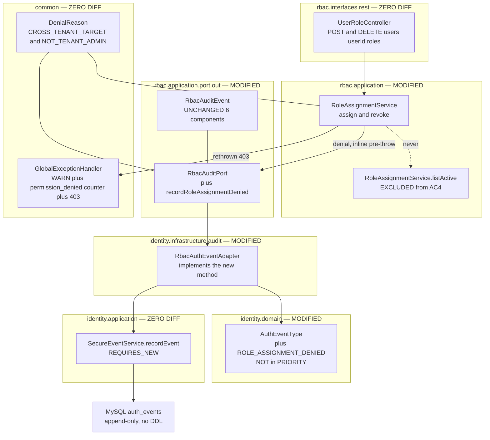
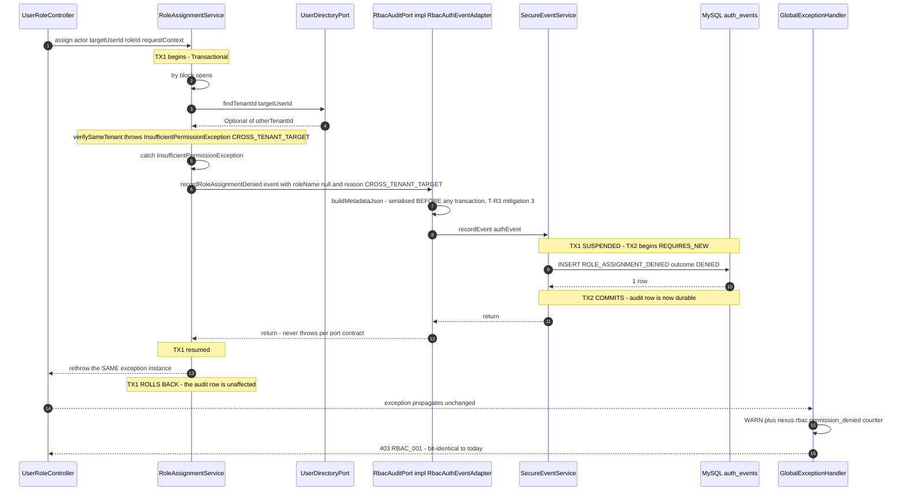
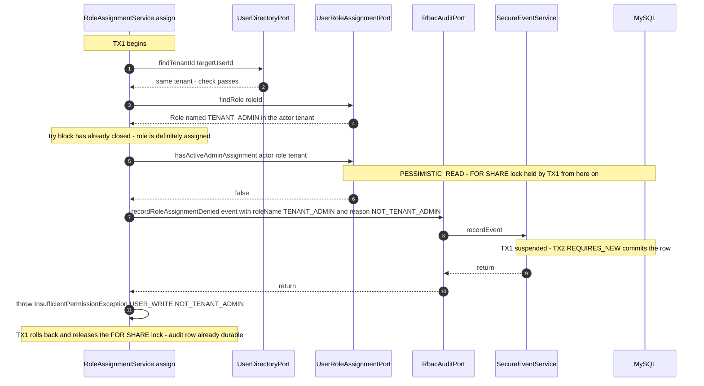
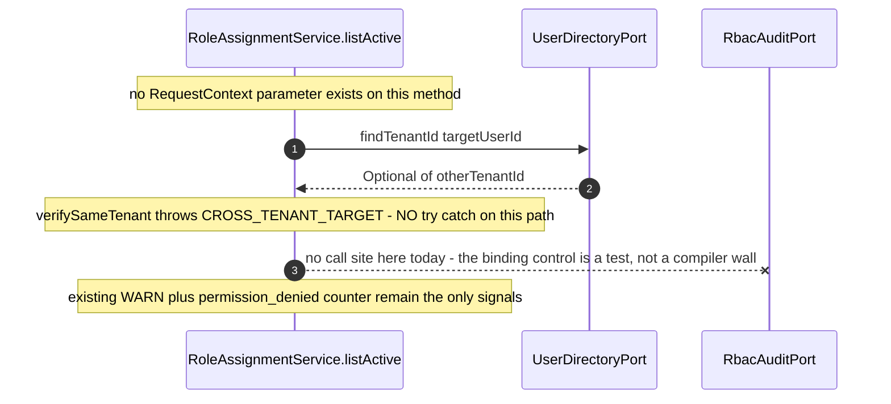

# Solution Design — US-014: Audit role assignment and revocation events

**Epic:** EPIC-002 (RBAC Foundation) | **Story points:** 3 | **Phase:** 3 (design)
**Inputs:** `docs/features/US-014/01-requirements.md` (Gate 1 approved, §7 Decisions binding) · `docs/features/US-014/02-impact.md` (Phase 2; all 14 §14 open items closed here)
**Scope:** backend only. Zero DB diff, zero API diff, zero frontend diff, zero dependency diff.
**Gate 2 status:** APPROVED by security review (`docs/features/US-014/03b-threat-model.md`) — no Blocker/Critical/High. All required wording/pricing corrections from that review (T-R5, T-D6, T-I6, T-E14, T-T8, T-D7, T-I7) are folded into this revision inline, marked "Gate 2 finding T-XX" at each edit site. No approach change — corrections are documentation/rollout-plan only.

**Files re-read to ground every signature and line reference below (not paraphrased from `02-impact.md`):**
`rbac/application/RoleAssignmentService.java`, `rbac/application/port/out/RbacAuditPort.java`, `rbac/application/port/out/RbacAuditEvent.java`, `rbac/application/port/out/UserRoleAssignmentPort.java`, `rbac/infrastructure/persistence/JpaUserRoleAssignmentAdapter.java`, `rbac/infrastructure/persistence/JpaUserRoleRepository.java`, `rbac/interfaces/rest/UserRoleController.java`, `identity/domain/AuthEventType.java`, `identity/infrastructure/audit/RbacAuthEventAdapter.java`, `identity/application/service/SecureEventService.java`, `common/security/DenialReason.java`, `common/security/InsufficientPermissionException.java`, `common/web/GlobalExceptionHandler.java`, `db/migration/V2__identity_schema.sql`, `db/migration/V4__auth_events_add_user_agent.sql`, `rbac/RoleAssignmentAuditIT.java`, `rbac/application/RoleAssignmentServiceTest.java`, `identity/infrastructure/audit/RbacAuthEventAdapterTest.java`, `identity/domain/AuthEventTypeTest.java`, `identity/infrastructure/persistence/AuthEventsAppendOnlyIT.java`, `architecture/HexagonalArchitectureTest.java`, `docs/adr/0011-in-process-bounded-retry-buffer-for-audit-writes.md`.

---

## 0. Decision register — closing all 12 open items from `02-impact.md` §14

Every row is a **decision**, not a recommendation. Deviation needs a design-doc amendment.

| # | Impact §14 item | **Decision** | Rationale (verified against the real code) |
|---|---|---|---|
| 1 | F1 — port signature vs. `RbacAuditEvent` shape | **Two-arg port method: `recordRoleAssignmentDenied(RbacAuditEvent event, DenialReason reason)`. `RbacAuditEvent` (`:13-19`) is NOT widened.** | Zero of the 17 positional construction sites change (option (c) would touch 14 test-only sites, 10 of them in a file ripgrep reports as binary). `DenialReason` lives in `common.security` and is *already* imported by `RoleAssignmentService` (`:5`) and by `RoleAssignmentServiceTest` (`:15`); no ArchUnit rule is engaged (§3.5). A sibling `RbacDenialAuditEvent` record was rejected: it duplicates 6 of 6 components to model one extra scalar. |
| 2 | F2 — `listActive` exclusion | **AC4 covers `assign()` and `revoke()` only. `listActive`'s 403 is a deliberate, permanent exclusion.** **Corrected claim (Gate 2 finding T-E14):** the exclusion is enforced by *where the emission call sites live plus a build-blocking test*, not by an inherent structural impossibility — see the caveat below. | `listActive` (`:252`) has no `RequestContext` parameter and `UserRoleController.listRoles` never builds one, so including it forces a service + controller + controller-test diff for a semantically wrong event name ("assignment denied" for a read). The emission therefore lives **at the `assign`/`revoke` call sites**, never inside the shared helpers `verifySameTenant` (`:297-306`) / `resolveRoleInTenant` (`:312-322`) — whose signatures are unchanged. **Caveat, not a loophole to leave undocumented:** `RbacAuditEvent` tolerates `null` for `roleId` and `requestContext` (both are null-handled downstream in `buildMetadataJson`/`record`), so a future call `recordDenial(actor, targetUserId, null, null, reason, null)` from `listActive` would *compile* — the missing parameters are a speed bump for a well-intentioned DRY refactor (e.g. moving the emission into the shared `verifySameTenant` helper), not a compiler-enforced wall. **The actual binding control is the test:** the new `verifyNoInteractions(rbacAuditPort)` assertion on `RoleAssignmentServiceTest:650-661`, which is mechanical, build-blocking, and fires on exactly that refactor. This is sufficient and is the right cost for a 3-point story — but `04-tasks.md` must mark that assertion **load-bearing, do not delete**, the same treatment already given the 409/404 negative assertions (§12.1), and the risk of removing it is real: a read-path denial would mislabel a `GET` as an assignment attempt and would widen the emitting population to every `user:read` holder — i.e. every self-registered `MEMBER`, orders of magnitude larger than the `TENANT_ADMIN`-only population this design otherwise bounds (§0 decision 5a, §15 item 3). |
| 3 | Throw-site mechanics | **Call-site wrapping: one `try/catch (InsufficientPermissionException) { record; throw e; }` around the two tenant checks in each of `assign`/`revoke`, plus one inline call immediately before the T3 throw (`:110`).** No helper signature changes, no `RequestContext`/`roleId` threading. | See §3.3 for the exact shape. Consequence worth stating: `roleName` is populated in a denial row **iff the role was successfully resolved in the actor's own tenant** — i.e. T3 only. This narrows the T2 cross-tenant-`roleName` residual to nothing (§0.1 item 2). |
| 4 | F4 — durability | **INLINE, synchronous, before the throw. `registerPostCommitSideEffects` (`:343-355`) is NOT reused. Durability rests entirely on `SecureEventService.recordEvent`'s `REQUIRES_NEW` (`SecureEventService.java:52-55`) committing on a suspended, independent transaction while the caller's transaction is doomed.** | Stated as an explicit sequence in §2.3. The two new ITs MUST assert the row exists **after** the service call has thrown — not merely that the port was called (§12). Getting this wrong rolls the denial record back together with the denial: the exact failure AC4 exists to prevent. |
| 5 | Priority lane | **`ROLE_ASSIGNMENT_DENIED` is deliberately EXCLUDED from `AuthEventType.PRIORITY`** (stays in the capacity-800 STANDARD lane). | **Confirmed correct by Gate 2 security review** (`03b-threat-model.md` §4.3) against ADR 0011 §1-§2 and §5: the priority lane is capacity **200**, **drop-newest per lane**, and depth-warn fires at "any priority depth ≥ 1 sustained for 1 min → ticket" (≥180 → page). **Corrected rationale** (the original draft's "attacker-triggerable at will by unprivileged probing" is factually wrong — `user:write` is `TENANT_ADMIN`-exclusive today, `V5__rbac_schema.sql:130-136`; see decision 5a below): a denial row is **far cheaper per row than a success row** — `ROLE_ASSIGNED` requires a valid in-tenant target and role, no existing active assignment, and an actual state mutation, so sustained generation needs an assign-revoke-assign cycle; a `CROSS_TENANT_TARGET` denial (T2) needs only a **published, low-entropy bootstrap-tenant role id** (`V5:11`) and produces one row per request with no mutation and no lock. Under a concurrent audit-store outage, a `TENANT_ADMIN` looping this would fill the 200-slot lane and **drop-newest would discard genuine `LOCKOUT`/`TOKEN_REFRESH_REUSE` arrivals** — structurally the same hazard ADR 0011's two-lane split was created to eliminate for `LOGIN_FAILURE` (T-D1), reproduced *inside* the protected lane. It would also hand that caller a **direct pager trigger** (depth-critical ≥180 → page) — an alert-fatigue DoS the design's original draft did not identify. The T-R4 forensic argument is real but weaker here: a lost denial record loses one probe from a repetitive series, whereas a lost `ROLE_ASSIGNED` loses a unique, unrepeatable repudiation-relevant fact. **Rule of thumb this establishes: priority-lane membership turns on cost-and-uniqueness per row, not mere triggerability** — read literally as "bounded by something an attacker doesn't control," the old rationale would also disqualify `ROLE_ASSIGNED`/`ROLE_REVOKED` (an admin can loop assign-revoke indefinitely too). Free bonus: `AuthEventTypeTest`'s `EXCLUDE`-mode parameterised test and its `hasSize(6)` priority assertion (`:83-99`) both stay green with **zero edits**, so the exclusion is auto-regression-tested. |
| 5a | Population correction (Gate 2 finding T-R5/T-D7) | **The reachable population for AC4's two 403s is `user:write` holders — today, `TENANT_ADMIN` exclusively — not "any authenticated caller."** | Verified against `UserRoleController`'s `@RequiresPermission("user:write")` on the assign/revoke endpoints and `V5__rbac_schema.sql:130-136`'s seed (`user:write` granted to `TENANT_ADMIN` only; `MEMBER` holds `user:read` alone). **Consequence for this story's own stated motivation:** the T-E1 attacker — a self-registered `MEMBER` reaching for `TENANT_ADMIN` — is stopped at `@RequiresPermission` with `PERMISSION_ABSENT` **before `RoleAssignmentService` is ever entered**, and is therefore **not** audited by AC4. The delivered trail records privileged actors (an active `TENANT_ADMIN`, or a just-revoked ex-admin inside their stale ~15-minute JWT window) overstepping — genuinely valuable, and T3 in particular is high-signal — but it is not a record of unprivileged escalation attempts. See §15 item 6 (updated) for the corrected claim and the forwarded coverage-gap obligation. This does not change decisions 1-11; it corrects only the *stated reason* for decision 5 and the framing of decisions 12's amplification input. |
| 6 | `outcome` literal | **`"DENIED"`.** | 6 chars into `outcome VARCHAR(20) NOT NULL` (`V2:81`, no CHECK constraint); self-documenting and distinct from the `"SUCCESS"`/`"FAILURE"`/`"INFO"` literals already in use. `"FAILURE"` was rejected as ambiguous — it already means "the operation the user attempted failed" (e.g. `LOCKOUT`), not "the request was refused by an authorization check". |
| 7 | `user_id` subject | **The TARGET user**, matching `RbacAuthEventAdapter.java:86`'s existing "the subject, matching the LOCKOUT convention". The actor goes into metadata under a new `attemptedBy` key. | **Corrected rationale (Gate 2 finding T-I6 — the original draft's rationale was void):** this is **not** justified by AC5's query shape — `ROLE_ASSIGNMENT_DENIED` is deliberately **outside** AC5's `event_type IN (...)` set (§4.3), so that query never returns a denial row regardless of which field is the subject. The real justification is **consistency with the one established convention**: `user_id` is "the subject" for every `auth_events` row type (`RbacAuthEventAdapter.java:86`, the `LOCKOUT` precedent), and carving out an exception for this one type would be a worse long-term outcome than the residual it avoids. **Accepted forensic cost, stated explicitly (not left implicit):** for a cross-tenant probe (T1/T2) the row pairs the **actor's** `tenant_id` with a **foreign-tenant** `user_id`; the actor is discoverable only via `JSON_UNQUOTE(JSON_EXTRACT(metadata,'$.attemptedBy'))` — an **unindexed** expression on a JSON column, not the indexed `user_id` column. "Show me everything this admin attempted" is therefore a full-scan-shaped query, while "show me everything done *to* this user" is indexed. Acceptable for a 3-point story with zero readers today (§15 item 1); Epic 7 will feel this trade and should be told. |
| 8 | Metadata keys | **`traceId`, `roleId`, `roleName`, `reason`, `attemptedBy`** — in that emission order (§4.2). `reason` stores `DenialReason.name()` verbatim. | `attemptedBy` parallels the existing `assignedBy`/`revokedBy` convention (`RbacAuthEventAdapter.java:67,72`) and is mutually exclusive with both. Emission **order is security-relevant, not cosmetic**: `roleName` is the only attacker-influenced value, and MySQL's binary JSON keeps the **last** duplicate key, so every code-derived key that must not be forgeable is emitted *after* `roleName`. `reason` therefore sits between `roleName` and `attemptedBy` (§4.2, and the new adapter test in §12.2). |
| 9 | Observability | **No new counter.** Reuse `nexus.rbac.permission_denied{permission,reason}` (`GlobalExceptionHandler.java:167-171`) — verified still firing unchanged, because the exception is **rethrown** and reaches the handler exactly as before. **Add one tag value** `operation="deny"` to the existing `nexus.rbac.audit_write_failed{operation}` counter (`RbacAuthEventAdapter.java:104-107`). **No new WARN** at the throw site. | `GlobalExceptionHandler.java:166` already WARN-logs these 403s with `reason`/`requiredPermission`/`userId`/`tenantId`; a symmetric service-side WARN would double every log line for one event. The audit write is **additive** to that path, not a replacement for it. Full plan in §9. |
| 10 | AC5 test placement | **Inside `RoleAssignmentAuditIT`**, reusing its `seedUser`/`seedRole`/`toBytes`/`jdbc` and the same autowired `RoleAssignmentService`. No new IT class. | Every `auth_events`-querying helper and the ability to produce a *real* assign-then-revoke history already live there; a new class would duplicate five helpers to add one test. Flake design in §12.4. |
| 11 | ADR 0011 amendment | **Write the amendment note** (verbatim text in §14), recording (a) the pre-existing four-vs-six drift introduced by US-012 and never recorded, and (b) this story's deliberate exclusion per decision 5. **No new ADR.** | This records already-taken decisions; it does not make one. A compliance reader hits "exactly the four" in ADR 0011 §1 before they reach the code. |
| 12 | Threat-model inputs | **Not resolved here by design** — handed to `03b-threat-model.md` / the security reviewer in §15, with the design's shape verified not to foreclose either item. | Two inputs: (a) foreign-tenant `roleName` in a denial row — **eliminated by construction** under decision 3 (§0.1 item 2), downgraded to an informational note; (b) audit-volume amplification from unrate-limited denial probing — pre-existing gap, US-012 Res. 10 already accepted it; documented as an accepted risk, not a blocker. |

### 0.1 Refinements discovered while designing (corrections to `02-impact.md`, none of which change a decision)

1. **`roleId` is never null in a denial row.** `02-impact.md` §1.2.3 and §14.8 imply `roleId` may be absent at T1. It cannot be: `roleId` is a `UUID` **parameter** of `assign`/`revoke` (`:94`, `:180`), supplied by the controller's path variable, and is therefore in scope at every one of the three throw sites. Only `roleName` is conditional. The `buildMetadataJson` null-omission behaviour (`:121-129`) is retained regardless — it costs nothing and keeps the adapter honest about a nullable record component.
2. **T2's denial carries no `roleName` at all**, so the "foreign tenant's role name lands in an audit row" residual (`02-impact.md` §5, §14.12) **does not arise under this design**. `resolveRoleInTenant` (`:312-322`) throws without returning the `Role`, so the call-site `catch` has no `Role` reference. `roleName` is present in a denial row **only** for T3, where the role is by definition in the actor's *own* tenant. Kept in §15 as an informational note so the security reviewer can confirm rather than rediscover it.
3. **T3's denial is emitted while the caller's transaction holds a `FOR SHARE` lock.** `hasActiveAdminAssignment` (`:107`) resolves to `JpaUserRoleRepository.lockActiveAdminAssignment`, annotated `@Lock(PESSIMISTIC_READ)` (`:152`). `02-impact.md` §6 states "there is **no** row lock in scope here" — that is true for T1/T2 but **not** for T3. Consequence: the `REQUIRES_NEW` `INSERT` runs on a second pooled connection while the outer transaction still holds a shared lock on the caller's `user_roles` rows. No deadlock is possible (disjoint tables, no lock cycle — `auth_events` is never read or locked by the RBAC path), and the added lock-hold time is one `INSERT` round-trip on an already-failing request. Recorded in §8.3 as an accepted, bounded cost; no design change.
4. **`AuthEventType` currently defines 22 constants → 23.** `AuthEventTypeTest.should_defineAllTwentyTwoConstants_when_valuesCalled` (`:102-128`) needs `hasSize(23)`, one added name, and a method rename. That is the **only** mandatory edit in that file (decision 5 keeps the priority assertions green).
5. **`RoleAssignmentAuditIT.seedRole` cannot be reused for the T3 fixture.** It prefixes names with `"RAA-" + tag + "-" + randomUUID` (`:366-372`), which can never match `RbacRoleNames.TENANT_ADMIN` under `equalsIgnoreCase`. The T3 IT must build the role directly — `roleRepository.save(new Role(uuidGenerator.newId(), tenantId, "TENANT_ADMIN", null, false))` — exactly as the adversarial-`roleName` test already does (`:196-197`). `is_system_role=false` and a fresh `tenantId` keep `uq_roles_tenant_name` and `RbacSchemaMigrationIT`'s scoped seed-role count unaffected.

---

## 1. Architecture

### 1.1 Component diagram



**Reading the diagram:** the whole story is one new port method, one new adapter method, one new enum constant, and two call-site wrappings. The dependency direction stays `identity → rbac`; `AuthEventType` is selected **inside** the adapter and never crosses the port (ArchUnit `rbac_must_not_depend_on_identity`, `HexagonalArchitectureTest.java:106-118`).

### 1.2 Layering conformance (ADR 0002)

| Layer | Change | Rule check |
|---|---|---|
| `rbac.domain` | none | — |
| `rbac.application` | `RoleAssignmentService` emission; `RbacAuditPort` +1 method | `application_must_not_depend_on_adapters` ✅ (port interface only). `domain_and_application_must_not_depend_on_spring_security` ✅ — `DenialReason` resides in `..common.security..`, not `org.springframework.security..`; already depended upon at `RoleAssignmentService.java:5`. `rbac_application_methods_must_not_accept_principal_or_map` ✅ — the new method's parameters are `RbacAuditEvent` + an enum. |
| `rbac.interfaces.rest` | **none** | Guaranteed by decision 2 (§13). |
| `identity.infrastructure.audit` | adapter implements the new method, selects the `AuthEventType` | `rbac_must_not_depend_on_identity` ✅ — direction is `identity → rbac`, unchanged. |
| `identity.application` / `identity.domain` | `AuthEventType` +1 constant only | `SecureEventService`, `AuthEventPort`, `AuthEvent`, `AuthEventRetryBuffer`, `JpaAuthEventAdapter` reused verbatim. |

**No new ArchUnit rule is required.** `RoleAssignmentService`'s self-policed Javadoc invariant ("every **public** method accepts only `RoleChangeActor`, `UUID`, `RequestContext`", `:37-44`) is unaffected — the new private helper is not a public method and takes none of the banned types.

---

## 2. Sequence diagrams

### 2.1 T1 / T2 — cross-tenant denial on `assign` (identical shape on `revoke`)



### 2.2 T3 — `NOT_TENANT_ADMIN` denial on `assign` (inline, no try/catch needed)



### 2.3 The durability claim, stated as an ordered invariant (F4)

This is the design's central correctness claim. It must hold in exactly this order:

1. Caller's `@Transactional` **TX1 begins** (`RoleAssignmentService.assign`/`revoke`).
2. An authorization check fails. **Nothing has been written by TX1** on any denial path — there is no `INSERT`/`UPDATE` to roll back and no post-commit hook to fire (`registerPostCommitSideEffects`, `:343-355`, is deliberately **not** used: `afterCommit` can never run on a doomed transaction).
3. `rbacAuditPort.recordRoleAssignmentDenied(...)` is invoked **synchronously, inline, before the `throw`**.
4. The adapter serialises metadata **before** touching any transaction (existing T-R3 mitigation #3, `RbacAuthEventAdapter.java:79-82`), then calls `SecureEventService.recordEvent` — `@Transactional(propagation = REQUIRES_NEW)` (`SecureEventService.java:52`).
5. Spring **suspends TX1**, opens **TX2**, inserts, and **commits TX2**. The row is durable at this instant.
6. Control returns; the port contract guarantees no exception escapes (a failure becomes ERROR `RBAC_AUDIT_WRITE_LOST` + `nexus.rbac.audit_write_failed{operation=deny}`).
7. The **same** `InsufficientPermissionException` instance is rethrown; **TX1 rolls back**; the HTTP response is unchanged.

**Non-negotiable test obligation:** the two new ITs (§12.4) must assert the row is present by querying `auth_events` *after* `assertThatThrownBy(...)` has completed. A Mockito `verify(...)` on the port proves step 3 only and would leave steps 5-7 — the entire claim — untested.

### 2.4 The excluded path — `listActive` (design guarantee, not an omission)



**Corrected claim (Gate 2 finding T-E14 — the exclusion is deliberate and test-enforced, not compiler-enforced):** the emission lives at `assign`/`revoke` call sites, never in the shared helper `verifySameTenant`, and `listActive` has no `RequestContext` in scope today. That makes an accidental extension *awkward* — but not impossible: `RbacAuditEvent` accepts `null` for `roleId` and `requestContext`, both null-handled downstream, so a future call from `listActive` with two nulls would compile. **The binding control is the `verifyNoInteractions(rbacAuditPort)` test (§12.1, row 7)** — mechanical, build-blocking, and the thing that actually fails if this exclusion is ever silently removed. It must be treated as load-bearing (§0 decision 2).

---

## 3. Component design — exact new and changed signatures

### 3.1 `rbac/application/port/out/RbacAuditPort.java` — MODIFY (+1 method)

```java
  /**
   * Records a DENIED role-assignment or revocation attempt (US-014 AC4). Must never throw or
   * block — same contract as the two success methods above.
   *
   * <p>Called INLINE, before the caller throws, from a transaction that is about to roll back:
   * durability rests entirely on the implementation committing in an independent
   * ({@code REQUIRES_NEW}) transaction. Scoped to the two 403 authorization denials
   * ({@code CROSS_TENANT_TARGET}, {@code NOT_TENANT_ADMIN}); never called for the 409 conflicts
   * or the 404s, and never from a read path — an "assignment denied" event for a read is a
   * semantic mislabel, and would also widen the emitting population to every {@code user:read}
   * holder rather than the {@code user:write} holders this event type is scoped to.
   */
  void recordRoleAssignmentDenied(RbacAuditEvent event, DenialReason reason);
```

`RbacAuditEvent` is reused as-is; for a denial its components read: `tenantId` = actor's tenant, `targetUserId` = the target, `roleId` = the requested role id (always present), `roleName` = the resolved role's name **or null**, `actorUserId` = the attempting actor, `requestContext` = the request's context. One import is added to the file (`com.example.nexus.common.security.DenialReason`).

**`RbacAuditEvent.java`: zero diff.** Explicitly recorded so nobody "completes" the record with a 7th component.

### 3.2 `identity/domain/AuthEventType.java` — MODIFY (+1 constant, `PRIORITY` unchanged)

```java
  // RBAC role-change events (US-012, Res. 2 — US-012 owns emission; US-014 extends/verifies)
  ROLE_ASSIGNED("ROLE_ASSIGNED"),
  ROLE_REVOKED("ROLE_REVOKED"),

  // US-014 AC4: a DENIED role assignment/revocation attempt (403 authorization denials only).
  // Deliberately NOT in PRIORITY below — see the comment on that field.
  ROLE_ASSIGNMENT_DENIED("ROLE_ASSIGNMENT_DENIED");
```

The comment above `PRIORITY` (`:47-50`) gains one paragraph; the `EnumSet` itself (`:51-58`) and `isPriority()` (`:79-81`) are **unchanged**:

> `ROLE_ASSIGNMENT_DENIED` is deliberately NOT priority (US-014 design decision 5): a denial row is far cheaper to generate per row than a success row — it requires no valid mutation, no lock, and (for the cross-tenant-target path) only a published, low-entropy role id, whereas `ROLE_ASSIGNED`/`ROLE_REVOKED` require an actual state mutation with a last-admin guard and duplicate check in the way. The priority lane is capacity-200 with drop-newest overflow (ADR 0011 §1), so admitting this cheaper-to-generate type would let a `user:write` holder's probing loop crowd out `LOCKOUT`/`TOKEN_REFRESH_REUSE` — the same hazard the two-lane split exists to prevent (T-D1), reproduced inside the protected lane — and would hand that caller a direct pager trigger (depth-critical ≥180 → page). Membership in the priority lane turns on cost-and-uniqueness per row, not mere triggerability by an authenticated caller (today: `TENANT_ADMIN` only — see design §0 decision 5a).

`event_type VARCHAR(64)` (`V2:80`) holds the 22-char wire name. No migration.

### 3.3 `rbac/application/RoleAssignmentService.java` — MODIFY (the only judgement-bearing change)

**One new private helper.** Placed next to `registerPostCommitSideEffects`:

```java
  private void recordDenial(
      RoleChangeActor actor,
      UUID targetUserId,
      UUID roleId,
      String roleName,
      DenialReason reason,
      RequestContext requestContext)
```

Body: a single `rbacAuditPort.recordRoleAssignmentDenied(new RbacAuditEvent(actor.tenantId(), targetUserId, roleId, roleName, actor.userId(), requestContext), reason);`. Note `actor.tenantId()` — the audit row is always written under the **actor's** tenant, never the target's.

**`assign()` — two emission points.** The two tenant checks (`:95-96`) move inside a `try`; the T3 emission (`:109-111`) is a plain inline statement:

```java
    Role role;
    try {
      verifySameTenant(targetUserId, actor, USER_WRITE);           // T1
      role = resolveRoleInTenant(roleId, actor, USER_WRITE);       // T2
    } catch (InsufficientPermissionException e) {
      // roleName is null by construction here: T1 runs before the role is resolved, and T2's
      // resolveRoleInTenant throws without returning the (foreign-tenant) Role. A denial row
      // therefore never carries another tenant's role name.
      recordDenial(actor, targetUserId, roleId, null, e.getReason(), requestContext);
      throw e;
    }
```

```java
      if (!callerIsActiveAdmin) {
        recordDenial(
            actor, targetUserId, roleId, role.getName(), DenialReason.NOT_TENANT_ADMIN,
            requestContext);                                        // T3
        throw new InsufficientPermissionException(USER_WRITE, DenialReason.NOT_TENANT_ADMIN);
      }
```

**`revoke()` — one emission point.** The same `try/catch` around `:181-182`; nothing else in the method changes. `LastAdminRoleException` (`:204`) and `DuplicateRoleAssignmentException` (`:124`) are **not** caught — they are not `InsufficientPermissionException`, so the 409 exclusion (§7 Decision 2) is enforced by the catch type itself, not by a condition anyone can get wrong.

**`listActive()` — zero diff.** No `try`, no `recordDenial` call, no `RequestContext`.

Design notes:
- `Role role;` is declared before the `try` and definitely-assigned after it (the `catch` ends in `throw`) — no nullable local, no compiler warning.
- The **same exception instance** is rethrown (`throw e`), preserving `requiredPermission`, `reason`, message, and stack trace for `GlobalExceptionHandler`.
- `e.getReason()` is read from the exception rather than duplicated as a literal, so T1 and T2 cannot drift from the thrown value.
- **No new log statement.** Decision 9.

### 3.4 `identity/infrastructure/audit/RbacAuthEventAdapter.java` — MODIFY (minimal signature change)

New public method:

```java
  @Override
  public void recordRoleAssignmentDenied(RbacAuditEvent event, DenialReason reason) {
    record(
        event,
        AuthEventType.ROLE_ASSIGNMENT_DENIED,
        "DENIED",
        "attemptedBy",
        "deny",
        reason != null ? reason.name() : null);
  }
```

The private helper gains exactly **two parameters** — `outcome` (replacing the hardcoded `"SUCCESS"` at `:85`) and `reasonName`:

```java
  @SuppressWarnings("java:S6213")
  private void record(
      RbacAuditEvent event,
      AuthEventType eventType,
      String outcome,
      String actorFieldName,
      String operation,
      String reasonName)
```

```java
  private String buildMetadataJson(RbacAuditEvent event, String actorFieldName, String reasonName)
```

- The two existing call sites become `record(event, AuthEventType.ROLE_ASSIGNED, "SUCCESS", "assignedBy", "assign", null)` and the `ROLE_REVOKED` equivalent — the *only* change to the success paths, and behaviour-preserving.
- Six parameters is under Sonar S107's default threshold of 7. A parameter-object refactor is not proportionate for a 3-point story; if a seventh is ever needed, introduce a private record then.
- Everything else in `record(...)` is untouched: pre-transaction serialisation, `withUserId(event.targetUserId())`, `withTenantId`, `withIpAddress`/`withUserAgent`, `secureEventService.recordEvent`, and the catch-all → ERROR `RBAC_AUDIT_WRITE_LOST` + `nexus.rbac.audit_write_failed{operation}`.
- `buildMetadataJson` adds one block, positioned **after** the `roleName` block and **before** the actor block (see §4.2 for why that position is security-relevant):

```java
    if (reasonName != null) {
      metadata.put("reason", reasonName);
    }
```

- The Javadoc's T-R3 paragraph (`:35-42`) gains one sentence noting that for a denial the surrounding transaction is *already* doomed, so `REQUIRES_NEW` is not merely a durability nicety but the sole reason the row survives.

### 3.5 Dependency and ArchUnit verification (done, not assumed)

| Check | Result |
|---|---|
| `rbac.application.port.out` → `common.security.DenialReason` | ✅ Allowed. `common` is the shared kernel; `RoleAssignmentService:5` already imports it. |
| `AuthEventType` crossing the port | ✅ Never. Selected inside the adapter (`:67`, `:72`, and the new method). |
| `rbac_must_not_depend_on_identity` | ✅ Green — no new `rbac → identity` import. |
| `domain_and_application_must_not_depend_on_spring_security` | ✅ Green — `DenialReason` resides in `..common.security..`. |
| `rbac_application_methods_must_not_accept_principal_or_map` | ✅ Green — new parameters are a record and an enum. |
| New ArchUnit rule needed | ❌ No. |

---

## 4. Database design

### 4.1 Schema: **no change whatsoever**

No Flyway migration; `ddl-auto=validate` cannot fail as a result of this story; ADR 0003's append-only migration rule is not engaged; no grant change (ADR 0012/0014 untouched — `GRANT INSERT, SELECT ON nexus.auth_events` already covers the new row). No JPA entity change: `AuthEvent`'s `withUserId`/`withTenantId`/`withIpAddress`/`withUserAgent`/`withMetadata` are sufficient, and `event_type`/`outcome` are plain `String` columns (no `@Enumerated`).

Effective column list of `auth_events` (`V2:76-86` + `V4`): `id BINARY(16) PK`, `user_id BINARY(16) NULL`, `tenant_id BINARY(16) NULL`, `event_type VARCHAR(64) NOT NULL`, `outcome VARCHAR(20) NOT NULL`, `ip_address VARCHAR(45) NULL`, `user_agent VARCHAR(512) NULL`, `metadata JSON NULL`, `created_at DATETIME(6) NOT NULL DEFAULT CURRENT_TIMESTAMP(6)`. **No FK constraints** (`V2:74` — "append-only audit trail — no FK"), which is what makes a T1 denial row (actor's `tenant_id` + foreign-tenant `user_id`) insertable at all; §15 records the consequence.

`ROLE_ASSIGNMENT_DENIED` is a **data-value** addition to a `VARCHAR(64)` column, not a schema change. No composite `(tenant_id, user_id, event_type)` index is added — accepted per requirements R-5; AC5's query is test-only until Epic 7.

### 4.2 Row shape per event type — the authoritative table

| | `ROLE_ASSIGNED` | `ROLE_REVOKED` | `ROLE_ASSIGNMENT_DENIED` |
|---|---|---|---|
| `event_type` | `ROLE_ASSIGNED` | `ROLE_REVOKED` | `ROLE_ASSIGNMENT_DENIED` |
| `outcome` | `SUCCESS` | `SUCCESS` | **`DENIED`** |
| `user_id` | target user | target user | **target user** (decision 7) |
| `tenant_id` | actor's tenant | actor's tenant | **actor's tenant** |
| `ip_address` / `user_agent` | from `RequestContext` | same | same |
| emitted | **after commit** (`afterCommit`) | after commit | **inline, pre-throw** (§2.3) |
| lane | PRIORITY | PRIORITY | **STANDARD** (decision 5) |

Metadata JSON keys, **in emission order** (a `null` value omits the key entirely — never a JSON `null`):

| # | key | `ROLE_ASSIGNED` | `ROLE_REVOKED` | `ROLE_ASSIGNMENT_DENIED` |
|---|---|---|---|---|
| 1 | `traceId` | present when non-null | present when non-null | present when non-null |
| 2 | `roleId` | always | always | **always** (§0.1 item 1) |
| 3 | `roleName` | always | always | **T3 only — absent for T1/T2** |
| 4 | `reason` | absent | absent | **always** — `DenialReason.name()` |
| 5 | `assignedBy` | present | absent | absent |
| 5 | `revokedBy` | absent | present | absent |
| 5 | `attemptedBy` | absent | absent | **present** |

**Stated explicitly, because it will otherwise be filed as a bug:** a `ROLE_ASSIGNMENT_DENIED` row's metadata is **not field-identical** to a `ROLE_ASSIGNED` row's. `roleName` is legitimately absent whenever the denial fired before the role was resolved in the actor's tenant (T1, T2), and `attemptedBy` replaces `assignedBy`/`revokedBy`. Any future consumer (Epic 7) must treat `roleName` as optional on denial rows.

**Key ordering is useful defense-in-depth, not the primary control** (corrected per Gate 2 finding T-T8/T-S5 — the original draft overstated this, which risks reading as license to relax the real control). The primary control against metadata JSON injection remains Jackson 3's RFC-8259-compliant escaping (US-012 T-T5), unchanged and re-verified still in place. Key ordering is a secondary, belt-and-suspenders property: `roleName` is the only potentially attacker-influenced value in the map, and MySQL's binary JSON keeps the **last** occurrence of a duplicate key, so emitting every code-derived key *after* `roleName` means a hypothetical forged key injected through a broken escaper would land before the real one and lose. **In this story the injection surface is empty by construction regardless:** the `ROLE_ASSIGNMENT_DENIED` path only ever sets `roleName` at T3, which fires exclusively when `RbacRoleNames.TENANT_ADMIN.equalsIgnoreCase(role.getName())` — so a denial row's `roleName` is either absent (T1/T2) or a case variant of the literal string `tenant_admin`, never an attacker-chosen payload. This preserves — and extends to `reason` — the ordering property `RoleAssignmentAuditIT:171-219` and `RbacAuthEventAdapterTest:129-164` already prove for `assignedBy`/`traceId`. The new test in §12.2 (`should_keepRealReason_when_roleNameAttemptsDuplicateKeyInjectionOfReason`) is a **characterisation test for the ordering property**, not an escaper-failure detector — it passes under both a working and a broken escaper. The escaper-failure detector is the pre-existing `traceId` injection case at `RbacAuthEventAdapterTest:129-164` (a forged key there lands *after* the legitimate value and would win if escaping broke); it must not be retired as redundant once the newer test lands (flag in `04-tasks.md`).

### 4.3 AC5's query — data guarantee, no shipped surface

```sql
SELECT * FROM auth_events
 WHERE tenant_id = ? AND user_id = ? AND event_type IN ('ROLE_ASSIGNED','ROLE_REVOKED')
 ORDER BY created_at;   -- ascending / oldest-first, per §7 Decision 3
```

`JpaAuthEventRepository` stays a bare `extends JpaRepository<AuthEvent, UUID> {}`; no repository method, no service method, no endpoint (no consumer exists pre-Epic 7). Served by the three existing single-column-paired indexes (`V2:88-90`). `ROLE_ASSIGNMENT_DENIED` is **outside** the `IN` set, so this query — and any existing consumer of it — is unaffected by construction.

---

## 5. API contracts

**Zero new endpoints, zero changed endpoints, zero DTO changes, zero status-code changes, zero versioning event, zero OpenAPI diff.**

Both in-scope denials continue to return exactly what they return today, from unchanged code:

```yaml
# UNCHANGED CONTRACT — reproduced for review only, not defined or altered by this story
'403':
  description: Authenticated but not authorized
  content:
    application/problem+json:
      schema:
        type: object
        required: [code, traceId]
        properties:
          code:               { type: string, enum: [RBAC_001] }
          detail:             { type: string, example: "You do not have permission to perform this action" }
          traceId:            { type: string }
          requiredPermission: { type: string, example: "user:write" }
```

Source: `GlobalExceptionHandler.handleInsufficientPermission` (`:159-176`) — untouched. **The wire contract is bit-identical before and after this story**; the only observable difference is a row in `auth_events`.

---

## 6. Frontend design

**None. Zero.** No file under `nexus-frontend/` changes — no component, route, guard, service, store, Vitest spec, Playwright spec, or `package.json`/lockfile touch (which also sidesteps the known npm-Windows `@emnapi` lockfile-prune trap). §5 establishes the HTTP contract is unchanged, so there is nothing for a client to consume differently. The audit log UI is Epic 7, explicitly out of scope.

---

## 7. Caching strategy

**Not applicable, deliberately.** `PermissionCachePort.evict` is **not** called on a denial: no permission state changed, so evicting would be a pointless cache miss for every subsequent legitimate request from that tenant/user — and, since denials are attacker-triggerable, an attacker-controlled cache-invalidation lever. Redis is untouched; no key, no TTL, no invalidation trigger, no ADR 0016 impact. The existing `verifyNoInteractions(permissionCachePort)` assertions on the denial branches (§12.1) keep this true.

---

## 8. Error handling strategy

### 8.1 Error codes and outcomes

| Condition | Exception | HTTP | `code` | Denial audit row? |
|---|---|---|---|---|
| Target user in another tenant (T1) | `InsufficientPermissionException(CROSS_TENANT_TARGET)` | 403 | `RBAC_001` | **Yes** |
| Role belongs to another tenant (T2) | `InsufficientPermissionException(CROSS_TENANT_TARGET)` | 403 | `RBAC_001` | **Yes** |
| Granting `TENANT_ADMIN` without being one (T3) | `InsufficientPermissionException(NOT_TENANT_ADMIN)` | 403 | `RBAC_001` | **Yes** |
| Duplicate active assignment | `DuplicateRoleAssignmentException` | 409 | `RBAC_004` | **No** — benign client bug (§7 Decision 2) |
| Last-admin lockout | `LastAdminRoleException` | 409 | `RBAC_002` | **No** — benign race |
| Target user / role / assignment not found | `ResourceNotFoundException` | 404 | `USER_NOT_FOUND` / `ROLE_NOT_FOUND` / `ROLE_ASSIGNMENT_NOT_FOUND` | **No** |
| Cross-tenant `listActive` (GET) | `InsufficientPermissionException(CROSS_TENANT_TARGET)` | 403 | `RBAC_001` | **No** — deliberate exclusion (§2.4) |
| Denial audit write itself fails | swallowed | unchanged 403 | unchanged | ERROR + counter (§9) |

### 8.2 Retry and idempotency

- **No retry at the service layer.** The denial audit write inherits the existing pipeline's retry semantics for free: a failure at `JpaAuthEventAdapter.record` enqueues onto the STANDARD lane of `AuthEventRetryBuffer` (1s → 5s → 30s → 2m → 10m, 5 attempts, ADR 0011 §2); a failure surfacing at `REQUIRES_NEW` commit time is the T-R3 path (ERROR + counter, no retry).
- **Idempotency key:** none required, and none is meaningful. Each `AuthEvent` carries a pre-generated UUIDv7 `@Id` (`uuidGenerator.newId()`), so a *buffer* retry cannot duplicate a row; two genuine denial attempts are two genuine events and **must** both be recorded. There is no request-level idempotency key on these endpoints today and this story does not introduce one.
- **The port never throws.** Restated on the new method's Javadoc (§3.1). A caller must never wrap `recordRoleAssignmentDenied` in a `try`/`catch`; doing so would suggest the contract is unreliable and could swallow the *denial* itself.

### 8.3 Accepted operational costs

- **Second pooled connection on a formerly write-free path — priced (Gate 2 finding T-D6, Medium).** `spring.datasource` has no `hikari` block anywhere in `application.yml` (verified `:22-26`), so HikariCP defaults apply: **`maximumPoolSize = 10`**, **`connectionTimeout = 30_000 ms`**. `REQUIRES_NEW` suspends TX1 but does not release its connection (Hibernate resource-local release mode keeps it bound to the suspended `EntityManager`), so for the duration of the audit `INSERT` the request holds **two** connections simultaneously. Consequence: **~5 concurrent denials saturate the pool**, and the 6th blocks in `getConnection()` for up to 30s *while still holding its own connection* — a self-reinforcing stall that is pool-wide, hence platform-wide and cross-tenant (every other endpoint and every other tenant shares this pool). This is precisely the pressure US-012's `afterCommit` design (D14) was chosen to avoid (US-012 T-R3); US-014 cannot reuse `afterCommit` because the transaction is doomed (§2.3 is correct that this is the only workable shape), so the nesting is reintroduced of necessity. **Accepted for this story** on the grounds that the reachable population is `user:write` = `TENANT_ADMIN` only (§0 decision 5a) — insider/compromised-admin abuse, not anonymous DoS — but see the §11 watch-list and rollback-trigger additions below, and the US-015 forward obligation in §15 item 3.
- **T3 holds a `FOR SHARE` lock across the audit insert** (§0.1 item 3). No deadlock is possible — `auth_events` is never read or locked by the RBAC path, so there is no lock cycle. **Under the pool pressure above, the accepted cost is larger than "one INSERT round-trip":** the lock can be held for up to the 30s acquisition timeout, during which a concurrent legitimate revocation of the same `user_roles` rows (which needs an exclusive lock) blocks. Still no deadlock; still accepted, but priced correctly rather than as a footnote.
- **Attacker-driven volume.** §15.

---

## 9. Observability plan

### 9.1 What already exists and is verified unchanged

| Signal | Source | Status |
|---|---|---|
| WARN log with `reason`, `requiredPermission`, `userId`, `tenantId` | `GlobalExceptionHandler.java:161-166` | **Unchanged and still fires** — the exception is rethrown and reaches the handler exactly as before. |
| `nexus.rbac.permission_denied{permission,reason}` | `GlobalExceptionHandler.java:167-171` | **Unchanged and still fires.** Already tagged with exactly the two in-scope `DenialReason` values, so the metric AC4 might otherwise ask for already exists and is already alertable. |
| `traceId` correlation into `metadata` | `CorrelationIdFilter` + MDC → `RequestContext.traceId` → `buildMetadataJson:118-120` | Unchanged; satisfies AC1/AC2's `correlation_id` for denial rows too. |
| ERROR `RBAC_AUDIT_WRITE_LOST` on a lost audit write | `RbacAuthEventAdapter.java:95-103` | Unchanged; now also fires for denials, with `operation=deny` in the message and `roleId`/`actorUserId`/`traceId` key-values. |

### 9.2 What this story adds — exactly one thing

**One new tag value** on the existing counter: `nexus.rbac.audit_write_failed{operation="deny"}`, alongside `assign`/`revoke`. Free (the counter is already tag-driven) and it makes a lost *denial* record separately observable from a lost assign/revoke record — which matters, because they have different remediation paths (a lost denial is a forensic gap; a lost assign is a repudiation gap).

**Explicitly NOT added, and why:**
- **No `nexus.rbac.role_assignment_denied` counter** — it would be a drift-prone duplicate of `nexus.rbac.permission_denied{reason}`, which already carries exactly these two reasons.
- **No second WARN log** at the service throw site — `GlobalExceptionHandler` is the incumbent and already logs every field an operator needs; a symmetric WARN would double the log volume for one event.
- **No new dashboard.** One existing panel gains a series (below).
- **No new trace span.** The audit write is a synchronous child of the already-traced request; `traceId` already lands in `metadata`.

### 9.3 Alerting and dashboard delta

| Item | Change |
|---|---|
| Existing "RBAC / Role Assignment" dashboard row | Add `operation=deny` to the `nexus.rbac.audit_write_failed` panel's series (a legend entry, not a new panel). |
| Alert `RbacAuditWriteLost` | Extend the existing rule to cover the new tag value: any non-zero `increase(nexus.rbac.audit_write_failed{operation="deny"}[15m])` → ticket. Same severity as `assign`/`revoke`: a lost denial record is a forensic gap, not a live outage. |
| Alert on denial volume | **None added.** `nexus.rbac.permission_denied{reason}` is the correct series for a probing-detection alert, and defining that threshold is US-015/ops work, not this story's — but §15 records it as the mitigation an operator would reach for. |
| ADR 0011 lane alerts | Unchanged, and *deliberately* so: because `ROLE_ASSIGNMENT_DENIED` is STANDARD-lane, a denial flood shows up on the existing standard-lane depth-warn (≥ 250 for 1 min) and cannot trip the priority-lane "any depth ≥ 1" pager. |

### 9.4 What to look at when something goes wrong

| Symptom | First place to look |
|---|---|
| "We have no denial trail for an incident" | `nexus.rbac.audit_write_failed{operation="deny"}` and ERROR `RBAC_AUDIT_WRITE_LOST`; then `nexus.audit.buffer.dropped{lane="standard"}`. |
| "A denial row exists but the request succeeded" (should be impossible) | Confirm the emission is still pre-throw and that no code path calls `recordDenial` outside a `catch`/pre-`throw` position. |
| "Denial rows are flooding `auth_events`" | `nexus.rbac.permission_denied{reason}` by tenant, then §15's amplification note. |
| "A denial row is missing `roleName`" | **Not a bug** — §4.2. Check `reason`: `CROSS_TENANT_TARGET` legitimately has no `roleName`. |

---

## 10. Feature flag strategy

**No new feature flag.** Justification, not omission:

- The story states "Feature flag required: No".
- The change is inert to every wire contract (§5) — a flag would gate an invisible behaviour.
- `UserRoleController` already carries `@ConditionalOnProperty(name = "feature.nexus-us012-rbac-role-assignment.enabled")` (`:60-61`), which switches off **the only two paths that can reach the new emission**. A second flag would be a redundant control over the same surface.
- ADR 0011's existing escape hatch `nexus.identity.audit.retry-buffer.enabled` remains the lever for audit-pipeline problems generally.

**Kill switch of record:** `feature.nexus-us012-rbac-role-assignment.enabled=false` disables assign/revoke entirely (and therefore all denial emission). There is no way to disable denial auditing while leaving the endpoints live, and that is intentional — a partial flag would create an "endpoints live, audit off" state that AC4 exists to make impossible.

---

## 11. Rollout plan

**Instant / with-deploy.** No canary, no gradual percentage.

| Aspect | Decision |
|---|---|
| Strategy | Ship with the normal deploy. The change is additive, wire-invisible, and reversible by code revert alone. |
| Pre-deploy | Full gate green: `./mvnw verify` (Docker up — this story touches persistence-adjacent ITs), plus `/pre-pr-check`. |
| Post-deploy watch (24h) | (1) `nexus.rbac.audit_write_failed{operation="deny"}` stays at 0; (2) `nexus.audit.buffer.depth{lane="standard"}` shows no new baseline; (3) `nexus.rbac.permission_denied` rate is unchanged from pre-deploy (it must be — the authorization outcome is identical); (4) no new ERROR `RBAC_AUDIT_WRITE_LOST`; **(5) `hikaricp_connections_pending` and `hikaricp_connections_acquire_seconds` (Gate 2 finding T-D6) stay at their pre-deploy baseline** — free from the existing Actuator/Micrometer wiring, and the one signal that distinguishes "the §8.3 pool-pressure estimate held" from "T-D6 is live". |
| Rollback trigger | Any sustained `audit_write_failed{operation="deny"}` increment, a standard-lane depth-warn newly attributable to `ROLE_ASSIGNMENT_DENIED` rows, **or a sustained non-zero `hikaricp_connections_pending` newly correlated with `nexus.rbac.permission_denied` volume (T-D6).** |
| Rollback mechanism | Code revert. **No data rollback needed or possible** — `auth_events` is append-only; rows written while live remain valid, readable audit data that no query depends on (AC5's `IN` set excludes them). |
| Release-note line | "Denied role-assignment attempts are now audited. This is forward-only: denials that occurred before this release were never recorded and cannot be reconstructed." |
| Data migration | **None.** No shape change, no backfill, no expand/contract. |

---

## 12. Test plan

Every new/modified test method, by file, mapped to the AC or finding it proves. This section feeds `04-tasks.md` directly. **No new test class** (§7 Decisions 3 and 4).

### 12.1 `rbac/application/RoleAssignmentServiceTest.java` — 6 modified, 1 hardened (build-blocking, same commit)

| Method (current line) | Change | Proves |
|---|---|---|
| `should_throwCrossTenantTarget_when_assignTargetTenantMismatch` (`:142`) | replace `verifyNoInteractions(permissionCachePort, rbacAuditPort)` with `verify(rbacAuditPort).recordRoleAssignmentDenied(new RbacAuditEvent(tenantId, targetUserId, roleId, null, actorId, ctx), DenialReason.CROSS_TENANT_TARGET)` + `verifyNoInteractions(permissionCachePort)` | AC4 / T1 via `assign`; `roleName` null |
| `should_throwCrossTenantTarget_when_assignRoleTenantMismatch` (`:169`) | same, `roleName` null | AC4 / T2; proves the foreign role's name never enters the event |
| `should_throwNotTenantAdmin_when_grantingTenantAdminAndCallerNotActiveAdmin` (`:186`) | same, `roleName = "TENANT_ADMIN"`, reason `NOT_TENANT_ADMIN` | AC4 / T3 |
| `should_throwNotTenantAdmin_when_roleNameIsDifferentCaseVariantOfTenantAdmin` (`:213`) | same, `roleName = "tenant_admin"` (the **stored** case, not the canonical constant) | AC4 / T3 + records the role's actual name |
| `should_throwCrossTenantTarget_when_revokeTargetTenantMismatch` (`:386`) | same, `roleName` null | AC4 / T1 via `revoke` |
| `should_throwCrossTenantTarget_when_revokeRoleTenantMismatch` (`:412`) | same, `roleName` null | AC4 / T2 via `revoke` |
| `should_throwCrossTenantTarget_andNeverCallFindActiveAssignmentViews_when_listActiveTargetTenantMismatch` (`:650`) | **ADD** `verifyNoInteractions(rbacAuditPort);` | **F2 / decision 2** — pins the `listActive` exclusion |

Because the mocked port is invoked with a value-equal `RbacAuditEvent`, these assertions double as the metadata-input contract: they fail if the service ever passes the target's tenant instead of the actor's, or the target instead of the actor as `actorUserId`.

**Must NOT change (now load-bearing negative assertions proving the 403-only scope — say so in `04-tasks.md` so nobody "fixes" them):** `should_throwDuplicateRoleAssignment_when_activeAssignmentAlreadyExists` (`:266`), both `should_throwLastAdminRoleException_*` (`:476`, `:500`), all `should_throwResourceNotFound_when_*` (`:130`, `:157`, `:375`, `:400`, `:565`), both `should_neverCallLockActiveAssignmentIds_*` (`:435`, `:458`), and both happy-path side-effect tests (`:99`, `~:340`).

### 12.2 `identity/infrastructure/audit/RbacAuthEventAdapterTest.java` — 5 new (carries the `*.infrastructure.*` JaCoCo gate)

| New method | Proves |
|---|---|
| `should_mapAllFieldsCorrectly_when_recordRoleAssignmentDeniedCalled` | `event_type=ROLE_ASSIGNMENT_DENIED`, `outcome="DENIED"`, `user_id` = target, `tenant_id`, `ip`/`userAgent`; metadata `traceId`/`roleId`/`roleName`/`reason`/`attemptedBy`; **`assignedBy` and `revokedBy` both absent** (key exclusivity) |
| `should_omitRoleNameKey_when_deniedEventHasNullRoleName` | the T1/T2 row shape — `roleName` absent, never JSON `null`; `reason` still present |
| `should_keepRealReason_when_roleNameAttemptsDuplicateKeyInjectionOfReason` | §4.2's ordering control: `roleName = "x\",\"reason\":\"PERMISSION_ABSENT"` → the real `reason` wins (mirrors the existing `traceId` injection case at `:144`) |
| `should_notPropagateException_when_secureEventServiceThrowsOnDenied` | port contract — never throws (mirrors `:188-195`) |
| `should_incrementAuditWriteFailedCounterWithDenyTag_when_recordRoleAssignmentDeniedFails` | decision 9's third tag value (mirrors `:224-236`) |

`new RbacAuditEvent(...)` fan-out: **zero sites change** (decision 1). Note for the implementer: this file contains an embedded NUL byte (its `controlChar` literal at `:134`), so ripgrep classifies it as binary and omits it from `rg` counts — do not size edits here by grep.

### 12.3 `identity/domain/AuthEventTypeTest.java` — 1 modified, 1 new

| Method | Change | Proves |
|---|---|---|
| `should_defineAllTwentyTwoConstants_when_valuesCalled` (`:102`) | `hasSize(23)`, add `"ROLE_ASSIGNMENT_DENIED"`, rename to `should_defineAllTwentyThreeConstants_when_valuesCalled` | the constant exists with the right wire name (the `wireName()` parameterised test at `:27-31` auto-covers it) |
| `should_returnFalse_when_isPriorityCheckedOnRoleAssignmentDenied` — **NEW** | explicit, named assertion | **decision 5** — pins the deliberate exclusion so a future "for consistency with ROLE_ASSIGNED" edit fails a test named after the decision |

`EXPECTED_PRIORITY` (`:18-25`), `should_containExactlySixTypes` (`:91-99`), and the `EXCLUDE`-mode parameterised test (`:83-89`) need **zero edits** — the `EXCLUDE` list already omits `ROLE_ASSIGNMENT_DENIED`, so it is automatically asserted non-priority.

### 12.4 `rbac/RoleAssignmentAuditIT.java` — 5 new methods (+1 helper)

**AC4 (×2) — beside the existing Scenario 4 block (`:221-287`), whose tests prove the opposite for `ROLE_ASSIGNED`:**

1. `should_writeRoleAssignmentDeniedRow_when_assignFailsWithCrossTenantTarget` — same fixture as `should_writeNoAuditRow_when_assignFailsWithCrossTenantTarget` (`:224`). After `assertThatThrownBy(...)`: `countAuditRows(target, "ROLE_ASSIGNMENT_DENIED") == 1` **and** `countAuditRows(target, "ROLE_ASSIGNED") == 0` (proves no miscategorisation); then `outcome == "DENIED"`, `user_id == target`, `tenant_id == actorTenantId`, `reason == "CROSS_TENANT_TARGET"`, `attemptedBy == actor`, `roleId` present, `roleName` **null**, `traceId` matches. **Proves AC4 + F4** — the row is read *after* the throw, so it can only exist if the `REQUIRES_NEW` write survived TX1's rollback.
2. `should_writeRoleAssignmentDeniedRow_when_assignFailsWithNotTenantAdmin` — **no existing IT covers T3.** Fixture: one tenant; a role built directly as `new Role(uuidGenerator.newId(), tenantId, "TENANT_ADMIN", null, false)` (§0.1 item 5 — `seedRole` cannot produce this name); actor and target both in that tenant; actor has **no** active `TENANT_ADMIN` assignment. Asserts `reason == "NOT_TENANT_ADMIN"`, `roleName == "TENANT_ADMIN"`, `outcome == "DENIED"`, and that the row survived the throw.

**AC3 / Test Scenario 4 (×2) — mirrors `AuthEventsAppendOnlyIT:39-62` and `:64-82`, differing only in the `event_type` literal:**

3. `should_rejectUpdate_when_roleAssignedAuditRowModified` — raw `INSERT INTO auth_events (id, event_type, outcome) VALUES (?, 'ROLE_ASSIGNED', 'SUCCESS')` via the existing idiom (`:299-301`) + `toBytes` (`:427`), then assert `UPDATE` throws `DataAccessException`, message contains `append-only`, and the unwrapped `SQLException.getSQLState()` is `45000`.
4. `should_leaveRoleAssignedAuditRowUnchanged_when_updateRejected` — same insert, swallow the expected exception, assert `outcome` still `SUCCESS`.

> The ~7-line `SQLException` cause-walk will now exist in two files. Extracting a shared assertion helper is **not** proportionate for a 3-point story — accept the duplication; noted here so review does not flag it as an oversight.

**AC5 (×1):**

5. `should_returnAssignThenRevokeInCreatedAtOrder_when_queryingRoleHistoryForUserInTenant` — exact shape:
   - Seed tenant A: actor, target, role. Call `assign` then `revoke` **through the autowired service, as two separate calls** ⇒ two committed transactions ⇒ two DB-generated `created_at` values (2 rows).
   - Seed a decoy in tenant B: its own actor/target/role, one `assign` (1 row that must NOT appear).
   - Query the **literal AC5 predicate** — `WHERE tenant_id = ? AND user_id = ? AND event_type IN ('ROLE_ASSIGNED','ROLE_REVOKED') ORDER BY created_at` — using tenant A + target A.
   - Assert exactly **2** rows; `event_type` list is `containsExactly("ROLE_ASSIGNED", "ROLE_REVOKED")` (order-sensitive); the decoy's `user_id` appears in none of them.
   - **Flake control for the `DATETIME(6)` tie risk** (`V2:84`, `CURRENT_TIMESTAMP(6)`, no tie-break column): additionally assert the two `created_at` values are **strictly increasing**. Driving the history through two real service calls (two round trips) makes a microsecond tie effectively impossible; the extra assertion converts the residual from a mystery order-flake into a self-diagnosing failure. **Do not** produce this history with a tight raw-JDBC insert loop, and **do not** add `event_type` as a secondary sort key — that would mask a genuine ordering regression, since `'ROLE_ASSIGNED' < 'ROLE_REVOKED'` alphabetically coincides with the expected order.

**New helper (existing ones untouched):** `findLatestDenialAuditRow(UUID targetUserId)` — a sibling of `findLatestAuditRow` (`:378-389`) whose `SELECT` adds `JSON_UNQUOTE(JSON_EXTRACT(metadata, '$.reason')) AS reason` and `... '$.attemptedBy') AS attempted_by`, and filters `event_type = 'ROLE_ASSIGNMENT_DENIED'`. `findLatestAuditRow`, `countAuditRows`, `seedUser`, `seedRole`, `toBytes`, `toUuid`, `requestContext` are reused unchanged (surgical-change rule).

### 12.5 Coverage and gates

- New service branches land in `*.application.*` (the tightest package LINE gate, `pom.xml:340-422`) and are **unit-covered** by §12.1, not only IT-covered.
- New adapter code lands in `*.infrastructure.*` and is covered by §12.2.
- Gate to run from `nexus-backend/`: `./mvnw verify` (plain, Docker up — this story adds ITs that touch persistence and the append-only triggers). `./mvnw verify -DskipITs` is **not** sufficient evidence for this story.
- No new test-infrastructure convention, no new harness, no new `@Tag`.

---

## 13. What does NOT change — carried forward from `02-impact.md` §1.7 as a design guarantee

If a diff touches anything in this list, the design has been misread and the PR should be sent back.

**Production code — zero diff:**
- `rbac/interfaces/rest/**`, including `UserRoleController` (no signature, no new `requestContext(...)` call site, no new endpoint) and every DTO.
- `common/web/GlobalExceptionHandler.java` — the entire point of §7 Decision 5 (Risk R-3 resolved structurally, not mitigated).
- `common/security/DenialReason.java` — **no new constant**; `CROSS_TENANT_TARGET` (`:13`) and `NOT_TENANT_ADMIN` (`:15`) already exist. Also unchanged: `InsufficientPermissionException`, `RequestContext`.
- `rbac/application/port/out/RbacAuditEvent.java` — the 6-component record (decision 1).
- `RoleAssignmentService.listActive`, `verifySameTenant`, `resolveRoleInTenant`, `findAssignmentRefOrThrow`, `registerPostCommitSideEffects` — **no signature changes to any private helper** (decisions 2, 3).
- `identity/application/service/SecureEventService.java`, `AuthEventPort`, `JpaAuthEventAdapter`, `AuthEventRetryBuffer`, `LoggingAuditAlertAdapter`, `AuthEvent`, `AuthEventDbPrivilegeHealthIndicator`.
- `identity/infrastructure/persistence/JpaAuthEventRepository.java` — stays a bare `JpaRepository` (Decision 3).
- `rbac/domain/**`, `rbac/infrastructure/**`, `UserRoleAssignmentPort`, `UserDirectoryPort`, `PermissionCachePort`, `RoleResolutionService`.
- `config/SecurityConfig`, `config/MethodSecurityConfig`, `JwtAuthenticationFilter`, `TenantAwarePermissionEvaluator`.
- `AuthEventType.PRIORITY` (`:51-58`) and `isPriority()` (`:79-81`) — bodies unchanged (decision 5).

**Non-code — zero diff:**
- `db/migration/**` — no new `V<N>__*.sql`; `ddl-auto=validate` unaffected.
- `nexus-database/mysql/init/02-grants-post-schema.sql`, `src/test/resources/nexus-app-grants.sql` — existing `GRANT INSERT, SELECT ON nexus.auth_events` covers the new row.
- All of `nexus-frontend/` (§6).
- `pom.xml` — no dependency, no version bump, no license review.
- `architecture/HexagonalArchitectureTest.java` — no new rule (§3.5).
- Existing ITs: `RoleAssignmentIT`, `RoleAssignmentSecurityIT`, `RoleAssignmentCacheIT`, `LastAdminLockoutIT`, `UserRolesPrivilegeIT`, `RbacSchemaMigrationIT` (its `containsExactly` column assertions are safe — no column added), `UserRoleControllerTest`, `AuthEventsAppendOnlyIT`, `JwtClaimsContractTest`.

**Docs:** only `docs/adr/0011-...md` gains the §14 amendment note. No ADR is superseded; no new ADR.

---

## 14. ADR 0011 amendment note (verbatim text to append)

**ADR Required: No.** One amendment note to an existing ADR, recording decisions already taken. Append the following as a new section after §7 of `docs/adr/0011-in-process-bounded-retry-buffer-for-audit-writes.md`:

> ### 8. Amendment (2026-08-22, US-014) — current PRIORITY membership, and one deliberate exclusion
>
> **Status:** amendment to an Accepted ADR; the decision in §1 is unchanged.
>
> §1 above states the priority lane "carries exactly the four highest-value forensic/security-incident event types: `LOCKOUT`, `TOKEN_REFRESH_REUSE`, `PASSWORD_CHANGED`, `ACCOUNT_LOCKED_WRITE_FAILED`." **That is no longer accurate and has not been since US-012.** US-012 added `ROLE_ASSIGNED` and `ROLE_REVOKED` to `AuthEventType.PRIORITY` on T-R4 grounds ("a lost `ROLE_ASSIGNED` record is exactly the repudiation risk AC7 exists to prevent") and this ADR was never amended. The authoritative membership is **six**, as recorded in `AuthEventType.PRIORITY` and asserted by `AuthEventTypeTest.should_containExactlySixTypes_when_priorityTrueSetCollected`:
>
> `LOCKOUT`, `TOKEN_REFRESH_REUSE`, `PASSWORD_CHANGED`, `ACCOUNT_LOCKED_WRITE_FAILED`, `ROLE_ASSIGNED`, `ROLE_REVOKED`.
>
> Read §1's capacity split (200 priority / 800 standard) and every threshold in §2 as applying to that six-member set. Nothing about the mechanism changes; only the membership statement was stale.
>
> **US-014's own decision: `ROLE_ASSIGNMENT_DENIED` is deliberately NOT priority.** It is a new event type (a denied role-assignment/revocation attempt, `outcome=DENIED`) and it stays in the STANDARD lane. Rationale: `ROLE_ASSIGNED`/`ROLE_REVOKED` require an actual state mutation (with a last-admin guard and a duplicate-assignment check in the way), so a sustained run costs multiple requests and multiple locks per row. A denial, by contrast, is **cheap to generate** — a cross-tenant-target denial needs only a published, low-entropy bootstrap-tenant role id (`V5:11`) and produces one row per request with no mutation and no lock — and today it is generated by a caller who already holds `user:write` (exclusively `TENANT_ADMIN` — `V5:130-136`; no rate limiter covers these endpoints, US-012 Res. 10). Admitting this cheaper-to-generate type into a capacity-200, drop-newest lane would let such a caller's probing loop fill it and cause genuine `LOCKOUT` / `TOKEN_REFRESH_REUSE` arrivals to be dropped — structurally the same hazard as threat-model finding **T-D1** (the `LOGIN_FAILURE` flood this ADR's two-lane split was created to eliminate), reproduced *inside* the protected lane rather than across lanes — and would hand that caller a direct pager trigger (depth-critical ≥180 → page). The forensic loss is also asymmetric: a dropped denial loses one probe from a repetitive series, whereas a dropped `ROLE_ASSIGNED` loses a unique, unrepeatable fact.
>
> **Rule of thumb this establishes for future event types:** an event type belongs in the priority lane only if (a) it is high-value forensically **and** (b) it is costly and non-repeatable to generate per row — i.e. cost-and-uniqueness per row, not mere "an attacker can trigger it." Read as "bounded by something an attacker does not control" alone, this rule would also disqualify `ROLE_ASSIGNED`/`ROLE_REVOKED` (an admin can loop assign-revoke indefinitely too); it is the low marginal cost of a *denial* row specifically that is disqualifying.
>
> **Correction to an earlier draft of this note (Gate 2 security review, `03b-threat-model.md` T-R5/T-D7):** this event type's reachable population is `user:write` holders — today, `TENANT_ADMIN` exclusively, not "any authenticated caller." A consequence worth recording here because it bears on audit-coverage claims elsewhere: the unprivileged escalation attempt that motivated this story (EPIC-002 T-E1 — a self-registered `MEMBER` reaching for `TENANT_ADMIN`) is stopped at `@RequiresPermission` with `PERMISSION_ABSENT` *before* reaching the code this story instruments, and is therefore **not** captured by `ROLE_ASSIGNMENT_DENIED`. See design §15 item 6 for the corrected coverage claim.
>
> Cross-references: `docs/features/US-014/03-design.md` §0 decision 5, §3.2, §14; `docs/features/US-012/03-design.md` §6.2.

---

## 15. Handoff to `03b-threat-model.md` / the security reviewer

Inputs, deliberately **not** resolved by this design. The design's shape has been checked not to foreclose any of them.

1. **Foreign-tenant `roleName` in a denial row (impact §5, §14.12) — does not arise under this design.** Because the emission is at the call site and `resolveRoleInTenant` throws without returning the `Role`, a T2 denial row carries **no `roleName` at all** (§0.1 item 2, §4.2). `roleName` appears only for T3, where the role is by definition in the actor's own tenant. Please confirm rather than assume; if a future refactor threads the `Role` out of the helper, this residual returns.
2. **Cross-tenant subject placement — RESOLVED by Gate 2 security review (T-I6): ACCEPT decision 7, with two documentation corrections applied above (§0 decision 7, §4.2).** A T1/T2 denial row pairs the **actor's** `tenant_id` with a **foreign-tenant** `user_id` (`auth_events` has no FK by design, `V2:74`). Rated **Low**: the value is an opaque, unguessable UUIDv7 with no join path; there is no reader of `auth_events` at all today (`JpaAuthEventRepository` is a bare repository, no controller queries it); and the disclosure is not to an attacker — the actor already supplied the foreign UUID themselves, so the only new "readers" are the tenant's own future `audit:read` holders learning a fact the row exists to record. Accepted forensic cost: the actor is discoverable only via the unindexed `metadata.attemptedBy`, not the indexed `user_id` (§0 decision 7). **The same reasoning extends to `metadata.roleId` on a T2 denial row** (`03b-threat-model.md` T-I6 covered only `user_id`, not this field): the role id likewise belongs to the foreign tenant, is opaque with no join path, and for the cheap probing path is a published bootstrap-role id (`V5:11`) — i.e. public information. Forward to Epic 7: any future `auth_events` viewer must not assume `user_id` **or `metadata.roleId`** is in the viewing tenant on a `ROLE_ASSIGNMENT_DENIED` row.
3. **Audit-volume amplification — RESOLVED by Gate 2 security review (T-D7): confirmed real, population corrected, accepted, forwarded to US-015.** The reachable population is a `user:write` holder — today, `TENANT_ADMIN` exclusively (`V5:130-136`), **not** an unprivileged caller. The cheapest path is `CROSS_TENANT_TARGET` (T2) via a published, low-entropy bootstrap-tenant role id (`V5:11`) — no reconnaissance needed. `auth_events` has no retention/partitioning policy (requirements §8) and no rate limiter covers these endpoints (US-012 Res. 10 already accepted this identical risk on the success paths, for the same population). **Not a blocker for this story** — consistent with the US-012 T-D5 precedent, not a new class of exposure. STANDARD-lane routing (decision 5) contains only the *buffer-eviction* blast radius; it is **not** a mitigation for row growth or for the connection-pool cost (§8.3, T-D6) — these must not be conflated. Existing detection: `nexus.rbac.permission_denied{reason}` per tenant. **Required forward action:** rate limiting on `/api/v1/users/{userId}/roles` becomes a **US-015 entry criterion**, joining the existing US-012 T-E9 criterion and the T-D6 pool-pressure concern — all three currently-accepted Low risks go live together the moment US-015 widens `user:write` beyond `TENANT_ADMIN`.
4. **Metadata injection — unchanged and already covered; injection surface confirmed empty in this story (Gate 2 finding T-T8).** Denials reuse `buildMetadataJson` and the Jackson-3 `ObjectMapper`; the existing adversarial `roleName` matrix and the MySQL round-trip proof apply as-is. `reason` is `DenialReason.name()` — enum-derived, emitted **after** `roleName` as defense-in-depth (§4.2, tested in §12.2) — but a denial row's `roleName` is itself either absent (T1/T2) or a case variant of the literal `tenant_admin` (T3 fires only on that match), so no attacker-chosen payload can reach this path at all in the current scope.
5. **No new attack surface.** No new endpoint, no new authz decision point, no change to any authorization outcome. Every request denied before is denied identically; AC4 emits strictly *after* the decision and can never influence it. **One accepted new residual (Gate 2 finding T-I7):** a 403's latency now tracks audit-pipeline health (one extra round trip normally; materially more under T-D6 pool pressure or an `auth_events` outage), giving a `user:write` holder a low-noise oracle for "the audit subsystem is impaired right now." Accepted — that population already holds every permission in the tenant, and the same impairment is simultaneously loud to operators via `RBAC_AUDIT_WRITE_LOST`/`audit_write_failed`. No caller-visible change otherwise: status code, response body, and error path are verified bit-identical whether the audit write succeeds, fails, or is never attempted, and a failed write can never turn a 403 into a 500 (the adapter's catch-all wraps the entire `REQUIRES_NEW` call).
6. **Net posture: positive, with the coverage boundary now stated precisely (correction per Gate 2 finding T-R5 — the previous wording overstated this).** This delivers an immutable, tenant/user-queryable trail of role-assignment/revocation attempts **by callers who already hold `user:write`** overstepping — genuinely valuable, and the T3 (`NOT_TENANT_ADMIN`) case is high-signal today, reachable only by a just-revoked ex-admin re-attempting escalation inside their stale JWT window. **It does not audit EPIC-002's T-E1 scenario.** A self-registered `MEMBER` with no `user:write` reaching for `TENANT_ADMIN` is stopped at `@RequiresPermission` with `PERMISSION_ABSENT` before `RoleAssignmentService` is ever entered, and produces no `auth_events` row — only the pre-existing WARN log and `nexus.rbac.permission_denied{reason=PERMISSION_ABSENT}` counter. A compliance reader querying `auth_events` for `ROLE_ASSIGNMENT_DENIED` and finding none must not conclude "no one attempted privilege escalation here" — the entire unprivileged-attempt population is invisible in that table by design. **Forwarded obligation:** auditing `PERMISSION_ABSENT` denials on RBAC-mutating endpoints would need an emission point at or above `GlobalExceptionHandler` (or a controller-level advice), which decision 5's coupling rationale (Risk R-3) correctly rejects for this story — forwarded to Epic 7 / the audit-coverage backlog with this note as the reference, rather than left as a silent gap.

---

## 16. Files this design implies (input to `/breakdown`)

**Production — 4 modified, 0 new:**
1. `nexus-backend/src/main/java/com/example/nexus/rbac/application/port/out/RbacAuditPort.java` — +1 method, +1 import
2. `nexus-backend/src/main/java/com/example/nexus/identity/domain/AuthEventType.java` — +1 constant, +1 comment paragraph (`PRIORITY` body unchanged)
3. `nexus-backend/src/main/java/com/example/nexus/identity/infrastructure/audit/RbacAuthEventAdapter.java` — +1 override; `record(...)` +2 params; `buildMetadataJson(...)` +1 param, +1 block; Javadoc sentence
4. `nexus-backend/src/main/java/com/example/nexus/rbac/application/RoleAssignmentService.java` — +1 private helper; `assign` try/catch + inline T3 call; `revoke` try/catch

**Tests — 4 modified, 0 new:** `RoleAssignmentServiceTest` (6 modified + 1 hardened, build-blocking), `RbacAuthEventAdapterTest` (+5), `AuthEventTypeTest` (1 modified + 1 new), `RoleAssignmentAuditIT` (+5 methods, +1 helper).

**Docs — 1 modified:** `docs/adr/0011-in-process-bounded-retry-buffer-for-audit-writes.md` (§14 amendment).

**Total: ~40-55 production lines, ~9 new test methods, ~8 mechanical assertion updates. No new class, no new file, no schema change, no dependency, no new convention.** Proportionate to 3 points, and roughly half the blast radius of US-013.
