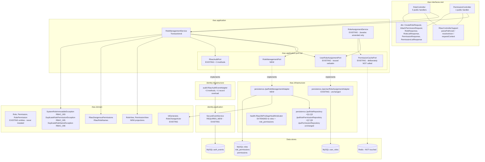
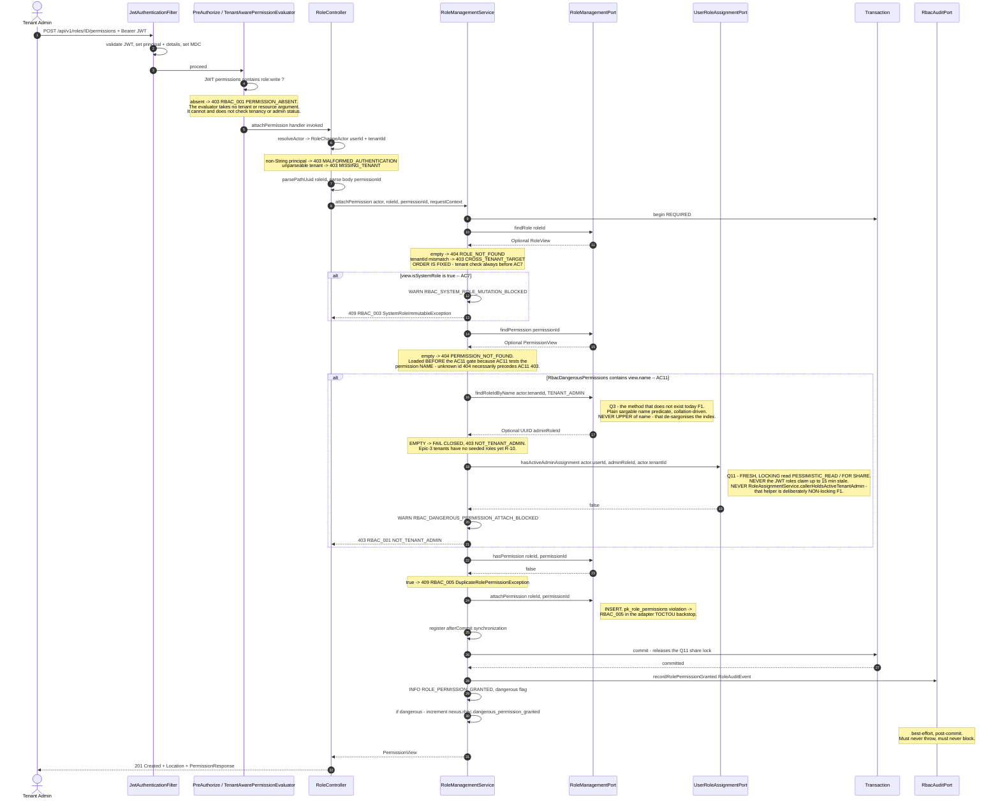
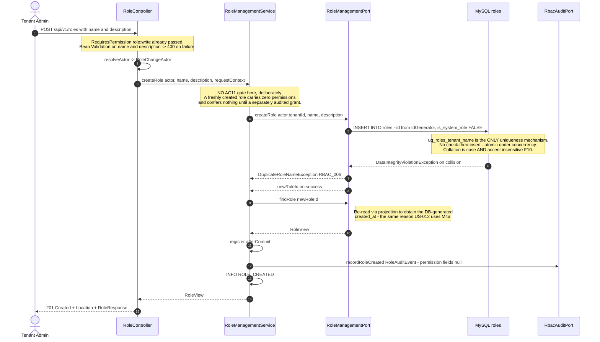
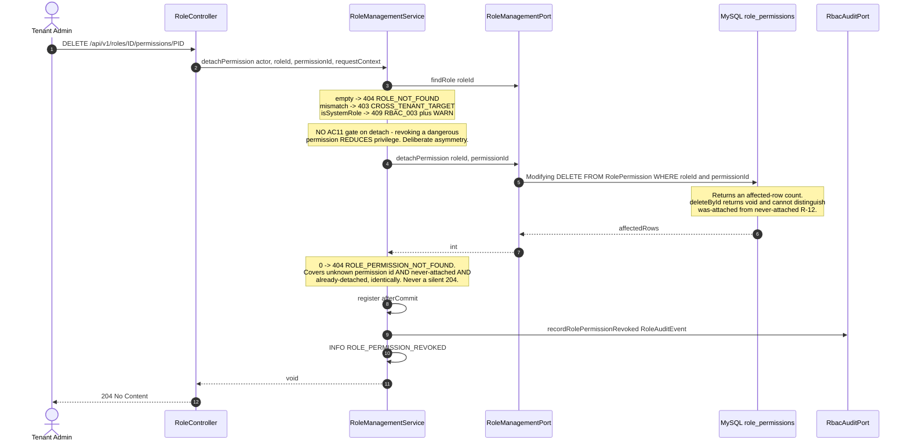
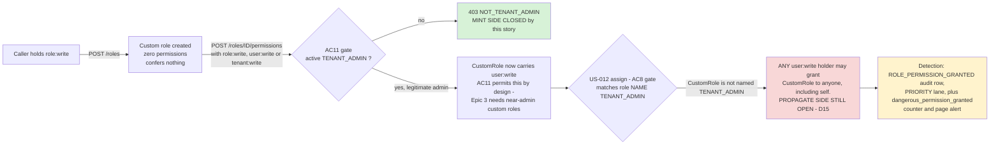

# US-015 — Solution Design: Enable role and role-permission management API

**Feature:** Enable role and role-permission management API
**Epic:** EPIC-002 (RBAC Foundation)
**Phase:** 3 (Solution Design) — Gate 2, Step A
**Author:** Principal Architect
**Status:** Revised after threat-model review (`03b-threat-model.md`, Step B). Resolves findings RC-1 through RC-7 (see "Threat-model resolutions" below §0). Pending re-review and Gate 2 approval.

**Inputs (settled; not re-litigated):**
- `docs/story/2-rbac/US-015.md` — authoritative AC1–AC12 (per requirements §11 OQ3).
- `docs/features/US-015/01-requirements.md` — Gate 1 approved; §11 Resolutions OQ1–OQ6 binding.
- `docs/features/US-015/02-impact.md` — Phase 2. §13 risks R-1…R-14 and §14's fourteen open items are this document's mandate.

This document's job is to **close §14's fourteen open items**, make an explicit decision on **R-3** (residual propagate-side escalation), and emit the concrete artifacts `/breakdown` needs: port signatures, query shapes, API contracts, error table, observability plan, and a rollout plan.

---

## 0. Decision summary

| # | Open item (`02-impact.md` §14) | Decision | Deviates from the impact-analysis recommendation? |
|---|---|---|---|
| **D1** | New port name/surface | One `rbac.application.port.out.RoleManagementPort`. Not a split; **not** a widening of `UserRoleAssignmentPort`. Returns `RoleView`/`PermissionView` projections, **never the `Role` entity**. §4.3 | No on the single port; **extends** the recommendation by banning entity return types (closes R-6 by construction) |
| **D2** | AC12 audit carrier | New `RoleAuditEvent(tenantId, roleId, roleName, permissionId, permissionName, actorUserId, requestContext)`. **No `targetUserId` field.** 3 new methods on the existing `RbacAuditPort`. `auth_events.user_id` left `NULL`. §6.1–§6.3 | No |
| **D3** | AC9 error code | **`RBAC_006`**, carried by `DuplicateRoleNameException`. Registered in the exception class + a **new error-code register table in `SECURITY.md` §3.1** (the missing register is what caused F4). §8.5 | No on the code; adds the register so the next story cannot repeat F4 |
| **D4** | `parsePathUuid`/`resolveActor` placement | Extract to package-private `rbac.interfaces.rest.RbacControllerSupport`; **migrate `UserRoleController` onto it in the same change**, with its existing tests as the unmodified regression gate. Never `common.web`. §4.1 | No on the location; adds the US-012 migration (with an explicit abort condition) |
| **D5** | Response DTO fields | `RoleResponse{id, name, description, isSystemRole, createdAt}`; `PermissionResponse{id, name, description}`. `isSystemRole` **exposed**. `{"data":[…]}` envelope on all three list endpoints. §8.1–§8.4 | No |
| **D6** | `name`/`description` validation | `name`: `@NotBlank @Size(max=64) @Pattern("^[A-Za-z0-9][A-Za-z0-9 ._-]*$")`, no trimming. `description`: optional, `@Size(max=255)`, control characters rejected. §8.1 | Sharpens it — the pattern is the concrete answer to "allowed-character policy is genuinely open", and it kills the trailing-space lookalike vector (§6.5) |
| **D7** | `AuthEventType.PRIORITY` membership | `ROLE_PERMISSION_GRANTED` / `ROLE_PERMISSION_REVOKED` **IN**; `ROLE_CREATED` **OUT** (STANDARD). Lane grows 6 → 8. §6.4 | No — ratified against the enum's own cost-and-uniqueness criterion |
| **D8** | `@RequiresPermission` ArchUnit rule | **Yes.** Three rules: annotated methods must be `public` and non-`final`; their declaring classes must be non-`final`; `RoleManagementService` must never call the non-locking admin-check helper (RC-5a, added Gate 2 Step B). §7.2 | No; adds the declaring-class rule (CGLIB cannot subclass a final class) and the RC-5a call-ban rule |
| **D9** | Extend `RbacDbPrivilegeHealthIndicator` | **Yes.** Generalise to a per-table expectation set covering `user_roles`, `roles`, `role_permissions`, including a `COLUMN_PRIVILEGES` check so a column-scoped `UPDATE` on `roles` cannot hide. §9.5 | No; adds the `COLUMN_PRIVILEGES` leg |
| **D10** | Stale JaCoCo exclusion on `*.rbac.infrastructure.persistence` | **Remove it.** §11.3 | No |
| **D11** | `GET /roles` unbounded list | **Document, do not paginate.** Deterministic `ORDER BY name`; envelope keeps `page`/`links` additive. Revisit trigger recorded. §8.2 | No |
| **D12** | Observability | WARN on AC7 blocks and on AC11 denials (service-level, with resource context); 3 INFO success events; new `nexus.rbac.dangerous_permission_granted{permission}` counter **and, added at Gate 2 Step B, `nexus.rbac.self_role_assignment` in `RoleAssignmentService.assign()` (RC-7)**; **no priority-lane threshold change**, plus a panel and a review trigger. §9 | Extends — the two counters together are the compensating control that makes the R-3 acceptance defensible; the mint-side counter alone was found insufficient at Step B |
| **D13** | `RoleAssignmentService` M-3 Javadoc | Amend, do not delete. Exact replacement text in §10.3 | No |
| **D14** | Re-estimation | **13 points** (informational). §12.4 | No |
| **D15** | *(R-3, Gate 2 owns)* Propagate-side escalation | **Accept as a documented residual risk (option a).** Forward-track to a new story with a specified fix; add a real-time detection control (D12's counter) and a threat-model entry with an owner. §10 | Answers the question the impact analysis deliberately left to Gate 2 |
| **D16** | *(derived)* Rollback semantics | Flag-off is **not** a privilege rollback — custom roles already granted stay effective. Manual remediation path documented. §12.3 | New — corrects an assumption inherited from US-012's "trivially reversible" |

### 0.1 Threat-model resolutions (Gate 2 Step B → this revision)

`03b-threat-model.md` returned a conditional pass with 7 required design changes. All 7 are resolved in this revision:

| # | Finding | Resolution | Where |
|---|---|---|---|
| RC-7 | D15's compensating control (`dangerous_permission_granted`) only detects the mint step, not exploitation | New exploitation-side signal: `nexus.rbac.self_role_assignment` counter, emitted unconditionally from `RoleAssignmentService.assign()`'s existing post-commit block when `actorUserId == targetUserId` — no new query. Alert composes it with the mint-side counter to escalate to page for tenants where both have fired | §9.2, §9.3, §10.2 |
| RC-5 | Three enforcement gaps: no mechanical ban on the non-locking read shortcut; `MEMBER` unmentioned despite AC7 being its sole gate; D8's "split if unavailable" escape hatch | New ArchUnit rule banning `RoleManagementService` from calling the non-locking helper; explicit `MEMBER` coverage added to §1 and a named security test scenario; escape hatch removed, replaced with a pre-merge version-compatibility check | §7.2, §8.6, §11.2 |
| RC-1 | No reservation of system role names at creation → permanent, unremediable tenant DoS if a name collision is ever created | Application-layer reserved-name check on `createRole`, independent of whether a colliding system role currently exists in the tenant; new `RBAC_007` | §8.1, §8.5 |
| RC-2 | AC10 staleness window understated as ~15 min; actual is ~30 min (cache TTL + token lifetime); no immediate-effect path documented | Corrected wording throughout; immediate-effect path (revoke the assignment, not the permission) documented | §5.5, §9.6, §11.2, §12.5 |
| RC-4 | No per-tenant role cap; unbounded `GET /roles` response; no cleanup path | Hard-enforced, configurable cap at creation (`nexus.rbac.max-roles-per-tenant`, default 500), not just a documented ceiling | §8.2, §11.2 |
| RC-6 | D16 rollback remediation missing from the residual-risk table; its step 3 has no reverse (role → users) lookup | Added as RES-9; remediation step 3 corrected to route through a new lookup rather than an assumed reverse index | §12.3, §12.5 |
| RC-3 | `description`'s control-character filter doesn't exclude U+2028/U+2029; "never logged/audited" invariant undocumented as a testable requirement | Pattern broadened; invariant called out explicitly as a required test | §8.1, §11.2 |

**No Flyway migration.** Confirmed against `02-impact.md` §2.1 — `V5__rbac_schema.sql` already carries every table, column, constraint and index. ADR-0003's append-only rule is not engaged. **No `nexus_app` grant change** (§2.4 of the impact analysis, re-confirmed in §5.3 below). **No new dependency. No frontend file.**

**ADR required? No.** Every decision here encodes an already-accepted position: ADR-0002 (hexagonal), ADR-0005 (UUIDv7), ADR-0011 §1 (audit lanes), ADR-0013 D1/D2/D3/**D4 (cache fan-out — ratified, not reopened)**, ADR-0014 D5/D6, ADR-0015 D7/D8, ADR-0016 D3/D4/D6, plus Gate 1 Resolutions OQ1–OQ6. The D8 ArchUnit rule encodes an existing `SECURITY.md` §3.1 rule rather than creating one.

> **Conditional ADR trigger:** if Gate 2 review rejects **D15** and expands scope to gate `RoleAssignmentService.assign()`/`revoke()` on privilege-carrying roles, that changes the authorization contract of a **shipped, flag-enabled** API. That requires an ADR *and* a Gate 1 reopen on US-012 — it is not a Gate 2 improvisation. See §10.2.

---

## 1. Overview and goals

US-015 completes the `rbac` bounded context's CRUD lifecycle: six endpoints letting a tenant administrator create custom roles and attach/detach permissions to them, within their own tenant, with the two seeded system roles immutable through this API.

**RC-5b — `MEMBER` is explicitly in scope of "the two seeded system roles", not an unstated afterthought.** US-009 seeds `MEMBER` with `is_system_role = TRUE`, identically to `TENANT_ADMIN`. This means AC7 — not AC11 — is what stands between a `role:write` holder and attaching `role:write`/`user:write`/`tenant:write` to `MEMBER`, the role every self-registered user in the tenant already holds: AC7's is_system_role check runs first in the check ordering (§8.6) and returns 409 before AC11 is ever reached, for `MEMBER` exactly as it does for `TENANT_ADMIN`. This was true of the design from the start, but naming only `TENANT_ADMIN` in the ACs and test scenarios left it implicit — meaning AC7 alone, undocumented as MEMBER's specific protection, carries the entire cost of a mistake here (a bypassable AC7 would let a `role:write` holder grant every current and future self-registered user in the tenant a dangerous permission through their own default role, with no AC11 admin gate to catch it, since AC11 only fires on non-system roles). §8.6 and §11.2 now name `MEMBER` explicitly rather than relying on generic "system role" coverage to include it by accident.

Goals, in priority order:

1. **Be the mint-side control for the M-3 / T-E1 escalation chain.** AC11 is the only thing between a `role:write` holder and a role carrying `role:write`/`user:write`/`tenant:write`. `TenantAwarePermissionEvaluator` compares nothing but flat JWT `permissions[]` membership — AC7, AC8, AC9 and AC11 are **entirely** service-layer logic in `RoleManagementService`.
2. **Make AC11's mechanism actually work.** The impact analysis's F1 is the story's single most likely silent failure: the port method AC11 names needs a role id no existing query can produce, and the one helper that looks reusable is a deliberately non-locking read. §5.2 pins this.
3. **Give role changes an audit trail that is structurally honest.** AC12's payloads do not fit `RbacAuditEvent`; forcing them in would corrupt US-012/US-014 field semantics that `RoleAssignmentAuditIT` asserts on. §6 designs a second carrier instead.
4. **Record what this story does not close.** AC11 closes minting a dangerous role. It does not close propagating one. §10 makes that an owned, detected, forward-tracked residual — not a silently discharged Javadoc note.
5. **Add nothing to the platform.** Zero migrations, zero grants, zero dependencies, zero frontend files, zero breaking changes.

**Non-goals, restated:** role deletion, role update, bulk permission assignment, role templates/cloning, the Epic 3 UI (story Out of Scope); pagination (D11); bulk cache invalidation (ADR-0013 D4); a denial-event audit row (§6.5); rate limiting (no epic requirement, no cross-cutting limiter exists).

---

## 2. Architecture



**Dependency direction is unchanged and still acyclic.** `rbac` declares `RoleManagementPort` and the widened `RbacAuditPort`; `identity.infrastructure` implements the latter. Every cross-context `implements` edge points **from `identity.infrastructure` into `rbac.application.port.out`** — never the reverse. `HexagonalArchitectureTest#rbac_must_not_depend_on_identity` makes this mechanical. US-015 adds **no new cross-context edge**; it thickens the existing one (the adapter now implements 6 port methods instead of 3).

**Redis is deliberately not a participant.** ADR-0013 D4 ratified option (b): no bulk cache fan-out on role-permission edits. `RoleManagementService` does **not** inject `PermissionCachePort`. This is a decision, not an omission — see §5.5 for the corrected staleness window an operator must know.

**Where the lock sits relative to the second connection.** AC11's `FOR SHARE` read (§5.2, Q11) is taken inside the write transaction. The audit write is `REQUIRES_NEW` on a second pooled connection and fires **after commit** via `registerPostCommitSideEffects` — so, as in US-012 D14, no row lock is ever held while waiting on a second connection. This is closed by construction, not by monitoring.

---

## 3. Sequence diagrams

### 3.1 `POST /api/v1/roles/{roleId}/permissions` — the AC7 / AC11 / AC12 flow

This is the story's critical path: it is the only endpoint carrying AC7, AC8, AC11 and AC12 simultaneously.



### 3.2 `POST /api/v1/roles` — AC1 / AC9 / AC12



### 3.3 `DELETE /api/v1/roles/{roleId}/permissions/{permissionId}` — AC5 / AC7 / AC12



### 3.4 The M-3 escalation chain — what AC11 closes and what it does not (R-3 / D15)



---

## 4. Component design

Package layout follows the verified convention: controllers directly in `interfaces/rest/`, records in `interfaces/rest/dto/`, ports in `application/port/out/`, adapters in `infrastructure/persistence/`.

### 4.1 `rbac.interfaces.rest.RoleController` / `PermissionController` / `RbacControllerSupport`

**Two controllers, not one** (D-from-impact §1.3): the path roots differ (`/api/v1/roles` vs `/api/v1/permissions`), and a single controller would need method-level absolute paths, which no existing controller does. **Both are gated on the same flag.**

```java
@RestController
@RequestMapping("/api/v1/roles")
@ConditionalOnProperty(name = "feature.nexus-us015-rbac-role-management.enabled", havingValue = "true")
@Tag(name = "Role Management", description = "Tenant-scoped role and role-permission management")
public class RoleController {

  public RoleController(RoleManagementService roleManagementService);

  @PostMapping @ResponseStatus(HttpStatus.CREATED) @RequiresPermission("role:write")
  public ResponseEntity<RoleResponse> createRole(
      @Valid @RequestBody CreateRoleRequest request, Authentication authentication,
      HttpServletRequest httpRequest);

  @GetMapping @RequiresPermission("role:read")
  public RoleListResponse listRoles(Authentication authentication);

  @GetMapping("/{roleId}/permissions") @RequiresPermission("role:read")
  public PermissionListResponse listRolePermissions(
      @PathVariable String roleId, Authentication authentication);

  @PostMapping("/{roleId}/permissions") @ResponseStatus(HttpStatus.CREATED) @RequiresPermission("role:write")
  public ResponseEntity<PermissionResponse> attachPermission(
      @PathVariable String roleId, @Valid @RequestBody AttachPermissionRequest request,
      Authentication authentication, HttpServletRequest httpRequest);

  @DeleteMapping("/{roleId}/permissions/{permissionId}") @ResponseStatus(HttpStatus.NO_CONTENT)
  @RequiresPermission("role:write")
  public void detachPermission(
      @PathVariable String roleId, @PathVariable String permissionId,
      Authentication authentication, HttpServletRequest httpRequest);
}

@RestController
@RequestMapping("/api/v1/permissions")
@ConditionalOnProperty(name = "feature.nexus-us015-rbac-role-management.enabled", havingValue = "true")
public class PermissionController {
  @GetMapping @RequiresPermission("role:read")
  public PermissionListResponse listPermissions();
}
```

Hard constraints, each traceable to a risk:

- **Every handler is `public` and non-`final`, and neither class is `final` (R-5).** US-015 quadruples this context's annotated-handler count (2 → 8). D8's ArchUnit rules convert this from a Javadoc convention into a build failure. Per-endpoint negative-control 403 tests remain mandatory regardless — ArchUnit catches the visibility trap, not a mis-typed permission string.
- **The controllers are the only place that touches `Authentication` (T-E10).** They unwrap into `RoleChangeActor` and pass plain `UUID`/`String`/`RequestContext`. `RoleManagementService` must not name any `org.springframework.security` type, or `domain_and_application_must_not_depend_on_spring_security` fails.
- **Path and body UUIDs are `String`, validated then parsed.** A `UUID`-typed `@PathVariable` raises `MethodArgumentTypeMismatchException`, which `GlobalExceptionHandler` (a plain `@RestControllerAdvice`) does not handle → **500 instead of 400** on the platform's role-definition surface.
- **`PermissionController#listPermissions()` takes no `Authentication`** — the permission catalogue is global (no `tenant_id` column on `permissions`) and fully published to every `role:read` holder by AC6. Adding an unused actor parameter would imply a tenant scoping that does not exist.

**D4 — `RbacControllerSupport`.** A package-private final class in `rbac.interfaces.rest` holding static `parsePathUuid(String, String)`, `resolveActor(Authentication, String)` and `requestContext(HttpServletRequest)`.

- **Why extract at all:** three copies of a *fail-closed security helper* is the failure mode. `resolveActor` encodes three distinct fail-closed branches (`MALFORMED_AUTHENTICATION` on a non-`String` principal, `MALFORMED_AUTHENTICATION` on a non-UUID principal, `MISSING_TENANT` on an unparseable tenant). Divergence between copies is invisible until one of them is the one that fails open.
- **Why `rbac.interfaces.rest`, not `common.web`:** `rbac_must_not_depend_on_identity`'s own `because(...)` clause warns that a shared helper in a neutral `common.*` package recreates cross-context coupling **with the rule green**. Keeping the helper inside `rbac.interfaces.rest` keeps it visible to the rule's intent and to human review.
- **Why migrate `UserRoleController` too:** leaving US-012's private copies means two implementations of the same fail-closed logic from day one. The migration is a pure move with no behaviour change.
- **Abort condition (explicit, for `/breakdown`):** if migrating `UserRoleController` requires editing *any* existing assertion in `UserRoleControllerTest` or `RoleAssignmentSecurityIT`, stop and duplicate instead. A required test edit means the move was not behaviour-preserving, and US-012's shipped 403 contract outranks this story's tidiness.

### 4.2 `rbac.application.RoleManagementService`

```java
@Service
public class RoleManagementService {

  public RoleManagementService(
      RoleManagementPort roleManagementPort,
      UserRoleAssignmentPort userRoleAssignmentPort,   // AC11 only: hasActiveAdminAssignment
      RbacAuditPort rbacAuditPort);
  // Deliberately NOT injected: PermissionCachePort (ADR-0013 D4), UserDirectoryPort (no target user).

  /** AC1, AC9, AC12. Returns the created role including its DB-generated createdAt.
   *  Before insert: rejects a name matching RbacRoleNames case-insensitively (RC-1,
   *  ReservedRoleNameException / RBAC_007), and rejects if the tenant already holds
   *  nexus.rbac.max-roles-per-tenant active roles, default 500 (RC-4, Q12,
   *  RoleLimitExceededException / RBAC_008). */
  @Transactional
  public RoleView createRole(RoleChangeActor actor, String name, String description, RequestContext ctx);

  /** AC2, AC8. Tenant-scoped by predicate, ordered by name. */
  @Transactional(readOnly = true)
  public List<RoleView> listRoles(RoleChangeActor actor);

  /** AC3, AC8. 404 then 403; empty list is a valid 200. */
  @Transactional(readOnly = true)
  public List<PermissionView> listRolePermissions(RoleChangeActor actor, UUID roleId);

  /** AC4, AC7, AC8, AC11, AC12. The story's security-critical path. */
  @Transactional
  public PermissionView attachPermission(RoleChangeActor actor, UUID roleId, UUID permissionId, RequestContext ctx);

  /** AC5, AC7, AC8, AC12. No AC11 gate — detaching reduces privilege. */
  @Transactional
  public void detachPermission(RoleChangeActor actor, UUID roleId, UUID permissionId, RequestContext ctx);

  /** AC6. Global catalogue, no tenant scoping — permissions has no tenant_id column. */
  @Transactional(readOnly = true)
  public List<PermissionView> listAllPermissions();
}
```

**Responsibility boundary.** `RoleManagementService` owns **all authorization semantics `@RequiresPermission` cannot express** — tenant equality (AC8), system-role immutability (AC7), the dangerous-permission admin gate (AC11) — plus post-commit side-effect orchestration. It owns no SQL, no HTTP, no Spring Security, no Redis.

**Design invariant, self-policed (mirroring `RoleAssignmentService`'s):** every public method accepts only `RoleChangeActor`, `UUID`, `String` and `RequestContext`. Never `Authentication`, `Principal`, `Map`, or `AuthenticatedRequestDetails`. `rbac_application_methods_must_not_accept_principal_or_map` catches the last two; the first two are caught structurally; `String`/`UUID` discipline is self-policed.

**Single shared guards, not per-endpoint copies** (story risk R9's own mitigation): one private `resolveRoleInTenant(roleId, actor, permission)` producing the 404/403/`RoleView`, and one private `requireMutableRole(view)` producing the 409. Both write endpoints call both. There is no path to a `role_permissions` write that bypasses either.

### 4.3 `rbac.application.port.out.RoleManagementPort` (D1)

**One port, not a split, and not a widening of `UserRoleAssignmentPort`.**

- *Not a widening:* that port's Javadoc scopes itself to the assignment aggregate, and `RoleAssignmentService`, `RoleAssignmentServiceTest` and `JpaUserRoleAssignmentAdapterTest` all depend on its current surface. Widening it leaks role-CRUD capability into a collaborator that has no business with it (requirements R7).
- *Not a split (rejected alternative):* splitting into `RolePort` / `RolePermissionPort` / `PermissionCatalogPort` would encode "permissions are read-only" (ADR-0013 D1) in the type system. Rejected: there is exactly **one** consumer (`RoleManagementService`), **one** implementor (`JpaRoleManagementAdapter`), **one** transaction, and no independent lifecycle. Three interfaces and three mocks for one collaborator is machinery with no user. The read-only-ness of `permissions` is expressed instead by the port simply having no write method for it — enforcement by omission, which is stronger than validation.

```java
public interface RoleManagementPort {

  // --- roles ---------------------------------------------------------------
  /** AC1. Inserts a role with is_system_role = FALSE and an IdGenerator-supplied UUIDv7;
   *  returns its id. Implementations translate the uq_roles_tenant_name violation into
   *  DuplicateRoleNameException (RBAC_006) so a concurrent duplicate yields 409, not 500. */
  UUID createRole(UUID tenantId, String name, String description);

  /** Q2 — role by id as a PROJECTION, never a managed Role entity (R-6). One read serves the
   *  404, the 403 and the AC7 is_system_role boolean. */
  Optional<RoleView> findRole(UUID roleId);

  /** Q1 — AC2. All roles in a tenant, ORDER BY name for a stable unpaginated contract (D11).
   *  Served by uq_roles_tenant_name's leftmost tenant_id prefix — no new index. */
  List<RoleView> findRolesInTenant(UUID tenantId);

  /** Q3 — AC11, and the method F1 says does not exist today. Resolves the tenant's admin role
   *  id by (tenantId, name). MUST use a plain `r.name = :name` predicate and rely on
   *  utf8mb4_0900_ai_ci for case-insensitivity, so uq_roles_tenant_name is used as an index.
   *  MUST NOT wrap the column in UPPER() — that de-sargonises AC11's write hot path.
   *  Returns the id only, never the entity. Empty ⇒ the caller MUST fail closed (R-10). */
  Optional<UUID> findRoleIdByName(UUID tenantId, String name);

  /** Q12 — RC-4's per-tenant cap check. Count of active roles in the tenant, served by
   *  uq_roles_tenant_name's leftmost prefix — same index as Q1, no new cost. */
  long countRolesInTenant(UUID tenantId);

  // --- permissions (read-only, ADR-0013 D1) --------------------------------
  /** Q4 — AC4's 404 and AC11's name lookup, served by one PK read. */
  Optional<PermissionView> findPermission(UUID permissionId);

  /** Q5 — AC6. All 7 seeded permissions, ORDER BY name. Deliberately NOT cached (§5.6). */
  List<PermissionView> findAllPermissions();

  // --- role_permissions ----------------------------------------------------
  /** Q7 — AC3. A SINGLE projection join RolePermission -> Permission. The naive findAll plus
   *  per-row findById is the N+1 in impact §7. Bounded at |permissions| = 7. */
  List<PermissionView> findPermissionsForRole(UUID roleId);

  /** Q8 — AC4's common-path 409. Kept ALONGSIDE the adapter's constraint translation:
   *  the pre-check gives the clean 409, the translation covers the concurrent-attach race. */
  boolean hasPermission(UUID roleId, UUID permissionId);

  /** Q10 — AC4. Inserts the join row. Implementations translate the pk_role_permissions
   *  violation into DuplicateRolePermissionException (RBAC_005). */
  void attachPermission(UUID roleId, UUID permissionId);

  /** Q9 — AC5 plus Gate 1 OQ5c. MUST be a @Modifying bulk DELETE returning an affected-row
   *  count: deleteById returns void and cannot distinguish "was attached" from "never
   *  attached", which is exactly the distinction the 404-not-204 resolution requires.
   *  RolePermission has no @Version, so this int count IS the concurrency guard. */
  int detachPermission(UUID roleId, UUID permissionId);
}
```

**Why projections everywhere, deviating from `UserRoleAssignmentPort#findRole` returning `Role`.** `Role` maps `tenantId`, `name`, `description`, `systemRole` as plain updatable columns, and `nexus_app` holds **`SELECT, INSERT` on `roles` and no `UPDATE` at all**. Any accidental dirty-flush on a loaded `Role` — even a "harmless" `setDescription` — issues an `UPDATE` that MySQL rejects **in production only**, because every `*IT` connects as the Testcontainers `test` superuser (R-6, the same failure class as US-012's R-1 through a different table). US-012 could return the entity safely because it never wrote to `roles`; **US-015 is the story that makes `roles` a write target**. Returning `RoleView` removes the footgun by construction rather than by discipline. `UserRoleAssignmentPort#findRole` is left unchanged — narrowing it is out of scope and would churn US-012's tests.

### 4.4 New domain types

```java
// rbac/domain/RoleView.java — projection; serves both the port and the 201/200 bodies
public record RoleView(UUID id, UUID tenantId, String name, String description,
                       boolean systemRole, Instant createdAt) {}

// rbac/domain/PermissionView.java — one record serves AC3 (role's permissions) and AC6 (catalogue).
// Deliberately ONE type, not the impact analysis's separate RolePermissionView: the field set is
// identical and the two endpoints return the same shape, so a second record would be a synonym.
public record PermissionView(UUID id, String name, String description) {}

// rbac/domain/RbacDangerousPermissions.java — AC11's fixed set, single-sourced
public final class RbacDangerousPermissions {
  public static final Set<String> NAMES = Set.of("role:write", "user:write", "tenant:write");
  public static boolean contains(String permissionName);   // null-safe, case-insensitive
  private RbacDangerousPermissions() {}
}

// rbac/domain/SystemRoleImmutableException.java     — RBAC_003, extends ConflictException
// rbac/domain/DuplicateRolePermissionException.java — RBAC_005, extends ConflictException
// rbac/domain/DuplicateRoleNameException.java       — RBAC_006, extends ConflictException
// rbac/domain/ReservedRoleNameException.java        — RBAC_007, extends ConflictException (RC-1)
// rbac/domain/RoleLimitExceededException.java       — RBAC_008, extends ConflictException (RC-4)
```

**`RbacDangerousPermissions` is a domain class, not a private `Set` in the service.** A private field would hide a security-load-bearing constant from targeted unit testing; a domain class gets its own test under the 0.90 `*.domain.*` gate. It must be a `Set`/`List`, **never a `Map`** — `rbac_application_methods_must_not_accept_principal_or_map` bans `Map` parameters anywhere in `..rbac.application..`.

**`contains` is case-insensitive**, mirroring `RbacRoleNames`' documented rationale: `permissions.name` also lives under `utf8mb4_0900_ai_ci`. Names are code-seeded lowercase today, so this is defence in depth against a future seeding change, not a live requirement.

**All five exceptions carry fixed static literal messages** and must never be constructed from a caught `DataIntegrityViolationException`'s text — `GlobalExceptionHandler#handleConflict` echoes `getMessage()` verbatim into the client-visible RFC 7807 body, and MySQL's messages would leak constraint names and hex-encoded UUIDs. This is `DuplicateRoleAssignmentException`'s documented discipline, copied verbatim.

`DuplicateRoleNameException`'s message must not over-promise (F10/R-14): `uq_roles_tenant_name` under `utf8mb4_0900_ai_ci` is **accent-insensitive as well as case-insensitive** — `Rôle` collides with `role`. Message: *"A role with this name already exists in this tenant"* — accurate at any collation, promising nothing about matching rules.

### 4.5 `rbac.infrastructure.persistence.JpaRoleManagementAdapter`

A `@Component` implementing `RoleManagementPort` over `JpaRoleRepository` + `JpaRolePermissionRepository` + `JpaPermissionRepository`, plus `IdGenerator` (id generation stays in the adapter, matching `JpaUserRoleAssignmentAdapter`'s precedent). Its one non-mechanical responsibility is **constraint-violation translation**:

| Caught | Translated to | Consequence if mistranslated |
|---|---|---|
| `DataIntegrityViolationException` on `createRole` | `DuplicateRoleNameException` (409, `RBAC_006`) | AC9 returns **500** instead of 409 |
| `DataIntegrityViolationException` on `attachPermission` | `DuplicateRolePermissionException` (409, `RBAC_005`) | Concurrent duplicate attach returns **500** |

`JpaUserRoleAssignmentAdapter`'s own comment already warns that a mistranslation surfaces as a 500 rather than a clean 409. These are the branches that D10's JaCoCo-exclusion removal exists to cover.

---

## 5. Database design

### 5.1 Migration: none — confirmed

`V5__rbac_schema.sql` already carries every table, column, constraint and index this story needs, verified table by table in `02-impact.md` §2.1: `roles` (incl. `description VARCHAR(255) NULL`, `is_system_role BOOLEAN NOT NULL DEFAULT FALSE`, `uq_roles_tenant_name`), `permissions` (incl. `description NOT NULL`, `uq_permissions_name`), `role_permissions` (`pk_role_permissions (role_id, permission_id)` + both FKs), `auth_events` (`event_type VARCHAR(64)`, `metadata JSON`).

**Schema diff: empty.** No table, column, index, constraint or trigger is added or altered. ADR-0003's append-only rule is not engaged. If any reviewer disagrees on a point, the fix is a new `V6__*.sql` — **never** an edit to `V5`.

`RbacSchemaMigrationIT#should_createExpectedColumns_…` uses `containsExactly(...)` and would break on an added column; `should_createExpectedIndexes_…` uses `contains(...)` and would survive an added index. Neither is triggered.

### 5.2 The queries

Exact JPQL is `/breakdown`'s job; the shape, the driving predicate and the index are pinned here.

| # | Repository | Shape | Driving predicate | Index | AC |
|---|---|---|---|---|---|
| Q1 | `JpaRoleRepository` | Projection `SELECT new RoleView(...) … WHERE r.tenantId = :t ORDER BY r.name` | `roles.tenant_id` | `uq_roles_tenant_name` leftmost prefix | AC2 |
| Q2 | `JpaRoleRepository` | Projection by id | PK | `pk_roles` | AC3/4/5/7/8 |
| **Q3** | `JpaRoleRepository` | `SELECT r.id … WHERE r.tenantId = :t AND r.name = :name` | `(tenant_id, name)` | `uq_roles_tenant_name` **full key** | **AC11** |
| Q4 | inherited `findById` → projection | by id | PK | `pk_permissions` | AC4 + **AC11** |
| Q5 | inherited `findAll(Sort.by("name"))` → projection | none | 7-row scan | — | AC6 |
| Q7 | `JpaRolePermissionRepository` | **Single** projection join `RolePermission rp JOIN Permission p ON p.id = rp.id.permissionId WHERE rp.id.roleId = :r ORDER BY p.name` | `role_permissions.role_id` | `pk_role_permissions` leftmost prefix, then PK join | AC3 |
| Q8 | inherited `existsById(RolePermissionId)` | PK probe | full composite PK | `pk_role_permissions` | AC4 |
| **Q9** | `JpaRolePermissionRepository` | `@Modifying @Query("DELETE FROM RolePermission rp WHERE rp.id.roleId = :r AND rp.id.permissionId = :p") int` | full composite PK | `pk_role_permissions` | AC5 |
| Q4 (reused) | `JpaPermissionRepository` (via `findPermission`, already Q4 above) | On `detachPermission`'s **success path only** (`Q9`'s affected-row count `> 0`), one additional `findPermission` read to populate `permissionName` for the audit/log payload — not a gate, purely enrichment. **Corrects an omission in this table:** AC12's text requires `permission_name` for revoke as well as grant; §9.2's field list already implied it ("as above minus `dangerous`") but this table originally listed only Q2+Q9 for AC5, with no query that returns a name | — | AC5, AC12 |
| Q10 | inherited `save` | INSERT | — | — | AC1, AC4 |
| **Q11** | *existing* `UserRoleAssignmentPort#hasActiveAdminAssignment` | `@Lock(PESSIMISTIC_READ)` → `FOR SHARE` | `user_roles.user_id` | implicit FK auto-index | **AC11** |
| **Q12** | `JpaRoleRepository` | `SELECT COUNT(r) … WHERE r.tenantId = :t` (RC-4) | `roles.tenant_id` | `uq_roles_tenant_name` leftmost prefix — same index as Q1, no new cost | AC1 (cap) |

**No new index is required.** Every driving predicate is served by an existing PK or unique key (verified plan-by-plan in `02-impact.md` §2.2).

> **F1, as the binding design constraint.** **AC11 is `Q3 → Q11`, in that order, inside the write transaction.** `RoleAssignmentService.callerHoldsActiveTenantAdmin` (lines 298–303) looks like a ready-made helper and **is not**: its own Javadoc states it deliberately uses a plain, non-locking projection read because it only decides whether to redact one response field. Gate 1 requires AC11 to be a *fresh, locking* read. **Copying that helper satisfies AC11's letter and destroys its point, with no failing test.** `/breakdown` must carry an IT that revokes the caller's admin assignment in a concurrent transaction — that is the only test that distinguishes the two.

> **Q11's lock scope is safe.** It drives off `user_roles.user_id`, so the lock set is one user's handful of rows. This is materially unlike US-012's F3 hazard, which came from driving off the unindexed `tenant_id`.

> **Q3 must stay sargable.** Do **not** copy `JpaUserRoleRepository#findTenantsWithZeroActiveAssignmentsForRole`'s `UPPER(r.name) = UPPER(:roleName)` shape — that query is documented as a health-check-cadence, non-hot-path query, and the `UPPER()` wrapper makes the indexed column non-sargable. AC11 sits on a write hot path. An optional `EXPLAIN`-asserting IT pinning Q3's plan to `uq_roles_tenant_name` is recommended in `/breakdown`.

### 5.3 Constraints, concurrency, and grants

Both uniqueness rules are enforced by **constraint-violation translation, never check-then-insert** (Gate 1 edge cases 9 and 10; ADR-0013 D2's rationale):

| Constraint | Violation → | Concurrency behaviour |
|---|---|---|
| `uq_roles_tenant_name (tenant_id, name)` | `DuplicateRoleNameException` → 409 `RBAC_006` | Two concurrent creates of the same name: exactly one 201, one 409, atomically |
| `pk_role_permissions (role_id, permission_id)` | `DuplicateRolePermissionException` → 409 `RBAC_005` | Q8's pre-check handles the common path; the translation is the TOCTOU backstop |

**Grants: no change, confirmed.** Verified identical in all three provisioning artifacts (`nexus-database/mysql/init/02-grants-post-schema.sql`, `TestcontainersConfiguration`'s `AFTER_MIGRATE` callback, and `docs/runbooks/nexus-app-provisioning.md`). Every statement all six endpoints plus AC11 and AC12 issue is already permitted, including `SELECT … FOR SHARE` on `user_roles` (empirically proven by `UserRolesPrivilegeIT`, which already executes a `FOR UPDATE` as `nexus_app`).

Two grant-adjacent constraints this design inherits and must honour:

1. **`nexus_app` has no `UPDATE` on `roles`.** That is genuine defence-in-depth for AC7 — role renames and `is_system_role` flips are unexecutable below the application layer. It is also why D1 returns projections: an accidental dirty-flush would fail in production only.
2. **`role_permissions` has `INSERT` and `DELETE` and no soft-delete column or trigger.** So for the two write endpoints, **AC7 is a pure application-layer control with no DB backstop.** This is the concrete reason D8's ArchUnit rules and per-endpoint negative-control tests matter more here than they did in US-012.

### 5.4 JPA entity sketch — no entity changes

`Role`, `Permission`, `RolePermission` and `RolePermissionId` are **unchanged**. For reference, the mappings this design depends on (all already shipped and round-trip-proven by `RbacRepositoryRoundTripIT`):

```java
@Entity @Table(name = "roles")
class Role {
  @Id @Column(name = "id", columnDefinition = "BINARY(16)") UUID id;
  @Column(name = "tenant_id", columnDefinition = "BINARY(16)") UUID tenantId;
  @Column(name = "name", length = 64) String name;
  @Column(name = "description", length = 255) String description;      // nullable — OQ6
  @Column(name = "is_system_role") boolean systemRole;                  // AC7's guard, no extra query
  @Column(name = "created_at", insertable = false, updatable = false) Instant createdAt;
  @Column(name = "updated_at", insertable = false, updatable = false) Instant updatedAt;
}

@Entity @Table(name = "role_permissions")
class RolePermission { @EmbeddedId RolePermissionId id; /* (roleId, permissionId) */ }
```

**Data migration: none.** No row is reshaped, backfilled, re-interpreted or re-keyed. No expand/contract phase. The two seeded system roles are untouched by construction (AC7).

### 5.5 Caching strategy — none, and the window is not what the story says

**Nexus uses Redis (ADR-0016), and this story deliberately touches it zero times.** No `get`, no `put`, no `evict`. `PermissionCachePort` is not a constructor parameter of `RoleManagementService`. This is ADR-0013 D4's ratified option (b), not an oversight — stated here explicitly so a reviewer does not read the absence as one. **No new Redis usage is proposed; no new cache keys, TTLs, or invalidation triggers are introduced by this story.**

> **F6/R-7 — the documented staleness window in AC10 is wrong, and must be corrected here.** `PermissionCachePort`'s Javadoc is explicit: `RoleResolutionService` uses the cached **role set** as a freshness fingerprint — role *names* are re-read live at login/refresh, and a cache hit whose `roles` no longer match is treated as stale and recomputed. **A role-permission edit does not change any role name.** The fingerprint therefore matches, the hit is treated as fresh, and the stale *permission* set is served for the full cache TTL — **even on an explicit token refresh.** The mechanism that saved US-012 from needing eviction for correctness does not help here.
>
> **RC-2 — the window is ~30 minutes, not 15.** `RoleResolutionService` is consulted only at token mint, not on every request. A stale permission set read at mint is baked into the JWT for that token's full lifetime (15 min) *in addition to* the up-to-15-minute cache TTL that produced the stale read in the first place — the two windows compound rather than overlap, because a refresh minted at the worst possible moment (immediately after a stale cache hit) carries the staleness for its own full lifetime on top. **Correct wording, to be used in the runbook, the Epic 3 UI copy, and Test Scenario 8:** *"Up to ~30 minutes (15-minute cache TTL plus the 15-minute token lifetime the stale read gets baked into). A token refresh does not shorten this window and can land at the worst point in it."* This is a documentation correction, **not** a reopening of ADR-0013 D4 — the decision stands; only its description was wrong. An operator responding to an incident with the old wording would refresh a token expecting a fix that arrives, at best, in another 15 minutes.
>
> **Immediate-effect path.** This story adds no new immediate-invalidation mechanism for a role-*permission* edit (ADR-0013 D4 stands). The one immediate lever an admin already has is US-012's `DELETE /api/v1/users/{userId}/roles/{roleId}` — revoking the *assignment* — which US-012's own cache eviction (`PermissionCachePort.evict`) makes effective on the affected user's next request, not just next refresh. The runbook must state this explicitly: to stop a specific user's access immediately, revoke their assignment (US-012), not the role's permission (US-015) — the latter is bound by the ~30-minute window above.

### 5.6 `GET /permissions` is deliberately not cached

A 7-row, migration-only-writable table is a caching candidate on paper. Caching it would require an invalidation story for a table nothing writes at runtime, to save a 7-row scan. Boring tech wins.

---
## 6. Audit design (AC12)

### 6.1 `RoleAuditEvent` — the new carrier (D2)

**Why `RbacAuditEvent` cannot be reused (F2/R-2), verified against the code:**

1. `RbacAuditEvent` is `(tenantId, targetUserId, roleId, roleName, actorUserId, requestContext)` — there is **nowhere** to put `permissionId`/`permissionName`, which AC12 names as a minimum field for grant/revoke. Smuggling them through `roleId`/`roleName` would corrupt the field semantics `RoleAssignmentAuditIT` asserts on.
2. `ROLE_CREATED` has **no target user**. `targetUserId = null` is technically survivable (`auth_events.user_id` is nullable with no FK, verified in `V2`), but it would make one record field mean "the subject" for three event types and "nothing" for a fourth, with no compile-time signal.

```java
// rbac/application/port/out/RoleAuditEvent.java — beside RbacAuditEvent, as a port contract
public record RoleAuditEvent(
    UUID tenantId,
    UUID roleId,
    String roleName,
    UUID permissionId,        // null ⇒ ROLE_CREATED
    String permissionName,    // null ⇒ ROLE_CREATED
    UUID actorUserId,
    RequestContext requestContext) {}
```

**No `targetUserId` field at all** — the "there is no subject user" fact becomes structural rather than a null convention. `permissionId`/`permissionName` being null for role creation is handled correctly and for free by `buildMetadataJson`'s existing **omit-null-keys-entirely, never emit JSON `null`** contract.

### 6.2 `RbacAuditPort` — three new methods on the existing port

```java
public interface RbacAuditPort {
  // existing three, unchanged
  void recordRoleAssigned(RbacAuditEvent event);
  void recordRoleRevoked(RbacAuditEvent event);
  void recordRoleAssignmentDenied(RbacAuditEvent event, DenialReason reason);

  // US-015 AC12 — same never-throw / never-block contract; all three are post-commit successes
  void recordRoleCreated(RoleAuditEvent event);
  void recordRolePermissionGranted(RoleAuditEvent event);
  void recordRolePermissionRevoked(RoleAuditEvent event);
}
```

**One port, not a sibling.** `RbacAuditPort` is already named for "RBAC authorization changes" generally, already has exactly one implementor in the correct context, and is already ArchUnit-covered by `rbac_must_not_depend_on_identity`. A sibling port would duplicate the never-throw contract prose and add a second `@Component` for no boundary gain. Widening is source-compatible: the single implementor is updated in the same change and there is no external implementor.

**The contract carries over cleanly, with one clarification the interface Javadoc must state.** All three new methods are invoked **post-commit** via `registerPostCommitSideEffects` — the *easier* case. The existing `recordRoleAssignmentDenied` special pleading (invoked inline, pre-throw, where `REQUIRES_NEW` is the sole reason the row survives a doomed transaction) applies to **none** of them. The interface Javadoc currently enumerates "the three" methods explicitly and must be rewritten to distinguish the five post-commit success methods from the one inline denial method.

### 6.3 `RbacAuthEventAdapter` — the second overload

- A second `record(RoleAuditEvent, AuthEventType, actorFieldName, operation)` and a second `buildMetadataJson(RoleAuditEvent, actorFieldName)`.
- `actorFieldName` ∈ {`createdBy`, `grantedBy`, `revokedBy`}, consistent with the existing `assignedBy`/`revokedBy`/`attemptedBy` naming.
- Metadata key order, omitting nulls: `traceId`, `roleId`, `roleName`, `permissionId`, `permissionName`, `<actorFieldName>`.
- **`AuthEvent.withUserId(...)` is simply not called.** `auth_events.user_id` stays `NULL`.
- `withTenantId`, `withIpAddress`, `withUserAgent` are set exactly as today.
- `nexus.rbac.audit_write_failed{operation}` gains three tag values: `createRole`, `grantPermission`, `revokePermission`.

**Why `user_id` is `NULL` rather than the actor.** The column's documented convention across the whole `auth_events` taxonomy is *the subject* — the user locked out, the user whose role changed. The subject of these three events is the **role**, not a user; the actor already lives in metadata for every existing RBAC event type. Setting `user_id = actorUserId` here would make the column mean "actor" for three types and "subject" for the other twenty-three, silently.

> **Recorded cost of that choice:** querying "everything actor X did" for these three types requires a JSON path predicate (`metadata->>'$.grantedBy'`) on an unindexed column, rather than the indexed `user_id`. Acceptable — audit queries are forensic and low-frequency, and audit-query tooling is not in this story's scope. Flagged for whatever story builds that tooling.

> **Escaping discipline (T-T1/T-E13), mandatory.** `roleName` becomes **genuinely tenant-controlled free text for the first time in this story** (US-012 could only echo seeded names), and `permissionName` joins it on the same path into a native `JSON` column. Escaping is Jackson's, via the **injected `tools.jackson.databind.ObjectMapper`** (Jackson 3, the Spring-Boot-4-managed bean) — never `com.fasterxml.jackson.databind.ObjectMapper`, never hand-instantiated, never a hand-rolled escaper, and never `RequestContext#toMetadataJson` (which emits exactly `{traceId, ip, userAgent}`). The new overload must reuse the same injected mapper and must be unit-tested with adversarial `roleName` values: embedded quotes, backslashes, control characters, and `
`. D6's `name` charset restriction is defence in depth on top of this, **not a replacement for it**.

### 6.4 `AuthEventType` and the PRIORITY lane (D7)

Three new constants: `ROLE_CREATED`, `ROLE_PERMISSION_GRANTED`, `ROLE_PERMISSION_REVOKED`. `auth_events.event_type` is `VARCHAR(64)`, not a DB `ENUM` — **no migration**; the longest new wire name is 25 chars.

The enum's own comment states the admission test verbatim: *"Membership in the priority lane turns on **cost-and-uniqueness per row**, not mere triggerability by an authenticated caller"* — because the lane is capacity-200 with drop-newest overflow (ADR-0011 §1) and a depth-critical ≥180 pager, so a cheap-to-generate type lets a probing loop crowd out `LOCKOUT`/`TOKEN_REFRESH_REUSE`. Applying that test, not an analogy:

**`ROLE_PERMISSION_GRANTED` / `ROLE_PERMISSION_REVOKED` → ADMIT.**
- *Cost per row* is at least that of `ROLE_ASSIGNED`: a real `role_permissions` mutation, past the AC7 system-role guard, the Q4 permission-existence read, the Q8 duplicate check, and — for the three dangerous permissions — a locking read.
- *Uniqueness* is bounded by `|permissions| = 7` per role. A probing loop cannot mint unbounded distinct rows.
- *Forensic value* is **strictly greater** than a single `ROLE_ASSIGNED`: one row changes the effective privileges of every current **and future** holder of that role. That is precisely the rationale Gate 1 OQ2 gave for mandating AC12 at all, and — per D15 — the `GRANTED` row is the **only durable record of the moment the R-3 propagate-side gap becomes reachable in a tenant**. Losing it to a drop-newest overflow is a worse repudiation outcome than losing a `ROLE_ASSIGNED`.

**`ROLE_CREATED` → DO NOT ADMIT; STANDARD lane.**
- *Cost per row* is the cheapest of the three: one `INSERT`, no locking read, no existence check.
- *Uniqueness is caller-controlled and unbounded*: `name` is caller-supplied free text, so a `role:write` holder can loop with distinct names and mint unbounded distinct rows at one cheap `INSERT` each — amplified by R-9 (this story removes the per-tenant role bound, `POST /roles` is unthrottled, and there is no ceiling).
- *Privilege consequence is zero*: a freshly created role carries **no permissions** and confers nothing until a separate, individually-audited grant.
- That is the `ROLE_ASSIGNMENT_DENIED` hazard profile, not the `ROLE_ASSIGNED` one. Admitting it would hand a `role:write` holder a direct pager trigger.

**Consequence, recorded as an operability change, not an enum edit:** the priority lane grows from **6 to 8** admitted types sharing one capacity-200 buffer and one depth-critical ≥180 pager. See §9.4 for the depth review.

`AuthEventTypeTest` must be updated, never weakened: `hasSize(23)` → **26** plus the exhaustive name list; the priority `hasSize(6)` and `EXPECTED_PRIORITY` set → **8** plus the two new members; and a new `should_returnFalse…isPriority` assertion for `ROLE_CREATED`, mirroring the existing `ROLE_ASSIGNMENT_DENIED` one — whose own comment says its purpose is to make a drive-by "add it for consistency" edit fail a test that states why it shouldn't. Never loosen to `hasSizeGreaterThan`.

### 6.5 No denial-event method (deliberate)

AC12's *"a denied attempt does not write a success event"* is read literally: a **negative constraint on the success path**, not a positive requirement for a denial row. Test Scenario 14 asserts **absence**, never presence. `recordRoleAssignmentDenied` exists because **US-014 AC4** created it as a first-class requirement; US-015 has no equivalent AC.

Adding `recordRolePermissionDenied` speculatively would (a) exceed the AC, (b) create a fourth cheap-to-generate event type with an unresolved lane question, and (c) hand a `role:write` holder a probing loop that writes audit rows.

**The cheap substitute is already free.** An AC11 denial throws `InsufficientPermissionException("role:write", NOT_TENANT_ADMIN)`, which inherits `GlobalExceptionHandler`'s WARN log **and** the `nexus.rbac.permission_denied{permission, reason}` counter — with the `permission` tag (`role:write`) distinguishing it from US-012 AC8's denial (`user:write`) on the same `reason`. Full alertability on self-escalation attempts, zero new code. If Security later wants a durable denial row, that is a clean follow-up story.

### 6.6 Post-commit side effects

Identical to `RoleAssignmentService.registerPostCommitSideEffects`: register a `TransactionSynchronization#afterCommit`, with an inline fallback when no synchronization is active (the normal situation in a plain unit test — this is the only way a unit test can observe the side effects at all, and it is deliberate, not a bug). Each block does exactly: audit call → INFO structured log → (grant path only) dangerous-permission counter.

**Idempotency keys: none, consistent with the platform.** No endpoint in the codebase accepts `Idempotency-Key` and no key store exists. These writes are self-protecting instead: a replayed `POST /roles` returns 409 `RBAC_006` (enforced by `uq_roles_tenant_name`), a replayed attach returns 409 `RBAC_005` (enforced by `pk_role_permissions`), and a replayed detach returns 404 (enforced by Q9's zero affected-row count). Deviation from the `api-design` skill recorded; out of scope.

---

## 7. Layering and architecture rules

### 7.1 Hexagonal conformance

| Rule | Verdict |
|---|---|
| `domain_must_not_depend_on_outer_layers` | ✅ The 3 exceptions depend only on `common.domain.ConflictException`; `RoleView`/`PermissionView`/`RbacDangerousPermissions` depend on nothing |
| `application_must_not_depend_on_adapters` | ✅ `RoleManagementService` depends only on `..port.out..` interfaces |
| `domain_must_not_use_spring_web` | ✅ |
| `domain_and_application_must_not_depend_on_redis` | ✅ trivially — no cache call at all |
| **`domain_and_application_must_not_depend_on_spring_security`** | ⚠️ **Constrains the design.** `RoleManagementService` must not accept an `Authentication` and must not call `AuthenticatedRequestDetails.fromAuthentication(...)` — the parameter type alone is a direct dependency. Controllers unwrap into `RoleChangeActor`. *Throwing* `InsufficientPermissionException` from the service is fine (ArchUnit records the direct reference, not the supertype). **Validate by running `./mvnw verify -DskipITs` immediately after the first service skeleton lands, not by reasoning.** |
| **`rbac_application_methods_must_not_accept_principal_or_map`** | ⚠️ **New relevance.** Two traps: a convenience `Map<String,Object>` audit payload (precisely why D2's typed carrier is right), and modelling `RbacDangerousPermissions` as a `Map`. A `Set<String>` parameter is fine |
| `rbac_must_not_depend_on_identity` | ✅ — provided AC12 goes through the port, which it does. Note the rule's own caveat about `common.*` helpers: this is why D4 keeps the extraction inside `rbac.interfaces.rest` |
| `only_jwtAuthenticationFilter_sets_authentication_details` | ✅ never calls `setDetails` |
| `no_field_injection` / `no_standard_streams` / `no_java_util_logging` | ✅ constructor injection + SLF4J |
| `LoggingStandardsTest` | ✅ structured `log.atInfo().addKeyValue(...)` per the `RoleAssignmentService` precedent |

**No existing rule is tripped.** Two constrain the design and are called out above.

### 7.2 D8 — new ArchUnit rules

Added to `architecture/HexagonalArchitectureTest`:

```java
@ArchTest
static final ArchRule requires_permission_methods_must_be_public_and_non_final =
    methods().that().areAnnotatedWith(RequiresPermission.class)
        .should().bePublic()
        .andShould().notHaveModifier(JavaModifier.FINAL)
        .because("Spring AOP cannot proxy a non-public or final method, so @RequiresPermission is "
               + "SILENTLY never enforced on one — no error, no log, no failing test "
               + "(SECURITY.md §3.1). US-015 quadruples this context's annotated-handler count "
               + "and its handlers guard the platform's role-definition surface.")
        .allowEmptyShould(true);

@ArchTest
static final ArchRule requires_permission_declaring_classes_must_not_be_final =
    classes().that().containAnyMethodsThat(annotatedWith(RequiresPermission.class))
        .should().notHaveModifier(JavaModifier.FINAL)
        .because("CGLIB cannot subclass a final class, so every @RequiresPermission on it is "
               + "silently unenforced for the same reason as the method-level rule above.")
        .allowEmptyShould(true);

@ArchTest
static final ArchRule role_management_service_must_not_call_the_non_locking_admin_read =
    noClasses().that().haveSimpleName("RoleManagementService")
        .should().callMethod(UserRoleAssignmentPort.class, "findActiveAssignmentViews", UUID.class, UUID.class)
        .because("RC-5a (03b-threat-model.md T-E14). RoleManagementService has UserRoleAssignmentPort "
               + "injected for exactly one reason: AC11's hasActiveAdminAssignment (Q11, the fresh, "
               + "locking read). findActiveAssignmentViews is the port's OTHER, non-locking read, built "
               + "for a different caller's field-redaction decision, and has no legitimate use here — "
               + "there is no target user in this story's flows. The realistic F1 failure is not calling "
               + "a private helper on another service; it is reaching for the wrong method on a port "
               + "that is already injected. This rule turns that mistake into a build failure instead "
               + "of a code-review-only expectation.");
```

- **Not an ADR** — it encodes an already-accepted `SECURITY.md` §3.1 rule; it does not create one.
- **Retroactively covers `UserRoleController`** and every future annotated handler in every context, at near-zero cost.
- **Known limits, to be stated in the `because(...)` or a companion comment:** ArchUnit cannot catch **self-invocation** (an annotated method called from within the same bean bypasses the proxy entirely) and cannot catch a **mis-typed permission string**. Per-endpoint negative-control 403 tests plus a positive control remain mandatory.
- **RC-5a — the third rule above closes an enforcement gap the first two don't touch:** F1 (§5.2) already identifies the non-locking-read shortcut as the story's single most likely silent failure; this rule turns that warning into a build-breaking check rather than relying solely on the concurrent-revocation IT to catch a regression after the fact.
- **No escape hatch (RC-5c).** The impact-analysis-era fallback of "split into two separate rules if a formulation is unavailable" is removed — `/breakdown` must verify the exact fluent method names (`notHaveModifier`, `containAnyMethodsThat`, `callMethod`) against the pinned ArchUnit version **before** implementation starts, as a spike, not as a contingency discovered mid-task. If the pinned version cannot express one of the three rules as written, that is a blocking finding to raise at `/breakdown`, not a silent scope reduction.

### 7.3 `common` and `config` — no changes

Verified line by line in `02-impact.md` §1.6 and re-confirmed:

- `GlobalExceptionHandler` — `RBAC_003`, `RBAC_005` and `RBAC_006` **all dispatch by base type** (`ConflictException` → 409 using `e.code()` + `nexus.domain.conflict{code}`); `PERMISSION_NOT_FOUND`/`ROLE_PERMISSION_NOT_FOUND` dispatch via `ResourceNotFoundException` → `handleNotFound`. **Zero new handler code**, exactly as `RBAC_002`/`RBAC_004` needed none for US-012.
- `SecurityConfig` — `.anyRequest().authenticated()` already covers `/api/v1/roles/**` and `/api/v1/permissions`. No change.
- `MethodSecurityConfig` — `AnnotationTemplateExpressionDefaults` already registered. No change.
- **`DenialReason` needs no new constant.** AC11 reuses `NOT_TENANT_ADMIN`, whose comment reads "US-012 AC8: caller lacks an active TENANT_ADMIN assignment". The story text says "reuse, don't duplicate"; confirmed correct. The `permission` tag (`role:write` vs `user:write`) is what separates the two stories' denials on the shared metric.

### 7.4 Tenant-ID type boundary

Unchanged from US-012 and equally load-bearing: `AuthenticatedRequestDetails.tenantId()` is a **`String`**, documented as opaque ("no trimming, case-folding, or comparison"); `RoleView.tenantId` is a **`UUID`**. `RbacControllerSupport.resolveActor` must `UUID.fromString(...)` and **fail closed** — `InsufficientPermissionException(perm, MISSING_TENANT)`, never an unhandled 500 via `handleUnexpected`.

---

## 8. API contracts

All six endpoints require a bearer JWT (`SecurityConfig.anyRequest().authenticated()`) and are gated behind `feature.nexus-us015-rbac-role-management.enabled`. All error responses are RFC 7807 problem documents with `code` and `traceId` via `GlobalExceptionHandler#problem`.

### 8.1 `POST /api/v1/roles` — AC1, AC9, AC12

```yaml
post:
  summary: Create a custom role in the caller's tenant
  operationId: createRole
  security: [ bearerAuth: [] ]          # requires permission role:write
  requestBody:
    required: true
    content:
      application/json:
        schema:
          type: object
          required: [ name ]
          properties:
            name:
              type: string
              maxLength: 64
              pattern: "^[A-Za-z0-9][A-Za-z0-9 ._-]*$"
            description:
              type: string
              maxLength: 255
              nullable: true
  responses:
    "201":
      description: Role created
      headers:
        Location: { schema: { type: string }, description: /api/v1/roles/{roleId} }
      content:
        application/json:
          schema: { $ref: "#/components/schemas/RoleResponse" }
    "400": { description: Validation failed }
    "403": { description: Missing role:write }
    "409": { description: Duplicate role name in this tenant (RBAC_006) }
```

```jsonc
// Request
{ "name": "Billing Manager", "description": "Manages invoices and payment methods" }

// 201 Created
// Location: /api/v1/roles/019f7a41-0c22-7000-8000-0000000004b1
{
  "id":           "019f7a41-0c22-7000-8000-0000000004b1",
  "name":         "Billing Manager",
  "description":  "Manages invoices and payment methods",
  "isSystemRole": false,
  "createdAt":    "2026-08-27T09:12:00.123456Z"
}
```

**`CreateRoleRequest` models exactly two fields.** No `tenantId` — the tenant is sourced **exclusively** from the caller's authenticated context. No `isSystemRole` — a client-settable value would let a caller mint an AC7-immune role. Both are enforced **by not modelling them at all**, which is stronger than validating them away (the `AssignRoleRequest` T-S3 precedent).

**D6 — validation constants, decided.**

| Field | Constraint | Justification |
|---|---|---|
| `name` | `@NotBlank` | AC1 requires a name; blank is meaningless |
| `name` | `@Size(max = 64)` | Matches `roles.name VARCHAR(64)` exactly. Without it, an over-length name yields a `DataIntegrityViolationException` → **500**, not a 400 |
| `name` | `@Pattern("^[A-Za-z0-9][A-Za-z0-9 ._-]*$")` | Three reasons: (1) it keeps a **tenant-controlled string that now flows into `auth_events.metadata` JSON and structured logs** out of the quote / backslash / control-character / `
` space entirely — defence in depth behind Jackson, never instead of it; (2) the leading-alphanumeric anchor forbids leading whitespace, and the class forbids trailing whitespace, which closes the **lookalike vector** in §6.5; (3) ASCII-only keeps the accent-insensitive-collation surprise (F10) out of ordinary use, where it would otherwise produce a baffling 409 |
| `name` | **No trimming** — reject, don't normalise | Explicit over implicit, matching `AuthenticatedRequestDetails.tenantId()`'s documented "no trimming" opacity discipline. A silently trimmed name means the stored value differs from the submitted one |
| `description` | optional (Gate 1 OQ6), `@Size(max = 255)` | `roles.description VARCHAR(255) NULL`, confirmed against the DDL |
| `description` | `@Pattern("^[^\\p{Cntrl}\\u2028\\u2029]*$")` (RC-3) | Free-form prose must stay usable, so no allow-list — but control characters have no legitimate use and are the log/JSON-injection primitive. `\p{Cntrl}` alone does not cover U+2028 (LINE SEPARATOR) / U+2029 (PARAGRAPH SEPARATOR), which are outside the Unicode `Cc` control-character block but behave as line breaks in some renderers/log viewers — explicitly excluded here. `description` is deliberately **not** audited and **not** logged, so this pattern is its only exposure; that "never logged/audited" invariant is a design requirement, not an implementation detail, and `/breakdown` must add a test asserting no code path passes `description` to a logger or an audit call |
| `name` | reserved-name check (RC-1, see below) | Creation-time only; no DB constraint changes |

There is no naming precedent elsewhere in the codebase (the only existing constrained string fields are emails, passwords and hex tokens), so these are set here as the RBAC convention and should be reused by any Epic 3 naming surface.

> **RC-1 — reserved system role names are now enforced at creation, not just observed.** §6.5's original trace was correct that a tenant with **no seeded system roles** (the normal state for every Epic-3-created tenant today) fails closed if a `role:write` holder names a custom role `TENANT_ADMIN`: AC11's Q3 resolves it as the admin role, `hasActiveAdminAssignment` returns false for the creator, and attachment is blocked. **"Fails closed" was correctly analysed but "harmless" was not** — the threat model's independent check found this fail-closed state is *permanent and unremediable by the application*: `nexus_app` has no `UPDATE`/`DELETE` grant on `roles` (§5.3), so once a non-system row occupies the `TENANT_ADMIN` name slot in a tenant, AC11 is unsatisfiable there forever and Epic 3's seeding migration cannot insert its own `TENANT_ADMIN` row without colliding on `uq_roles_tenant_name` — a permanent, DBA-only-remediable tenant DoS, not a benign dead end.
>
> **Fix: `RoleManagementService.createRole` rejects a name that case-insensitively matches any entry in `RbacRoleNames`** (the same constant `RbacDangerousPermissions`'s sibling and US-009's seeding already use — no new list to maintain), **before** the insert and regardless of whether a system role by that name currently exists in the tenant. This is an application-layer check, not a DB constraint — `roles` has no spare uniqueness dimension to encode it and none is needed. Violation returns 409 `RBAC_007` via a new `ReservedRoleNameException`, distinct from `RBAC_006` (an actual name collision) because the two are operationally different: `RBAC_006` means "pick a different name", `RBAC_007` means "that name is reserved for a system role". See §8.5 for the error contract entry.

### 8.2 `GET /api/v1/roles` — AC2 (D11)

```jsonc
// 200 OK — requires role:read
{
  "data": [
    { "id": "019f…04b1", "name": "Billing Manager", "description": "Manages invoices",
      "isSystemRole": false, "createdAt": "2026-08-27T09:12:00.123456Z" },
    { "id": "019f6839-1810-7000-8000-00000000000a", "name": "TENANT_ADMIN",
      "description": "Full administrative control within the tenant",
      "isSystemRole": true, "createdAt": "2026-06-01T00:00:00.000000Z" }
  ]
}
```

**Tenant isolation is by result-filtering, not a 403/404 branch** (FR3/FR9): the collection is inherently scoped to the caller's tenant, so there is no cross-tenant target to reject.

**D11 — document the unbounded contract; do not paginate.**

- The `api-design` skill says "always paginate list endpoints". This deviates on the *mechanism* while honouring the *shape*, and unlike US-012 the result set is **not** provably bounded — **this story is precisely the mechanism that removes the previous ≤2-roles-per-tenant bound** (requirements R4 / impact R-9).
- Why document rather than build: the realistic ceiling is a tenant's *hand-curated administrative role list* — single to low-double digits, created one HTTP request at a time by a `role:write` holder. Shipping offset pagination for that is machinery with no user today.
- **The `{"data": […]}` envelope is what makes this safe.** `page` and `links` can be added **additively** later; a bare top-level array could only gain them via a breaking change. Epic 3's stated release bar is "at least one admin surface built on this API with no contract changes required".
- **Deterministic `ORDER BY name` is mandatory.** Without it MySQL's order is unspecified, and with no pagination a stable order is the only thing a client can rely on.
- **RC-4 — the ceiling is now enforced, not just documented.** The threat-model review pointed out that "document, don't paginate" was silent on what stops a tenant reaching a size where `GET /roles` becomes a real cost (~35 MB at 100k roles) with no cleanup path (`roles` has no `DELETE` grant). `RoleManagementService.createRole` now counts active roles for the tenant (Q12, `SELECT COUNT(*) FROM roles WHERE tenant_id = :t`, served by `uq_roles_tenant_name`'s tenant prefix) and rejects creation past a **configurable cap, `nexus.rbac.max-roles-per-tenant`, default 500** — an order of magnitude above the ~200 realistic ceiling this section already named, per the threat model's explicit recommendation — with 409 `RBAC_008` via a new `RoleLimitExceededException`, before the insert. Raising the limit later (Epic 3 needs more) is a config change, not a design change.
- **Revisit trigger, unchanged in spirit:** if a legitimate tenant needs to exceed the configured cap, or if `POST /roles` acquires rate limiting, add `?limit`/`?cursor`, populate `page`, and raise or remove the cap. Both are additive.
- The unbounded, unthrottled `POST /roles` also makes `ROLE_CREATED` the cheapest audit-row generator in the story — which is exactly why D7 keeps it out of the priority lane. The 200-role cap now also bounds this.

### 8.3 `GET /api/v1/roles/{roleId}/permissions` — AC3, AC8

```jsonc
// 200 OK — requires role:read
{
  "data": [
    { "id": "019f6839-1802-7000-8000-000000000003", "name": "user:read",
      "description": "Read user accounts and profiles" }
  ]
}

// 200 OK — freshly created role, zero permissions (Gate 1 assumption, confirmed)
{ "data": [] }
```

Reads against a **system role in the caller's own tenant are allowed** — AC7's guard is explicitly scoped to writes.

### 8.4 `POST /api/v1/roles/{roleId}/permissions` — AC4, AC7, AC8, AC11, AC12

```yaml
post:
  summary: Attach a permission to a role in the caller's tenant
  operationId: attachRolePermission
  security: [ bearerAuth: [] ]          # requires permission role:write
  parameters:
    - { name: roleId, in: path, required: true, schema: { type: string, format: uuid } }
  requestBody:
    required: true
    content:
      application/json:
        schema:
          type: object
          required: [ permissionId ]
          properties:
            permissionId: { type: string, format: uuid }
  responses:
    "201":
      description: Permission attached
      headers:
        Location:
          schema: { type: string }
          description: /api/v1/roles/{roleId}/permissions/{permissionId}
      content:
        application/json:
          schema: { $ref: "#/components/schemas/PermissionResponse" }
    "400": { description: Malformed path or body UUID }
    "403": { description: Missing role:write, cross-tenant role, or AC11 non-admin }
    "404": { description: Role or permission not found }
    "409": { description: System role (RBAC_003) or already attached (RBAC_005) }
```

```jsonc
// Request
{ "permissionId": "019f6839-1802-7000-8000-000000000003" }

// 201 Created
// Location: /api/v1/roles/019f…04b1/permissions/019f6839-1802-7000-8000-000000000003
{ "id": "019f6839-1802-7000-8000-000000000003", "name": "user:read",
  "description": "Read user accounts and profiles" }
```

`AttachPermissionRequest.permissionId` is a **`String`** with `@NotBlank @Pattern(CANONICAL_UUID)`, never a `UUID`-typed field. The 201 body returns the attached permission — free, since it was already loaded for the AC4 404 and AC11 name test, and it saves the client a round-trip for the human-readable name.

`DELETE /api/v1/roles/{roleId}/permissions/{permissionId}` returns **`204 No Content`, empty body**. Not idempotent (Gate 1 OQ5c): a second `DELETE` returns **404**, mirroring US-012's identical resolution for `user_roles` revoke, for the identical reason — a 204 would mask a client double-remove bug and make a *failed* detach indistinguishable from a successful one.

`GET /api/v1/permissions` returns `{"data": [PermissionResponse × 7]}`, ordered by `name`, requires `role:read`.

**D5 — DTO field sets, decided.**

| DTO | Fields | Rationale |
|---|---|---|
| `RoleResponse` | `id`, `name`, `description`, `isSystemRole`, `createdAt` | `isSystemRole` **is exposed**: an Epic 3 admin UI needs it to grey out AC7-protected roles client-side instead of discovering immutability through a 409, and it is not sensitive — it is tenant-scoped and AC7 already reveals it via the 409. `createdAt` is standard admin-list metadata and costs one PK re-read on create. All ids are **strings**, matching `RoleAssignmentResponse`'s precedent |
| `RoleListResponse` | `{ data: RoleResponse[] }` | Envelope, `List.copyOf` in the compact constructor, matching `RoleAssignmentListResponse` verbatim |
| `PermissionResponse` | `id`, `name`, `description` | **No `createdAt`** — `permissions` is migration-seeded and read-only at runtime (ADR-0013 D1); its creation timestamp is a schema artifact with no client meaning |
| `PermissionListResponse` | `{ data: PermissionResponse[] }` | Same envelope, used by both AC3 and AC6 |

**Deliberately absent from `RoleResponse`:** `tenantId` (every role in the response is, by construction, the caller's own tenant — echoing it adds nothing and invites a client to key off it), `updatedAt` (nothing in this story can update a role — `roles` has no `UPDATE` grant), and any permission list (that is AC3's separate endpoint, and inlining it would make `GET /roles` an N+1).

**Boolean JSON naming trap, pinned:** the record component is `boolean isSystemRole`, so the accessor is `isSystemRole()` and the serialised key is `isSystemRole` — **not** `systemRole`. `/breakdown` must assert the literal JSON key in a controller test; a rename to `systemRole` would silently break any Epic 3 client.

**No PII on any of these paths.** `RoleResponse` and `PermissionResponse` carry no user identifiers at all — no actor, no creator, no email, no display name. This is a stricter posture than `RoleAssignmentResponse` (which carries `assignedBy`) and requires no redaction logic.

### 8.5 Full error contract

| # | Trigger | Status | `code` | Exception | Handler | New? |
|---|---|---|---|---|---|---|
| 1 | No / invalid bearer token | 401 | — | — | Security entry point | no |
| 2 | JWT lacks `role:write` / `role:read` | 403 | `RBAC_001` | `InsufficientPermissionException(perm, PERMISSION_ABSENT)` | `handleInsufficientPermission` | no |
| 3 | Malformed `Authentication` / non-UUID principal | 403 | `RBAC_001` | `…(perm, MALFORMED_AUTHENTICATION)` | same | no |
| 4 | `details.tenantId` absent, blank, or unparseable | 403 | `RBAC_001` | `…(perm, MISSING_TENANT)` | same | no |
| 5 | **AC8** — target role belongs to another tenant (all 3 role-scoped verbs) | 403 | `RBAC_001` | `…(perm, CROSS_TENANT_TARGET)` | same | no |
| 6 | **AC11** — dangerous permission, caller has no active `TENANT_ADMIN` assignment | 403 | `RBAC_001` | `…("role:write", NOT_TENANT_ADMIN)` | same | no |
| 7 | **AC11** — tenant has **no** `TENANT_ADMIN` role at all (Q3 empty) | 403 | `RBAC_001` | `…("role:write", NOT_TENANT_ADMIN)` | same | **fail-closed branch, R-10** |
| 8 | `{roleId}` does not exist anywhere | 404 | `ROLE_NOT_FOUND` | `ResourceNotFoundException` | `handleNotFound` | code string only |
| 9 | body `permissionId` does not exist (OQ5a) | 404 | `PERMISSION_NOT_FOUND` | `ResourceNotFoundException` | `handleNotFound` | code string only |
| 10 | `DELETE` on a never-attached / already-detached pairing (OQ5c) | 404 | `ROLE_PERMISSION_NOT_FOUND` | `ResourceNotFoundException` | `handleNotFound` | code string only |
| 11 | **AC7** — write against `is_system_role = TRUE` | 409 | **`RBAC_003`** | `SystemRoleImmutableException` | `handleConflict` + `nexus.domain.conflict{code}` | new exception |
| 12 | Permission already attached (OQ5b) | 409 | **`RBAC_005`** | `DuplicateRolePermissionException` | same | new exception |
| 13 | **AC9** — duplicate role name in tenant | 409 | **`RBAC_006`** | `DuplicateRoleNameException` | same | new exception |
| 14 | Missing/blank/over-long/disallowed `name`; missing `permissionId` | 400 | `VALIDATION_FAILED` + `details[]` | `MethodArgumentNotValidException` | `handleBodyValidation` | no |
| 15 | Malformed `{roleId}` / `{permissionId}` path UUID | 400 | `VALIDATION_FAILED` + `details[]` | `FieldValidationException` | `handleFieldValidation` | no |
| 16 | Anything else | 500 | `INTERNAL_ERROR` | — | `handleUnexpected` | no |
| 17 | **RC-1** — role name case-insensitively matches a reserved system role name | 409 | **`RBAC_007`** | `ReservedRoleNameException` | `handleConflict` + `nexus.domain.conflict{code}` | new exception |
| 18 | **RC-4** — tenant already has `nexus.rbac.max-roles-per-tenant` (default 500) active roles | 409 | **`RBAC_008`** | `RoleLimitExceededException` | `handleConflict` + `nexus.domain.conflict{code}` | new exception |

**Zero new `GlobalExceptionHandler` dispatch code**, exactly as `RBAC_002`/`RBAC_004` needed none for US-012.

**Example bodies:**

```jsonc
// 403 — AC11 dangerous-permission attach by a non-admin
{ "type": "about:blank", "title": "Forbidden", "status": 403,
  "detail": "You do not have permission to perform this action",
  "code": "RBAC_001", "requiredPermission": "role:write",
  "traceId": "0f9a1c3e-77b2-4a1d-9f10-6bd2c9e4a801" }

// 409 — AC7 system-role immutability
{ "type": "about:blank", "title": "Conflict", "status": 409,
  "detail": "System roles cannot be modified through this API",
  "code": "RBAC_003", "traceId": "0f9a1c3e-…" }

// 409 — AC9 duplicate role name
{ "type": "about:blank", "title": "Conflict", "status": 409,
  "detail": "A role with this name already exists in this tenant",
  "code": "RBAC_006", "traceId": "0f9a1c3e-…" }
```

**Committed message literals** (closing requirements Gap 5, which noted `RBAC_003` had none):

| Code | Message |
|---|---|
| `RBAC_003` | `System roles cannot be modified through this API` |
| `RBAC_005` | `This permission is already attached to this role` |
| `RBAC_006` | `A role with this name already exists in this tenant` |
| `RBAC_007` | `This name is reserved for a system role` |
| `RBAC_008` | `This tenant has reached its role limit` |

None leaks internals — no ids, no counts, no SQL, no constraint names. No i18n framework exists; these are English literals, the same platform-wide gap US-012 recorded.

**D3 — `RBAC_006`/`RBAC_007`/`RBAC_008` and where they are registered.** Gate 1 registered `RBAC_003` and `RBAC_005` but left AC9's 409 unassigned (F4/R-4). `RBAC_006`–`RBAC_008` are verified unused anywhere in `src/main` or `docs/`. Reusing `RBAC_004` was rejected outright: it is US-012's *duplicate user-role assignment*, and a consumer switching on `code` would conflate two unrelated conflicts. `RBAC_007`/`RBAC_008` (RC-1/RC-4, added at Gate 2 Step B) follow the identical registration discipline — they are not exempt because they arrived after the original design pass.

There is **no central error-code registry file today** — which is precisely how F4 happened. Registration for this story therefore means all four of:
1. The literal in each new exception's constructor (the machine source of truth);
2. This document's §8.5 table;
3. A **new "RBAC error code register" table in `SECURITY.md` §3.1**, listing `RBAC_001`–`RBAC_008` with status, meaning and owning story — a seven-line doc addition that makes the next story's allocation a lookup instead of a grep;
4. The `CHANGELOG.md` entry at merge, matching how `RBAC_002`/`RBAC_004` were announced.

Also recommended as a follow-up (not this story's code): sync `EPIC-002.md`'s stale inline copy of US-015's AC3/AC7 and add the code register reference — requirements §11 OQ3 already flagged it.

### 8.6 Check ordering — pinned

Three constraints, two from Gate 1 and one derived. Any reordering is a contract change.

1. **Tenant-ownership resolution (404 → 403) first, always** (OQ4). Mirrors `RoleAssignmentService.assign()`'s `resolveRoleInTenant`-before-AC8 ordering, and avoids leaking the system-role status of an inaccessible role through the response-code choice.
2. **AC7 (`is_system_role` → 409) after tenant resolution, and before any body-derived lookup, and before AC11.** Rationale: AC7 is a property of the resource named in the *path*; the body's `permissionId` is a subordinate input, and doing a permission read for a request that can never succeed is wasted work. **This ordering is why AC7, not AC11, is the sole gate on attaching a dangerous permission to `MEMBER`** (RC-5b, §1) — `MEMBER` is a system role (`is_system_role = TRUE`, seeded by US-009 identically to `TENANT_ADMIN`), so a write against it never reaches AC11's admin check at all. A regression that let AC7's system-role check silently pass for `MEMBER` would have no AC11 backstop.
3. **`permissionId` existence (404) before AC11's gate (403).** Unavoidable — AC11's dangerous-set test needs the permission's *name*, which requires the row. Stated explicitly so it is not "fixed" later into an information-leak-motivated reorder: leaking "this permission id exists" is not a leak, because `GET /api/v1/permissions` publishes all seven to every `role:read` holder.

On `DELETE`, there is **no permission-existence pre-check**: Q9's affected-row count of zero covers "permission does not exist", "never attached" and "already detached" identically, all → 404 `ROLE_PERMISSION_NOT_FOUND`. One query fewer, and it is the correct semantics — the addressed resource is the *pairing*, which does not exist in any of the three cases.

### 8.7 Backward compatibility and versioning

Purely additive. No existing path, method, request or response changes. `MeResponse` and `JwtClaims` untouched ⇒ **no `token_version` bump**, no `JwtClaimsContractTest` change. `AuthEventType` gains three constants with all existing wire names unchanged against a `VARCHAR(64)` column. `UserRoleAssignmentPort`, `UserRoleQueryPort`, `PermissionCachePort`, `UserDirectoryPort`, `AuthEventPort` and `SecureEventService` keep their exact signatures; `RbacAuditPort` widens by three methods (source-compatible — single in-module implementor). No `/api/v2` needed: v1 is new surface, not a modification. **No frontend file changes** (grep-verified in `02-impact.md` §1.8; the only `/api/v1/roles` string in the frontend is an arbitrary URL in an interceptor unit test).

### 8.8 UI / frontend design

**No frontend work in this story.** The Epic 3 Tenant Admin UI is explicitly out of scope and is a downstream consumer, not a dependency. Two forward notes so the API does not have to change when it arrives:

- `isSystemRole` on `RoleResponse` lets the UI disable AC7-protected roles client-side rather than surfacing a 409.
- The `{"data": …}` envelope on all three list endpoints keeps `page`/`links` additive (D11).
- The corrected staleness window (§5.5) must appear in any UI copy that surfaces role editing: *"Changes may take up to 30 minutes to reach users holding this role; signing out and in does not speed this up. To remove a specific user's access immediately, revoke their role assignment instead."*

---

## 9. Observability plan (D12)

### 9.1 Free — no new instrumentation

| Signal | Source |
|---|---|
| Rate / error rate / latency per endpoint | Micrometer `http.server.requests{uri, method, status, outcome}` — covers all six new URIs |
| 409 trend lines for `RBAC_003` / `RBAC_005` / `RBAC_006` | `nexus.domain.conflict{code}` in `handleConflict` |
| **AC11 denials** | `nexus.rbac.permission_denied{permission="role:write", reason="NOT_TENANT_ADMIN"}` + WARN, from `handleInsufficientPermission`. **The story's most security-critical control is fully alertable with zero new metric plumbing**, and the `permission` tag separates it from US-012 AC8's `user:write` denials on the same `reason` |
| Cross-tenant probes | same counter, `reason="CROSS_TENANT_TARGET"` |
| `traceId` / `correlationId` | `CorrelationIdFilter` + MDC; lands in `auth_events.metadata.traceId` |
| `userId` / `tenantId` MDC | `JwtAuthenticationFilter`, via `AuthenticationDetailKeys` |
| Audit-write loss | `nexus.rbac.audit_write_failed{operation}` gains `createRole`, `grantPermission`, `revokePermission`; ERROR log `event=RBAC_AUDIT_WRITE_LOST` |
| Connection pool | HikariCP via Actuator |

### 9.2 What this story adds

| Signal | Type | Where | Why |
|---|---|---|---|
| WARN `event=RBAC_SYSTEM_ROLE_MUTATION_BLOCKED` | Log | `RoleManagementService`, at the `SystemRoleImmutableException` throw site | `handleConflict` logs at **DEBUG** and carries no semantic context, so **AC7 attempts are invisible at production log levels** — and a burst of `RBAC_003` is a plausible probing signature (someone testing whether system roles are really immutable). Fields: `tenantId`, `roleId`, `roleName`, `permissionId`, `actorUserId`. Mirrors `RBAC_LAST_ADMIN_REVOCATION_BLOCKED` exactly |
| WARN `event=RBAC_DANGEROUS_PERMISSION_ATTACH_BLOCKED` | Log | `RoleManagementService`, at the AC11 denial throw site | The handler's generic WARN knows the actor and the reason but **not which permission on which role** — the two fields an operator needs to triage a self-escalation attempt. Fields: `tenantId`, `roleId`, `roleName`, `permissionId`, `permissionName`, `actorUserId` |
| INFO `event=ROLE_CREATED` | Log | post-commit block | Fields: `tenantId`, `roleId`, `roleName`, `createdBy` |
| INFO `event=ROLE_PERMISSION_GRANTED` | Log | post-commit block | Fields: `tenantId`, `roleId`, `roleName`, `permissionId`, `permissionName`, `dangerous` (boolean), `grantedBy` |
| INFO `event=ROLE_PERMISSION_REVOKED` | Log | post-commit block | Fields as above minus `dangerous` |
| **`nexus.rbac.dangerous_permission_granted{permission, tenantId}`** | Counter | post-commit block, grant path only | **The compensating control that makes D15's risk acceptance defensible.** It is the only real-time signal that the F3/R-3 propagate-side gap has become *reachable* in a given tenant. `permission` cardinality bounded at 3; **`tenantId` added (security-review fix, RES-1)** so the §9.3 composed alert can actually correlate the two counters per tenant — without it, "for the same tenant" was unenforceable in PromQL |
| **`nexus.rbac.self_role_assignment{tenantId}`** | Counter | `RoleAssignmentService.assign()`'s existing post-commit block (RC-7 — see §10.2) | **The exploitation-side signal `dangerous_permission_granted` cannot provide.** That counter fires on the *legitimate, admin-gated* act of attaching a permission — it says nothing about whether the resulting role is then used to escalate. **Deliberately unconditional and cheap:** `assign()` already has both `actorUserId` and `targetUserId` in hand at its existing post-commit point, so this increments whenever they are equal — **no new query, no new port method, no schema change, no dangerous-permission check.** Self-assignment is near-nonexistent in benign use regardless of which role is involved, so the signal doesn't need to be narrowed to be useful; narrowing it would cost a read `assign()` does not do today for no real gain. The *severity* distinction is made at alert time by composing this counter with `dangerous_permission_granted` via a `tenantId` join (§9.3), not by adding a check here |

**Why the three INFO logs are not optional.** `RoleAssignmentService`'s own comment gives the rationale verbatim: *"Operator-visible confirmation independent of the audit table's own availability"* — the audit write is best-effort by contract. Without these, an audit-pipeline outage means a role-permission change leaves **no durable trace at all**.

**Log-injection discipline.** `roleName` is tenant-supplied free text and must be emitted **only** via SLF4J structured `addKeyValue("roleName", …)`, never string-concatenated into a message. D6's charset restriction narrows the input space; it does not replace this rule.

**No customer PII on any of these paths.** Every field is a UUID, a role name, a permission name, or a boolean. No email, no display name, no token material.

### 9.3 Alerts

| Alert | Expression (Prometheus) | Severity | Meaning / action |
|---|---|---|---|
| `nexus_rbac_us015_self_escalation_attempt` | `increase(nexus_rbac_permission_denied_total{permission="role:write",reason="NOT_TENANT_ADMIN"}[5m]) > 0` | **page** | AC11 fired. A non-admin tried to attach a dangerous permission. Identify the actor from the `RBAC_DANGEROUS_PERMISSION_ATTACH_BLOCKED` WARN. EPIC-002's bar is *zero* privilege-escalation findings |
| `nexus_rbac_dangerous_permission_granted` | `increase(nexus_rbac_dangerous_permission_granted_total[15m]) > 0` | **ticket → review within 1 business day** | A legitimate admin attached `role:write`/`user:write`/`tenant:write` to a custom role. **This is the moment the D15 residual becomes reachable in that tenant.** Confirm intent with the tenant; note the role id in the risk register |
| `nexus_rbac_self_role_assignment` (RC-7) | ticket: `increase(nexus_rbac_self_role_assignment_total[5m]) > 0`. page (composed): `increase(nexus_rbac_self_role_assignment_total[5m]) > 0 and on (tenantId) increase(nexus_rbac_dangerous_permission_granted_total[15m]) > 0` | **ticket by default; page if the composed expression matches, i.e. `dangerous_permission_granted` has also fired for the *same* `tenantId`** | Someone assigned themselves a role. Cheap and unconditional by design (no dangerous-permission check at emission time, §9.2) — most firings are benign self-service. **Composed with the mint-side counter via PromQL's `and on (tenantId)` vector match, this is the actual escalation signal:** a tenant where both have fired has a legitimate admin who granted a dangerous permission *and* a self-assignment, which is exactly the D15/R-3 chain. That composition, not this counter alone, is what closes the detection gap the mint-side counter left open |
| `nexus_rbac_system_role_mutation_blocked` | `increase(nexus_domain_conflict_total{code="RBAC_003"}[15m]) > 0` (RC-5b: lowered from `> 3` — no benign client attempts a system-role write repeatedly by accident, and this is `MEMBER`'s only gate against a dangerous-permission attach) | ticket | AC7 block — probing, a broken client, or (for `MEMBER`/`TENANT_ADMIN`) an attempted escalation that AC7 alone stopped |
| `nexus_rbac_audit_write_lost` | `increase(nexus_rbac_audit_write_failed_total{operation=~"createRole\|grantPermission\|revokePermission"}[5m]) > 0` | **page** | A committed role change has no audit record. Reconstruct from the `RBAC_AUDIT_WRITE_LOST` ERROR log |
| `nexus_rbac_cross_tenant_role_probe` | `increase(nexus_rbac_permission_denied_total{permission=~"role:.*",reason="CROSS_TENANT_TARGET"}[15m]) > 0` | ticket | Cross-tenant probe or a broken client |
| `nexus_rbac_role_mgmt_error_rate` | `rate(http_server_requests_seconds_count{uri=~"/api/v1/roles.*",status=~"5.."}[5m]) / rate(…[5m]) > 0.01` | page | Standard >1%-for-5m bar. **First runbook check: the MySQL error log for `command denied` on `roles`** — that is the R-6 dirty-flush failure mode, which is production-only |
| `nexus_audit_priority_lane_depth` | *existing* depth-critical ≥180 | **page** | **Unchanged threshold** — see §9.4 |

### 9.4 Priority-lane depth review (explicitly requested)

**Decision: no threshold change, with the reasoning recorded rather than assumed.**

- The lane grows from 6 to 8 admitted types on a capacity-200, drop-newest buffer with a depth-critical ≥180 pager (ADR-0011 §1).
- **Expected added rate is negligible.** `ROLE_PERMISSION_GRANTED`/`_REVOKED` are admin-initiated *configuration* changes, bounded per role by `|permissions| = 7`, and in practice arrive in bursts of single digits when a tenant sets up or adjusts a role — not a continuous stream. They cannot be generated in a loop faster than the AC7/AC4/AC8/AC11 checks and an `INSERT` permit, and repeated attempts on the same pair return 409 without writing a row.
- **The type most capable of flooding the lane was deliberately excluded** (D7: `ROLE_CREATED` → STANDARD). That exclusion is what makes "no threshold change" a safe answer rather than a hopeful one.
- **What is added instead of a threshold change:** a dashboard panel for lane depth broken down by `event_type`, and a **documented review trigger** — if `ROLE_PERMISSION_GRANTED` + `ROLE_PERMISSION_REVOKED` ever exceed 5% of priority-lane volume in a week, revisit both the lane membership and the depth threshold. That converts an assumption into a monitored one.
- If Gate 2 rejects D7's admission of the two grant/revoke types, the fallback (all three STANDARD) is defensible, must be justified against the same cost-and-uniqueness criterion, and would require re-adding `nexus_audit_buffer_dropped_total{lane="standard"}` as a ticket-level alert for role-change events.

### 9.5 D9 — extending `RbacDbPrivilegeHealthIndicator`

**Decision: extend it. Do not accept the gap.**

The indicator today inspects **only `user_roles`** (one `USER_ROLES_TABLE` constant, three queries all scoped to it). US-015 promotes `roles` and `role_permissions` from read-only-at-runtime to **active write targets**. A drifted `GRANT UPDATE ON nexus.roles` would silently re-permit role renames and `is_system_role` flips — **a direct AC7 bypass below the application layer** — and today no health check, metric or test would notice (F7b/R-8). Since §5.3 establishes that AC7 has *no DB backstop on `role_permissions`*, the `roles` grant is the only sub-application protection left, and it must be monitored.

Generalise `USER_ROLES_TABLE` into a per-table expectation set, keeping the bean name `rbacDbPrivilege` and the existing UP/DOWN/UNKNOWN semantics:

| Table | Flag DOWN when the connected user holds | Must **not** flag |
|---|---|---|
| `user_roles` | `DELETE`, `ALL PRIVILEGES`, root, **or a bare table-scoped `UPDATE`** | the intended column-scoped `UPDATE (revoked_at)` |
| `roles` | **any `UPDATE`** (table-scoped *or* column-scoped), `DELETE`, `ALL PRIVILEGES` | `SELECT`, `INSERT` |
| `role_permissions` | **any `UPDATE`**, `ALL PRIVILEGES` | `SELECT`, `INSERT`, **`DELETE` — intentionally granted** |

Two implementation notes for `/breakdown`:
- **`roles` and `role_permissions` need a `COLUMN_PRIVILEGES` leg as well as `TABLE_PRIVILEGES`.** A column-scoped `GRANT UPDATE (description) ON nexus.roles` produces **no row** in `TABLE_PRIVILEGES` and would pass a table-only check. The existing `user_roles` logic exploits exactly this asymmetry in the opposite direction, so the mechanism is already understood in this class.
- `role_permissions` must **not** be checked for `DELETE` — it is intentionally granted (it has no soft-delete column and no `no_delete` trigger, unlike `user_roles`). A copy-paste of the `user_roles` check would make the indicator permanently DOWN.

The indicator remains **observational only** (it never issues a live `DELETE`/`UPDATE` to "test" a grant) and stays excluded from the liveness/readiness groups while visible on the aggregate `/actuator/health`, exactly as today. `RbacDbPrivilegeHealthIndicatorTest` will need extending; that is expected, not a signal to descope.

### 9.6 Dashboard row — "RBAC / Role Management"

| Panel | Query source |
|---|---|
| Request rate by endpoint + method | `http_server_requests_seconds_count{uri=~"/api/v1/roles.*\|/api/v1/permissions"}` |
| Status mix (201 / 204 / 200 / 4xx / 5xx) | same, by `status` |
| Latency p50 / p95 / p99 | `http_server_requests_seconds_bucket` — epic bar: **p95 < 300 ms at 200 RPS** |
| Authorization denials by `permission` × `reason` | `nexus_rbac_permission_denied_total` |
| Domain conflicts by `code` | `nexus_domain_conflict_total{code=~"RBAC_00[356]"}` |
| **Dangerous-permission grants** | `nexus_rbac_dangerous_permission_granted_total` by `permission` |
| **Self-role-assignment rate (RC-7)** | `nexus_rbac_self_role_assignment_total`, overlaid with `nexus_rbac_dangerous_permission_granted_total`, both grouped `by (tenantId)` |
| Priority-lane depth **by event type** | existing `AuthEventRetryBuffer` gauges — §9.4's review trigger |
| Audit-write failures | `nexus_rbac_audit_write_failed_total{operation}` |
| Roles per tenant (growth watch, D11 revisit trigger) | ad-hoc SQL panel, weekly |
| Feature-flag state | `feature.nexus-us015-rbac-role-management.enabled` via Actuator `/env` |

`/breakdown` produces `docs/features/US-015/monitoring.md` and `docs/features/US-015/runbook.md`. The runbook must contain: the `command denied` first-check; **the corrected AC10 staleness window from §5.5**; and the D15 escalation-review procedure triggered by the dangerous-grant alert.

---
## 10. R-3 / D15 — the residual escalation risk

### 10.1 The finding, restated precisely

Verified against `RoleAssignmentService.assign()` (Javadoc lines 79–91; guard at line 107):

- **Mint side — closed by this story.** Attaching `role:write`/`user:write`/`tenant:write` to any role requires an active `TENANT_ADMIN` assignment, checked by a fresh locking DB read (AC11). A non-admin `role:write` holder cannot build a dangerous role.
- **Propagate side — open, and unchanged by this story.** US-012's AC8 guard matches on the role **name** `TENANT_ADMIN`, not on the privileges a role confers. Once a legitimate admin attaches `user:write` to `CustomRole` — which AC11 **permits by design**, because Epic 3 needs near-admin custom roles — **any** holder of `user:write` may grant `CustomRole` to anyone, including themselves (nothing restricts `targetUserId == actor.userId()`), with AC8 never firing. `revoke()`'s T-E9 Javadoc documents the symmetric hole: there is no "only an active `TENANT_ADMIN` may revoke `TENANT_ADMIN`" check at all.
- **Reachability:** unreachable today (only `TENANT_ADMIN` carries `user:write`); reachable the first time US-015 is used for its intended purpose.

### 10.2 Decision: **(a) accept as a documented residual risk for this story**

**Recommendation: accept, with three mandatory conditions.** I assessed option (b) — expanding scope to gate `assign()` — and reject it for this story:

1. **It is not small or contained.** The minimum honest fix is: a new port query ("does role X grant any of the three dangerous permissions?", a near-clone of Q7), wired into **both** `assign()` **and** `revoke()` (T-E9 is symmetric; fixing only `assign()` leaves an admin-strippable-by-non-admin hole and would be worse than fixing neither), plus the `Q3 → Q11` admin resolution AC11 already needs, plus new denial branches, metrics and tests on a shipped path.
2. **It changes the authorization contract of a live, flag-enabled API.** Roles that are assignable today by any `user:write` holder would become admin-only. That is a **breaking behavioural change** to US-012's endpoint with real open questions no Gate 2 should answer unilaterally: what happens to assignments of dangerous roles that already exist? Does the same gate apply to revocation, and does that interact with AC5's last-admin lockout guard (an admin who cannot revoke a dangerous role from a departing employee is a new operational failure)? Does the gate look at the role's permissions at assign time or at grant time?
3. **Doing it here would silently re-scope a story whose Gate 1 is already approved**, and would ship a US-012 authorization change without US-012's threat-model and security-review gates ever seeing it. The correct venue is a new story with its own Gate 1.
4. **The risk is gated and detected in the meantime.** The chain requires a legitimate admin to first attach a dangerous permission — itself AC11-gated, audited into the **PRIORITY** lane (D7), and surfaced in real time by `nexus.rbac.dangerous_permission_granted` with a review-within-one-business-day alert (D12/§9.3). **RC-7 correction:** that counter alone only proves the *precondition* is reachable — it fires on the admin's legitimate grant, not on any subsequent misuse, and a resulting self-assignment produces an ordinary `ROLE_ASSIGNED` row indistinguishable from routine activity. The window between "reachable" and "noticed" is minutes for the precondition; it was previously unbounded for the actual exploitation. `nexus.rbac.self_role_assignment` (§9.2, C1), composed at alert time with the mint-side counter, closes that gap by detecting the exploitation step itself, which is what makes this acceptance defensible rather than the mint-side counter alone.

**Three mandatory conditions on the acceptance** — this is not "accept and forget":

| # | Condition | Owner | Where |
|---|---|---|---|
| C1 | **Detection control ships with this story.** `nexus.rbac.dangerous_permission_granted{permission}` (mint-side, ticket-level alert) **plus, per the threat model's RC-7 finding, `nexus.rbac.self_role_assignment` (exploitation-side, unconditional, composed with the mint-side counter to escalate to page)** + the `dangerous` key on the `ROLE_PERMISSION_GRANTED` INFO log. The mint-side counter alone was found insufficient at Step B — it detects the precondition, not the escalation itself | This story (`/breakdown`) | §9.2, §9.3 |
| C2 | **Threat-model entry with a named owner and an expiry review date**, stating that both `assign()` and `revoke()` are open on the propagate side, that the risk is unreachable until the first dangerous grant, and that C1 is the compensating control | Security reviewer, Step B | `docs/features/US-015/03b-threat-model.md` §4.5 — recorded with review date 2026-11-27 and a hard expiry at Epic 3 kickoff; owner: Md Nisar Ahmed (RBAC bounded-context tech lead) |
| C3 | **A successor story is filed before this one merges**, not "some day": *"Privilege-aware role assignment gating"* — extend `assign()` **and** `revoke()`'s admin gate from a role-name match to a privilege-carrying test, using one Q7-shaped query feeding the existing `hasActiveAdminAssignment`. **It becomes P0 the first time the C1 alert fires.** | PM + Architect | `docs/story/2-rbac/US-016.md` — filed as a draft stub, not yet through its own Gate 1 |

The security reviewer will independently threat-model this decision in Step B and may overturn it; if they do, §0's conditional ADR trigger fires and the story returns to Gate 1.

### 10.3 D13 — exact `RoleAssignmentService` Javadoc amendment

**Amend, do not delete.** Deleting the note would record the gap as discharged, which is precisely the false statement the impact analysis warns against. Replace the final sentence of `assign()`'s M-3 block (currently *"A custom-roles story must close this by gating any role carrying such a permission on an active TENANT_ADMIN check (reusing {@link UserRoleAssignmentPort#hasActiveAdminAssignment}), not by extending the name match."*) with:

> **US-015 discharged only half of this note.** Its AC11 closes the *mint* side: attaching `role:write`, `user:write` or `tenant:write` to any role now requires the caller to hold an active `TENANT_ADMIN` assignment, verified by a fresh locking read of the same `hasActiveAdminAssignment` this note anticipated. The *propagate* side described above is **still open and is not addressed by US-015**: this method's AC8 guard continues to match on the role name, so once an administrator legitimately attaches a dangerous permission to a custom role — which US-015 AC11 permits by design — any holder of `user:write` may grant that role to anyone, including themselves, with AC8 never firing. `revoke()`'s T-E9 note documents the symmetric hole. Accepted as a residual risk at US-015's Gate 2 (`docs/features/US-015/03-design.md` §10, `03b-threat-model.md`), compensated by the `nexus.rbac.dangerous_permission_granted` alert, and tracked for closure by the "Privilege-aware role assignment gating" story, which must gate **both** `assign()` and `revoke()` on a privilege-carrying test rather than a name match. **Do not delete this note when that story ships — replace it with the closure reference.**

The symmetric note on `revoke()` (T-E9) gets a one-line pointer to the same design section and story, and is likewise not deleted.

**RC-7 adds one further change to `RoleAssignmentService`, added at Gate 2 Step B: the `self_role_assignment` counter emission in `assign()`'s existing post-commit block (§9.2, §10.2).** This is deliberately **not** a signature or authorization-contract change — it does not add a new branch, does not change any 2xx/4xx outcome, and does not touch `AC8`'s name-match guard. It is an additional metric call at a point the method already reaches on every successful assignment. Because it changes neither the method's signature nor its authorization behaviour, it does **not** trip §0's conditional-ADR trigger (which is scoped to *gating* `assign()`/`revoke()` on privileges, i.e. changing what the method allows) and does not require reopening US-012's Gate 1. **`RoleAssignmentService` therefore has two changes in this story: the M-3 Javadoc amendment above, and this one additive, behaviour-preserving metric call** — not Javadoc-only as originally stated before Step B's review.

---

## 11. Feature flag, testing, and gates

### 11.1 Feature flag — confirmed

`feature.nexus-us015-rbac-role-management.enabled`, via `@ConditionalOnProperty(name = …, havingValue = "true")` on **both** `RoleController` and `PermissionController`.

| Environment | Value | File |
|---|---|---|
| default (incl. prod) | `false` | `src/main/resources/application.yml` (`feature:` block, after the `us012` entry) |
| `dev` | `true` | `src/main/resources/application-dev.yml` |
| `test` | `true` | `src/main/resources/application-test.yml` |
| `smoke` | absent ⇒ `false` | `src/test/resources/application-smoke.yml` (unchanged) |

The story's *"Feature flag required: No"* field tracks **business-facing** flags only; this is the established per-story technical kill-switch convention every prior `rbac` controller follows. Absent the property, `havingValue="true"` means the bean is not registered — **default-off is achieved structurally by the annotation**, and the YAML entry is documentation plus an explicit flip target. The `application.yml` comment must state *why* it defaults off: **AC11 is the platform's only control against the mint side of the M-3 escalation chain, so a config flip is the fastest kill switch if a bypass is found.**

**Two implementation traps carried forward from US-012:**
- **Every HTTP-level `*IT` must set `@ActiveProfiles("test")`**, or the controller beans are absent and every request returns 404 — which looks exactly like a routing bug. `application-test.yml` must carry the flag or the entire US-015 IT suite fails this way.
- **The flag must live in profile YAML, never a `DynamicPropertyRegistrar`.** `@ConditionalOnProperty` on a `@Component` is evaluated during component scan, which runs *before* `DynamicPropertyRegistrar` contributions are visible — a known Spring Boot 4 property-precedence gotcha in this repository. A dynamically-registered flag silently evaluates `false`.

### 11.2 Test plan summary

Carried forward from `02-impact.md` §11 rather than re-derived. **Additions this design introduces are marked ➕.**

**Harnesses to reuse (all in-package, verified):** `RbacRepositoryRoundTripIT` (already round-trips `Role`/`RolePermission`), `RoleUniquenessIT`, `RoleAssignmentSecurityIT` / `CrossTenantPermissionIT` (second-tenant fixture shape), `RoleAssignmentAuditIT` (AC12 template), `UserRolesPrivilegeIT` (the `nexus_app` connection pattern), `UserRoleControllerTest` (MockMvc slice), `RoleAssignmentServiceTest` (Mockito), the 8-thread `ExecutorService`+`CyclicBarrier` harness from `ActiveAssignmentIT`, and `TestcontainersConfiguration`.

**Unit:** `RoleManagementServiceTest` (all 12 ACs and every error branch — this will be the largest application-layer test in the codebase); `RoleControllerTest`/`PermissionControllerTest` with a **negative-control 403 per endpoint**; the three exception tests; `RbacDangerousPermissionsTest`, `RoleViewTest`, `PermissionViewTest`; `RbacAuthEventAdapterTest` extended with the **adversarial `roleName`/`permissionName` JSON case** and a null-`permissionId` case asserting the key is *omitted*, not JSON `null`; `JpaRoleManagementAdapterTest` for both constraint translations. ➕ `RbacControllerSupportTest` for the three fail-closed branches.

**Integration:** `RoleManagementIT` (Scenarios 1–4, 7 + 404 branches + the 404-on-never-attached `DELETE`); `RolePermissionSecurityIT` (Scenarios 5, 6, 9, 10, with a second non-bootstrap tenant **and** a tenant with no seeded `TENANT_ADMIN`); **`RoleManagementAdminGateIT`** (AC11, including the **concurrent admin-revocation case — the only test that distinguishes the mandated locking read from the forbidden non-locking shortcut**); `RoleManagementAuditIT` (Scenarios 11–14 including Scenario 14's *negative* assertion); `RoleNameUniquenessConcurrencyIT` (concurrent duplicate + cross-tenant-same-name + **the F10 accent case**); **`RolePermissionsPrivilegeIT`** (as `nexus_app`: `INSERT INTO roles` succeeds, **`UPDATE roles` denied**, `INSERT`/`DELETE` on `role_permissions` succeed, `UPDATE role_permissions` denied — the only test that can catch an accidental `Role` dirty-flush, which otherwise fails in production only). Optional: an `EXPLAIN`-asserting test pinning Q3's plan.

**➕ Threat-model-driven additions (Gate 2 Step B):**
- **RC-1:** `RoleManagementIT` — creating a role named `TENANT_ADMIN`/`MEMBER` (any case) returns 409 `RBAC_007`, in **both** a tenant with seeded system roles and a tenant with none (the §8.1 fail-closed scenario that made this look harmless).
- **RC-4:** `RoleManagementIT` — the 201st role creation in a tenant returns 409 `RBAC_008`; a second tenant is unaffected (per-tenant, not global).
- **RC-5b:** `RolePermissionSecurityIT` — attempting to attach `role:write`/`user:write`/`tenant:write` to `MEMBER` (not just `TENANT_ADMIN`) returns 409 `RBAC_003`, named explicitly rather than left to generic "system role" coverage.
- **RC-7:** `RoleManagementAdminGateIT` or a new `RoleAssignmentEscalationIT` — (a) any self-assignment via US-012's endpoint increments `nexus.rbac.self_role_assignment`, independent of the assigned role's permissions (the counter is unconditional by design); (b) the composed scenario — a `TENANT_ADMIN` attaches a dangerous permission to a custom role, a non-admin `user:write` holder assigns that role to themselves — leaves both counters incremented and the assignment itself still succeeding (RC-7 is detection, not a new gate — the propagate-side gap remains open by design, per D15).
- **RC-2:** Test Scenario 8's assertion window corrected to ~30 minutes (cache TTL + token lifetime), and a second scenario added for the immediate-effect path: revoking the assignment (not the permission) takes effect on the affected user's next request via existing `PermissionCachePort.evict`.
- **RC-6:** a test for the new role→users reverse-lookup query added to close D16's remediation gap (§12.3 step 3).

**Modified:** `AuthEventTypeTest` (23→26; priority 6→8; new `ROLE_CREATED` is-not-priority assertion) — **never weakened to `hasSizeGreaterThan`**. ➕ `RbacDbPrivilegeHealthIndicatorTest` (D9's per-table expectations). `RbacSchemaMigrationIT` — **no change expected**.

**Shared-fixture caveats, both load-bearing:** all `*IT` with the identical `@SpringBootTest` + `@Import(TestcontainersConfiguration.class)` share **one** cached context and **one** MySQL schema for the whole run. Every fixture role must be created with `is_system_role = false` and every fixture `role_permissions` row must hang off a fixture role, or `RbacSchemaMigrationIT`'s scoped seed counts break. Fixture role **names must be randomised**, or AC9's own tests collide with other suites non-deterministically. And per US-012's R-9: **resolve `TENANT_ADMIN` by `(tenant_id, name)`, never by the seeded literal** — that literal is the bootstrap tenant's admin role only.

### 11.3 Coverage gates

| Element | Gate | Exposure |
|---|---|---|
| BUNDLE | LINE ≥ 0.80 | Comfortable |
| `*.domain` / `*.domain.*` | ≥ **0.90** | 3 exceptions + 2 records + 1 constants class. Small classes with a high gate — budget companion tests explicitly (the known JaCoCo trap on small domain types) |
| `*.application` / `*.application.*` | ≥ **0.85** | **The binding constraint.** `RoleManagementService` is dominated by error branches; every failure path needs a unit test |
| `*.interfaces.rest` / `*.` | ≥ 0.80 | 2 controllers + 6 DTOs + `RbacControllerSupport`. Records are cheap; the fail-closed branches are not — and they double as security tests |
| `*.infrastructure` / `*.` | ≥ 0.70 | **D10: remove the `*.rbac.infrastructure.persistence` exclusion.** Its `pom.xml` comment justifies it as "4 bare `JpaRepository` marker interfaces with zero instrumentable lines" — true at US-009, false since US-012 added two adapters, and emphatically false once `JpaRoleManagementAdapter` lands with the **constraint-translation branches that turn a 500 into a clean 409**. Those lines are currently exempt from any gate. Remove it; if 0.70 then fails, that failure is information, not an obstacle |

---

## 12. Rollout, rollback, and residual risks

### 12.1 Rollout

No canary or traffic-splitting infrastructure exists (single modular monolith), so rollout is **flag-gated, environment-by-environment, gated on evidence rather than elapsed time**.

| Step | Action | Gate to proceed |
|---|---|---|
| 1 | Merge with the flag `false` everywhere except `dev`/`test` | `./mvnw verify` green, **including** `RolePermissionsPrivilegeIT`, `RoleManagementAdminGateIT`'s concurrent case, and the new ArchUnit rules |
| 2 | Enable in staging **with the app connected as `nexus_app`** | Create role + attach + detach succeed; MySQL error log free of `command denied` on `roles`; `/actuator/health`'s `rbacDbPrivilege` is UP with the new tables covered; `EXPLAIN` on Q3 uses `uq_roles_tenant_name` |
| 3 | Staging soak: AC11 negative path with a non-admin `role:write` holder; concurrent duplicate-name harness; an Epic-3-style client walkthrough | Zero 5xx; AC11 denies in **both** the no-admin-assignment case **and** the no-seeded-admin-role case; `auth_events` shows all three new types with correct metadata; p95 < 300 ms at 200 RPS |
| 4 | Enable in production | Steps 2–3 green; dashboard + all seven alerts live; runbook merged **including the corrected staleness window and the D15 escalation-review procedure** |
| 5 | Watch 24 h | 5xx < 0.1%; `nexus_rbac_us015_self_escalation_attempt` interpreted (a firing alert here is a *finding*, not necessarily a defect); priority-lane depth unchanged from baseline |
| 6 | Watch 30 d | `nexus_rbac_dangerous_permission_granted` reviewed per firing (D15 C1); roles-per-tenant growth checked against D11's revisit trigger |

### 12.2 Backward compatibility

Non-breaking on every dimension: HTTP API (six new paths, nothing modified), JWT/`JwtClaims` (untouched, no `token_version` bump), `MeResponse`, US-012's endpoint *behaviour* (RC-7 adds an additive metric call inside `assign()`'s existing post-commit block — no signature change, no new response code, no change to what the endpoint accepts or returns), database schema (**no DDL at all**), `nexus_app` grants, `auth_events` data (three new `VARCHAR(64)` string values), and every port signature except `RbacAuditPort`'s source-compatible widening and `RoleManagementPort`'s addition of `countRolesInTenant` (RC-4, a new method on a new port, not a break).

### 12.3 D16 — Rollback, and the way it differs from US-012

- **Instant kill switch:** set the flag to `false`. All six endpoints vanish (Spring omits the beans; Spring MVC returns 404). Nothing else in the system changes behaviour.
- **Code revert:** no Flyway migration to undo, no data reshaped, no backfill. Reverting the commit fully removes the feature.
- **Non-revertible but inert artifacts:** three `AuthEventType` constants (unused if the code is reverted; existing `auth_events` rows unaffected) and any `auth_events` rows already written.

> **⚠️ Correction to the inherited assumption — flag-off is NOT a privilege rollback.** US-012's rollback was trivially safe because its writes could be reversed through its own API. **US-015 is different:** custom roles and `role_permissions` rows written while the feature is live **remain live domain data**. `RoleResolutionService` reads them at every token mint regardless of whether US-015's code is deployed, so a custom role carrying `user:write` **keeps conferring `user:write`** after the flag is flipped off — and, with the API gone, there is no longer any way to detach the permission or manage the role.
>
> **RC-6 — flag-ordering trade, must be written down, not discovered mid-incident.** Flipping the flag off first (step 1 below) stops further damage, but it also removes `GET /api/v1/roles/{roleId}/permissions` — the read path an operator would otherwise use to confirm exactly which permissions a suspect role carries before deciding how far to escalate. This is a defensible order (stop the bleeding first), but the runbook must say so explicitly rather than have an operator discover the read path is gone mid-incident.
>
> **Remediation path, which must be in the runbook:**
> 1. Flip the flag off to stop further changes. (Trade-off above: this also removes the permission-read endpoint — pull any needed role/permission detail *before* this step if time allows, or rely on the audit trail in step 2 afterward.)
> 2. Identify affected roles from the `ROLE_PERMISSION_GRANTED` audit rows / the `dangerous_permission_granted` alert history.
> 3. **Find every user currently holding the offending role.** RC-6 correction: the natural-looking reverse lookup does not exist — US-012's `UserRoleAssignmentPort` is a per-*user* API (`findActiveAssignmentsForUser`-shaped queries), with no *"which users hold role X"* query, because no story before this one ever needed to fan out from a role to its holders. **Immediate DBA fallback, usable the moment this ships, no code required:** `SELECT BIN_TO_UUID(user_id) FROM user_roles WHERE role_id = UUID_TO_BIN(?) AND revoked_at IS NULL;`. **Application-level fix, for `/breakdown`:** add the equivalent query (`SELECT user_id FROM user_roles WHERE role_id = :r AND revoked_at IS NULL`, no new index — `role_id` is already indexed via the FK) to `RoleManagementPort` or `UserRoleAssignmentPort`, whichever `/breakdown` judges the better home. Until that lands, the runbook's only path is the raw SQL above — record that explicitly rather than assuming the API exists.
> 4. Revoke the *assignments* found in step 3 via US-012's still-live `DELETE /api/v1/users/{userId}/roles/{roleId}` — this is the fastest containment and needs no DB access beyond step 3's lookup.
> 5. Only if the role itself must be neutered: a DBA `DELETE FROM role_permissions` under an explicit change record. `nexus_app` **cannot** do this with the app's own credentials once the endpoints are gone, and `roles` has no `UPDATE`/`DELETE` grant at all.
>
> Step 4 is the important one: it means containment does not require DB access, which is why this is a manageable rollback rather than a blocking one — **but only once step 3's lookup exists to drive it.** "Flip the flag and you're back to the pre-US-015 privilege state" is **false** and must not appear in the runbook.

### 12.4 D14 — Story re-estimation (informational)

**Recommend 9 → 13 points.** The original 9 assumed 10 ACs, no admin gating, no audit surface. AC11 adds a new role-by-name lookup, a locking-read path, a fail-closed branch, and two dedicated security ITs; AC12 adds a carrier type, three port methods, three adapter methods, three enum constants and four audit ITs. This design adds four further small items within that envelope (the `RbacControllerSupport` extraction + US-012 migration, two ArchUnit rules, the health-indicator generalisation, the JaCoCo-exclusion removal and whatever coverage work it exposes). 13 is the right number; if the health-indicator extension (D9) is descoped, 13 is still right because the coverage work released by D10 will absorb it. **Informational only — no action taken here.**

### 12.5 Residual risks accepted by this design

| # | Residual | Why accepted | Compensating control |
|---|---|---|---|
| **RES-1** | **Propagate-side escalation (R-3 / F3)** — `assign()`/`revoke()` still name-match `TENANT_ADMIN` | Fixing it changes a shipped authorization contract and needs its own Gate 1 (§10.2) | D15 C1–C3: dangerous-grant counter + alert, threat-model entry with owner, successor story filed pre-merge |
| **RES-2** | **AC10 staleness** — up to ~30 min (cache TTL + token lifetime, RC-2), and a token refresh does **not** shorten it and can land at the worst point in the window | ADR-0013 D4, ratified; not reopened | Accurate wording in the runbook, the design, Test Scenario 8, and Epic 3 UI copy (§5.5); immediate-effect path via US-012 assignment revocation documented alongside it |
| **RES-3** | `GET /roles` unbounded and unpaginated; `POST /roles` unthrottled | No pagination or rate-limiting requirement exists; the realistic ceiling is small (D11) | Envelope keeps pagination additive; `ROLE_CREATED` kept out of the priority lane; roles-per-tenant growth panel + revisit trigger |
| **RES-4** | **403-vs-404 existence oracle** on `{roleId}` | Deliberate Gate 1 OQ4 trade for consistency with US-012; `roles.id` is a UUIDv7 with no useful guessability, and the population is authenticated tenant admins | The 403 branch is loud (WARN + `permission_denied` counter); the 404 branch is DEBUG-only by design — probe *misses* are not telemetry, only hits are |
| **RES-5** | AC7 has **no DB backstop on `role_permissions`** (`INSERT`/`DELETE` are granted) | The table has no soft-delete column and detach must work | Single shared service guard; D8's ArchUnit rules; per-endpoint negative-control tests; D9's drift detection on `roles` |
| **RES-6** | A tenant with no seeded `TENANT_ADMIN` role **cannot bootstrap** dangerous permissions at all (AC11 fails closed) | Fail-closed is the correct default; the alternative is a silent bypass for every Epic-3-created tenant | Explicit 403 branch (§8.5 row 7) + a dedicated IT; Epic 3's per-tenant seeding story is the real fix |
| **RES-7** | **(RC-6 reword)** Audit rows for these three types are **invisible to the standard actor-indexed query** (`auth_events.user_id`) — not merely "not queryable by it", but silently absent from a query an investigator would reasonably run and trust | Preserving the "user_id is the subject" convention is worth more than an unbuilt query path (§6.3) | **A JSON-path query is mandatory, not optional**, and must be in the runbook alongside the standard query: `SELECT * FROM auth_events WHERE event_type IN ('ROLE_CREATED','ROLE_PERMISSION_GRANTED','ROLE_PERMISSION_REVOKED') AND JSON_UNQUOTE(JSON_EXTRACT(metadata,'$.createdBy')) = ?` (and `$.grantedBy` / `$.revokedBy` for the other two types) |
| **RES-8** | `uq_roles_tenant_name` is **accent-insensitive** as well as case-insensitive, broader than AC9's wording | The DB constraint does the right thing; only the documentation was narrow | Documented here; `DuplicateRoleNameException`'s message promises nothing about matching rules; one accent test case in `/breakdown` |
| **RES-9** | **(RC-6, D16)** Flag-off is not a privilege rollback — custom roles already granted stay effective, and the remediation path needs a role→users lookup that does not exist today (§12.3 step 3) | Building a full privilege-rollback mechanism for a kill switch is out of proportion to a feature-flag flip; the manual remediation path is bounded and one query away from executable | New `/breakdown` query item (§12.3 step 3); runbook documents the exact command sequence; the missing query is added as part of this story, not deferred |

---

## 13. Design decisions — answers to all fourteen open items plus R-3

**1. New port's exact name and surface.**
One port: `rbac.application.port.out.RoleManagementPort`, covering `roles` (create, find, list-by-tenant, find-id-by-name), `permissions` (find, list — read-only) and `role_permissions` (list-for-role, exists, attach, detach-returning-count). It is a **new** port, never a widening of `UserRoleAssignmentPort`, whose Javadoc scopes itself to the assignment aggregate and whose surface three existing test classes depend on. I rejected splitting it into role / role-permission / permission-catalogue ports: there is one consumer, one implementor, one transaction and no independent lifecycle, so three interfaces and three mocks would be machinery with no user — the read-only-ness of `permissions` is expressed by the port simply having no write method for it. **Extending the impact analysis:** every method returns `RoleView`/`PermissionView` projections or ids, **never a managed `Role` entity**, because this is the story that makes `roles` a write target and an accidental dirty-flush fails in production only (R-6). See §4.3.

**2. AC12's audit carrier shape.**
A new `RoleAuditEvent(UUID tenantId, UUID roleId, String roleName, UUID permissionId, String permissionName, UUID actorUserId, RequestContext requestContext)` beside `RbacAuditEvent`, with **no `targetUserId` field at all** — so "these events have no subject user" is structural rather than a null convention, and the existing omit-nulls metadata builder handles the role-creation case (both permission fields null) correctly for free. Three new methods go on the **existing** `RbacAuditPort` rather than a sibling port, because that port is already named for RBAC authorization changes generally, has one in-module implementor, and is already ArchUnit-covered. In the adapter, `AuthEvent.withUserId(...)` is simply not called (`auth_events.user_id` stays `NULL`) and the actor lives in metadata as `createdBy`/`grantedBy`/`revokedBy`; the recorded cost is that actor-scoped audit queries need a JSON path predicate instead of the indexed column, which is acceptable for forensic-frequency queries and is flagged for the audit-query story. See §6.1–§6.3.

**3. Error code for AC9's duplicate-role-name 409.**
**`RBAC_006`**, carried by `DuplicateRoleNameException extends ConflictException` with the fixed literal *"A role with this name already exists in this tenant"* (verified unused anywhere in `src/main` or `docs/`). Reusing `RBAC_004` was rejected outright — it means "duplicate active *user-role assignment*", and a consumer switching on `code` would conflate two unrelated conflicts. Because there is no central error-code registry file today — which is exactly how F4 happened — registration means four things: the literal in the exception constructor, this document's §8.5 table, a **new RBAC error-code register table in `SECURITY.md` §3.1** covering `RBAC_001`–`RBAC_006`, and the `CHANGELOG.md` entry at merge. See §8.5.

**4. Where to place the `parsePathUuid`/`resolveActor` helper.**
Extract to a package-private final `rbac.interfaces.rest.RbacControllerSupport` with static `parsePathUuid`, `resolveActor` and `requestContext`, and **migrate `UserRoleController` onto it in the same change**. Not `common.web`: `rbac_must_not_depend_on_identity`'s own `because(...)` clause warns that a shared helper in a neutral `common.*` package recreates cross-context coupling with the rule green. Migrating US-012's copy rather than leaving three copies matters because `resolveActor` encodes three distinct fail-closed security branches, and divergence between copies is invisible until one of them fails open. **Explicit abort condition:** if the migration requires editing any existing assertion in `UserRoleControllerTest` or `RoleAssignmentSecurityIT`, stop and duplicate instead — a required test edit proves the move was not behaviour-preserving. See §4.1.

**5. Response DTO field sets, including `isSystemRole`.**
`RoleResponse{id, name, description, isSystemRole, createdAt}` and `PermissionResponse{id, name, description}`, both with string ids matching `RoleAssignmentResponse`'s precedent, both wrapped in a `{"data": […]}` envelope for the three list endpoints. **`isSystemRole` is exposed** — an Epic 3 UI needs it to grey out AC7-protected roles client-side instead of discovering immutability through a 409, and it is not sensitive (tenant-scoped, and AC7 already reveals it via the 409). `PermissionResponse` deliberately omits `createdAt` (a schema artifact of a migration-seeded, runtime-read-only table); `RoleResponse` omits `tenantId` (always the caller's own), `updatedAt` (nothing can update a role) and any inline permission list (that is AC3's endpoint, and inlining it would make `GET /roles` an N+1). The record component must be named `isSystemRole` so the JSON key is `isSystemRole`, not `systemRole` — pinned by an explicit controller-test assertion. See §8.4.

**6. `name`/`description` validation constants.**
`name`: `@NotBlank @Size(max = 64) @Pattern("^[A-Za-z0-9][A-Za-z0-9 ._-]*$")`, with **no trimming** (reject, don't normalise). The 64 matches `roles.name VARCHAR(64)` exactly — without it, an over-length name yields a `DataIntegrityViolationException` → 500 rather than 400. The ASCII allow-list exists for three reasons: it keeps a tenant-controlled string that now flows into `auth_events.metadata` JSON and structured logs out of the quote/backslash/control-character space (defence in depth behind Jackson, never instead of it); the leading-alphanumeric anchor plus the character class forbid leading and trailing whitespace, which kills the `"TENANT_ADMIN "` lookalike vector that MySQL 8's NO PAD collation otherwise permits; and ASCII-only keeps the accent-insensitive-collation surprise out of ordinary use. `description`: optional per Gate 1 OQ6, `@Size(max = 255)` matching the DDL, plus `@Pattern("^[^\\p{Cntrl}]*$")` — free-form prose must stay usable so no allow-list, but control characters have no legitimate use and are the injection primitive. There is no existing naming precedent in the codebase (only emails, passwords and hex tokens), so these are set here as the RBAC convention. See §8.1.

**7. `AuthEventType.PRIORITY` membership.**
Ratified against the enum's own stated criterion — *cost-and-uniqueness per row, not mere triggerability*. **`ROLE_PERMISSION_GRANTED` and `ROLE_PERMISSION_REVOKED` are admitted:** cost per row is at least that of `ROLE_ASSIGNED` (a real mutation past the AC7 guard, a permission-existence read, a duplicate check, and for the dangerous three a locking read), uniqueness is bounded at `|permissions| = 7` per role, and forensic value is strictly greater than a single `ROLE_ASSIGNED` because one row changes the effective privileges of every current and future holder — and it is the only durable record of the moment the R-3 gap becomes reachable. **`ROLE_CREATED` is excluded to STANDARD:** it is the cheapest of the three (one `INSERT`, no lock, no existence check), its uniqueness is caller-controlled and *unbounded* (`name` is free text and this story removes the per-tenant role bound, with no throttle), and it carries zero privilege consequence since a fresh role confers nothing until a separately audited grant. That is the `ROLE_ASSIGNMENT_DENIED` hazard profile, not the `ROLE_ASSIGNED` one. Lane grows 6 → 8; see item 12 for the depth review. See §6.4.

**8. The `@RequiresPermission` visibility ArchUnit rule.**
**Yes, add it** — three rules: annotated methods must be `public` and non-`final`; their declaring classes must be non-`final` (CGLIB cannot subclass a final class, which the impact analysis's single-rule recommendation would miss); and (added at Gate 2 Step B, RC-5a) `RoleManagementService` must never call the non-locking admin-check helper, turning F1's most-likely-silent-failure warning into a build-time check. This is the only gap in the two-class suite that can produce a *silently unguarded privileged endpoint*, and US-015 quadruples this context's annotated-handler count while AC7 has no DB backstop on `role_permissions` — the application layer *is* the control. It is not an ADR: it encodes an existing `SECURITY.md` §3.1 rule rather than creating one, and it retroactively covers `UserRoleController` at near-zero cost. Its documented limits — it cannot catch self-invocation or a mis-typed permission string — mean per-endpoint negative-control 403 tests plus a positive control remain mandatory. See §7.2.

**9. Extending `RbacDbPrivilegeHealthIndicator` to `roles`/`role_permissions`.**
**Yes, extend it.** US-015 promotes both tables from read-only-at-runtime to active write targets, and a drifted `GRANT UPDATE ON nexus.roles` would silently re-permit role renames and `is_system_role` flips — a direct AC7 bypass *below* the application layer — with zero operational signal today. Generalise the single `USER_ROLES_TABLE` constant into a per-table expectation set: `roles` flags on **any** `UPDATE` (table- **or** column-scoped) plus `DELETE`; `role_permissions` flags on any `UPDATE` but must **not** flag `DELETE`, which is intentionally granted; `user_roles` keeps its current column-scoped-`UPDATE`-tolerant logic. The `roles`/`role_permissions` legs need a `COLUMN_PRIVILEGES` query as well as `TABLE_PRIVILEGES`, because a column-scoped grant produces no `TABLE_PRIVILEGES` row and would pass a table-only check. See §9.5.

**10. The stale JaCoCo exclusion on `*.rbac.infrastructure.persistence`.**
**Remove it.** The `pom.xml` comment justifies it as "4 bare `JpaRepository` marker interfaces with zero instrumentable lines" — true at US-009, false since US-012 added two adapters, and emphatically false once `JpaRoleManagementAdapter` lands carrying the constraint-violation-translation branches that are the difference between a clean 409 and a 500 on AC9 and AC4. Those lines are currently exempt from any coverage gate. Let the 0.70 infrastructure gate apply; if it then fails, that failure is information, not an obstacle. See §11.3.

**11. `GET /roles` unbounded-list contract.**
**Document it; do not paginate.** Unlike US-012's identical gap, the result set here is genuinely unbounded — this story is the mechanism that removes the ≤2-roles-per-tenant bound — but the realistic ceiling is a hand-curated administrative role list created one HTTP request at a time, so offset pagination today is machinery with no user. What makes this safe is the `{"data": …}` envelope, which lets `page`/`links` be added additively later, against Epic 3's stated bar of "no contract changes required". Two things are **not** optional: a deterministic `ORDER BY name` (with no pagination, stable order is the only thing a client can rely on) and a recorded revisit trigger — add `?limit`/`?cursor` if any tenant exceeds ~200 roles or if `POST /roles` acquires rate limiting. See §8.2.

**12. Observability additions.**
Three additions plus a lane review. **AC7 blocks get a service-level WARN** `RBAC_SYSTEM_ROLE_MUTATION_BLOCKED` with `tenantId`/`roleId`/`roleName`/`permissionId`/`actorUserId`, because `handleConflict` logs at DEBUG with no semantic context and a burst of `RBAC_003` is a plausible probing signature; AC11 denials get a companion WARN carrying the *which permission on which role* context the generic handler lacks. **Three INFO structured success events** (`ROLE_CREATED`, `ROLE_PERMISSION_GRANTED` with a `dangerous` flag, `ROLE_PERMISSION_REVOKED`) fire from the post-commit block — `RoleAssignmentService`'s own comment gives the rationale: operator-visible confirmation independent of the audit table, which is best-effort by contract. **Priority-lane depth: no threshold change**, justified rather than assumed — grant/revoke are admin-initiated configuration changes bounded at 7 per role, and the one type capable of flooding the lane was deliberately excluded by decision 7 — but a per-`event_type` lane-depth panel is added along with a documented review trigger (if grant+revoke ever exceed 5% of priority-lane volume in a week, revisit both membership and threshold). One new metric, `nexus.rbac.dangerous_permission_granted{permission}` (cardinality 3), is added on the grant path — see item 15 for why it is load-bearing rather than nice-to-have. **Added at Gate 2 Step B (RC-7):** a second, unconditional counter `nexus.rbac.self_role_assignment` in `RoleAssignmentService.assign()`'s existing post-commit block, composed with the first at alert time to detect actual exploitation rather than just the precondition — see item 15. See §9.

**13. The amended `RoleAssignmentService` M-3 Javadoc.**
Amend, never delete — deleting would record the gap as discharged, which is precisely the false statement the impact analysis warns against. The final sentence of `assign()`'s M-3 block is replaced with the text given verbatim in §10.3, whose load-bearing claims are: US-015's AC11 discharged **only the mint side**; the propagate side described in the note is **still open and not addressed by US-015**, because `assign()`'s AC8 guard continues to match on the role name; `revoke()`'s T-E9 note documents the symmetric hole; the risk is accepted at US-015's Gate 2 with the `nexus.rbac.dangerous_permission_granted` alert as its compensating control; and closure is tracked by a named successor story that must gate **both** `assign()` and `revoke()` on a privilege-carrying test rather than a name match. The block ends with an explicit instruction not to delete the note when that story ships, but to replace it with a closure reference. `revoke()`'s T-E9 note gets a one-line pointer to the same section. **This Javadoc edit is the only change to `RoleAssignmentService` in this story** — no behaviour, no signature.

**14. Story re-estimation (informational only).**
**Recommend 9 → 13 points.** The original 9 priced 10 ACs with no admin gating and no audit surface. AC11 adds a role-by-name lookup that does not exist today, a locking-read path, a fail-closed branch and two dedicated security ITs; AC12 adds a carrier type, three port methods, three adapter methods, three enum constants and four audit ITs. This design adds four further items inside that envelope — the `RbacControllerSupport` extraction plus the US-012 migration, two ArchUnit rules, the health-indicator generalisation, and the coverage work released by removing the JaCoCo exclusion. 13 remains correct even if D9 is descoped, because the released coverage work absorbs the slack. No action taken here.

**15. R-3 — the residual propagate-side escalation (Gate 2's own decision).**
**Option (a): accept as a documented residual risk for this story.** I assessed option (b) and reject it. The minimum honest fix is not small: a new "does role X grant any dangerous permission?" query wired into **both** `assign()` **and** `revoke()` — fixing only `assign()` would leave an admin strippable by a non-admin and be worse than fixing neither — plus new denial branches, metrics and tests on a shipped path. More importantly it would change the authorization contract of a **live, flag-enabled** API, making roles that are assignable today admin-only, and it raises questions no Gate 2 should answer unilaterally: what happens to pre-existing assignments of dangerous roles; how the new gate interacts with AC5's last-admin lockout guard on the revoke side; whether the privilege test is evaluated at assign time or grant time. That belongs in a story with its own Gate 1 and its own security review, not in a Gate 2 design for a different story. Meanwhile the chain is genuinely gated and now genuinely detected: it requires a legitimate admin to first attach a dangerous permission, which is AC11-gated, audited into the PRIORITY lane, and surfaced within minutes by the new counter and its review-within-one-business-day alert. The acceptance carries three **mandatory, non-negotiable** conditions: (C1) the detection control ships **with this story**, not later; (C2) the security reviewer writes a `03b-threat-model.md` entry naming an owner, an expiry review date, both open paths (`assign()` and `revoke()`), and C1 as the compensating control; (C3) the successor story *"Privilege-aware role assignment gating"* is filed **before this story merges**, with the fix sketched, and becomes P0 the first time the C1 alert fires. The security reviewer may overturn this in Step B; if they do, §0's conditional ADR trigger fires and the story returns to Gate 1 rather than being patched here. See §10.

---

## 14. Files this design implies

**New — backend only (18):**
```
nexus-backend/src/main/java/com/example/nexus/rbac/application/RoleManagementService.java
nexus-backend/src/main/java/com/example/nexus/rbac/application/port/out/RoleManagementPort.java
nexus-backend/src/main/java/com/example/nexus/rbac/application/port/out/RoleAuditEvent.java
nexus-backend/src/main/java/com/example/nexus/rbac/domain/RoleView.java
nexus-backend/src/main/java/com/example/nexus/rbac/domain/PermissionView.java
nexus-backend/src/main/java/com/example/nexus/rbac/domain/RbacDangerousPermissions.java
nexus-backend/src/main/java/com/example/nexus/rbac/domain/SystemRoleImmutableException.java
nexus-backend/src/main/java/com/example/nexus/rbac/domain/DuplicateRolePermissionException.java
nexus-backend/src/main/java/com/example/nexus/rbac/domain/DuplicateRoleNameException.java
nexus-backend/src/main/java/com/example/nexus/rbac/infrastructure/persistence/JpaRoleManagementAdapter.java
nexus-backend/src/main/java/com/example/nexus/rbac/interfaces/rest/RoleController.java
nexus-backend/src/main/java/com/example/nexus/rbac/interfaces/rest/PermissionController.java
nexus-backend/src/main/java/com/example/nexus/rbac/interfaces/rest/RbacControllerSupport.java
nexus-backend/src/main/java/com/example/nexus/rbac/interfaces/rest/dto/CreateRoleRequest.java
nexus-backend/src/main/java/com/example/nexus/rbac/interfaces/rest/dto/AttachPermissionRequest.java
nexus-backend/src/main/java/com/example/nexus/rbac/interfaces/rest/dto/RoleResponse.java
nexus-backend/src/main/java/com/example/nexus/rbac/interfaces/rest/dto/RoleListResponse.java
nexus-backend/src/main/java/com/example/nexus/rbac/interfaces/rest/dto/PermissionResponse.java
nexus-backend/src/main/java/com/example/nexus/rbac/interfaces/rest/dto/PermissionListResponse.java
```
*(`RolePermissionView` from the impact analysis is deliberately absent — `PermissionView` serves both AC3 and AC6, see §4.4.)*

**Modified (14):**
```
…/rbac/application/port/out/RbacAuditPort.java                       (+3 methods, Javadoc rewrite — §6.2)
…/rbac/application/port/out/UserRoleAssignmentPort.java              (+1 method — role→users reverse lookup, RC-6/D16 remediation, §12.3)
…/rbac/infrastructure/persistence/JpaRoleRepository.java             (+Q1, +Q3)
…/rbac/infrastructure/persistence/JpaRolePermissionRepository.java   (+Q7, +Q9)
…/rbac/infrastructure/health/RbacDbPrivilegeHealthIndicator.java     (D9 — per-table expectations + COLUMN_PRIVILEGES)
…/rbac/interfaces/rest/UserRoleController.java                       (D4 — migrate onto RbacControllerSupport; behaviour-preserving)
…/rbac/application/RoleAssignmentService.java                        (D13 Javadoc amendment + RC-7's self-assignment counter in the existing post-commit block — additive, no signature/authorization change)
…/identity/domain/AuthEventType.java                                 (+3 constants, PRIORITY 6→8)
…/identity/infrastructure/audit/RbacAuthEventAdapter.java            (+3 methods, +record/buildMetadataJson overload)
…/src/main/resources/application.yml                                 (+flag, default false, with the "why" comment)
…/src/main/resources/application-dev.yml                             (+flag true)
…/src/main/resources/application-test.yml                            (+flag true — mandatory or every US-015 IT 404s)
…/nexus-backend/pom.xml                                              (D10 — remove the stale JaCoCo exclusion)
…/src/test/java/com/example/nexus/architecture/HexagonalArchitectureTest.java  (D8 — 2 new rules)
…/src/test/java/com/example/nexus/identity/domain/AuthEventTypeTest.java       (23→26; priority 6→8; ROLE_CREATED guard)
```

**Docs modified:** `SECURITY.md` §3.1 (D3 — the RBAC error-code register). **Frontend: no files.**

---

### Cross-references

- `docs/story/2-rbac/US-015.md` — authoritative AC1–AC12 (per requirements §11 OQ3); its background section is the origin of AC11/AC12
- `docs/features/US-015/01-requirements.md` — Gate 1; §11 Resolutions OQ1–OQ6 applied throughout, never reopened
- `docs/features/US-015/02-impact.md` — §13 R-1…R-14 and §14's fourteen open items are this document's mandate; F1/F2/F3 are answered in §5.2, §6.1 and §10 respectively
- `docs/features/US-015/03b-threat-model.md` — **produced at Gate 2 Step B; conditional pass, 7 findings (RC-1–RC-7) resolved in this revision** (§0.1). Covers: the D15 residual (both `assign()` and `revoke()` paths, with owner and review date), the F1 non-locking-read trap (now also an ArchUnit rule, §7.2), the widened tenant-controlled `roleName` JSON-injection vector, AC7's absent DB backstop on `role_permissions`, the reserved-name gap (now enforced, §8.1), the D16 rollback-is-not-a-privilege-rollback finding (remediation gap closed, §12.3), and the corrected AC10 staleness window (~30 min, §5.5)
- `docs/story/2-rbac/US-016.md` — draft successor-story stub for D15's C3 condition (propagate-side gating), filed pre-merge per the threat model's requirement; not yet through its own Gate 1
- `docs/features/US-012/03-design.md` / `03b-threat-model.md` — structural and rigor template; source of the `resolveRoleInTenant` 403/404 precedent, the post-commit side-effect pattern, D15's UUID-as-String rule, and the flag-override rationale reused verbatim here
- `docs/adr/0013-rbac-data-model-and-enforcement-contract.md` — D1 (permissions read-only), D2 (uniqueness by constraint translation), D3 (dedicated exception subtype per code), **D4 (cache fan-out — ratified, not reopened; only its documented window is corrected, §5.5)**
- `docs/adr/0011` §1 (audit retry-buffer lanes, capacity 200, drop-newest, depth-critical ≥180), `0014` D5/D6, `0015` D7/D8, `0016` D3/D4/D6, `0005` (UUIDv7), `0002` (hexagonal), `0003` (Flyway append-only — **not engaged**)
- `SECURITY.md` §3.1 — the `RBAC_001` response shape and the `@RequiresPermission` visibility/self-invocation pitfalls (D8); gains the error-code register (D3)
- `docs/TESTING.md` — Testcontainers-MySQL-only policy for `*IT`
