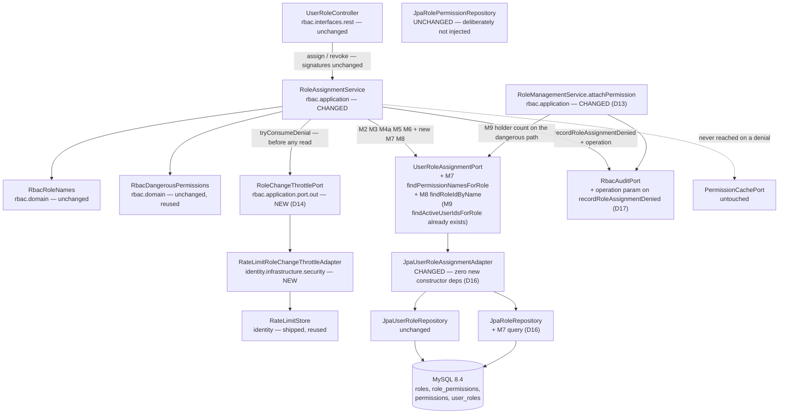
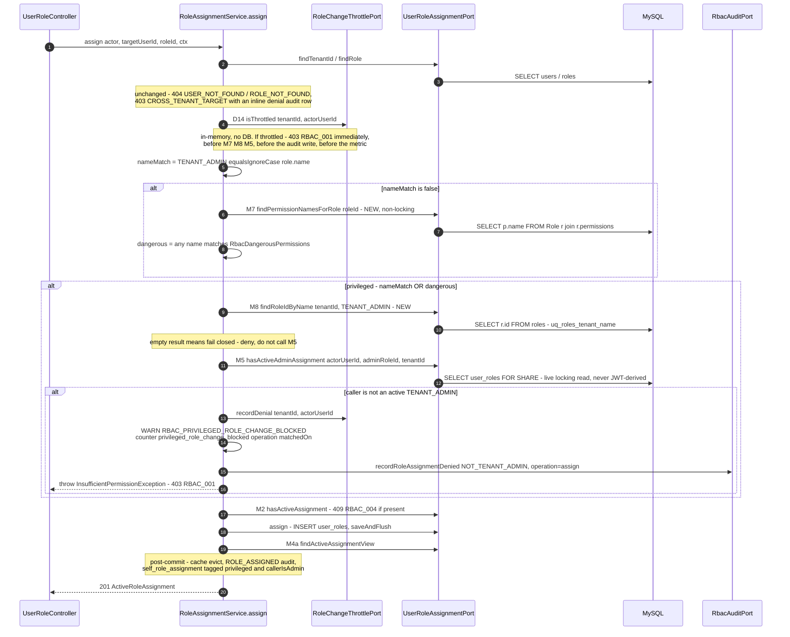
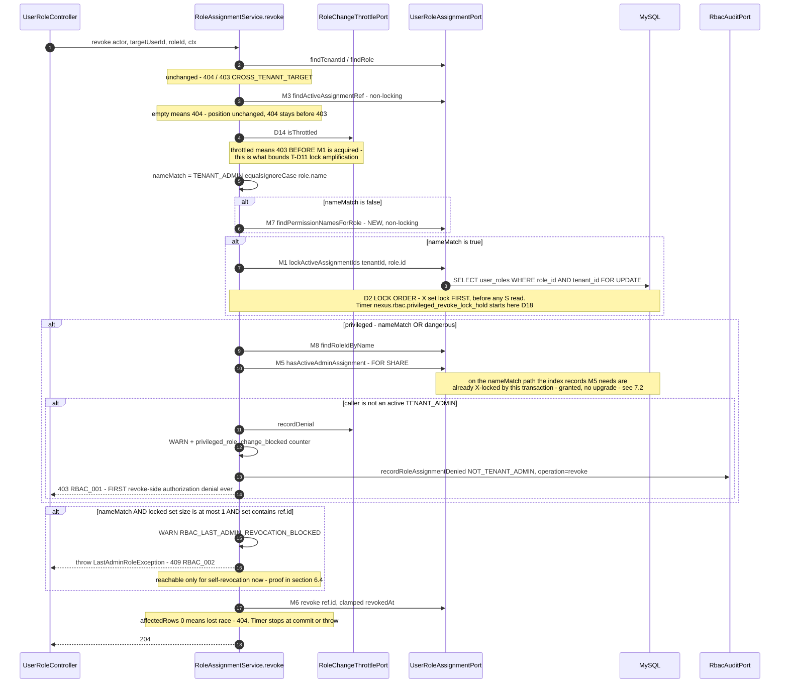
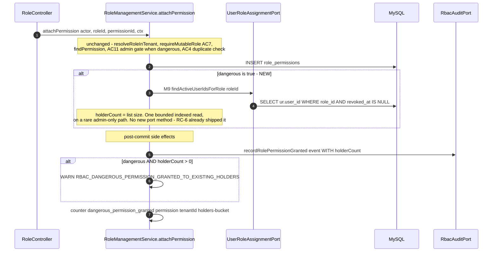
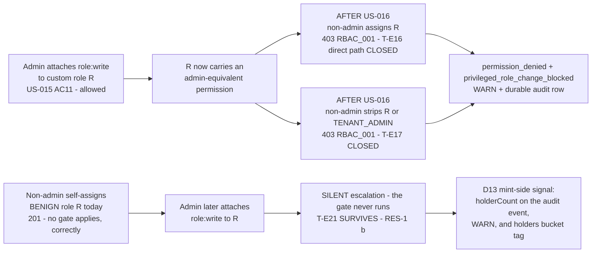

# US-016 — Solution Design: Gate role assignment/revocation by actual privileges, not role name

**Feature:** Privilege-based (not name-based) authorization gate on `RoleAssignmentService.assign()` / `revoke()`
**Epic:** EPIC-002 (RBAC Foundation)
**Phase:** 3 (Solution Design) — Gate 2, Step A
**Author:** Principal Architect

**Status:** **Revision 2 (2026-09-10) — post-threat-model.** Gate 2 Step B (`03b-threat-model.md`) returned a **conditional pass with seven required changes (RC-8…RC-14) and four editorial corrections**. All eleven are folded in here; §0.1 is the change log. Revision 1 (2026-09-09) is superseded in place — this document, not the diff, is what `/breakdown` consumes.

**Inputs (settled; not re-litigated):**
- `docs/features/US-016/01-requirements.md` — Gate 1 approved; FR-1…FR-6 binding.
- `docs/features/US-016/02-impact.md` — Phase 2, verified against `feature/US-016` @ `76470e2`. Its §1, §6, §9, §11, §12, §13 are this document's mandate.
- **`docs/features/US-016/03b-threat-model.md` — Gate 2 Step B, binding.** Its RC-8…RC-14 and editorial corrections are requirements on this document. Where it and revision 1 disagree, it wins — except on RC-10's *placement* (not its bound), where §4.8 states different reasoning and reaches the same guarantee.

### 0.1 What revision 2 changes

| Finding | Sev | Disposition |
|---|---|---|
| **RC-8** — RES-1 mis-scoped; US-016 does **not** close the attach-after-assign path (T-E21) | High | **Accepted in full, including part 3: the mint-side holder-count signal ships in this story** (story-owner scope decision, 2026-09-10). New **D13** (§4.7). RES-1 re-scoped/split (§12.3); §12.2 item 6 corrected; §4.2 Javadoc text corrected |
| **RC-9** — D2's proof is logical-row, not index-record; REPEATABLE READ unstated; harness A homogeneous; T-D12 unnamed; denial audit write unbounded | Med | **Accepted in full.** §7.2 restated at index-record granularity + **MC-5** (`EXPLAIN` IT); RR dependency stated in §7.2 *and* §6.4 + **MC-6**; **harness C** (§7.4); T-D12 named as **RES-10**; **D18** keeps the audit write inline, instruments it, and publishes the *composed* hold time (§7.5) |
| **RC-10** — the denial path is unthrottled | Med | **Accepted.** New **D14** (§4.8): per-`(tenantId, actorUserId)` denial throttle, service-layer, over a new narrow rbac port backed by the shipped `RateLimitStore`. §9.1 now claims the PRIORITY-lane exclusion as load-bearing |
| **RC-11** — page precision; the canary pages on the Epic-3 happy path | Med | **Accepted in full.** New **D15**: counter `nexus.rbac.privileged_role_change_blocked{operation,matchedOn}`; `nexus_rbac_self_escalation_attempt`'s **expression is still never edited** (D6's floor) but its severity drops to ticket; page moves to the new counter; canary gains a `callerIsAdmin` tag; both alerts renamed |
| **RC-12** — the adapter would gain full CRUD over `role_permissions` | Med | **Accepted, preferred option.** New **D16**: M7's JPQL lives on the already-injected `JpaRoleRepository`; the adapter gains **zero** dependencies; the planned `JpaRolePermissionRepository` method is withdrawn |
| **RC-13** — denials indiscriminable in `auth_events`; exposure-audit runbook wrong | Med | **Accepted in full.** New **D17**: `operation` is **persisted** in the denial metadata (option (a); reasons in §4.9). §10.4 rewritten |
| **RC-14** — MC-3 pins only the `roleId` argument | Med | **Accepted in full.** MC-3 now covers **both** arguments (§11.2) |
| Editorial 1 — "detach is admin-gated" is false | — | Corrected in §6.5 / RES-2; revoke-side race now analysed |
| Editorial 2 — "no new oracle" unqualified | — | Qualified in §6.2; recorded as **RES-8** |
| Editorial 3 — AC5 reads as pure narrowing | — | §6.4 now states the ≥1-admin invariant is enforced *more* strongly |
| Editorial 4 — caller-side test stays name-based | — | **RES-9** + one sentence in ADR-0017's follow-on rules |

**Scope delta (price this in `/breakdown`).** The story now also touches `RoleManagementService.attachPermission`, `RoleAuditEvent`, `RbacAuditPort`/`RbacAuthEventAdapter`, and adds one outbound port + one adapter + two config properties. **Revision 1's claim that `RoleAssignmentService`'s constructor is unchanged no longer holds** (D14 adds one collaborator and two `@Value`s) — §4.1. Still true: **no Flyway migration, no schema change, no grant change, no new dependency, no REST/DTO change, no Angular file.**

---

## 0.2 Decision summary

| # | Open item | Decision | Delta |
|---|---|---|---|
| **D1** | Gate/lockout ordering on `revoke()` (R1) | **403 before 409.** Gate runs after the 404 (`findAssignmentRefOrThrow`) and **before** AC5. AC5's reachable population for the admin role narrows to **self-revocation** (§6.4). US-012's AC5 docs get a dated amendment. | Confirmed by threat model (claim 1) |
| **D2** | Locking strategy (R2) | **M1 `PESSIMISTIC_WRITE` set lock first, then the gate's `PESSIMISTIC_READ`** (contained in the X region). `revoke()`'s *first-acquired* lock is unchanged from today. Option (b) rejected with a proof (§7.3). | Confirmed as a decision; **proof completed per RC-9** (§7.2) |
| **D3** | Port choice (R6) | **Option B** — two narrow reads on `UserRoleAssignmentPort`; no `RoleManagementPort` injection. M7 returns permission **names**, never a boolean, and the dangerous set never crosses the port. | Confirmed at the application layer; **extended one layer down by D16** |
| **D4** | Single unified gate, one call site | **One condition** (`isNamedTenantAdmin(role) OR carriesDangerousPermission(role.id)`), short-circuiting on name, feeding **one** generalised `hasActiveAdminAssignment` call whose `roleId` comes from M8. Fail closed when M8 is empty. | Confirmed; **MC-3 extended to both arguments (RC-14)** |
| **D5** | TOCTOU scope of the permission read | **Non-locking, confirmed.** A `@Lock` on M7 would be a **production-only** failure (`nexus_app` holds `SELECT` only on `permissions`) that every IT would pass. MC-1 makes it mechanical. | Ruling confirmed; **one stated reason corrected** (§6.5) |
| **D6** | `DenialReason` (R5) | **Reuse `NOT_TENANT_ADMIN`. No sixth value.** The enum names the *caller's* deficiency; *why the gate applied* is a different axis carried by `matchedOn`. US-012's alert expression needs **zero** edits. | Stands. **Not** superseded by D15 — D15 adds a counter *beside* it |
| **D7** | FR-6 canary (R8) | Retain `nexus.rbac.self_role_assignment`; add a `privileged` tag. | **Extended by D15:** a second bounded tag `callerIsAdmin` is required, or the canary pages on the Epic-3 happy path |
| **D8** | New observability at the gate | One new WARN marker `RBAC_PRIVILEGED_ROLE_CHANGE_BLOCKED`. ~~No new counter.~~ | **Superseded in part by D15** — one new counter is now required for alert precision |
| **D9** | ADR form | **Standalone `docs/adr/0017-privilege-based-role-assignment-gate.md`**; ADR-0013 not edited. Verbatim content in §13.2. | Unchanged; content extended (D13 + RES-9 sentence) |
| **D10** | Feature flag | **No new flag.** Rides the two existing default-off flags. A dedicated flag's "off" position would *be* the vulnerability. | Confirmed ("D10's reasoning is the best in the document") |
| **D11** | Error contract | **No new error code.** 403 + `RBAC_001` + `requiredPermission="user:write"`. No wire-format change. | Unchanged — and it is why D14 sits in the service, not a filter (§4.8) |
| **D12** | AC5 lockout for custom admin-equivalent roles | **Out of scope (Gate 1 #8) — RES-3.** This design strengthens the case for it. | Unchanged |
| **D13** *(new, RC-8)* | Mint-side holder signal | **Ships in US-016.** `RoleManagementService.attachPermission`, on the dangerous path only, counts existing holders via the already-existing `UserRoleAssignmentPort.findActiveUserIdsForRole` and emits it on the `ROLE_PERMISSION_GRANTED` audit event, a new WARN marker, and a bounded bucket tag on `nexus.rbac.dangerous_permission_granted`. §4.7 | New |
| **D14** *(new, RC-10)* | Denial throttle | **Per-`(tenantId, actorUserId)` denial throttle in the service layer**, over a new `RoleChangeThrottlePort` implemented in `identity.infrastructure.security` on the shipped `RateLimitStore`. Trips **before** M1/M7/M8/M5, the audit write and the metric. Fails safe (403). §4.8 | New |
| **D15** *(new, RC-11)* | Alert precision | New counter **`nexus.rbac.privileged_role_change_blocked{operation, matchedOn}`** at the throw site; page severity moves to it; `nexus_rbac_self_escalation_attempt`'s **expression stays byte-identical** and drops to ticket; canary gains `callerIsAdmin`. §9.2/§9.3 | New |
| **D16** *(new, RC-12)* | Where M7's query lives | **On `JpaRoleRepository`** (already injected), not `JpaRolePermissionRepository`. The adapter gains **zero** constructor dependencies and no write capability over `role_permissions`. §4.4/§4.5 | New |
| **D17** *(new, RC-13)* | Denial discriminability | **Persist `operation` (`assign`\|`revoke`) in the denial's audit metadata.** `RbacAuditPort.recordRoleAssignmentDenied` gains one parameter. §4.9 | New |
| **D18** *(new, RC-9.5)* | Denial audit write under the X lock | **Keep it inline** (US-014 AC4 durability) but **instrument it**: a timer over the whole locked region, a documented ceiling, and the **composed** hold time published — not the pieces. §7.5 | New |

---

## 1. Goals and non-goals

**What this story is:** the *propagate*-side half of the M-3 / T-E16 / T-E17 escalation chain. US-015 closed the *mint* side. Today `RoleAssignmentService` decides "is this role special?" by comparing the role's **name** to `TENANT_ADMIN`, so any `user:write` holder can grant — or strip — a custom role that *actually carries* admin-equivalent permissions, with the admin check never firing.

Goals, in priority order:

1. **Make the gate privilege-based, symmetric, additive** (FR-1…FR-4).
2. **One gate, one denial, one audit row** (Gate 1 #5, Edge Case 3).
3. **Do not break `revoke()` under concurrency.** §7 is the load-bearing section.
4. **Do not create a detection regression while fixing a security hole** (R5, R8) — and, post-RC-11, do not create a *precision* regression either.
5. **Add as little to the platform as the threat model permits.** Revision 2 adds one port, one adapter, one counter, one timer, two properties. Zero migrations, grants, dependencies, endpoints.
6. *(new, RC-8)* **Do not let the story be recorded as closing more than it closes.** T-E21 survives; D13 makes it *visible* rather than silent.

**Non-goals:** backfill/remediation of pre-existing assignments (Gate 1 #7 — forward-only; §10.4); extending AC5-style lockout to custom admin-equivalent roles (Gate 1 #8, RES-3); *general* rate limiting of the endpoint family (D14 throttles the **denial path**, not the verb — §4.8); any Epic-3 role-management UI.

---

## 2. Architecture

Nothing moves between layers. The change is confined to two application services, two additive read methods and one new port on the outbound side, one adapter method, one repository query, and one audit-port parameter.



**Hexagonal conformance (ADR-0002).** The gate and the throttle decision are application-layer policy; every new capability is an outbound-port read implemented in infrastructure. `rbac` still imports nothing from `identity` — critically, **the throttle adapter lives in `identity.infrastructure.security` and implements an `rbac`-declared port**, so the dependency direction is `identity → rbac`, exactly as `RbacAuthEventAdapter` and `UserDirectoryPort` already do (`HexagonalArchitectureTest.rbac_must_not_depend_on_identity` stays green — the reverse arrangement would fail it, see §4.8). `rbac_application_methods_must_not_accept_principal_or_map` stays green. The dangerous-permission *policy* stays in `rbac.domain`.

**Frontend:** no change (re-confirmed against impact §4). Forward note for Epic 3: a 403 on assigning/revoking a privileged role is a **normal** outcome for a non-admin operator; the UI must not present such roles as assignable to them.

---

## 3. Sequence diagrams

### 3.1 `assign()` — new control flow



### 3.2 `revoke()` — new control flow, with the pinned lock order



### 3.3 `attachPermission()` — the mint-side holder signal (D13, RC-8)



### 3.4 What the gate closes — and what it does not (corrected per RC-8)



---

## 4. Component design

### 4.1 `rbac.application.RoleAssignmentService` — changed

**Constructor changes** (revision 1 said it would not; D14 makes that false, and saying so is cheaper than a surprise in `/breakdown`): one new collaborator `RoleChangeThrottlePort` plus two `@Value` properties. `RoleManagementService` already takes a `@Value` in its constructor, so this is an established shape in this package. `RoleAssignmentServiceTest`'s `@InjectMocks` setup gains one mock; a `RoleChangeThrottlePort` that permits by default keeps every existing test semantically unchanged.

```java
// changed: throttle check + unified privilege gate
@Transactional public ActiveRoleAssignment assign(RoleChangeActor, UUID targetUserId, UUID roleId, RequestContext);

// changed: throttle check, gate between the 404 and the AC5 lockout, lock order pinned
@Transactional public void revoke(RoleChangeActor, UUID targetUserId, UUID roleId, RequestContext);

// new — FR-3's half of the unified condition; the source of matchedOn
private static boolean isNamedTenantAdmin(Role role);

// new — FR-1's half. Non-locking (D5). Empty permission set means NOT privileged (Edge Case 1)
private boolean carriesDangerousPermission(UUID roleId);

// new — the ONE call site of the admin check (D4). void, not boolean: a caller cannot ignore a
// thrown exception the way it can ignore an unchecked boolean (US-015's own reasoning).
private void requireActiveTenantAdmin(
    RoleChangeActor actor, UUID targetUserId, Role role, String requiredPermission,
    String operation, boolean nameMatch, RequestContext requestContext);

// new (D14) — trips before any read; throws the same InsufficientPermissionException
private void requireNotThrottled(RoleChangeActor actor, String operation, RequestContext ctx);
```

Unchanged and explicitly **not** reused by the gate: `callerHoldsActiveTenantAdmin` (342–347) — the deliberately non-locking, role-*name*-based redaction helper for `listActive`. Using it here would silently convert an assignment check into a role-name check and drop the T-E7 freshness guarantee. A blanket ArchUnit ban is impossible (`listActive` legitimately needs `findActiveAssignmentViews`), so the control is a collaborator assertion — MC-2.

`recordDenial` (405–427) gains **one parameter** (`operation`, D17) and is otherwise reused unchanged.

### 4.2 Javadoc: replace the M-3 and T-E9 notes, never delete them

Both notes carry a binding instruction ("replace with the closure reference, do not delete"). **Corrected per RC-8.3 — the earlier draft claimed RES-1/T-E16 were closed outright, which is not true.** Apply verbatim:

> **Security note (M-3 / T-E9 — CLOSED by US-016; RES-1 PARTIALLY closed).** This gate is privilege-based, not name-based: it denies granting *and* revoking any role that is literally named `TENANT_ADMIN` **or** carries any `RbacDangerousPermissions` member, unless the caller holds an active `TENANT_ADMIN` assignment in this tenant, verified by a fresh locking read (never a JWT claim — T-E7).
> **Closed:** T-E9 (no symmetric admin check on `revoke()`); T-E17 (administrator stripping); T-E16 **for the direct propagate path only** (a non-admin can no longer assign a role that is dangerous *at assign time*).
> **NOT closed, deliberately:** the attach-after-assign path — a non-admin may self-assign a benign role, which an administrator may later make dangerous via `RoleManagementService.attachPermission`; no gate evaluates at that moment. Carried forward as **US-016 T-E21 / RES-1(b)** (`docs/features/US-016/03b-threat-model.md` §3, §5). Mitigated, not closed, by the mint-side holder-count signal in `RoleManagementService.attachPermission` (US-016 D13) — do not delete that signal without re-opening this note.
> Also surviving: AC5's last-admin lockout still protects only the literally-named `TENANT_ADMIN` (RES-3), and the **caller**-side admin test remains name-based (RES-9).
> See `docs/features/US-016/03-design.md` and ADR-0017.

### 4.3 `UserRoleAssignmentPort` — two additive read methods (D3)

Injecting `RoleManagementPort` (Option A) is rejected on two written precedents: `UserRoleAssignmentPort.java:11–20` ("*widening it would leak a write capability to a read-only collaborator*") and `RoleManagementPort.java:10–22` ("*One port, not a split… There is exactly one consumer*"). Option A would hand `RoleAssignmentService` `createRole`/`attachPermission`/`detachPermission` — write capability over the very `role_permissions` rows its gate reads — and would falsify a load-bearing sentence in another port's Javadoc.

```java
/**
 * M7 — the names of every permission attached to {@code roleId}. Bounded at
 * |permissions| = 7 by the fixed catalogue (V5__rbac_schema.sql:107-114).
 *
 * <p><b>PRECONDITION (T-I13 / RC-12.4): {@code roleId} MUST already have been tenant-verified
 * by the caller. This method performs NO tenant check</b> — unlike most methods on this port it
 * takes a bare role id. {@code RoleAssignmentService} satisfies this by calling
 * {@code resolveRoleInTenant} two statements earlier; any new caller must do the same.
 *
 * <p>Deliberately returns NAMES, not a boolean and not a PermissionView projection: the
 * "which permissions are dangerous" policy lives in rbac.domain.RbacDangerousPermissions and
 * MUST NOT cross this port in either direction — not hardcoded in the adapter (R-9 discipline)
 * and not passed in as a parameter either.
 *
 * <p>MUST be a plain, NON-LOCKING read and MUST NEVER be annotated {@code @Lock}: it touches
 * {@code permissions}, on which {@code nexus_app} holds {@code SELECT} only, so a locking read
 * would be rejected in production and would pass every Testcontainers IT (03-design.md D5).
 */
List<String> findPermissionNamesForRole(UUID roleId);

/**
 * M8 — resolves this tenant's role id by {@code (tenantId, name)}. Same contract as
 * {@code RoleManagementPort#findRoleIdByName} and backed by the SAME repository method, so there
 * is exactly one query and one index-discipline site: a plain {@code r.name = :name} predicate
 * relying on {@code utf8mb4_0900_ai_ci}, never {@code UPPER()}, so {@code uq_roles_tenant_name}
 * is used as an index. Empty ⇒ the caller MUST fail closed (R-10 / T-E18).
 */
Optional<UUID> findRoleIdByName(UUID tenantId, String name);
```

**Why M7 returns names** (deliberate override of impact §1.4's boolean-plus-parameter shape), three reasons: (1) the dangerous set never crosses the port at all — the same discipline one step further, removing the "future caller passes a stale set" failure mode; (2) case-insensitivity becomes testable in Java via the already-unit-tested `RbacDangerousPermissions.contains()` rather than being a property of MySQL's collation invisible to unit tests — this repository has already been bitten by exactly this bug class on the role-name side (`should_throwNotTenantAdmin_when_roleNameIsDifferentCaseVariantOfTenantAdmin` exists because of it); (3) `List<String>` of ≤7 names is neither a projection nor an ignorable boolean, and mirrors two queries already on `JpaUserRoleRepository`. Residual (a future caller misusing M7 for a different policy decision) is bounded by the Javadoc plus MC-3.

**M9 is not new.** `findActiveUserIdsForRole(UUID roleId)` already exists (US-015 RC-6). D13 gives it its first runtime caller; its Javadoc's "this story's own runtime flows never call it" sentence must be updated to name `attachPermission`, and its "no locking, ops-triggered" contract is retained and now load-bearing (§4.7).

### 4.4 `JpaUserRoleAssignmentAdapter` — changed, **zero new constructor dependencies** (D16, RC-12)

Revision 1 planned a new constructor dependency on `JpaRolePermissionRepository`. **Withdrawn.** That interface `extends JpaRepository<RolePermission, RolePermissionId>`, so injecting it would hand the *assignment* adapter `save`/`delete`/`deleteAll` over `role_permissions` — the one RBAC table with both `INSERT` and `DELETE` grants, no trigger and no soft delete, i.e. the only one where an accidental write from the wrong layer actually executes. That is word-for-word the objection §4.3 raises against Option A, applied one layer down.

Both delegations therefore go to the **already-injected** repositories:

```java
@Override public List<String> findPermissionNamesForRole(UUID roleId);      // -> roleRepository (NEW query, §4.5)
@Override public Optional<UUID> findRoleIdByName(UUID tenantId, String name); // -> roleRepository (existing Q3)
```

Total new SQL in this story: **one** query on the assignment side (M7) — unchanged from revision 1 — plus D13's reuse of an existing query. Adapter constructor: **unchanged**, so `JpaUserRoleAssignmentAdapterTest`'s setup does **not** change (revision 1's note that it would is withdrawn).

Extend the adapter's class Javadoc, which already says "*this layer does not resolve `TENANT_ADMIN` by any hardcoded literal — that resolution happens in the service layer, per R-9 discipline*", with two sentences: (a) the same rule now covers dangerous permission names; (b) **this adapter holds no write capability over `role_permissions` and must not acquire one — its permission read is hosted on `JpaRoleRepository` precisely so that it cannot** (T-T13).

### 4.5 `JpaRoleRepository` — one new query (D16)

```java
@Query("""
    SELECT p.name FROM Role r JOIN r.permissions rp, Permission p
    WHERE rp.id.permissionId = p.id AND r.id = :roleId
    """)
List<String> findPermissionNamesByRole(@Param("roleId") UUID roleId);
```

If `Role` has no mapped association to `RolePermission` (verify at implementation time — the entity is unchanged either way), use the equivalent two-entity comma-join form `SELECT p.name FROM RolePermission rp, Permission p WHERE rp.id.permissionId = p.id AND rp.id.roleId = :roleId` — hosting it on `JpaRoleRepository` is the point, not the join syntax; Spring Data does not require a `@Query` to name only the repository's own aggregate root. Comma-join JPQL, never native SQL, so Hibernate's auto-applied `UuidV7Converter` handles `UUID` ↔ `BINARY(16)` for both predicate and bind. No `@Lock` (MC-1). No `ORDER BY` — the caller does set membership.

`JpaRolePermissionRepository` is **unchanged** and stays out of this story's file list.

### 4.6 `common.security.DenialReason` — unchanged (D6)

No sixth value. The enum's reviewed bounded cardinality is preserved and it keeps naming one axis only — *why the caller was denied*, not *why the gate applied*. §8.3. D15's counter is the correct instrument for the other axis; adding it does not reopen D6.

### 4.7 `RoleManagementService.attachPermission` — the mint-side holder signal (D13, RC-8)

**This is US-016 code even though it lives in US-015's service.** Same bounded context, same package (`rbac.application`), same class of decision. It ships here because the threat model rates T-E21 **High** on the same basis US-015 rated T-E16 High, and because the alternative — a named successor story — leaves a standing, race-free, zero-signal escalation primitive open across the Epic-3 kickoff that RES-1's own hard-expiry clause names.

**What it does *not* do:** it does not block the attach, does not add a gate, and does not change any status code. `attachPermission`'s authorization behaviour (AC7 → AC11 → AC4 → insert) is untouched. It converts a **silent** mass escalation into a **reviewable, alertable** one. Blocking was considered and rejected: attaching a dangerous permission to a role that has holders is a legitimate, Epic-3-required administrative action, and a gate there would be a functional regression on a shipped API for a risk that detection already addresses.

**Exact change.** Public signature unchanged:

```java
@Transactional
public PermissionView attachPermission(
    RoleChangeActor actor, UUID roleId, UUID permissionId, RequestContext ctx);
```

Inside, after the existing `roleManagementPort.attachPermission(role.id(), permissionId)` and **before** `registerPostCommitSideEffects`:

```java
// D13 / RC-8 (T-E21): count the users this attach silently escalates. Dangerous path only —
// no cost on the ordinary attach. M9 is UserRoleAssignmentPort.findActiveUserIdsForRole,
// shipped by US-015 RC-6 for the remediation runbook; this is its first runtime caller.
Integer holderCount = dangerous
    ? userRoleAssignmentPort.findActiveUserIdsForRole(role.id()).size()
    : null;   // null ⇒ omitted from audit metadata, per the existing omit-when-null convention
```

`userRoleAssignmentPort` is **already** a constructor dependency of `RoleManagementService` — no new collaborator, no new port method, no schema change. The read happens inside the same transaction, after the insert, so the count includes exactly the population that will hold the now-dangerous role at commit.

**Audit event shape.** `RoleAuditEvent` gains one trailing component `Integer holderCount` (nullable). Three construction sites in `main` (`createRole`, `attachPermission`, `detachPermission`) pass `null` except the dangerous attach. `RbacAuthEventAdapter.buildMetadataJson(RoleAuditEvent, String)` gains one clause following the file's existing omit-when-null convention, emitted after `permissionName`:

```java
if (event.holderCount() != null) { metadata.put("holderCount", event.holderCount()); }
```

so `ROLE_PERMISSION_GRANTED`'s durable metadata becomes `{traceId, roleId, roleName, permissionId, permissionName, holderCount?, grantedBy}`. It is persisted rather than log-only for the same reason as D17: `auth_events` is never pruned and log retention is not (§4.9).

**Log shape.** The existing post-commit INFO `ROLE_PERMISSION_GRANTED` line gains `holderCount` (emitted only when non-null; its existing `dangerous` key is unchanged). Additionally, when `dangerous && holderCount > 0`, emit a **new WARN marker** — the actual alertable event, because `holderCount == 0` escalates nobody:

```
WARN event=RBAC_DANGEROUS_PERMISSION_GRANTED_TO_EXISTING_HOLDERS
     tenantId, roleId, roleName, permissionId, permissionName, grantedBy, holderCount
```

Same level, field style and throw-site-context reasoning as US-015's `RBAC_DANGEROUS_PERMISSION_ATTACH_BLOCKED`. No PII: every field is a UUID, a bounded constant, or an integer (`roleName` inherits US-015 D6's CR/LF-excluding allow-list and the structured encoder — no new sink).

**Metric shape.** The existing `nexus.rbac.dangerous_permission_granted{permission, tenantId}` counter gains one **bounded bucket** tag:

```
holders ∈ { "0", "1", "2-10", ">10" }
```

Buckets, not the raw count, because the raw count is unbounded-cardinality and the alerting question ("did this attach escalate anybody, and roughly how many?") is answered by four values. This multiplies an already-tenant-keyed series by at most 4; the tenant dimension is pre-existing and unchanged by this story.

**Cost.** One indexed, non-locking `SELECT` on `user_roles` (`fk_user_roles_role`), on the dangerous branch of a rare, admin-only, already-admin-gated path. No new query on any hot path. No new port, no new dependency, no migration.

**What this does and does not buy** (state it in the runbook so nobody over-reads it): it makes step 3 of T-E21 *visible at the moment it happens*, with the exact blast radius attached. It does **not** prevent the escalation and it does not see step 1 (the benign self-assignment, which is legitimate and correctly ungated). RES-1(b)'s residual therefore moves **High → Medium** once this ships, and no further (§12.3).

### 4.8 `RoleChangeThrottlePort` — bounding the denial path (D14, RC-10)

**The bound.** Per `(tenantId, actorUserId)`, after **N** privilege-gate denials within **W** seconds, every subsequent `assign()`/`revoke()` by that actor in that tenant returns **403 `RBAC_001` / `NOT_TENANT_ADMIN` immediately** — before M1's X lock, before M7/M8/M5, before the `REQUIRES_NEW` audit write, and before the `permission_denied` increment. This is the single control that bounds T-D10 (page/audit-row flood), T-R9 (induced audit-write loss), T-D11 (X-lock hold amplification) and RES-8's oracle probing, and it is the reason those four can be accepted at Low.

**This bound is per replica, not cluster-wide, under the default `InMemoryRateLimitStore` (M-3, `07-security-review.md`).** N and W above describe what a single JVM enforces; an N-replica deployment's effective bound is `N (denials) × replica count` fully processed denials per window, because the default store keeps its counters per-JVM. Setting `nexus.security.rate-limit.store-type=redis` makes the denial count cluster-wide; the adapter's own throttled-until transition map (RES-11) stays per-replica regardless. Qualified here, in `monitoring.md` §3, in RES-11 (§12.3 below), and in the runbook's deployment guidance (`runbook.md` §3) so T-D10/T-D11/T-R9/RES-8's "D14 bounds them" reasoning is not read as a cluster-wide guarantee it does not make on the default store.

**Port** (declared in `rbac.application.port.out`, one method, no dependency on the throttle's mechanism):

```java
/**
 * D14 / RC-10. Denial throttle for the privileged role-change gate. Keyed by
 * (tenantId, actorUserId) — never by IP (this path is authenticated; IP is neither stable
 * nor attributable here) and never by target (an attacker chooses the target freely).
 *
 * <p>MUST fail SAFE and MUST NOT throw: an unavailable throttle store returns "not throttled",
 * so the gate's own authorization decision — which is authoritative — still runs. The throttle
 * bounds cost, it is not an authorization control.
 */
boolean isThrottled(UUID tenantId, UUID actorUserId);

/** Records one privilege-gate denial against the (tenantId, actorUserId) bucket. Never throws. */
void recordDenial(UUID tenantId, UUID actorUserId);
```

**Adapter:** `identity.infrastructure.security.RateLimitRoleChangeThrottleAdapter`, delegating to the shipped `RateLimitStore` (`tryConsume(key, windowSeconds, maxAttempts)` → `RateLimitResult`), key `"RBAC_DENY:" + tenantId + ":" + actorUserId`. Chosen because that store already exists, is in-memory by default (`InMemoryRateLimitStore`), is already Redis-capable via `nexus.security.rate-limit.store-type` **without new code**, and is already unit- and integration-tested. **No new dependency; Redis is not introduced** (ADR-0016 unaffected — the default path stays in-memory, and this design does not propose adding Redis).

**Why the adapter lives in `identity`, not `rbac`.** `RateLimitStore` is `identity.application.port.out`; an `rbac` class importing it fails `HexagonalArchitectureTest.rbac_must_not_depend_on_identity`. Placing the adapter in `identity.infrastructure.security` against an `rbac`-declared port keeps the direction `identity → rbac`, which is the arrangement US-012 Gate 1 Resolutions 1 and 4 already established for `RbacAuditPort` and `UserDirectoryPort`. No new architectural precedent.

**Why the service layer and not a servlet filter** (the threat model offered either; the bound is identical, the placement is not): a filter would have to *write the 403 body itself*, duplicating `GlobalExceptionHandler.handleInsufficientPermission`'s exact `ProblemDetail` shape with no compiler check — a live drift hazard against D11's field-for-field guarantee, and `LoginRateLimitFilter`'s hand-written JSON precedent only covers a 429 the handler never produces. A filter also cannot distinguish a gate denial from a `CROSS_TENANT_TARGET` denial (the reason is not wire-visible — §8.3 reason 4), so it would either throttle on the wrong population or need to parse a body it does not have. The service knows exactly what a privilege-gate denial is, and throwing the existing exception keeps exactly one 403-producing path.

**Placement in the flow:** check **#3.5** in §6.2 — after the 404s (preserving 404-before-403 and keeping `should_neverCallLockActiveAssignmentIds_when_adminRoleAssignmentNotFound` byte-identical) and before M1/M7. `recordDenial` on the port is called at the gate's throw site, alongside the WARN and the counter.

**Configuration** (`application.yml`, under the existing `nexus.rbac` block; both recorded in `docs/features/US-016/monitoring.md`):

| Property | Default | Rationale |
|---|---|---|
| `nexus.rbac.denial-throttle.max-denials` | **5** | A legitimate operator who hits the gate learns from the first 403; five in a minute is already anomalous. Low enough to bound a flood, high enough that a confused-but-honest helpdesk operator is not throttled mid-task |
| `nexus.rbac.denial-throttle.window-seconds` | **60** | Matches `nexus.security.rate-limit.ip-window-seconds`, so operators reason about one window length across the platform |

Setting `max-denials` to a very large value effectively disables the throttle; **no `enabled` flag is added** — D10's "no new flag" holds, and a boolean whose "off" position removes a DoS bound would repeat the mistake D10 rejects.

**Behaviour when the throttle trips**, chosen so the durable record survives the flood:
- The **first N denials are fully processed** — WARN, counter, durable `ROLE_ASSIGNMENT_DENIED` row. Forensics keeps the evidence.
- Beyond N: 403, **no** audit row, **no** `permission_denied` increment, **no** per-request WARN. One increment of `nexus.rbac.denial_throttled{operation}` per suppressed request, and **one** WARN `RBAC_DENIAL_THROTTLE_ENGAGED` on the transition into the throttled state (carrying `tenantId`, `actorUserId`, `operation`, `maxDenials`, `windowSeconds`).
- Fail-safe: any exception from the store is swallowed by the adapter and treated as "not throttled" (MC-7).

**Accepted collateral (RES-11).** Because the check precedes M7 — which is what makes it bound the lock and the reads — a throttled actor is also denied `assign()`/`revoke()` of *benign* roles for the remainder of the window. That is a bounded availability cost (≤ W seconds) imposed only on an actor who has just produced N authorization denials, and it is the price of not doing the work needed to find out whether this particular request would have been denied anyway. Recorded in §12.3, and in the runbook as an operator-visible symptom.

### 4.9 `RbacAuditPort.recordRoleAssignmentDenied` — persist `operation` (D17, RC-13.1)

Today a denied `assign()` and a denied `revoke()` are **indistinguishable** in `auth_events`: both are `ROLE_ASSIGNMENT_DENIED` with `metadata = {traceId, roleId, roleName, reason, attemptedBy}`; the adapter's `operation` value (`"deny"`) is a failure-metric tag only, never persisted. Revision 1 accepted this at Low, compensated by the WARN's `operation` field.

**The compensating control has an unstated precondition — log retention ≥ `auth_events` retention — and nobody has cited a retention figure.** `auth_events` is append-only and never pruned by this application. US-015 refused the same gap (RES-10). Resolved here the same way, choosing **option (a), persist**, over option (b), mandate a retention figure, because: retention is an Ops decision an Architect cannot unilaterally make binding, whereas persistence is deterministic and testable; the change is small and already-shaped (the adapter *has* the value); and D13 is opening `buildMetadataJson`'s sibling method in the same PR, so one pattern lands once instead of two half-measures.

```java
// RbacAuditPort — one added parameter, one shipped implementation, one private caller
void recordRoleAssignmentDenied(RbacAuditEvent event, DenialReason reason, String operation);
```

`RbacAuthEventAdapter.recordRoleAssignmentDenied` threads it into the existing private `record(...)`'s `operation` slot (which already feeds the `audit_write_failed` metric tag) and adds one clause to `buildMetadataJson(RbacAuditEvent, String, String)`, emitted after `reason`:

```java
if (operation != null) { metadata.put("operation", operation); }
```

Values: **`"assign"` | `"revoke"`** — the verb, not the adapter's internal `"deny"`. The `nexus.rbac.audit_write_failed{operation}` tag keeps its existing `"deny"` value so no dashboard breaks; the metric tag and the metadata field are deliberately different axes and the adapter Javadoc must say so. Call sites: `RoleAssignmentService.recordDenial`'s single `rbacAuditPort` call, fed from the three `recordDenial(...)` invocations (two cross-tenant, one gate) — each already inside a known verb, so the literal is available with no plumbing. `RoleAssignmentAuditIT` gains a metadata assertion; `RbacAuthEventAdapterTest` gains one.

**Consequence for RES-6:** re-rated Medium → **resolved in code** (§12.3). Cross-tenant denials gain the same discriminator for free.

---

## 5. Database design

### 5.1 Migration: none — re-confirmed

| Concern | Finding |
|---|---|
| New table / column / index | **None.** M7 is a leftmost-prefix scan on `pk_role_permissions PRIMARY KEY (role_id, permission_id)` (V5:49) bounded at 7 rows, plus ≤7 PK lookups on `permissions`. M8 is an equality lookup on `uq_roles_tenant_name` (V5:39). M9 (D13) drives off `fk_user_roles_role`. All three indexes exist. |
| `ddl-auto=validate` / ADR-0003 | No entity or mapping change ⇒ nothing for `validate` to reject. No migration file, so ADR-0003's append-only rule is not engaged. |
| Expand / contract | Not applicable — zero schema changes. |
| Seed data | V5:130–136: the seeded `TENANT_ADMIN` carries all 7 permissions (so **both** halves of the unified condition are true — resolved structurally by D4, not by an ordering rule); the seeded `MEMBER` carries only `user:read`, and `RbacRoleNames.RESERVED` (US-015 RC-5b) makes it impossible for `MEMBER` to ever become dangerous. **No seeded role becomes admin-gated by accident.** |

### 5.2 Read paths and locking — the complete picture

| # | Read | Table(s) | Lock mode | Where | Grant OK? |
|---|---|---|---|---|---|
| M3 | `findActiveAssignmentRef` | `user_roles` | none | `revoke()`, before the gate | yes |
| **T** | `isThrottled` (D14) | *none — in-memory* | n/a | both verbs, **before every read below** | n/a |
| **M7 (new)** | `findPermissionNamesForRole` | `role_permissions`, `permissions` | **none — mandatory** (D5, MC-1) | both verbs, only when the name match fails | yes (`SELECT`) |
| **M8 (new)** | `findRoleIdByName` | `roles` | none | both verbs, only when privileged | yes (`SELECT`) |
| M1 | `lockActiveAssignmentIds` | `user_roles` | `PESSIMISTIC_WRITE` (`FOR UPDATE`) | `revoke()`, **first lock**, name match only | yes (`UPDATE (revoked_at)` column grant satisfies MySQL's locking-read requirement — US-012 T-R4) |
| M5 | `hasActiveAdminAssignment` | `user_roles` | `PESSIMISTIC_READ` (`FOR SHARE`) | both verbs, inside the gate, **after** M1 | yes (as above) |
| M2 | `hasActiveAssignment` | `user_roles` | none | `assign()`, after the gate | yes |
| M6 | `revokeById` | `user_roles` | `UPDATE` | `revoke()`, after all checks | yes (column-scoped) |
| **M9 (existing, new caller)** | `findActiveUserIdsForRole` (D13) | `user_roles` | **none — mandatory** | `attachPermission`, dangerous path only | yes (`SELECT`) |

**The grant constraint is a hard design input.** `nexus-database/mysql/init/02-grants-post-schema.sql:31–35` gives `nexus_app` **`SELECT` only** on `permissions`. MySQL requires `SELECT` plus one of `DELETE`/`LOCK TABLES`/`UPDATE` to execute a locking read. A `@Lock` on M7 would be **rejected in production and pass every `*IT`** (every IT connects as the Testcontainers superuser) — the same shape as US-015's R-6 dirty-flush trap and US-012's T-R4. Hence D5 is a ruling with a mechanical control (MC-1), not a comment. The same rule now applies to M9's new call site: it must stay non-locking, and it must not be given a `@Lock` to "make the count consistent" — the count is a signal, not a decision.

Because no locking read is proposed on any new path, **no new privilege-level IT** in the `RolePermissionsPrivilegeIT` / `UserRolesPrivilegeIT` family is required.

### 5.3 JPA entity sketch

`Role`, `RolePermission`, `RolePermissionId`, `Permission`, `UserRole`: **unchanged** — no new annotation, field or `@Version`.

```java
@Entity @Table(name = "role_permissions")            // @EmbeddedId RolePermissionId(roleId, permissionId)
@Entity @Table(name = "permissions")                 // @Id UUID id; @Column String name  (read-only, ADR-0013 D1)
```

`RolePermission` has no `@Version` and no soft-delete column — one of the reasons D5 rules the permission read non-locking (§6.5).

**Not a JPA entity but a shape change:** `RoleAuditEvent` gains `Integer holderCount` (D13) and `RbacAuditPort.recordRoleAssignmentDenied` gains a `String operation` parameter (D17). Neither touches `auth_events`'s schema — both land inside the existing `metadata` JSON column.

### 5.4 Constraints this design leans on

| Constraint | Where | Used for |
|---|---|---|
| `uq_roles_tenant_name UNIQUE (tenant_id, name)` + `utf8mb4_0900_ai_ci` | V5:39 | Proves M8 can return **only** `role.getId()` when `isNamedTenantAdmin(role)` — the containment invariant D2 depends on (§7.2) and the reason `should_proceedToInsert_…` keeps its literal assertion. Also closes the reserved-name-squat variant (T-T12) together with `RbacRoleNames.RESERVED` |
| `pk_role_permissions PRIMARY KEY (role_id, permission_id)` | V5:49 | Makes M7 a bounded PK-prefix scan; also why M7 can never return duplicates |
| `uq_user_role_active (active_key)` (ADR-0013 D2) | V5:89 | Unchanged; the DB-level "one active assignment" guarantee behind 409 `RBAC_004`. Note for §7.2: `active_key` is a **STORED generated column**, so M6's `UPDATE revoked_at` mutates an indexed column too |
| `fk_user_roles_role` | V5 | The access path M1 drives off, and the one M5 must also use for D2's containment proof to be exact (§7.2, MC-5) |

### 5.5 Caching — no change

`PermissionCachePort` is untouched: the gate denies **before** any write, so nothing is assigned and nothing to evict. No new cache key, TTL, or invalidation trigger. **No Redis is added by this design** — D14's throttle uses `RateLimitStore`, whose default implementation is in-memory; the Redis-backed implementation is a pre-existing, separately configured option (ADR-0016 unaffected, ADR-0013 D4 not reopened).

Rejected: caching "is role R dangerous" to avoid M7. It would couple cache invalidation to `role_permissions` writes — the bulk-invalidation machinery ADR-0013 D4 declined — to save one bounded PK-prefix scan on a non-hot path. Boring wins.

### 5.6 Performance

| Path | Today | After |
|---|---|---|
| `assign()` / `revoke()`, non-privileged role (common case) | 5 / 3–4 statements | **+1** (M7); +0 DB for the throttle check |
| `assign()`, privileged role | 4 (denial short-circuits) | **+1** (M8); M7 skipped on the name-match path |
| `revoke()`, privileged role | 3–4 | **+2** (M8 + M5, the locking admin read `revoke()` never performed before) |
| **either verb, throttled actor** | n/a | **−all of the above**: 0 additional statements, no lock, no audit write |
| **`attachPermission`, dangerous permission (D13)** | 5–6 | **+1** (M9), on an admin-only, AC11-gated, rare path |
| `attachPermission`, ordinary permission | unchanged | **+0** |

No N+1: every added read is a fixed constant per request over sets bounded at 7 (M7) or by the tenant's holders of one role (M9, an admin-only path). **Latency budget:** inherit the epic bar (p95 < 300 ms at 200 RPS) rather than inventing a story-specific one. **Availability:** no new external dependency — the throttle's default store is in-process and fails safe.

---

## 6. The gate: logic, ordering, and the AC5 consequence

### 6.1 Unified condition and pseudocode (D4 + D14)

```
// ---- shared by assign() and revoke() -------------------------------------------------
requireNotThrottled(actor, op, ctx)      // D14 — before ANY read below. Throws 403 if tripped.

nameMatch  = RbacRoleNames.TENANT_ADMIN.equalsIgnoreCase(role.getName())      // FR-3
privileged = nameMatch || carriesDangerousPermission(role.getId())            // FR-1, short-circuits
if (privileged) requireActiveTenantAdmin(actor, targetUserId, role, USER_WRITE, op, nameMatch, ctx)

carriesDangerousPermission(roleId):
    return port.findPermissionNamesForRole(roleId)                            // M7, non-locking
               .stream().anyMatch(RbacDangerousPermissions::contains)         // case-insensitive

requireActiveTenantAdmin(actor, targetUserId, role, requiredPermission, op, nameMatch, ctx):
    adminRoleId = port.findRoleIdByName(actor.tenantId(), RbacRoleNames.TENANT_ADMIN)   // M8
    if (adminRoleId.isEmpty()) -> deny                                        // FAIL CLOSED (R-10/T-E18)
    if (port.hasActiveAdminAssignment(actor.userId(), adminRoleId.get(), actor.tenantId())) return
    // deny — note BOTH arguments above come from the CALLER, never the target (MC-3, RC-14):
    matchedOn = nameMatch ? ROLE_NAME : DANGEROUS_PERMISSION
    throttlePort.recordDenial(actor.tenantId(), actor.userId())               // D14
    log.WARN event=RBAC_PRIVILEGED_ROLE_CHANGE_BLOCKED, operation=op, matchedOn=matchedOn
    counter nexus.rbac.privileged_role_change_blocked{operation=op, matchedOn=matchedOn}++   // D15
    recordDenial(actor, targetUserId, role.getId(), role.getName(), NOT_TENANT_ADMIN, op, ctx)  // D17
    throw new InsufficientPermissionException(requiredPermission, NOT_TENANT_ADMIN)

requireNotThrottled(actor, op, ctx):                                          // D14
    if (!throttlePort.isThrottled(actor.tenantId(), actor.userId())) return
    counter nexus.rbac.denial_throttled{operation=op}++
    throw new InsufficientPermissionException(USER_WRITE, NOT_TENANT_ADMIN)   // no audit row, no WARN
```

Five properties, each deliberate:

- **Short-circuit order is name-first.** FR-3's behaviour does not depend on the new read at all: a bug, an outage or an empty `role_permissions` set cannot weaken the *existing* gate on the literally-named `TENANT_ADMIN`. It also removes M7's cost from the most security-sensitive path. The short-circuit can only skip the read when `nameMatch` is **true**, i.e. when the gate applies anyway — there is no input that skips the read *and* clears `privileged`.
- **One condition ⇒ one denial, one audit row, one metric increment** even when both halves are true (Edge Case 3 — the *seeded* admin role's normal state). Structural, not a precedence rule.
- **One `hasActiveAdminAssignment` call site**, always fed by M8 for the role and by `actor` for the user. Passing the *target* role's id would ask "does the caller hold the custom role?", and passing the *target* user id would ask "is the target an admin?" — **both fail open**, and both compile. MC-3 pins both (RC-14).
- **Fail closed on empty M8**, with a stated asymmetry: on the privilege path an empty M8 means a legitimately un-seeded tenant; on the name-match path it is impossible (the role we just resolved *is* named `TENANT_ADMIN` here) and therefore indicates a collation or data-consistency bug. Deny in both cases; `matchedOn` tells the operator which. A lookup that *throws* propagates and rolls back — deny-by-abort. We deliberately do **not** convert it to a 403: an infrastructure failure is not an authorization decision, and a 500 is the honest signal.
- **The throttle is not an authorization control** and must never be able to *permit* anything: it can only turn a would-be 201/204 into a 403, never the reverse. That is why it fails safe rather than fails open, and why it precedes rather than replaces the gate.

### 6.2 Check ordering — pinned

| # | Check | Outcome | Position vs. today |
|---|---|---|---|
| 1 | `verifySameTenant(targetUserId)` | 404 `USER_NOT_FOUND` / 403 `CROSS_TENANT_TARGET` + denial audit row | unchanged |
| 2 | `resolveRoleInTenant(roleId)` | 404 `ROLE_NOT_FOUND` / 403 `CROSS_TENANT_TARGET` + denial audit row | unchanged |
| 3 | *(`revoke()` only)* `findAssignmentRefOrThrow` | 404 `ROLE_ASSIGNMENT_NOT_FOUND` | unchanged |
| **3.5** | **Denial throttle (D14)** | **403 `RBAC_001` — no reads, no lock, no audit row, no `permission_denied`** | **new** |
| 4 | *(`revoke()`, name match only)* M1 X lock acquisition | — (no decision; lock ordering only, D2) | **new position** |
| 5 | **Privilege gate** | **403 `RBAC_001` / `NOT_TENANT_ADMIN` + denial audit row + WARN + `privileged_role_change_blocked`** | `assign()`: same position as today's name-match gate. `revoke()`: new |
| 6 | *(`revoke()`, name match only)* AC5 lockout | 409 `RBAC_002` | unchanged, now always after #5 |
| 7 | *(`assign()` only)* `hasActiveAssignment` | 409 `RBAC_004` | unchanged, still after the gate |

**Why the throttle sits at 3.5 and not at 0.5.** Above the 404s it would break the 404-before-403 contract and would 403 requests for resources that do not exist. Below M1 it would fail to bound T-D11, which is half its purpose. 3.5 is the only position that bounds every expensive step while preserving every ordering guarantee — including keeping `should_neverCallLockActiveAssignmentIds_when_adminRoleAssignmentNotFound` byte-identical.

**Why the gate sits *after* the 404s.** It preserves US-012's documented 404-before-403 ordering (part of the compatibility contract); it keeps the tripwire test above passing unmodified; and the information it leaks — "this user does not hold this role" — is already readable by any `user:read` holder via `GET /users/{id}/roles`.

> **Qualification required by the threat model (T-I11, editorial 2a).** The "already readable" argument holds **only for callers who also hold `user:read`**, and nothing enforces that: `@RequiresPermission("user:write")` is the only gate on these verbs and permissions are independent strings, so a principal with `user:write` and not `user:read` does obtain an assignment-existence oracle from the 404-vs-403 split. The ordering decision stands on the other two grounds (compatibility and the tripwire test), each sufficient alone. No behaviour change.

> **Qualification required by the threat model (T-I10, editorial 2b).** Revision 1 claimed "**No new oracle**". That is true *of the orderings analysed* (404-before-403, 403-before-409 — the latter in fact **removes** a real pre-existing leak, T-I12: a non-admin can no longer learn from a 409 `RBAC_002` that a target is the tenant's last admin). It is **not** true of the story as a whole: a **403-vs-201/409 split on `assign()` tells any `user:write` holder whether an arbitrary role carries a dangerous permission**, without holding `role:read` — and, polled over time, tells them *when* a role became dangerous, which is precisely T-E21's target-selection step. Accepted as **RES-8, Low**: inherent to any gate that fails visibly (uniform responses would break the API contract and the 404 ordering), and bounded because probing is **loud** — every probe emits a WARN, a counter increment and a **durable audit row** — and, with D14, **rate-bounded**.

**Why the gate (403) precedes the AC5 lockout (409) — D1.** (1) An authorization outcome must not depend on business state. (2) The 409 leaks "this is the tenant's last active admin" — do not hand that to a caller about to be rejected. (3) It matches `assign()`, where the name-match gate already precedes 409 `RBAC_004`. (4) It makes `RBAC_002` a strictly admin-only outcome, which is what makes §9.3's alert-meaning update possible at all.

### 6.3 Lock-order vs. check-order are separate concerns

#4 (lock acquisition) precedes #5 (the gate's decision). Acquiring a lock decides nothing: the X lock is taken so that the gate's subsequent S read is satisfied by a lock this transaction already holds in a stronger mode (§7.2). The *decision* order is still 403-then-409. Two consequences, accepted with reasons in §7.5 and now **bounded** by D14 and **measured** by D18: a caller who will be denied 403 may briefly wait on and hold the X lock, and a denial's inline `REQUIRES_NEW` audit write happens while it is held.

### 6.4 AC5's reachable population narrows to self-revocation

> **After US-016, the AC5 last-admin-lockout guard's `size() <= 1` branch on the literally-named `TENANT_ADMIN` role is reachable only for self-revocation.**
>
> **Proof.** To reach the guard, control must have passed the privilege gate (§6.2 #5 precedes #6), so the caller holds an active assignment of `adminRoleId` in `actor.tenantId()` — verified by M5, whose predicate is `userId = caller AND roleId = adminRoleId AND tenantId = actor.tenantId() AND revokedAt IS NULL`. On this path `adminRoleId == role.getId()` (§5.4). M1's predicate is `roleId = role.getId() AND tenantId = actor.tenantId() AND revokedAt IS NULL` — M5's minus the `userId` restriction — so the caller's own assignment row is necessarily an element of `lockedActiveAdminIds`, and the set is non-empty. `size() <= 1` therefore means the set is exactly `{caller's own assignment}`. The guard additionally requires `contains(ref.id())`, so `ref` **is** the caller's own assignment, hence `targetUserId == actor.userId()`. ∎
>
> **Isolation-level dependency (RC-9.2 — must be stated, not assumed).** Step "the caller's own row is in M1's set, and no other admin row can appear between M1 and M5" holds because M1's **next-key/gap lock over the `role_id = adminRoleId` range under REPEATABLE READ** blocks concurrent *inserts* into that range — and by nothing else. Under READ COMMITTED there are no gap locks, a concurrent `assign(TENANT_ADMIN)` could commit between M1 and M5, and M5 could return true for a caller whose row was not in M1's set. The security outcome would be unaffected (still a 409), but the word **"structurally"** in "structurally unreachable" would be false — and it is about to be written into an amendment to a shipped Gate 1 resolution. MySQL's default is `REPEATABLE-READ`, nothing in the codebase pins it, so **MC-6** asserts it.
>
> **What this changes — and, importantly, what it strengthens (RC editorial 3).** AC5 is not removed or weakened, and the guard's code is unchanged: it still makes no actor/target comparison, so its documented *actor-agnostic* property holds exactly as written. What narrows is its *reachable population*. **But the ≥1-active-admin invariant is now enforced *more* strongly than before, by a different and earlier mechanism:** the caller must already be an active admin to reach this code path at all, and the caller's own row is always in M1's set, so no sequence of revocations can take a tenant below one admin — the last remaining admin is always the actor, and the actor cannot self-revoke. AC5 is no longer the *only* thing standing between a tenant and lockout; the gate is. **A future reader must not conclude from the narrowing that AC5 is dead code and delete it** — it remains the guard of last resort if the gate is ever weakened, reordered, or bypassed by a new call path, and §11.1 deliberately retains its unit test as a guard-*shape* proof.
>
> **Required documentation action (not optional).** `docs/features/US-012/03-design.md` (§3.2 / AC5) and US-012's Gate 1 Resolution 5 must carry a dated amendment recording the narrowing *and* the strengthening, following ADR-0013's append-only precedent ("nothing above this line is edited"). §12.2 lists the edits.
>
> **Corollary for operations.** `RBAC_002` on `TENANT_ADMIN` now means "**the tenant's sole admin tried to remove their own admin role**" — a self-service offboarding mistake, not a third-party action. `docs/features/US-012/monitoring.md`'s `nexus_rbac_tenant_lockout_blocked` row must say so.
>
> **Corollary for the backlog (RES-3).** The narrowing applies only to the literally-named `TENANT_ADMIN`. A custom role carrying `user:write` is now privilege-*gated* but still not lockout-*protected*, and `RbacZeroActiveAdminsHealthIndicator` cannot see it either (name-based query). This design's own fix strengthens the case for the Gate-1-#8 follow-on.

### 6.5 TOCTOU ruling (D5)

Two distinct races, two different answers:

1. **The caller's admin status is revoked concurrently** (T-E7 / T-E14 class). **Must be a fresh locking read** — satisfied by reusing M5 unchanged (`PESSIMISTIC_READ`, `FOR SHARE`). Never JWT-derived. `RoleAssignmentSecurityIT.should_return403WithNotTenantAdmin_when_staleJwtStillClaimsAdminAfterOutOfBandRevocation` is the end-to-end proof and must keep passing; §11.3 extends the pattern to the new privilege path.

2. **The target role's permission set changes concurrently.** **Ruling: the M7 read is NON-LOCKING** — by decision, not omission. Four reasons:

   - ***The exploitable direction requires authority the gate already protects — but not for the reason revision 1 gave (RC editorial 1, T-E25).*** The direction that helps an attacker on `assign()` is *attach*, and attach **is** admin-gated (US-015 AC11). The other direction is *detach*, and revision 1 asserted detach is admin-gated too. **That is factually wrong:** `RoleManagementService.detachPermission` has **no AC11 gate** — its own Javadoc says so ("*No AC11 gate — detaching a permission reduces privilege, a deliberate asymmetry with `attachPermission`*"). Detach requires only `role:write`. **The correct reason the sequence is non-escalating: `role:write` is itself a member of `RbacDangerousPermissions.NAMES`, so an actor who can detach already holds admin-equivalent authority by this story's own definition.** The conclusion is unchanged; the premise was wrong, and a wrong premise in a design is how the next story inherits a false belief.
   - ***The revoke-side race resolves too, for a different reason (RC editorial 1, second half).*** Revision 1 analysed only `assign()`. On `revoke()` the attacker's goal is *removal*, so "the assignment confers nothing dangerous" does not transfer. Both directions still resolve: **(i)** if M7 reads *dangerous* and the permission is then detached, the gate still fires — harmless, fail-closed; **(ii)** if M7 reads *benign* and the permission is then attached, the non-admin strips a role that has just become dangerous — but they could have stripped that same role a microsecond earlier with **full authorization**, because revoking a non-dangerous role is a legitimate `user:write` operation. The race grants no capability the caller did not already have.
   - ***There is nothing to lock.*** `role_permissions` has no soft-delete and no `@Version`; attach is an `INSERT`, so preventing it would require gap/next-key locking of rows that do not exist yet — materially more invasive than race #1's row lock, and a new deadlock surface against US-015's write path.
   - ***A locking read here cannot work in production.*** §5.2's grant constraint: a locking M7 fails in production and passes every IT.
   - ***Ordering interaction with D2:*** M7 executes *before* M1 on `revoke()`, so the permission read is outside the locked region on every path. That is the correct order — locking earlier would extend exactly the X-lock hold T-D11 is about — and it introduces no new window, per (i)/(ii) above.

   **Residual RES-2 (Low, unchanged rating, corrected reasoning):** a `role:write` holder who detaches a dangerous permission, has a role assigned, and re-attaches it can propagate authority without the gate firing. Non-escalating because the detach leg already requires `role:write`, which is itself dangerous — *not* because both ends are admin-gated. Fully audited (`ROLE_PERMISSION_REVOKED` → `ROLE_ASSIGNED` → `ROLE_PERMISSION_GRANTED`, correlatable by `tenantId` + `roleId`), and the final leg now also carries D13's `holderCount`.

---

## 7. Concurrency and locking design (R2)

### 7.1 The hazard, restated precisely

`revoke()` today takes exactly one lock: M1 → `PESSIMISTIC_WRITE` (X) over **all** active assignments of `(tenant, role)` (`JpaUserRoleRepository.java:68–77`, driven by `fk_user_roles_role`). The new gate adds M5 → `PESSIMISTIC_READ` (S) on the caller's own `user_roles` row (`JpaUserRoleRepository.java:152–160`) **in the same transaction**. On the name-match path the row sets *necessarily* overlap — the caller must be an active admin to pass the gate. That is the legitimate path, not an edge case.

If the gate ran first (S, then X over a superset containing the S-locked row), two concurrent admin revocations in the same tenant would each hold S on a shared row and then each request X on it — the textbook InnoDB S→X upgrade deadlock, surfacing as a rolled-back transaction instead of a clean 403/409/204. Today this cannot happen because no transaction takes both locks.

### 7.2 Decision D2 — X first, S second, from the same transaction

**Take M1's X lock before the gate's S read whenever the AC5 lockout applies (`nameMatch`).**

```
ref = findAssignmentRefOrThrow(...)                                   // 404, unchanged
requireNotThrottled(actor, "revoke", ctx)                             // D14 — before any lock
nameMatch  = isNamedTenantAdmin(role)
privileged = nameMatch || carriesDangerousPermission(role.getId())    // M7, non-locking, pre-lock

// D2: lock-ordering step. Not a check — no decision is taken here.
lockedActiveAdminIds = nameMatch
        ? port.lockActiveAssignmentIds(actor.tenantId(), role.getId())   // M1, X   [timer starts]
        : List.of()

if (privileged) requireActiveTenantAdmin(...)                          // M8 + M5 (S) -> 403
if (nameMatch && lockedActiveAdminIds.size() <= 1
              && lockedActiveAdminIds.contains(ref.id()))              // AC5 -> 409
    { WARN RBAC_LAST_ADMIN_REVOCATION_BLOCKED; throw new LastAdminRoleException(); }
```

Why this is deadlock-free, in four steps — **step 1 restated at index-record granularity per RC-9.1**:

1. **The S read asks about index records this transaction already holds X on — *provided both statements use the same access path*.** InnoDB sets locks on **index records, not logical rows**, so the containment claim is a property of the *execution plan*, not of the predicates. M1 drives off `role_id` via `fk_user_roles_role` (by its own Javadoc, deliberately) and locks records in that secondary index plus the matching clustered records. M5's predicate is `userId = ? AND roleId = ? AND tenantId = ? AND revokedAt IS NULL`, and the optimiser may choose `fk_user_roles_role`, `fk_user_roles_user`, or `uq_user_role_active`.
   - **If M5 uses `fk_user_roles_role`:** every record M5 requests is already X-locked by this transaction. InnoDB grants a shared request on a record for which the same transaction already holds an exclusive lock immediately — no upgrade, no wait. Containment is exact and step 1 holds as written.
   - **If M5 uses any other index:** M5 requests locks on secondary-index records M1 did not touch — a genuinely **new** acquisition, not a contained one. The design does **not** get to assume this away. Note also that `uq_user_role_active` is over a **STORED generated column** that M6's `UPDATE revoked_at` mutates, so it is a live locking surface, not an inert one.
   - **Mechanical control MC-5** decides it rather than arguing it: an IT captures `EXPLAIN` for both M1 and M5 (reusing `LastAdminLockoutIT`'s `captureHibernateSql` harness plus a `JdbcTemplate` `EXPLAIN`) and **asserts the chosen access path**. If M5's plan is not `fk_user_roles_role`, the implementer **must not** silently proceed: either reorder the predicate / add an index hint so it is, **or** write the non-contained acquisition analysis into this section and re-run harness C against it. A failing MC-5 is a design question, not a test to relax.
2. **Two concurrent revocations conflict on a single statement, in a consistent order.** Both execute the *same* M1 statement over the *same* index range in the same direction, so the second blocks on the first conflicting record and no cycle can form; the X lock is exclusive, so exactly one transaction is inside the critical section at a time — the serialization `LastAdminLockoutIT`'s Javadoc already documents. **This depends on REPEATABLE READ** (RC-9.2): the claim that exactly one transaction is inside the critical section requires M1's range lock to also block **inserts** into the `role_id = adminRoleId` gap. Under READ COMMITTED there are no gap locks and a new admin row can be inserted mid-transaction. Asserted by **MC-6**, not assumed.
3. **`revoke()`'s first-acquired lock is unchanged from today.** The decisive property: from the database's point of view `revoke()` still acquires exactly the same lock, first, as it does today; the new S read is strictly *inside* an already-held X region. **Named pre-existing interaction (RC-9.4 — do not misattribute it):** `assign(TENANT_ADMIN)` (S on the caller's row, then insert-intention locks in the `role_id = adminRoleId` gap) versus `revoke(TENANT_ADMIN)` (M1's next-key range lock) **can already cycle today**, unchanged by this story. Property 3 is a claim that US-016 does not *alter* that interaction — not a claim that it does not exist. If **harness C** surfaces it, it is **RES-10 (inherited, Low)**, filed as a separate backlog observation, and must not be recorded as a US-016 regression.
4. **The final `UPDATE` (M6) touches a row already X-locked** by the same transaction, and `ref.id()` is in M1's set on this path. No new lock there.

### 7.3 Rejected alternatives

| Option | Why rejected |
|---|---|
| **(b) Promote the gate's admin read to `PESSIMISTIC_WRITE`** | **It does not fix the deadlock.** Two *different* admins A and B revoking each other: A takes X on row A then requests X over `{A, B, …}`; B takes X on row B then requests the same set — a cycle. Promoting the *mode* changes which locks conflict, not the acquisition *order*, and order is the defect. It also changes `revoke()`'s first-acquired lock (property 3), creating a new cross-method surface, and would need a new port method (M5's Javadoc pins `PESSIMISTIC_READ` and `RoleManagementService` shares it), so the mint side would inherit an unnecessary X lock or the two callers would diverge. |
| **(c) Widen M1 to return `(id, userId)` pairs and answer the admin check from the locked set** | Elegant and wrong here: it forks admin-status resolution into two mechanisms (set membership on the name-match path, M8+M5 on the privilege path), reintroducing the drift risk D4 exists to remove, and it makes an *authorization* answer depend on the *lockout* query's shape. It also changes a shipped port method's return type. |
| **(d) Gate first, retry on deadlock** | Converts a design defect into a retry policy; `LastAdminLockoutIT` would still see `DataAccessException`s. Deadlock avoidance by ordering beats recovery. |
| **(e) Non-locking admin read, then re-verify** | Violates T-E7 (a non-locking read is an RR snapshot that can miss a concurrent revocation) — the exact mistake `RoleManagementService`'s Javadoc and the RC-5a ArchUnit rule exist to prevent. |

### 7.4 `LastAdminLockoutIT` — three harnesses, not a patch

`should_allowExactlyOneWinner_when_eightConcurrentRevokesRaceAcrossTwoAdmins` (189–255) cannot keep its fixture: its `caller` (194, 200) holds **no** admin assignment, so after this story all 8 threads would 403 and prove nothing. Making the caller an admin changes the lockout arithmetic (the caller's row joins M1's set). **Split into three deterministic harnesses**, all keeping the 8-thread + `CyclicBarrier` + `Future` shape and the rule that **any unexpected exception type** (raw `DataAccessException`, `CannotAcquireLockException`, `PessimisticLockingFailureException`) **fails the test loudly**.

| Harness | Fixture | Expected outcomes | Proves |
|---|---|---|---|
| **A — lock order / no deadlock** `should_completeWithoutDeadlock_when_eightConcurrentRevokesRaceWithAnActiveAdminCaller` | Fresh tenant; 3 active `TENANT_ADMIN` assignments: `R_caller` (actor), `R_a1`, `R_a2`. 8 threads split 4/4 on `a1`/`a2`. | `SUCCESS == 2`, `LOST_RACE == 6`, `LOCKOUT == 0`, zero unexpected exceptions; tenant retains 1 active admin. | D2 directly: every thread holds X over a set containing its own S-read row, 8-way. Deadlocks under the rejected ordering. |
| **B — AC5 in its now-only-reachable shape** `should_blockEveryThread_when_eightConcurrentSelfRevokesRaceForTheLastAdmin` | Fresh tenant; exactly 1 active `TENANT_ADMIN`, held by the actor. All 8 threads revoke **self**. | `LOCKOUT == 8`, `SUCCESS == 0`, row still active. | AC5 fires under a real race, in the only population §6.4 leaves reachable. |
| **C — mixed workload (new, RC-9.3)** `should_completeWithoutDeadlock_when_mixedPrivilegedRoleChangesRaceAcrossBothVerbs` | Fresh tenant; ≥3 active admins; one dangerous custom role; one non-admin `user:write` principal. 8 threads split across: `revoke(TENANT_ADMIN)`, `assign(TENANT_ADMIN)`, `revoke(dangerousCustomRole)`, `assign(dangerousCustomRole)`, and a **denied** non-admin `revoke(TENANT_ADMIN)` (the X-lock-then-403 path of T-D11). | Every thread terminates with one of the **expected** outcomes for its role (204 / 201 / 409 / 403); **zero** unexpected exception types; the tenant still has ≥1 active admin. | §7.2 property 3's cross-method claim, which harnesses A and B (homogeneous, single-verb) structurally cannot exercise. Also exercises D14's throttle boundary — set `max-denials` high enough for the test's denial count, or assert the throttled 403 explicitly. |

**If harness C surfaces a deadlock**, the first diagnostic question is whether it is **RES-10** (the pre-existing `assign` × `revoke` cycle named in §7.2 property 3) rather than a US-016 regression: check whether the cycle involves an insert-intention lock from `assign(TENANT_ADMIN)`. Write that instruction into the test's Javadoc — the point of naming RES-10 is that this diagnosis is available to whoever sees the failure at 3 a.m.

`should_blockRevocation_when_differentAdminAttemptsTheRevocation` (136–163) becomes a **semantic rewrite**: rename to `should_return403_when_nonAdminAttemptsToRevokeTheTenantsLastAdmin`, assert `InsufficientPermissionException` / `NOT_TENANT_ADMIN`, keep the "row must remain active" assertion (still the load-bearing invariant), and cite §6.4 in a comment so the next reader learns *why* the 409 became a 403.

### 7.5 The X-lock hold, composed and measured (D18, RC-9.5)

**Decision: the denial audit write stays inline** — moving it after the transaction would either lose it on a rollback path or require a second, out-of-band durability mechanism, and US-014 AC4's durability requirement plus `RbacAuditPort`'s never-throw contract are what make the inline write safe today. **But revision 1 costed the pieces separately and never composed them, which is the substance of T-D11.** Revision 2 requires the composed figure to be *measured and published*, not argued.

**Instrument:** timer **`nexus.rbac.privileged_revoke_lock_hold{outcome}`**, `outcome ∈ {denied, lockout, revoked, error}` (bounded, 4 values), started immediately **after** M1 returns and stopped at the throw or at commit — i.e. it measures the *whole* interval M8 + M5 + the `REQUIRES_NEW` audit write + M6, which is exactly the interval during which every other privileged role change in the tenant is blocked. No tenant tag (unbounded); the WARN carries `tenantId` for correlation.

**Published ceiling** (into `docs/features/US-016/monitoring.md` at Phase 8, measured in the staging soak — §10.3 step 2 is amended to capture it):

| Figure | Value | Basis |
|---|---|---|
| Expected p99, `outcome="denied"` (the worst case: two reads + a nested transaction on a second connection) | **< 50 ms** | Four indexed statements plus one pooled-connection borrow on a non-hot path |
| Alert threshold (ticket) | **p99 > 250 ms over 10 m** | 5× headroom; sustained breach means pool pressure or lock queueing, both of which have their own signals |
| Hard ceiling on a *victim's* wait | `innodb_lock_wait_timeout` = **50 s** (MySQL default) | Not a mitigation — it is the ceiling on how long a legitimate admin's request hangs, and the reason a bound on *rate* (D14) is the real control |

**Re-rated residual.** RES-4 and RES-5 are **composed into one Medium** (§12.3), not two Lows: revision 1's "adds no new lever" was right about the lock's *scope* and wrong about its *duration* and about the *contention graph around it* — after US-016 that X set also conflicts with the gate's S read on **every** privileged assign and revoke in the tenant. What brings it back to Low is not the analysis, it is D14: the path is now rate-bounded, and a throttled request never acquires M1 at all.

---

## 8. Error handling

### 8.1 API contract — unchanged (D11)

No new endpoint, DTO, error code, or versioning need. Both paths keep their exact shapes.

```yaml
# Unchanged; shown only to pin what the new denials return.
paths:
  /api/v1/users/{userId}/roles:
    post:
      security: [{ bearerAuth: [] }]     # @RequiresPermission("user:write")
      responses:
        "201": { description: Assignment created, headers: { Location: {} } }
        "403":
          description: >
            CROSS_TENANT_TARGET; or NOT_TENANT_ADMIN when the target role is privileged
            (literally named TENANT_ADMIN, or carrying role:write / user:write / tenant:write)
            and the caller holds no active TENANT_ADMIN assignment in this tenant; or the
            caller's denial throttle has tripped (D14) — indistinguishable by design.
          content:
            application/problem+json:
              example:
                type: about:blank
                title: Forbidden
                status: 403
                detail: You do not have permission to perform this action
                code: RBAC_001
                requiredPermission: user:write
                traceId: 5f2c...
        "404": { description: USER_NOT_FOUND / ROLE_NOT_FOUND }
        "409": { description: RBAC_004 duplicate active assignment }
  /api/v1/users/{userId}/roles/{roleId}:
    delete:
      responses:
        "204": { description: Revoked }
        "403": { description: CROSS_TENANT_TARGET, or NOT_TENANT_ADMIN (NEW for this verb) }
        "404": { description: USER_NOT_FOUND / ROLE_NOT_FOUND / ROLE_ASSIGNMENT_NOT_FOUND }
        "409": { description: RBAC_002 last-admin lockout — now reachable only on self-revocation }
```

**The 403 body is unchanged, field for field**, including for the throttled case. `GlobalExceptionHandler.handleInsufficientPermission` (159–176) sets only `code`, `traceId` (via `problem(...)`, 242–247) and `requiredPermission`. `reason` goes to the **log**, the **metric tag** and (D17) the **audit metadata** — never the wire. **The throttle deliberately returns 403, not 429:** a 429 would be a new wire behaviour on a shipped endpoint (D11), would advertise the throttle's existence and threshold to an attacker, and would invite client retry logic on what is an authorization-shaped outcome.

### 8.2 Error table

| Condition | Exception | Status | Code | `DenialReason` | Audit row | Metric |
|---|---|---|---|---|---|---|
| Target user unknown | `ResourceNotFoundException` | 404 | `USER_NOT_FOUND` | — | no | — |
| Role unknown | `ResourceNotFoundException` | 404 | `ROLE_NOT_FOUND` | — | no | — |
| Target user or role in another tenant | `InsufficientPermissionException` | 403 | `RBAC_001` | `CROSS_TENANT_TARGET` | yes (+`operation`, D17) | `nexus.rbac.permission_denied` |
| *(revoke)* no active assignment | `ResourceNotFoundException` | 404 | `ROLE_ASSIGNMENT_NOT_FOUND` | — | no | — |
| **Denial throttle tripped (D14)** | `InsufficientPermissionException` | 403 | `RBAC_001` | `NOT_TENANT_ADMIN` | **no — deliberately** | `nexus.rbac.denial_throttled{operation}` only |
| **Privileged role, caller not an active admin (name match)** | `InsufficientPermissionException` | 403 | `RBAC_001` | `NOT_TENANT_ADMIN` | yes | `permission_denied{permission="user:write",reason="NOT_TENANT_ADMIN"}` **+ `privileged_role_change_blocked{operation,matchedOn="ROLE_NAME"}`** |
| **Privileged role, caller not an active admin (dangerous permission)** | same | 403 | `RBAC_001` | `NOT_TENANT_ADMIN` | yes | same, `matchedOn="DANGEROUS_PERMISSION"` |
| **Privileged role, tenant has no `TENANT_ADMIN` role (M8 empty)** | same — fail closed | 403 | `RBAC_001` | `NOT_TENANT_ADMIN` | yes | same series; `matchedOn` discriminates the data-bug case |
| M7/M8/M5 throws | propagates | 500 | — | — | no | `http.server.requests{status="500"}` |
| *(revoke)* last active admin | `LastAdminRoleException` | 409 | `RBAC_002` | — | no | `nexus.domain.conflict{code="RBAC_002"}` |
| *(assign)* already assigned | `DuplicateRoleAssignmentException` | 409 | `RBAC_004` | — | no | `nexus.domain.conflict{code="RBAC_004"}` |
| *(attach, D13)* dangerous permission granted to a role with holders | — (success) | 201 | — | — | `ROLE_PERMISSION_GRANTED` **+ `holderCount`** | `dangerous_permission_granted{permission,tenantId,holders}` |

**Retry / idempotency:** unchanged and deliberately none added. `assign()` is made idempotent-ish by `uq_user_role_active` (409, not a duplicate row); `revoke()`'s affected-row count is its concurrency guard (0 ⇒ 404). A 403 is terminal, not retryable — clients must not retry, and D14 exists precisely because a client that ignores that advice is otherwise unbounded.

### 8.3 `DenialReason` — D6 in full

**Decision: reuse `NOT_TENANT_ADMIN`; add no enum value.** Reasoning:

1. **The enum names the caller's deficiency, identical on both paths.** What differs is *why the gate applied*, a property of the **target role**. Encoding that into `DenialReason` mixes two axes and sets a precedent where every future gate adds a value — the opposite of the bounded cardinality US-012's threat model recorded as a reviewed property.
2. **It closes R5 by construction.** `docs/features/US-012/monitoring.md:29`'s `nexus_rbac_self_escalation_attempt` (`increase(nexus_rbac_permission_denied_total{reason="NOT_TENANT_ADMIN"}[5m]) > 0`) keeps firing for every denial the new gate produces, on both verbs, with **zero expression edits**. A new value would have required remembering to edit that PromQL in the same PR; forgetting it would mean the new gate's denials page nobody. A design that cannot regress beats one that must be remembered. *Correctly scoped:* US-015's `nexus_rbac_us015_self_escalation_attempt` filters `permission="role:write"`; this story's denials always carry `permission="user:write"`, so the two stay separated.
3. **Precision is preserved where precision belongs** — and, post-RC-11, in two places. The WARN marker carries `matchedOn` and `operation` (plus `roleId`, `roleName`, `actorUserId`, `targetUserId`); **D15's counter carries the same two dimensions in the metric layer**, which is what a log cannot do: re-tier a pager.
4. **Correction to impact §3.3.** Impact states `GlobalExceptionHandler.java:162` puts `reason` into the 403 body. It does not: line 162 puts it in the `extraFields` map consumed by `logHandledException`; the only `ProblemDetail` properties are `requiredPermission` (174) plus `code`/`traceId` (242–247). `reason` is **never wire-visible**. So the information-disclosure worry about a reason naming "carries a dangerous permission" was moot, and impact's "additive, client-visible field-value change" would not have occurred. D6 rests on 1–3, but the record should be accurate.
5. **One Javadoc that would have broken stays true.** `RbacAuditPort.java:36–40` ("*Scoped to the two 403 authorization denials (`CROSS_TENANT_TARGET`, `NOT_TENANT_ADMIN`)*") remains accurate; its "role-assignment **or revocation**" wording already anticipated the revoke-side population. (D17 adds a parameter to a *method*, not a value to the enum, so this Javadoc still holds.)

**Stated cost, now paid rather than accepted:** `permission_denied` alone cannot distinguish name-match from privilege-match, nor assign from revoke. Revision 1 closed with "*if a future need arises to alert differently, the correct instrument is a new counter with an `operation`/`matchedOn` tag, not a sixth enum value*". **The threat model's answer is that the need is not future — it arrives with this story.** D15 is that counter. D6 is untouched by it.

---

## 9. Observability plan

### 9.1 What comes for free (verified, not assumed)

| Signal | Source | Covers the new gate? |
|---|---|---|
| `nexus.rbac.permission_denied{permission, reason}` + WARN `errorCode=RBAC_001` | `GlobalExceptionHandler` 159–176 | **Yes** — `permission="user:write"`, `reason="NOT_TENANT_ADMIN"`, both verbs, no code change |
| `http.server.requests{uri, method, status, outcome}` | Micrometer | Yes — the new 403s appear on both existing URIs |
| `nexus.rbac.audit_write_failed{operation="deny"}` + ERROR `RBAC_AUDIT_WRITE_LOST` | `RbacAuthEventAdapter` | Yes — covers a lost denial row (T-R9's detection) |
| `traceId` / `correlationId` / `userId` / `tenantId` MDC | `CorrelationIdFilter`, `JwtAuthenticationFilter` | Yes |
| `ROLE_ASSIGNMENT_DENIED` durable audit row | `recordDenial` → `RbacAuthEventAdapter` (`REQUIRES_NEW`) | Yes — FR-5 satisfied with no new code |
| **`ROLE_ASSIGNMENT_DENIED` is excluded from the PRIORITY audit lane** (`AuthEventType.java:48-49`) | US-014 pipeline | **Yes — and this is load-bearing (RC-10.3), claimed here for the first time.** A denial flood therefore **cannot displace `ROLE_ASSIGNED`/`ROLE_REVOKED`** from the priority lane; it lands on STANDARD. This bounds part of T-D10 for free. **Any future story that moves `ROLE_ASSIGNMENT_DENIED` into the PRIORITY lane must re-open T-D10 first** — say so in `docs/features/US-016/monitoring.md` |

### 9.2 What this story adds

| Signal | Type | Where | Fields / tags |
|---|---|---|---|
| **WARN `event=RBAC_PRIVILEGED_ROLE_CHANGE_BLOCKED`** | Log | `RoleAssignmentService.requireActiveTenantAdmin`, throw site | `tenantId`, `targetUserId`, `actorUserId`, `roleId`, `roleName`, `operation` (`assign`/`revoke`), `matchedOn` (`ROLE_NAME`/`DANGEROUS_PERMISSION`) |
| **`nexus.rbac.privileged_role_change_blocked{operation, matchedOn}`** *(D15, new)* | Counter | same throw site, from values already computed | **zero new queries**; bounded cardinality **2×2** |
| **`privileged` + `callerIsAdmin` tags on `nexus.rbac.self_role_assignment`** *(D7 + D15)* | Counter tags | `assign()` post-commit | `tenantId`, `privileged` (`true`/`false`), **`callerIsAdmin`** (`true`/`false`/`n_a`) — all already computed by the gate, **zero** new queries |
| **`nexus.rbac.denial_throttled{operation}`** *(D14, new)* | Counter | `requireNotThrottled`'s throw site | bounded at 2 |
| **WARN `event=RBAC_DENIAL_THROTTLE_ENGAGED`** *(D14, new)* | Log | on transition into the throttled state only | `tenantId`, `actorUserId`, `operation`, `maxDenials`, `windowSeconds` |
| **`nexus.rbac.privileged_revoke_lock_hold{outcome}`** *(D18, new)* | Timer | `revoke()`, M1 → commit/throw | `outcome ∈ {denied, lockout, revoked, error}` |
| **`holders` bucket tag on `nexus.rbac.dangerous_permission_granted`** *(D13, new)* | Counter tag | `attachPermission` post-commit | `0` / `1` / `2-10` / `>10` |
| **WARN `event=RBAC_DANGEROUS_PERMISSION_GRANTED_TO_EXISTING_HOLDERS`** *(D13, new)* | Log | `attachPermission` post-commit, when `dangerous && holderCount > 0` | `tenantId`, `roleId`, `roleName`, `permissionId`, `permissionName`, `grantedBy`, `holderCount` |
| **`holderCount` in `ROLE_PERMISSION_GRANTED` metadata** *(D13, new)* | Durable audit | `RbacAuthEventAdapter.buildMetadataJson` | integer, omitted when null |
| **`operation` in `ROLE_ASSIGNMENT_DENIED` metadata** *(D17, new)* | Durable audit | same file | `assign` / `revoke` |

Notes:
- The gate WARN mirrors US-015's `RBAC_DANGEROUS_PERMISSION_ATTACH_BLOCKED` exactly (same level, field style, and "log the resource context at the throw site because the generic handler's WARN has none of it" reasoning). It is also a net improvement to the **pre-existing** name-match path, which today emits no service-level log on denial.
- **No PII** (re-verified against the org rule): every added field is a UUID, an integer, or a bounded enum-like constant. `roleName` is inherited from `ROLE_ASSIGNED`'s existing handling and is bounded by US-015 D6's allow-list, which excludes CR/LF/U+2028/U+2029; the encoder is structured key-value. No email, display name, or IP beyond the pre-existing `RequestContext` triple.
- **Cardinality budget:** +4 series for `privileged_role_change_blocked`, +2 for `denial_throttled`, +4 for the lock-hold timer, ≤4× on an existing tenant-keyed series for `holders`, ≤2× on the (already tenant-keyed) self-assignment counter. No unbounded dimension is introduced.
- Test impact of the new tags is bounded: `RoleAssignmentEscalationIT`'s counter lookups scope by a per-test `tenantId` and each test exercises one tag value, so `Search.counter()` still resolves unambiguously — but tests that assert on `self_role_assignment` must now match **two** tags.

### 9.3 Alerting — FR-6's canary, and the re-tiering RC-11 requires

FR-6 (Gate 1 #3) settles that `nexus.rbac.self_role_assignment` is **retained with a narrowed meaning**. It is retained, **re-tagged**, and its composed alert is **retargeted from "live exploit" to "gate-bypass canary"**. Post-RC-11, three further things change: the page severity moves off the coarse counter, the canary gets a discriminator, and both alerts get honest names.

**(a) The page moves to the precise counter; the coarse alert keeps its expression and loses its pager.**

| Alert | Expression | Severity | Change |
|---|---|---|---|
| `nexus_rbac_self_escalation_attempt` → **rename to `nexus_rbac_role_change_denied_not_admin`** | `increase(nexus_rbac_permission_denied_total{reason="NOT_TENANT_ADMIN"}[5m]) > 0` — **byte-identical, never edited** | **page → ticket** | D6's zero-PromQL-edit property is preserved **as a floor**: the expression still matches every denial the new gate produces, so no denial can ever go unobserved through a forgotten edit. What changes is only the *severity* and the *name*. Post-US-016 its population includes a routine, correctly-denied action — a non-admin helpdesk operator trying to offboard an admin — which is not page-worthy and, in most organisations, outnumbers the attack |
| **`nexus_rbac_privileged_role_change_blocked_dangerous`** *(new)* | `increase(nexus_rbac_privileged_role_change_blocked_total{matchedOn="DANGEROUS_PERMISSION"}[5m]) > 0` | **page** | The high-signal shape: someone who is not an admin tried to grant or strip a role that *carries* admin-equivalent authority. Near-zero legitimate base rate — a role only becomes dangerous by an admin's deliberate act, and the people who administer it are admins |
| **`nexus_rbac_privileged_role_change_blocked_byname`** *(new)* | `increase(nexus_rbac_privileged_role_change_blocked_total{matchedOn="ROLE_NAME"}[5m]) > 0` | ticket | The offboarding-attempt population. Reviewed, not paged |
| **`nexus_rbac_denial_throttle_engaged`** *(new, D14)* | `increase(nexus_rbac_denial_throttled_total[5m]) > 0` | ticket | The throttle firing means one actor produced ≥ N gate denials in W seconds. The denials that *preceded* it already alerted (and, if any carried `matchedOn="DANGEROUS_PERMISSION"`, already paged), so this series is the abuse/capacity signal, not the primary detection. Runbook: identify the actor from `RBAC_DENIAL_THROTTLE_ENGAGED`, correlate to the ≤ N durable audit rows that precede it |

**(b) The canary gets a discriminator, so it cannot page on the Epic-3 bootstrap.** D7's composed alert (`self_role_assignment{privileged="true"} and on(tenantId) dangerous_permission_granted`, page) **fires on the single most likely legitimate sequence in the feature it watches**: an admin creates a custom role → attaches `user:write` → self-assigns it to verify. Both series fire, same tenant, same window, and the counter carries nothing that separates that from a bypass.

The distinguishing fact is **already in hand at emission time** — on any privileged assignment the gate has just executed M5 and knows whether the caller is an active admin. **Fix: add a bounded tag `callerIsAdmin` (`true` / `false` / `n_a` for non-privileged assignments) to `nexus.rbac.self_role_assignment`.** Zero new queries.

| Alert | Expression | Severity |
|---|---|---|
| **`nexus_rbac_gate_bypass_canary`** *(retargeted)* | `increase(nexus_rbac_self_role_assignment_total{privileged="true", callerIsAdmin="false"}[5m]) > 0` | **page** |
| **`nexus_rbac_admin_privileged_self_assignment`** *(new, the demoted happy path)* | `increase(nexus_rbac_self_role_assignment_total{privileged="true", callerIsAdmin="true"}[5m]) > 0` | ticket |

**Runbook statement, mandatory (RC-11.2):** *this canary can only ever detect a bypass **inside** the gate's own logic — M5 answering the wrong question (T-E22's two fail-open axes, or an M8 resolution bug). It cannot detect a bypass **around** the gate,* because on the success path `privileged="true"` implies the gate ran and passed. That is a genuinely valuable thing to detect and it is the right canary to have; it must not be sold as more. First response step: confirm against `auth_events` whether the actor held an active `TENANT_ADMIN` assignment at that instant; if not, flip `feature.nexus-us012-rbac-role-assignment.enabled` to `false` and page Security.

**(c) Mint-side alerting for D13.**

| Alert | Expression | Severity |
|---|---|---|
| **`nexus_rbac_dangerous_permission_granted_to_holders`** *(new)* | `increase(nexus_rbac_dangerous_permission_granted_total{holders!="0"}[15m]) > 0` | ticket |
| existing `dangerous_permission_granted` (all buckets) | unchanged | unchanged |

Ticket, not page: the action is legitimate and admin-gated. The point is that it is now **reviewable with its blast radius attached** — "this attach silently escalated N existing holders" — which is exactly what T-E21 needed and did not have. Runbook step: for `holders != "0"`, list the holders with §10.4's step-2 SQL and confirm each is expected.

**Required doc edits, all in the same PR as the code (design-phase deliverable, not optional):**

*`docs/features/US-012/monitoring.md`*
1. §1 `nexus.rbac.permission_denied`: the `NOT_TENANT_ADMIN` population widens from "AC8 assign-side grant of `TENANT_ADMIN`" to "assign **or revoke** of any privileged role (name-matched or dangerous-permission-carrying)"; note that `operation` is now in the audit metadata (D17).
2. §2 `nexus_rbac_self_escalation_attempt`: **expression unchanged — say so explicitly and say why (D6)**; **renamed** to `nexus_rbac_role_change_denied_not_admin`; **severity page → ticket**; meaning updated to the denial shapes it now covers, with a pointer to the new page alert.
3. §2 `nexus_rbac_tenant_lockout_blocked`: meaning updated — `RBAC_002` on `TENANT_ADMIN` now means "the tenant's **sole admin** tried to remove their own admin role" (§6.4), which changes the first runbook question from "which process revoked it?" to "is this an offboarding gap for the last admin?".
4. §5: new log rows for `RBAC_PRIVILEGED_ROLE_CHANGE_BLOCKED` and `RBAC_DENIAL_THROTTLE_ENGAGED`, with full field lists.
5. §1/§2: new counter `nexus.rbac.privileged_role_change_blocked` and its two alerts; new `nexus.rbac.denial_throttled` and its alert; new timer `nexus.rbac.privileged_revoke_lock_hold` with the §7.5 thresholds.

*`docs/features/US-015/monitoring.md`*
6. §1 `nexus.rbac.self_role_assignment`: add the `privileged` **and `callerIsAdmin`** tags and their emission rules.
7. §2 `nexus_rbac_self_role_assignment`: split into the two alerts in (b); page only on `callerIsAdmin="false"`; replace the meaning/action text with the canary semantics and the "inside, not around" caveat.
8. §1 `nexus.rbac.dangerous_permission_granted`: add the `holders` bucket tag and D13's emission rule.
9. §5: new log row `RBAC_DANGEROUS_PERMISSION_GRANTED_TO_EXISTING_HOLDERS`; `ROLE_PERMISSION_GRANTED` gains `holderCount`.
10. §3 "Self-role-assignment rate (RC-7)" panel: group by `(tenantId, privileged, callerIsAdmin)`.

*`docs/features/US-016/monitoring.md`* — created in Phase 8, per this repo's convention that `monitoring.md` documents *what shipped*, verified against the code. Required content fixed here: every §9.2 signal; the retargeted canary; D14's `max-denials`/`window-seconds` values; §7.5's lock-hold ceiling and its staging baseline; the PRIORITY-lane exclusion note from §9.1; and a pointer to the US-012/US-015 edits.

*`docs/features/US-016/runbook.md`* — created in Phase 8. Must contain: the gate-bypass canary procedure and its "inside, not around" caveat; the D13 holder-count review procedure; the throttle procedure (including **RES-11**: a throttled actor is also denied benign role changes for the rest of the window — expected, self-clearing); the kill-switch procedure (§10.2); RES-5's "slow 403 + `RBAC_AUDIT_WRITE_LOST` under pool pressure" note; and §10.4's exposure-audit SQL.

### 9.4 Dashboard

No new row. Panel changes on existing rows: "Authorization denials by `reason`" (US-012) now legitimately shows revoke-side traffic and gains a `matchedOn` breakdown from the new counter; "Self-role-assignment rate" (US-015) splits by `privileged` **and** `callerIsAdmin`; "Dangerous permission grants" splits by `holders`; one new panel for `privileged_revoke_lock_hold` p99. The feature-flag panel is unchanged (no new flag, D10).

### 9.5 Traces

No new spans. The gate's reads are additional JDBC statements inside the existing server span; Spring Boot's JDBC instrumentation already attributes them. The throttle check touches no I/O. A custom span for a sub-millisecond indexed lookup would be noise.

### 9.6 Health indicators

`RbacDbPrivilegeHealthIndicator` and `RbacZeroActiveAdminsHealthIndicator` need **no code change**. Recorded semantic note (already true, now more load-bearing): the zero-active-admins check matches the *name* `TENANT_ADMIN` only, so it cannot see a tenant that has zeroed out a custom admin-equivalent role — further evidence for RES-3.

---

## 10. Feature flag and rollout

### 10.1 No new feature flag (D10)

Both affected endpoints already sit behind default-off kill switches: `feature.nexus-us012-rbac-role-assignment.enabled` (gating `UserRoleController`, i.e. both verbs) and `feature.nexus-us015-rbac-role-management.enabled` (gating the role/permission API that can create a privileged custom role **and** the `attachPermission` path D13 extends). Both are `false` in `application.yml:210–219`, `true` only in `dev`/`test`.

A story-specific flag is rejected on three grounds: (1) **the "off" position would be the vulnerability** — a flag whose disabled state restores a documented live escalation path would be the only flag in the codebase that must default `true` to be safe; (2) **the rollback we want already exists** — if the gate false-positives, disable the endpoint family, do not re-open the hole; (3) **flag count is a cost** (dashboard panel, `@ConditionalOnProperty` wiring on service-layer logic, a removal story).

D14's two throttle properties are **configuration, not a feature flag**: they tune a bound, both defaults are safe, and neither has an "off" position that removes a security control (the gate is unaffected by them).

### 10.2 Deployment risk posture

A **behavioural authorization tightening on a shipped endpoint family**, not a new feature. Three behavioural breaks are intended (§12.2) plus one derived (§6.4). But **both flags are `false` in every production environment**, so the blast radius at deploy time in production is **zero** — no request can reach the changed code path until a flag is flipped. In `dev`/`test` the tightening takes effect immediately and intentionally.

That makes this a **pre-GA correctness fix**: **no canary percentage, no gradual ramp, no dark launch.** A percentage rollout of an authorization gate would mean "some requests are gated and some are not", which is strictly worse than either state.

### 10.3 Rollout plan

| Step | Action | Exit criteria |
|---|---|---|
| 1 | Merge behind the existing flags. Full `./mvnw verify` with Docker up (persistence-adjacent code and several `*IT`s). | All gates green, including harnesses **A, B and C** (§7.4), **MC-5** (`EXPLAIN` access path) and **MC-6** (isolation level), and the inverted `RoleAssignmentEscalationIT`. `/pre-pr-check` clean. |
| 2 | Deploy to staging with both flags `true`. Soak. | Zero unexpected 403s on legitimate admin flows; the new page alert fires on the adversarial cases and **only** those; the canary does **not** fire on the Epic-3 bootstrap sequence (run it deliberately as a soak scenario — this is the RC-11.2 acceptance test); D14's throttle observed to engage under a scripted flood and to self-clear; **p50/p95/p99 of `privileged_revoke_lock_hold` captured into `monitoring.md` as the §7.5 baseline**; D13's `holders` bucket observed on a deliberate attach-to-held-role. |
| 3 | Land the §9.3/§12.2 doc edits and the ADR. Security signs off on the **partial** closure. | Threat model reviewed; **US-015's RES-1 flipped per §12.2 item 6 — T-E17 closed, T-E16 closed *for the direct path only*, remainder carried forward as US-016 T-E21 / RES-1(b) with its owner, review date and Epic-3 expiry intact.** |
| 4 | Production: deploy code with flags unchanged (`false`). | No behaviour change; the deployment is a no-op in production by construction. |
| 5 | Whenever the US-012/US-015 flags are flipped on in production (a separate GA decision), the gate is live from the first request. | Release notes carry §10.4's sentences. |

**Rollback:** revert the commit, or flip either flag to `false`. **Flag-off is not a privilege rollback:** assignments already granted stay effective, and disabling the flag re-opens the escalation path rather than closing it — an availability lever, not a security one.

### 10.4 Forward-only, and the exposure audit — rewritten per RC-13

**No backfill, no remediation, no migration.** Two sentences for the release notes and the runbook, because "the escalation gap is closed" will otherwise be read as "existing escalated assignments were revoked":

> Pre-existing assignments of admin-equivalent roles survive this deployment and keep conferring their permissions. This change gates **new** assign/revoke operations only; it does not re-validate or revoke anything already granted.

> This change does **not** prevent a role that a user already holds from later being given an admin-equivalent permission by an administrator. That path remains open by design (US-016 RES-1(b) / T-E21); what changes is that it is now recorded and alertable at the moment it happens (holder count on `ROLE_PERMISSION_GRANTED`).

**The one-off exposure audit — executable by an operator, with no Java in the loop.** Revision 1's step 2 pointed at `UserRoleAssignmentPort.findActiveUserIdsForRole`, **a Java port method with no endpoint, no CLI and no admin console**; and its step 3 compared grantors against the tenant's *currently* active admins, which is a point-in-time error. Both are replaced below, following US-015 RC-6's precedent of writing the DBA SQL into the runbook.

```sql
-- Step 1 (DBA): every role in every tenant currently carrying an admin-equivalent permission.
SELECT r.tenant_id, r.id AS role_id, r.name, p.name AS permission
FROM roles r
  JOIN role_permissions rp ON rp.role_id = r.id
  JOIN permissions p       ON p.id = rp.permission_id
WHERE p.name IN ('role:write', 'user:write', 'tenant:write');

-- Step 2 (DBA): for each role_id from step 1, its current active holders.
-- Replaces revision 1's pointer to a Java port method no operator can invoke (US-015 RC-6).
SELECT BIN_TO_UUID(user_id) AS user_id
FROM user_roles
WHERE role_id = UUID_TO_BIN(?) AND revoked_at IS NULL;

-- Step 3 (DBA): POINT-IN-TIME legitimacy check against ROLE_ASSIGNED history — NOT against the
-- current admin set. For each (role_id, user_id) from step 2, find the grant event and ask
-- whether the GRANTOR held an active TENANT_ADMIN assignment AT THAT MOMENT.
SELECT ae.created_at,
       JSON_UNQUOTE(JSON_EXTRACT(ae.metadata, '$.roleId'))     AS role_id,
       JSON_UNQUOTE(JSON_EXTRACT(ae.metadata, '$.assignedBy')) AS grantor_user_id,
       BIN_TO_UUID(ae.user_id)                                 AS target_user_id
FROM auth_events ae
WHERE ae.event_type = 'ROLE_ASSIGNED'
  AND ae.tenant_id  = UUID_TO_BIN(?)
  AND JSON_UNQUOTE(JSON_EXTRACT(ae.metadata, '$.roleId')) = ?
ORDER BY ae.created_at;

-- Then, for each grantor_user_id / created_at pair, the admin-status-at-that-time question:
SELECT ur.assigned_at, ur.revoked_at
FROM user_roles ur JOIN roles r ON r.id = ur.role_id
WHERE ur.user_id = UUID_TO_BIN(?) AND r.tenant_id = UUID_TO_BIN(?) AND r.name = 'TENANT_ADMIN'
  AND ur.assigned_at <= ?                                 -- the grant's created_at
  AND (ur.revoked_at IS NULL OR ur.revoked_at > ?);       -- the grant's created_at
-- Zero rows ⇒ the grantor was NOT an admin when they made the grant ⇒ exposure-window artefact.
```

**Why the change matters — state it in the runbook so nobody reverts to the simpler query.** Comparing `assigned_by` against the tenant's *current* `TENANT_ADMIN` holders produces:
- **false negatives on exactly the escalation case** — an attacker who has since become an admin (legitimately or via the very escalation being hunted) is in the current set, so their historical illegitimate grants are silently cleared; and
- **false positives on legitimate history** — an administrator who has since offboarded is not in the current set, so every grant they ever made is flagged.

**Accepted blind spots — no query fixes these, so do not go looking for one (RC-13.4):**
1. The audit sees only **currently active** assignments. A revoked escalation leaves no row in `user_roles`; the actor may have held admin-equivalent authority for a period and given it up. Only the `ROLE_ASSIGNED`/`ROLE_REVOKED` history shows it, and only if it is still within retention.
2. Step 1 finds only roles that are **currently** dangerous. A role that was dangerous and has since had the permission detached is invisible to it — reconstructing that requires `ROLE_PERMISSION_GRANTED`/`ROLE_PERMISSION_REVOKED` history, which (post-D13) at least carries the holder count at grant time.
3. The audit is a **one-off**. It discharges the historical component RES-1(a). It does nothing about RES-1(b)'s standing primitive — that is D13's job, and D13 is detection, not prevention.

---

## 11. Test plan and mechanical controls

Impact §12 is the authoritative matrix; this section adds only what the design *decides*.

### 11.1 Regression contract — and one correction to impact §12.2

**Passes genuinely unmodified:** `RoleAssignmentSecurityIT` 234–251 and 267–305 (the stale-JWT live-read proof); `LastAdminLockoutIT` scenarios 1, 4, 5 (in all three the actor **is** the admin being revoked, so the gate passes — scenario 5's `anyMatch(contains("for update"))` also survives the added `for share`); every permission-less-role flow across `RoleAssignmentIT`, `RoleAssignmentAuditIT`, `RoleAssignmentCacheIT`, `ActiveAssignmentIT`, `UserRolesAppendOnlyIT`, `CrossTenantPermissionIT` (their `seedRole` helpers attach no permissions, so M7 returns empty and the gate never fires; in unit tests Mockito's default empty list already means "not privileged", so strict-stubs stays quiet); `RoleManagementAdminGateIT` (D13 changes no authorization behaviour on the mint side).

**Correction to impact §12.2.** Impact lists the three assign-side name-match tests as "must keep passing unmodified". **Not achievable, and must not be attempted:** generalising the call site (D4) inserts an M8 lookup ahead of M5, and an unstubbed M8 returns `Optional.empty()`, which fails closed. Each needs **one added stub** — a fixture addition, not a semantic change. Their *assertions* stay byte-identical, which is what the FR-3 regression contract actually requires. (D14 adds a second fixture need: a `RoleChangeThrottlePort` mock returning "not throttled", which is the Mockito default for `boolean` — so no stub is needed unless the test asserts the throttled path.)

| Test | What changes | What must not change |
|---|---|---|
| `should_throwNotTenantAdmin_when_grantingTenantAdminAndCallerNotActiveAdmin` (264–285) | Add `when(port.findRoleIdByName(tenantId, "TENANT_ADMIN")).thenReturn(Optional.of(roleId))` — without it the test passes for the *wrong reason* (fail-closed on empty M8 instead of the admin check). Add the D17 `operation` argument to the `recordRoleAssignmentDenied` verification | The `NOT_TENANT_ADMIN` assertion, the denial-argument match, `verifyNoInteractions(permissionCachePort)` |
| `should_throwNotTenantAdmin_when_roleNameIsDifferentCaseVariantOfTenantAdmin` (295–315) | Same stub. **Without it this test breaks outright** — its `verify(port).hasActiveAdminAssignment(actorId, roleId, tenantId)` at 309 fails because the empty-M8 short-circuit never reaches M5 | The R-9 case-variant proof — the entire point of the test |
| `should_proceedToInsert_when_grantingTenantAdminAndCallerIsActiveAdmin` (322–349) | Same stub | Line 343's `verify(port).hasActiveAdminAssignment(actorId, role.getId(), tenantId)` — it stays *literally* true because M8 returns `role.getId()` on the name-match path (§5.4). Keeping it unchanged **is** the proof that generalisation preserved the name-match argument |
| `should_throwLastAdminRoleException_…_selfRevoke` (672–689) | Add the M8 stub **and** `hasActiveAdminAssignment(...) → true`, to reach AC5 at all | 409 `RBAC_002`, `verifyNoInteractions(rbacAuditPort)` |
| `should_throwLastAdminRoleException_…_differentAdminRevoking` (698–714) | Add both stubs **plus an explanatory comment**: with mocks this state is constructible, but §6.4 proves it unreachable in production. **Keep the test** — it is the unit-level proof that the guard performs no actor/target comparison — rename to `…_differentAdminRevoking_syntheticStateSeeDesign64` and cite §6.4 | The guard's actor-agnostic code shape |
| `should_revokeSuccessfully_when_lockedSetSizeTwoOrMore` (716–736), `should_invokeLockoutGuard_when_revokeRoleNameIsDifferentCaseVariantOfTenantAdmin` (744–760) | Add both stubs | Their existing assertions |
| `should_neverCallLockActiveAssignmentIds_when_adminRoleAssignmentNotFound` (652–666) | **Nothing.** Byte-identical — its `verifyNoInteractions(rbacAuditPort)` is the tripwire on §6.2's "gate after the 404" decision **and now also on D14's placement at 3.5**: if the throttle check is ever hoisted above the 404, this test fails | Everything |
| `RoleManagementServiceTest` (attach path) | Stub `userRoleAssignmentPort.findActiveUserIdsForRole` on dangerous-attach cases; assert it is **never** called on the non-dangerous path (D13's cost claim) | Every AC7/AC11/AC4 assertion — D13 changes no authorization behaviour |
| `RbacAuthEventAdapterTest` | New assertions for `holderCount` (D13) and `operation` (D17) in metadata, incl. omission when null | The omit-when-null convention for every other field |

The **integration**-level counterpart of `differentAdminRevoking` cannot be lied to by a mock: against a real database that caller genuinely holds no admin assignment, so `LastAdminLockoutIT` 136–163 must assert **403** (§7.4). The unit test keeps the guard-shape proof; the IT tells the operational truth. That split is why §6.4's amendment to US-012's AC5 documentation is mandatory rather than cosmetic.

### 11.2 Mechanical controls this design requires

| # | Control | Prevents |
|---|---|---|
| **MC-1** | A SQL-capture assertion (reuse `LastAdminLockoutIT`'s `captureHibernateSql`) that the statements emitted by **M7, M8 and M9's new call site** contain **neither** `for share` **nor** `for update`. | D5/R3's production-only failure: a `@Lock` added later would be rejected by `nexus_app`'s `SELECT`-only grant on `permissions` and would pass every superuser-connected IT. |
| **MC-2** | Unit assertions on both gate paths: `verify(port).hasActiveAdminAssignment(actorId, ADMIN_ROLE_ID, tenantId)` **and** `verify(port, never()).findActiveAssignmentViews(any(), any())` — asserted **on the privilege path specifically, never class-wide** (`listActive` legitimately calls it). | The wrong (non-locking, name-based) admin helper, which lives three methods from the new gate; a blanket ArchUnit ban is impossible. |
| **MC-3** *(extended, RC-14)* | **Covers BOTH arguments of the `hasActiveAdminAssignment` call — this is not a `roleId`-only control.** (a) *Role axis:* an `ADMIN_ROLE_ID` stub value **deliberately different** from the target `roleId` in every privilege-path unit test, plus `verify(port, never()).hasActiveAdminAssignment(any(), eq(targetRoleId), any())`. (b) *User axis:* **every privilege-path unit test that is not a deliberate FR-4 self-assignment case must use `targetUserId != actor.userId()`**, plus `verify(port, never()).hasActiveAdminAssignment(eq(targetUserId), any(), any())`. | Both fail-open axes of R4 / T-E22, which compile identically and pass any test that does not assert the arguments. Passing the target *role* asks "does the caller hold the custom role?" (true once the attacker holds it); passing the target *user* asks "is the **target** an admin?", which on `revoke()` lets any non-admin strip any role from an admin — T-E17 reopened against the highest-value targets. **Self-assignment fixtures cannot distinguish the two axes**, which is exactly why non-self fixtures are mandatory. |
| **MC-4** | The three concurrency harnesses in §7.4, any unexpected exception type failing loudly. | R2 — the S→X deadlock, invisible to single-threaded tests; and (harness C) the cross-method claim of §7.2 property 3. |
| **MC-5** *(new, RC-9.1)* | An IT that captures `EXPLAIN` for **M1 and M5** (`captureHibernateSql` + `JdbcTemplate` `EXPLAIN`) and **asserts the chosen index**, failing if M5's access path is not `fk_user_roles_role`. | D2's containment proof silently becoming false because the optimiser changed plans. A failing MC-5 is a design question (§7.2 step 1), not a test to relax. |
| **MC-6** *(new, RC-9.2)* | `assertThat(jdbc.queryForObject("SELECT @@transaction_isolation", String.class)).isEqualTo("REPEATABLE-READ")` in the concurrency IT. | Both D2's serialization claim and §6.4's "structurally unreachable" proof silently becoming false if the isolation level is ever changed (nothing in the codebase pins it today). |
| **MC-7** *(new, D14)* | A unit test that a throwing `RoleChangeThrottlePort` does **not** propagate and does **not** alter the authorization outcome, plus one that the throttle can only ever produce a 403 (never permit an operation the gate would deny). | The throttle silently becoming an availability failure mode, or — far worse — an authorization bypass. |

### 11.3 New coverage implied

- **Unit (`RoleAssignmentServiceTest`)** — assign × revoke over {one dangerous permission / all three / a **case-variant** dangerous name / a non-dangerous permission / empty set} × {caller is an active admin / is not} × {`targetUserId == actor.userId()` / **not** — the default, per MC-3(b)}; M8 empty ⇒ fail closed; M7/M8/M5 throws ⇒ propagates and nothing is written; **exactly one** denial, audit row and metric increment when both halves hold (Edge Case 3); `NOT_TENANT_ADMIN` asserted on every new denial; the WARN's `operation`/`matchedOn` asserted; **the new counter's tags asserted**; **D17's `operation` asserted on the audit call**; gate ordering asserted against the 404, 409 and throttle branches.
- **Unit (throttle, D14)** — not throttled ⇒ normal flow; throttled ⇒ 403 with **`verifyNoInteractions(rbacAuditPort)`**, no `lockActiveAssignmentIds`, no M7/M8/M5 (this is the whole point of the control and must be asserted, not assumed); the Nth denial records against the port; MC-7's two fail-safe tests.
- **Unit (`RoleManagementServiceTest`, D13)** — dangerous attach with 0 / 1 / 5 / 50 holders ⇒ correct `holderCount` on the audit event and correct bucket tag; WARN emitted only when `holderCount > 0`; **non-dangerous attach makes no holder query**; AC11 denial path makes no holder query (it never reaches the insert).
- **Adapter (`JpaUserRoleAssignmentAdapterTest`)** — delegation tests for M7 and M8. **Constructor unchanged (D16), so the setup does not change** — revision 1's note to the contrary is withdrawn.
- **IT — escalation closure (highest-signal change in the story).** `RoleAssignmentEscalationIT.should_incrementBothCountersAndSucceed_when_adminAttachesDangerousPermissionAndNonAdminSelfAssigns` currently **asserts the vulnerability**. It must be **inverted, not deleted**: rename to `should_denyAndAudit_when_nonAdminSelfAssignsANowDangerousRole`, keep the `dangerous_permission_granted` assertion, assert 403 `NOT_TENANT_ADMIN`, assert the `ROLE_ASSIGNMENT_DENIED` row exists **with `operation="assign"` in metadata**, and assert `self_role_assignment` did **not** increment. Name it in the Javadoc as **the T-E16-direct-path / T-E17 closure evidence — explicitly *not* T-E21's**.
- **IT — T-E21 visibility (new, D13).** The pre-positioning sequence end to end: non-admin self-assigns a benign role (**201 — this must still succeed**; it is legitimate and the gate must not fire), then an admin attaches `user:write` to that role, then assert `holderCount == 1` in the `ROLE_PERMISSION_GRANTED` metadata, the `holders="1"` bucket tag, and the WARN marker. Javadoc: *this is the residual, made visible — not closed.* This test is RES-1(b)'s standing evidence and must not be rewritten to assert a denial.
- **IT — revoke symmetry (new).** A non-admin holding `user:write` cannot strip a dangerous custom role, nor a `TENANT_ADMIN` assignment (T-E17 closure); an active admin still can.
- **IT — freshness on the new path.** Extend `RoleAssignmentSecurityIT` 267–305's out-of-band-revocation + stale-JWT pattern to a **dangerous custom role**, proving the privilege path also uses the live locking read (T-S7).
- **IT — canary.** An active admin self-assigning a dangerous custom role succeeds and increments `self_role_assignment{privileged="true",callerIsAdmin="true"}`; a permission-less self-assignment increments `{privileged="false",callerIsAdmin="n_a"}`. **The `callerIsAdmin="false"` series must be unreachable on the success path** — assert that too, since that is what makes it a bypass canary.
- **IT — concurrency.** Harnesses A, B, C (§7.4) plus MC-5 and MC-6.
- **Gates:** `./mvnw verify -DskipITs` per task; one full `./mvnw verify` with Docker up in Phase 8. No frontend gate (§2). Watch the `rbac.application` JaCoCo gate — the new private methods are covered by the unit matrix; no new domain type is added, so the `*.domain.*` 0.90 gate is untouched, and D6's "no new enum value" avoids the known `common.security` coverage trap.

---

## 12. Backward compatibility, residual risks, and the documentation checklist

### 12.1 Compatible (unchanged)

Wire format; status-code vocabulary; error codes `RBAC_001`/`RBAC_002`/`RBAC_004`; the 404-before-403 ordering; `listActive` semantics and its `assignedBy` redaction; FR-3's name-match behaviour on `assign()`; every `MEMBER` / permission-less-role flow; `attachPermission`'s authorization behaviour and status codes (D13 is additive signal only); `nexus.rbac.self_role_assignment`'s emission (retained, FR-6); `DenialReason`; `RbacAuditEvent`; `AuthEventType`; `GlobalExceptionHandler`; `UserRoleController`; `RoleController`; `PermissionCachePort`; `RoleManagementPort`; `JpaUserRoleRepository`; `JpaRolePermissionRepository`; `RbacDangerousPermissions`; `RbacRoleNames`; all health indicators; all Flyway migrations; all DB grants; everything under `nexus-frontend/`.

**Changed but backward-compatible:** `RoleAuditEvent` (one nullable component appended — additive, `null` at existing call sites); `RbacAuditPort.recordRoleAssignmentDenied` (one parameter — a compile-time change with exactly one implementation and one caller, no wire or schema effect); `application.yml` (two additive properties with safe defaults); `RoleAssignmentService`'s constructor (one collaborator + two `@Value`s — Spring-injected, no external contract).

### 12.2 Incompatible (intended) and the documentation that must change with it

Three behavioural breaks: privileged-role `assign()` by a non-admin (201 → 403); `TENANT_ADMIN` `revoke()` by a non-admin (204/409 → 403); dangerous-custom-role `revoke()` by a non-admin (204 → 403). Plus §6.4's derived narrowing, and (new) a fourth, self-inflicted one: an actor who has produced N gate denials within W seconds receives 403 on *any* role change for the remainder of the window (D14 / RES-11).

| # | Document | Edit |
|---|---|---|
| 1 | `docs/adr/0017-privilege-based-role-assignment-gate.md` | **New** — content in §13.2 |
| 2 | `docs/adr/0013-...md` | **No edit.** Cross-referenced from 0017 only (§13.1) |
| 3 | `docs/features/US-012/03-design.md` | Appended dated amendment: AC5's reachable population narrows to self-revocation **and the ≥1-admin invariant is now enforced more strongly by the gate** (§6.4), citing US-016 and ADR-0017. Follow ADR-0013's "nothing above this line is edited" precedent |
| 4 | `docs/features/US-012/monitoring.md` | Five edits per §9.3 (incl. the **rename and page→ticket demotion** of `nexus_rbac_self_escalation_attempt`, with its expression explicitly unchanged) |
| 5 | `docs/features/US-015/monitoring.md` | Five edits per §9.3 (incl. the `callerIsAdmin` tag and the `holders` bucket) |
| 6 | `docs/features/US-015/03b-threat-model.md` §4.5 and §5 | **Corrected per RC-8.2 — do NOT flip RES-1 wholesale to "closed".** Record exactly: **T-E17 → closed**, citing US-016 (no surviving variant was constructible). **T-E16 → closed for the direct propagate path only**; the attach-after-assign path is **carried forward as US-016 T-E21 / RES-1(b)**, mitigated (not closed) by US-016 D13. **RES-1 → partially closed**, with **the existing owner (Md Nisar Ahmed), the 2026-11-27 review date and the Epic-3 kickoff hard expiry all transferring to the surviving component.** Flipping the register wholesale would delete its only record of the surviving path — the precise failure mode US-015's D13 "replace, never delete" discipline exists to prevent |
| 7 | `RoleAssignmentService` Javadoc (M-3 and T-E9) | Replaced, never deleted — **corrected verbatim text in §4.2**, which must not claim RES-1/T-E16 are closed outright |
| 8 | `UserRoleAssignmentPort` Javadoc | M7/M8 contracts per §4.3, **including M7's no-tenant-check precondition (T-I13)**; M9's "never called at runtime" sentence updated to name `attachPermission` |
| 9 | `JpaUserRoleAssignmentAdapter` Javadoc | Extend the R-9 discipline sentence to dangerous permission names **and state that this adapter holds no write capability over `role_permissions` and must not acquire one (T-T13)** |
| 10 | `RoleManagementService.attachPermission` Javadoc | Record D13: what the holder count is for (T-E21), that it is signal not a gate, and that removing it re-opens a silent mass escalation |
| 11 | `RbacAuditPort` / `RbacAuthEventAdapter` Javadoc | D17's `operation` parameter and its distinction from the `audit_write_failed{operation="deny"}` metric tag; D13's `holderCount` metadata field |
| 12 | `docs/features/US-016/monitoring.md`, `runbook.md` | New, Phase 8; required content fixed in §9.3 |
| 13 | Release notes | The two forward-only sentences in §10.4 — **both**, including the one about attach-after-assign |
| 14 | Backlog | RES-3 filed as a story ("extend last-admin lockout protection to admin-equivalent roles"); **RES-10 filed as a separate observation** ("pre-existing `assign` × `revoke` lock cycle on `TENANT_ADMIN`") |

### 12.3 Residual risks this design accepts

Ratings below are the threat model's where they differ from revision 1's; the threat model's ratings govern.

| # | Residual | Sev | Disposition |
|---|---|---|---|
| **RES-1(a)** | **Forward-only enforcement — historical component.** Pre-existing non-admin-granted assignments of roles that are *already* dangerous survive deployment (Gate 1 #7, Edge Case 7). | Med | Accepted by Gate 1. **Discharged** by §10.4's exposure audit as corrected by RC-13, plus the release-note sentence. One-off, and a one-off audit is the right instrument for a historical window. |
| **RES-1(b)** | **Forward-only enforcement — standing primitive (T-E21).** Any `user:write` holder may self-assign a benign custom role today (legitimately; no gate applies, correctly) and be **silently escalated** whenever an administrator later attaches a dangerous permission to it via `attachPermission` — **no race, no collusion, no gate evaluation, and (pre-D13) no signal at either end.** Repeatable and available in every tenant. | **High → Medium once D13 ships** | **Not discharged by the §10.4 audit** — that instrument fits a window, not a standing primitive. **Mitigated, not closed, by D13** (§4.7): the mint side now emits the holder count on the durable audit event, a WARN when it is non-zero, and a bounded bucket tag, converting a silent mass escalation into a reviewable, alertable one. **Residual moves High → Medium when D13 ships; it does not reach Low, because detection is not prevention and step 1 remains invisible by design.** Closing it properly means re-validating existing assignments at attach time — a materially larger decision, deliberately not taken here. **Owner: Md Nisar Ahmed (inherited from US-015 §4.5). Review 2026-11-27. Hard expiry: Epic 3 kickoff.** |
| **RES-2** | **Non-locking permission-set read (D5).** A detach → assign → re-attach sequence can propagate privilege without the gate firing. | Low | Accepted. **Reason corrected (T-E25):** non-escalating **not** because both ends are admin-gated — `detachPermission` has **no** admin gate — but because the detach leg requires `role:write`, which is itself in `RbacDangerousPermissions.NAMES`, so the actor already holds admin-equivalent authority. Fully audited and correlatable; MC-1 keeps the read non-locking. Revoke-side race analysed in §6.5 and also non-escalating. |
| **RES-3** | AC5 lockout and `RbacZeroActiveAdminsHealthIndicator` cover only the literally-named `TENANT_ADMIN`. | Med | Out of scope (Gate 1 #8). This design strengthens the case (§6.4 corollary). Backlog story is a **merge-checklist item**. **[T-023, 2026-09-16] Discharged: filed as `docs/story/2-rbac/US-017.md`, paired with RES-9 as one Epic-3 question per US-017's own Background section.** |
| **RES-4 + RES-5** *(composed)* | The X lock over every admin row in the tenant is acquired **before** the authorization decision and held across M8 + M5 + a `REQUIRES_NEW` audit write on a second connection, on a path any `user:write` holder can drive. Revision 1 rated these Low separately; composed, they change lock-hold **duration** *and* the **contention graph** (after US-016 that X set also conflicts with the gate's S read on every privileged assign and revoke). | **Medium → Low with mitigations** | **D18**: audit write stays inline (durability) but the **composed** hold time is measured, published and alerted (§7.5). **D14**: the path is rate-bounded and a throttled request never acquires M1. Never-throw audit contract; HikariCP pool alert; PRIORITY-lane exclusion (§9.1). Harness C exercises the X-lock-then-403 path directly. |
| **RES-6** | Assign-side and revoke-side denials indistinguishable in `auth_events`, discriminated only by a log field whose retention relative to `auth_events` was unstated. | **Med → resolved in code** | **D17** persists `operation` in the denial metadata (§4.9), following US-015 RES-10's precedent and choosing persistence over an unbacked retention mandate. No longer an accepted residual. |
| **RES-7** | `permission_denied` alone cannot distinguish name-match from privilege-match, nor assign from revoke. | Low → **superseded** | **Superseded by D15's counter**, which carries both dimensions with bounded cardinality. `permission_denied` remains deliberately coarse as D6's zero-edit detection floor. |
| **RES-8** *(new, T-I10)* | **Privilege oracle on the target role.** A `user:write` holder without `role:read` learns from 403-vs-201/409 whether an arbitrary role carries a dangerous permission — and, polled over time, **when** one becomes dangerous, which is T-E21's target-selection step. | Low | Accepted. Inherent to any gate that fails visibly; uniform responses would break the API contract and the 404 ordering. Bounded because probing is **loud** (WARN + counter + **durable audit row** per attempt) and, with D14, **rate-limited**. Recorded so a future reviewer does not read §6.2's "no new oracle" as covering the whole story. |
| **RES-9** *(new, T-E26)* | **The caller-side admin test remains name-based** while the target-side test becomes privilege-based. A user holding a custom role with all three dangerous permissions is therefore *subject to* the new gate but can never *pass* it — an operational dead end that pressures tenants toward granting literal `TENANT_ADMIN`. | Low | Accepted, deliberate, not an oversight. **Consistent with US-015 AC11**, which gates the mint side on the same literal role — US-016 inherits the asymmetry rather than introducing it. Making the caller-side test privilege-based is a materially larger decision (it would let a custom-role holder administer privileged assignments) and belongs with RES-3 as one Epic-3 question. Recorded in ADR-0017's follow-on rules (§13.2). |
| **RES-10** *(new, T-D12, inherited)* | **Pre-existing cross-method lock cycle:** `assign(TENANT_ADMIN)` (S on the caller's row, then insert-intention in the `role_id = adminRoleId` gap) versus `revoke(TENANT_ADMIN)` (M1's next-key range lock) can cycle **today**, unchanged by this story. | Low | Accepted as inherited. Named in §7.2 property 3 and in harness C's Javadoc **so that a mixed-workload failure is not misattributed to US-016**. Filed as a separate backlog observation, **not** a US-016 fix. **[T-023, 2026-09-16] Discharged: filed as `docs/story/2-rbac/EPIC-002.md` Open Decisions item 8 — an observation, no successor story.** |
| **RES-11** *(new, D14)* | **Throttle collateral, plus two gaps found in security review (07-security-review.md):** (a) benign-role collateral — because the throttle check precedes M7, a throttled actor is also denied `assign()`/`revoke()` of **benign** roles for the remainder of the window; (b) **M-1, detection blind spot** — a suppressed request emits no WARN, no `privileged_role_change_blocked` increment and no durable audit row, and because the throttle key `(tenantId, actorUserId)` is the attacker's own identity, the attacker can order cheap `ROLE_NAME` denials first to choose when suppression begins, hiding subsequent `DANGEROUS_PERMISSION` attempts from the page alert; (c) **M-3, per-replica bound** — under the default `InMemoryRateLimitStore` the denial count itself is per-JVM, so an N-replica deployment's effective bound is `max-denials × N`, not the documented single-replica figure; the throttled-until transition map stays per-replica even with `store-type=redis`. | Low | (a) Accepted, bounded at W seconds (default 60), self-clearing. (b) **Mitigated:** `nexus_rbac_denial_throttle_engaged` promoted ticket → page (`docs/features/US-012/monitoring.md` §2), so entering suppression always pages even though the suppressed attempts' own `matchedOn` shape must still be reconstructed by hand. (c) **Documented, not yet mitigated in code:** §4.8 and `monitoring.md` §3 now state the per-replica caveat; any multi-replica deployment must set `store-type=redis` or divide `max-denials` by replica count (`runbook.md` §3). |

---

## 13. ADR-0017

### 13.1 Form: a standalone ADR, not an amendment to ADR-0013 (D9)

ADR-0013's body is **not** edited and gets no second amendment section:

- **The 2026-07-22 precedent does not fit.** That amendment corrected decisions recorded *in ADR-0013 itself*. US-016 does not correct D1–D6; it adds a **new** decision at a different layer that merely *builds on* D1 (permission naming) and D3 (the 403 + `RBAC_001` contract).
- **Independent lifecycles.** ADR-0013 is Accepted and stable. US-016's gate is plausibly superseded later (if "is this role privileged?" becomes a computed property, or if lockout is generalised per RES-3, or if the caller-side test becomes privilege-based per RES-9). A standalone ADR carries its own `Status:` and can be superseded without touching an ADR four stories depend on.
- **Discoverability.** A reader asking "why is role assignment gated on privileges rather than names?" will not look under a data-model title. A cross-reference from 0017 lands them in ADR-0013's own "Follow-on rules" section without an edit.
- ADR-0001's append-only rule is satisfied; 0017 is the next free number (`docs/adr/` holds 0001–0016).

Committed **with the implementation PR**; its text below is what Gate 2 reviews, and its `Status: Accepted` date is the merge date.

### 13.2 ADR content — verbatim, for `docs/adr/0017-privilege-based-role-assignment-gate.md`

> # ADR 0017 — Privilege-Based (Not Name-Based) Authorization Gate for Role Assignment and Revocation
>
> **Status:** Accepted
> **Date:** 2026-09-10
> **Feature:** EPIC-002 (RBAC Foundation) — US-016; extends ADR-0013 D1/D3; **partially** closes a residual accepted at US-015's Gate 2
> **Related:** `docs/features/US-016/03-design.md`, `docs/features/US-016/03b-threat-model.md`, `docs/features/US-015/03b-threat-model.md` (RES-1, T-E16, T-E17), `docs/adr/0013-rbac-data-model-and-enforcement-contract.md` (not modified by this ADR)
>
> ## Context
>
> `RoleAssignmentService.assign()` has, since US-012, gated the grant of the `TENANT_ADMIN` role on the caller holding an active `TENANT_ADMIN` assignment (AC8), implemented as a **case-insensitive comparison against the role's name**. `revoke()` has no equivalent gate at all.
>
> US-015 made that name comparison insufficient. It lets a tenant administrator attach any permission — including `role:write`, `user:write`, `tenant:write` (`RbacDangerousPermissions.NAMES`) — to any custom role, gated by an admin check on the *attach* side (AC11). A role that is **not** named `TENANT_ADMIN` can therefore legitimately carry admin-equivalent authority. Because the assignment gate matches on name only, any holder of `user:write` can grant that role to anyone including themselves, with the gate never firing (T-E16), or strip an administrator's role entirely (T-E17). US-015's Gate 2 accepted this as a documented residual (RES-1 / R-3), compensated it with detection counters, and forward-tracked it to US-016 with an explicit note that closing it "requires an ADR" because it changes the authorization contract of a shipped API.
>
> This is that ADR. Five decisions were made; each had a cheaper-looking alternative that was rejected for a stated reason.
>
> ## Decision
>
> ### D1 — The gate tests privilege, symmetrically, and additively
>
> `assign()` and `revoke()` both deny the operation unless the caller holds an active `TENANT_ADMIN` assignment **in the same tenant**, whenever the target role either (a) is literally named `TENANT_ADMIN` (case-insensitively — ADR-0013 D1's naming convention plus `utf8mb4_0900_ai_ci`) **or** (b) carries at least one permission in `RbacDangerousPermissions.NAMES`.
>
> - **One condition, one call site, one denial.** Not two chained checks: the seeded `TENANT_ADMIN` satisfies both halves, and two independent checks would double-deny and double-audit.
> - **Symmetric by decision, not omission.** Gating only `assign()` would leave a hole in which a non-admin can *strip* administrators — which US-015's threat model rated worse than fixing neither verb.
> - **Additive.** The name match is retained and evaluated **first**, short-circuiting the permission read, so the pre-existing gate's behaviour does not depend on any new code path.
> - **The admin check is a fresh, locking read on the caller** (`PESSIMISTIC_READ`), never derived from a JWT claim (T-E7), and the tenant's admin role id is resolved by a `(tenantId, name)` lookup that **fails closed** when empty (the R-10/T-E18 precedent). **Both arguments to that check come from the caller, never the target** — passing either from the target fails open, so both are pinned by unit assertions rather than by review.
> - **Enforcement stays in the service layer.** `@RequiresPermission` / `TenantAwarePermissionEvaluator` compare flat JWT `permissions[]` membership and cannot express this rule (ADR-0013 D3's contract is about *response shape*, not about where the decision is made).
>
> **Rejected:** deriving "is this role privileged?" from `is_system_role` (orthogonal — a custom role is not a system role but can be dangerous); computing it from the JWT (stale, and the caller's claims say nothing about the *target role*); gating only self-assignment (a non-admin granting a privileged role to a confederate is the same escalation).
>
> ### D2 — Two narrow reads on `UserRoleAssignmentPort`, not an injection of `RoleManagementPort` — and no write capability at the adapter layer either
>
> The gate needs two capabilities: the target role's permission names, and the tenant's `TENANT_ADMIN` role id. Both are added to the port `RoleAssignmentService` already depends on, as read-only methods. `RoleManagementPort` is **not** injected: it exposes `createRole`, `attachPermission` and `detachPermission`, so injecting it would hand this service write authority over the very `role_permissions` rows its gate reads — the authority the gate exists to protect. This codebase has rejected that trade twice in writing, and no ArchUnit rule forbids the coupling, so it would have shipped silently.
>
> **The same argument applies one layer down, and is applied there.** The permission read's query is hosted on the repository the persistence adapter **already** injects (`JpaRoleRepository`), not on the `role_permissions` repository — which is a full Spring Data `JpaRepository` and would have handed the *assignment* adapter `save`/`delete`/`deleteAll` over `role_permissions`: the one RBAC table with both `INSERT` and `DELETE` grants, no trigger and no soft delete, i.e. the only one where an accidental write from the wrong layer actually executes. The adapter's constructor therefore gains **zero** dependencies.
>
> Two shape rulings follow: the permission read returns **names**, not a boolean and not a projection, so the "which permissions are dangerous" policy never crosses the port in either direction (stronger than passing the set in as a parameter, and it keeps the case-insensitive comparison inside the already-unit-tested `RbacDangerousPermissions`); and the role-id read is backed by the **same repository method** the mint side already uses, so there is one query and one index-discipline site. The permission read **must not** be a locking read: `nexus_app` holds `SELECT` only on `permissions`, so a locking read would be rejected in production and would pass every Testcontainers integration test.
>
> ### D3 — Reuse `DenialReason.NOT_TENANT_ADMIN`; add no enum value; add one counter instead
>
> The privilege-path denial reuses the existing reason. The enum classifies **why the caller was denied** — identical on both paths. **Why the gate applied** (role name vs. dangerous permission) is a property of the target role and is carried by `matchedOn` on a new WARN marker **and on a new counter** `nexus.rbac.privileged_role_change_blocked{operation, matchedOn}`.
>
> Reasons: it keeps the enum's deliberately bounded cardinality on one axis; and, decisively, the existing alert `nexus_rbac_self_escalation_attempt` (`increase(nexus_rbac_permission_denied_total{reason="NOT_TENANT_ADMIN"}[5m]) > 0`) keeps matching every denial the new gate produces with **zero PromQL edits**. A sixth value would have required editing that expression in the same change; forgetting it would have meant the new gate's denials page nobody — a detection regression created by the fix itself.
>
> That property is preserved **as a floor, not as the whole answer.** Reusing the reason also widens a page-severity population from a near-zero-base-rate attack to include routine, correctly-denied offboarding attempts by non-admin operators, on two verbs. A log field cannot re-tier a pager. So the expression stays byte-identical and drops to ticket, and **page severity moves to the new counter's high-signal shape** (`matchedOn="DANGEROUS_PERMISSION"`). Detection coverage is unchanged; detection precision is restored. Both alerts are renamed, because after this story their old names no longer describe what they match.
>
> *(Note for future readers: `DenialReason` is a log/metric/audit dimension only — it is **not** part of the 403 response body, which carries `code`, `traceId` and `requiredPermission`.)*
>
> ### D4 — On `revoke()`: the 403 gate precedes the 409 lockout, and the exclusive lock is acquired first
>
> **Decision order — authorization (403) before the last-admin lockout (409).** An authorization outcome must not depend on business state; the 409 discloses "this is the tenant's last active admin" and must not be handed to a caller who is about to be rejected anyway (this removes a real pre-existing information leak); and it mirrors `assign()`, where the admin gate already precedes the duplicate-assignment 409.
>
> **Lock order — the `PESSIMISTIC_WRITE` set lock is acquired before the gate's `PESSIMISTIC_READ`.** On the `TENANT_ADMIN` path the lockout guard's row set and the gate's row necessarily overlap on the legitimate path, so taking the shared lock first and the exclusive lock second is the classic S→X upgrade deadlock. Acquiring the exclusive set lock first makes the subsequent shared read a lock this transaction already holds in a stronger mode, and leaves `revoke()`'s *first-acquired* lock identical to today's, so no new cross-method cycle is introduced. Promoting the gate's read to `PESSIMISTIC_WRITE` was rejected: it does not fix the cycle between two *different* admins revoking each other, because the defect is acquisition order, not lock mode.
>
> **Two dependencies of that proof are stated rather than assumed**, because both are decided outside the source file: InnoDB locks **index records**, not logical rows, so containment holds exactly only if both statements use the same access path — asserted by an `EXPLAIN` integration test; and the serialization claim requires **REPEATABLE READ** gap locking — asserted by a `SELECT @@transaction_isolation` check in the concurrency test.
>
> **Consequence, recorded because a documented resolution changes meaning:** once the gate is symmetric, the last-admin lockout's actor-agnostic scenario ("a *different* caller revokes the tenant's last admin") becomes **structurally unreachable** for the `TENANT_ADMIN` role. The guard's code and its actor-agnostic property are unchanged; its *reachable population* narrows to self-revocation. Note that this is also a **strengthening**: the ≥1-active-admin invariant is now enforced earlier and more strongly, by the gate rather than by the guard — the guard must **not** be deleted as dead code, because it remains the last defence if the gate is ever weakened or bypassed by a new call path. US-012's AC5 documentation and Gate 1 Resolution 5 are amended accordingly, and one integration test changes from asserting 409 to asserting 403.
>
> ### D5 — This story closes the propagate side; it does not close the attach-after-assign path, and it says so
>
> The gate evaluates at assign/revoke time. A user may hold a role that is benign today and is made admin-equivalent tomorrow by an administrator attaching a dangerous permission to it — a legitimate, Epic-3-required action. **No gate evaluates at that moment, and the escalation is silent at both ends.** It requires no race, no collusion, and no privilege the holder did not already have. This ADR therefore records **T-E16 as closed for the direct propagate path only**, and **T-E17 as closed outright**; the attach-after-assign path is carried forward as a named residual with an owner, a review date and an Epic-3 hard expiry.
>
> **Mitigation shipped here (detection, not prevention):** on the mint side, when a **dangerous** permission is attached, `RoleManagementService.attachPermission` counts the role's existing active holders (reusing a port method that already exists for the remediation runbook) and emits that count on the durable `ROLE_PERMISSION_GRANTED` audit event, on a WARN marker when it is non-zero, and as a bounded bucket tag on the existing counter. One bounded query, on a rare, already-admin-gated path; no schema change, no new port, no new gate, no status-code change.
>
> **Rejected:** blocking the attach when holders exist (a functional regression on a legitimate administrative action, for a risk detection addresses); re-validating every existing assignment at attach time (the right eventual answer, materially larger than this story, and it needs its own decision about what to do with the assignments it finds); deferring the signal to a successor story (it leaves a standing, zero-signal escalation primitive open across the Epic-3 kickoff that the residual's own expiry clause names).
>
> **Also rejected, and worth recording:** making the denial path unbounded. Both verbs are deliberately un-rate-limited, which was defensible when the only reachable denial was "a non-admin tried to grant literal `TENANT_ADMIN`" — an event with a near-zero base rate. This story makes the denial population much larger, and each denial costs an exclusive lock over the tenant's admin rows, two reads, a nested transaction on a second pooled connection, a durable audit row and an alertable metric. A per-`(tenant, actor)` **denial** throttle — not an endpoint rate limit — bounds all of that, fails safe (it can only ever produce the same 403 the gate would), and reuses the platform's shipped sliding-window store rather than introducing a dependency.
>
> ## Consequences
>
> **Benefits:** the direct propagate path of the escalation chain (T-E16) and administrator stripping (T-E17) are closed in code rather than compensated by alerting; the gate cannot be defeated by naming a role something other than `TENANT_ADMIN`; a pre-existing information leak on `revoke()` is removed; `RoleAssignmentService` keeps exactly one persistence port and gains no write capability, and neither does its adapter; the existing detection floor keeps working with no PromQL edit while page precision improves; the surviving escalation path becomes visible at the moment it is created; no migration, grant, dependency, endpoint, DTO or frontend change.
>
> **Trade-offs:** two shipped verbs get stricter, and three behaviours break by design (both flag-gated, both flags default-off, so the production blast radius at deploy time is zero); `revoke()` gains up to two reads and, on the admin path, its first locking read pair, whose ordering is a correctness requirement enforced by concurrency tests and two mechanical assertions rather than by the compiler; the denial metric remains coarse by design and precision is carried by a second instrument; an actor who produces repeated denials is briefly denied benign role changes too; the enforcement remains "check at the moment of assign/revoke", so a role that becomes dangerous after an assignment exists is **not** re-validated — only reported.
>
> **Follow-on rules for future work:**
> - Any future "is this role special?" decision in `rbac` must be expressed as a test over the role's **permissions**, not its name. A name comparison is acceptable only as an additive, short-circuiting fast path for the seeded system roles, never as the whole rule.
> - **That rule is applied to the *target* role only. The *caller*-side admin test deliberately remains name-based** — the gate asks whether the caller holds the literally-named `TENANT_ADMIN` role, not whether they hold an admin-equivalent set of permissions. This asymmetry is a decision, not an oversight: it matches US-015 AC11, which gates the mint side on the same literal role. Its cost is recorded as US-016 RES-9 — a user holding a custom role that carries all three dangerous permissions is *subject to* this gate but can never *pass* it. Making the caller-side test privilege-based is a separate, larger decision that belongs with RES-3; do not assume this ADR made it.
> - Any new read added for an authorization decision must state its lock mode explicitly and be checked against `nexus_app`'s actual grants — a locking read on a `SELECT`-only table fails in production and passes every test.
> - When a transaction takes more than one row lock, the acquisition order must be documented at the call site and proved by a multi-threaded integration test, not reasoned about in review — **and the proof must name the index access path and the isolation level it depends on, both asserted mechanically.**
> - A control that closes an escalation path must record, in the same change, what it does **not** close. Flipping a risk-register entry to "closed" when only one of its paths is closed deletes the record of the survivor.
> - Last-admin-style lockout protection still covers only the literally-named `TENANT_ADMIN`. Extending it to admin-equivalent custom roles is tracked separately (US-016 RES-3); do not assume this ADR covers it.

---

## 14. Gate 2 status

Gate 2 Step B is **complete** (`03b-threat-model.md`, conditional pass). This revision discharges every condition:

| Threat-model requirement | Where discharged |
|---|---|
| RC-8 (parts 1, 2 and 3) | §0.1, §4.2, §4.7, §9.2, §9.3(c), §10.4, §11.3, §12.2 item 6, §12.3 RES-1(a)/(b), ADR D5 |
| RC-9 (parts 1–5) | §7.2 step 1 + MC-5, §7.2 step 2 + §6.4 + MC-6, §7.4 harness C, §7.2 property 3 + RES-10, §7.5 + D18 |
| RC-10 (parts 1–3) | §4.8, §6.2 check 3.5, §9.1 (PRIORITY lane), §9.2, §9.3(a), §10.1 (config) |
| RC-11 (parts 1–3) | §9.2 (D15 counter, `callerIsAdmin`), §9.3(a) and (b), §12.2 items 4–5 |
| RC-12 (parts 1, 3, 4) | §4.3 (M7 precondition), §4.4, §4.5, §12.2 items 8–9 |
| RC-13 (parts 1–4) | §4.9 (D17), §10.4 |
| RC-14 | §11.2 MC-3, §11.3 |
| Editorials 1–4 | §6.5 / RES-2; §6.2 + RES-8; §6.4; ADR follow-on rules + RES-9 |

**Merge-checklist items carried from the threat model (non-code):** RES-1(b) has a named owner, the inherited 2026-11-27 review date and the Epic-3 hard expiry recorded before merge — **done, §12.3**; RES-3's backlog story exists with an id before merge — **done, `docs/story/2-rbac/US-017.md`, §12.3**; **RC-8 part 3's outcome — shipped in this story as D13 — is recorded in §12.3 (done)**; RES-10 filed as a backlog observation — **done, `docs/story/2-rbac/EPIC-002.md` Open Decisions item 8, §12.3**; `./mvnw dependency:tree` and `npm audit` run at Phase 7 (no manifest delta exists today) — **outstanding, Phase 7 (`/security-review`) has not yet run.**

## 15. Files this design implies

**Changed (main):** `rbac/application/RoleAssignmentService.java`; `rbac/application/RoleManagementService.java` (D13); `rbac/application/port/out/UserRoleAssignmentPort.java` (M7/M8 + M9 Javadoc); `rbac/application/port/out/RoleChangeThrottlePort.java` (**new**, D14); `rbac/application/port/out/RoleAuditEvent.java` (+`holderCount`, D13); `rbac/application/port/out/RbacAuditPort.java` (+`operation`, D17); `rbac/infrastructure/persistence/JpaUserRoleAssignmentAdapter.java`; `rbac/infrastructure/persistence/JpaRoleRepository.java` (M7's query, D16); `identity/infrastructure/security/RateLimitRoleChangeThrottleAdapter.java` (**new**, D14); `identity/infrastructure/audit/RbacAuthEventAdapter.java` (D13 + D17); `src/main/resources/application.yml` (two throttle properties).

**Unchanged (verified, not assumed):** `JpaRolePermissionRepository` (**deliberately** — D16/T-T13), `DenialReason`, `RbacAuditEvent`, `GlobalExceptionHandler`, `UserRoleController`, `RoleController`, `AuthEventType`, `PermissionCachePort`, `RoleManagementPort`, `JpaUserRoleRepository`, `RbacDangerousPermissions`, `RbacRoleNames`, `RateLimitStore` and both its implementations, all health indicators, all Flyway migrations, all DB grants, everything under `nexus-frontend/`.

**Changed (test):** `RoleAssignmentServiceTest`; `RoleManagementServiceTest` (D13); `RbacAuthEventAdapterTest` (D13 + D17); `RoleAssignmentAuditIT` (D17 metadata); `RoleAssignmentEscalationIT` (inverted); `LastAdminLockoutIT` (harnesses A/B reshaped, C added, one scenario semantically rewritten, MC-5/MC-6 assertions); `RoleAssignmentSecurityIT` (extended); new revoke-symmetry IT; new T-E21-visibility IT; new throttle unit tests. **`JpaUserRoleAssignmentAdapterTest`'s setup is unchanged** (D16).

**New/changed (docs):** the fourteen items in §12.2.

**Changed (build config):** `.mvn/jvm.config` — `-Xmx4096m` (raised from Maven's default heap). Needed because `RoleAssignmentServiceTest` alone grows to roughly 2,300 lines to cover the unified privilege gate's caller/target matrix under D2's lock-order and D18's four-outcome timer; the default heap runs out of headroom compiling/running the resulting test suite. `.mvn/jvm.config` has no comment syntax — the launcher passes each line verbatim as a JVM argument (confirmed: a leading `#` line fails the build with "Could not find or load main class #") — so this note is the file's documentation.

### Cross-references

- `docs/features/US-016/01-requirements.md` — Gate 1 decisions (binding inputs FR-1…FR-6)
- `docs/features/US-016/02-impact.md` — Phase 2; §1, §6, §9, §11, §12, §13
- `docs/features/US-016/03b-threat-model.md` — Gate 2 Step B; RC-8…RC-14, T-E21…T-E26, T-D10/T-D11, T-I10…T-I13, T-R8/T-R9, T-T13, RES-1…RES-10
- `docs/features/US-015/03-design.md` §10, `03b-threat-model.md` §4.5/§5 — the residual this story *partially* closes; RC-6's DBA-SQL precedent; RES-10's persistence-over-retention precedent
- `docs/features/US-012/03-design.md` §3.2/§6.4 (AC5, D14), `monitoring.md` §1/§2/§5
- `docs/adr/0013-rbac-data-model-and-enforcement-contract.md` D1, D3 — anchors, not modified
- `docs/adr/0016-...md` D6 — Redis confinement; unaffected (D14's default store is in-memory)
