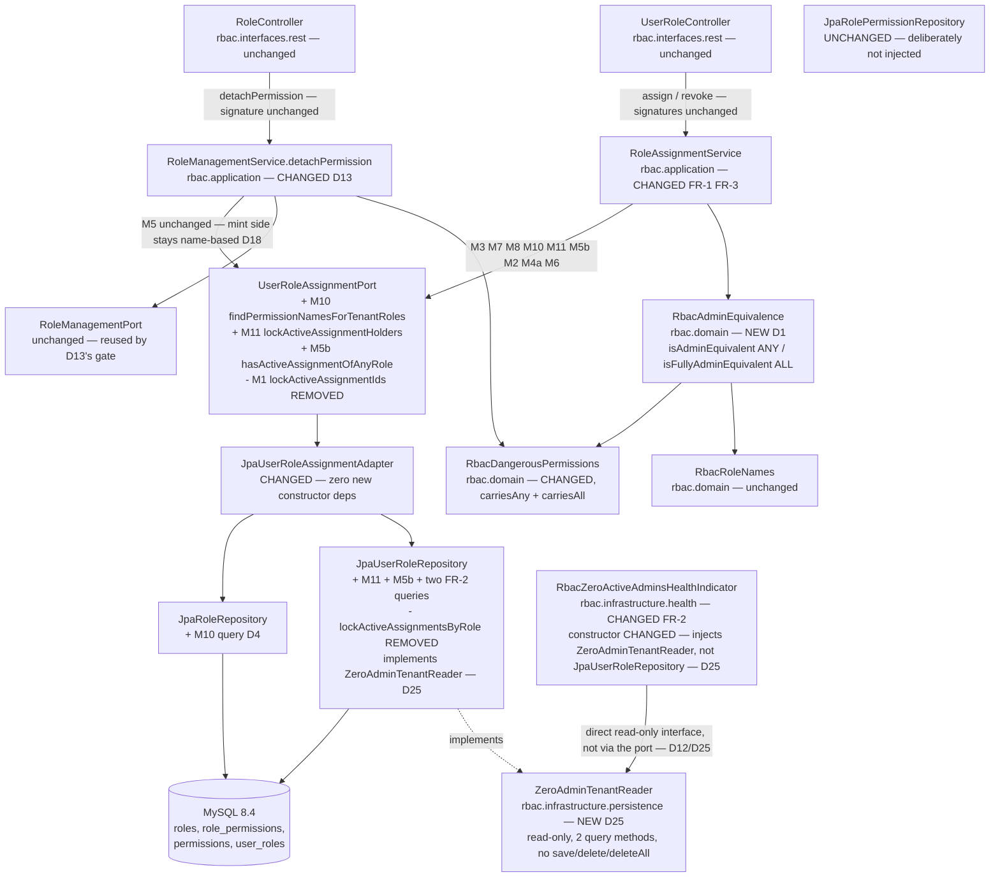
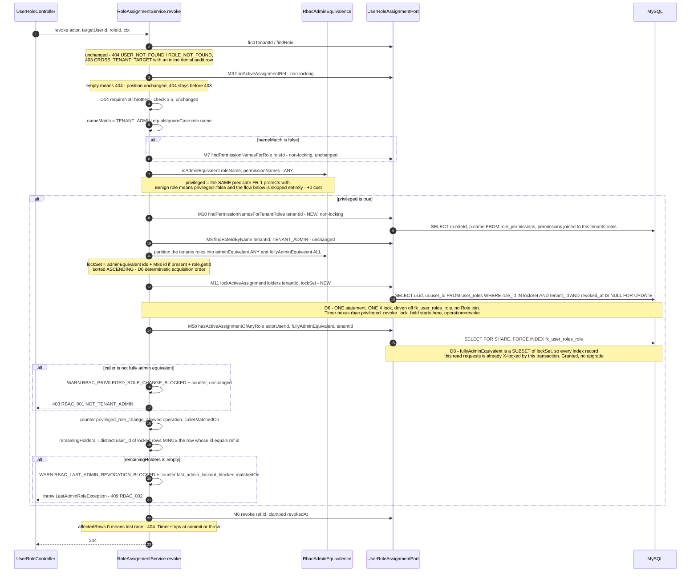
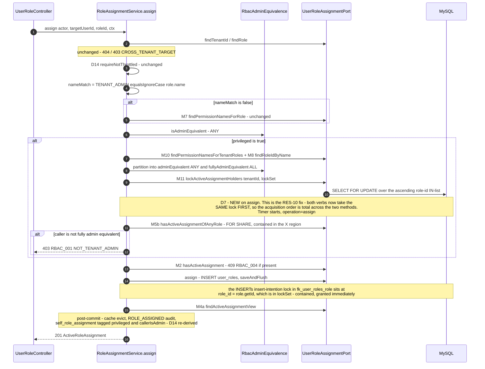
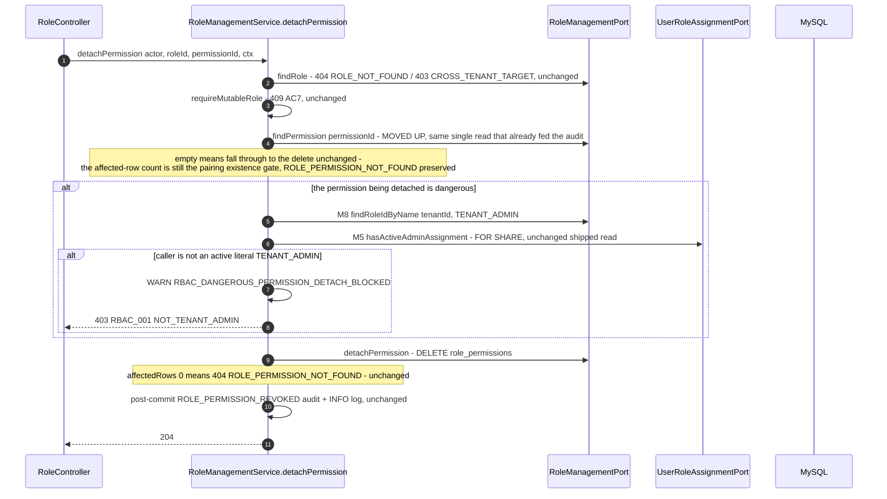
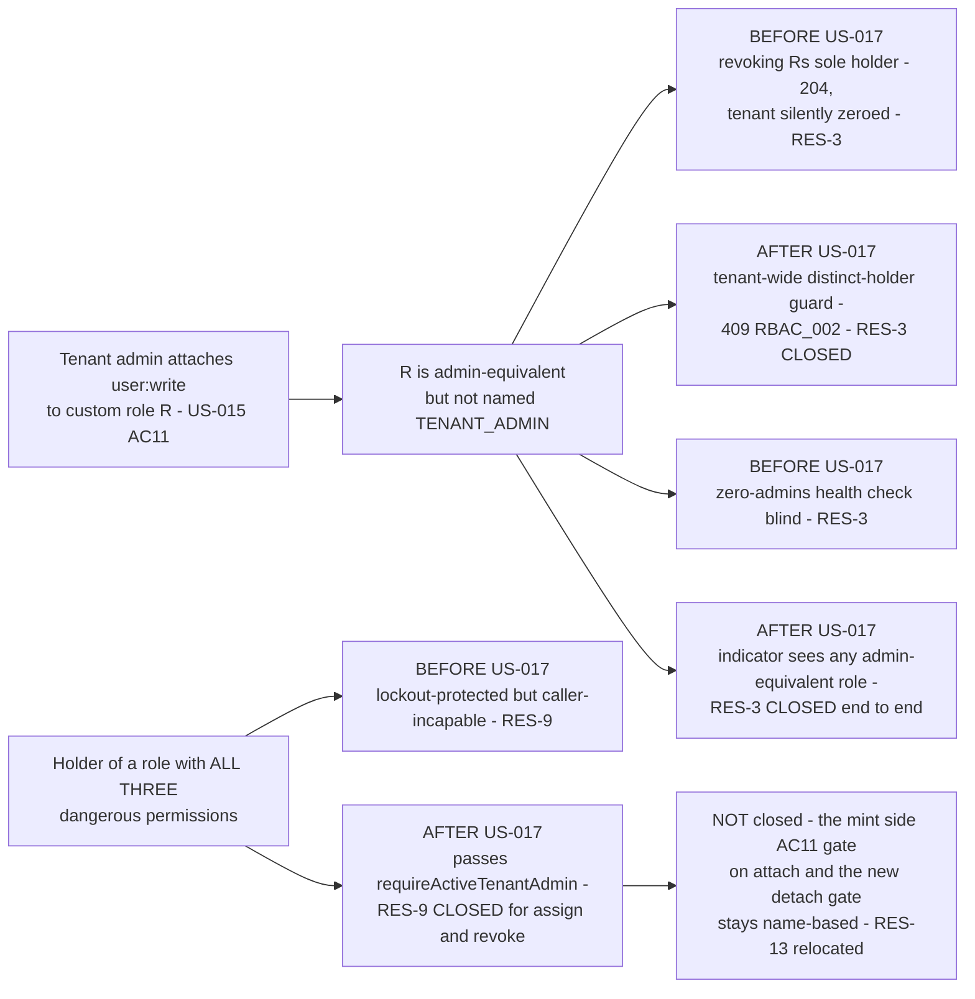

# US-017 — Solution Design: Extend last-admin lockout protection to admin-equivalent custom roles

**Feature:** Tenant-wide, privilege-based last-admin lockout (FR-1), admin-equivalent zero-admin detection (FR-2), and a privilege-based **caller**-side admin test (FR-3 / RES-9)
**Epic:** EPIC-002 (RBAC Foundation)
**Phase:** 3 (Solution Design) — Gate 2, Step A
**Author:** Principal Architect
**Status:** **Revision 2 (2026-09-18) — post-threat-model.** Gate 2 Step B (`03b-threat-model.md`) returned a **conditional pass with eight required changes (RC-15…RC-22) and five editorial corrections**. All thirteen are folded in here; §0.1 is the change log. Revision 1 (2026-09-17) is superseded in place — this document, not the diff, is what `/breakdown` consumes.

**Inputs (settled; not re-litigated):**
- `docs/features/US-017/01-requirements.md` **including its "Gate 1 Resolution (approved 2026-09-17)"** — Resolutions 1–3 are binding: admin-equivalent (target side) = `nameMatch || carriesDangerousPermission`; RES-9 is **in scope**; this story gets its own ADR and its own `03b-threat-model.md`.
- `docs/features/US-017/02-impact.md` **including its "Impact-Analysis Resolution (approved 2026-09-17)"** — binding: the FR-3 caller-side predicate is **Option A (ALL three dangerous permissions, or the literal name)**, deliberately a *different, narrower, separately-named* predicate from the target-side ANY test; and `RoleManagementService.detachPermission` gains an AC11-style admin gate **in this story**.
- `docs/features/US-016/03-design.md` and `docs/adr/0017-privilege-based-role-assignment-gate.md` — the shipped design on this exact code path. D1–D18 and ADR-0017 D1–D5 are the baseline this document extends; ADR-0017's **follow-on rules 2 and 6** are what this story supersedes.
- **`docs/features/US-017/03b-threat-model.md` — Gate 2 Step B, binding.** Its RC-15…RC-22 and editorial corrections are requirements on this document. Where it and revision 1 disagree, it wins — with **one stated exception**: RC-17.1's *worked example* would pass `Set<String> dangerousNames` across `UserRoleAssignmentPort`, which contradicts D3 (a decision the same document confirms as upheld in its §4 row 5). The **property** RC-17.1 requires is delivered by D24/M12 instead; see D24 and ADR-0018 D3's Gate 2 amendment. This is an internal inconsistency in the threat model and is flagged back to the security reviewer, not resolved by architect fiat.
- Code verified on branch `QA-002` @ `5f74ac7`.

**Scope delta to price in `/breakdown`:** `RoleAssignmentService` (both verbs), `RoleManagementService` (`detachPermission` **and, new in revision 2, `attachPermission`** — D22), `UserRoleAssignmentPort` (one method removed, **four** added: M10, M11, M5b, M12), `JpaUserRoleRepository`, `JpaRoleRepository`, `RbacZeroActiveAdminsHealthIndicator`, one new `rbac.domain` type, two new `rbac.domain` records, and one new narrow infrastructure interface (`ZeroAdminTenantReader` — D25). **No Flyway migration, no grant change, no new dependency, no REST/DTO change, no Angular file, no Redis.**

---

## 0.1 What revision 2 changes

| Finding | Sev | Disposition |
|---|---|---|
| **RC-15** — the design never mentions US-016 RES-1(b)/T-E21, which FR-3 materially amplifies | **High** | **Accepted in full, including part 3: the threshold-crossing signal ships in this story** (scope decision, 2026-09-18). New **D22** (§9.2/§9.5). RES-1(b) recorded **by citation** in §12.3 with its inherited owner, review date and Epic-3 expiry — no competing entry. §4.2's Javadoc replacement text corrected |
| **RC-16** — D18/RES-13's "the mint side stays narrower" is a direction, not a containment; the promotion is invisible | Med | **Accepted in full.** RES-13, D18 and §7.5 Change 1 reworded; new **D23** emits `RBAC_ADMIN_MINTED_BY_NON_NAMED_ADMIN` + a bounded `{selfTarget}` counter, and gives `privileged_role_change_allowed` a log companion with a subject |
| **RC-17** — M10 is one input with three fail-open consequences, and the canary shares it | Med | **Accepted; preferred option, in a D3-preserving shape.** New **D24**/M12 gives the canary an independent read (different index, statement, scoping; **no input shared with the gate**). The *combinator* remains shared and §9.3/RES-18 say so. **MC-H** added. RES-18 Low → **Medium**, restated over all three consumers |
| **RC-18** — `carriesAll` has a fail-open implementation shape; Java and SQL predicates can drift | Low-Med | **Accepted in full.** §4.1 specifies `carriesAll` as a per-name case-insensitive `anyMatch` — never a count, never `containsAll`. **MC-B** gains three regression cases; **MC-I** added |
| **RC-19** — D16's WARN-only posture inherits an unresolved retention precondition | Med | **Accepted, option 1.** §9.4 mandates retention of all three WARN markers at **≥ 1 year**, the figure named from `docs/observability-standards.md`. Ticket alert on repeated lockout blocks (expressed platform-wide — see §9.4 for why a `tenantId` tag is refused). §13 item 1 goes to Compliance on the corrected posture. **Ops sign-off is a merge-checklist item** |
| **RC-20** — D7's cost paragraph is factually wrong about reachability; the total order is proved over one index; harness C is homogeneous; "ascending" is undefined | Med | **Accepted in full.** §7.3's cost paragraph corrected (M11 precedes the gate on both verbs; D14 is the real bound; RES-11(c) per-replica caveat; `store-type=redis` a **deployment prerequisite**); order restated **per index**; **benign thread added to harness C**; "ascending" defined as unsigned byte-wise order; **RES-19** recorded; `{operation="assign", outcome="denied"}` made first-class; `admin_equivalent_lock_set_size` gains a threshold, alert and runbook action; RES-17 Low → **Medium** |
| **RC-21** — D20 step 3 is detection without forensics | Med | **Accepted in full.** §10.3 step 3 rewritten: `auth_events` attribution query, **executable DBA SQL** in the runbook, run in every environment where either flag was ever `true`, dated evidence retention, and a remediation ticket or written acceptance per affected tenant **before** step 5 |
| **RC-22** — D10's "zero staleness" is false; the indicator holds write capability over `user_roles` | Low-Med | **Accepted in full, preferred option on part 4.** D10's claim corrected; the 30 s actuator TTL recorded as a **security control** and the liveness/readiness exclusion as a **protected property** (+**MC-J**); new **D25** injects `ZeroAdminTenantReader`, so **RES-22 is eliminated, not accepted** |
| Editorial 1 — §12.2 item 4 undersells the `detachPermission` break | — | Corrected: the break that matters is that a non-admin can no longer detach a dangerous permission **at all** (today: 204) |
| Editorial 2 — §6.3 does not state the guard is stronger than a lockout check | — | Added (T-E31): no third party can drive a tenant to the boundary |
| Editorial 3 — §7.5 Change 1's population | — | Corrected to "an active literal `TENANT_ADMIN`, **or** anyone who can become one in a single request" |
| Editorial 4 — §4.3's M5b Javadoc | — | Carries M5's shipped `isEmpty()`/`size()`-only warning |
| Editorial 5 — npm audit baseline | — | §12.1 records the 27 pre-existing frontend toolchain findings as an inherited baseline, not attributable to US-017 |

**Scope delta introduced by revision 2 (price this in `/breakdown`):** `RoleManagementService.attachPermission` is now in scope (D22); the port gains a fourth method (M12, D24); one new infrastructure interface (`ZeroAdminTenantReader`, D25); three new mechanical controls (MC-H, MC-I, MC-J). Still true: **no Flyway migration, no schema change, no grant change, no new dependency, no REST/DTO change, no Angular file, no Redis, no new feature flag.**

---

## 0.2 Decision summary

Every deferred item from Gate 1 and from the Impact-Analysis Resolution is answered below with an explicit decision and a rationale. Nothing is left open. Rows marked **[R2]** were amended by the threat model; D22–D25 are new in revision 2.

| # | Open item | Decision | Source of the question |
|---|---|---|---|
| **D1** | Where the two admin-equivalence predicates live | **New `rbac.domain.RbacAdminEquivalence`** hosting two named static predicates; `RbacDangerousPermissions` remains the single source of the permission *set* and gains `carriesAny` / `carriesAll`. Neither predicate redefines the set — only how it is combined. | Impact-Analysis Resolution 1, requirements FR-7/R4 |
| **D2** | The caller-side predicate and why it differs from the target side | **`isFullyAdminEquivalent` = literal `TENANT_ADMIN` OR a role carrying ALL THREE** of `role:write`, `user:write`, `tenant:write`. Target side stays `isAdminEquivalent` = name OR **ANY**. Four-part written justification in §5.2; MC-B is the mechanical tripwire. | Impact-Analysis Resolution 1 (binding), impact §1.4 R1 (Critical) |
| **D3** | Port discipline — may the dangerous names cross `UserRoleAssignmentPort`? | **No.** ADR-0017 D2 is **upheld, not argued against.** The new tenant-scoped read (M10) returns `(roleId, permissionName)` pairs; the service applies the domain predicate and passes back **role ids**. No port method takes `Set<String> dangerousNames`; the adapter hardcodes nothing. | Impact §1.5, brief item 6 |
| **D4** | Where the new queries are hosted | M10 on **`JpaRoleRepository`** (mirroring M7/D16); M11 and M5b on **`JpaUserRoleRepository`**; FR-2's two queries on `JpaUserRoleRepository`. **`JpaUserRoleAssignmentAdapter`'s constructor is unchanged and `JpaRolePermissionRepository` is still not injected.** | Impact §1.6, brief item 7, ADR-0017 D2 |
| **D5** | The widened lockout predicate | **Distinct holders, not rows.** Block iff the set of distinct `user_id`s holding an active assignment of **any** admin-equivalent role in the tenant, **excluding the assignment row `ref.id()` being revoked**, is empty. `privileged` — not `nameMatch` — now drives the lock, the timer and the guard. **[06-code-review.md H-1, 2026-09-24] Corrected: the DISTINCT-HOLDER CHECK itself is now restricted to the CALLER-QUALIFYING subset** (literal `TENANT_ADMIN` OR ALL THREE dangerous permissions — the same population D2's caller gate admits), not the broader ANY population this row originally specified. An ANY-only holder (e.g. one dangerous permission) can never pass the caller gate, so counting them as a "remaining admin" let a revocation succeed that left the tenant with zero holders able to ever administer it again, while this guard and FR-2's health indicator (also ANY-based, pre-fix) kept reporting healthy. The **lock set** (M11) is UNCHANGED — still the broader ANY population, for deadlock-freedom (D6/D7) and to fail toward more locking on any M7/M10 disagreement; only the in-Java distinct-holder filter over what M11 already locked is narrowed. See `ActiveAssignmentHolder`'s added `roleId` field and `RoleAssignmentService#wouldLeaveTenantWithoutCallerQualifyingHolder`. | Impact §1.2/§1.3 (R2, Critical), requirements Edge Cases 1–3 |
| **D6** | The locking protocol (Gate 1 Open Question 2, Risk R1 Critical) | **One statement, one lock:** a single `PESSIMISTIC_WRITE` read over an **ascending-sorted `role_id` IN-list** covering the tenant's admin-equivalent roles ∪ the target role, driven off `fk_user_roles_role`, **no `Role` join**. M1 (`lockActiveAssignmentIds`) is **removed** — M11 strictly supersedes it. The materialised-flag alternative is rejected (§7.4). | Requirements Open Question 2, impact §6.3 |
| **D7 [R2]** | RES-10 (Gate 1 Gap 3, impact R4 High) | **RES-10 is closed by this story, not re-accepted.** `assign()` acquires the **same** union lock, **first**, on the privileged path — making "union lock first" a **total acquisition order across both verbs**, *total with respect to `fk_user_roles_role`* (§7.3 restates this per index). Empirical exit gate: harness C with the `assign(TENANT_ADMIN)` thread **restored** *and a benign thread added* (RC-20.6). A residual deadlock is an Architect-level escalation; a retry policy is explicitly **not** pre-approved. **Amended:** the lock is acquired **before** the authorization decision on both verbs, so any `user:write` holder can force it — the bound is D14's throttle, not caller privilege (RES-19). | Impact §6.3 item 4, brief item 3; RC-20 |
| **D8** | FR-1's lock scope ↔ FR-3's caller-read scope (impact R5 High) | **Coupled by design, resolved by containment.** The caller-qualifying set (ALL-three) is a **subset** of the locked union (ANY), so the caller's rows are inside the X region on both verbs. ADR-0017 D4's containment proof is **extended, not replaced**. `FORCE INDEX (fk_user_roles_role)` is retained on the caller read; MC-C re-derives the `EXPLAIN`. | Impact §6.3 item 2, brief item 2 |
| **D9** | Fail-closed posture for the widened lookups | Empty caller-candidate set ⇒ **deny without any read**. A throwing lookup **propagates (500)** — an infrastructure failure is not an authorization decision. The lock set always contains M8's literal admin role id and the target role id, so **FR-4's name path never depends on M10**. | Requirements §3 Security, NFR; R-10/T-E18 precedent |
| **D10 [R2]** | FR-2 data source (Gate 1 Open Question 3, Risk R2 High) | **Live widened query. No migration, no index, no cache, no materialisation.** Two tenant-set queries differenced in Java. **No *application-maintained* staleness** — the data is read live on every evaluation. **Corrected (RC-22.1): the shipped 30 s actuator response cache is the only staleness, it is deliberate, and it is a security control** (§8.2); the original "zero staleness" claim was false and was an argument a future engineer could have cited to remove that control. The impact analysis's "measure before buying materialisation" recommendation **holds**. | Requirements Open Question 3, impact §2.2/§6.4; RC-22 |
| **D11** | FR-2's driving tenant set (impact R7) | **Unchanged in kind:** drive off tenants that have **at least one** admin-equivalent role. A tenant with **no** admin-equivalent role at all stays invisible, exactly as today. Explicit decision with an on-call cost, recorded as **RES-14**. | Impact §1.8, requirements Edge Case 6 |
| **D12 [R2]** | The health indicator's name-set asymmetry with D3 | **Deliberate and stated.** The indicator does **not** go through the port and already passes `RbacRoleNames.TENANT_ADMIN` this way; it may pass `RbacDangerousPermissions.NAMES` the same way. D3's rule binds the **port**, not this component. The pre-existing non-sargable `UPPER(r.name)` is **dropped**. **Amended (RC-22.4): it no longer injects `JpaUserRoleRepository`** — see **D25**. The *set* crosses into SQL and propagates automatically; the *combinator* does not, and **MC-I** is the equivalence proof (RES-23). | Impact §1.8, brief item 4; RC-22 |
| **D13** | `detachPermission`'s AC11-style gate | **Symmetric with `attachPermission`:** gate when the **detached** permission is dangerous, placed **before** the pairing-existence check (mirroring AC11-before-AC4), reusing the `findPermission` read the method already performs. One stated behavioural narrowing: 404 → 403 for a non-admin detaching a dangerous permission that is not attached. | Impact-Analysis Resolution 2 (binding), impact §2.3 item 2 / R3 |
| **D14 [R2]** | The `nexus_rbac_gate_bypass_canary` re-derivation (impact R6) | `callerIsAdmin` keeps a **second, independent** mechanism but is **re-derived against the caller-side predicate**, via a **new helper separate from `listActive`'s redaction helper**. **Alert expressions stay byte-identical.** The two mechanisms are not collapsed. **Amended (RC-17.1): the canary no longer consumes the gate's own input** — it derives the ALL-three half from **M12** (D24), a separate read on a separate index with separate scoping. | Impact §5.4, brief item 5; RC-17 |
| **D15 [R2]** | Observability additions, incl. requirements Open Question 8 | New counter `nexus.rbac.last_admin_lockout_blocked{matchedOn}` at the throw site (a counter *beside* the coarse one, never an edit to the generic handler); new `nexus.rbac.privileged_role_change_allowed{operation, callerMatchedOn}`; the lock-hold timer gains an `operation` tag and two outcomes; a new `nexus.rbac.admin_equivalent_lock_set_size` summary; widened WARN fields. **Amended (RC-19.2, RC-20.2/20.4):** a repeated-lockout ticket alert; `{operation="assign", outcome="denied"}` promoted to a **first-class** series with a runbook entry; `admin_equivalent_lock_set_size` gains a soak-derived p99 threshold, a ticket alert and a runbook action. See also D22/D23's signals. | Requirements Open Question 8, impact §1.1; RC-19, RC-20 |
| **D16 [R2]** | Requirements Open Question 9 — durable audit row on a lockout block | **No.** WARN-only is retained, with reasons (§9.4). **Amended (RC-19.1): the decision now carries its precondition in writing** — the three WARN markers must be retained **at least as long as `auth_events`, minimum 1 year**, the figure named rather than implied, per US-015 RES-10's own resolution. Ops sign-off is a merge-checklist item. Flagged to Compliance **on the corrected posture**. | Requirements Open Question 9; RC-19 |
| **D17** | `listActive`'s `assignedBy` redaction | **Unchanged — stays literal-name-based.** A disclosure decision (O-10/T-I5), not an authorization decision; widening it was never analysed. Recorded as **RES-15**. | Impact §1.1 |
| **D18 [R2]** | The mint-side AC11 caller test (attach **and** the new detach gate) | **Stays name-based.** The asymmetry is **relocated, not eliminated** — recorded explicitly in ADR-0018 per ADR-0017 follow-on rule 5. **Corrected (RC-16.1): it is narrower *by construction* but it bounds nothing and is NOT a containment** — a fully admin-equivalent caller reaches the mint-side population in **one self-assignment** of the literal `TENANT_ADMIN`. Recorded for definitional consistency, not as a control. The promotion itself is now signalled (**D23**). **RES-13**, re-rated **Medium**. | Impact §11; RC-16 |
| **D19** | Feature flag | **No new flag.** Rides the two shipped default-off kill switches. FR-3's "off" state would be *incoherent*, not safe (§10.1). FR-2 is deliberately **not** flag-gated. | Impact §9.3, US-016 D10 |
| **D20 [R2]** | Rollout | Merge behind existing flags → staging soak with the **reshaped harness C (restored `assign(TENANT_ADMIN)` thread + new benign thread) as the exit gate** → a one-off pre-deploy **forensic** sweep for already-zeroed tenants → production deploy is a no-op except FR-2. **Amended (RC-21): step 3 is no longer detection-only** — it carries `auth_events` attribution, executable DBA SQL, every environment where either flag was ever `true`, dated evidence retention, and a required remediation ticket or written acceptance per affected tenant **before** step 5. | Impact §10.2, US-016 §10.3; RC-21 |
| **D21** | Gap 7 — US-016's deferred AC8 self-assignment precedence question | **Discharged: there is no precedence to resolve.** One actor-agnostic gate; self-assignment is gated identically to third-party assignment. The only self-specific behaviour remains the post-commit canary counter. *(Consequence drawn by D23: the most sensitive self-assignment FR-3 newly permits is the one to the literal `TENANT_ADMIN`, and it is now signalled.)* | Gate 1 Resolution 2, requirements Gap 7 |
| **D22** *(new, R2)* | RC-15.3 — the attach-side threshold-crossing signal | **Ships in US-017, not deferred to a successor.** On `attachPermission`'s dangerous path only, **after** the attach, one bounded M7 read; when `isFullyAdminEquivalent` becomes true, emit WARN `RBAC_ROLE_BECAME_FULLY_ADMIN_EQUIVALENT` `{tenantId, roleId, roleName, holderCount, grantedBy}` + counter `nexus.rbac.role_became_fully_admin_equivalent{holders}`. **Ticket severity; page when `holderCount > 0`.** One query, admin-only path, no schema change, no new port method — the same shape and justification as US-016 RC-8.3, which shipped. §9.2 (signal definitions), §9.5 (US-015 monitoring.md edit). | Threat model T-E27 (High), RC-15.3 |
| **D23** *(new, R2)* | RC-16.2/16.3 — the promotion signal and a subject for the loosening | At the gate's **pass** point, when `callerMatchedOn == ALL_DANGEROUS_PERMISSIONS` **and** the target role is the literal `TENANT_ADMIN`: WARN `RBAC_ADMIN_MINTED_BY_NON_NAMED_ADMIN` `{tenantId, actorUserId, targetUserId, roleId}` + bounded counter `nexus.rbac.admin_minted_by_non_named_admin{selfTarget}` (2 series). **Ticket; page on self-target** — the counter exists because this repo's page tier is PromQL-driven (`nexus_rbac_gate_bypass_canary` precedent); alerting on a raw log marker would not reach it. Separately, `privileged_role_change_allowed` gains a **log companion** `{tenantId, actorUserId, targetUserId, roleId, roleName, operation}` for the `ALL_DANGEROUS_PERMISSIONS` population only. **Zero new queries.** §9.2. | Threat model T-E28 / T-R11, RC-16 |
| **D24** *(new, R2)* | RC-17.1 — an independent derivation for the canary | **New port read M12** — `(roleId, permissionName)` pairs for the **caller's own active assignments**, non-locking, driven off `fk_user_roles_user`; the service applies the domain predicate. Gives the canary a different index, statement, join direction and scoping, and **no input shared with the gate**. **D3 is upheld, not reopened** — the threat model's illustrative SQL would have passed the dangerous names across the port, which D3 forbids and which the same document confirms as upheld. **The one axis not bought: the `isFullyAdminEquivalent` combinator remains shared**, pinned by §4.1's spec + MC-B and recorded honestly in RES-18. §9.3. | Threat model T-E29, RC-17.1 |
| **D25** *(new, R2)* | RC-22.4 — narrow the detection control's capability | The health indicator injects a **new read-only interface `ZeroAdminTenantReader`** (two query methods) instead of the full `JpaUserRoleRepository`, which `extends JpaRepository` and therefore carries `save`/`delete`/`deleteAll` over `user_roles`. `JpaUserRoleRepository` also implements it; zero query changes, zero behaviour change. **This eliminates RES-22 rather than accepting it** — the preferred option, and US-016 RC-12's own fallback shape applied one component over. §4.8. | Threat model T-T14, RC-22.4 |

---

## 1. Goals and non-goals

**What this story is:** the *detection-and-protection* half of the privilege-based RBAC shift US-016 started, plus the caller-side completion of it.

Goals, in priority order:

1. **Make the tenant's ≥1-admin-equivalent-holder invariant real** (FR-1) — tenant-wide, distinct-holder, race-free.
2. **Make the detective control see the same population the preventive control protects** (FR-2, FR-7).
3. **Close the asymmetry US-016 created** (FR-3 / RES-9) **without making the gate vacuous** — impact §1.4's Critical finding.
4. **Do not widen a known deadlock.** §7 is the load-bearing section, and RES-10 is closed there rather than inherited.
5. **Do not create a detection regression while fixing a security hole** — §9's canary re-derivation (the same failure class US-016 R5/R8/M-2 were written about).
6. **Add as little to the platform as the threat model permits.** Zero migrations, grants, dependencies, endpoints, flags, cache keys.

**Non-goals:** any REST/DTO/status-code change (§6.1); any frontend change; remediation of tenants already at zero admin-equivalent holders in code (it is a one-off DBA sweep plus FR-2's own first run — §10.3); a materialised per-tenant admin-flag (§7.4); making the *mint*-side AC11 test privilege-based (D18); widening `listActive`'s redaction (D17); Redis.

---

## 2. Architecture

Nothing moves between layers. One new domain type, three port methods added and one removed, two repository queries added on each of two repositories, two application services changed, one health indicator changed.



**Hexagonal conformance (ADR-0002).** The ANY/ALL policy lives in `rbac.domain`. Every new capability is an outbound-port read implemented in `rbac.infrastructure.persistence`. `rbac` still imports nothing from `identity` (`HexagonalArchitectureTest.rbac_must_not_depend_on_identity` stays green). `rbac_application_methods_must_not_accept_principal_or_map` stays green — the new private methods take `UUID`, `Set<UUID>`, `List<String>` and `RoleChangeActor` only. `role_management_service_must_not_call_the_non_locking_admin_read` stays green: D13's gate reuses the shipped `verifyCallerIsActiveTenantAdmin`, which uses M5's locking read.

**Frontend:** no change (impact §4, re-verified). Forward note for Epic 3, unchanged from impact §4: a role-management UI must treat 409 `RBAC_002` on revoking a **custom** role as a normal outcome, not only on `TENANT_ADMIN`.

---

## 3. Sequence diagrams

### 3.1 `revoke()` — the widened lockout path



### 3.2 `assign()` — the widened caller-check path, and the RES-10 fix



### 3.3 `detachPermission()` — the new symmetric gate (D13)



### 3.4 What this story closes, and what it relocates



---

## 4. Component design

Layering is unchanged: policy in `rbac.domain`, decisions in `rbac.application`, reads in `rbac.infrastructure.persistence`, the detective control in `rbac.infrastructure.health`.

### 4.1 `rbac.domain.RbacAdminEquivalence` — new (D1)

Single home for the **two named predicates**, so a future reader cannot reintroduce the vacuity bug by assuming symmetry. It derives from, and never duplicates, the permission set.

```java
/** Two deliberately different admin-equivalence tests. See ADR-0018 D1/D2 for why they differ. */
public final class RbacAdminEquivalence {

  /** TARGET side (FR-1, FR-2, and US-016's gate condition): name OR ANY dangerous permission. */
  public static boolean isAdminEquivalent(String roleName, Collection<String> permissionNames);

  /** CALLER side (FR-3): name OR ALL THREE dangerous permissions. STRICTLY NARROWER — never
   *  substitute one for the other; an ANY caller test is vacuous (ADR-0018 D2). */
  public static boolean isFullyAdminEquivalent(String roleName, Collection<String> permissionNames);

  private RbacAdminEquivalence() {}
}
```

`RbacDangerousPermissions` gains two combinators and keeps `NAMES` as the only definition of the set:

```java
public static boolean carriesAny(Collection<String> permissionNames);   // NEW
public static boolean carriesAll(Collection<String> permissionNames);   // NEW
```

**`carriesAll` has a fail-open shape that `carriesAny` does not, and its implementation is therefore specified here, not left to the implementer (RC-18.1):**

> **`carriesAll` MUST be a per-name, case-insensitive `anyMatch`** — for each of the three names independently, does the collection contain a case-insensitive match?

- **Never a count.** `permissionNames.stream().filter(RbacDangerousPermissions::contains).count() >= 3` returns **`true`** for `["user:write","user:write","user:write"]` — it **fails open**, on the caller-side predicate, which is the one direction §5.2 reason 3 says must never fail open.
- **Never `containsAll`.** That is case-**sensitive**: it fails closed, but silently, and would deny a legitimate `Role:Write` variant.
- M10 cannot produce duplicates today (`pk_role_permissions` plus `uq_permissions_name`), so the trap is **latent, not live** — which is precisely when it is cheap to pin and expensive to discover. **MC-B** carries the three regression assertions.

**Why a new domain type rather than private service methods:** `RbacDangerousPermissions`'s own Javadoc states the rule — *"single-sourced here rather than as a private field on `RoleManagementService` so the set is directly unit-testable under the `*.domain.*` coverage gate"*. The same argument applies to the predicates, and more strongly, because two services and one health indicator now reason about admin-equivalence. **Coverage note:** `rbac.domain` carries the 0.90 JaCoCo gate; both predicates plus the two new records (§4.3) need companion unit tests, and the known `toString()` coverage trap on records applies — no custom `toString()` is added on any of them, and the records are exercised by construction plus accessor use in the domain tests.

### 4.2 `rbac.application.RoleAssignmentService` — changed

**Constructor: unchanged.** No new collaborator, no new `@Value`. Every new capability lands on the port it already holds.

```java
// changed: privileged now drives the lock, the timer and the lockout guard (D5)
@Transactional public void revoke(RoleChangeActor, UUID targetUserId, UUID roleId, RequestContext);

// changed: acquires the same union lock first on the privileged path (D7)
@Transactional public ActiveRoleAssignment assign(RoleChangeActor, UUID targetUserId, UUID roleId, RequestContext);

// NEW — resolves the tenant's two role-id sets from ONE M10 read plus M8 (D3, D9).
//        Returned as a small carrier so the two sets can never be built from two different reads.
private AdminEquivalentRoles resolveAdminEquivalentRoles(UUID tenantId, Role targetRole, boolean nameMatch);

// CHANGED — generalised from one roleId to the caller-qualifying set; still ONE call site (D4/D8).
//           Empty set ⇒ deny WITHOUT calling the port (D9).
private void requireActiveTenantAdmin(
    RoleChangeActor actor, UUID targetUserId, Role role, String requiredPermission,
    String operation, boolean nameMatch, AdminEquivalentRoles roles, RequestContext ctx);

// NEW — D5's predicate, expressed once, covering requirements Edge Cases 1, 2 and 3 structurally.
private static boolean wouldLeaveTenantWithoutAdminEquivalentHolder(
    List<ActiveAssignmentHolder> lockedHolders, UUID revokedAssignmentId);

// NEW — D14's canary source. A SECOND, INDEPENDENT mechanism, and deliberately NOT the same
//       method listActive uses for its redaction (D17).
private boolean callerHoldsActiveAdminEquivalentRole(RoleChangeActor actor, AdminEquivalentRoles roles);

// UNCHANGED and explicitly not reused by anything above: callerHoldsActiveTenantAdmin — listActive's
// literal-name-based redaction helper (MC-2's target; D17 keeps it as-is).
private boolean callerHoldsActiveTenantAdmin(RoleChangeActor actor);
```

`carriesDangerousPermission(UUID roleId)` is **replaced** by a call to `RbacAdminEquivalence.isAdminEquivalent(role.getName(), port.findPermissionNamesForRole(roleId))`, so the gate's condition and the target-side admin-equivalence predicate become literally the same function call — FR-7 by construction, not by convention.

**Javadoc: replace, never delete** (US-015 D13 / US-016 §12.2 item 7 discipline). The sentence at `RoleAssignmentService.java:138-140` and `:276-278` — *"Also surviving: AC5's last-admin lockout still protects only the literally-named TENANT_ADMIN (RES-3), and the caller-side admin test remains name-based (RES-9)"* — becomes false and is replaced verbatim with:

> **Closed by US-017:** RES-3 — the last-admin lockout now protects the tenant-wide set of **distinct holders** of **any** admin-equivalent role (literal `TENANT_ADMIN` or any `RbacDangerousPermissions` member), and `RbacZeroActiveAdminsHealthIndicator` detects the same population. RES-9 — the **caller**-side admin test is privilege-based, using a deliberately **narrower** predicate than the target-side one: literal `TENANT_ADMIN` **or all three** dangerous permissions (`RbacAdminEquivalence.isFullyAdminEquivalent`). **Do not "simplify" the caller-side test to the target-side ANY predicate: it is vacuous, because every caller who reaches this code holds `user:write`, which is itself in the dangerous set** (ADR-0018 D2).
> **Relocated, not closed — and NOT a containment:** the *mint*-side AC11 caller test on `RoleManagementService.attachPermission`/`detachPermission` remains name-based (US-017 RES-13). It is narrower **by construction**, but it bounds nothing: a fully admin-equivalent caller may self-assign the literal `TENANT_ADMIN` in a **single request** and is thereafter a mint-side administrator. Do not read this asymmetry as a control to preserve.
> **Amplified, not closed — read this before assuming the surviving escalation path is unaffected:** US-016 **RES-1(b) / T-E21**, the attach-after-assign pre-positioning path, is **not** closed here and this change **increases its payoff**. A `user:write` holder who self-assigned a benign custom role is silently escalated when an administrator later attaches dangerous permissions to it. Before US-017 that yielded admin-equivalent *permissions*, effective at the next token mint and insufficient to pass this gate. **After US-017 it yields caller-side administrative capability, effective on the next request from a live DB read, and the literal `TENANT_ADMIN` one self-assignment later.** Likelihood unchanged; impact materially increased. Detection, not prevention: `RBAC_ROLE_BECAME_FULLY_ADMIN_EQUIVALENT` (US-017 D22) reports the moment a role crosses the threshold.
> See `docs/features/US-017/03-design.md` and ADR-0018.

### 4.3 `UserRoleAssignmentPort` — one method removed, four added (D3)

`RoleManagementPort` is still **not** injected here; ADR-0017 D2's reasoning is unchanged and unweakened by this story.

```java
/**
 * M10 (US-017 D3) — every (roleId, permissionName) pair for the roles of ONE tenant. Bounded at
 * nexus.rbac.max-roles-per-tenant (default 500) x |permissions| = 7.
 *
 * <p>Deliberately returns NAMES paired with role ids, not a verdict and not a filtered set: the
 * ANY/ALL policy lives in rbac.domain.RbacAdminEquivalence and MUST NOT cross this port in either
 * direction — not hardcoded in the adapter and NOT passed in as a Set<String> parameter either
 * (ADR-0017 D2, upheld by ADR-0018 D3). A future "pushForFilter(Set<String> dangerousNames)"
 * variant would violate that rule and requires an ADR that argues against it explicitly.
 *
 * <p>MUST be a plain, NON-LOCKING read and MUST NEVER be annotated @Lock: it touches
 * `permissions`, on which nexus_app holds SELECT only (MC-A).
 */
List<RolePermissionName> findPermissionNamesForTenantRoles(UUID tenantId);

/**
 * M11 (US-017 D6) — locks (PESSIMISTIC_WRITE) and returns the (assignmentId, userId) pair for
 * every ACTIVE assignment of ANY role in {@code roleIds} within {@code tenantId}. Supersedes and
 * REPLACES M1 lockActiveAssignmentIds.
 *
 * <p>{@code roleIds} MUST be sorted ASCENDING by the caller — this is the deterministic
 * acquisition order D6's deadlock-freedom argument rests on, and it is a contract of this method,
 * not an implementation detail of one caller.
 *
 * <p>"ASCENDING" means <b>unsigned byte-wise order of the 16-byte representation</b>, matching
 * MySQL's BINARY(16) comparison — NOT {@link java.util.UUID#compareTo}, which compares
 * mostSigBits as a SIGNED long. The two coincide for every id in the system today (seeded ids
 * have a clear high bit; UUIDv7 keeps it clear until ~year 6429), so a divergence would be
 * latent, not live — which is exactly when it must be pinned. MC-E asserts THIS comparator; an
 * MC-E that merely asserted "sorted" would pass under an ordering that does not match the
 * database's and give false assurance about the one property D6 rests on.
 *
 * <p>The Java sort is belt-and-braces: the real guarantee is the PLAN. An ascending range scan on
 * fk_user_roles_role acquires in index order regardless of IN-list order, so <b>plan stability
 * across IN-list cardinalities is part of the claim</b>, not a fixture detail — MC-C asserts
 * key = fk_user_roles_role for IN-lists of size 1, 2 and >= 20. A full-scan fallback would
 * acquire in primary-key order and break the argument.
 *
 * <p>The adapter MUST drive off {@code role_id} (fk_user_roles_role) as an IN-list range, never
 * {@code tenant_id}, and MUST NOT join {@code Role} — joining would widen the lock beyond
 * user_roles. Tenant containment is therefore carried by two things together: the role-id set is
 * tenant-derived by the caller, and {@code tenant_id} remains a residual predicate (T-S1).
 *
 * <p>Returns ids only, never entities — the caller must not be able to load-mutate-save a UserRole.
 * Must be called inside an active transaction.
 */
List<ActiveAssignmentHolder> lockActiveAssignmentHolders(UUID tenantId, List<UUID> roleIds);

/**
 * M5b (US-017 D8) — generalises M5 from one roleId to a set. Same non-negotiable contract: a
 * FRESH, LOCKING (PESSIMISTIC_READ / FOR SHARE) read, never a JWT claim (T-E7), never a plain
 * non-locking read. MUST keep FORCE INDEX (fk_user_roles_role) so that every index record it
 * requests is inside M11's X region (ADR-0018 D4's containment proof; MC-C).
 *
 * <p>An EMPTY {@code roleIds} means the caller has no way to qualify: the caller MUST fail closed
 * and MUST NOT call this method at all (R-10 / T-E18 precedent).
 *
 * <p>Carried verbatim from M5 (US-017 editorial correction): the adapter MUST inspect only
 * {@code .isEmpty()} / {@code .size()} on the returned rows and MUST NEVER mutate them. Returning
 * managed entities from a locking read is a load-mutate-save hazard; the boolean is the contract,
 * the entities are an implementation artefact.
 */
boolean hasActiveAssignmentOfAnyRole(UUID userId, List<UUID> roleIds, UUID tenantId);

/**
 * M12 (US-017 D24) — every (roleId, permissionName) pair for the roles of the CALLER'S OWN active
 * assignments in one tenant. Sibling of M7, keyed by USER rather than by role.
 *
 * <p>Exists solely to give the bypass canary (D14/§9.3) a derivation that shares NO INPUT with the
 * gate. It MUST be driven off fk_user_roles_user — a different index, a different statement and a
 * different scoping from M10, which is tenant-scoped and driven off r.tenantId. An over-broad M10
 * therefore cannot silence the canary that exists to notice it (threat model T-E29).
 *
 * <p>MUST be a plain, NON-LOCKING read, and MUST NEVER be used for an authorization decision — the
 * gate's only determination is M5b, a fresh locking read (T-E7). MC-G asserts this negative on both
 * verbs.
 *
 * <p>Like M10, returns NAMES paired with role ids: the ANY/ALL policy lives in
 * rbac.domain.RbacAdminEquivalence and MUST NOT cross this port in either direction (ADR-0017 D2 /
 * ADR-0018 D3, upheld — this method is the reason D3 did not have to be reopened to satisfy RC-17).
 */
List<RolePermissionName> findPermissionNamesForActiveAssignmentsOfUser(UUID userId, UUID tenantId);
```

**Removed:** `List<UUID> lockActiveAssignmentIds(UUID tenantId, UUID roleId)` (M1) and its repository query `lockActiveAssignmentsByRole`. M11 with a singleton list is a strict superset; leaving M1 in place would ship a second, unused locking-read site and a second index-discipline site — exactly what ADR-0017 D2's "one query, one index-discipline site" rule exists to prevent.

**Retained unchanged:** M2, M3, M4, M4a, M5 (still the mint side's read — D18), M6, M7, M8, M9.

Two new `rbac.domain` records, mirroring `ActiveAssignmentRef`'s shape and rationale:

```java
public record ActiveAssignmentHolder(UUID assignmentId, UUID userId) {}
public record RolePermissionName(UUID roleId, String permissionName) {}
```

### 4.4 `JpaUserRoleAssignmentAdapter` — changed, **zero new constructor dependencies** (D4)

Both repositories are already injected. M10 delegates to `roleRepository`; M11 and M5b delegate to `userRoleRepository`. `JpaRolePermissionRepository` is still not injected — ADR-0017 D2's second half is restated in the adapter Javadoc, extended with one sentence: *the tenant-scoped permission read (M10) is hosted on `JpaRoleRepository` for the same reason M7 is.*

M5b, like M5, is a native query, so the adapter converts `UUID → byte[]` explicitly for the IN-list (the existing `toBytes` helper, reused).

### 4.5 `JpaRoleRepository` — one new query (D4)

```java
@Query("""
    SELECT new com.example.nexus.rbac.domain.RolePermissionName(rp.id.roleId, p.name)
    FROM Role r, RolePermission rp, Permission p
    WHERE rp.id.roleId = r.id AND rp.id.permissionId = p.id AND r.tenantId = :tenantId
    """)
List<RolePermissionName> findPermissionNamesByTenantRoles(@Param("tenantId") UUID tenantId);
```

Comma-join JPQL, never native SQL, so `UuidV7Converter` handles `UUID ↔ BINARY(16)`. No `@Lock` (MC-A). No `ORDER BY` — the caller builds sets. Driven by `uq_roles_tenant_name`'s leftmost `tenant_id` prefix into `pk_role_permissions`'s leftmost `role_id` prefix into `permissions`' PK: indexed end to end, no new index.

**Roles with zero attached permissions do not appear in M10's result.** That is correct and deliberate: such a role is admin-equivalent only if it is literally named `TENANT_ADMIN`, and that half is answered by M8, not M10 (D9).

### 4.6 `JpaUserRoleRepository` — two locking queries replaced/added, two FR-2 queries added

```java
/** M11 — see UserRoleAssignmentPort#lockActiveAssignmentHolders. Driven off fk_user_roles_role as
 *  an IN-list range; NO Role join (lock-scope discipline inherited verbatim from the removed M1). */
@Lock(LockModeType.PESSIMISTIC_WRITE)
@Query("""
    SELECT new com.example.nexus.rbac.domain.ActiveAssignmentHolder(ur.id, ur.userId)
    FROM UserRole ur
    WHERE ur.roleId IN :roleIds AND ur.tenantId = :tenantId AND ur.revokedAt IS NULL
    """)
List<ActiveAssignmentHolder> lockActiveAssignmentHoldersByRoles(
    @Param("tenantId") UUID tenantId, @Param("roleIds") List<UUID> roleIds);

/** M5b — native, FOR SHARE, FORCE INDEX (fk_user_roles_role). Same rationale, binds and caveats as
 *  the shipped lockActiveAdminAssignment, generalised to an IN-list. */
@Query(value = """
    SELECT * FROM user_roles FORCE INDEX (fk_user_roles_role)
    WHERE user_id = :userId AND role_id IN (:roleIds)
      AND tenant_id = :tenantId AND revoked_at IS NULL
    FOR SHARE
    """, nativeQuery = true)
List<UserRole> lockActiveAssignmentOfAnyRole(
    @Param("userId") byte[] userId, @Param("roleIds") Collection<byte[]> roleIds,
    @Param("tenantId") byte[] tenantId);
```

**Implementation risk, named here rather than discovered later:** a `@Lock`-annotated JPQL constructor-expression projection is legal in Hibernate but the emitted `FOR UPDATE` on a projection is worth verifying — if it does not render, fall back to selecting the entity and mapping to `ActiveAssignmentHolder` in the adapter (the shape the removed M1 already used). **MC-A asserts the `for update` clause is emitted**, so this cannot regress silently.

FR-2's two queries are in §8.2.

### 4.7 `rbac.application.RoleManagementService.detachPermission` — the new gate (D13)

Public signature unchanged. The only structural change is that the existing `findPermission(permissionId)` read **moves above** the delete, where it now serves both the gate and the audit — so the statement count is unchanged.

```java
@Transactional
public void detachPermission(RoleChangeActor actor, UUID roleId, UUID permissionId, RequestContext ctx);
```

Order: `resolveRoleInTenant` (404/403) → `requireMutableRole` (409, AC7) → `findPermission` (Optional) → **if the permission exists and is dangerous, `verifyCallerIsActiveTenantAdmin`** (403) → `detachPermission` (0 rows ⇒ 404 `ROLE_PERMISSION_NOT_FOUND`) → post-commit audit.

Five deliberate properties:

- **Symmetric with `attachPermission`.** Same gate method, same `DenialReason`, same 403 shape, same position relative to the pairing-state check (AC11 precedes AC4 on attach; the detach gate precedes the affected-row check).
- **Keyed on the detached permission being dangerous**, not on "is this the role's last dangerous permission". The narrower condition would require a second read and would still leave a race; the broader condition is simpler, strictly safer, and symmetric.
- **The `ROLE_PERMISSION_NOT_FOUND` contract is preserved** for an unknown permission id: an empty `findPermission` skips the gate and falls through to the delete, which returns 0 rows exactly as today.
- **One stated behavioural narrowing (the story's fourth intended break):** a non-admin detaching a *dangerous* permission that is **not attached** to the role now receives **403** where it received **404**. This removes an attachment-existence oracle and matches attach's ordering; call it out in the release notes.
- **New WARN marker `RBAC_DANGEROUS_PERMISSION_DETACH_BLOCKED`**, mirroring the shipped attach-side marker field for field.

`detachPermission`'s Javadoc sentence *"No AC11 gate — detaching a permission reduces privilege, a deliberate asymmetry with attachPermission"* is **replaced** (not deleted) with the US-017 reasoning: detaching a dangerous permission does not merely reduce privilege, it can **flip a role out of admin-equivalence**, which is an input to a security guard (`RoleAssignmentService`'s widened lockout) — so the asymmetry is no longer safe and is closed here.

### 4.8 `RbacZeroActiveAdminsHealthIndicator` — changed (FR-2)

**Constructor changed (D25).** Injects the new narrow read-only interface `ZeroAdminTenantReader` (two query methods), not `JpaUserRoleRepository` directly. `JpaUserRoleRepository` implements `ZeroAdminTenantReader`, so the indicator no longer carries `save`/`delete`/`deleteAll` capability over `user_roles` merely to run two read-only queries — zero query changes, zero behaviour change (threat model T-T14, RC-22.4). D12's ruling is otherwise unaffected: the indicator still does not go through the port, and it still passes `RbacRoleNames.TENANT_ADMIN` / `RbacDangerousPermissions.NAMES` directly into its queries. Logic:

```java
Set<UUID> tenantsWithAnAdminEquivalentRole =
    repo.findTenantsWithAnAdminEquivalentRole(RbacRoleNames.TENANT_ADMIN, RbacDangerousPermissions.NAMES);
Set<UUID> tenantsWithAnActiveAdminEquivalentHolder =
    repo.findTenantsWithActiveAdminEquivalentHolders(RbacRoleNames.TENANT_ADMIN, RbacDangerousPermissions.NAMES);
affected = tenantsWithAnAdminEquivalentRole minus tenantsWithAnActiveAdminEquivalentHolder;
```

Unchanged: the count-only actuator detail (FR-6, 07-security-review M-1), the full id list in the WARN, and the `catch (DataAccessException) → UNKNOWN` posture. Rewritten: the class Javadoc, the WARN message text, and the `issue` string (§8.2).

---

## 5. The two predicates

### 5.1 Target side — `isAdminEquivalent` (ANY)

Identical to `assign()`/`revoke()`'s shipped gate predicate, per Gate 1 Resolution 1. It answers: **"could gaining or losing this role change who is able to administer this tenant?"** ANY is right, because each of the three permissions is independently sufficient to escalate further — that is the basis on which US-015 defined the set in the first place.

Used by: FR-1's lock set and holder count, FR-2's detection query, and `privileged` (the gate's own condition). One predicate, three consumers — FR-7 satisfied structurally rather than by review.

### 5.2 Caller side — `isFullyAdminEquivalent` (ALL) — D2's written justification

**The predicate:** the caller passes iff they hold an active assignment of a role that is literally named `TENANT_ADMIN` **or** carries **all three** of `role:write`, `user:write` and `tenant:write`.

Why it is deliberately *not* the target-side predicate — four independent reasons, any one of which is sufficient:

1. **A symmetric ANY caller test is vacuous, provably.** Both verbs are gated by `@RequiresPermission("user:write")`; a caller can only hold `user:write` via an active assignment of a role that carries it; `user:write ∈ RbacDangerousPermissions.NAMES`. Therefore *every* caller who can reach `requireActiveTenantAdmin` holds an ANY-admin-equivalent role, and an ANY caller test returns `true` for 100 % of callers — including the exact attacker US-016's T-E16/T-E17 were written about. It would not be a weaker gate; it would be **no gate**, while compiling cleanly and reading as "symmetric".
2. **The two sides ask different questions.** Target side: *"is this role a lever on who administers the tenant?"* Caller side: *"is this principal an administrator?"* Holding one escalation-capable permission is not the same as being the tenant's administrator. ALL-three is the closest permission-shaped statement of "this role is a full stand-in for `TENANT_ADMIN`" available without a new schema concept.
3. **The two sides fail in opposite directions.** Target-side drift fails **closed** — over-classifying a role produces a spurious 409/403. Caller-side drift fails **open** — it *grants* administrative capability. Asymmetric predicates for asymmetric failure modes is the correct response, not an inconsistency. Requirements R4 (definitional drift) was written about the target side; this is its mirror image, and it is the more dangerous one.
4. **It is the narrowest change that closes RES-9.** RES-9's own wording in US-016 §12.3 describes exactly this population: *"a user holding a custom role that carries **all three** dangerous permissions … is subject to this gate but can never pass it."* Option A closes precisely the gap that was filed, and no more.

**Accepted cost, recorded as RES-12:** a role carrying `role:write` + `user:write` but not `tenant:write` is arguably admin-equivalent and still cannot administer. The remedy — an explicit admin-equivalence marker on the role (impact §1.4 Option C) — is a migration, a management API surface and its own decision. Not taken here.

**Non-regression contract, hard (MC-B).** These four shipped tests seed a caller holding exactly `user:write` and assert 403. Under the correct predicate they **still assert 403**. If an implementer "fixes" any of them to assert success, US-016 is silently undone:
- `RoleAssignmentSecurityIT.should_return403WithNotTenantAdmin_when_nonAdminHoldingUserWriteAttemptsToGrantTenantAdmin`
- `RoleRevocationSymmetryIT.should_throwNotTenantAdmin_when_nonAdminAttemptsToRevokeDangerousCustomRole` (:87)
- `RoleRevocationSymmetryIT` :115
- `LastAdminLockoutIT.should_return403_when_nonAdminAttemptsToRevokeTheTenantsLastAdmin` (:181–210)

---

## 6. API contract and check ordering

### 6.1 Wire contract — unchanged. Stated as a non-goal (impact §3.1 confirmed)

**No new endpoint, no path change, no request/response DTO change, no new error code, no versioning need, no OpenAPI delta.** `POST /api/v1/users/{userId}/roles`, `DELETE /api/v1/users/{userId}/roles/{roleId}`, `GET …/roles`, and `DELETE /api/v1/roles/{roleId}/permissions/{permissionId}` keep their exact shapes. The only contract-adjacent change anywhere is the **free-text `issue` string** inside `/actuator/health` → `rbacZeroActiveAdmins`; its **keys** (`status`, `affectedTenantCount`, `issue`) are unchanged, nothing in `src/main` parses it, and the only assertions on it are on the count key and on the absence of tenant ids.

```yaml
# Unchanged. Shown only to pin what the widened conditions return.
paths:
  /api/v1/users/{userId}/roles/{roleId}:
    delete:
      responses:
        "204": { description: Revoked }
        "403": { description: "CROSS_TENANT_TARGET; or NOT_TENANT_ADMIN — condition WIDENED: the caller must now hold TENANT_ADMIN or a role carrying all three dangerous permissions" }
        "404": { description: USER_NOT_FOUND / ROLE_NOT_FOUND / ROLE_ASSIGNMENT_NOT_FOUND }
        "409": { description: "RBAC_002 last-admin lockout — condition WIDENED to the tenant-wide distinct-holder set across all admin-equivalent roles" }
  /api/v1/roles/{roleId}/permissions/{permissionId}:
    delete:
      responses:
        "204": { description: Detached }
        "403": { description: "CROSS_TENANT_TARGET; or NOT_TENANT_ADMIN — NEW for this verb (D13), when the detached permission is dangerous" }
        "404": { description: ROLE_NOT_FOUND / ROLE_PERMISSION_NOT_FOUND }
        "409": { description: RBAC_006 system role immutable }
```

### 6.2 Check ordering — pinned (requirements Edge Cases 9 and 11 preserved)

| # | Check | Outcome | vs. today |
|---|---|---|---|
| 1 | `verifySameTenant(targetUserId)` | 404 / 403 + denial row | unchanged |
| 2 | `resolveRoleInTenant(roleId)` | 404 / 403 + denial row | unchanged |
| 3 | *(revoke only)* `findAssignmentRefOrThrow` | 404 `ROLE_ASSIGNMENT_NOT_FOUND` | **unchanged — Edge Case 11** |
| 3.5 | Denial throttle (D14, US-016) | 403, no reads, no lock | unchanged |
| 4 | `nameMatch` → M7 → `privileged` | — | unchanged computation, **new consumers** (D5) |
| 4.5 | *(privileged only)* M10 + M8 → role sets; **M11 union X lock** | — (no decision taken) | **new; on `revoke()` this replaces M1's position, on `assign()` it is new — D7** |
| 5 | **Privilege gate** (M5b) | 403 `RBAC_001` + denial row + WARN + counter | **condition widened; position unchanged** |
| 6 | *(revoke only)* **widened lockout** | 409 `RBAC_002` + WARN + counter | **condition widened; still strictly after #5 — Edge Case 9** |
| 7 | *(assign only)* `hasActiveAssignment` | 409 `RBAC_004` | unchanged |

**403 before 409 is preserved by construction** (#5 precedes #6), as Gate 1 Resolution 2 requires. **404 before 403 is preserved** (#3 precedes #4.5/#5). `should_neverCallLockActiveAssignmentIds_when_adminRoleAssignmentNotFound` keeps its meaning — only the verified method name changes (M1 → M11).

### 6.3 The self-revocation proof generalises (impact §7.2, restated here so Gate 3 need not re-derive it)

> To reach the widened lockout, the caller must have passed the privilege gate, so the caller holds an active assignment of a **fully** admin-equivalent role in the tenant. Every fully admin-equivalent role is admin-equivalent (ALL ⊆ ANY), so the caller is an element of the tenant's distinct admin-equivalent holder set. The guard fires only when removing `ref` empties that set, which requires the set to be exactly `{caller}` and `ref` to be one of the caller's own assignments. Hence `targetUserId == actor.userId()`. ∎

**[06-code-review.md H-1, 2026-09-24] Proof simplifies, conclusion unchanged.** Post-H-1 the guard checks the caller-qualifying (fully-admin-equivalent) population directly, not the broader ANY population — so the "ALL ⊆ ANY" subset step above is no longer needed: the caller, having passed the gate, is *already* an element of exactly the population the guard now checks. The conclusion is identical (`targetUserId == actor.userId()` whenever the guard fires) and, if anything, more directly established than before.

⇒ `RBAC_002` continues to mean **"the tenant's sole CALLER-QUALIFYING holder tried to remove their own last such role"** (narrowed by H-1 from "sole admin-equivalent holder" — see D5) — a self-service offboarding mistake, not a third-party attack. The monitoring *meaning* narrows to the population that actually determines whether the tenant can still administer itself; the severity tier does not move. Its dependencies (index-record containment, `REPEATABLE READ`) carry over and stay asserted by MC-C and MC-6.

**A consequence worth stating explicitly, because a future reader will otherwise mistake this guard for dead code.** The proof shows the guard is now **stronger than a lockout check**: the caller must be a *member of the very set being protected*, so **no third party can ever drive a tenant to the boundary**. The only way to reach `RBAC_002` is for the tenant's sole admin-equivalent holder to remove their own last such assignment. This is said here for the same reason US-016 T-E24 required it to be said there — a guard that looks unreachable gets deleted, and §11.1's retention of the synthetic-state unit test (`…_differentAdminRevoking_syntheticStateSeeDesign64`) is what keeps its shape asserted even though production traffic cannot produce that state.

---

## 7. Concurrency and locking design — the load-bearing section

### 7.1 What changes relative to ADR-0017 D4

ADR-0017 D4 proved `revoke()` deadlock-free on three pillars: (1) `revoke()` takes exactly one X lock (M1) first, over one `role_id` range; (2) the gate's S read (M5) is *contained* inside that region because both statements drive off `fk_user_roles_role` (asserted by MC-5, made exact by M5's `FORCE INDEX`); (3) `REPEATABLE READ` gap locking serialises the critical section (asserted by MC-6).

US-017 changes pillar (1) from one range to N, and changes the S read's arity. Pillars (2) and (3) are preserved verbatim. One thing is genuinely new: **the union range now covers dangerous custom roles**, which is precisely what makes RES-10's cycle reachable from more workloads (§7.3).

### 7.2 The protocol (D6)

```
// ---- shared by assign() and revoke(), privileged path only -----------------------------------
roles      = resolveAdminEquivalentRoles(tenantId, targetRole, nameMatch)   // M10 (non-locking) + M8
lockSet    = sortAscending( roles.adminEquivalentIds()                      // ANY,   from M10
                          ∪ roles.namedAdminRoleId()                        // M8, when present
                          ∪ { targetRole.getId() } )                        // always, when privileged
locked     = port.lockActiveAssignmentHolders(tenantId, lockSet)            // M11, ONE statement, X

// ---- caller-side gate, contained inside the X region ------------------------------------------
callerSet  = roles.fullyAdminEquivalentIds() ∪ roles.namedAdminRoleId()     // ALL ⊆ ANY ⊆ lockSet
if (callerSet.isEmpty()) -> deny 403                                        // FAIL CLOSED, no read
if (!port.hasActiveAssignmentOfAnyRole(actor.userId(), callerSet, tenantId)) -> deny 403   // M5b, S

// ---- revoke() only: the widened lockout -------------------------------------------------------
// [H-1, 2026-09-24] `.filter(h -> callerSet.contains(h.roleId()))` inserted here -- see amendment.
remaining  = locked.stream().filter(h -> !h.assignmentId().equals(ref.id()))
                            .map(ActiveAssignmentHolder::userId).collect(toSet())
if (remaining.isEmpty()) -> throw LastAdminRoleException()                  // 409
```

**[06-code-review.md H-1, 2026-09-24] Amendment — `remaining` is now filtered to the caller-qualifying subset of `locked`, not all of `locked`.** As shipped, `remaining` additionally filters each holder by `callerSet.contains(holder.roleId())` before the distinct-`userId` collection — i.e. it counts only holders of a role in `roles.fullyAdminEquivalentIds() ∪ roles.namedAdminRoleId()` (`callerSet` above), not every holder `locked` returned. `ActiveAssignmentHolder` gained a `roleId` field to make this filter possible. Without it, a holder of an ANY-only role (one dangerous permission, never enough to pass the caller gate) could count as a "remaining admin," letting a revocation succeed that left the tenant with zero holders able to ever pass the caller gate again — the exact lockout FR-1 exists to prevent, reached through the gap between the ANY population this pseudocode originally counted and the ALL/named population the caller gate actually requires. See D5's amendment for the full account.

**[US-017, 2026-09-24] Amendment — M5b is shipped as two sequential calls, not the single union call above.** Code review (`06-code-review.md`) caught that the implementation splits the pseudocode's one `hasActiveAssignmentOfAnyRole(callerSet, ...)` call into two: first over `{namedAdminRoleId}` alone, then — only if that returns `false` — over `fullyAdminEquivalentIds` alone. This is deliberate, not a defect: a single combined boolean cannot say which half of `callerSet` answered yes, and `callerMatchedOn` (§9.2's `nexus.rbac.privileged_role_change_allowed{callerMatchedOn}`) needs that attribution. The split also means a caller who holds the literal `TENANT_ADMIN` role — the pre-FR-3 population, still the overwhelming majority — pays exactly the same **one** query as before; only a caller relying on the new `ALL_DANGEROUS_PERMISSIONS` path pays the second, FR-3-introduced query. **Cost impact, bounded:** the second query is still fully contained inside M11's already-held X region (D8's containment proof is unaffected — both queries happen after M11 returns, before M11 is released), so it extends the lock-hold duration only for the narrow `ALL_DANGEROUS_PERMISSIONS`-caller population, by one indexed `FOR SHARE` statement. §7.3's RES-19/T-D13 bound (the throttle, not caller privilege, is what bounds this path's cost) is unaffected in kind, only in the exact per-request statement count for that one population — record this here rather than let a future reader assume the performance table below (one row per verb) is exact for every caller shape.

Six deliberate properties:

- **One statement, one lock.** Not N locks acquired in a loop. A loop would create N acquisition points and would require a per-role ordering argument; a single IN-list statement is scanned by one optimiser plan in one direction.
- **Ascending `role_id` order is a port contract, not a caller convention.** Even where MySQL would sort an IN-list range scan itself, the design does not depend on that: every transaction supplies the same total order, so lock acquisition across transactions is totally ordered by `(role_id, index position)`. No cycle can form among M11 statements. This holds even when two concurrent transactions compute **different** lock sets (because a concurrent attach/detach changed the tenant's admin-equivalent roles) — a total order does not require identical sets.
- **The target role is always in the lock set when `privileged`.** This makes M11 fail *toward* more locking on any M7/M10 disagreement, and it is what makes `assign()`'s INSERT insert-intention (at `role_id = targetRole.getId()`) contained.
- **`privileged` — not `nameMatch` — drives the lock, the timer and the guard.** This is provably the right set: a revocation can only reduce the tenant's admin-equivalent holder set if the revoked role is itself admin-equivalent; revoking a benign role cannot zero a tenant out. So the gate condition, the lock condition and the lockout condition remain **one condition** — preserving ADR-0017 D4's "one condition, one call site" property rather than forking it. **The benign path costs +0: no M10, no M8, no lock.**
- **The permission read (M10) is outside the locked region**, exactly where M7 sits today. Locking earlier would extend the X hold that T-D11 is about, and M10 *cannot* be a locking read anyway (`permissions` is `SELECT`-only). §7.5 rules on the TOCTOU this creates.
- **Distinct holders, not rows.** The set arithmetic happens in the service, over a locked, materialised list — not in SQL. Reasons: `SELECT DISTINCT … FOR UPDATE` is implementation-defined under JPA (M5's own Javadoc already records this class of problem); the exclusion of `ref.id()` is trivially expressible in Java and awkward in JPQL; and the predicate is then directly unit-testable without a database (MC-D).

### 7.3 RES-10 — re-examined, and closed rather than inherited (D7)

**RES-10 as shipped:** `assign(TENANT_ADMIN)` takes S on the caller's own row (M5, `FORCE INDEX fk_user_roles_role`) and *then* an insert-intention lock in the `role_id = adminRoleId` gap; `revoke(TENANT_ADMIN)` takes M1's next-key range lock over that same range in scan order. The two acquire overlapping locks in **opposite orders**, so a cycle can form. `LastAdminLockoutIT` harness C reproduced this against real MySQL 8.4 **5 runs out of 5** and the `assign(TENANT_ADMIN)` thread was removed from the harness rather than the defect fixed (US-016 §7.2 property 3, §12.3 RES-10).

**Why the old acceptance does not survive US-017.** M11's range is the union of *N* `role_id` ranges, and it now includes every dangerous custom role in the tenant. Consequently:
- `assign(dangerousCustomRole)` — which today touches a range **no** revoke ever locks — now inserts into a range that a concurrent `revoke(anyAdminEquivalentRole)` X-locks. The identical cycle shape becomes reachable from a workload that is safe today.
- **Harness C's own shipped fixture reproduces it**: its threads 5–7 `assign(CUSTOM-DANGEROUS)` concurrently with threads 1–2 `revoke(TENANT_ADMIN)`, whose lock set now includes `CUSTOM-DANGEROUS`. Under a naive extension, harness C goes red.

So the honest answer to requirements Gap 3 is: **no, RES-10's acceptance does not still hold.** It widens materially, and silently inheriting it would ship a known availability regression on the exact method it was filed against.

**The mitigation — make the acquisition order total across both verbs.** `assign()`, on the privileged path, acquires the **same** M11 union lock, **first**, before M5b and before the INSERT. The protocol becomes:

> **Every transaction that performs a privileged role change in a tenant acquires exactly one lock first — M11's X lock over the ascending-sorted admin-equivalent role-id set — and every other lock it takes is contained inside that region.**

Under that rule:
- Two privileged transactions in the same tenant conflict at M11 and serialise there; only one is past M11 at a time, so their subsequent acquisitions (M5b's S records, the INSERT's insert-intentions in `uq_user_role_active`/`fk_user_roles_user`, M6's `UPDATE` of `revoked_at` and the STORED generated `active_key`) cannot interleave into a cycle.
- Two privileged transactions in different tenants take disjoint `role_id` ranges and disjoint `(user_id, role_id)` keys.
- A *benign* assign/revoke takes **no** M11 lock and touches `role_id` ranges that are, by definition, not in any lock set — so it cannot cycle with a privileged transaction through `fk_user_roles_role`. **The qualifier in that sentence is load-bearing and revision 1 left it doing silent work (RC-20.5, threat model T-D15).** State the rule *per index* instead:

  > The acquisition order is **totally ordered with respect to `fk_user_roles_role`**. Acquisitions outside M11's region — the `INSERT`'s insert-intention locks in `uq_user_role_active` (on the STORED generated `active_key`) and in `fk_user_roles_user`, the clustered-index gap, and `revoke()`'s M6 `UPDATE revoked_at` which mutates the indexed `active_key` — are **serialised for privileged × privileged pairs by the M11 conflict** (only one such transaction is past M11 at a time), and are **unchanged-in-kind from the shipped design for privileged × benign pairs**.

  For the privileged × benign case, `role_id` disjointness buys nothing in `uq_user_role_active` (whose ordering is unrelated to `role_id`) or `fk_user_roles_user` (keyed on the user). No concrete cycle was constructible there — the benign transaction acquires no lock the privileged one requests *first*, on every ordering enumerable by inspection — but "not constructible by review" is **not the standard §7 sets for itself**, and the interaction is genuinely new: after D7 the privileged transaction holds a tenant-wide region for materially longer, and on a second verb. Hence the harness change below.
- RES-10's original cycle is eliminated at the root: `assign(TENANT_ADMIN)`'s S read and insert-intention are now both *inside* a region it already holds X on.

**Cost, stated plainly — and corrected at Gate 2 (RC-20.1, threat model T-D13).** Privileged `assign()` now takes a tenant-wide X lock it does not take today, so privileged assigns and privileged revokes in the same tenant fully serialise. Revision 1 justified this partly on the grounds that *"only privileged principals reach it"*. **That clause was false and is withdrawn.** Per §6.2, M11 is check 4.5 and the authorization gate is check 5, so **the lock is acquired before the authorization decision on both verbs** — by exactly the non-admin `user:write` population US-016's gate exists to deny. Any such caller can, in a loop, force a tenant-wide exclusive lock over N role ranges, held across M5b and an inline `REQUIRES_NEW` denial-audit write on a second pooled connection, on a verb that takes no lock at all today.

**The ordering is correct and must not be changed.** M11 *must* precede M5b, or D8's containment proof collapses and the S→X hazard ADR-0017 D4 was written to prevent returns. The fix is not to reorder; it is to state the real reachability and name the real bound.

**The real bound is US-016 D14's denial throttle** — per `(tenantId, actorUserId)`, verified to run *before* any lock or read (`RoleAssignmentService.java:158`, `:299`). This is the control, not an aside. It carries US-016 **RES-11(c)**'s caveat: under the default in-memory store the count is **per-replica**, so an N-replica deployment's effective bound is `max-denials × N`. **⇒ For this design, a multi-replica deployment MUST set `store-type=redis` (or divide `max-denials` by replica count) — that is a deployment prerequisite, not operational advice**, and `US-016/runbook.md` §3's instruction must be cited from here. The remaining justification stands unchanged: these operations are rare, the alternative is shipping a widened known deadlock, and the lock-hold timer is extended to cover `assign()` (§9.2) precisely so the cost is measured rather than assumed — including, now, a **first-class `{operation="assign", outcome="denied"}` series**, which is the only direct measurement of this threat. Recorded as **RES-19** (Medium).

**Empirical exit gate, mandatory — this is not proved by review.** ADR-0017's own follow-on rule says a multi-lock acquisition order "must be documented at the call site and proved by a multi-threaded integration test". Therefore:

> **Harness C is reshaped to restore the `assign(TENANT_ADMIN)` thread that RES-10 forced out**, alongside `assign(dangerousCustomRole)`, `revoke(TENANT_ADMIN)`, `revoke(dangerousCustomRole)` and the denied non-admin `revoke` — **and to add a *benign* `assign(benignRole)` / `revoke(benignRole)` thread against the same users the privileged threads touch** (RC-20.6), same `CyclicBarrier` shape, same "any unexpected exception type fails loudly" rule. **Harness C going green with both additions, over repeated runs (≥5, mirroring RES-10's original 5/5 reproduction), is RES-10's closure evidence and this story's single most important test.**

**Why the benign thread is not optional.** Without it every thread in the harness is *privileged*, so the harness exercises only the privileged × privileged case — precisely the case D7's mutual-exclusion argument already covers — and proves nothing about the privileged × benign remainder that E20's per-index restatement leaves to inspection. This is the same structural gap US-016 found in harness A (homogeneous, and therefore unable to test the cross-method claim it was cited for). One fixture addition to a harness that is being reshaped anyway.

**If it still deadlocks:** that is an **Architect-level escalation**, not a test to relax and not a licence to add a retry. A bounded retry-on-deadlock wrapper is **explicitly not pre-approved** (US-016 rejected that option on this exact path); it would have to come back through Gate 2 with its own analysis.

### 7.4 Rejected alternatives

| Option | Why rejected |
|---|---|
| **A materialised per-tenant "has ≥1 active admin-equivalent holder" flag** (Gate 1 Open Question 2's "simpler alternative") | It is simpler for *locking* and much harder for everything else: a new table, a `GRANT` that Flyway does not manage (`02-grants-post-schema.sql`), a write on every assign/revoke/attach/detach path, and a brand-new consistency problem whose failure mode is a security control silently reading a stale flag. It trades a solved problem (row locking, which this codebase already does correctly) for an unsolved one. Rejected. |
| **N separate `lockActiveAssignmentIds` calls in a loop, one per admin-equivalent role** | N acquisition points instead of one; correctness then depends on the caller remembering to sort *and* on no early return between acquisitions. It is also the "straightforward per-role extension" requirements R1 explicitly warns against, and the shape most likely to reintroduce the row-vs-holder confusion. |
| **Counting distinct holders in SQL (`SELECT DISTINCT … FOR UPDATE` / `COUNT(DISTINCT …)`)** | A locking read over an aggregate or `DISTINCT` projection is implementation-defined under JPA (M5's Javadoc records the same hazard for `COUNT`), and the `ref.id()` exclusion is awkward in JPQL. Doing the set arithmetic in the service keeps the predicate unit-testable without a database (MC-D). |
| **Keeping the caller read outside the lock (a second, independent acquisition)** | Breaks ADR-0017 D4's containment proof outright: the caller's rows would be genuinely new acquisitions on records M11 did not touch, reintroducing exactly the S→X ordering hazard D2 was written to prevent. D8 avoids it for free, because ALL ⊆ ANY ⊆ lock set. |
| **Leaving `assign()` unlocked and re-accepting a widened RES-10** | Ships a known availability regression on the method RES-10 was filed against, and leaves harness C red or hollowed out. Rejected (§7.3). |
| **Bounded retry on deadlock** | Converts a design defect into a retry policy; already rejected on this path by US-016 (option d). Not pre-approved as a fallback either. |

### 7.5 TOCTOU: admin-equivalence is now **mutable** input to a security guard (requirements Edge Cases 4 and 5)

`roles.name` cannot change at runtime (`nexus_app` holds no `UPDATE`/`DELETE` on `roles`). `role_permissions` has `INSERT` **and** `DELETE`. So, for the first time, the lockout guard's premise can be flipped concurrently. Two changes address it, and one residual is accepted.

**Change 1 — D13 closes the mechanism.** Before this story, *any* `role:write` holder could detach a dangerous permission and flip a role out of admin-equivalence mid-check. After D13, that requires **an active literal `TENANT_ADMIN`, *or anyone who can become one in a single request*** — because a fully admin-equivalent caller may self-assign the literal role and is thereafter mint-side qualified (RC-16.1, threat model T-E28). **For this TOCTOU analysis the conclusion is unchanged**, since both populations are administrators; the wording matters because the narrower phrasing reads as a boundary and the next story would treat it as one. This is the concrete answer to impact R3 — the mechanism is closed against the `role:write`-only population, which is the population that made it a finding.

**Ruling for Edge Case 5 — which side of the commit wins.** M10 is a **non-locking** read (it must be: `permissions` is `SELECT`-only, and a `@Lock` there would be rejected in production and pass every IT — MC-A). Under `REPEATABLE READ`, it is served from the transaction's snapshot. Therefore:

> **Admin-equivalence is evaluated against the revoking transaction's snapshot, taken at its first read. A `role_permissions` change that commits after that point does not affect this decision.**

Both directions are safe, and for different reasons:
- **Detach commits after the snapshot** (role was admin-equivalent, now is not): the guard still treats it as admin-equivalent and may raise a spurious 409. **Fail-safe** — an over-protection, never a lockout. And the detach itself now required an admin (D13).
- **Attach commits after the snapshot** (role was benign, now is admin-equivalent): the guard does not protect it. The attach required an admin (AC11), the resulting state is a *new* admin-equivalent role with its own holders, and if the tenant genuinely reaches zero admin-equivalent holders, **FR-2's indicator reports it on the next poll**. This is the same reasoning class as US-016 RES-2, and it is why FR-1 and FR-2 are one story: the detective control is the backstop for exactly this window. Recorded as **RES-16**.

**What is explicitly not done:** a locking read on `role_permissions`/`permissions`. It would be rejected in production and pass every Testcontainers IT — the single failure mode MC-A exists to prevent.

---

## 8. Database design

### 8.1 Migration: **none**, for FR-1, FR-2 and FR-3 (D10)

| Concern | Finding |
|---|---|
| New table / column | **None.** Every read is over `roles`, `role_permissions`, `permissions`, `user_roles` as shipped. |
| New index | **None required.** `uq_permissions_name` resolves the three names; `fk_role_permissions_permission`'s auto-created index serves the permission→role direction; `pk_role_permissions (role_id, permission_id)` serves the role→permission direction; `uq_roles_tenant_name`'s leftmost `tenant_id` prefix serves M10's driving scan; `fk_user_roles_role` serves M11's IN-list range and M5b's forced access path. |
| The `roles(name)` index question | **Deliberately not added.** FR-2's name half is a predicate on `roles` with no tenant prefix, so it is a `roles` scan with or without a single-column index — and `roles` is capped at `nexus.rbac.max-roles-per-tenant` (default 500) per tenant. What *is* fixed is the pre-existing `UPPER(r.name)` wrapper: it is **dropped** in favour of a plain `r.name = :roleName` predicate relying on `utf8mb4_0900_ai_ci`, which is the rule ADR-0017 D2 and `JpaRoleRepository.findIdByTenantIdAndName` already state. Hygiene, and it removes pre-existing drift; it is not load-bearing. |
| `ddl-auto=validate` / ADR-0003 | No entity or mapping change (the two new records are JPQL constructor-expression projections, not entities) ⇒ nothing for `validate` to reject; no migration file, so ADR-0003's append-only rule is not engaged. |
| Expand / contract | Not applicable — zero schema changes. |
| Grants | Unchanged. Every new read is `SELECT`; the only locking reads (M11, M5b) touch **`user_roles` only**, whose `UPDATE (revoked_at)` column grant satisfies MySQL's locking-read requirement (US-012 T-R4). **No new query touches `permissions` under a lock** — MC-A. |
| Seed data | `TENANT_ADMIN` carries all 7 permissions, so it satisfies **both** predicates; `MEMBER` carries only `user:read` and `RbacRoleNames.RESERVED` prevents it from ever becoming dangerous. No seeded role becomes lockout-protected or caller-qualifying by accident. |

**Contingency, not a task:** if the staging soak (§10.3 step 2) shows the health poll is material at realistic tenant counts, one **additive** `CREATE INDEX` on `roles(name)` is the ADR-0003-safe escape hatch. Hold it as a contingency; do not pre-buy it. This is the impact analysis's own "measure the live widened query first" recommendation, and it **holds** — nothing found at design time changes it.

### 8.2 FR-2's exact queries (D10, D11, D12)

Two set queries on `JpaUserRoleRepository`, differenced in Java. Both are JPQL, non-locking, and both carry the `ur.tenantId = r.tenantId` cross-check that every other query in this repository carries (T-S1 — more load-bearing here because more tables are joined).

```java
/** FR-2 (a) — tenants that have AT LEAST ONE admin-equivalent role. This is the DRIVING SET
 *  (D11): a tenant with no admin-equivalent role at all is deliberately invisible, exactly as
 *  today. Names come from rbac.domain via the indicator (D12); never hardcoded here. */
@Query("""
    SELECT DISTINCT r.tenantId FROM Role r
    WHERE r.name = :adminRoleName
       OR EXISTS (SELECT 1 FROM RolePermission rp, Permission p
                  WHERE rp.id.roleId = r.id AND rp.id.permissionId = p.id
                    AND p.name IN :dangerousNames)
    """)
List<UUID> findTenantsWithAnAdminEquivalentRole(
    @Param("adminRoleName") String adminRoleName,
    @Param("dangerousNames") Collection<String> dangerousNames);

/** FR-2 (b) — tenants that have AT LEAST ONE active holder of some admin-equivalent role. */
@Query("""
    SELECT DISTINCT r.tenantId FROM Role r, UserRole ur
    WHERE ur.roleId = r.id AND ur.tenantId = r.tenantId AND ur.revokedAt IS NULL
      AND (r.name = :adminRoleName
           OR EXISTS (SELECT 1 FROM RolePermission rp, Permission p
                      WHERE rp.id.roleId = r.id AND rp.id.permissionId = p.id
                        AND p.name IN :dangerousNames))
    """)
List<UUID> findTenantsWithActiveAdminEquivalentHolders(
    @Param("adminRoleName") String adminRoleName,
    @Param("dangerousNames") Collection<String> dangerousNames);
```

`findTenantsWithZeroActiveAssignmentsForRole` is **removed** — it has no remaining caller.

**Why two queries differenced in Java rather than one.** The correct predicate is **tenant-level**, not role-level: a tenant with two admin-equivalent roles where one has holders and the other does not is **healthy**. Today's single role-level `NOT EXISTS` is equivalent to the tenant-level question only because there is exactly one admin-equivalent role. Expressing the tenant-level form in one JPQL statement needs a correlated `HAVING` over `GROUP BY r.tenantId`, which is fragile across Hibernate versions and hard to read. Two flat set queries plus a Java `removeAll` is boring, obviously correct, and directly unit-testable with mocks — which matters, because `RbacZeroActiveAdminsHealthIndicatorTest` is Mockito-only today.

**Cost shape.** Each query scans `roles` (small, capped per tenant) with an indexed `EXISTS` into `role_permissions`/`permissions`; (b) additionally joins `user_roles` on `fk_user_roles_role`. Result sets are one row per tenant — the same order of magnitude as today's query. Two statements per actuator poll instead of one. **No *application-maintained* staleness**: the data is read live on every evaluation, so requirements Edge Case 7 is answered by construction rather than by a staleness budget.

**Correction (RC-22.1, threat model T-D16): revision 1 claimed "zero staleness". That is false.** `/actuator/health` carries a shipped **30-second response cache** — `management.endpoint.health.cache.time-to-live: 30s` (`application.yml:88-96`) — so the response is up to 30 s plus the poll cadence stale. The *decision* (live query, no materialisation, no cache of our own) is unaffected: 30 s is immaterial for a control whose remediation is DBA-level. The *argument* mattered, because as written it is an argument a future engineer could cite to remove a security control.

> **Protected property 1 — the actuator cache TTL is a security control, not a performance tuning knob.** It was added by `07-security-review.md` **M-2 for this exact indicator**, because `/actuator/health/**` is `permitAll` (`SecurityConfig.java:78`) and carries no rate limit, so an anonymous caller looping the endpoint forces an unbounded number of cross-tenant scans. **FR-2 makes it strictly more load-bearing**: one query over two tables becomes two queries over four, one of which joins `user_roles` — the largest RBAC table — across all tenants. **Do not remove it, and do not lengthen the poll cadence, without re-running M-2's amplification analysis.** Recorded as **RES-21**; carried into `monitoring.md`.

> **Protected property 2 — `rbacZeroActiveAdmins` is excluded from the liveness and readiness groups, and must stay excluded.** Verified: `application.yml:99-106` includes only `livenessState`/`readinessState`, and `Dockerfile:27` probes `/actuator/health/liveness`. **This is what stops D11's widened DOWN population from becoming an outage** — a widened DOWN is a *page*, never a container eviction. A future story that sweeps this indicator into a probe group converts a detection control into an availability incident. **MC-J** asserts the group membership mechanically, so the property is not merely documented.

**Rewritten `issue` string** (keys unchanged — FR-6):

> `one or more tenants have at least one admin-equivalent role (TENANT_ADMIN, or a custom role carrying role:write / user:write / tenant:write) but zero active holders of any of them — privileged actions in these tenants have no reachable administrator; manual remediation required, nexus_app cannot re-INSERT an admin without one; see application logs for affected tenant ids`

**Rewritten WARN:** `tenant(s) with zero active admin-equivalent holders detected: tenantIds={}`.

**UNKNOWN-on-error is retained and is now more load-bearing** (two queries, four tables). State the apparent contradiction explicitly so no reviewer has to rediscover it: this story's posture is **fail-closed everywhere except here**, because this is a *detection* control, not a gate — reporting DOWN on a query timeout would page on an infrastructure blip and train operators to ignore the one signal that means "a tenant is locked out".

### 8.3 JPA entity sketch

`Role`, `RolePermission`, `RolePermissionId`, `Permission`, `UserRole`: **unchanged** — no new annotation, field or `@Version`.

```java
@Entity @Table(name = "user_roles")        // @Id UUID id; @Column Instant revokedAt; active_key STORED generated
@Entity @Table(name = "role_permissions")  // @EmbeddedId RolePermissionId(roleId, permissionId)
@Entity @Table(name = "permissions")       // read-only, ADR-0013 D1
```

Not entities, but new shapes: `ActiveAssignmentHolder(UUID assignmentId, UUID userId)` and `RolePermissionName(UUID roleId, String permissionName)` — JPQL constructor-expression projections in `rbac.domain`, mirroring `ActiveAssignmentRef`.

### 8.4 Caching — no change

`PermissionCachePort` is untouched: the lockout denies before any write, so nothing is assigned and nothing to evict. **No new cache key, TTL, or invalidation trigger. No Redis is proposed or added** (ADR-0016 unaffected).

Rejected: caching the tenant's admin-equivalent role-id set to avoid M10. It would couple invalidation to `role_permissions` writes — the bulk-invalidation machinery ADR-0013 D4 declined — to save one bounded, fully-indexed read on a non-hot, admin-only path, and it would put a **stale** set behind a security guard. Boring wins.

### 8.5 Performance

| Path | Today | After |
|---|---|---|
| `assign()` / `revoke()`, **benign** role (the common case) | 5 / 4–5 statements | **+0** — `privileged` is false, nothing below runs |
| `assign()`, privileged role | M7/M8/M5 | **+1 read (M10), +1 lock (M11)**; M5 → M5b, same statement count *for a literal-`TENANT_ADMIN` caller; +1 for an `ALL_DANGEROUS_PERMISSIONS`-only caller — see §7.2's 2026-09-24 amendment* |
| `revoke()`, privileged role | M7 + M8 + M5 + M1 + M6 | **+1 read (M10)**; M1 → M11 (same statement count); M5 → M5b, same caveat as above |
| `detachPermission`, dangerous permission | 4 statements | **+2** (M8 + M5), on an admin-only path |
| `detachPermission`, ordinary permission | unchanged | **+0** (the `findPermission` read moved, it was not added) |
| `/actuator/health` poll | 1 query | **2 queries**, four tables |

**No N+1.** The rejected shape worth naming: *"list the tenant's roles, then call M7 per role"* — that is the most likely naive implementation of M10 and is exactly the N+1 impact §6.1 predicted. M10 is one statement.

**Bounds.** M10 ≤ 500 × 7 = 3 500 rows (capped by `nexus.rbac.max-roles-per-tenant`). M11 is bounded by the number of active assignments of admin-equivalent roles in the tenant — in principle unbounded, in practice small; the rows must be locked for correctness regardless, so materialising `(id, userId)` pairs adds ~32 bytes per already-locked row. Instrumented by `nexus.rbac.admin_equivalent_lock_set_size` (§9.2) rather than assumed. Recorded as **RES-17**.

**Latency budget:** inherit the epic bar (p95 < 300 ms at 200 RPS) rather than inventing a story-specific one (requirements Gap 1 stays open, de-risked). **The lock-hold ceiling is re-derived from the staging soak, not invented now** — US-016's own figure is still marked *MEASURED FIGURE — PENDING* and its population is widening (§9.2).

---

## 9. Error handling and observability

### 9.1 Error contract — reused, condition widened only (FR-5 confirmed)

| Condition | Exception | Status | Code | `DenialReason` | Audit row | Metric |
|---|---|---|---|---|---|---|
| Privileged role, caller not fully admin-equivalent (name match) | `InsufficientPermissionException` | 403 | `RBAC_001` | `NOT_TENANT_ADMIN` | yes | `permission_denied` + `privileged_role_change_blocked{operation,matchedOn="ROLE_NAME"}` |
| Privileged role, caller not fully admin-equivalent (dangerous permission) | same | 403 | `RBAC_001` | `NOT_TENANT_ADMIN` | yes | same, `matchedOn="DANGEROUS_PERMISSION"` |
| Privileged role, **caller-candidate set empty** (no `TENANT_ADMIN` role and no ALL-three role) | same — fail closed, **no port read** | 403 | `RBAC_001` | `NOT_TENANT_ADMIN` | yes | same series |
| **Revoking the tenant's last admin-equivalent holder** (widened) | `LastAdminRoleException` | **409** | **`RBAC_002`** | — | no (D16) | `nexus.domain.conflict{code="RBAC_002"}` **+ new `last_admin_lockout_blocked{matchedOn}`** |
| **Detaching a dangerous permission, caller not an active `TENANT_ADMIN`** (D13, new) | `InsufficientPermissionException` | 403 | `RBAC_001` | `NOT_TENANT_ADMIN` | no (mirrors attach, which writes none) | `permission_denied{permission="role:write"}` |
| M7/M8/M10/M11/M5b throws | propagates | 500 | — | — | no | `http.server.requests{status="500"}` |

**Confirmed reused verbatim:** `LastAdminRoleException` → 409 `RBAC_002` and `InsufficientPermissionException` → 403 `RBAC_001` with `requiredPermission`. **No new error code, no new `DenialReason` value** (ADR-0017 D3 stands — `NOT_TENANT_ADMIN` still names the caller's deficiency, which is identical on every path; US-012's alert expression needs zero edits).

**Retry / idempotency:** unchanged and deliberately none added. A 403 is terminal. A 409 `RBAC_002` is terminal for that request (the correct client action is "assign another admin first"). `revoke()`'s affected-row count remains its concurrency guard. **No idempotency key is introduced** — nothing in this story makes a retryable partial state.

### 9.2 Signals this story adds or changes

| Signal | Type | Change |
|---|---|---|
| WARN `RBAC_LAST_ADMIN_REVOCATION_BLOCKED` | Log | Message text corrected (it names "TENANT_ADMIN" today). **New fields:** `matchedOn` (`ROLE_NAME`/`DANGEROUS_PERMISSION`, from the already-computed `nameMatch`), `adminEquivalentRoleCount` (lock-set size), `lockedRowCount`. |
| **`nexus.rbac.last_admin_lockout_blocked{matchedOn}`** *(new — requirements Open Question 8)* | Counter | At the `LastAdminRoleException` throw site. **2 series.** Answers Open Question 8 the same way US-016 D15 answered its twin: a precise counter **beside** the coarse one, never an edit to `GlobalExceptionHandler`'s generic `nexus.domain.conflict{code}` (which would mean threading a value through the exception and the handler — a cross-cutting change for a low-value dimension). `nexus_rbac_tenant_lockout_blocked`'s expression stays byte-identical. |
| **`nexus.rbac.privileged_role_change_allowed{operation, callerMatchedOn}`** *(new)* | Counter | At `requireActiveTenantAdmin`'s **pass** point. `callerMatchedOn ∈ {ROLE_NAME, ALL_DANGEROUS_PERMISSIONS}`. **4 series, zero new queries** — both values are already in hand. This is the only signal that shows **FR-3's loosening actually being exercised**, which is what Success Metric 5 and Security need post-deploy. A non-zero `ALL_DANGEROUS_PERMISSIONS` series is the new population; a step change in it is worth a ticket. |
| `nexus.rbac.privileged_revoke_lock_hold{operation, outcome}` | Timer | **Gains `operation` (`assign`/`revoke`)** because `assign()` now holds the lock too (D7). `outcome` gains `assigned` and `conflict` alongside the shipped `{denied, lockout, revoked, error}`. **The metric name is now historical** — say so in `monitoring.md`; renaming it would churn an alert for no benefit, and its baseline was never measured. Bounded at ≤ 12 series. **`{operation="assign", outcome="denied"}` is a first-class series, not an incidental combination (RC-20.2):** it is the *only* direct measurement of RES-19 — a tenant-wide X lock acquired before the authorization decision by a caller who will be denied. It gets its own `runbook.md` entry, and a sustained rise in it means the D14 throttle is being exercised at scale, which on a multi-replica deployment means checking `store-type` first. |
| **`nexus.rbac.admin_equivalent_lock_set_size`** *(new)* | DistributionSummary | Number of rows M11 locked. **No tags — 1 series.** Answers "is this lock getting big?" (RES-17) with a p99, which no other signal can. **A good instrument with no threshold is not a control (RC-20.4):** it gains a **p99 threshold captured during the §10.3 step-2 soak**, a **ticket** alert (`nexus_rbac_admin_equivalent_lock_set_large`), and a runbook action — *"split the dangerous custom role's holder population, or move the permission to a narrower role"*. `monitoring.md` ties it to the lock-hold timer so a p99 lock-set growth and a p99 lock-hold growth are triaged as **one symptom**. Cross-referenced to **RES-1(b)** in both directions: the way a tenant acquires a dangerous role held by thousands of users *is* RES-1(b)'s step 3 — RES-17 and RES-1(b) are one scenario read two ways. |
| WARN `RBAC_PRIVILEGED_ROLE_CHANGE_BLOCKED` | Log | Unchanged fields; unchanged meaning. Its population *narrows* slightly (fully-admin-equivalent callers no longer land here). |
| **WARN `RBAC_DANGEROUS_PERMISSION_DETACH_BLOCKED`** *(new, D13)* | Log | Mirrors the shipped attach-side marker field for field: `tenantId`, `roleId`, `roleName`, `permissionId`, `permissionName`, `actorUserId`. |
| **WARN `RBAC_ROLE_BECAME_FULLY_ADMIN_EQUIVALENT`** *(new, D22)* | Log | `{tenantId, roleId, roleName, holderCount, grantedBy}`. Emitted at `attachPermission`, dangerous path only, **after** the attach, when one bounded M7 read shows `isFullyAdminEquivalent` has *become* true. The shipped holder-count signal answers *"how many users did this attach silently escalate?"*; it does **not** answer *"did this role just become caller-qualifying?"* — and three separate WARNs, minutes or weeks apart, do not compose into that fact for a human. |
| **`nexus.rbac.role_became_fully_admin_equivalent{holders}`** *(new, D22)* | Counter | Bounded `holders` bucket, reusing US-016 D13's bucketing. **Ticket severity; page when `holders != "0"`** — a role crossing the ALL-three threshold *while it already has holders* is the exact signature of a mass silent promotion to administrator, and it is the only moment at which anyone can see it. |
| **WARN `RBAC_ADMIN_MINTED_BY_NON_NAMED_ADMIN`** *(new, D23)* | Log | `{tenantId, actorUserId, targetUserId, roleId}`. Emitted at the gate's **pass** point when `callerMatchedOn == ALL_DANGEROUS_PERMISSIONS` **and** the target role is the literal `TENANT_ADMIN`. **Zero new queries** — every value is already in hand. Without it, the single most sensitive operation FR-3 newly permits produces **no distinguishable signal at all**: the re-derived canary correctly reports `callerIsAdmin="true"`, so no page fires. |
| **`nexus.rbac.admin_minted_by_non_named_admin{selfTarget}`** *(new, D23)* | Counter | **2 series.** Exists because this repo's **page tier is PromQL-driven** (`nexus_rbac_gate_bypass_canary` is the precedent) — RC-16.2 asks for a page on self-target, and a raw log marker cannot reach that tier. **Ticket; page when `selfTarget="true"`.** Follows US-016 D13's WARN + bounded-tag precedent. |
| **INFO/WARN log companion to `privileged_role_change_allowed`** *(new, D23 / RC-16.3)* | Log | `{tenantId, actorUserId, targetUserId, roleId, roleName, operation}`, emitted **only** for the `ALL_DANGEROUS_PERMISSIONS` population — i.e. only for the newly-admitted callers, not for every admin action. Metrics are the wrong place for ids and D15 is right to keep them out; **logs are the right place, and this was the one signal with no log companion** (the gate's *denial* path emits a rich WARN, its *pass* path emitted only a counter). Without it, Success Metric 5 and any post-deploy investigation start from a metric with no path to a subject (T-R11). |
| `rbacZeroActiveAdmins` health detail | Health | `status` / `affectedTenantCount` / `issue` keys unchanged (FR-6); `issue` text rewritten; DOWN population widened. |

**No PII** (re-verified against the org rule): every added field is a UUID, an integer, a role name, a permission name, or a bounded constant. `roleName` inherits US-015 D6's CR/LF-excluding allow-list and the structured encoder. No new sink.

**Traces:** no new spans. The added reads are JDBC statements inside the existing server span.

### 9.3 The gate-bypass canary, re-derived (D14) — the detection regression this story must not create

**The problem.** `nexus.rbac.self_role_assignment{privileged, callerIsAdmin}` feeds the **page**-severity `nexus_rbac_gate_bypass_canary` (`increase(…{privileged="true", callerIsAdmin="false"}[5m]) > 0`). `callerIsAdmin` is deliberately derived from a **second, independent, name-based** mechanism (`callerHoldsActiveTenantAdmin`) precisely so it can *disagree* with the gate and surface a gate bug — 07-security-review M-2 fixed exactly the opposite mistake (deriving it from control flow, which made `"false"` tautologically unreachable). After FR-3, a fully-admin-equivalent caller **legitimately** passes the gate while the name-based helper returns `false` ⇒ **the page fires on a legitimate operation.**

**The fix.** Keep the second, independent mechanism; **re-derive its predicate to match the caller-side question the gate now asks.**

```java
// NEW, and deliberately NOT the method listActive uses (D17).
// REVISION 2 (D24/RC-17.1): the ALL-three half no longer reads `roles` — i.e. no longer consumes
// M10, the gate's own input. It derives its own answer from M12, keyed by USER, and applies the
// domain predicate itself. The canary now shares NO INPUT with the gate.
private boolean callerHoldsActiveAdminEquivalentRole(RoleChangeActor actor) {
  var views = userRoleAssignmentPort.findActiveAssignmentViews(actor.userId(), actor.tenantId());
  var permsByRole = userRoleAssignmentPort                       // M12 — fk_user_roles_user
      .findPermissionNamesForActiveAssignmentsOfUser(actor.userId(), actor.tenantId());
  return views.stream().anyMatch(a ->
      RbacAdminEquivalence.isFullyAdminEquivalent(a.roleName(), permissionNamesOf(permsByRole, a.roleId())));
}
```

**Why this does not collapse the two mechanisms** — the property M-2 bought must survive, so state it precisely:

| | The gate (M5b) | The canary |
|---|---|---|
| Read | native, **locking** `FOR SHARE`, `FORCE INDEX (fk_user_roles_role)` | JPQL, **non-locking** M4 projection **+ M12**, both driven off `fk_user_roles_user` |
| Input | the caller-qualifying set derived from **M10** (tenant-scoped, driven off `r.tenantId`) | **its own M12 read** (user-scoped). **No input shared with the gate** — D24 |
| Question | "does `(actor.userId(), callerSet)` have an active row?" | "do any of the caller's own active assignments have an admin-equivalent name or id?" |
| Failure it can catch | — | M5b called with `targetUserId` (MC-3 axis b) or with the target **role** id (MC-3 axis a) ⇒ gate passes, canary says `false` ⇒ **page fires, correctly** |

Both fail-open axes T-E22 names remain observable. `callerIsAdmin` is **not** derived from `privileged` or from any control-flow variable.

**What revision 1 got wrong here, and what RES-18 now says (RC-17, threat model T-E29).** Revision 1 recorded the shared input as **Low** and scoped it to the canary alone. That was two errors. **M10 is a single input with three simultaneous consumers, and an over-broad M10 result fails OPEN on two of them:**

| Consumer | With a correct M10 | With an **over-broad** M10 | Direction |
|---|---|---|---|
| `callerSet` (the gate, D2) | a `user:write`-only caller is denied | a role the caller holds is wrongly classified ALL-three ⇒ M5b true ⇒ **403 becomes 201/204** | **fail OPEN** — the vacuity bug by another route |
| `lockSet` / locked holders (the lockout, D5) | holders = distinct users of genuinely admin-equivalent roles | benign roles' holders counted ⇒ `remaining` non-empty ⇒ **the 409 does not fire ⇒ the tenant is zeroed** | **fail OPEN** — the exact outcome FR-1 exists to prevent |
| the canary (D14) | disagrees with the gate when the gate is wrong | *(revision 1)* consumed the same set ⇒ agreed ⇒ **silent** | **was silent** |

§7.2 correctly identified the *under*-broad direction as fail-safe and D9 correctly makes an *empty* result fail closed; the **over-broad** direction was not analysed anywhere. Revision 1's compensating controls were all **unit-level tests of components in isolation** — which is precisely the assurance class a canary exists to backstop (`07-security-review.md` M-2's own reasoning).

**D24 fixes the third row:** the canary derives its answer from **M12**, so an over-broad M10 no longer silences the detector that exists to notice it. **RES-18 is re-rated Low → Medium** and restated over all three consumers, because rows 1 and 2 remain fail-open directions bounded by tests plus **MC-H** (the M10 ↔ M7 equivalence IT — making the new bulk read prove itself against the shipped, separately-tested incumbent is the cheapest possible bound on the most load-bearing new statement in this story).

**[07-security-review.md M-1, 2026-09-24] Amendment — a fourth failure mode: WHEN the canary reads M12, not just which input it reads.** As shipped, `callerHoldsActiveAdminEquivalentRole` was called from inside `assign()`'s post-commit runnable — i.e. **after** the new assignment's INSERT had committed. On a self-assignment where the **target role itself** is fully admin-equivalent (a literal `TENANT_ADMIN` self-assignment, or any ALL-three role), the M4/M12 reads above then see the row the request itself just created, making `isFullyAdminEquivalent` trivially `true` for that row regardless of what the caller held **before** the request. This makes `callerIsAdmin="false"` structurally unreachable for exactly the target population the canary most needs to catch a bypass for — a gate defect that lets a non-qualifying caller mint themselves `TENANT_ADMIN` would produce no page. **Fix:** the M4/M12 reads now run **before** the INSERT (captured into `callerWasAdminBeforeThisAssignment`, a local variable carried into the post-commit runnable), so they correctly reflect the caller's pre-request state. MC-G is unaffected — the read is still never used to authorize anything; the gate (M5b) has already decided by the time this runs. This shape already existed on `main` for the literal-`TENANT_ADMIN` case (US-016's `callerHoldsActiveTenantAdmin`, also read post-commit) — US-017 only widened its blast radius to every ALL-three target; fixing it here closes both.

**What is still honestly shared, stated rather than glossed:** the **combinator**. Both gate and canary call `RbacAdminEquivalence.isFullyAdminEquivalent`. That is a pure domain function with dedicated unit tests and a fail-open shape now pinned by §4.1 and MC-B — a materially smaller surface than a shared *query*, which is where join, scoping and tenant-predicate defects actually originate. The runbook's "inside, not around" caveat is extended to name it: *…and it cannot detect a defect in the ANY/ALL combinator itself, which both mechanisms share.* The name half remains independent of both reads.

**Alert expressions: zero edits.** `nexus_rbac_gate_bypass_canary` and `nexus_rbac_admin_privileged_self_assignment` keep their PromQL byte-identical; only the *derivation* of the tag value changes. That is the cheapest correct answer and it preserves ADR-0017 D3's "a design that cannot regress beats one that must be remembered" discipline.

**Acceptance test (not optional):** a soak scenario and an IT in which a **fully admin-equivalent, non-`TENANT_ADMIN`-named** caller performs a privileged self-assignment and the canary series does **not** increment.

### 9.4 Requirements Open Question 9 — no durable audit row on a lockout block (D16)

Decision: **retain WARN-only.** Reasons: (1) `LastAdminRoleException` is a business-rule conflict, not an authorization denial — §6.3's proof shows it now means "the tenant's sole admin-equivalent holder tried to remove their own last admin-equivalent role", i.e. a mistake by an **authorized** actor; (2) `RbacAuditPort.recordRoleAssignmentDenied`'s Javadoc scopes `ROLE_ASSIGNMENT_DENIED` to *"the two 403 authorization denials"* — widening it would falsify a shipped contract and change the `auth_events` population US-014's alerting is tuned on; (3) the event is fully observable today via the WARN plus, now, a dedicated counter (§9.2). **Flagged to Compliance for confirmation** rather than closed silently — see §13.

**The decision stands; its precondition is now written down (RC-19.1, threat model T-R10).** Revision 1 reused "the WARN carries it" without reusing the *condition* that made that argument acceptable twice before on this code path — US-015 **RES-10** and US-016 **RES-6** both resolved this exact shape by requiring either a durable record **or** a written retention mandate **with the figure named**. The scenario that forces it is not reconnaissance (403 precedes 409, so a non-admin learns nothing) and not a hostile administrator picking others off (each of those revocations *is* durably audited as `ROLE_REVOKED`). It is **a compromised sole-admin account used for destruction**: every attempt to remove the tenant's last admin access is *blocked*, so there is no `ROLE_REVOKED`, no denial row, and no durable record of any kind — a repeated, deliberate attempt to destroy a tenant's administrative access leaves **only WARN lines and an unattributable counter**.

> **Mandate.** `RBAC_LAST_ADMIN_REVOCATION_BLOCKED`, `RBAC_PRIVILEGED_ROLE_CHANGE_BLOCKED` and `RBAC_DANGEROUS_PERMISSION_DETACH_BLOCKED` **must be retained at least as long as `auth_events` — minimum 1 year**, the figure taken from `docs/observability-standards.md` ("Audit log is append-only… Retention: minimum 1 year"). `auth_events` is append-only and never pruned by this application; application-log retention is an Ops decision **no document in this epic has ever cited a figure for**. Naming the figure is an Architect act; honouring it is not — **Ops sign-off is a merge-checklist item.**

**Scope note, flagged rather than absorbed:** `RBAC_PRIVILEGED_ROLE_CHANGE_BLOCKED` is a **shipped US-016 marker**, so this mandate reaches slightly outside US-017's blast radius. The threat model names all three deliberately (they share one retention question), and splitting the mandate would leave the weakest marker uncovered — but it means Ops sign-off covers a cross-story marker, and `docs/features/US-016/monitoring.md` carries the same retention line for consistency (§9.5).

**New alert (RC-19.2).** A **ticket**-severity alert on repeated lockout blocks: a one-off is an offboarding mistake, three in ten minutes is not. Expression: `increase(nexus_rbac_last_admin_lockout_blocked[10m]) > 2`. **Deliberately platform-wide, not per-tenant.** RC-19.2 asks for "repeatedly *for the same tenant*", and the counter D15 adds cannot express that — it carries only `matchedOn`, and adding a `tenantId` tag would be **unbounded cardinality**, which D15's own bounded-series discipline forbids. The runbook step therefore directs the operator to the `RBAC_LAST_ADMIN_REVOCATION_BLOCKED` WARN's `tenantId` for attribution. Same operator outcome; no cardinality cost.

### 9.5 Required documentation edits (design-phase deliverables, same PR)

| Document | Edit |
|---|---|
| `docs/features/US-012/monitoring.md` §3 | `rbacZeroActiveAdmins` row: widened semantics; **and fix the pre-existing drift** — it still says the details include the `tenantIds` list, which M-1 replaced with a count. |
| `docs/features/US-012/monitoring.md` §2 | `nexus_rbac_tenant_lockout_blocked`: meaning widens to "sole **admin-equivalent holder**"; expression unchanged; add the new `last_admin_lockout_blocked{matchedOn}` counter and its ticket alert. |
| `docs/features/US-012/monitoring.md` §5 | `RBAC_LAST_ADMIN_REVOCATION_BLOCKED`'s widened field list; the "Zero active admins" row's widened semantics; new `RBAC_DANGEROUS_PERMISSION_DETACH_BLOCKED` row. |
| `docs/features/US-012/runbook.md` §2 | **Three breaks:** step 1 tells the operator to read `tenantIds` from the health detail (impossible since M-1); step 2's confirmation SQL is `WHERE r.name = 'TENANT_ADMIN'` (now wrong — replace with the admin-equivalent form); step 6's O-5 speculation about "custom roles with `user:write`" is now first-class. Add the "expect a DOWN on first deploy" note (§10.3). |
| `docs/features/US-016/monitoring.md` §1/§4 | The lock-hold timer's "a dangerous-custom-role revocation never participates" caveat becomes **false**; the timer gains `operation` and two outcomes; the §4 baseline (still *PENDING*) must be re-derived for the widened region **and** for `assign()`. **Add the `{operation="assign", outcome="denied"}` first-class series** (RC-20.2) and its RES-19 framing. |
| `docs/features/US-016/monitoring.md` (denial-marker row) | **New edit, RC-19.1 scope note:** record that `RBAC_PRIVILEGED_ROLE_CHANGE_BLOCKED` is now subject to the **≥ 1 year** retention mandate named in US-017 §9.4, so the two stories do not carry different retention expectations for the same marker. |
| `docs/features/US-016/runbook.md` §3 | The `store-type=redis` instruction is **cited from US-017 §7.3 as a deployment prerequisite**, not guidance — after D7 the D14 throttle is the only bound on RES-19, so RES-11(c)'s per-replica caveat becomes load-bearing. |
| `docs/features/US-012/monitoring.md` §3 *(second edit)* | Record the actuator **30 s cache TTL** as a named security control bounding an anonymous amplification path (07-security-review M-2), more load-bearing under FR-2's two-query/four-table form; and record the **liveness/readiness group exclusion** as a protected property (RC-22.2/3, RES-21). |
| `docs/features/US-015/monitoring.md` | **New:** `RBAC_ROLE_BECAME_FULLY_ADMIN_EQUIVALENT` and `nexus.rbac.role_became_fully_admin_equivalent{holders}` (D22) alongside the shipped `dangerous_permission_granted{holders}` row — same path, same admin-only reachability, ticket with a page on `holders != "0"`. Cross-reference RES-1(b). |
| `docs/features/US-016/runbook.md` §1 | The gate-bypass canary procedure: the re-derived `callerIsAdmin`, and the extended "inside, not around" caveat (RES-18). |
| `docs/features/US-016/03-design.md` §6.4, §9.6, §12.3 | **Record what closes and what survives; do not flip entries wholesale** (RC-8.2 discipline). RES-3 → closed by US-017. RES-9 → closed by US-017 **for the assign/revoke caller test only**, with the mint-side remainder carried forward as US-017 RES-13. RES-10 → closed by US-017 D7, citing harness C's restored thread as the evidence. |
| `docs/adr/0017-…md` | **Not edited** (append-only, ADR-0001 precedent). ADR-0018 cites and supersedes its follow-on rules 2 and 6. |
| `docs/features/US-017/monitoring.md`, `runbook.md` | **New, Phase 8**, per this repo's convention that they document what shipped. |

---

## 10. Feature flag and rollout

### 10.1 No new feature flag (D19)

Both affected endpoint families already sit behind default-off kill switches: `feature.nexus-us012-rbac-role-assignment.enabled` (both verbs) and `feature.nexus-us015-rbac-role-management.enabled` (the role/permission API, including D13's `detachPermission`). Both are `false` outside `dev`/`test`, so **the production blast radius at deploy time is zero** for FR-1, FR-3 and D13.

Impact §9.3 correctly flagged an asymmetry US-016's D10 does not settle: for FR-1/FR-2 the "off" position *is* the vulnerability, but for FR-3 the "off" position is the *safe* state, so a rollback lever for the loosening specifically is a genuinely new question. **Decision: still no new flag,** on three grounds:

1. **FR-3's "off" position is not safe — it is incoherent.** With FR-1 on and FR-3 off, the story ships a tenant whose last admin-equivalent holder is lockout-*protected* but cannot *act* (requirements Edge Case 8), which Gate 1 Resolution 2 explicitly decided to close. A flag whose disabled state restores a state the stakeholders just rejected is not a rollback lever.
2. **The rollback we want already exists.** If FR-3 false-positives or false-negatives, disable the endpoint family; do not run half of an authorization model.
3. **Flag count is a cost** (dashboard panel, `@ConditionalOnProperty` wiring on service-layer logic, a removal story) — US-016 D10's reasoning, unchanged.

**FR-2 is deliberately not flag-gated** and takes effect in every environment on deploy. A detection control behind a flag is a detection control someone will forget to turn on; and this is the control that discharges the "tenants already at zero" question (§10.3).

### 10.2 Deployment risk posture

Four intended behavioural breaks (§12.2), two tightening, one **loosening** (FR-3 — the security-critical one, and the first authorization loosening in this epic), one ordering narrowing (D13's 404 → 403). Both flags are `false` in production, so the deploy is a no-op there **except FR-2**. **No canary percentage, no gradual ramp, no dark launch** — a percentage rollout of an authorization gate means "some requests are gated and some are not", strictly worse than either state.

### 10.3 Rollout plan

| Step | Action | Exit criteria |
|---|---|---|
| 1 | Merge behind the existing flags. Full `./mvnw verify` with Docker up (this story touches persistence, locking and several `*IT`s). | All gates green, **including reshaped harness C with the `assign(TENANT_ADMIN)` thread restored *and* the new benign `assign`/`revoke` thread** (RC-20.6, D7's closure evidence, §7.3), `AdminEquivalentLockoutIT` (the multi-role concurrent-revocation IT), **MC-A…MC-J** (§11.2), and the four untouched 403 tripwires (§5.2). `/pre-pr-check` clean. |
| 2 | **Staging soak, both flags `true`.** | Zero unexpected 403s on legitimate admin flows; zero instances of a fully-admin-equivalent caller being denied an action they are entitled to, and zero instances of a `user:write`-only caller passing (Success Metric 5); **the canary does not fire on a fully-admin-equivalent caller's privileged self-assignment** (§9.3's acceptance test, run deliberately); **p50/p95/p99 of `privileged_revoke_lock_hold` captured per `operation` into `monitoring.md` as the re-derived baseline**, replacing US-016's *PENDING* figure; `admin_equivalent_lock_set_size` p99 captured; **repeated harness-C runs (≥5, mirroring RES-10's original 5/5 reproduction) with zero deadlocks**; FR-2's two queries timed against a realistic tenant/role fixture, deciding the §8.1 index contingency. |
| 3 | **Before production deploy: a forensic sweep, not detection alone, for tenants already at zero admin-equivalent holders** (RES-3 has been live since US-016 merged). **Rewritten per RC-21 (threat model, §10.3 was detection-without-forensics in revision 1):** (a) run §8.2's predicate as **executable DBA SQL, written into the runbook**, to find affected tenants; (b) run it **in every environment where either feature flag (`nexus-us012-rbac-role-assignment`, `nexus-us015-rbac-role-management`) was ever `true`**, not production only; (c) for each affected tenant, run an **`auth_events` attribution query** to identify the revocation(s) that zeroed it and the actor who performed them; (d) **retain the query output as dated evidence**, per §9.4's ≥ 1 year retention mandate; (e) **open a remediation ticket per affected tenant, or obtain written per-tenant acceptance — before proceeding to step 5.** | The affected list, its cause and its accountable actor are known **and evidenced** before FR-2 starts reporting it, so the first DOWN is expected, not triaged as a regression in new code, and every already-zeroed tenant carries either a remediation ticket or a documented acceptance. Remediation itself remains DBA-level — `nexus_app` cannot `INSERT` an admin without one; widen US-012 runbook §2's existing path rather than re-inventing it. |
| 4 | Land the §9.5 doc edits and ADR-0018. Security signs off on the closure **and on the loosening**. | `03b-threat-model.md` reviewed; RES-3 and RES-9 status flips recorded per RC-8.2 discipline (what closes, what survives); RES-12…RES-18 have owners. |
| 5 | Production: deploy code with flags unchanged (`false`). | No behaviour change **except FR-2**, which is live immediately — hence step 3. |
| 6 | Whenever the US-012/US-015 flags are flipped on in production (a separate GA decision), everything is live from the first request. | Release notes carry §12.2's four breaks, including the D13 404→403 narrowing. |

**Rollback:** revert the commit, or flip either flag to `false`. **Flag-off is not a security rollback** for FR-1/FR-2 — it re-opens the lockout gap rather than closing it; it is an availability lever only. FR-2 can only be rolled back by reverting.

---

## 11. Test plan and mechanical controls

Impact §12 is the authoritative matrix; this section adds only what the design *decides*.

### 11.1 Regression contract

**Must pass unmodified:** the four 403 tripwires in §5.2 (MC-B's subject); `LastAdminLockoutIT` scenarios 1 and 4 (FR-4 non-regression — a tenant whose only admin-equivalent role **is** `TENANT_ADMIN` behaves exactly as today; scenario 4 also catches hardcoded-bootstrap-role-id bugs, which the widened resolution makes *more* likely); harness B (AC5 under a real 8-way self-revocation race); `RbacZeroActiveAdminsHealthIndicatorTest`'s disclosure assertions (count key present, tenant ids absent, UNKNOWN-not-DOWN); every permission-less-role flow (`RoleAssignmentIT`, `RoleAssignmentAuditIT`, `RoleAssignmentCacheIT`, `ActiveAssignmentIT`, `UserRolesAppendOnlyIT`, `CrossTenantPermissionIT`) — their `seedRole` helpers attach no permissions, so `privileged` stays false and none of the new code runs; `RoleManagementAdminGateIT`'s attach-side assertions.

**Needs fixture or semantic change** (a fixture addition is not a semantic change; the *assertions* must stay byte-identical wherever possible):
- `RoleAssignmentServiceTest`'s ~6 `verify(port, never()).lockActiveAssignmentIds(...)` assertions on the dangerous path — **these encode today's "no lock on the non-name-match path" behaviour, which is exactly what FR-1 changes.** They invert to `verify(port).lockActiveAssignmentHolders(...)`.
- `LastAdminLockoutIT` harness A: its timer-delta rationale comment must be updated once the timer's population widens to both verbs.
- `LastAdminLockoutIT` harness C: comments at :522–525 ("M1 is never invoked on this path at all") become **false**; the RES-10 Javadoc (:463–478) is **rewritten to record the closure**, the removed `assign(TENANT_ADMIN)` thread is **restored**, and a **new benign `assign(benignRole)`/`revoke(benignRole)` thread is added** against the same users the privileged threads touch (RC-20.6, §7.3) — without it the harness proves only the privileged × privileged case.
- `LastAdminLockoutIT` MC-5 (:701–740): re-derived for the IN-list plan. The assertion checks the `key` column only, so an IN-list reporting `range` rather than `ref` still passes — **but that is a hypothesis to verify, not an assumption.** A `key` mismatch remains an Architect-level escalation, not a test to relax.
- `LastAdminLockoutIT` MC-1 (:787–830): **extended**, not merely kept, to cover M10 and FR-2's two queries.

### 11.2 Mechanical controls this design requires

| # | Control | Prevents |
|---|---|---|
| **MC-A** *(extends MC-1)* | SQL-capture assertions: **M10 and FR-2's two queries emit neither `for share` nor `for update`**; **M11 emits `for update` and does not join `roles` or `permissions`**; **M5b emits `for share` and `force index`**. | A `@Lock` on a `permissions`-touching read — rejected in production, passes every superuser-connected IT. Also pins M11's no-`Role`-join lock-scope discipline and M5b's forced access path. |
| **MC-B** | A unit assertion that the caller-side predicate **denies** a caller whose only role carries exactly `user:write`, named as the vacuity regression test in its Javadoc, plus the four untouched 403 ITs in §5.2. **Extended (RC-18.1) with three `carriesAll` regression cases** (§4.1): (1) a duplicate-bearing input (`["user:write","user:write","user:write"]`) must return `false` — pins the per-name, case-insensitive `anyMatch` shape and rejects a count-based implementation; (2) a case-variant match on all three names (e.g. `Role:Write`) must return `true` — rejects a case-sensitive `containsAll`; (3) exactly two of three present must return `false`. | §5.2's vacuity bug — which compiles, reads as "symmetric", and **fails open** — plus `carriesAll`'s fail-open count-based shape and its fail-closed-but-silent `containsAll` shape (T-E30 part 3, RC-18.1). |
| **MC-C** *(re-derived MC-5)* | `EXPLAIN` on M11 and M5b; assert `key = fk_user_roles_role` for **IN-list sizes 1, 2 and ≥ 20** (M11's port Javadoc, §4.3) — plan stability across cardinalities, not one fixture size. | ADR-0018 D4's containment proof silently becoming false because the optimiser changes plans as the IN-list's cardinality grows (RC-20.7). |
| **MC-D** | A unit assertion that **one user holding two admin-equivalent roles counts once**, and that excluding `ref.id()` still leaves that user a holder. | D5's row-vs-holder confusion — a guard that looks right and does not protect. |
| **MC-E** *(new)* | An assertion that the role-id list passed to M11 is sorted by **unsigned byte-wise order of the 16-byte representation**, matching MySQL's `BINARY(16)` comparison — **not** `UUID.compareTo`, which compares `mostSigBits` as a signed long (M11's port Javadoc, §4.3) — via an argument captor, on both verbs. | D6's deterministic acquisition order silently resting on a comparator that does not match the database's own order; an MC-E that merely asserted "sorted ascending" would pass under `UUID.compareTo` and give false assurance about the exact property D6 rests on (RC-20.7, threat model T-D15 part 3). |
| **MC-F** *(new)* | An assertion that `requireActiveTenantAdmin` is called with `actor.userId()` and the **caller-qualifying** set, never `targetUserId` and never the target role id — MC-3 carried forward to M5b's new arity. | Both fail-open axes of T-E22, re-exposed by the arity change. |
| **MC-G** *(new)* | An assertion that `callerHoldsActiveTenantAdmin` (the `listActive` redaction helper) is **not** called from either verb's gate, and that the canary helper is **not** used for any authorization decision. | MC-2 carried forward now that two similarly-named helpers exist (D14/D17). |
| **MC-H** *(new, D24/RC-17)* | An equivalence/interaction assertion that M10's tenant-scoped result and M7's per-role result **agree** for every admin-equivalent role in a fixture tenant, and that the canary's M12-derived answer (`callerHoldsActiveAdminEquivalentRole`, §9.3) is computed from a **distinct** port method invocation from the gate's M10-derived `callerSet`/`lockSet` — i.e. no shared input, verified by argument-captor or interaction count. | RC-17's shared-input finding (threat model T-E29): an over-broad M10 silencing the one detector (the canary) that exists to notice it (§9.3, D24). |
| **MC-I** *(new, RC-18)* | An equivalence IT comparing, for a fixture tenant with a mix of roles, the set of role/tenant ids that §8.2's and D12's inline SQL (`r.name = :adminRoleName OR EXISTS (… p.name IN :dangerousNames)`) classifies as admin-equivalent against what `RbacAdminEquivalence.isAdminEquivalent` / `RbacDangerousPermissions.carriesAny` compute for the same fixture, over the shared origin `RbacDangerousPermissions.NAMES`. | RC-18's concern that the Java predicate and the independently-expressed SQL predicate drift apart silently; the equivalence proof D12 cites for **RES-23** (the permission *set* crosses into SQL via D12's parameters and propagates automatically; the *combinator* does not, and MC-I is what stands in for it). |
| **MC-J** *(new, D25/RC-22)* | An assertion that `application.yml`'s `livenessState`/`readinessState` probe groups do **not** include `rbacZeroActiveAdmins`, and that `management.endpoint.health.cache.time-to-live` remains configured at the M-2 value. | D11's widened DOWN population becoming a container-eviction outage instead of a page, and the actuator cache TTL security control being silently shortened or removed (RC-22, protected properties 1 and 2, §8.2). |
| **MC-6** *(retained)* | `SELECT @@transaction_isolation` = `REPEATABLE-READ` in the concurrency IT. | D6's serialisation claim and §7.5's snapshot ruling silently becoming false. |

### 11.3 New coverage implied

- **Unit (`RbacAdminEquivalence`, `RbacDangerousPermissions`)** — the ANY/ALL matrix over {none, one, two, all three, case variants, empty, null} × {named `TENANT_ADMIN`, not named}. These hold the `rbac.domain` 0.90 gate.
- **Unit (`RoleAssignmentServiceTest`)** — Edge Case 1 (one user, two admin-equivalent roles ⇒ counted once, MC-D); Edge Case 2 (two users, two different roles ⇒ no lockout); Edge Case 3's deterministic core; Edge Case 6 (no admin-equivalent role at all); Edge Case 10 (the negative baseline); Edge Case 12 (lookup empty/throws ⇒ fail closed / 500); Edge Case 9 (403 before 409); Edge Case 11 (404 first); MC-B, MC-E, MC-F, MC-G.
- **Unit (`RoleManagementServiceTest`, D13)** — detach of a dangerous permission by a non-admin ⇒ 403 with **no** `role_permissions` write; by an admin ⇒ 204; detach of an ordinary permission by a non-admin ⇒ 204 (the gate must not over-fire); unknown permission id ⇒ `ROLE_PERMISSION_NOT_FOUND` **unchanged**.
- **Adapter** — delegation tests for M10, M11, M5b, including the `UUID → byte[]` IN-list conversion.
- **New IT — `AdminEquivalentLockoutIT`** (a dedicated class, not an extension of the already-1 059-line `LastAdminLockoutIT`): two distinct admin-equivalent roles held by two distinct users, concurrent revocations of both; the tenant must retain ≥1 admin-equivalent holder; reuse `LastAdminLockoutIT`'s `CyclicBarrier`/`Future` shape and its "any unexpected exception type fails loudly" rule verbatim. **This is the story's central risk and its largest single task.**
- **New IT — health indicator** (none exists today; the current test is Mockito-only): DOWN when a tenant's only admin-equivalent role is a custom one that has been zeroed; UP when a dangerous custom role still has holders; UP when the literal `TENANT_ADMIN` has holders and a custom admin-equivalent role does not (**the tenant-level, not role-level, proof**); invisible when the tenant has no admin-equivalent role at all (D11); count-only disclosure preserved.
- **IT — freshness** — extend `RoleAssignmentSecurityIT`'s stale-JWT + out-of-band-revocation proof to the **new caller-side predicate** (T-E7 must survive M5b).
- **IT — canary** — §9.3's acceptance test.
- **IT — cross-tenant** — a fixture proving M11's union never crosses a tenant boundary (more tables in play, and M11 carries no `Role` join).
- **Gates:** `./mvnw verify -DskipITs` per task; one full `./mvnw verify` with Docker up in Phase 8. No frontend gate. Watch the `rbac.application` and `rbac.domain` JaCoCo gates.

---

## 12. Backward compatibility and residual risks

### 12.1 Compatible (unchanged)

Wire format; status-code vocabulary; error codes `RBAC_001`/`RBAC_002`/`RBAC_004`/`RBAC_006`; 404-before-403; 403-before-409; `findAssignmentRefOrThrow` before any lockout evaluation; `listActive` semantics **and its `assignedBy` redaction** (D17); `DenialReason`; `RbacAuditEvent`; `RoleAuditEvent`; `AuthEventType`; `GlobalExceptionHandler`; `UserRoleController`; `RoleController`; `PermissionCachePort`; `RoleManagementPort`; `JpaRolePermissionRepository`; `RbacRoleNames`; `RbacDbPrivilegeHealthIndicator`; all Flyway migrations; all DB grants; the two feature flags; everything under `nexus-frontend/`.

**Editorial 5 — npm-audit baseline, recorded so Phase 7 does not mis-attribute it.** `npm audit` on the frontend reports **27 pre-existing findings (1 critical, 7 high, 16 moderate, 3 low)**, all in the Angular build/toolchain dependency graph (`tar`, `undici`, `qs`, …), re-verified this session and in `03b-threat-model.md` §0.1 item 19. US-017 touches **zero** files under `nexus-frontend/` (§4, re-confirmed), so this is an **inherited baseline**, not attributable to this story — the Phase 7 code audit should carry it forward rather than charge it here. A dependency-hygiene backlog item for these 27 findings is warranted independently of this story; file it if one does not already exist (it must also respect the known npm-Windows lockfile prune trap when it is worked).

**Changed but backward-compatible:** `RbacDangerousPermissions` (two added static methods, `NAMES` untouched); `UserRoleAssignmentPort` (one method removed with zero remaining callers, four added — a compile-time change with one implementation); the health `issue` string (free text, unparsed).

### 12.2 Incompatible (intended) — four breaks

1. `revoke()` of an admin-equivalent **custom** role that is the tenant's last admin-equivalent access: **204 → 409 `RBAC_002`** (the story's point).
2. `revoke()` of the literal `TENANT_ADMIN` when the target still holds **another** admin-equivalent role: **409 → 204** — a *false-positive removal*, requirements Edge Case 1. **Flag this to QA explicitly: FR-1 also unblocks a revocation that is blocked today, and a test asserting today's 409 in that fixture is asserting a bug.** Requirements FR-4's "purely additive" framing is therefore not quite right, and §9.5's doc edits say so precisely: the pre-existing literal-`TENANT_ADMIN` behaviour is preserved *for tenants whose only admin-equivalent role is `TENANT_ADMIN`* — which is every tenant that has not created a dangerous custom role.
3. `assign()`/`revoke()` of any privileged role by a caller holding a **fully** admin-equivalent custom role but not literal `TENANT_ADMIN`: **403 → permitted.** The **loosening** — the only one in this epic, and the reason the threat model is mandatory.
4. `detachPermission` of a **dangerous** permission by a non-admin: **204 → 403**; and, when that permission is not attached, **404 → 403** (D13's stated ordering narrowing).

### 12.3 Residual risks this design accepts

| # | Residual | Sev | Disposition |
|---|---|---|---|
| **RES-12** | **The caller-side predicate is narrower than "admin-equivalent".** A role carrying `role:write` + `user:write` but not `tenant:write` is arguably admin-equivalent yet cannot administer. | Low | Accepted, deliberate (D2 reason 3: caller-side drift fails open). The remedy — an explicit admin-equivalence marker on the role — is a migration and its own decision. Observable: `privileged_role_change_blocked{matchedOn}` plus the new `privileged_role_change_allowed` counter show both populations. |
| **RES-13** | **The asymmetry is relocated, not eliminated.** The *mint*-side AC11 caller test (`attachPermission`, and D13's new `detachPermission` gate) stays name-based, so a fully admin-equivalent caller can assign/revoke privileged roles but cannot attach or detach dangerous permissions. | **Medium** | **Corrected (RC-16.1, ADR-0018's RC-16.1 amendment): the mint side is narrower *by construction*, but it bounds nothing and is NOT a containment** — a fully admin-equivalent caller may self-assign the literal `TENANT_ADMIN` in a single request and is thereafter a mint-side administrator. Recorded for definitional consistency, not as a control; a future reviewer widening the mint side must not conclude there was a safety property to preserve. Re-rated Low-Med → **Medium**. The promotion itself is now signalled (`RBAC_ADMIN_MINTED_BY_NON_NAMED_ADMIN`, D23). Recorded in ADR-0018 per ADR-0017 follow-on rule 5 ("a control that closes an escalation path must record, in the same change, what it does not close"). **Flagged to Security for confirmation** (§13). |
| **RES-1(b)** *(cited, not opened — US-016 §12.3)* | **Amplified, not created, by this story (RC-15, threat model T-E27/D22).** The attach-after-assign pre-positioning primitive (any `user:write` holder self-assigns a benign custom role, legitimately, and is silently escalated when an admin later attaches dangerous permissions to it) is inherited unchanged from US-016. FR-3 raises its payoff from admin-equivalent *permissions*, effective only at the next token mint (~30 min) and insufficient to pass the pre-US-017 caller gate, to **caller-side administrative capability, effective on the next request from a live DB read, and the literal `TENANT_ADMIN` one self-assignment later.** Likelihood unchanged; impact materially increased. | High | **No competing entry — recorded against the existing US-016 §12.3 entry.** Owner (Md Nisar Ahmed), review date (2026-11-27) and hard expiry at Epic 3 kickoff carry forward unchanged. Mitigation is detection, not prevention: `RBAC_ROLE_BECAME_FULLY_ADMIN_EQUIVALENT` + `nexus.rbac.role_became_fully_admin_equivalent{holders}` (D22, §9.2), which reports the moment a role crosses the ALL-three threshold — the only moment a mass silent promotion is visible. Cross-referenced with **RES-17** in both directions (§9.2): the way a tenant acquires a dangerous role held by many users *is* this scenario's step 3. |
| **RES-14** | **A tenant with *no* admin-equivalent role at all remains invisible to FR-2** (D11) — unchanged from today, but now an explicit decision rather than an accident of query syntax. | Low | Accepted. It is a *provisioning* defect, not a lockout, and reporting it would turn a rare page into a routine one during tenant bootstrap. Recorded with a pointer; a provisioning-completeness check is a different control's job. |
| **RES-15** | **`listActive`'s `assignedBy` redaction stays literal-name-based** (D17), so a fully admin-equivalent caller may revoke a role but cannot see who granted it. | Low | Accepted. Redaction is a disclosure decision (O-10/T-I5) whose population was never analysed for this predicate; widening it is a separate, unasked question. |
| **RES-16** | **Admin-equivalence is evaluated against a snapshot** (§7.5). A role that *becomes* admin-equivalent after the revoking transaction's first read is not protected by that transaction's guard. | Low | Accepted. The attach requires an admin (AC11); the resulting state is caught by FR-2 on the next health poll — which is precisely why FR-1 and FR-2 ship together. A locking read on `permissions` is impossible in production (MC-A). |
| **RES-17** | **M11's locked/returned set is unbounded in principle** — a tenant where a dangerous custom role has very many holders locks and materialises all of them. | **Medium** *(re-rated Low → Medium, RC-20.4)* | Accepted; the rows must be locked for correctness regardless. Instrumented by `nexus.rbac.admin_equivalent_lock_set_size`, which now gains a soak-derived p99 threshold, a ticket alert and a runbook action (§9.2) rather than being an unbounded instrument. Cross-referenced with **RES-1(b)** in both directions. |
| **RES-18** | **Corrected (RC-17.3/D24): the canary no longer shares M10 with the gate.** M12 gives the canary an independent read — a different index (`fk_user_roles_user`), a different statement, different scoping — so an over-broad M10 no longer silences the one detector that exists to notice it (§9.3). **What remains shared is the ALL/ANY combinator itself** (`RbacAdminEquivalence.isFullyAdminEquivalent`), restated over all three consumers of M10: `callerSet` (the gate) and `lockSet`/holders (the lockout) still fail **open** on an over-broad M10, bounded by tests rather than by the canary. | **Medium** *(re-rated Low → Medium, RC-17)* | Accepted with compensating controls, restated: **MC-H**'s M10↔M7 equivalence proof and canary-independence assertion; the domain predicate's dedicated unit tests pinning its one fail-open shape (§4.1, MC-B); and the extended "inside, not around" runbook caveat naming the shared combinator explicitly (§9.3). |
| **RES-19** *(new, RC-20)* | **Composed amplification, corrected from revision 1's withdrawn "only privileged principals reach it" claim (D7 amendment, §7.3).** M11's tenant-wide X lock is acquired at check 4.5, **before** the authorization decision at check 5 — reachable by any non-admin `user:write` caller who is about to be denied. The only bound is US-016 D14's per-`(tenantId, actorUserId)` denial throttle, which carries US-016 **RES-11(c)**'s per-replica caveat under the default in-memory store. | Medium | Accepted. A multi-replica deployment **must** set `store-type=redis` (or divide `max-denials` by replica count) — a **deployment prerequisite**, not operational advice (§7.3, `US-016/runbook.md` §3 cites it). Measured directly by the first-class `{operation="assign", outcome="denied"}` lock-hold timer series (§9.2) and its runbook entry. |
| **RES-20** *(new, RC-19.2)* | **The repeated-lockout ticket alert (§9.4) is deliberately platform-wide, not per-tenant.** `nexus.rbac.last_admin_lockout_blocked` carries only `matchedOn`; adding a `tenantId` tag would be unbounded cardinality, which D15's bounded-series discipline forbids, so the alert cannot express "repeatedly for the same tenant" directly. | Low | Accepted. The runbook step directs the operator to the `RBAC_LAST_ADMIN_REVOCATION_BLOCKED` WARN's `tenantId` field for attribution — same operator outcome, no cardinality cost. |
| **RES-21** *(new, RC-22.1/22.2/22.3)* | **The `/actuator/health` 30 s response-cache TTL and the liveness/readiness probe-group exclusion are security controls, not incidental configuration** (07-security-review M-2), and FR-2's two-query/four-table form makes both **more load-bearing** than before: removing the TTL, lengthening it, or sweeping this indicator into a probe group re-opens an anonymous cross-tenant scan amplification path, or turns a widened DOWN population into a container-eviction outage. | Low-Med | Accepted, now named explicitly as **protected properties** (§8.2) rather than left implicit; carried into `monitoring.md` (§9.5); **MC-J** asserts the liveness/readiness exclusion and the TTL configuration mechanically, so the property does not depend on a reviewer re-reading `application.yml`. |
| **RES-22** | *(would have been)* the health indicator's constructor needed `JpaUserRoleRepository` — a repository extending `JpaRepository`, and therefore carrying `save`/`delete`/`deleteAll` over `user_roles` — merely to run two read-only queries. | — | **ELIMINATED by D25, not accepted.** New narrow read-only interface `ZeroAdminTenantReader` (two query methods); `JpaUserRoleRepository` implements it, but the indicator now depends on the narrow interface only. Zero query changes, zero behaviour change (threat model T-T14, RC-22.4). |
| **RES-23** *(new, RC-18/D12)* | **D12's health indicator passes `RbacDangerousPermissions.NAMES` directly into its repository query, outside the port** (a deliberate, stated asymmetry — D3 binds the port, not this component). The permission *set* therefore crosses into SQL via a parameter and propagates automatically when the set changes; the ANY/ALL **combinator** does not cross with it — the indicator's SQL re-expresses "ANY" inline (`r.name = … OR EXISTS (…)`) rather than calling `RbacAdminEquivalence`/`RbacDangerousPermissions.carriesAny`, so the two expressions could silently drift apart. | Low | Accepted. **MC-I** is the mechanical equivalence proof between the indicator's/§8.2's inline SQL and the domain combinators over a shared fixture, so a divergence fails a test rather than shipping silently. |
| **RES-10** | *(inherited from US-016)* Pre-existing `assign` × `revoke` lock cycle. | — | **CLOSED by D7**, not accepted. Evidence: reshaped harness C with the `assign(TENANT_ADMIN)` thread restored, green over ≥5 runs. If it is not green, this entry reverts to an open, **widened** High and the story returns to Gate 2. |

---

## 13. What goes back to stakeholders

Decisions made here are the Architect's to make. These three are recorded as decisions **and** flagged for explicit confirmation, because they have owners outside this document:

1. **Compliance — D16 / requirements Open Question 9.** A lockout block still produces no durable audit row. The design's position is that this is correct (a business-rule conflict by an authorized actor, now with its own counter), but the widened trigger makes it fire in new situations and the call belongs to Compliance.
2. **Security — D18 / RES-13.** The mint-side AC11 gate (attach, and D13's new detach gate) stays name-based while the assign/revoke caller test becomes privilege-based. The design's position, **corrected at Gate 2 (RC-16.1)**, is that the mint side is narrower **by construction** but **bounds nothing — it is not a containment**: a fully admin-equivalent caller can reach it in a single self-assignment of the literal `TENANT_ADMIN`. Widening it is a separate decision, out of scope here; the promotion itself is now signalled (D23). Security owns whether the relocated, now-signalled asymmetry is acceptable.
3. **PM / Security — D7's scope.** Closing RES-10 requires adding the union lock to `assign()`, which is a contention change on a shipped verb and was not in the impact analysis's task shape. The alternative (ship a widened, known deadlock) is worse, but the scope and the serialisation cost are a PM-visible consequence.

---

## Cross-references

- Gate 1: `docs/features/US-017/01-requirements.md` (incl. Gate 1 Resolution)
- Phase 2: `docs/features/US-017/02-impact.md` (incl. Impact-Analysis Resolution)
- Gate 2 Step B: `docs/features/US-017/03b-threat-model.md` (to be produced; §5.5 of the impact analysis is its input)
- ADR: `docs/adr/0018-admin-equivalent-lockout-and-caller-side-privilege-test.md` — supersedes ADR-0017 follow-on rules 2 and 6
- Immediate precedent: `docs/features/US-016/03-design.md` (§4.3, §5.2, §6.2–§6.5, §7.2–§7.5, §9.2–§9.3, §12.3), `03b-threat-model.md`, `monitoring.md`, `runbook.md`
- `docs/adr/0017-privilege-based-role-assignment-gate.md` D1–D5 — extended, body **not** edited
- `docs/adr/0013-rbac-data-model-and-enforcement-contract.md` D1/D3 — anchors, not modified
- `docs/adr/0003-flyway-schema-migrations.md` — not engaged (no migration)
- `docs/adr/0016-redis-infrastructure-dependency.md` — unaffected; no Redis proposed
