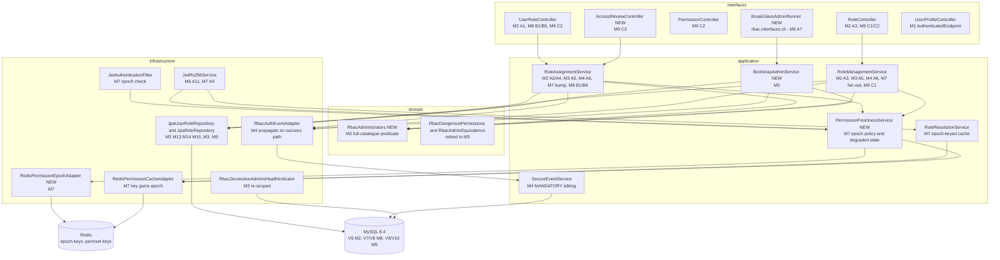
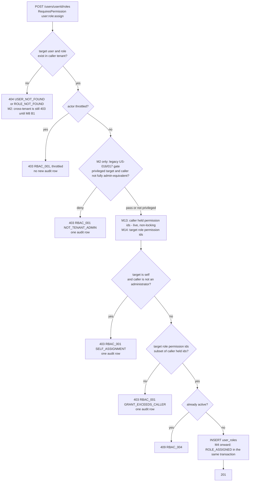
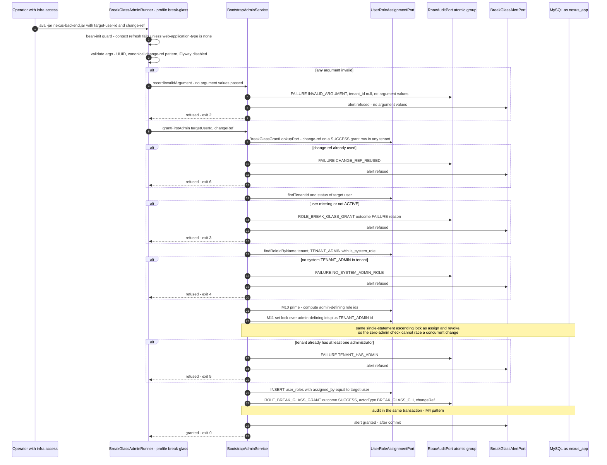
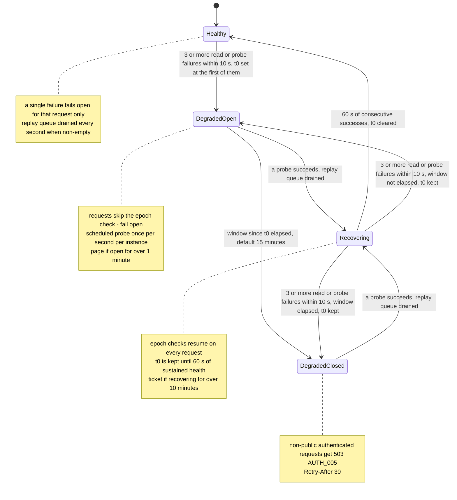
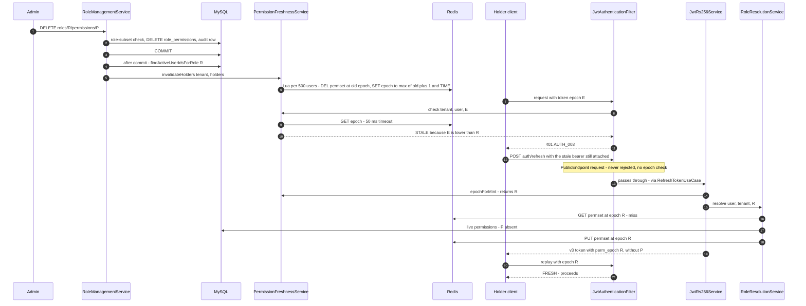

# US-018 — Solution Design: Harden RBAC for production readiness

**Epic:** EPIC-002 (RBAC Foundation)
**Phase:** 3 (Solution Design), Gate 2 Step A
**Gate 2:** approved 2026-10-02
**Author:** Principal Architect
**Status:** **Approved at Gate 2, Revision 3** (2026-10-02; RES-26 and RES-30 accepted by the story owner, owner-role confirmation at the M3 and M7 merges, `03b-threat-model.md` §13.8). Revision 3 dated 2026-10-01. Threat-modelled in `03b-threat-model.md` (conditional pass). Revision 1 folded in its required changes RC-23 to RC-40; Revision 2 folds in the delta review's RC-41 to RC-50 (`03b-threat-model.md` §11.7); Revision 3 folds in the spot-check's RC-51 to RC-54 (§12.6). The five Architect decisions Revision 1 was asked for are listed under "Revision 1 decisions for Gate 2" at the end of §0.

> **Revision 1 (2026-09-26) — threat-model RC-23..RC-40**
> - **RC-23** (T-E32): R-2 restated as a one-attacker, two-account path and recorded as RES-26 (§4.9, §16 item 2, ADR-0021 "does not close"); RES-1(b) reported as "self path closed; transformed into RES-26" (§4 header, §4.9); attach provenance signal (§5.1 row 13); ◆ narrow provenance 409 `RBAC_010` (§2.2, §5.1 row 14, §5.6, ADR-0021 D8).
> - **RC-24** (T-D17): `@PublicEndpoint` requests are never rejected by the bearer filter, no epoch check and no 503 (§3.1, §9.1, §9.5, §9.8, ADR-0022 D5); §9.5 claims corrected; four `TokenFreshnessIT` cases (§9.11); impact §7.2 corrected.
> - **RC-25** (T-E33): on set-lock paths the caller's administrator status comes from M11's locked rows (§4.3, §5.3, ADR-0021 D2); R-1 restated as RES-27 (§4.9); harness-C race case (§5.5, §5.7).
> - **RC-26** (T-E34): false sentence deleted (§5.1 row 2, ADR-0021 D5); ◆ administrator requirement on revoke-subset and role-subset for admin-defining targets (§2.1, §5.1 rows 2, 12, §5.3, §5.6, ADR-0021 D5); row 19 rewritten, RES-28 (§5.1 row 19, ADR-0021 "does not close").
> - **RC-27** (T-E35): ◆ B7 footer extended to preserve admin-defining status (§2.1, §4.7, §4.8, §10.7, ADR-0021 D1, Consequences).
> - **RC-28** (T-E36): M13-independent self-assign capture, `RBAC_SELF_ASSIGN_ADMIN_DISAGREEMENT` page, re-pointed `nexus_rbac_gate_bypass_canary`, MC-H', `self_role_assignment_total` dropped (§5.1 rows 7, 8, §5.7, §15, ADR-0021 D7).
> - **RC-29** (T-E37): key TTL = max(access TTL, cache TTL) + 60 s; startup assertion; key-expiry race IT (§0 #14, §9.2, §9.11, ADR-0022 D1).
> - **RC-30** (T-E38): bounded per-instance replay queue (§9.3, §9.5, §9.9, §9.11, ADR-0022 D3); incident-runbook step (§9.10).
> - **RC-31** (T-D20): degraded-state machine with N = 3 entry, 60 s sustained-health exit, flap page, reconciled paging, restart note, Redis latency early warning, RES-30 SRE acceptance (§9.5, §9.9, §9.10, ADR-0022 D5).
> - **RC-32** (T-D19): per-family bucket in `RefreshTokenUseCase`, per-IP failure bucket, k6 in the production ingress topology (§0 #19, §9.7, ADR-0022 D8).
> - **RC-33** (T-D18, T-I18): throttled denials write no audit row; EC8 updated, RES-33 (§4.4, §10.8, §0 #25).
> - **RC-34** (T-T16): Redis auth, isolation and TLS as production prerequisites with a startup assertion; RES-32; B6 input (§9.12, §10.6, ADR-0022 Consequences, D9).
> - **RC-35** (T-T17): C1 PATCH/DELETE apply role-subset (§2.2, §11.1).
> - **RC-36** (T-T18): conditional `INSERT … SELECT` is the primary assign insert; `RolesPrivilegeIT` as `nexus_app`; MC-9 extended; orphaned-assignment detector (§11.1, §14, §15).
> - **RC-37** (T-S9, T-R14, T-R15): A7 requester verification, second approver, ticket-id `--change-ref`, reuse refusal (exit 6), Kubernetes audit prerequisite, page-capture drill, `assigned_by` reviewer note, web-context guard (§7.1–§7.3, §11.3, §14, ADR-0025).
> - **RC-38** (T-I17): §11.3 corrected; ◆ `assignedBy` redacted in C3 as in `listActive`; roster disclosure stated; `audit:read` in the detection query (§11.3, ADR-0021 Consequences).
> - **RC-39** (T-R13): ◆ the retry buffer is not used for cross-tenant evidence, reason recorded; rate ticket alert (§10.1, ADR-0024).
> - **RC-40**: `sub` UUID and v3 freeze (§8, ADR-0022 D7); A8 test corrections and the UUID ArchUnit rule (§3.1); B7 scanner variants (§10.7); **V7 split into V7 + V8, soft delete renumbered V9/V10** (§0, §1, §10.2, §11.1, §14); MC-4 ordering rule (§6, ADR-0024); M7 rollback pages Security (§9.10, ADR-0022); C6 no query parameters (§11.5).

> **Revision 2 (2026-09-30) — delta review RC-41..RC-50**
> - **RC-41** (T-E43): degraded entry and Recovering relapse on 3 or more failures in a 10 s sliding window, `t0` at the window's first failure (§0 #16, §9.5 text and state diagram, §9.10 config, ADR-0022 D5); `skipped_error` > 1% page and Recovering > 10 min ticket (§9.9, ADR-0022 D5 paging); F F S test (§9.11); M7 exit criterion (§14).
> - **RC-42** (T-E44): the 1 s task drains a non-empty replay queue in every state, re-enqueueing the remainder with its original `failedAt`; coalescing by `(tenantId, userId)`; drop-newest overflow counted per dropped id; bump on its own bounded factory, `bump-timeout` 500 ms (§0 #16, §9.1, §9.3, §9.5, §9.9, §9.10, §14 M7 row, ADR-0022 D3, D5); single-failure replay IT (§9.11).
> - **RC-43** (T-D24): filter-side check removed; `REFRESH_IP_FAIL` consumed and enforced in `RefreshTokenUseCase` on failure outcomes only, before the audit write; a rejected request gets 429 with no audit row; `isExhausted` dropped (§0 #19, §9.7, §9.9, ADR-0022 D8); three tests and the NAT-attacker k6 case (§9.7, §9.11, §14).
> - **RC-44** (T-E45): `PublicEndpointRequestMatcher` matches method and pattern with MVC path parsing and fails closed (§3.1); a public-endpoint principal carries an empty `PERMISSIONS` detail and no authorities (§9.5, ADR-0022 D5); `EndpointClassificationWebTest` matcher equivalence with a different-method negative fixture (§3.1); three `TokenFreshnessIT` cases (§9.11); §0 public-endpoint bullet.
> - **RC-45** (RC-34 Partial): `require-auth=true` set in `application-prod.yml` with M7, and `require-shared-store=true` with M8, where that property and the Redis throttle adapter are introduced; both dedicated Redis factories built from `spring.data.redis.*` and covered by the startup assertion; auth-enabled Redis IT (§9.5, §9.10, §9.11, §9.12, §10.8, §14, ADR-0022 Consequences).
> - **RC-46** (T-T20): "both take the role row first" corrected; **option (a) chosen**: DELETE of an admin-defining role takes the set lock (M10' → M11) before `UPDATE roles`; `RoleDeleteConcurrencyIT` holder-less admin-defining case, no 500 (§0 #26, §11.1, §14 M9 row). The three-way classification-flip edge is recorded as **RES-45** (Low, owner Architect, Accept) in Revision 3 (§11.1).
> - **RC-47** (T-S11): `--change-ref` pattern `^[A-Z][A-Z0-9]{1,9}-[1-9][0-9]{0,7}$`; exit-6 lookup global, filtered on `event_type` and `outcome`, bound parameter; zero-padded replay IT (§0 #11, §7.1, §7.2, §7.3, ADR-0025 1, 4). Under the new pattern a padded reference fails argument validation before the lookup, so the IT asserts "never grants", not exit 6 (§7.3).
> - **RC-48** (T-T21): footer published as a one-placeholder template; scanner checks statement (a)'s exclusion list against the file's own inserts and, from V9, `deleted_at IS NULL`; every permission-migration IT seeds a full-catalogue custom role (§0 #24, §4.7, §10.7, ADR-0021 D1, follow-on rule).
> - **RC-49** (T-D25): recovery is `flyway repair` then a re-run, with the Flyway DDL user (§0 #21, §10.2, §14 M8 row); V9 rebuilds `roles` and runs in a maintenance window (§0 #26, §11.1, §14 M9 row).
> - **RC-50**: (a) `RBAC_010` condition (§5.6, ADR-0021 D8); (b) the independent statement groups by role with its own predicates (§5.1 row 7, ADR-0021 D7); (c) cross-tenant alert floor (§0 #20, §10.1, ADR-0024 item 6); (d) break-glass guard is a bean-initialization check (§0 #12, §7.1, §7.2, ADR-0025 1).
> - **Optional wording item:** the two "900 s + skew" cells aligned with §9.6 (§9.10, §14 M7b row).
> - **Residual owners:** RES-26 (Platform Security Owner) and RES-30 (SRE + PM) recorded as **acceptance pending at Gate 2** (§0, §9.5, ADR-0021, ADR-0022). Neither is marked accepted.

> **Revision 3 (2026-10-01) — spot-check RC-51..RC-54**
> - **RC-51** (T-E46): the reuse branch always runs `revokeFamily` before `REFRESH_IP_FAIL` is consulted, writes `TOKEN_REFRESH_REUSE` whenever it revoked at least one unrevoked token, and only a reuse that revoked nothing is throttled; `revokeFamily` returns its revoked count (§0 #19, §9.7, ADR-0022 D8); `RefreshTokenUseCaseTest` cases and the k6 NAT-attacker assertion (§9.7, §9.11).
> - **RC-52**: the 1 s epoch task gets its own unconditional scheduling configuration, independent of `nexus.identity.audit.retry-buffer.enabled` (§0 #16, §9.1); probe-and-drain test with the retry buffer disabled (§9.11).
> - **RC-53** (T-E47): only epoch-read and probe failures drive the 3-in-10 s entry and relapse window; bump and drain failures stay queued and page via `bump_failed` without changing state; the "replay queue drained" exit is unchanged (§0 #16, §9.3, §9.5 text and diagram, ADR-0022 D5); `PermissionFreshnessServiceTest` case (§9.11).
> - **RC-54**: (a) argument validation exits 2 and writes a `ROLE_BREAK_GLASS_GRANT` FAILURE row (`INVALID_ARGUMENT`, null `tenant_id`) with the paging ERROR, with no rejected argument values in metadata or logs; the IT asserts the padded value appears in neither (§7.1, §7.3, ADR-0025 1, 6); (b) prod-profile test for `require-shared-store=true` (§10.8).
> - **RES-45** recorded (Low, Architect, Accept) for the three-way classification-flip race, replacing the "noted, not a residual" wording (§0 #26, §11.1). RES-26 and RES-30 remain **acceptance pending at Gate 2**.

**Inputs (binding, not reopened):**
- `01-requirements.md`, **§14 Gate 1 Decisions**: one story delivered as milestones; Group A is the only GA blocker; A9 is per-user with a time-boxed fail-open and an alert; A6 is a same-transaction insert; A7 is an operator CLI; C5 means no role at registration; B4 is ADR-only; B1 returns 404; no new feature flags for Group A; M10 (C4) is out of scope.
- `02-impact.md` (this team's impact analysis). This document **builds on it and does not repeat its file inventories.** Section references of the form "impact §x" point there.
- `docs/story/2-rbac/US-018.md` (the 30 ACs and 16 test scenarios).
- Precedent: `docs/features/US-016/03-design.md`, `docs/features/US-017/03-design.md`, ADRs 0003, 0008, 0009, 0013–0018.

**Code verified** on `main` at `3d8ec5f` (the same commit as the impact analysis). No PII: people are referred to by role.

**New ADRs proposed with this design** (all status "Proposed"; accepted ADRs are not edited):

| ADR | Covers | Supersedes in part |
|---|---|---|
| `0021-grant-subset-authorization-model.md` | A1–A5 | ADR-0017 D1, D3, D5; ADR-0018 D1, D2, D3, D4 (population), D8; ADR-0013 D1 (naming, amended) |
| `0022-permission-token-freshness.md` | A9, A10, A11, B6 decision rule | ADR-0013 D1 (per-request state), D4; ADR-0016 D3 (one key row), D4 (one row, one new row), D5 (bulk invalidation non-goal) |
| `0023-object-level-authorization-deferred.md` | B4 | none |
| `0024-atomic-audit-for-rbac-mutations.md` | A6 | ADR-0011's scope, for the five RBAC success events only |
| `0025-break-glass-admin-cli.md` | A7 | none |

ADRs 0024 and 0025 are included because each is warranted on its own: A6 reverses a documented durability contract (best-effort, never-throw) that ADR-0011 and the `RbacAuditPort` Javadoc both state, and A7 introduces the platform's first non-HTTP privileged entry point.

---

## 0. Decisions for Gate 2 approval

Each line is a decision this design makes. The user can override any of them at Gate 2. Section numbers point to the reasoning.

1. **A8:** add a third marker, `@AuthenticatedEndpoint`, for "authenticated, no permission" handlers (today only `GET /users/me`). Add a runtime test that every non-public handler returns 401 to an anonymous caller (§3).
2. **A1 name:** keep `user:role:assign`. ADR-0021 amends ADR-0013 D1 to allow `resource:sub-resource:action` for relationship resources. The alternative, `role:assign`, is recorded as rejected (§4.2).
3. **A1 seed and backfill:** V6 seeds the permission and grants **every missing permission** to every tenant's system `TENANT_ADMIN`. The same footer also gives the new permission to every role, system or custom, that already carried the whole pre-migration catalogue, so admin-defining status survives catalogue growth (Revision 1, RC-27.1). There is no backfill for custom roles that hold `user:write` but not the whole catalogue; instead, a pre-deploy detection query is a runbook step. `user:role:assign` is **not** added to `RbacDangerousPermissions` (§4.2, §4.8).
4. **A2/A3 read:** compare permission **ids** from a new, non-locking, snapshot read (`M13`) that is named for authorization. Never use `M12` or the JWT. A read error propagates as a 500 and never allows the request (§4.3).
5. **"Administrator" is defined once:** a user who holds an active role that **alone carries every permission in the catalogue** (per role, not the union of roles). The same definition drives A4 (from M2) and, from M3, the lockout, the health indicator, A7, `listActive` and C3 `assignedBy` redaction, and the extra administrator requirement that revoke-subset and role-subset apply on admin-defining targets. A2, A3 and the subset part of revoke-subset and role-subset compare against the **union** of the caller's held permissions; that is a grant bound, not an administrator test (§2.1, Revision 1).
6. **Denial precedence:** tenant 404 checks, then the throttle, then the legacy gate (M2 only), then A4, then A2, then the duplicate 409. One audit row per request, carrying the first reason that fired. Two new `DenialReason` values: `SELF_ASSIGNMENT` and `GRANT_EXCEEDS_CALLER`. `requiredPermission` in the 403 body is always the endpoint permission, so it never reveals what a role contains (§4.4).
7. **A3 denial:** WARN plus metric, with no audit row, matching the shipped attach gate (§4.5).
8. **A5 retirement:** a "revoke-subset" rule replaces the T-E17 gates, and a "role-subset" rule replaces the name-based detach gate (US-017 D13). The last-admin lockout, the set-lock protocol and the zero-admin health indicator stay, re-scoped to the new "administrator" definition. The ANY/ALL predicates, D23 and `M12` are retired. The M12 canary mechanism is **replaced**, not just retired, by an M13-independent self-assign capture that keeps the page (Revision 1, RC-28). On admin-defining targets, revoke-subset and role-subset also require the caller to be an administrator (role-subset: through a role other than R), so detaching to zero administrators is reachable only through a concurrent race (RES-28) (§5).
9. **A6:** keep one `RbacAuditPort` with two documented contract groups. Add `SecureEventService.recordEventInCurrentTransaction` (`MANDATORY`, flushes, bypasses the retry buffer). An audit failure rolls back the mutation and returns 500 `INTERNAL_ERROR`. The denial path is unchanged (§6).
10. **A7 actor:** `assigned_by` is set to the target user (a self-reference). The operator is attributed through a required `--change-ref` recorded in the audit metadata. There is no migration and no system user row (§7).
11. **A7 scope:** the CLI refuses a tenant that has no seeded system `TENANT_ADMIN`, refuses when the tenant already has at least one administrator (checked under the set lock), and refuses a `--change-ref` already used on a successful grant in any tenant (exit 6). The reference has one canonical form, with no leading zeros in its number, so re-padding cannot replay an old approval (Revision 2, RC-47). Every invocation, including refusals, is audited and triggers a page through a **log-based** alert, backed by a daily reconciliation alert. The operator verifies the requester against the tenant's contact of record, and a second Platform Security approver is recorded under the change reference (§7).
12. **A7 packaging:** the same jar, run with a `break-glass` profile as an `ApplicationRunner`, with the web server off and Flyway off, as `nexus_app`. A bean-initialization check fails the context refresh unless `spring.main.web-application-type=none` (Revision 2, RC-50(d)). No new dependency (§7).
13. **A9 mechanism:** a per-user epoch claim `perm_epoch` (a millisecond value from Redis `TIME`, monotonic), with `JwtClaims` going from version 2 to 3. The revoked-before-versus-`iat` alternative is rejected because of its one-second granularity (§9.2).
14. **A9 key lifetime:** the epoch key's TTL is `max(access-token TTL, permission-cache TTL) + 60 s` (960 s today; `AUTH_CLOCK_SKEW_SECONDS` is 0). Startup fails if the configured TTL does not exceed both. An absent key means "no revocation" (§9.2, Revision 1).
15. **A9 bump triggers:** bump after commit on **revoke and detach only**. Attach evicts the cache but does not bump. This deviates from the AC text, on purpose (§9.3).
16. **A9 outage policy:** a dedicated 50 ms timeout for epoch reads; bumps run on their own bounded timeout (500 ms, sized for a 500-user batch). Both dedicated Redis factories take their credentials and SSL from `spring.data.redis.*`. An instance enters degraded-open when **3 or more failures occur within a 10 s sliding window**, with `t0` set at the first failure in that window; the same rule sends Recovering back to a degraded state. Only epoch-read and probe failures count towards that window; bump and drain failures keep their entries queued and page through `bump_failed`, but do not change the state on their own (Revision 3, RC-53). It leaves degraded state only after **60 s** of sustained health; recovery does not reset the 15-minute window. It pages when degraded-open lasts over 1 minute, on 3 entries in 15 minutes, or when `skipped_error` exceeds 1% of checks for 5 minutes; Recovering that lasts over 10 minutes raises a ticket. After the window it returns **503 `AUTH_005`, not 401**. `@PublicEndpoint` requests (login, refresh, logout) are never subject to the epoch check or the 503. The matcher that identifies them fails closed, and a bearer on such a request sets a principal with no permissions. Lost bumps go to a bounded per-instance replay queue, coalesced per user, that the 1 s scheduled task drains whenever it is non-empty, in every state. That task has its own unconditional scheduling configuration, so it does not depend on the audit retry buffer's `enabled` switch (Revision 3, RC-52). To extend the window, an operator raises it through config and a restart, which also resets every instance's window (§9.1, §9.3, §9.5, Revisions 1 to 3: RC-41, RC-42, RC-44, RC-45, RC-52, RC-53).
17. **A10:** fan out to every holder after commit (Lua batches of 500, no cap), evicting the cache and bumping the epoch, **and** key the permission cache by epoch, which closes the evict-then-repopulate race (§9.4).
18. **Accepted token versions:** M6 accepts {2,3} and mints 2; M7 accepts {2,3} and mints 3, treating a v2 token as epoch 0; M7b accepts only {3}, at least one TTL after M7 is fully rolled out (§8, §9.6).
19. **Refresh storms:** M7 splits the refresh rate limit into three buckets: a per-refresh-family bucket (30/60 s), enforced in `RefreshTokenUseCase` after the token lookup because only then is the family known; a raised per-IP total (300/60 s); and a per-IP **failure** bucket (30/60 s), consumed in `RefreshTokenUseCase` on failure outcomes only, before the `TOKEN_REFRESH_FAILURE` write, which keeps unauthenticated audit writes at today's bound. When the failure bucket rejects, that failing refresh gets 429 with `Retry-After` and writes no audit row. A valid refresh is never blocked by it (Revision 2, RC-43). **Reuse detection is never gated by it** (Revision 3, RC-51): a replayed revoked token always runs `revokeFamily` first, and writes `TOKEN_REFRESH_REUSE` whenever at least one unrevoked token was revoked; only a reuse that revoked nothing is subject to the failure bucket. A detach on a large role then cannot log out users behind a shared NAT, and neither can an attacker sending invalid refreshes from behind it. Merge is gated on a load test run in the production ingress topology, which includes an attacker-behind-the-NAT case (§9.7, Revisions 1 to 3).
20. **B1:** a cross-tenant target returns a byte-identical 404. The synchronous cross-tenant denial audit row is dropped to remove the timing oracle, and it is **not** re-routed through `AuthEventRetryBuffer` (Revision 1 decision, RC-39). The WARN (retained for at least 1 year), the metric and a new rate ticket alert stay. The alert fires at `max(5 × 7-day baseline, 20 per 15 min)`, so a near-zero baseline neither fires on a single event nor never fires (§10.1, Revision 2, RC-50(c)).
21. **B2:** split into **V7** (`UNIQUE (id, tenant_id)` on `roles`) and **V8** (the composite FK on `user_roles`), one `ALTER` per file, so a data mismatch leaves nothing half-applied. Recovery from a failed file is `flyway repair`, then a re-run (Revision 2, RC-49). V8 is preceded by a pre-flight detection query, uses the COPY algorithm in a maintenance window, and keeps `fk_user_roles_role` (§10.2, Revision 1).
22. **B5:** constants live in `common.security.Permissions`. A test enforces them (not a startup check). The frontend gets a `Permission` union and a route-table spec. The guard's fail-open runtime semantics do not change (§10.5).
23. **B6:** a stated benchmark decision rule. If the result is inconclusive, the default is to remove the cache (§10.6).
24. **B7:** a mandatory migration footer (system `TENANT_ADMIN` re-sync **plus** admin-defining preservation), published as a template with one placeholder (the ids the file inserts), and a case- and variant-insensitive test that scans migrations. The scanner checks that the preservation statement excludes exactly the ids the same file inserts and, from V9 on, filters soft-deleted roles. Every permission-migration IT seeds a full-catalogue custom role. No startup sync (§10.7, Revisions 1 and 2, RC-48).
25. **B8:** when an actor is throttled, only changes to admin-defining roles and self-targeted changes are blocked. Other requests are evaluated; a throttled actor's **denied** request writes no new audit row (a counter plus at most one WARN per window). The throttle gets a Redis-native shared adapter, and a `require-shared-store` startup assertion (§10.8, Revision 1).
26. **C1:** soft delete via **V9** (expand) and **V10** (contract), `@SQLRestriction`, column-scoped grants, PATCH added to CORS, and a new code `RBAC_009`. PATCH and DELETE apply role-subset (403 before 404/409 that follow resolution). The assign insert becomes a conditional `INSERT … SELECT … WHERE deleted_at IS NULL`, so no locking read on `roles` is needed. DELETE of an admin-defining role takes the set lock (M10' → M11) before its `UPDATE roles`, in the same order as assign, so the two cannot deadlock (Revision 2, RC-46 option (a)), except through a concurrent classification flip, recorded as RES-45 (Low, Accept; Revision 3). V9 rebuilds `roles` and runs in a maintenance window (RC-49) (§11.1, Revisions 1 and 2).
27. **C2:** default page size 20, maximum 100, with `page` and `links` always present; `size > 100` returns 400. There is no consumer today (§11.2).
28. **C3:** three endpoints guarded by `audit:read`, returning ids only; C3 is the **first live use** of `audit:read`, and it discloses the tenant's administrator roster. `RoleHolder.assignedBy` follows `listActive`'s rule (redacted unless the caller is an administrator). `effective-permissions` is a single, unpaginated resource (§11.3, Revision 1).
29. **Flags:** no new feature flags in any milestone. Group C rides the existing parent flags (§13).
30. **ADRs 0024 (A6) and 0025 (A7)** are warranted and proposed alongside 0021–0023.

### Revision 1 decisions for Gate 2

The threat model (§7) asked for five Architect decisions (◆). Each is recorded here, in the section named, and in the ADR named.

| # | Decision | Chosen | Reason | Where |
|---|---|---|---|---|
| R1-1 | **RC-23.3**, the preventive assignment-provenance 409 | **General rule rejected; narrow rule adopted.** An attach that would make R **admin-defining** returns 409 `RBAC_010` while R has an active holder whose assigner is not currently an administrator | The general rule would block routine catalogue maintenance on every widely held role that delegated assigners hand out, which is exactly what A1 enables. "Re-assign" is not an operation (`user_roles` is append-only), so clearing the block means a revoke and assign per holder, for thousands of holders. Making a role admin-defining is rare and never routine, so the narrow rule blocks almost no legitimate work, and it removes RES-26's highest payoff (the second account becoming an administrator) preventively. Partial escalations stay detective under RC-23.2 (paged). RES-26 stays **Medium** in the Architect's reading; Security confirms at the M3 re-pass | §5.1 row 14, §5.6, ADR-0021 D8 |
| R1-2 | **RC-26.2**, extra administrator requirement on admin-defining targets | **Adopted, both parts.** Revoke-subset requires the caller to be an administrator (from M11's locked rows, RC-25.1); role-subset requires the caller to be an administrator through a role other than R (from M13's per-role sets) | It makes "administrator" mean one thing in every administrator decision, removes the non-self zero-administrator detach, and costs no extra read. The only callers it newly denies are union-holders, who can still ask an administrator | §2.1, §5.1 rows 2, 12, 19, §5.3, ADR-0021 D5 |
| R1-3 | **RC-27.1**, extend the B7 footer to preserve admin-defining status | **Adopted** | Without it, every permission-adding migration demotes working custom administrators and can leave tenants unrecoverable until Epic 3 (RES-29 Medium). The extension touches only roles that already carried the whole catalogue, so it grants no holder anything they were not already entitled to by the definition. That is why it is not the `user:write` backfill Decision 3 rejects. RC-27.2(a)–(d) are therefore not required; (a) is applied anyway because §2.1's old wording was false | §2.1, §4.7, §4.8, §10.7, ADR-0021 D1 |
| R1-4 | **RC-38.2**, `RoleHolder.assignedBy` for non-administrators | **Redact**, with the same rule and shape as `listActive` (§5.1 row 16) | One rule per field, with no new widening to accept. An access reviewer who needs grantor ids is an administrator or works with one; the holder list itself, which is C3's SOC 2 purpose, is unredacted | §11.3, ADR-0021 Consequences |
| R1-5 | **RC-39**, enqueue the cross-tenant denial row through `AuthEventRetryBuffer` | **Not adopted; the reason is recorded** | The buffer's standard lane is a shared, bounded failure-recovery resource: 800 slots, a 10 s drain, and a `depth-warn` alert at 250 (`application.yml:175-189`). It also carries `LOGIN_FAILURE` retries. Making it the primary path for an event any authenticated prober can trigger lets roughly 80 probes/s per instance fill it, which drops genuine failure-path audit events (drop-newest, `AuthEventRetryBuffer.java:126-136`) and trips the buffer's own alerts. The evidence stays as the WARN with at least 1-year retention, plus a new rate ticket alert (RES-34) | §10.1, ADR-0024 |

**Also changed and needing Gate 2 sign-off** (not ◆, but existing decisions moved):
- **#14** (key TTL), **#16** (outage policy), **#19** (refresh limit), **#20** (B1), **#21** (V7/V8 split), **#25** (B8), **#26** (C1), **#28** (C3), **#11/#12** (A7), **#5** and **#8** (the administrator requirement), all updated in place above.
- **Revision 2 (delta review RC-41..RC-50):** **#16** (sliding-window entry, drain in every state, bump timeout, new alerts), **#19** (failure bucket moved into the use case), **#11** (canonical change-ref, global reuse lookup), **#12** (bean-initialization guard), **#20** (alert floor), **#21** (`flyway repair`), **#24** (footer template and scanner), and **#26** (C1 lock order, option (a) chosen for RC-46; V9 maintenance window), all updated in place above.
- **Public-endpoint handling (RC-24, tightened by RC-44):** on `@PublicEndpoint` requests the filter never rejects: no epoch check, no 503, and a bearer that fails verification is ignored rather than rejected. The filter does **not** skip bearer parsing altogether, because `POST /auth/logout` uses a verified bearer's principal to revoke every refresh family of a user who has no cookie (`LoginController.java:133-137`, `LogoutUseCase.java:50-54`). Skipping it would silently regress that path. **Revision 2 (RC-44):** the matcher matches HTTP method and pattern using MVC's own path parsing, and any exception counts as non-public (fail closed). A principal set on a public request carries an empty `PERMISSIONS` detail and no authorities, so an epoch-unchecked token can never satisfy `@RequiresPermission`; logout needs only the user id.
- **Escalations that need an owner at Gate 2** (both **acceptance pending at Gate 2**; neither is accepted by this design):
  - **RES-26** (pre-positioning through a second account; Medium): owner the **Platform Security Owner**, per the threat model §8 and §11.6. Re-confirmed at the M3 re-pass; review 2026-11-27; Epic-3 hard expiry.
  - **RES-30** (a Redis outage longer than the window is a platform-wide authenticated 503; Medium): owners **SRE + PM** (RC-31.5). After RC-41 the window also bounds intermittent failure.
- **Migrations (final):** V6 (M2) seed and extended footer · V7 (M8) `roles UNIQUE (id, tenant_id)` · V8 (M8) `user_roles` composite FK · V9 (M9) soft-delete expand · V10 (M9, next release) soft-delete contract. Version numbers are still confirmed at merge (impact §12.1).

---

## 1. Architecture overview and delivery order

### 1.1 Components touched



**Hexagonal conformance (ADR-0002).** `rbac` still imports nothing from `identity`. Any capability `rbac` needs from `identity` (audit, alert, throttle store) goes through an `rbac.application.port.out` port that `identity.infrastructure` implements, which is the established direction (impact §5). The `identity → rbac` dependency already exists (`JwtRs256Service` imports `RoleResolutionService`). `JwtAuthenticationFilter` follows the same path to `PermissionFreshnessService`. Redis types stay in `rbac.infrastructure.cache` (ADR-0016 D6).

### 1.2 Delivery order

This is the impact analysis's order (impact §16). Each step has a single upstream.

| Order | Milestone | ACs | Hard prerequisite | GA blocker |
|---|---|---|---|---|
| 1 | **M2** | A1–A4 | none | yes |
| 2 | **M1** | A8 | none (lands before any new controller) | yes |
| 3 | **M6** | A11 | none | yes |
| 4 | **M4** | A6 | M2 merged (same methods) | yes |
| 5 | **M5** | A7 | M2 (V6), M4 (atomic audit) | yes |
| 6 | **M7** + M7b | A9, A10 | M6 deployed everywhere | yes |
| 7 | **M3** | A5, D3 | M2 soaked in staging, M4, M7; its own threat-model re-pass | yes (last GA item) |
| 8 | **M8** | B1–B8 | M3 (B1/B8 edit the smaller file); M7 (B6) | no |
| 9 | **M9** | C1, C2, C3, C5, C6 | M1 (new handlers are classified from day one), M8 (V8's `(role_id, tenant_id)` index) | no |
| 10 | **M11** | D1, D2, D4, D5 | all others (D4 documents final shapes) | no |

If A5's threat-model sign-off becomes the critical path to GA, M3 can move ahead of M7. The cost is that ADR-0021 D8's "detection replaced by A9" argument is then unavailable, so the retired canaries stay one milestone longer.

---

## 2. Cross-cutting design

### 2.1 One definition of "administrator"

Today the codebase has four notions: literal `TENANT_ADMIN` by name, "ANY dangerous" (target side), "ALL three dangerous" (caller side), and the H-1 caller-qualifying subset. Under grant-subset these collapse into one:

> A role is **admin-defining** iff it carries **every** permission in the `permissions` catalogue. A user is an **administrator** in a tenant iff they hold an active assignment of an admin-defining role in that tenant.

- **Why every permission (and not "all three dangerous").** A caller who holds every permission cannot be escalated by any later attach, so letting them self-assign is provably harmless. That is the property A4 needs. "All three dangerous" was a proxy for this property that stopped being accurate the moment A1 split `user:write`.
- **Why per role and not the union across roles.** It is the shape the existing lock machinery protects: the set lock is over role ids (ADR-0018 D5), and "which roles are admin-defining" is a property of roles. A user holding everything through two partial roles is *not* an administrator. That fails closed: they are denied self-assignment, which costs them nothing they could not get from another administrator.
- **Union versus per role, stated per rule (Revision 1, RC-26).** Two different questions are asked, and each rule asks exactly one of them:
  - *"Could the caller have granted this themselves?"* (a grant bound) uses the **union** of the caller's held permission ids: A2, A3, and the subset part of revoke-subset and role-subset.
  - *"Is the caller an administrator?"* uses the **per-role** predicate below, and nothing else: A4, the lockout population, the health indicator, A7's precondition, `listActive` and C3 `assignedBy` redaction, and the extra requirement that revoke-subset and role-subset apply on **admin-defining** targets (§5.1 rows 2 and 12).
  - A union-holder therefore passes the subset part on an admin-defining role but fails the administrator part, so they cannot strip or demote administrators.
- **Names stop mattering.** `TENANT_ADMIN` qualifies because V6 and B7 guarantee it carries every permission, not because of its name. This finishes ADR-0017 rule 1 ("test privilege, not name").
- **Dependency, stated plainly (revised, RC-27.1).** The definition depends on the catalogue. Without mitigation, adding a permission would demote every **custom** admin-defining role. Under A3 no one can attach a permission that nobody holds, so a tenant whose administrators were custom-only could not repair itself; recovery would need break-glass, which exists only where a system `TENANT_ADMIN` is seeded. **The B7 footer therefore preserves admin-defining status:** every migration that inserts into `permissions` attaches the new permissions to system `TENANT_ADMIN` roles **and** to every role, system or custom, that carried every permission of the pre-migration catalogue (§4.7, §10.7). A role that was a full stand-in stays one, and no other role is touched. The custom-admin exposure check (§4.8) stays as a runbook confirmation, and the zero-admin health indicator (M3) still reports any tenant that ends a deploy at zero.
- **Where it lives.** A new `rbac.domain.RbacAdministrators` holds one static predicate over **ids**, not names. That removes the case-insensitivity trap documented at `RbacDangerousPermissions.java:42-51`.

```java
public static boolean isAdminDefining(Set<UUID> rolePermissionIds, Set<UUID> catalogueIds);
```

The predicate is `!catalogueIds.isEmpty() && rolePermissionIds.containsAll(catalogueIds)`. An empty catalogue must return `false` (fail closed); the MC-1 unit test pins that. The type falls under the `rbac.domain` 0.90 JaCoCo gate. It gets no custom `toString()`, which avoids the known coverage trap on security records.

### 2.2 Error codes (full registry for this story)

All errors are RFC 9457 `ProblemDetail` produced by `GlobalExceptionHandler` (or, for filter-level 401 and 503, written in the same shape).

| Code | Status | Raised by | Milestone | New? |
|---|---|---|---|---|
| `RBAC_001` | 403 | A2, A3, A4, revoke-subset, role-subset (detach; C1 PATCH and DELETE, RC-35) | M2, M3, M9 | existing |
| `RBAC_002` | 409 | last-admin lockout | kept | existing |
| `RBAC_010` | 409 | an attach that would make a role admin-defining while it has an active holder whose assigner is not currently an administrator (Revision 1 decision R1-1) | M3 | **new** |
| `RBAC_003` | 409 | C1 PATCH/DELETE on a system role | M9 | existing |
| `RBAC_006` | 409 | C1 rename collides with an active name | M9 | existing |
| `RBAC_007` | 409 | C1 rename to a reserved name | M9 | existing |
| `RBAC_009` | 409 | C1 DELETE of a role with active holders | M9 | **new** |
| `AUTH_003` | 401 | stale epoch; `schema_version` not in the accepted set; missing or invalid `tenant_id`; non-UUID `sub`; v3 without a valid `perm_epoch` (RC-40.1). Never on a `@PublicEndpoint` request (RC-24) | M6, M7 | existing |
| `AUTH_005` | 503 + `Retry-After: 30` | epoch check unavailable after the fail-open window; **never** on a `@PublicEndpoint` request (RC-24) | M7 | **new** |
| `USER_NOT_FOUND`, `ROLE_NOT_FOUND`, `PERMISSION_NOT_FOUND` | 404 | genuine not-found **and** cross-tenant (B1), byte-identical | M8 | existing |
| `VALIDATION_FAILED` | 400 | C1 body, C2 `page`/`size` out of range | M9 | existing |
| `INTERNAL_ERROR` | 500 | an atomic audit write failed (A6); the A2/A3 read failed | M2, M4 | existing |

`RBAC_009` and `RBAC_010` are free: `RBAC_001` to `RBAC_008` are taken (see the grep in impact §10). `AUTH_005` is free: `AUTH_001` to `AUTH_004` are taken. None of the new codes carries extra properties. `RBAC_010`'s `detail` says only "Revoke or re-assign the role's holders before making it an administrator role"; it names no holder. `detail` is safe to show in the UI.

**Retry and idempotency policy.** No server-side retry is added on any path. The mutating RBAC verbs are naturally idempotent at the outcome level: a replayed assign returns 409 `RBAC_004`, a replayed revoke returns 404, a replayed attach returns 409 `RBAC_005`, and a replayed C1 DELETE returns 404. So a client can safely retry after a 500. An `Idempotency-Key` header is **not** added, which matches the api-design skill's "target, not yet implemented" note. The new C1 endpoints are shaped so it can be added later without a contract change.

### 2.3 Observability conventions for this story

- **No metric carries a `tenantId` tag** (B3). Tenant attribution is carried only in structured log fields (`tenantId`, `actorUserId`, `targetUserId`, `roleId`). The only tags allowed are bounded enums or buckets. M8 removes the two existing `tenantId` tags (impact §9 B3).
- Every new WARN or ERROR marker is a stable, grep-able `RBAC_*` or `AUTH_*` event name. No PII (no email, no name) appears in any log field; ids only.
- Retention: the US-017 RC-19 precondition (WARN markers retained **at least as long as `auth_events`, minimum 1 year**) is extended to every WARN marker this design names as a compensating control: `RBAC_CROSS_TENANT_TARGET` (B1), `RBAC_ATTACH_EXCEEDS_CALLER` (A3) and `RBAC_BREAK_GLASS_USED` (A7). Revision 1 adds `RBAC_ATTACH_ESCALATES_NON_ADMIN_ASSIGNED_HOLDERS` and `RBAC_SELF_ASSIGN_ADMIN_DISAGREEMENT` (M3) and `RBAC_DENIAL_THROTTLED` (M8). Ops sign-off is a merge-checklist item on M2, M3, M5 and M8.

### 2.4 Corrections to accepted ADRs (recorded here; accepted ADRs are not edited)

- **ADR-0008**, trigger note (lines 68–71), and **ADR-0016**, D4 row "JWT jti denylist" plus the "Supersession" bullet: both state that a Redis `jti` denylist "is now implemented". **This is false.** No denylist code exists in `src/main`, and `JwtAuthenticationFilter` consults nothing but `JwtPort.verify` (impact §8.1). Logout revocation of access tokens is still TTL-only (ADR-0008 Option A). Consequences for this design: A9 is the **first** Redis call on the authenticated hot path, and ADR-0016's "fail open, loudly alerted" rule for per-request checks has never run in production. ADR-0022 records the correction in its "Corrections" section. Correcting ADR-0008 and ADR-0016 themselves is an M11 (D2) documentation task, done as dated amendment notes per ADR-0001.
- **ADR-0014/0015:** the V5 header comment about an `application.yml` default-tenant fallback is stale (D2). The correction is an M11 amendment note, because V5 is immutable.

---

## 3. Milestone 1 — A8 deny-by-default

**Scope:** FR-A8.a–c. Impact §1 lists the handlers.

### 3.1 Design

Three mutually exclusive, method-level markers in `common.security`:

| Marker | Meaning | Enforced by | Handlers today |
|---|---|---|---|
| `@RequiresPermission("x")` | authenticated **and** holds `x` | `@PreAuthorize` meta-annotation (existing) | 7 rbac handlers |
| `@PublicEndpoint` **new** | anonymous access allowed; granted by `SecurityConfig` `permitAll` through `PublicEndpointRequestMatcher` (HTTP method **and** path pattern of each `@PublicEndpoint` handler, T-004). **Behaviour change (T-009, M7 review L-6):** a wrong method on a public path (for example `GET /api/v1/auth/login`) no longer matches, so it is `authenticated()` and answers 401 `AUTH_003` instead of 405 | marker only (no AOP) | 9 identity handlers (login, refresh, logout, register ×3, password ×2, JWKS) |
| `@AuthenticatedEndpoint` **new** | authenticated; **no** permission; the handler must only return the caller's own data | marker only; `anyRequest().authenticated()` does the enforcement | `UserProfileController.me()` |

```java
@Target(ElementType.METHOD) @Retention(RetentionPolicy.RUNTIME) public @interface PublicEndpoint {}
@Target(ElementType.METHOD) @Retention(RetentionPolicy.RUNTIME) public @interface AuthenticatedEndpoint {}
```

**Why a third marker (Decision 1).** Under C5 a new user holds zero permissions, so `me()` cannot carry `@RequiresPermission`. Labelling it `@PublicEndpoint` would be false, and reviewers read "public" as "anonymous". A reviewer who sees `@AuthenticatedEndpoint` is prompted to check the "own data only" rule. `@PublicEndpoint` does not prompt that check.

**ArchUnit rules** (added to `HexagonalArchitectureTest`; the existing rules at `:153-172` are unchanged):
- `rest_handlers_must_carry_exactly_one_access_marker`: every method in a `@RestController` class that carries an annotation meta-annotated with `@RequestMapping` must carry exactly one of the three markers.
- `no_self_invocation_of_requires_permission_methods`: no `JavaMethodCall` whose origin owner equals its target owner, where the target is annotated `@RequiresPermission`. Spring AOP does not intercept self-invocation.
- `authenticated_endpoints_take_no_uuid_identifier` (Revision 1, RC-40.2): an `@AuthenticatedEndpoint` handler declares no `@PathVariable` or `@RequestParam` of type `UUID`. That is the mechanical form of "own data only": the handler can only address the caller, through the principal.

**One source for "public" (Revision 1, RC-24).** A new `PublicEndpointRequestMatcher` (`identity.infrastructure.web`) is built once at startup from `RequestMappingHandlerMapping.getHandlerMethods()`, keeping the `RequestMappingInfo` of every handler carrying `@PublicEndpoint`. The M7 filter uses it to decide which requests are never rejected (§9.5), and `EndpointClassificationWebTest` uses the same bean to enumerate public handlers. So there is no third literal list. A unit assertion pins that login, refresh and logout are in it.
- **Fails closed (Revision 2, RC-44.1).** The matcher matches on **HTTP method and pattern** together, never on path alone, so a future non-public GET or DELETE that shares a public POST's pattern is not exempt. It uses the same path parsing as MVC dispatch: it parses and caches the request path (`ServletRequestPathUtils.parseAndCache`) before evaluating each `RequestMappingInfo`'s method and pattern conditions. **Any exception or ambiguity counts as non-public.** A false negative only brings back T-D17 on that request (availability), which the login, refresh and logout assertion catches; a false positive would be a silent A9 bypass (T-E45).

  ```java
  public boolean matches(HttpServletRequest request);   // false on any exception
  ```

**Drift guard between the markers and `SecurityConfig` (runtime, not static).** A new `EndpointClassificationWebTest` (MockMvc, full security chain) enumerates `RequestMappingHandlerMapping`. It fills path variables with random UUIDs and sends an **anonymous** request to each handler. An `@PublicEndpoint` handler must not return the entry-point 401. Every other handler must return it. This catches both directions of drift, including a `permitAll` entry that exposes a handler not marked public, which a static comparison of two string lists would miss.
- **Revision 1 corrections (RC-40.2).** The test context enables **every** feature flag, so the flag-gated RBAC controllers are enumerated too. It asserts the **entry-point** 401 (the `AUTH_003` body written by `jwtAuthenticationEntryPoint`), not the status alone. A public handler may legitimately return its own 401 (refresh without a cookie returns `AUTH_004`), and asserting on status would invite an exclusion list.
- **Matcher equivalence (Revision 2, RC-44.3).** For every `(method, pattern)` in `RequestMappingHandlerMapping`, the test builds a request and asserts that `PublicEndpointRequestMatcher.matches(request)` is true **exactly when** the handler carries `@PublicEndpoint`. A test-only negative fixture registers a non-public handler with the **same path as a public one and a different method**, and asserts the matcher returns false for it.

### 3.2 DB, API, UI, flags

None.

### 3.3 Rollout

Build-time only. Merge at any time. It must merge before M9 so that C1 and C3 handlers are classified from their first commit.

### 3.4 Tests

`HexagonalArchitectureTest` (3 new rules, each with a negative fixture in a test-only package to prove it fires), and the new `EndpointClassificationWebTest`. `GuardedTestController` is outside the rule's import scope (`DoNotIncludeTests`), so it is unaffected (impact §1).

---

## 4. Milestone 2 — A1–A4 grant-subset core (P0)

**Closes:** the literal **self-target** step of US-016 RES-1(b)/T-E27, and US-017 RES-13 (mint side name-based; with role-subset in M3). **RES-1(b) is not fully closed.** Where self-registration is open, its primitive survives through a second account (§4.9, RES-26). EPIC-002 reports RES-1(b) as **"self path closed; transformed into RES-26"**, never as "fully closed" (Revision 1, RC-23.1).

### 4.1 Decision flow on `assign()` (M2 and after M3)



In M3 the "legacy gate" diamond is removed. Its lock acquisition survives only for admin-defining targets (§5.3).

### 4.2 A1 — `user:role:assign`

- `UserRoleController` POST and DELETE, and `RoleAssignmentService`'s `requiredPermission`, switch to `user:role:assign`. GET stays on `user:read`. The switch uses the B5 constant once M8 lands; M2 uses a local constant, as the class does today.
- `user:write` now means "edit user accounts" only.
- **Name (Decision 2).** ADR-0013 D1 says `resource:action`, with no hierarchy. `user:role:assign` names a *relationship* resource (user-role membership) with an action. ADR-0021 amends D1: a three-token name is allowed only when the middle token names a relationship between two catalogue resources, and it still carries no wildcard or hierarchy semantics. `role:assign` was rejected because `role:*` permissions govern role **definitions** (`role:write` = create roles and change their permissions), so `role:assign` would read as a role-definition action.
- **Not added to `RbacDangerousPermissions` in the M2→M3 interim.** If it were added, `carriesAll` would need all four, and every custom role that is fully admin-equivalent today but lacks the new permission would silently drop out of the caller population and the lockout population (impact §14.3). A role that carries only `user:role:assign` is bounded by A2 and A4, which is the model's intended behaviour.
- **Effect on ADR-0018.** D2's vacuity proof rests on "every caller holds `user:write`". After A1, callers hold `user:role:assign` instead. The ALL-three predicate still requires `user:write`, so it becomes *narrower* for callers who lack `user:write`. It fails closed, not open. ADR-0021 records that D2's premise no longer holds, that the legacy gate stays sound in the interim, and that M3 retires it.

### 4.3 A2 and A3 — the live read

Three new read methods. None is locking, and none touches `permissions` with a lock (`nexus_app` has `SELECT` only there; ADR-0017 follow-on rule 3).

| Id | Port | Hosted on | Shape |
|---|---|---|---|
| **M13** | `UserRoleAssignmentPort` | `JpaUserRoleRepository` | `List<RolePermissionId> findHeldRolePermissionIdsForAuthorization(UUID userId, UUID tenantId)`. `(roleId, permissionId)` rows over the user's active `user_roles` joined to `roles` **with `r.tenantId = ur.tenantId`** (T-S1) and to `role_permissions`. Driven off `fk_user_roles_user`. Does **not** join `permissions`. `RolePermissionId` is a new two-UUID `rbac.domain` record. The service derives both the union (for A2/A3) and the per-role sets (for A4) from this **one** read |
| **M14** | `UserRoleAssignmentPort` | `JpaRoleRepository` (JPQL over `RolePermission`) | `Set<UUID> findPermissionIdsForRole(UUID roleId)` |
| **M15** | `UserRoleAssignmentPort` | `JpaRoleRepository` (JPQL over `Permission`) | `Set<UUID> findCatalogueIds()`. Read only when needed (a self-target, or M3's lock-set computation) |

- **Ids, not names.** Comparing ids sidesteps case-insensitive name comparison, and permission names never cross the port (ADR-0017 D2 and ADR-0018 D3 remain upheld). `JpaUserRoleAssignmentAdapter`'s constructor is unchanged.
- **Not `M12`.** `findPermissionNamesForActiveAssignmentsOfUser` is documented "MUST NEVER be used for an authorization decision" (`JpaUserRoleRepository.java:145-147`). M13's Javadoc states the inverse: it is **the** read for authorization decisions. MC-2 (below) asserts that `RoleAssignmentService` and `RoleManagementService` never call M12 on a decision path. M12 is deleted in M3 together with its only consumer, the canary.
- **Snapshot, not locking (Decision 4).** M13 runs inside the write transaction's `REPEATABLE READ` snapshot. A locking read on the caller's rows via `fk_user_roles_user` would be a new acquisition *outside* the set-lock region, which reopens the hazard ADR-0018 D6 closed. The cost is a TOCTOU window (§4.9, RES-27).
- **On the set-lock path, administrator status never comes from M13 (Revision 1, RC-25).** InnoDB builds the read view at the transaction's first consistent read (the tenant 404 checks), so on a path that waits on M11 the M13 snapshot can predate the wait. From M3, on every request that takes the set lock (an admin-defining target: assign, revoke, and the CLI), the caller's administrator status is computed **from the rows M11 returns**: they are current and X-locked, and the caller is an administrator iff they are an active holder in M11's result. This needs zero extra reads, and it is US-017 D8's containment (the M5b `FOR SHARE` inside M11's X region) expressed without M5b. M13 remains the source only for the subset comparisons (A2 and revoke-subset's union check). In M2 the legacy M5b gate still provides this on privileged targets.
- **Fail closed.** A throwing read propagates (500). An empty M13 result against a target role with permissions denies. A target role with **no** permissions passes (EC7, intended: it grants nothing).
- **Mockito consequence** (impact §15.1): in unit tests an unstubbed M13 now returns an empty set, which means **deny**. Every success-path test with a permissioned target needs new stubs. This inversion is correct and must not be "fixed" by defaulting to allow.

**A3 on `attachPermission`:** after `requireMutableRole` (409) and `findPermission` (404), and after the legacy AC11 name gate (still present in M2), the caller must hold `permissionId` (via M13). A3 runs **before** the duplicate check (409 `RBAC_005`), so a denied caller learns nothing about whether the permission is already attached. It applies to **every** permission, which also closes the gap noted in impact §0 (non-dangerous permissions attachable by any `role:write` holder).

### 4.4 A4, precedence and audit

- **A4:** if `targetUserId == actor.userId()` and the caller is not an administrator (§2.1: some role among the caller's active roles is admin-defining), deny with `SELF_ASSIGNMENT`. This needs the caller's per-role permission ids, which M13 returns alongside the union, so the A4 and A2 inputs can never come from two different reads. M15 (the catalogue) is read only on this self-target branch.
- **Order (Decision 6):** tenant 404 checks, then the throttle, then the legacy gate (M2 only, which keeps every existing `NOT_TENANT_ADMIN` assertion stable), then **A4**, then **A2**, then the duplicate 409.
  - A4 goes before A2 because it is the more specific signal (pre-positioning) and needs no extra read beyond A2's.
  - **One `ROLE_ASSIGNMENT_DENIED` row per request, carrying the first reason**, via the existing `recordDenial` (`REQUIRES_NEW`, ADR-0009).
  - The audit metadata carries `operation`, `reason`, and for `GRANT_EXCEEDS_CALLER` the **count** of missing permission ids. Carrying the ids themselves is rejected: `auth_events` is readable by `audit:read` holders, and a count is enough for triage.
- **`DenialReason`** gains `SELF_ASSIGNMENT` and `GRANT_EXCEEDS_CALLER`. Each adds one bounded series to `nexus.rbac.permission_denied{permission, reason}`.
- **`requiredPermission` in the 403 body** stays the endpoint permission (`user:role:assign` on assign, `role:write` on attach), as today's `NOT_TENANT_ADMIN` uses `user:write`. Returning the missing permission would give a caller who lacks `role:read` an oracle on a role's contents.
- **The throttle runs before the new reads** (unchanged position) in M2 and M3, so throttle timing cannot be used to probe role contents (EC8). New denials feed the same per-`(tenant, actor)` counter. **From M8 this changes (Revision 1, RC-33.2):** B8 needs target classification (M14 + M15) *before* the throttle decision, so a throttled actor learns one bit, whether the target is admin-defining. That is accepted as RES-33 (§10.8). A2's own reads still run after the throttle.
- **EC2 (A4 versus A7)** is resolved structurally: `BootstrapAdminService` never calls `assign()` (§7), so A4 has no exemption flag.

### 4.5 A3 denial observability (Decision 7)

WARN `RBAC_ATTACH_EXCEEDS_CALLER {tenantId, actorUserId, roleId, permissionId}`, plus `nexus.rbac.permission_denied{permission="role:write", reason="GRANT_EXCEEDS_CALLER"}`. **No `auth_events` row.** This matches the shipped attach gate (US-015 AC11), which writes none. `ROLE_ASSIGNMENT_DENIED` is scoped to assign and revoke by contract (`RbacAuditPort.java:31-50`), and adding a new event type would also change the population that US-014's alert tuning expects. The WARN is covered by the 1-year retention precondition (§2.3).

### 4.6 Performance budget

| Path | Added I/O | Budget |
|---|---|---|
| `assign` | M13 (indexed on `fk_user_roles_user`), M14 (PK prefix on `role_permissions`); M15 only for a self-target | added latency **< 10 ms p95**; endpoint inherits EPIC-002's **p95 < 300 ms**. Admin-only and low-RPS, so the < 5 ms read-path budget does not apply |
| `attach` | M13 | same |

This gives up the "+0 statements on the benign path" property from US-016/017 (`RoleAssignmentService.java:235-238`), deliberately: grant-subset applies to every assignment.

### 4.7 DB — V6 (additive, data only)

`V6__rbac_user_role_assign_permission.sql` (the version number is assigned at merge; impact §12.1):
1. `INSERT` permission `user:role:assign`, id `019f6839-1807-7000-8000-000000000008`, description "Assign and revoke roles for users in the tenant".
2. **The B7 footer**, first instance, in two statements (Revision 1, RC-27.1):
   - (a) **Admin-defining preservation.** For every `roles` row, system or custom, in any tenant, that carried **every permission of the pre-migration catalogue** (every `permissions` row except the ids this migration inserted), attach the permissions this migration inserted (`INSERT … SELECT … WHERE NOT EXISTS`). In V6 the pre-migration catalogue is the 7 V5 permissions, and the inserted id is `user:role:assign`. Soft-deleted roles (from V9 onward) are excluded.
     - **Template (Revision 2, RC-48).** The exclusion list differs per migration, so the footer is published as a template with **one placeholder**, `{{INSERTED_PERMISSION_IDS}}`: the literal id list of the `permissions` rows this file inserts. It is used in statement (a) as the pre-migration exclusion and as the set to attach. The template has two variants: before V9 (V6, which cannot reference `deleted_at`) and from V9 on (adds `r.deleted_at IS NULL`). The B7 scanner checks both properties (§10.7).
   - (b) **System re-sync.** For every `roles` row with `is_system_role = TRUE AND name = 'TENANT_ADMIN'` in **any** tenant, insert every `permissions` row not already attached. It grants *every* missing permission, not only the new one, so it also repairs any earlier drift.
   - Both statements are idempotent, and their order does not change the result. (a) touches only roles that were already full stand-ins. It is therefore not the `user:write` backfill Decision 3 rejects: a custom role that carries `user:write` but not the whole catalogue receives nothing.

No grant change (Flyway's DDL user writes the seed; impact §12.2). No index change.

### 4.8 Runbook steps (M2)

- **A1 detection, before deploy, in every environment where the US-012 flag was ever `true`.** Count non-system roles that carry `user:write`, grouped by tenant; output ids only. If the count is non-zero in production, escalate to PM and Security before deploy. The remedy after deploy is an administrator attaching `user:role:assign` to each role that was *intended* to assign roles (A3 allows it, because administrators hold it). There is no automatic backfill (Decision 3): a backfill would carry the old conflation of "edit users" and "assign roles" into new data.
- **Custom-admin exposure check, before and after deploy (§2.1).** Before: list tenants whose administrators hold only custom roles, not `TENANT_ADMIN` (ids only). After: confirm each listed tenant still has at least one administrator, which the footer's statement (a) guarantees unless a role was one permission short of the catalogue before the migration. **Remedy sentence corrected (RC-27.2(a)):** under A3 nobody can attach a permission that nobody in the tenant holds. A tenant that nonetheless ends at zero is recovered by break-glass, and only where a system `TENANT_ADMIN` is seeded (RES-41). This check is added to the permission-migration template.
- **Cache flush after V6 applies.** The permission cache is fingerprinted on role names only, so `TENANT_ADMIN` holders keep a cached set that lacks `user:role:assign` for up to 900 s. Run `SCAN`/`DEL nexus:rbac:permset:*`. The B7 template carries this step for every future permission. (After M7 the cache key also carries the epoch, but that does not help here, because a V6 deploy bumps no epochs.)

### 4.9 Residuals recorded for the threat model

- **R-1 = RES-27 (snapshot TOCTOU; restated, RC-25.2).** The window runs from the transaction's **first consistent read** (the tenant 404 checks) to M13, and it includes any M11 lock wait, bounded by `innodb_lock_wait_timeout`. If the caller's own role is revoked in that window, one grant can succeed on authority the caller held earlier. **After RC-25.1 it applies only to paths that take no lock** (non-admin-defining targets, attach, detach), where the window is milliseconds. Both actions are administrative and each is audited. Accepted (Low).
- **R-2 = RES-26 (pre-positioning through a second account; restated, RC-23.1).** A4 blocks the literal self-target step. A holder of `user:role:assign` can still assign an A2-permitted benign role to a second account, which an administrator later escalates by attaching permissions to that role. A3 does not help, because the administrator holds the permission. **This needs two accounts. Where self-registration is open (today the default tenant: `RegistrationController.java:54`) one attacker can hold both. A4 closes the literal self-target step of RES-1(b); the primitive survives through a second account.**
  - Recorded as **RES-26**, citing RES-1(b). It carries RES-1(b)'s accountable owner role (the Platform Security Owner), its **2026-11-27** review date and its **Epic-3 hard expiry**.
  - EPIC-002 reports RES-1(b) as **"self path closed; transformed into RES-26"**, not "fully closed". Requirements §13's "fully closed, not mitigated" metric is therefore not met by A4 alone, and the tracking says so.
  - **Controls:** the M3 attach provenance signal (§5.1 row 13: ticket, or page on an escalating attach), the narrow provenance 409 `RBAC_010` (§5.6; Revision 1 decision R1-1), and the `role_became_admin_defining{holders}` page (row 14). Architect's rating: **Medium** (partial escalations are detective only). Security confirms the rating at the M3 re-pass.
- **R-3 (concurrent attach and self-assign, EC5).** A concurrent attach to role R after the self-assigner's M14 read is covered by R-1's reasoning. The attach is A3-checked on the attacher's authority.

### 4.10 Rollout

Flagless; the parent flag `feature.nexus-us012-rbac-role-assignment` is off in the base config (impact §12.3). During a rolling deploy, old instances gate on `user:write` and new ones on `user:role:assign` for the few minutes of overlap. That is accepted because the flag is off in production.

### 4.11 Tests

- **Changed:**
  - `RbacSchemaMigrationIT` `:182-190` and `:193-206` (permission count 7→8 at `:182-190`; system-role permission count 8→9 at `:193-206`). Generalize T-E6 to "every system `TENANT_ADMIN` holds every permission" by seeding a second tenant's `TENANT_ADMIN` and re-executing the footer SQL. **Revision 1 (RC-27.1):** also seed a custom role that carries the whole pre-migration catalogue (it must gain the new permission) and a custom role that carries `user:write` but is one permission short (it must gain nothing).
  - Every HTTP-level IT that seeds a caller with `user:write` to call POST or DELETE `/users/{id}/roles` (impact §15.1 list: `RoleAssignmentIT`, `RoleAssignmentAuditIT`, `RoleAssignmentCacheIT`, `RoleAssignmentSecurityIT`, `RoleRevocationSymmetryIT`, `RoleAssignmentEscalationIT`, `LastAdminLockoutIT`, `AdminEquivalentLockoutIT`) gets fixture churn only. **No assertion may be weakened.**
  - `RoleAssignmentServiceTest` and `RoleManagementServiceTest` get the new stubs.
  - `RoleManagementAdminGateIT` and `RoleManagementIT` cover A3 on non-dangerous permissions.
- **New:**
  - `GrantSubsetIT` covers TS-1 to TS-4, including the RES-1(b) sequence, EC7 (empty role passes), and "an administrator self-assigns successfully".
  - Denial-precedence unit tests: each of the four gates fires alone, and each pair fires in the documented order with **exactly one** audit row.
- **Mechanical controls:**
  - **MC-1:** `RbacAdministrators` unit tests (empty catalogue fails closed; superset; subset).
  - **MC-2:** ArchUnit or unit test that M12 is never called from a decision method.
  - **MC-A extended:** M13, M14 and M15 carry no `@Lock`, asserted as for M10 (`LastAdminLockoutIT.java:837`, `:873`, `:1010`).

---

## 5. Milestone 3 — A5 retire superseded machinery (+ D3)

**Risk:** Critical (requirements R1). It carries its own threat-model re-pass before merge. **Rule for tests (FR-A5.d):** a test is *obsolete* only if ADR-0021 names the control that now enforces its assertion **and** an equivalent test against that control lands in the same PR (impact §15.3). A test that goes green by inversion signals a lost control.

### 5.1 Retirement ledger

| # | Machinery (impact §3.1 location) | Verdict | Covering control after M3 | Tests |
|---|---|---|---|---|
| 1 | Assign: target-side privileged gate (name OR ANY) + caller gate M5b (name OR ALL three) | **Remove** | A2 + A4. Intended loosening, recorded in ADR-0021: a partial administrator can now propagate exactly the permissions they hold | `RoleAssignmentSecurityIT` assign cases rewritten as A2 cases |
| 2 | Revoke: the same two gates (T-E17, prevents stripping an administrator) | **Replace** with **revoke-subset**: to revoke role R from anyone, the caller must hold every permission of R (M13 ⊇ M14). **When R is admin-defining, the caller must also be an administrator** (§2.1), evaluated from M11's locked rows (§4.3, RC-25.1). That keeps T-E17 closed against union-holders too (Revision 1, RC-26.1 and R1-2) | revoke-subset + administrator requirement | `RoleRevocationSymmetryIT` and `LastAdminLockoutIT.should_return403_when_nonAdminAttemptsToRevokeTheTenantsLastAdmin` are **kept verbatim** (the same 403 outcome under the new rule), plus new revoke-subset cases. Note the tightening: a caller without `user:read` can no longer revoke `MEMBER` |
| 3 | Last-admin lockout (US-012 AC5; ADR-0018 D4 distinct holders) | **Keep** (FR-A5.b). Population becomes the holders of **admin-defining** roles | itself | `LastAdminLockoutIT` outcome scenarios re-seeded; `AdminEquivalentLockoutIT` becomes admin-defining cases |
| 4 | Union set lock (M10+M8+M11), ascending unsigned-byte order, single statement | **Keep, re-scoped:** lock set = the tenant's admin-defining role ids ∪ target role id. Taken on revoke **and** assign **iff the target is admin-defining** (ADR-0018 D7's RES-10 closure stays) | itself | harness C (with the `assign` admin thread and the benign thread) is the exit gate, re-run |
| 5 | H-1 caller-qualifying subset filter | **Remove.** The lock population and the holder population are now the same set | #3/#4 | folded into #3 |
| 6 | `M10` (names per tenant role) | **Replace** with `M10'` (`(roleId, permissionId)` per tenant role), used by `RbacAdministrators` | #4 | MC-A covers `M10'` |
| 7 | Canaries: `self_role_assignment{privileged,callerIsAdmin}`, the M12 second mechanism, the pre-INSERT caller read; the page alert `nexus_rbac_gate_bypass_canary` | **Replace** (Revision 1, RC-28). The M12 mechanism and its tags are retired; an independent runtime check and the page are kept | A4 (preventive), plus an **M13-independent capture** on every successful self-target assign: before the INSERT (US-017 RES-25's lesson), one non-locking statement in the row-15 SQL form answers "was the caller an administrator?". **It groups by role (Revision 2, RC-50(b)):** `GROUP BY ur.role_id HAVING COUNT(DISTINCT rp.permission_id) = (catalogue count)` over the caller's own active roles, driven by `fk_user_roles_user`, as ADR-0021 D7 says. It carries its own `r.tenant_id = ur.tenant_id`, active-assignment and (from M9) `r.deleted_at IS NULL` predicates, independent of M13's. A union-level count would page on every union-holder. When it disagrees with A4, ERROR `RBAC_SELF_ASSIGN_ADMIN_DISAGREEMENT {tenantId, actorUserId, roleId}` plus `nexus.rbac.self_assign_admin_disagreement`, and the page alert `nexus_rbac_gate_bypass_canary` is **kept, re-pointed** at this counter. The `nexus.rbac.self_role_assignment_total` counter and its ticket are **dropped**: after A4 every successful self-assignment is an administrator's, so it would fire only on legitimate activity (row 9 already records admin self-targets). The durable `ROLE_ASSIGNED` row where actor = target stays as the record | canary unit blocks MC-C/MC-G retired with sign-off; new MC-H' (§5.7) and a disagreement unit test |
| 8 | `M12`, `findPermissionNamesForActiveAssignmentsOfUser` | **Delete** (no consumer left), in the same PR that lands row 7's replacement | — | MC-G retired |
| 9 | `admin_minted_by_non_named_admin` (D23) and `privileged_role_change_allowed{callerMatchedOn}` | **Remove** (names no longer matter) | **Re-derived:** `nexus.rbac.admin_role_assigned{selfTarget}` fires when the target role is admin-defining. Ticket, never page: a self-target by an administrator is legitimate | new unit test |
| 10 | Lock-hold timer, lock-set-size summary | **Keep** (the lock still exists); tags `{operation, outcome}` | — | unchanged |
| 11 | Attach: name-based AC11 gate (dangerous only) | **Remove** | A3 (every permission) | `RoleManagementAdminGateIT` attach cases rewritten as A3 cases |
| 12 | Detach: name-based D13 gate (dangerous only) | **Replace** with **role-subset**: to detach any permission from R, the caller must hold every permission of R. **When R is admin-defining, the caller must also be an administrator through a role other than R** (from M13's per-role sets), so no single detach removes the last administrator status the caller relies on. So a non-administrator, union-holders included, cannot demote an admin-defining role, which is D13's intent (Revision 1, R1-2) | role-subset + administrator-through-another-role | `RoleManagementAdminGateIT` detach cases kept as outcome assertions |
| 13 | D13 holder-count signal on attach | **Keep, re-derived and extended with provenance (Revision 1, RC-23.2):** on **every** attach, after commit, the A10 holder read is extended to return `(userId, assignedBy)`, plus one read of the tenant's administrator user set (M10' plus the holders of admin-defining roles). It emits WARN `RBAC_ATTACH_ESCALATES_NON_ADMIN_ASSIGNED_HOLDERS {tenantId, roleId, permissionId, holderCount, nonAdminAssignedCount}` and `nexus.rbac.attach_escalates_non_admin_assigned{holders}` (bucketed as §9.4, no tenant tag). **Ticket** when `nonAdminAssignedCount > 0`; **page** when additionally the attached permission is `user:role:assign` or `role:write`, or the attach makes the role admin-defining. Both reads are non-locking and after commit | — | `DangerousPermissionHolderSignalIT` renamed and re-targeted; provenance cases added |
| 14 | D22 `role_became_fully_admin_equivalent` | **Keep, re-derived:** `RBAC_ROLE_BECAME_ADMIN_DEFINING` + `nexus.rbac.role_became_admin_defining{holders}`, paged when `holders > 0`. **Plus the narrow provenance rule (Revision 1, R1-1):** an attach that would make R admin-defining is refused with 409 `RBAC_010` while R has an active holder whose assigner is not currently an administrator (§5.6) | `RBAC_010` (preventive, admin-defining payoff only) + row 13 (detective) | new |
| 15 | `RbacZeroActiveAdminsHealthIndicator` + `ZeroAdminTenantReader` | **Keep, re-scoped:** "tenant has ≥ 1 admin-defining role with zero distinct active holders". The SQL compares `COUNT(DISTINCT rp.permission_id)` with the catalogue count, so names are no longer passed, and filters `deleted_at IS NULL` explicitly from M9 (native SQL; RC-36.3). The liveness/readiness exclusion and the 30 s actuator cache stay protected properties (US-017 RC-22). RES-14's blind spot after catalogue growth is closed by the extended footer (RC-27.1) | itself | `RbacZeroActiveAdminsHealthIndicator{Test,IT}` re-seeded; MC-I becomes a Java-versus-SQL equivalence over `RbacAdministrators` |
| 16 | `listActive` `assignedBy` redaction (literal name) | **Keep, redefined:** redact unless the caller is an administrator (§2.1). A small, stated widening, so there is one notion of "admin". **C3's `RoleHolder.assignedBy` follows the same rule** (Revision 1, R1-4) | — | MC-2-style unit test re-targeted |
| 17 | `RbacDangerousPermissions`, `RbacAdminEquivalence` | **Delete** once #1, #2, #11, #12, #15 have migrated | `RbacAdministrators` | `RbacAdminEquivalenceTest`, `RbacDangerousPermissionsTest`, `AdminEquivalence*EquivalenceIT` retired with sign-off |
| 18 | ArchUnit `role_management_service_must_not_call_the_non_locking_admin_read` | **Replace** with `authorization_decisions_must_not_call_M12`. Once M12 is deleted this rule becomes vacuous, so it is removed in the same PR and MC-2 moves to a compile-time fact | — | — |
| 19 | Detach that leaves a tenant with zero administrators | **Newly reachable in M3, closed except for a race (rewritten, Revision 1, RC-26.3).** Under US-017, D13 required a literal `TENANT_ADMIN`, who by construction stayed an administrator, so the case was unreachable. Retiring D13 opens it, for self and non-self callers: a union-holder could detach one permission from each admin-defining role. After row 12's administrator-through-another-role requirement, **no single detach can do it**. The remainder is two concurrent detaches (or a detach racing a revoke), each authorized by a snapshot that still shows the other role: **RES-28** (Low). The health indicator (#15) pages on the outcome. Locking detach would add a new verb to the lock family for a race-only, detected, recoverable case (A7) | row 12 + #15 + A7 | RES-28; a role-subset IT for the union-holder detach (403) |

**The measurable proxy for FR-A5.c ("shrinks materially"):** after M3, no symbol from `RbacDangerousPermissions`, `RbacAdminEquivalence`, M5b, M12 or the D23 counters is referenced from `rbac.application`. A grep-based test in `HexagonalArchitectureTest` asserts it.

### 5.2 ADR-0018 after M3

ADR-0021 supersedes, from ADR-0018: D1 and D2 (replaced by the single admin-defining predicate), D3 (moot, because no names cross the port at all now), the D4 population (kept as distinct holders, re-scoped), and D8 (replaced by role-subset). **D5, D6 and D7 (single-statement ascending set lock, containment, RES-10 closure) are upheld** with the new population. The follow-on rules on lock order, the benign harness thread, and "a lock taken before an authorization decision must be bounded" carry forward unchanged.

### 5.3 Revoke after M3

`revoke()` checks, in order: the tenant 404 checks; `M3` (404 if not actively held); the throttle; then target classification (M14 + M15 → is the role admin-defining?). If admin-defining, it takes the set lock (M10' → lock set → M11). Then comes **revoke-subset** (403): the union check from M13 and, if admin-defining, the administrator requirement, computed **from M11's locked rows** (the caller is an active holder of an admin-defining role in M11's result), never from M13 (Revision 1, RC-25.1 and R1-2). Then, if admin-defining, the distinct-holder lockout (409). Then the UPDATE. As before, authorization (403) comes before the lockout (409), so the 409 never tells an unauthorized caller "this is the last admin" (ADR-0017 D4).

**Assign after M3** uses the same rule on admin-defining targets: A4's "is the caller an administrator?" comes from M11's locked rows. A2 still compares against M13's union.

### 5.4 D3

Rewrite the security comments in both services once, in this milestone. Each comment states its invariant in plain language, and ticket codes appear only as trailing references. The duplicated 50-line narratives (`RoleAssignmentService.java:158-208`, `:385-436`) become one class-level paragraph plus a pointer to ADR-0021.

### 5.5 Rollout and exit criteria

Flagless. Merge only after: (1) M2 has soaked in staging for at least one sprint with no `RbacAdministrators` anomalies; (2) Step B's A5 re-pass has signed off on each ledger row; (3) harness C passes repeatedly with the re-scoped lock set; (4) a US-016/017-style one-off query shows no tenant at zero administrators under the **new** definition in any environment where either parent flag was ever `true`. Findings from (4) get a remediation ticket or a written acceptance per tenant before production deploy (the US-017 RC-21 pattern). (5) **Revision 1:** harness C is green with the RC-25.3 race case (§5.7), and MC-H' is green.

### 5.6 Narrow provenance rule on attach (Revision 1 decision R1-1)

- **Rule.** In `attachPermission`, after A3 and before the duplicate check: if attaching P would make R admin-defining, that is, R is **not** admin-defining now **and** M14(R) ∪ {P} ⊇ M15 (Revision 2, RC-50(a)), and R has an active holder whose `assigned_by` is not currently an administrator, return **409 `RBAC_010`**. The administrator must revoke those holders (or have an administrator re-assign them) first. A duplicate attach to a role that is already admin-defining does not match the rule and still gets 409 `RBAC_005`.
- **Reads.** M14 and M15 are already read on this path, and the check needs one more non-locking read only on the rare branch where the attach completes the catalogue: R's active holders with `assigned_by`, against the tenant's administrator user set. Break-glass grants (`assigned_by = target`, who is an administrator) never trip it.
- **Why narrow, not general.** See Revision 1 decision R1-1 (§0): the general rule would block routine attaches to widely held, delegated roles; this form blocks only the step that turns a second account into an administrator.
- **Race.** An assign committed after the check's snapshot is not seen. That is covered by row 13's page (the attach makes the role admin-defining) and is part of RES-26.
- **Observability.** WARN `RBAC_ATTACH_PROVENANCE_REFUSED {tenantId, actorUserId, roleId, permissionId, nonAdminAssignedCount}` and `nexus.rbac.permission_denied{permission="role:write", reason="ATTACH_PROVENANCE"}`. No audit row, matching A3's posture (§4.5).

### 5.7 Tests added by Revision 1 (M3)

- **RC-25.3 (harness C):** a revoke of the caller's admin-defining role races the caller's own admin-defining assign. The assign must return 403. `RoleAssignmentSecurityIT`'s stale-JWT and out-of-band-revocation proof (T-E7) is **kept** and moves to the set-lock path; it is not obsolete under the retirement rule.
- **MC-H' (RC-28.2):** an IT asserting that M13's per-role partition equals M14 called per role, over the US-017 MC-H fixture matrix: a foreign-tenant role, a zero-permission role, `TENANT_ADMIN`, and (from M9) a soft-deleted role.
- **RC-26.2:** a union-holder's revoke of `TENANT_ADMIN` and detach from a custom admin-defining role both return 403; an administrator whose only admin-defining role is R is refused a detach on R (403).
- **R1-1:** attach completing the catalogue on a role with a non-administrator-assigned holder returns 409 `RBAC_010`; the same attach with only administrator-assigned holders succeeds and pages row 14.
- **RC-23.2:** the provenance WARN, counter bucket, and ticket and page conditions.
- **RC-28.1:** a forced disagreement (a stubbed independent statement) emits the ERROR and increments the counter.

---

## 6. Milestone 4 — A6 atomic audit

### 6.1 Design

- **`RbacAuditPort`: one interface, two documented contract groups (Decision 9).**
  - Group A (atomic): `recordRoleAssigned`, `recordRoleRevoked`, `recordRoleCreated`, `recordRolePermissionGranted`, `recordRolePermissionRevoked`, and in M9 `recordRoleUpdated` and `recordRoleDeleted`. These **join the caller's transaction and MUST throw on failure.**
  - Group B (independent): `recordRoleAssignmentDenied`. It keeps `REQUIRES_NEW`, never throws, and may be buffered (FR-A6.c, ADR-0009).
  - A second port was rejected: it would be a new abstraction with a single implementation and the same collaborator.
- **`SecureEventService`** gains a sibling of `recordEvent`:

  ```java
  @Transactional(propagation = Propagation.MANDATORY)
  public void recordEventInCurrentTransaction(AuthEvent event);
  ```

  `MANDATORY` fails fast if a caller is mis-wired with no transaction. It calls a new `AuthEventPort.recordOrThrow(AuthEvent)`, which `saveAndFlush`es and **does not** go through the retry-buffer catch in `JpaAuthEventAdapter`. **The flush is required:** `AuthEvent` has an assigned `@Id`, so without a flush the INSERT would be deferred to commit, and a commit-time failure would surface as an unmapped `TransactionSystemException` (impact §4).
- **`RbacAuthEventAdapter`**: on Group A methods, remove the catch-all swallow (`RBAC_AUDIT_WRITE_LOST`) and propagate, including metadata-serialization failures.
- **Services:** move the five `record*` calls out of `registerPostCommitSideEffects` and call them inline, just before the method returns (inside the transaction, after the mutation). Cache eviction, INFO logs, timers and, from M7, epoch bumps **stay after commit**.

### 6.2 Failure semantics

| Failure | Outcome |
|---|---|
| Group A INSERT fails (DB error, constraint, serialization) | the exception propagates, the whole transaction rolls back (no `user_roles`, `roles` or `role_permissions` change), and the response is **500 `INTERNAL_ERROR`**. ERROR log `RBAC_AUDIT_WRITE_FAILED {operation, tenantId, actorUserId}` plus `nexus.rbac.audit_write_failed{operation, mode="atomic"}`. Page on any increase |
| Group B INSERT fails | unchanged: buffered or swallowed, `mode="best_effort"` |
| No transaction present | `IllegalTransactionStateException` → 500. This can only happen through a code defect, which MC-4 catches in unit tests |

Availability trade-off (ADR-0024): an `auth_events` outage now blocks RBAC mutations. `auth_events` is in the same database as the tables being mutated, so an outage that blocks one almost always blocks the other. The coupling is accepted.

### 6.3 Side effects

- The audit INSERT now runs inside the set-lock region on privileged paths, which lengthens `privileged_revoke_lock_hold`. Re-baseline it (US-016 `monitoring.md` §4 is still pending).
- The success path no longer takes a second pooled connection.
- No DB or grant change (`GRANT INSERT, SELECT ON nexus.auth_events` already covers it).
- Successful RBAC events no longer use the retry buffer's lanes, so their `PRIORITY` membership becomes irrelevant to them. It is kept, for any future non-atomic caller.

### 6.4 Rollout and tests

Flagless. **Tests:**
- `RbacAuthEventAdapterTest`: Group A assertions change from "swallow" to "propagate".
- `RoleAssignmentAuditIT` and `RoleManagementAuditIT`: **TS-5**. Force the audit INSERT to fail (a test-only `BEFORE INSERT` trigger on `auth_events` that signals only for the RBAC event types, installed and dropped by the test) and assert that no mutation row exists and the response is 500.
- Unit tests that assert post-commit ordering flip to "audit inside the transaction, before return".
- **MC-4:** a unit test that `recordEventInCurrentTransaction` is `MANDATORY`, and an IT that it fails outside a transaction. **Extended (Revision 1, RC-40.5):** no Group B audit call follows a Group A audit call in one transaction, so a `REQUIRES_NEW` insert never waits on its own outer transaction's audit-row locks. Asserted with Mockito `InOrder` over each service method that can emit both.

---

## 7. Milestone 5 — A7 break-glass CLI

### 7.1 Flow



In the flow above, a refusal's audit row is written in its own transaction, so it survives the refusal. That is the Group B `REQUIRES_NEW` semantics applied to a CLI-refusal record.

**Argument-validation refusal (Revision 3, RC-54(a)).** A missing or malformed `--target-user-id` (not a UUID) or `--change-ref` (not the canonical pattern, §7.2) exits with **code 2** (`INVALID_ARGUMENT`; 2 is the conventional usage-error code and is unused by the other refusals, 3 to 6). Before exiting, the runner calls `BootstrapAdminService`'s refusal path, which writes a `ROLE_BREAK_GLASS_GRANT` FAILURE row with reason `INVALID_ARGUMENT` and a **null `tenant_id`** (no user has been resolved), and emits the paging ERROR `RBAC_BREAK_GLASS_USED`. **The rejected argument values never appear** in the audit metadata or in any log line: the row's metadata is `{actorType: BREAK_GLASS_CLI, reason: INVALID_ARGUMENT}`, and the ERROR's `targetUserId` and `changeRef` fields are omitted. Echoing the value would let free text reach audit metadata through the refusal path, which is exactly what the canonical pattern exists to prevent.

### 7.2 Decisions

- **`assigned_by` (Decision 10).** The column is `NOT NULL` and has an FK to `users` (`V5:68`, `:77`).
  - **A system actor row** is rejected. It would be a synthetic `users` row that needs a tenant, an encrypted email and a blind index, and it must be provably unable to log in: a new principal type in the identity table, which is new attack surface.
  - **Making the column nullable** is rejected. It is a migration that weakens an invariant every existing reader assumes.
  - **The operator's own user row** is rejected. Users are tenant-scoped, so the operator's row is usually in a different tenant (a cross-tenant `assigned_by`), and it would link an operator's identity into tenant data.
  - **Chosen: `assigned_by = target user`** (the existing fixture precedent, `CrossTenantPermissionIT.java:163-164`). It needs no schema change. Forensics distinguish it from a real self-assignment through the `ROLE_BREAK_GLASS_GRANT` row. The operator's identity lives in the infra access log (kubectl or SSH audit), and the required `--change-ref` joins the two.
  - **Reviewer note (Revision 1, RC-37.5).** A break-glass grant appears as `assigned_by = target` in `user_roles`, in `listActive` and in C3's holders, which looks like a self-granted administrator. The access-review runbook (C3) tells reviewers to join such rows to `ROLE_BREAK_GLASS_GRANT` before raising a finding.
- **Requester verification and approval (Revision 1, RC-37.1).** The runbook requires, before the operator runs the tool:
  - the requester's authority is verified against the tenant's **contractual contact of record**, never against the target account (self-registration makes an attacker-held target account trivial);
  - a **second person from Platform Security approves**, recorded under the change reference;
  - `--change-ref` admits **ticket-id shapes only**, in one canonical form: `^[A-Z][A-Z0-9]{1,9}-[1-9][0-9]{0,7}$` (Revision 2, RC-47: the number has no leading zeros, so `ABC-1`, `ABC-01` and `ABC-0001` cannot be three distinct strings for one ticket). No free text, so no name or email can be pasted into audit metadata.
- **Replay refusal (Revision 1, RC-37.2).** `BootstrapAdminService` refuses (**exit 6**, `CHANGE_REF_REUSED`) a `--change-ref` that already appears on a SUCCESS `ROLE_BREAK_GLASS_GRANT` row. That is one non-locking `auth_events` read through a new `rbac.application.port.out.BreakGlassGrantLookupPort` (implemented in `identity.infrastructure`, as for the alert port). The refusal is audited and paged like every other refusal. An old approval therefore cannot be replayed after the tenant falls to zero again.
  - **Lookup shape (Revision 2, RC-47).** The lookup is **global**, not tenant-scoped: a reference approves one grant anywhere. It filters on `event_type = 'ROLE_BREAK_GLASS_GRANT' AND outcome = 'SUCCESS'` (bounded by `idx_auth_events_event_type_created_at`) and compares the **unquoted** `metadata.changeRef` against a **bound parameter**, never a concatenated string.

    ```java
    boolean existsSuccessfulGrantWithChangeRef(String changeRef);
    ```
  - **Concurrency (accepted by Security, T-S11).** Two concurrent runs with one reference can both pass the non-locking lookup; with the per-tenant set lock both can succeed only in two different zero-admin tenants. The runbook says **one invocation at a time per reference**.
- **Infra audit prerequisite (Revision 1, RC-37.3).** Kubernetes API audit logging (pod create and exec, with user identity), retained for **at least 1 year**, is a deployment prerequisite with Ops sign-off on the M5 merge checklist. Without it `--change-ref` joins to nothing.
- **Tenants without a seeded role (Decision 11).** The CLI refuses. Creating system roles is per-tenant seeding, which the story places out of scope (Epic 3). A break-glass tool that can also provision roles is a wider tool than the story asked for.
- **Precondition.** Zero administrators, evaluated under the set lock. Before M3, "administrator" is the ADR-0018 caller-qualifying population; from M3 it is §2.1's, through the same domain predicate the lockout uses. With at least one administrator the CLI **refuses**: break-glass must never become a general admin-granting backdoor. Recovery with a live but unreachable administrator goes through that tenant's own administration.
- **Idempotency.** A re-run after success finds one administrator and refuses (exit 5). The tool never double-grants, and needs no idempotency key. A re-run with the same change reference is refused earlier (exit 6).
- **Packaging (Decision 12).** An `ApplicationRunner` bean annotated `@Profile("break-glass")` in `rbac.interfaces.cli`. The profile's config sets `spring.main.web-application-type=none` and `spring.flyway.enabled=false` (break-glass must never migrate a schema; `ddl-auto=validate` still verifies the schema). **Web-context guard (Revision 1, RC-37.6; revised in Revision 2, RC-50(d)):** a **bean-initialization check** in the `break-glass` profile (for example an `InitializingBean` on the runner) reads the effective `spring.main.web-application-type`. Unless it is `none`, it logs ERROR `RBAC_BREAK_GLASS_USED {reason=WEB_CONTEXT}` (which pages) and throws, which **fails the context refresh** before the embedded server starts. (The earlier "before any DB access" claim is dropped: `ddl-auto=validate` already reads the schema during the refresh.) That stops the profile being activated in a serving pod. The process exits through `SpringApplication.exit`, with the codes above. It runs from the same image as the service (a Kubernetes Job or `kubectl run`), with the service's `nexus_app` credentials, so no grant change is needed. No picocli or spring-shell: two arguments do not justify a dependency. `DevDataInitializer` is the only existing runner; its profile gating must not overlap `break-glass`, and a test asserts that.
- **Containment.** An ArchUnit rule: `BootstrapAdminService` may be called only from `rbac.interfaces.cli`, so REST can never reach the privileged path. A second rule: `rbac.interfaces.cli` beans must be `@Profile("break-glass")`.
- **Alert.** `rbac.application.port.out.BreakGlassAlertPort`, implemented in `identity.infrastructure` by wrapping the existing `AuditAlertPort` / `LoggingAuditAlertAdapter`. It emits ERROR `RBAC_BREAK_GLASS_USED {tenantId, targetUserId, outcome, reason, changeRef}`. **The page comes from a log-based alert on this marker, not a metric:** the CLI process lives for seconds and is never scraped, so a counter it increments would never reach Prometheus. Severity: page, every invocation (success or refusal). The runbook owner is Platform Security on-call.
  - **Page capture (Revision 1, RC-37.4).** A pod removed by `kubectl run --rm`, or a Job with a short TTL, can vanish before the node's log shipper reads it. The runner therefore waits one log-shipper flush interval (configured, default 15 s) before exiting, and the runbook **forbids `--rm`** unless the drill proves capture without it. The M5 staging drill's exit criterion is **"page received from a Job run exactly as the runbook specifies"**.
  - **Backstop:** a daily reconciliation alert (ticket) on new `ROLE_BREAK_GLASS_GRANT` rows in `auth_events`, so a lost page is found within a day from the durable row.
- **Audit.** A new `AuthEventType.ROLE_BREAK_GLASS_GRANT`, with outcome SUCCESS or FAILURE and metadata `{actorType: BREAK_GLASS_CLI, changeRef, reason}`. Success rows are atomic (M4), and refusal rows are independent. Not `PRIORITY`: it is not used on the buffered path.
- **`docs/features/US-012/runbook.md` step 4** (the manual `INSERT`) is replaced by the CLI procedure. FR-A7.d is satisfied because no manual SQL remains.

### 7.3 Tests

A new `BreakGlassAdminIT` (TS-6) covers: grant on a zero-admin tenant (row, audit, alert log line); refusal when an administrator exists; refusal with no seeded role; refusal for a non-ACTIVE user; and a concurrency case with a revoke of the last admin racing the CLI (it serializes on the lock and exactly one outcome holds). **Revision 1:** refusal of a reused change reference (exit 6, audited); rejection of a free-text `--change-ref`; the runner refusing to start with a servlet web type. **Revision 2 (RC-47):** a zero-padded replay of a used reference (`ABC-0001` after `ABC-1`) never grants. Under the canonical pattern it fails argument validation before the lookup runs, so it exits with the argument-validation code rather than 6; the IT asserts that no grant row is written and that the refusal is audited and paged. **Revision 3 (RC-54(a)):** that code is **exit 2**; the refusal writes one `ROLE_BREAK_GLASS_GRANT` FAILURE row with reason `INVALID_ARGUMENT` and a null `tenant_id`, and emits the `RBAC_BREAK_GLASS_USED` ERROR; the IT asserts that the padded value (`ABC-0001`) appears **neither** in that row's metadata **nor** in the captured log output. The exit-6 path is covered by the exact-string replay; a reference used on a SUCCESS grant in another tenant exits 6; the pattern rejects `ABC-0`. Unit tests cover the runner's argument validation and exit codes. The two ArchUnit rules are added. The M11 operational drill (requirements §13) and the RC-37.4 page-capture drill are merge-checklist items, not tests.

---

## 8. Milestone 6 — A11 token claim validation

`JwtRs256Service.verify()` gains two checks, both throwing `AUTH_003` (401):
- **`schema_version ∈ JwtClaims.ACCEPTED_VERSIONS`.** M6 ships `ACCEPTED_VERSIONS = {2, 3}` while `CURRENT_VERSION` stays 2 (Decision 18).
- **`tenant_id` present and parseable as a UUID.** This removes the `Map.of` NPE path in `JwtAuthenticationFilter` (`:80-84`) at its source. No filter change is needed.
- **`sub` parseable as a UUID (Revision 1, RC-40.1).** Today it is only null-checked (`JwtRs256Service.java:124-150`), and the RBAC paths and M7's epoch lookup parse it. A non-UUID `sub` gets 401, never 500.
- **For `schema_version = 3`: `perm_epoch` present and a non-negative long (RC-40.1),** even though M6 ignores the value. **v3 is frozen at M6 merge as v2 ∪ {`perm_epoch`}.** Any other claim change is v4 and follows ADR-0022 D7's expand/contract steps.

```java
public static final Set<Integer> ACCEPTED_VERSIONS = Set.of(2, 3);
```

**Why accept 3 before it exists.** M7's rolling deploy puts M6 instances (which mint v2) and M7 instances (which mint v3) behind one load balancer. If M6 accepted only {2}, every v3 token that reached an M6 instance would get a 401. The resulting refresh can land on either version, which can ping-pong a session into a logout (impact §14.1). Accepting N+1 one release ahead is expand/contract applied to a token contract. It is safe because only this platform's private key can mint a token, and M6 ignores the unknown `perm_epoch` claim, which is exactly pre-A9 behaviour. **Deviation from the literal AC** ("≠ `CURRENT_VERSION`"), recorded for approval. Any version outside the set is rejected.

**Observability:** `nexus.auth.token_rejected{reason}` with `reason ∈ {signature, expired, claims_missing, schema_version, tenant_id, sub, perm_epoch}`, so the M7 rollout is watchable. Rejections log at DEBUG to avoid a log flood.

**Tests:** `JwtRs256ServiceTest` and `JwtRs256ServiceSecurityTest` cover version 1 and 4 (rejected), 2 and 3 (accepted), missing `tenant_id`, a non-UUID `tenant_id`, a non-UUID `sub`, and a v3 token with a missing or negative `perm_epoch` (rejected). `JwtAuthenticationFilterTest` asserts a missing `tenant_id` returns **401 and never 500** (TS-10).

---

## 9. Milestone 7 — A9 revocation epoch, A10 holder fan-out

### 9.1 Components

| Component | Layer | Role |
|---|---|---|
| `PermissionEpochPort` | `rbac.application.port.out` | `OptionalLong current(UUID tenantId, UUID userId)`; `Map<UUID, Long> bump(UUID tenantId, Collection<UUID> userIds)`. An empty `OptionalLong` means Redis could not answer. **M7 review H-2:** `bump` returns the epoch the store wrote for each user, and the caller records exactly that. **M7 review L-1:** a stored value that is not a non-negative long makes `current` throw `EpochUnparseableException`, which is not an "unanswered" read |
| `RedisPermissionEpochAdapter` | `rbac.infrastructure.cache` | GET read on the dedicated 50 ms epoch-read template. **Revision 2 (RC-42.2):** the Lua bump and its replay run on a **separate** dedicated template with its own bound, `nexus.rbac.epoch.bump-timeout` (default **500 ms** per script call), never on the 50 ms read template (§9.5) |
| `PermissionFreshnessService` **new** | `rbac.application` | policy: the mint-time read, the request-time check, the degraded-state machine, and post-commit invalidation (`invalidateUser`, `invalidateHolders`) that bundles the epoch bump with cache eviction. **Revision 1:** it also owns the bounded lost-bump replay queue (§9.3) and a scheduled 1 s task (Spring `@Scheduled`, as `AuthEventRetryBuffer` already uses; no new dependency) that probes Redis in the degraded states. **Revision 2 (RC-42.1):** the same task drains the replay queue off the request thread **whenever it is non-empty, in every state, Healthy included**. **Revision 3 (RC-52):** the task is enabled by its **own unconditional scheduling configuration** in `rbac` (an `@EnableScheduling` configuration with no `@ConditionalOnProperty`), **not** by `SchedulingConfig`, whose `@EnableScheduling` is conditional on `nexus.identity.audit.retry-buffer.enabled` (`SchedulingConfig.java:21-27`). Turning off the retry buffer's escape hatch must not stop the probe (a degraded instance would never recover) or the drain (lost bumps would never be replayed). `@EnableScheduling` is idempotent, so two declarations are harmless |
| `RoleResolutionService` | `rbac.application` | `resolve(userId, tenantId, epoch)`; the cache key gains the epoch |
| `JwtRs256Service` | `identity.infrastructure.security` | mint ordering; the `perm_epoch` claim |
| `JwtAuthenticationFilter` | `identity.infrastructure.web` | one freshness check per request, **except** on requests that `PublicEndpointRequestMatcher` (§3.1) matches, which the filter never rejects (§9.5, RC-24) |

```java
public MintEpoch mintEpoch(UUID tenantId, UUID userId);               // (epoch, verified); epoch 0 when absent or Redis fails; verified=false when the store did not confirm it
public long epochForMint(UUID tenantId, UUID userId);                 // mintEpoch(...).epoch()
public FreshnessVerdict check(UUID tenantId, UUID userId, long tokenEpoch); // FRESH, STALE, SKIPPED_DEGRADED, UNAVAILABLE
public void invalidateHolders(UUID tenantId, Collection<UUID> userIds);    // post-commit only
```

### 9.2 Mechanism (Decisions 13, 14)

- **Stored value.** Key `nexus:rbac:epoch:{tenantId}:{userId}` (ADR-0016 D3), holding a millisecond value. The bump is one Lua script per batch. For each user it does:
  - `old = GET`;
  - `new = max(old + 1, redis TIME in ms)`, using the Redis server's clock, which is the same for every app instance;
  - `SET key new EX ttl`;
  - `DEL nexus:rbac:permset:{tenantId}:{userId}:{old or 0}` (A10's eviction);
  - **return the new value of every user** (**M7 review H-2**). `PermissionEpochPort.bump` hands it to the caller, which records exactly those values as its locally known epochs (§9.5, ADR-0022 D5). No instance clock enters the value, so a token minted with the store's value is never refused because of a local-clock term, and an instance clock that runs ahead cannot mint an epoch above a revoke that lands within the skew.
  - **Valid epoch range (M7 part 2 review L-1).** One rule, shared by the script and `RedisPermissionEpochAdapter.parse`: a stored value is an epoch only if it is 1 to 16 plain ASCII digits and at most `MAX_EPOCH = 2^53 - 2` (Lua numbers are doubles, exact for integers up to 2^53). Anything else (`nan`, `inf`, hex, exponent forms, signs, `2^53 - 1` and above, up to `Long.MAX_VALUE` and beyond) is **unparseable**: the script treats it as 0, so the next bump writes Redis TIME and the key recovers; the read throws `EpochUnparseableException`. The script caps the value it writes at `MAX_EPOCH`, so it never writes what `parse` rejects, and a valid value is only ever raised. The one value that cannot rise is `MAX_EPOCH` itself (a clock reaches it in about 285,000 years; only a deliberate write sets it, and that needs Redis write access, RES-32). The adapter parses the script's result per user: a value that does not parse leaves that user out of the returned map (the caller records the lower bound `seen + 1`), and never fails the batch the script has already applied, so a batch is never replayed because of one bad value. A *read* of an unparseable value (**M7 review L-1**) is not a Redis failure: it makes that user's tokens `STALE`, never counts towards the 3-in-10 s window, and mints an unverified epoch 0. It is counted as `epoch.check{outcome=unparseable}` and logs WARN `RBAC_EPOCH_UNPARSEABLE {tenantId, suppressed}` at most once per tenant per minute (M7 part 2 review L-2); `suppressed` is the number of occurrences since the previous line.

  Standalone or Sentinel topology only (ADR-0016 D1 rejects Cluster), so multi-key scripts are legal.
- **Token claim.** `perm_epoch` (a long) is required in v3 and **added to `JwtClaims`**, so `CURRENT_VERSION` goes 2→3 and `JwtClaimsContractTest` changes, which is its purpose as a freeze gate. For a v2 token, `permEpoch = 0`.
- **Check.** Reject (**401 `AUTH_003`**, the existing entry point) iff `tokenEpoch < current`, where an absent key reads as `0`.
  - An absent key means "no revocation". A Redis flush or a restart without AOF therefore degrades to the pre-A9 baseline (at most 900 s), not to a mass 401 and refresh storm.
  - The monotonic `max(old + 1, TIME)` means a bump after key loss still exceeds every earlier claim.
- **TTL (revised, Revision 1, RC-29).** `key-ttl-seconds = max(access-token TTL, permission-cache TTL) + margin`, margin **≥ 60 s**: 960 s with today's values (both 900 s). The earlier "token TTL + 2 × skew" formula gave 900 s, because `AUTH_CLOCK_SKEW_SECONDS` is 0 (`AuthConstants.java:13`), which equals the cache TTL, so the margin was zero. A racing mint's stale entry under the old epoch (§9.4) could then outlive the key by the mint's latency, and mints in that gap would read epoch 0, hit the stale entry and come out FRESH. The key must outlive **both** every token that could carry an older epoch **and** every cache entry written under one.
  - **Startup assertion:** the application fails to start if `key-ttl-seconds` ≤ the permission-cache TTL (`NEXUS_RBAC_PERMISSION_CACHE_TTL_SECONDS`) or ≤ the access-token TTL. So raising the cache TTL without the key TTL cannot silently re-open the gap.
  - Memory stays bounded to users revoked in the last ~16 minutes. This matters because `maxmemory-policy` is `noeviction` (ADR-0016 D1).
- **Why not the revoked-before-versus-`iat` variant** (no claim, no version bump). `iat` has one-second granularity. With an inclusive comparison, every token minted in the revocation second is rejected, including the refreshed one, so the refresh-and-replay in `auth.interceptor.ts:138-156` fails and users are logged out on every permission change. With an exclusive comparison, a token minted earlier in the same second, before commit, survives for up to 900 s with stale permissions, and an attacker who refreshes continuously lands in that window about half the time. Fixing either needs a sub-second claim, which is a new claim anyway.

### 9.3 Ordering rules and bump triggers (Decision 15)

- **Mint: read the epoch before the permissions.** `JwtRs256Service.issue()` first calls `mintEpoch`, then `RoleResolutionService.resolve(..., epoch)`.
  - **Unverified epochs skip the cache (M7 review L-3).** When the store could not confirm the epoch (read failure after one retry, or degraded), `mintEpoch` returns `verified=false` and `issue()` calls `resolveUncached`: the permission set is read from the database and neither read from nor written to the cache. Under an unconfirmed epoch (`0` or the last seen one) no bump deletes the key, so a set cached there could outlive a detach.
  - If a bump lands between the two reads, the token carries the old epoch and new permissions: it is rejected once and the client refreshes (safe).
  - The reverse order would produce a new epoch with old permissions, which is accepted (fail-open).
  - `JwtRs256ServiceTest` pins the order with Mockito `InOrder` (MC-7a).
- **Bump: after commit only**, through the existing `registerPostCommitSideEffects` hook. A bump before commit would let a mint in the gap read the new epoch and pre-commit permissions.
- **Triggers:**
  - `revoke`: `invalidateUser(target)`.
  - `detach`: `invalidateHolders(all active holders)`. The holders are read **after commit** with `findActiveUserIdsForRole`, so every assignment committed before that read is included. An assignment committed after it mints fresh, because its role set changed.
    - **Holder read failure (M7 review M-2; role-level replay, M7 part 2 review M-2).** The read is retried once. If the retry fails too, the revocation could not be applied on the request thread: the ERROR `RBAC_HOLDER_READ_FAILED` is logged, `bump_failed{operation="detach", reason="holder_read"}` is incremented (**page**, kept), and `PermissionFreshnessService.holderReadFailed(tenantId, roleId, operation)` queues `(tenantId, roleId, failedAt)` in a bounded, per-role-coalescing `RoleReplayQueue` (`nexus.rbac.epoch.replay-capacity-roles`, default 1,000; a role refused by a full queue is `bump_failed{reason="role_overflow"}`, page). The 1 s tick, before it drains users, reads the role's holders (on a dedicated thread, abandoned after 1 s, entry requeued with its original `failedAt`; while an earlier read is still stuck the next tick skips the role replay) and passes them to `invalidateHolders`; a bump that then fails falls into the user queue above. A role is dropped once its newest failure is older than `key-ttl-seconds` (the same rule as users). A failed tick read is `bump_failed{operation="role_replay", reason="holder_read"}` plus an ERROR line per tick; `nexus.rbac.epoch.role_replayed` counts roles resolved and the gauge `role_replay_queue_roles` the queue. A degraded instance leaves DegradedOpen/Closed only when both queues are empty. The queue is in memory like the user queue (RES-31: lost on restart, so the runbook re-apply remains the fallback).
    - **Last-seen map bounds (M7 part 2 review L-3).** Two pools. *Read-derived* entries (from successful reads): at most 100,000, and `nexus.rbac.epoch.last-seen-tenant-percent` (default 10) of that per tenant, so one tenant's traffic cannot fill the map; a user beyond either is not recorded and counted in `last_seen_dropped{reason=capacity|tenant_cap}`. *Own-bump* entries (this instance's bumps, failed bumps and replays) are never subject to those bounds, because dropping one would let a revoked token through while the store is down; they are bounded per tenant only, at 10 times the tenant's read share (100,000 by default, enough for the largest single role detach), and only beyond that dropped and counted as `reason=bump_dropped` (page). No tenant's entries count against another tenant's pool. A read-derived entry that is bumped moves to the bump pool. Slots are released only after a removal that really took place, so the counters follow the map. Memory is bounded by active tenants times that ceiling, each entry living one key TTL.
  - **`attach` and `assign` evict the cache but do not bump.** They only ever *add* permissions. A token that lacks a new permission is fail-safe (the holder is denied until the next refresh, at most 900 s), and not bumping halves the refresh-storm exposure (§9.7). This deviates from AC A9's list ("revoke, attach and detach bump"), and is recorded for approval.
  - **Accepted residual (M7 review L-4):** an attach evicts the holders' entries after commit, but a mint that read the pre-attach set before the commit can `put` it back after the eviction, so that holder lacks the new permission until the entry expires (at most the 900 s cache TTL, as with no eviction at all). It is fail-safe (a missing permission, never an extra one) and is the same race §9.4 closes for detach by epoch-keying; closing it for attach would need a bump, which Decision 15 rejects.
  - C1 rename and delete (M9) do not bump: a rename is cosmetic, and a deleted role has no holders.
- **Lost bumps are replayed (revised, Revision 1, RC-30).** If Redis fails during a post-commit bump, the change still committed (it is never rolled back). Without replay the bump would be lost for good: after Redis recovers, the holder's token (up to 900 s) is accepted and the un-evicted cache entry (up to 900 s) re-mints the revoked permission, about 30 minutes of exposure while Redis is healthy, and the administrator who got 204 cannot know. So:
  - A failed bump **enqueues** `(tenantId, userIds, failedAt)` in a **bounded per-instance replay queue** (`nexus.rbac.epoch.replay-capacity-users`, default 100,000). The failure does **not** count towards the degraded-state entry window (Revision 3, RC-53; §9.5); it pages through `bump_failed`.
  - **Queue semantics (Revision 2, RC-42.3).**
    - The queue **coalesces by `(tenantId, userId)`**, so capacity counts distinct users and a user queued repeatedly takes one slot. **Revised (M7 review M-1):** the slot keeps both the **oldest** failure time (the replay's `ageMs`) and the **newest** (for expiry). A token minted just before the last lost bump lives for a further full key TTL, so expiry compares the newest: a user queued at T and again at T+900 is still replayed at T+960, where comparing the oldest would have dropped them and left a token minted at T+899 FRESH.
    - **Overflow drops the newest.** When an enqueue would exceed capacity, the arriving ids beyond capacity are rejected, and `bump_failed{reason="overflow"}` is incremented **by the number of ids dropped**. It pages (below).
    - In a post-commit fan-out, a failed batch enqueues that batch **and every batch not yet sent**, so a down Redis costs the request at most one bump timeout, not one per batch.
  - **Drain in every state (revised, Revision 2, RC-42.1).** The 1 s scheduled task drains a **non-empty** queue on every tick, **in every state, Healthy included**, off the request thread, by re-running the bump script in batches of 500. In the degraded states it drains only after that tick's probe succeeds. A single post-commit failure while the instance stays Healthy, which is the common case, is therefore replayed within about a second, not left for the next degraded episode. Running late is safe: `max(old + 1, TIME)` is monotonic, and the script also deletes the permset entry under the old epoch.
  - **Partial drain failure.** A drain that fails partway **re-enqueues the unreplayed remainder with its original failure times** (coalescing as above). The failure pages through `bump_failed` but does not count towards the entry window (Revision 3, RC-53). Replayed users leave the queue.
  - Entries whose **newest** lost bump is older than `key-ttl-seconds` are dropped at drain: every token and cache entry such a bump could have outdated has expired (M7 review M-1).
  - ERROR `RBAC_EPOCH_BUMP_FAILED {operation, tenantId, userCount}` plus `nexus.rbac.epoch.bump_failed{operation, reason="redis"}`. **Page.** Overflow increments `bump_failed{reason="overflow"}` by the dropped count and **pages**. Replays emit INFO `RBAC_EPOCH_BUMP_REPLAYED {tenantId, userCount, ageMs}` and `nexus.rbac.epoch.bump_replayed`.
  - **Not covered (RES-31, Low):** the queue is lost on instance restart, and a bump acknowledged by the Redis primary but lost to async replication at a Sentinel failover is silent. The incident runbook step (§9.10) covers the operator side.

### 9.4 A10 — why eviction alone is not enough, and the fix (Decision 17)

Impact §8.2 shows that A9 without A10 fails open: after a detach, the refreshed token carries a *fresh* epoch and the *cached, stale* permission set. Plain holder eviction still leaves a race:

1. A mint reads epoch E.
2. It misses the cache and reads pre-commit permissions from the DB.
3. The detach commits, evicts the cache, and bumps the epoch to R.
4. The mint writes the stale set back into the cache.
5. The next refresh reads R, **hits** the stale entry, and is accepted.

**Fix: the permission-cache key includes the epoch the entry was computed under.** The key becomes `nexus:rbac:permset:{tenantId}:{userId}:{epoch}`. The stale write in the race lands under E, while every later mint reads R and misses. Eviction (the `DEL` inside the bump script) is kept as the "real holder eviction" A10's DoD asks for. It also frees memory, and it covers the attach path, which evicts without bumping. The existing role-name fingerprint (`RoleResolutionService.java:59-62`) is kept, because it covers assign and revoke without an epoch change.

**Fan-out bounds.**
- Holders are processed in Lua batches of **500** users per script call. **Recorded deviation (M7 review N-4):** the batches are sent **sequentially**, not pipelined: the first failed batch then ends the fan-out, so a down Redis costs the request one bump timeout rather than one per batch (§9.3). At 10,000 holders that is 20 calls, each about 1 ms on the Redis side.
- **There is no hard cap.** A cap would mean silently leaving some holders unrevoked, which is a fail-open.
- The fan-out runs on the request thread after commit, so the 204 waits for it. It is admin-only and rare.
- WARN `RBAC_EPOCH_FANOUT_LARGE` when `holders > 1000`.
- `nexus.rbac.epoch.fanout{holders}`, bucketed `0 | 1-10 | 11-100 | 101-1000 | >1000` (the US-016 D13 bucket precedent).

### 9.5 Redis outage policy (Decision 16)



**Public endpoints are outside this machine (Revision 1, RC-24).** The SPA attaches the current, possibly stale or expired, bearer to every same-origin API call, including `POST /auth/refresh` and `/auth/logout` (`auth.interceptor.ts:125-129`; only the proactive block at `:104` excludes auth paths). And the filter verifies any bearer on any path, sending failures to the entry point (`JwtAuthenticationFilter.java:66-92`). Without a change, every revoke or detach would log affected holders out (their refresh carries the stale bearer and is rejected), degraded-closed would block refresh for everyone, and a logout with a stale bearer would never reach the controller, so the refresh-token family would survive server-side. Therefore:
- On a request matched by `PublicEndpointRequestMatcher` (§3.1), the filter **never rejects**. It runs **no epoch check** and **never returns 503**. A bearer that fails verification (expired, bad signature, bad claims) is **ignored**: the request proceeds as anonymous, counted as `token_rejected{reason}` at DEBUG as today.
- A bearer that verifies still populates the principal, because `/auth/logout` uses it to revoke every refresh family of a caller who has no cookie (`LoginController.java:133-137`). Without a principal, logout falls back to the cookie (`LogoutUseCase.java:50-54`). The alternative Security preferred, skipping all bearer processing on public paths, was not taken because it would silently drop that cookie-less revoke-all path.
- **The principal is permission-free (Revision 2, RC-44.2).** On a `@PublicEndpoint` request the filter sets the verified principal with an **empty** `PERMISSIONS` detail and **no authorities**, instead of the token's `permissions[]` (today's behaviour, `JwtAuthenticationFilter.java:74-85`). An epoch-unchecked token then can never satisfy `@RequiresPermission`, even if the matcher misclassifies a request. Logout needs only the principal's user id, so nothing it relies on is lost. The matcher itself fails closed (§3.1).
- This also fixes a pre-existing defect with the same root cause: a reactive refresh after **expiry** carries an expired bearer and is rejected today.

- **Timeout.** A dedicated `StringRedisTemplate`, backed by its own `LettuceConnectionFactory` with a **50 ms** command timeout, used only for epoch reads. The platform default of 2 s (`application.yml:49`) must not apply on the hot path. **No request thread ever opens the first connection (M7 review H-1):** Spring Data Redis connects lazily, under a lock, with one attempt per caller, so against a black-holed Redis every request would queue behind a 50 ms attempt. Each dedicated factory is warmed at startup on its own thread, retried with backoff, and until that succeeds the adapter answers "unavailable" at once (a read is `skipped_error`, a bump fails and logs `RBAC_EPOCH_BUMP_FAILED`). A slow Redis and a down Redis (EC6) both count towards the same transition. A down Redis fails fast (connection refused); a slow one costs at most 50 ms per request until the threshold trips, and after that only the scheduled probe pays it.
- **Bump timeout (Revision 2, RC-42.2).** The bump and its replay do **not** use the 50 ms read template: a 500-user batch (about 1,500 key operations in one script) can exceed 50 ms under load, and every such timeout would be a lost bump. They run on a second dedicated `LettuceConnectionFactory` with command timeout `nexus.rbac.epoch.bump-timeout`, default **500 ms** per script call. That is over 100 times the nominal cost of about 1 ms per batch (§9.4), and it stays below the 2 s platform default so a hung Redis cannot hold an admin request for long. After a failed batch the rest of the fan-out is enqueued, not attempted (§9.3). The k6 run in §9.5's latency budget confirms the value in the staging topology.
- **Credentials of the dedicated factories (Revision 2, RC-45.2).** Both dedicated factories (epoch read and bump) are built from the **same `spring.data.redis.*` properties** as the main factory: host, port, database, `password`, ACL `username` and `ssl`. Host, port, database, credentials and Sentinel come from the connection details; the TLS flag (including a `rediss://` URL), peer verification, bundle ciphers, protocols and key and trust managers, and the client name are copied from the main factory's client configuration (M7 review M-1). Only the timeouts and the disconnected behaviour differ. So Redis authentication and TLS apply to the hot path exactly as to the cache, and the §9.12 startup assertion checks all three factories.
- **Entry threshold (Revision 1, RC-31.1; revised in Revision 2, RC-41).** One failed or slow read (a JVM pause counts) fails open **for that request only** and is counted (`epoch.check{outcome=skipped_error}`). The instance enters degraded-open when **3 or more failures occur within a 10 s sliding window** (`entry-failure-threshold=3`, `entry-failure-window=PT10S`), whatever successes lie between them. `t0` is set at the **first failure in that window**. So a single blip neither trips the machine nor pages, but an intermittent pattern (F F S F F S …, from an overloaded Redis, a lossy path or a paused host) trips it within seconds and starts the 15-minute time box. A "consecutive" count never tripped on that pattern (T-E43). **Only read-path failures count (Revision 3, RC-53; T-E47):** failures of the request-time epoch read and of the scheduled probe are the only ones that count towards the 3-in-10 s entry and relapse window. Failures of the post-commit bump and of a drain keep their entries queued and page through `bump_failed` (§9.9), but do not by themselves move the instance out of Healthy or Recovering. So a write-only Redis failure (OOM under `noeviction`, a read-only replica after a misconfigured failover) never turns off epoch checks that reads can still enforce. The exit condition "replay queue drained" is unchanged for an instance that entered degraded state through read failures.
- **State is per instance.** A cluster-wide state would need the store that is down. Each instance tracks its own `t0` (the first failure in the window that tripped it). **Revised (RC-31.2):** one successful probe moves the instance to *Recovering* (epoch checks resume) but does **not** clear `t0`. Only **60 s of consecutive successes** returns it to Healthy and clears `t0`. **A drain failure during Recovering does not reset this 60 s sustain (L-4):** only a failed epoch read or probe does, so Healthy is reached 60 s after the probe success whatever the replay does meanwhile. **A relapse during Recovering uses the same rule** (3 or more failures within 10 s; Revision 2, RC-41): it returns to degraded-open, or straight to degraded-closed if the window has elapsed, so a flapping Redis no longer restarts the window. A pattern too sparse to relapse but too frequent to leave Recovering is caught by the Recovering-over-10-minutes ticket (§9.9). An instance that enters degraded-open **3 or more times in 15 minutes** pages (`RBAC_EPOCH_DEGRADED_FLAP`).
- **Restarts reset the window (recorded, RC-31.4).** A pod restart (crash, autoscale, or the runbook's own "raise the window, then rolling restart") starts in Healthy with an empty replay queue (RES-31). That is accepted: the per-revocation exposure is bounded by token TTL plus cache TTL whatever the window does (T-D20 part 3).
- **Window: 15 minutes (the access-token TTL).** While Redis is down no bump can be recorded, so the per-token exposure is the pre-A9 baseline (a token lives at most 900 s, and tokens minted during the outage read the DB directly because the cache is also down). The window therefore adds no exposure beyond what ADR-0008 and ADR-0013 already accept, and 15 minutes comfortably covers a Sentinel failover.
- **After the window: 503 `AUTH_005`, not 401.** A 401 would send every client into refresh, and refresh mints fine (it needs no epoch), so users would loop between refresh and rejection, then be logged out platform-wide, and the per-IP refresh limit would amplify it. A 503 states the truth (a dependency is down), and the frontend surfaces it as an error without clearing the session. This is the Gate 1 "time-boxed" end state. **Corrected (RC-24.2):** login, refresh and logout are unaffected **because** the filter never rejects `@PublicEndpoint` requests (above); without that rule, the refresh POST carrying a bearer would itself get 503 and the session would be cleared.
- **What the 503 buys (restated, RC-30.2).** Without replay, a revocation lost during the outage would come back into force only by token expiry, and degraded-closed's 503 would buy availability loss rather than a revocation guarantee: the moment Redis returned, the stale token would be accepted again. With the replay queue, the lost bumps are applied by the first successful drain, which runs every second in every state (RC-42). An instance leaves degraded state only after its own drain completes; another instance that recovers first can accept a stale token for about one probe interval, until the owning instance drains. The 503 then does what it says: no request is served on an unverifiable epoch beyond the window, and no revocation made during the outage is forgotten, except under RES-31.
- **Platform-wide outage (recorded, RC-31.5; RES-30).** A Redis outage longer than the window is a **platform-wide authenticated 503**. That is the Gate 1 decision's availability consequence, and it needs an owner: **SRE (Redis capacity) and PM, acceptance pending at Gate 2** as an SLO item. This design records the intent, not the sign-off. After RC-41 the window also bounds intermittent failure. Early warning: a ticket alert when `epoch.check.latency` p99 exceeds 25 ms for 5 minutes (§9.9). Redis capacity and saturation checks go into the M7 runbook.
- **Extending the window** (the "incident acknowledgment" in requirements OQ1(c)): an operator raises `nexus.rbac.epoch.fail-open-window` through an environment variable and a rolling restart, per the runbook. There is deliberately no runtime toggle endpoint, which would be new attack surface. The restart resets every instance's window (above).
- **Mint during an outage:** `epochForMint` returns 0 and the mint proceeds. If a revocation key exists when Redis returns, that token is rejected once (safe).
- **Readiness stays blind to Redis** (`management.health.redis.enabled: false`), which is correct for fail-open. Alerting comes from the metrics below.

**Latency budget:** the epoch check must stay **≤ 2 ms p95** at 200 RPS on a guarded endpoint, which keeps EPIC-002's **< 5 ms p95** RBAC overhead. It is benchmarked with k6 against Redis in the staging topology **before merge**. If it fails, merge is blocked; this is not a TODO.

### 9.6 Token versions across M6, M7 and M7b (Decision 18)

| Release | Accepts | Mints | Epoch check |
|---|---|---|---|
| M6 | {2, 3} | 2 | none |
| M7 | {2, 3} | 3 | v3: `perm_epoch`; **v2 is treated as epoch 0**, so a v2 token *is* rejected for a user with a recent revocation (fail-safe) |
| **M7b** | {3} | 3 | v3 only |

M7b is a small follow-up PR, deployed only after M7 is on every instance **and** at least 900 s (the access-token TTL; skew is 0) have passed. With v2 treated as epoch 0, even the grace window keeps revocation for tokens that reach an M7 instance. Only M6 instances, and only during the rollout minutes, skip the check.

### 9.7 Refresh storms and the per-IP limit (Decision 19)

A detach on a role with N holders sends each holder's next request into 401 and refresh. Enterprise tenants sit behind shared NAT, and the refresh limit is **30 per IP per 60 s** (`application.yml:203`, bucket `REFRESH_IP:{ip}`). So the 31st holder behind one IP gets 429 on refresh, and `auth.interceptor.ts:150-154` logs them out. That is a customer-visible outage caused by an ordinary administrative action.

**M7 change (identity, small; revised in Revision 1, RC-32):** split the refresh limit into three buckets, all through the existing `RateLimitStore` port (`identity.application.port.out`).
- `REFRESH_FAMILY:{sha256(familyId)}`, at **30/60 s**, enforced **in `RefreshTokenUseCase` after `findByTokenHash`**, before rotation. This keeps today's per-session bound. It cannot sit in `LoginRateLimitFilter`: the cookie is opaque, and the family is known only from the DB row (`RefreshTokenUseCase.java:107`). Unknown and invalid tokens **have no family**, so this bucket does not bound them. Plain SHA-256 is enough; the family id is not a secret and is hashed only to keep it out of logs and keys. Exceeding it returns 429 with `Retry-After`, as the other buckets do.
- `REFRESH_IP:{ip}`, a total at a raised ceiling of **300/60 s** (`refresh-ip-max-attempts`), in the filter as today.
- `REFRESH_IP_FAIL:{ip}`, a **failure** bucket at **30/60 s**, **consumed and enforced only inside `RefreshTokenUseCase`, only on failure outcomes** (revised, Revision 2, RC-43). The filter does not look at it. After `findByTokenHash`:
  - a **valid** token proceeds, subject to the family bucket, **whatever `REFRESH_IP_FAIL` says**. So invalid refreshes from an IP can never block a valid refresh from the same IP, and an attacker behind a shared NAT cannot log its other users out (T-D24);
  - **reuse is never gated by the failure bucket (Revision 3, RC-51; T-E46).** When a revoked token is presented (the reuse branch, `RefreshTokenUseCase.java:114-122`), the use case **always runs `revokeFamily` first, before `REFRESH_IP_FAIL` is consulted**. `revokeFamily` returns the number of **unrevoked** tokens it revoked (a return-type change only; no other port change; an expired but unrevoked token counts). If that number is at least 1, the `TOKEN_REFRESH_REUSE` row is **always** written and the request gets today's reuse response, whatever the failure bucket says. Only a reuse that revoked nothing (the family is already revoked) is treated as an ordinary failure outcome below. So an attacker who keeps the victim IP's failure bucket exhausted cannot suppress the theft response or its evidence;
  - on any other **failure** outcome (unknown, expired or revoked token, or a reuse that revoked nothing), the use case calls `tryConsume("REFRESH_IP_FAIL:{ip}", 60, 30)` **before** writing `TOKEN_REFRESH_FAILURE` (through `REQUIRES_NEW`, `RefreshTokenUseCase.java:99-110`). The consume is atomic in the store, so N concurrent failing requests write at most 30 rows. This also removes the check-then-consume race of a filter-side check;
  - when that call **rejects**, the response is **429 with `Retry-After`** (the bucket's remaining window, in seconds) and **no audit row is written**. Instead the use case increments `nexus.auth.refresh_failure_throttled` and emits at most **one** WARN `AUTH_REFRESH_FAILURE_THROTTLED {rejectedCount}` per window (renamed from `suppressedCount`, M7 part 2 review N-2), as RC-33 does for B8. The raw IP is not logged. **Family bucket (amended after the commit security review):** its rejections increment `nexus.auth.refresh_family_throttled` and emit at most one WARN `AUTH_REFRESH_FAMILY_THROTTLED {rejectedCount}` per window, with neither the family id nor the IP.
  - The brute-force and theft-probing population, and its unauthenticated, append-only audit writes, therefore stay at today's 30/60 s per source.
  - `RateLimitStore` is **unchanged**: the `isExhausted` method proposed in Revision 1 is dropped, because only the existing `tryConsume` is needed. The Redis adapter's fail-open (ADR-0016 §7) applies to this bucket as to every other.

This loosens a rate limit only for **successful** refreshes, so it is flagged for Step B (RES-40). Refresh tokens are 256-bit opaque values and reuse detection (`:114-121`) is independent of any limit, so brute force is not weakened.

**DF-1 reconciliation (RC-32.3).** The per-IP key is `getRemoteAddr()` only (`LoginRateLimitFilter.java:44-50`). Behind a proxy that is the proxy's address, so both per-IP buckets become **platform-wide**, and the NAT analysis above models the wrong topology for that deployment shape. **Merge gate:** a k6 scenario, "detach on a role with 200 holders sharing one IP", must produce **zero** forced logouts, and it is run **in the production ingress topology**. **Revision 2 (RC-43.3):** the scenario adds an **attacker behind the NAT**, sending invalid refreshes from the same IP at 100 per minute throughout (above the failure bucket, below the 300/60 s total), and must still produce zero forced logouts among the 200 holders. **Revision 3 (RC-51):** the same case replays rotated refresh tokens during the attack and asserts that **no reuse-detection revocation is suppressed** (every replay that revokes an active family is answered as reuse and leaves a `TOKEN_REFRESH_REUSE` row). An attacker above the 300/60 s total still exhausts that per-IP total, which is today's single-bucket shape at a tenfold higher cost and stays within RES-40. **M7 part 2 review M-1 (amended):** `REFRESH_IP` counts **invalid refreshes too** (any `POST /auth/refresh`, cookie or not), so 300 junk requests a minute from one IP make every valid refresh from that IP answer 429 until the window slides; behind the proxy (DF-1) that is platform-wide. The accepted handling is client-side: the SPA treats a refresh **429 as a throttle, not a logout**; it keeps the session and retries after `Retry-After` (1 to 60 s, 3 attempts), and clears it only on 401. k6 `refresh-junk-flood.js` (400 junk/min) asserts that valid users see 200 or 429 with a valid `Retry-After`, never 401, and recover after the flood. The alternative (b), enforcing the 300 total in the use case for found tokens only with a coarse filter bucket, was not chosen: it moves the junk cost onto the database and does not remove the lever for valid refreshes. The result is recorded for both deployment shapes (direct client IP; behind the proxy). If the proxied result fails, merge is blocked until DF-1 is resolved or the rejected alternative below is revisited.

**Rejected alternative, recorded in ADR-0022:** on a stale epoch, re-resolve the permissions server-side for that request instead of returning 401. It would eliminate storms entirely, but it contradicts AC A9 and TS-8 ("401, client refreshes"), and it puts a DB fallback on the hot path. Revisit it if the merge gate fails.

### 9.8 Sequence



### 9.9 Observability (M7)

| Signal | Type | Alert |
|---|---|---|
| `nexus.rbac.epoch.check{outcome=fresh,stale,skipped_error,skipped_degraded,unavailable,unparseable}` | counter; `unparseable` is a stored epoch that is not a number (the verdict is still `STALE`, M7 part 2 review L-2) | **ticket on any `unparseable` increase** (corrupt or foreign keys, RES-32); ticket if `stale` exceeds 5× its 7-day baseline, which would mean a bump storm; **page if `skipped_error` exceeds 1% of checks for 5 min on an instance** (Revision 2, RC-41.2: intermittent failure that fails open request by request) |
| `nexus.rbac.epoch.check.latency` | timer (p50/p95/p99) | ticket if p95 > 2 ms for 15 min; **ticket (Redis early warning, RC-31.5) if p99 > 25 ms for 5 min** |
| `nexus.rbac.epoch.degraded{state=open,recovering,closed}` | gauge per instance | **page** if `open` > 0 for 1 min (the only entry page; the earlier "page on entry" is withdrawn, RC-31.3); **page (critical)** if `closed` > 0; **ticket if `recovering` > 0 for 10 min** (Revision 2, RC-41.2) |
| `nexus.rbac.epoch.degraded_entries` | counter per instance | **page** on 3 or more increases within 15 min on one instance (flapping, RC-31.2) |
| `nexus.rbac.epoch.bump_failed{operation, reason=redis,overflow,holder_read,role_overflow}` | counter; `overflow` is incremented by the number of ids dropped (RC-42.3); `holder_read` is a detach (or a replay tick) whose holders could not be read; `role_overflow` a role refused by a full role queue | **page** on any increase |
| `nexus.rbac.epoch.last_seen_dropped{reason=tenant_cap,capacity,bump_dropped}` (M7 part 2 review L-3) | counter | **ticket** on any `tenant_cap` or `capacity` increase (the last-seen defence is shedding read-derived users); **page** on `bump_dropped` (an own bump was not recorded: one tenant bumped more than its ceiling, 10x its read share) |
| `nexus.rbac.epoch.role_replayed`, `nexus.rbac.epoch.role_replay_queue_roles` | counter, gauge per instance | none (dashboard panels); the queue is non-zero only while holder reads fail |
| `nexus.auth.refresh_failure_throttled` (Revision 2, RC-43) | counter | none (a dashboard panel; the one-per-window WARN `AUTH_REFRESH_FAILURE_THROTTLED` is the log signal) |
| `nexus.auth.refresh_family_throttled` (M7 part 2 review) | counter | none (one session being hammered; the one-per-window WARN `AUTH_REFRESH_FAMILY_THROTTLED` is the log signal) |
| `nexus.rbac.epoch.replay_queue_users` | gauge per instance | none (a dashboard panel; non-zero only during an outage) |
| `nexus.rbac.epoch.bump_replayed` | counter | none |
| `nexus.rbac.epoch.fanout{holders}` | counter (bucketed) | none (a dashboard panel) |
| WARN `RBAC_EPOCH_DEGRADED_ENTER` / `RBAC_EPOCH_DEGRADED_FLAP`, INFO `RBAC_EPOCH_DEGRADED_EXIT` / `RBAC_EPOCH_BUMP_REPLAYED` `{instance, cause}` | log | — |

Dashboard: one row, "Token freshness", with check outcomes stacked, p95 latency, degraded state per instance, bump failures, and the fan-out bucket distribution.

### 9.10 Rollout

- **Production prerequisites (Revision 1, RC-34; §9.12):** Redis authentication, network isolation and TLS where needed are in place. **Revision 2 (RC-45.1):** `nexus.rbac.redis.require-auth=true` is set in **`application-prod.yml`** in the M7 change, not only in the runbook, so a production start without a Redis password fails without depending on an operator step. The runbook keeps it as a check.
- Config first: the two dedicated connection factories (epoch read, bump) and `nexus.rbac.epoch.{command-timeout=50ms, bump-timeout=500ms, fail-open-window=PT15M, key-ttl-seconds=960, entry-failure-threshold=3, entry-failure-window=PT10S, recovery-sustain=PT60S, replay-capacity-users=100000}`.
- Then **M7 rolling deploy**. Watch `token_rejected{reason=schema_version}` (expected 0) and `epoch.check{outcome=stale}` for 1 hour.
- **M7b** after at least 900 s (the access-token TTL; skew is 0), counted from M7 being on every instance (§9.6).
- Flagless.
- **Rollback:** redeploy M6, which accepts both versions, so rolling back is always safe. **But it silently disables the epoch check,** so the rollback runbook **pages Platform Security** (Revision 1, RC-40.6).
- **Incident-response runbook (Revision 1, RC-30.3):** before declaring a user's access cut, check `RBAC_EPOCH_BUMP_FAILED` (and `bump_failed{reason=overflow}`) for the target user's tenant since the revocation. If one fired and no matching `RBAC_EPOCH_BUMP_REPLAYED` followed, treat the access as live for up to token TTL plus cache TTL, or flush that user's permset keys and epoch manually.
- **Runbook: Redis capacity** (RC-31.5): memory headroom under `noeviction`, command latency, and connection saturation, with the p99 early-warning alert as the trigger to act.

### 9.11 Tests

- **Changed:**
  - `JwtClaimsContractTest` (11 claims, v3).
  - `JwtClaimsTest`.
  - `JwtAuthenticationFilterTest` and `SecurityConfigWebTest` (the filter gains a constructor argument).
  - `RefreshTokenPermissionResolutionIT`, `RoleAssignmentCacheIT`, `RoleResolutionService{Test,IT}`, `RedisPermissionCacheAdapter{Test,IT}` (the key shape).
- **New:**
  - `TokenFreshnessIT` (Testcontainers Redis): **TS-8** (revoke, then the old token gets 401, then refresh gives a token without the permission, measured in under 1 s); **TS-9** (detach on a role with 3 holders, then each holder loses P on the next request, *including after refresh*, which is the impact §8.2 regression); the §9.4 race, reproduced with a latch that pauses the mint between its DB read and its cache write; an absent key; a v2 token treated as epoch 0.
  - **`TokenFreshnessIT`, Revision 1 (RC-24.3):** refresh with a stale-epoch bearer attached returns 200; refresh while the instance is degraded-closed, with a bearer attached, returns 200; logout with a stale-epoch bearer revokes the refresh-token family server-side; refresh with an **expired** bearer attached returns 200. Each of these attaches the bearer exactly as the SPA does.
  - **`TokenFreshnessIT`, Revision 1 (RC-29.3):** the first-bump race at key expiry. A latch-paused mint with old epoch 0 writes its stale set after the bump; after the key expires, no freshly minted token carries the revoked permission.
  - **`TokenFreshnessIT`, Revision 1 (RC-30):** a bump that fails while Redis is paused is replayed on recovery, and the holder's old token is then rejected.
  - **`TokenFreshnessIT`, Revision 2 (RC-42.4):** a **single** bump failure, with the instance still Healthy, is replayed within **2 s**, and the holder's old token is then rejected.
  - **`TokenFreshnessIT`, Revision 2 (RC-44.4):**
    - logout with a stale-epoch bearer and **no cookie** revokes every refresh family of that user (the path the RC-24 deviation keeps);
    - a stale-epoch bearer on a non-public handler gets 401 `AUTH_003` while the instance is healthy;
    - the same request gets 503 `AUTH_005` while the instance is degraded-closed.
  - **Auth-enabled Redis IT (Revision 2, RC-45.2):** the epoch read and bump paths run against a Testcontainers Redis started with `requirepass` (and an ACL user), proving both dedicated factories authenticate from `spring.data.redis.*`; with the password removed from the app config, `require-auth=true` fails startup.
  - `PermissionFreshnessServiceTest`: every state-machine transition, driven by a fixed `Clock`, including (Revision 1) one or two failures not tripping the machine, the third tripping it, Recovering keeping `t0`, a relapse after the window going straight to degraded-closed, the flap counter, replay queue overflow, and drop-by-age at drain. **Revision 2:** the three-failure trip is counted within the 10 s sliding window, and three failures spread over more than 10 s do not trip (RC-41); an **F F S F F S … pattern sustained past the window trips degraded-open, then degraded-closed** (RC-41.3); the same rule drives a relapse from Recovering; the drain runs in Healthy; a partial drain re-enqueues the remainder with its original `failedAt`; coalescing keeps the oldest `failedAt`; overflow drops the newest ids and counts each dropped id (RC-42). **Revision 3 (RC-53):** sustained drain failures with successful epoch reads leave the instance Healthy with checks enforced, and `bump_failed` increments; bump failures alone never trip or relapse the machine.
  - **Startup assertions (Revision 1):** `key-ttl-seconds` ≤ cache TTL or ≤ token TTL fails startup (RC-29.2); `require-auth=true` with a blank Redis password fails startup (RC-34.1), **checked against the effective configuration of the main factory and both dedicated factories** (Revision 2, RC-45.2); the `prod` profile resolves `require-auth=true` (RC-45.1).
  - `RefreshTokenUseCaseTest` (Revision 1, RC-32; revised in Revision 2, RC-43): the family bucket is consumed after lookup and never for an unknown token; the failure bucket is consumed only on failure outcomes, before the audit write. **Revision 2 (RC-43.3):**
    - 30 invalid refreshes from an IP, then a valid refresh from the same IP, returns 200;
    - the 31st invalid refresh returns 429 with `Retry-After` and writes no `auth_events` row (counter incremented, one WARN per window);
    - N concurrent invalid refreshes write at most 30 `TOKEN_REFRESH_FAILURE` rows (an IT against Redis, so the atomic consume is real).
    - The `LoginRateLimitFilter` test asserts the filter no longer consults `REFRESH_IP_FAIL`.
  - **`RefreshTokenUseCaseTest`, Revision 3 (RC-51):**
    - with the IP's failure bucket exhausted, a replay of a rotated token still revokes the family and writes **exactly one** `TOKEN_REFRESH_REUSE` row; the attacker's successor token then gets 401 `AUTH_004`;
    - a second replay of the same token, which revokes nothing, is throttled (429) and writes no row;
    - `revokeFamily` returns the number of tokens it revoked.
- **MC-7a:** the mint order is epoch before permissions (`InOrder`).
- **MC-7b:** bumps occur only inside `afterCommit` callbacks. A unit test fails if `invalidate*` is called with an active synchronization but outside `afterCommit`.
- **k6:** the latency budget, and the NAT refresh scenario (§9.7) with its attacker-behind-the-NAT case (RC-43.3), which also asserts that no reuse-detection revocation is suppressed (RC-51), in the production ingress topology.
- **Scheduling independence (Revision 3, RC-52):** with `nexus.identity.audit.retry-buffer.enabled=false`, the 1 s probe and the replay-queue drain still run (a context test asserting both execute).

### 9.12 Redis trust boundary (Revision 1, RC-34)

- **What Redis write access means.** Write access to Redis equals **permission injection at mint** (write `permset:{t}:{u}:{e}`, then refresh) and, from M7, **revocation suppression** (delete an epoch key) and a targeted denial of service (set an epoch far in the future). The first is pre-existing (ADR-0016); A9 adds the other two. **Redis write access equals authorization** (RES-32).
- **Production prerequisites** (ADR-0022 Consequences; the matching ADR-0016 amendment note under D2 is an M11/D2 task, because accepted ADRs are only amended by dated notes):
  - Redis **authentication**, with an ACL user limited to the `nexus:*` key patterns, or at minimum `requirepass`;
  - **network isolation**, so only the application's pods can reach Redis;
  - **TLS** wherever Redis is not on a private network.
- **Startup assertion.** New property `nexus.rbac.redis.require-auth` (default `false` in `application.yml`; **`true` in `application-prod.yml`**, revised in Revision 2, RC-45.1; the runbook keeps it as a check). When it is `true` and `spring.data.redis.password` is blank (`application.yml:48` defaults it to blank), **startup fails**. **The assertion covers every Redis connection factory** (the main one and the two dedicated epoch factories, which take their password, ACL username and SSL from the same `spring.data.redis.*` properties; §9.5, RC-45.2), so no factory can connect unauthenticated while the check passes.
- **B6 input.** Removing the permission cache also removes a Redis-write → privilege path (permset injection). That is recorded as a consideration in B6's decision rule (§10.6).

---

## 10. Milestone 8 — Group B

### 10.1 B1 — 404 for cross-tenant targets (Decision 20)

- `RoleAssignmentService.verifySameTenant`, `resolveRoleInTenant`, `listActive`, and `RoleManagementService.resolveRoleInTenant` throw the **same** `ResourceNotFoundException` (`USER_NOT_FOUND` / `ROLE_NOT_FOUND`) with the same message as a genuine not-found. The body is byte-identical apart from `traceId` and `instance`, which differ per request anyway.
- Before throwing, the service emits WARN `RBAC_CROSS_TENANT_TARGET {tenantId, actorUserId, targetKind, operation}` and increments `nexus.rbac.permission_denied{permission, reason="CROSS_TENANT_TARGET"}`. That is the **same series**, so existing dashboards survive. It is emitted from the service now, because the 404 handler does not go through the 403 handler (FR-B1.b).
- **Timing oracle.** Today the cross-tenant path writes a `REQUIRES_NEW` denial row synchronously (a second connection, an INSERT, a commit) and the not-found path writes nothing, which is a measurable latency difference. **Decision: drop the cross-tenant denial row.** The durable record becomes the WARN, retained for at least 1 year (§2.3). After the change, both paths run the same lookup and throw.
  - An asynchronous audit write was rejected. **Corrected (Revision 1, RC-39):** it would *not* need a new executor, because `AuthEventRetryBuffer.enqueue` is already a non-blocking `offer()` with a scheduled drain (`AuthEventRetryBuffer.java:126-161`). It is rejected for a different reason (Revision 1 decision R1-5, recorded in ADR-0024): the buffer's standard lane is a shared, bounded failure-recovery resource (800 slots, 10 s drain, `depth-warn` 250; `application.yml:175-189`) that also carries `LOGIN_FAILURE` retries. Routing an event any authenticated prober can trigger through it lets roughly 80 probes/s per instance fill the lane, which drops genuine failure-path audit events (drop-newest) and trips the buffer's own depth alerts.
  - **Evidence kept (RC-39.2):** the WARN, retained for at least 1 year with Ops sign-off on M8, plus a new **ticket** alert on the rate of `permission_denied{reason="CROSS_TENANT_TARGET"}`. **It fires at `max(5 × 7-day baseline, 20 per 15 min)`** (Revision 2, RC-50(c)): with a near-zero baseline, "5× baseline" alone would either fire on any single event or never fire, so the absolute floor of 20 events in 15 minutes sets the minimum. The residual is RES-34 (Low): cross-tenant evidence is log-only.
  - Padding the not-found path was rejected: it is fragile and wastes a pooled connection.
  - `RbacAuditPort.recordRoleAssignmentDenied`'s Javadoc scope shrinks to `NOT_TENANT_ADMIN`, `SELF_ASSIGNMENT`, `GRANT_EXCEEDS_CALLER` and (from M3) the revoke-subset denial.
- **All 54 `CROSS_TENANT_TARGET` occurrences in 11 files** (impact §15.1) are updated in one PR. There is no per-endpoint increments, so there is never an inconsistent oracle surface (requirements R8). The `@ApiResponse` text in all three controllers, and the US-012 and US-015 API docs, are updated in the same PR.
- **`CrossTenantPermissionIT` keeps its own 403.** It exercises the evaluator's `PERMISSION_ABSENT` through a test controller, not `CROSS_TENANT_TARGET` (impact §14.2). It is on the must-not-change list.
- **New:** `CrossTenantNotFoundEquivalenceIT` (TS-11) compares the status, `code`, `detail` and header set of a cross-tenant request with a genuine not-found on each of the 5 handler paths. It asserts that a WARN is logged only on the cross-tenant path, and that no `auth_events` row is written on either path. `role-assignment-denial-pool-pressure.k6.js` loses its cross-tenant scenario, because that path no longer uses `REQUIRES_NEW`.

### 10.2 B2 — V7 and V8 composite FK (Decision 21)

**One `ALTER` per migration file (Revision 1, RC-40.4).** MySQL DDL is not transactional across statements. With both statements in one file, a data mismatch would apply the UNIQUE, fail the FK, and leave Flyway in a failed state that blocks every new instance until a manual repair. Split, each file is a single atomic statement (MySQL 8 atomic DDL), so a failure leaves nothing half-applied. **The fix is `flyway repair`, then a re-run (Revision 2, RC-49).** Flyway still records the failed file in `flyway_schema_history`, and every booting instance refuses to start until `flyway repair` removes that row (RES-44). The runbook carries the repair step. It runs as the **Flyway DDL user**, which owns `flyway_schema_history`; `nexus_app`'s grants are not widened for it.

- `V7__rbac_roles_id_tenant_unique.sql`: `ALTER TABLE roles ADD CONSTRAINT uq_roles_id_tenant UNIQUE (id, tenant_id)`. This is INPLACE, and trivially satisfied because `id` is the PK.
- `V8__rbac_user_roles_role_tenant_fk.sql`: `ALTER TABLE user_roles ADD CONSTRAINT fk_user_roles_role_tenant FOREIGN KEY (role_id, tenant_id) REFERENCES roles (id, tenant_id)`. InnoDB auto-creates the supporting `(role_id, tenant_id)` index. `fk_user_roles_role` is **kept**, because dropping it would be a contract step for no benefit.
- **Optional user-axis FK not adopted.** RC-40.4 offers a composite FK `user_roles(user_id, tenant_id)` → `users(id, tenant_id)` to close US-017 T-I16 at the DB. It is left out of this story: it needs a new unique key on the identity-owned `users` table and a second COPY rebuild of `user_roles`, for a threat the tenant-checked write paths already cover. It is a candidate for its own change.
- **Pre-flight for V8 (runbook, every environment, before deploy):**

  ```sql
  SELECT COUNT(*) FROM user_roles ur JOIN roles r ON r.id = ur.role_id WHERE ur.tenant_id <> r.tenant_id;
  ```

  The count must be 0. If it is not, **stop**: `user_roles` cannot be `DELETE`d (the trigger), and a *revoked* mismatched row still violates the FK. Remediation needs a DBA exception procedure with Security sign-off. The expected count is 0, because every write path derives `tenant_id` from tenant-checked reads.
- **Cost (V8).** Adding an FK with `foreign_key_checks=1` uses `ALGORITHM=COPY`: `user_roles` is rebuilt and **writes to it are blocked** for the duration (reads continue). The table is small today (seconds). It is scheduled in a maintenance window because Flyway runs at boot on the first new instance while old instances serve traffic. `SET foreign_key_checks=0` would allow INPLACE but skip validating existing rows; that was rejected, because validation is the point.
- **No entity change** (`ddl-auto=validate` does not check keys). No grant change: DML FK checks need no `REFERENCES` privilege.
- **Tests:** `RoleResolutionServiceIT:162-183` is rewritten. It deliberately inserted a mismatched row, which now fails at the DB (V8), so it becomes **TS-12** evidence ("mismatched insert, then an FK violation"). The Javadoc for T-S1 in `JpaUserRoleRepository` (`:30-35`) records the DB backstop. `CrossTenantPermissionIT`'s seed is consistent and survives.

### 10.3 B3 — metric cardinality

Remove the `tenantId` tags at `RoleAssignmentService.java:354` and `RoleManagementService.java:254`. These are the only two (repo-wide grep, impact §9). The WARN logs already carry `tenantId`. Update the `US-015/monitoring.md:75` panel that groups by `tenantId`. **Guard:** a unit test that iterates `MeterRegistry` after exercising both services and asserts no meter has a `tenantId` tag key (MC-8).

### 10.4 B4

ADR-0023 only. It is not built.

### 10.5 B5 — typed catalogue (Decision 22)

- **Backend:** `common.security.Permissions` is a final class with one `String` constant per catalogue entry, plus `ALL`. It lives in `common`, because `identity` controllers may need it and `rbac → identity` is forbidden. Every `@RequiresPermission` value and every service `requiredPermission` constant references it.
  - **Test 1 (unit):** every `@RequiresPermission` value found by classpath scan is in `Permissions.ALL`. Constants are inlined at compile time, so the check is on values, not references.
  - **Test 2 (IT):** `Permissions.ALL` equals `SELECT name FROM permissions` after Flyway runs (TS-13).
  - A startup check was rejected: it adds a boot-time DB dependency for a property the build can prove.
- **Frontend:** `shared/types/permission.ts` exports `type Permission = 'tenant:read' | … | 'user:role:assign'` and `PERMISSIONS: readonly Permission[]`.
  - `hasPermissionDirective`'s input and `permissionGuard`'s `data.permission` read are typed as `Permission`.
  - The fake names `roles:read` and `users:delete` are fixed in code, specs and `docs/DEVELOPMENT_GUIDE.md:107`, `:146`.
  - **The guard's runtime fail-open semantics are unchanged.** The four pinned `permission.guard.spec.ts` tests stay. Instead, a new `app.routes.spec.ts` walks the route table and asserts that every route using `permissionGuard` carries a `data.permission` in `PERMISSIONS`. This closes the misconfiguration risk the fail-open covers, without breaking a deliberate contract.
  - Keeping the TypeScript and Java lists in step is manual. D4 documents it, and Test 2 plus the route spec fail on the backend and frontend sides respectively when a permission is referenced but unknown.

### 10.6 B6 — benchmark decision rule (Decision 23)

After M7 (the cache is epoch-keyed), run k6 against the staging topology: refresh at 50 RPS, with users holding 1–5 roles, comparing cache on against cache off (a test property that bypasses `PermissionCachePort`).

- **Keep the cache** only if it lowers refresh **p95 by at least 5 ms** or lowers the MySQL QPS attributable to minting by **at least 30%**.
- Otherwise, **remove it.** That deletes `PermissionCachePort`, `RedisPermissionCacheAdapter`, the permset keyspace, and A10's eviction step. A9's epoch alone is then sufficient.
- An inconclusive result (variance larger than the effect) defaults to **remove**, because it is the boring option and it deletes the §9.4 race class entirely.
- **Recorded consideration (Revision 1, RC-34.2):** removing the cache also removes a Redis-write → privilege path (permset injection at mint, §9.12). A "keep" result must state that this path is accepted under the Redis prerequisites.
- The measured numbers are recorded as an addendum in ADR-0022.

### 10.7 B7 — every new permission reaches every `TENANT_ADMIN` (Decision 24)

The V6 footer (§4.7), **both statements** (admin-defining preservation and the system re-sync; Revision 1, RC-27.1), becomes the **mandatory footer** of any migration that inserts into `permissions`. A unit test scans `db/migration/V*.sql`: any file that inserts into `permissions` must also contain both footer statements (normalized whitespace comparison). **The detection is case-insensitive and variant-aware (Revision 1, RC-40.3):** it matches `insert into`, `INSERT IGNORE INTO`, `REPLACE INTO`, and a backticked or schema-qualified `permissions`. The IT from §4.11 proves both statements' semantics.
- **Checkable preservation statement (Revision 2, RC-48.1).** Statement (a) differs per file, so it is compared against the **template** (§4.7), not against fixed text. The template has one placeholder, the list of permission ids the file inserts. For each file the scanner:
  - extracts the ids from that file's own `permissions` inserts;
  - matches statement (a) to the template with the placeholder bound, and asserts that **(a)'s exclusion list equals exactly the ids the same file inserts**, no more and no fewer. A footer copied verbatim from V6 into a later file then fails the build instead of silently attaching nothing (T-T21);
  - for files at **V9 or later**, asserts that (a) filters **`deleted_at IS NULL`**. V6, which predates the column, uses the pre-V9 variant.
- **Semantic test for every such migration (Revision 2, RC-48.2).** The permission-migration template's IT step seeds a **full-catalogue custom role** before the migration and asserts that it **gains the new permission**. This applies to every permission-adding migration, not only V6 (§4.11).
- A runtime startup sync was rejected: it would be a runtime write to an API-immutable system role (impact §9).
- A Flyway `afterMigrate` callback was rejected: it runs a write on every boot and hides the coupling.
- The permission-migration template also carries the §4.8 steps: the custom-admin exposure check and the cache flush.

### 10.8 B8 — throttle scope and shared store (Decision 25)

- **Scope.** Denials keep feeding the per-`(tenant, actor)` counter. When an actor is throttled, only requests that **take the set lock** (the target role is admin-defining) or **target the actor themself** are blocked. Other requests proceed through normal evaluation, so authorized benign changes succeed (FR-B8.a) and unauthorized ones still receive their ordinary 403.
  - Rationale: the throttle exists to bound lock acquisitions by unauthorized callers (ADR-0018 D7 amendment (a)). Self-targets stay throttled because they are the pre-positioning path.
  - Classification needs M14 + M15 before the throttle decision. That is two non-locking reads, which lock nothing.
- **Denials while throttled write no new audit row (revised, Revision 1, RC-33.1).** While an actor is throttled, a request that is evaluated and **denied** on a non-admin-defining target returns its 403 **without** a new `ROLE_ASSIGNMENT_DENIED` row, as today's throttled path does. It increments `nexus.rbac.denial_throttled{operation}` and emits at most **one** WARN `RBAC_DENIAL_THROTTLED {tenantId, actorUserId, operation, suppressedCount}` per throttle window. Otherwise each denial would write a `REQUIRES_NEW` row on a second pooled connection into the append-only table, bounded only by request rate: US-016 T-D10 re-opened, and a way to bury meaningful denials in noise. The first denials before the throttle trips are recorded in full, as today. The M8 exit gate is the pool-pressure k6 test, re-run.
- **EC8 (revised, RC-33.2).** From M8, M14 and M15 run **before** the throttle, so a throttled actor can distinguish "blocked" from "evaluated", which reveals whether the target is admin-defining. This requires first being throttled (at least 5 denials) and discloses one bit that `role:read` holders already see. Accepted as **RES-33** (Low). §4.4 records the change of order.
- **Shared store.** A Redis-native `RoleChangeThrottlePort` adapter keeps both the sliding window **and** the throttled-until marker in Redis (`nexus:rbac:throttle:{tenantId}:{actorUserId}`), which closes RES-11's per-JVM map.
- **Assertion.** New property `nexus.rbac.throttle.require-shared-store` (default `false` in `application.yml`; **`true` in `application-prod.yml`**, revised in Revision 2, RC-45.1, the same pattern as `require-auth`; the runbook keeps it as a check). It lands in `application-prod.yml` with M8, the change that introduces the property and the Redis adapter, because a production profile that requires a shared store before one exists would not start. When it is `true` and `store-type=memory`, **startup fails**. This makes US-017's "deployment prerequisite" enforceable.
- **Tests:** `RoleAssignmentServiceTest` covers throttled-and-benign (proceeds) versus throttled-and-admin-defining (blocked), and (Revision 1) throttled-and-benign-but-denied (403, no audit row, counter incremented, one WARN per window); a Redis adapter IT covers two app contexts sharing the throttle; a startup test covers the assertion. **Revision 3 (RC-54(b)):** a test asserts that the `prod` profile resolves `nexus.rbac.throttle.require-shared-store=true`, as §9.11 does for `require-auth`.

---

## 11. Milestone 9 — Group C

### 11.1 C1 — role lifecycle (Decision 26)

**Why soft delete.** `user_roles` is append-only (`V5:96-102`), and revoked rows keep `fk_user_roles_role` pointing at the role. So "revoke first, then delete" can never hard-delete a role that was ever assigned (impact §10).

**API** (`RoleController`, `@RequiresPermission(Permissions.ROLE_WRITE)`, flag `feature.nexus-us015-rbac-role-management`):

| Method and path | Request | Success | Errors |
|---|---|---|---|
| `PATCH /api/v1/roles/{roleId}` | `UpdateRoleRequest { name?: string(1..64, same pattern as create), description?: string(0..255) or null }`; at least one field; `Content-Type: application/json` | **200** `RoleResponse` | 400 `VALIDATION_FAILED` (empty body or bad field); 404 `ROLE_NOT_FOUND` (missing, cross-tenant or deleted); 403 `RBAC_001` (no `role:write`, or role-subset fails; checked before any 409); 409 `RBAC_003` (system role); 409 `RBAC_006` (active name taken); 409 `RBAC_007` (reserved name) |
| `DELETE /api/v1/roles/{roleId}` | — | **204** | 404 `ROLE_NOT_FOUND`; 403 `RBAC_001` (no `role:write`, or role-subset fails; checked before any 409); 409 `RBAC_003`; **409 `RBAC_009`** "This role still has active holders; revoke them first" |

**Bounded by the caller's authority (Revision 1, RC-35).** PATCH and DELETE on role R apply **role-subset**: the caller must hold every permission of R (M13 ⊇ M14), and, when R is admin-defining, be an administrator through a role other than R (as detach, §5.1 row 12). A failure returns **403 `RBAC_001`** right after R is resolved in the caller's tenant (404 `ROLE_NOT_FOUND` for missing, cross-tenant or deleted), and **before** the 409 checks (`RBAC_003`, `RBAC_006`, `RBAC_007`, `RBAC_009`). WARN, metric and audit posture are the detach denial's (WARN plus `permission_denied{permission="role:write", reason="GRANT_EXCEEDS_CALLER"}`, no audit row). Otherwise any `role:write` holder could rename an admin-defining role to look benign ("Read Only"), so that an administrator later assigns it believing it harmless, or delete an admin-defining role they could never detach from. **Tests (RC-35.2):** the C1 ITs (`RoleManagementIT`) assert 403 for a non-administrator `role:write` holder renaming an admin-defining role to a benign name, and for the same caller deleting a holder-less admin-defining custom role.

`RoleResponse` is unchanged. `If-Match`/ETag is not added: it is an admin-only, low-contention resource, so last-write-wins on a description is acceptable. The api-design standard lists it under Caching as optional.

**Audit (atomic, M4):** `ROLE_UPDATED` (metadata: changed field names, old name, new name; the description *text* is not logged) and `ROLE_DELETED`. These are new `AuthEventType` values.

**Lock order for DELETE versus a concurrent assign.** Without it, an assign could insert an active assignment to a role that has just been deleted, which would be a hidden privilege.
- **DELETE:** (0) **if R is admin-defining** (M14 + M15, already read for role-subset), take the set lock first, **M10' → M11** over the tenant's admin-defining role ids, which include R, exactly as assign and revoke do (Revision 2, RC-46 option (a)); (1) `UPDATE roles SET deleted_at = now WHERE id = ? AND tenant_id = ? AND deleted_at IS NULL` (an X lock on the role row; 0 rows means 404); (2) a locking read of active `user_roles` for `role_id` (`FOR UPDATE`, `fk_user_roles_role`; `nexus_app` already holds `UPDATE` on `user_roles`, so the locking read is permitted); if any row exists, throw 409 `RBAC_009`, which rolls back step 1; (3) write the audit row.
- **assign (revised, Revision 1, RC-36.1):** the INSERT itself becomes **conditional**, and it is the primary form: `INSERT INTO user_roles (…) SELECT … FROM roles WHERE id = ? AND tenant_id = ? AND deleted_at IS NULL`. Under `REPEATABLE READ` it takes a shared lock on the source role row as part of the INSERT, needs no lock privilege on `roles` (only `SELECT` there and `INSERT` on `user_roles`, both held), and inserts **zero rows** if the role was deleted, which maps to 404 `ROLE_NOT_FOUND`. It is therefore atomically conditional. The earlier `FOR SHARE` read on `roles` is **dropped**: `roles` is `SELECT, INSERT` for `nexus_app` today, and a locking read needs one of `DELETE`, `LOCK TABLES` or `UPDATE`, so `FOR SHARE` would have failed in production before the column grant existed (the US-016 D5 trap). The insert is native, so the adapter supplies the UUIDv7 id and the other column values explicitly; `uq_user_role_active` still maps a duplicate to 409 `RBAC_004`.
- **Lock order (corrected, Revision 2, RC-46).** Revision 1 said "both take the role row first". **That was false on admin-defining targets** (T-T20): assign to an admin-defining role takes M11 (a locking read on `user_roles` via `fk_user_roles_role`) before the INSERT … SELECT's S lock on the role row, while Revision 1's DELETE took the role row X first and `user_roles` second, so the two could deadlock (InnoDB 1213, surfacing as a 500). The corrected order is one order per target class:
  - **admin-defining R:** assign and DELETE both take **the set lock (`user_roles`) first, then the role row** (assign S through the INSERT … SELECT, DELETE X through the `UPDATE`). DELETE's step (2) then re-reads rows M11 already holds, so it adds no new acquisition;
  - **non-admin-defining R:** neither takes the set lock, and both take **the role row first** (DELETE X, assign S), then `user_roles`.
  - Either way the two cannot form a cycle. revoke takes no role-row lock, and so never waits on it. The ADR-0018 set-lock protocol (single statement, ascending order) is unchanged; DELETE simply joins the verbs that take it on admin-defining targets.
  - **Why (a), not (b).** Option (b), mapping 1213 to 409 with a retry hint, would leave the deadlock in place and add a residual (RES-45). Option (a) removes the cycle at the cost of the set lock on a rare, admin-only DELETE, and it reuses a protocol already under harness C. Option (a) removes the two-path deadlock; the narrower three-way edge below remains and is recorded as RES-45.
  - **RES-45 (re-scoped; Low; owner: Architect; disposition: Accept). Revision 3, per the spot-check ruling (d).** Both paths classify R from the same non-locking M14 + M15 reads. A concurrent attach or detach on R that flips its classification between the two paths' reads (a catalogue-completing attach on a holder-less role, or a demoting detach) can put DELETE and admin-defining assign in different lock orders, and they can then deadlock. The **losing request gets a 500 from InnoDB 1213** (no handler maps it to a client error). Integrity holds: InnoDB rolls back the victim, and both the conditional insert and the holder check are current reads. The trigger is three concurrent admin-only calls on one role, and the outcome is detected and recoverable, so neither a 1213-to-409 mapping nor a re-classify-and-retry after locking is proportionate. Revisit if the 1213 rate on C1 is ever non-zero in production.
- **`RolesPrivilegeIT` runs as `nexus_app` (Revision 1, RC-36.2)**, under both the pre-grant set (assign works; PATCH and DELETE fail with a privilege error) and the post-grant set (everything works). It never connects as a superuser, which would hide a privilege gap.
- A new `RoleDeleteConcurrencyIT` races assign against delete 50 times and asserts no active row ever references a deleted role. **Revision 2 (RC-46.2):** it also races assign against DELETE of a **holder-less admin-defining custom role**, and asserts that **no 500 ever occurs**: each attempt ends in exactly one of 201 then 409 `RBAC_009`, or 204 then 404 `ROLE_NOT_FOUND`.

**Reads.** `Role` gets `@SQLRestriction("deleted_at IS NULL")`, so every JPQL and entity load filters deleted roles. **Native queries are not covered** by `@SQLRestriction`, and it is not relied on for to-one association loads: the health indicator's SQL, M10', M11 and any `nativeQuery = true` must filter explicitly. The primary control is the invariant **"a deleted role has no active holders"**, which DELETE's lock order and the conditional assign insert enforce; `@SQLRestriction` is defense in depth.
- **MC-9** is an IT that soft-deletes a role and asserts it is invisible to every role-reading port method and to the health indicator. **Its coverage list is explicit (Revision 1, RC-36.3):** M13, M14, M10', M11, `RoleResolutionService`'s two reads, the three C3 queries, `ZeroAdminTenantReader`, and the CLI's `findRoleIdByName`.
- **Invariant detector (Revision 1, RC-36.4):** a count-only detail `deletedRoleActiveAssignments` ("active `user_roles` rows referencing a soft-deleted role") on `RbacZeroActiveAdminsHealthIndicator`, which already runs tenant-wide native SQL under the 30 s actuator cache and is excluded from liveness and readiness. Greater than 0 **pages**, through the same alert path as the zero-admin detail. It returns a count only, no ids.
- The tenant role cap (`max-roles-per-tenant`, 500) counts only non-deleted roles.

```java
@Column(name = "deleted_at") private Instant deletedAt;   // on Role; entity-level @SQLRestriction("deleted_at IS NULL")
```

**V9 (expand, M9; renumbered from V8 in Revision 1):** one `ALTER TABLE roles` statement with three clauses (so, as for V7 and V8, the file is a single atomic DDL statement): add `deleted_at DATETIME(6) NULL`; add a `STORED` generated column `active_name VARCHAR(64) COLLATE utf8mb4_0900_ai_ci AS (CASE WHEN deleted_at IS NULL THEN name END)`; add `UNIQUE INDEX uq_roles_tenant_active_name (tenant_id, active_name)`. This is the ADR-0013 D2 pattern, and `active_name` is not mapped by JPA. **Cost (Revision 2, RC-49.2):** a `STORED` generated column cannot be added in place, so V9 **rebuilds `roles`** (`ALGORITHM=COPY`), and writes to it (create, PATCH, DELETE) block for the duration; reads continue. V9 is therefore scheduled in a **maintenance window**, as V8 is, and its recovery on failure is `flyway repair` then a re-run (§10.2).
**V10 (contract, the release after M9 is live everywhere; renumbered from V9):** `DROP INDEX uq_roles_tenant_name`. Until V10, a deleted role's name cannot be reused (409 `RBAC_006`). That is safe, merely restrictive.

**Grants** (the three ADR-0014 D6 artifacts in lockstep: `02-grants-post-schema.sql`, `nexus-app-provisioning.md`, `TestcontainersConfiguration`):

```sql
GRANT UPDATE (name, description, deleted_at) ON nexus.roles TO 'nexus_app'@'%';
```

It is column-scoped (the ADR-0015 D7 precedent). There is no `DELETE` on `roles`. **`RbacDbPrivilegeHealthIndicator`** (`:274-307`) changes: its `roles` leg accepts exactly this column set and still flags `UPDATE` on `is_system_role`, `tenant_id` or `id`, table-level `UPDATE`, and any `DELETE`. **To verify in IT:** that `updated_at ON UPDATE CURRENT_TIMESTAMP` needs no column privilege under column-scoped UPDATE.

**CORS:** add `PATCH` to `allowedMethods` (`SecurityConfig.java:178`).

**Rollout order:** deploy code first (the indicator tolerates both grant sets, the endpoints are behind the off-by-default flag, and assign's conditional insert needs no new grant), then apply grants in each environment, then V10 one release later. Because `FOR SHARE` on `roles` is dropped (RC-36.1), no code path needs the new grant before it exists except PATCH and DELETE, which stay behind the flag until the grants are applied.

### 11.2 C2 — pagination (Decision 27)

- **Endpoints:** `GET /api/v1/roles`, `GET /api/v1/permissions`, `GET /api/v1/users/{userId}/roles`.
- **Parameters:** `page` (0-based, default 0) and `size` (default **20**, max **100**). A value out of range returns 400 `VALIDATION_FAILED`; values are never silently clamped.
- **Envelope:** `{ data, page: { size, number, totalElements, totalPages }, links: { next, prev } }` per the api-design skill, with `links` relative to `/api/v1/...`.
- **Stable sort:** roles by `(name, id)`, permissions by `name`, assignments by `(assignedAt, id)`.
- **Truncation.** The standard default would truncate lists that are complete today: up to 500 roles; the 8 permissions fit. It does not happen silently, because `page.totalElements` and `links.next` are always present. And there is **no consumer today**: the frontend calls none of these endpoints, and the only reference is in `api-error.interceptor.spec.ts`, as a URL fixture. The Epic 3 UI will be the first consumer, and it is built against paging.
- The API changelog entry is part of M11. Adding fields is additive on the wire.
- **Tests:** controller slice tests for defaults, bounds and links; repository `Pageable` ITs.

### 11.3 C3 — access review (Decision 28)

- **Controller:** a new `AccessReviewController` (`rbac.interfaces.rest`); every handler is `@RequiresPermission(Permissions.AUDIT_READ)`.
- **Flag:** `feature.nexus-us015-rbac-role-management`.
- **Responses carry ids only** (no email, no name). The client joins ids to names through the identity endpoints, under their own permissions.
- **First live use of `audit:read` (corrected, Revision 1, RC-38.1).** No endpoint exposes `auth_events` today; `audit:read` gates nothing in `src/main` (only the V5 seed references it). The earlier premise, "`audit:read` already reads actor ids in `auth_events`", was false. C3 is the first endpoint the permission unlocks.
- **What C3 discloses (stated, RC-38.3).** The role-holders and permission-holders endpoints disclose **the tenant's administrator roster** (the holders of admin-defining roles), which is a targeting list for phishing and account takeover. `audit:read` is a non-admin permission, and under A2/A3 any holder of it who also holds `user:role:assign` or `role:write` can propagate it. This is recorded in the C3 API docs and ADR-0021 (RES-37, Low). **M9 gains a pre-deploy detection query for `audit:read`** (a runbook step, in the §4.8 A1 detection style): which custom roles carry it, by tenant, ids only. A non-zero production count is reviewed with Security before the flag flips.
- **Break-glass rows (RC-37.5).** The access-review runbook tells reviewers that a holder with `assignedBy` equal to its own `userId` may be a break-glass grant, and to join to `ROLE_BREAK_GLASS_GRANT` before raising a self-grant finding.

| Path | Response | Notes |
|---|---|---|
| `GET /api/v1/roles/{roleId}/holders?page&size` | paged `RoleHolder { userId, assignmentId, assignedAt, assignedBy }` | 404 `ROLE_NOT_FOUND` (missing, deleted or cross-tenant). **`assignedBy` is redacted unless the caller is an administrator**, with the same rule and the same redacted shape as `listActive` (§5.1 row 16; Revision 1 decision R1-4). One rule per field |
| `GET /api/v1/permissions/{permissionId}/holders?page&size` | paged `PermissionHolder { userId, viaRoleIds: string[] }`, paged over **distinct users** ordered by `userId` | 404 `PERMISSION_NOT_FOUND`. Only the caller's tenant (from the JWT) |
| `GET /api/v1/users/{userId}/effective-permissions` | `EffectivePermissions { userId, permissions: [ { name, viaRoleIds } ] }` | 404 `USER_NOT_FOUND` (cross-tenant too). **Not paginated:** a single resource bounded by the catalogue size |

- **Queries.** A tenant-scoped, paged variant of `findActiveUserIdsForRole`. A new permission-holders query driven by `role_permissions.permission_id` (auto-index), then `roles` (tenant-filtered, not deleted), then `user_roles` via the V7 `(role_id, tenant_id)` index, with the page taken over distinct user ids and the roles fetched for that page. Effective permissions reuse `UserRoleQueryPort.findActivePermissionNames` plus the role ids. All reads are non-locking. No new index.
- **Observability:** INFO `RBAC_ACCESS_REVIEW_QUERY {actorUserId, tenantId, endpoint, subjectId}` and `nexus.rbac.access_review_query{endpoint}`.
- **Tests:** `AccessReviewIT` (TS-15: two tenants, each endpoint returns only the caller's tenant; cross-tenant ids give 404; a holder revoked is gone; a deleted role gives 404; and, Revision 1, `assignedBy` is redacted for a non-administrator `audit:read` holder and present for an administrator).

### 11.4 C5 — no role at registration

No code change (`RegisterUserUseCase` assigns none, per impact §10). **Pin it:** a `RegistrationIT` assertion that a new user has zero `user_roles` rows. Docs (EPIC-002 [ARC]) and the stale comment at `RoleAssignmentService.java:627` are fixed in M11/D2 (or already rewritten in M3/D3).

### 11.5 C6 — 403 redirect (frontend)

- **`api-error.interceptor.ts`:** when `status === 403 && appError.code === 'RBAC_001'` and the request's `HttpContext` does not carry `SKIP_ACCESS_DENIED_REDIRECT`, call `router.navigate(['/access-denied'])`, then rethrow the `AppError` as today so subscribers still complete. The navigation carries **no query parameters** derived from server data (no `returnUrl`), which keeps it out of the open-redirect class (Revision 1, RC-40.7); the spec asserts it.
  - `ACCESS_DENIED` (filter-level) does **not** redirect.
  - Navigation is idempotent, so concurrent 403s do not cause a loop. `/access-denied` is unguarded and makes no API calls (`app.routes.ts:152-158`).
- **Opt-out token**, exported from `core/http`. There is no `HttpContextToken` precedent in the codebase, but this is the idiomatic Angular mechanism, and it keeps the decision with the caller. A URL allow-list was rejected: it drifts, like the `permitAll` list does.

  ```ts
  export const SKIP_ACCESS_DENIED_REDIRECT = new HttpContextToken<boolean>(() => false);
  ```
- The interceptor order (`correlationId, apiError, auth`) is unchanged. Epoch 401s are handled by `authInterceptor` first.
- Standalone, `inject()`, no NgModule, per `ANGULAR_STANDARDS.md`.
- **Tests:** `api-error.interceptor.spec.ts` (Vitest): redirects on `RBAC_001`; no redirect on `ACCESS_DENIED`, on 401, with the opt-out token, or on 404; the error is still propagated.

---

## 12. Milestone 11 — Group D (docs)

- **D1:** move the US-016 and US-017 implementation-status sections into `docs/features/US-016|US-017/`. EPIC-002 keeps one line per story.
- **D2:** fix the stale statements listed in the story. Add the dated amendment notes to ADR-0008 and ADR-0016 (§2.4) and to ADR-0014/0015.
- **D4:** `DEVELOPMENT_GUIDE.md` documents:
  - the grant-subset rules (assign, attach, revoke-subset, role-subset) and "administrator";
  - the three access markers;
  - token freshness, including latency, the 15-minute window, and 503;
  - `Permissions` constants and the migration footer;
  - the frontend `Permission` type;
  - `SKIP_ACCESS_DENIED_REDIRECT`.
- **D5:** traceability only.

Lands last. No code.

---

## 13. Feature flags

No new flag in any milestone (Decision 29).
- Group A: Gate 1 OQ9.
- Groups B and C ride `feature.nexus-us012-rbac-role-assignment` (the user-role endpoints) and `feature.nexus-us015-rbac-role-management` (roles, permissions, access review). Both are off in the base config.
- A flag whose "off" position means "no grant-subset" or "no epoch check" would *be* the vulnerability (the US-016 D10 reasoning).
- A7's CLI is gated by its profile and by infra access, not by a flag.
- A9's only runtime lever is `fail-open-window` (§9.5), which is an outage policy, not a feature flag.

---

## 14. Rollout plan summary

| Milestone | Deploy style | Rolling-deploy safety | Pre-deploy | Exit criterion |
|---|---|---|---|---|
| M1 | build-time | n/a | — | rules green |
| M2 | rolling, flagless | old instances gate on `user:write` for minutes; the flag is off in production | A1 detection; custom-admin exposure check | V6 applied; permset cache flushed; `GrantSubsetIT` green in staging |
| M6 | rolling | accepts {2,3} ahead of M7 | — | `token_rejected{reason}` baseline recorded |
| M4 | rolling | no schema | — | TS-5 green; lock-hold re-baselined |
| M5 | artifact only | CLI not run during deploy | Kubernetes API audit logging (≥ 1 year) signed off by Ops (RC-37.3) | staging drill: zero-admin tenant recovered **and the page received from a Job run exactly as the runbook specifies** (RC-37.4); daily reconciliation alert live |
| M7 | rolling | accepts {2,3}; v2 = epoch 0 | epoch config; Redis 50 ms read factory and 500 ms bump factory, both from `spring.data.redis.*` (RC-42.2, RC-45.2); **Redis auth, isolation, TLS, and `require-auth=true` in `application-prod.yml` (RC-34, RC-45.1)** | latency ≤ 2 ms p95; NAT k6 gives zero logouts **in the production ingress topology** (RC-32.3), **including the attacker-behind-the-NAT case (RC-43.3)**; the four RC-24 IT cases green; **the RC-41 to RC-45 tests green**; 1 h watch; RES-30 acceptance (SRE and PM) recorded at Gate 2 |
| M7b | rolling | at least 900 s (the access-token TTL; skew is 0) after M7 is on every instance (§9.6) | — | `token_rejected{schema_version}` = 0 |
| M3 | rolling | lock protocol unchanged in shape | zero-admin sweep (new definition) with per-tenant remediation | Step B A5 sign-off; harness C repeated, with the RC-25.3 race case; MC-H' green |
| M8 | rolling + **maintenance window** (V8) | B1 is a contract change behind flags | V8 pre-flight = 0 | TS-11, TS-12 green; pool-pressure k6; `require-shared-store=true` in `application-prod.yml` (RC-45.1), checked by the runbook; V7/V8 failure recovery is `flyway repair` then a re-run, as the Flyway DDL user (RC-49.1) |
| M9 | code → grants → (next release) V10; **V9 in a maintenance window** (it rebuilds `roles`, RC-49.2) | indicator tolerates both grant sets; assign needs no new grant (RC-36.1) | grants applied per environment; `audit:read` detection query (RC-38.3); maintenance window booked for V9 | `RoleDeleteConcurrencyIT` green, including the holder-less admin-defining case with no 500 (RC-46.2); MC-9 green; `RolesPrivilegeIT` green as `nexus_app` under both grant sets; `deletedRoleActiveAssignments` detector live (RC-36.4) |
| M11 | docs | — | — | — |

Canary and gradual traffic splitting are not used anywhere. The parent flags are off in production, so there is nothing to canary against yet. When those flags are planned to flip, that flip gets its own canary plan.

---

## 15. Test strategy summary

Per-milestone detail is in each section. Two cross-cutting rules:

- **Non-regression contract** (impact §15.2), which must pass unmodified throughout: `CrossTenantPermissionIT` (both tests), `UserRolesAppendOnlyIT`, `UserRolesPrivilegeIT`, `ActiveAssignmentIT`, `TenantAwarePermissionEvaluatorTest`, and the four `permission.guard.spec.ts` fail-open tests. The `LastAdminLockoutIT` outcome scenarios stay unmodified until M3 re-seeds them under the new definition.
- **Gates** (CLAUDE.md §4): `mvnw verify -DskipITs` for each task. The full Testcontainers IT suite runs in each milestone's Phase 8. The frontend runs `npm run test:ci`, `lint` and `format:check` for M8 and M9.

Mechanical controls introduced: MC-1 (admin predicate), MC-2 (no M12 on decision paths), MC-A extended (no locks on M13–M15, M10' and the RC-28 independent capture statement), MC-4 (`MANDATORY` audit; extended with the Group B-after-Group A ordering rule), MC-7a/b (mint order, bump after commit), MC-8 (no `tenantId` tags), MC-9 (soft-delete visibility, with the explicit coverage list of §11.1), **MC-H'** (M13's per-role partition equals M14 per role; Revision 1), plus the A8 and A7 ArchUnit rules (A8 now three rules) and the B5 and B7 scanning tests.

---

## 16. Points the security reviewer should scrutinize (input to Step B)

1. **Admin-defining definition** (§2.1). It depends on the catalogue; custom admin roles are demoted whenever a permission is added; per role, not union.
2. **M13 is a snapshot, not a lock** (R-1, now RES-27, and no longer used for administrator status on set-lock paths), and the second-account residual (R-2, now **RES-26**). R-2 needs two *accounts*, and where self-registration is open one attacker can hold both, so RES-1(b) is reported as "self path closed; transformed into RES-26", not closed (Revision 1, RC-23.1).
3. **The A5 ledger** (§5.1), rows 2, 7, 12 and 19: revoke-subset as the T-E17 replacement, retiring the canary, role-subset on detach, and detach-to-zero-admins staying detective only.
4. **A9 correctness** (§9.3–§9.5): the mint order, the epoch-keyed cache, lost bumps, attach not bumping, v2 as epoch 0, a 15-minute per-instance window that restarts under flapping, then 503.
5. **M6 accepting v3 before it exists** (§8), and **the refresh-limit loosening** (§9.7).
6. **The A7 trust anchor** is infra access; plus the self-referencing `assigned_by`, the log-only page, and running as `nexus_app` with Flyway off (§7).
7. **B1 drops a durable audit row** to remove the timing oracle (§10.1).
8. **B8's unthrottled denial writes** on non-admin-defining targets (§10.8).
9. **C1's soft-delete lock order**, the `FOR SHARE` privilege question, and `@SQLRestriction` not covering native queries (§11.1).
10. **A6's availability coupling**: an audit outage now blocks RBAC writes (§6.2).
